大数据技术解决的是什么问题？

大数据技术解决的主要是海量数据的存储和计算。

    Hadoop的广义和狭义之分
    
    狭义的Hadoop:指的是一个框架，Hadoop是由三部分组成：HDFS：分布式文件系统--》存储；MapReduce:分布式离线计算框架--》计算；Yarn:资源调度框架
    
    广义的Hadoop:广义Hadoop是不仅仅包含Hadoop框架，除了Hadoop框架之外还有一些辅助框架。Flume：日志数据采集,Sqoop：关系型数据库数据的采集；Hive:深度依赖Hadoop框架完成计算（sql），Hbase:大数据领域的数据库（mysql）Sqoop：数据的导出
    
    广义Hadoop指的是一个生态圈。

# 第一部分 大数据简介

## 第一节 大数据的定义

大数据是指无法在一定时间范围内用常规软件工具进行捕捉、管理和处理的数据集合，是需要新处理模式才能具有更强的决策力、洞察发现力和流程优化能力的海量、高增长率和多样化的信息资产。

## 第二节 大数据的特点

大数据的特点可以用 IBM 曾经提出的 “5V” 来描述，如下：


- 大量

  -  采集、存储和计算的数据量都非常大。 

  -  计算机存储单位一般用B，KB，MB，GB，TB，PB，EB，ZB，YB，BB、NB、DB来表示， 它们之间的关系是 

    1GB = 1024 MB 

    1TB = 1024 GB 

    1PB = 1024 TB 

    1EB = 1024 PB 

    1ZB = 1024 EB 

    1YB = 1024 ZB 

    1BB = 1024 YB 

    1NB = 1024 BB 

    1DB = 1024 NB 

    以PB为例，PB级数据量有多大？是怎样的一个概念？

     假如手机播放MP3的速度为平均每分钟1MB，而1首歌曲的平均时长为4分钟，那么1PB存量 的歌曲可以连续播放2000年。 1PB 也相当于50%的全美学术研究图书馆藏书咨询内容。 

    1. 1986年，全球只有0.02EB也就是约21000TB的数据量

    2. 2007年，全球就是280EB也就是约300000000TB的数据量，翻了14000倍

    3. 近些年，由于移动互联网及物联网的出现，各种终端设备的接入，各种业务形式的普 及，平均每40个月，全球的数据量就会翻倍！2012年，每天会产生2.5EB的数据量

    4. 基于IDC的报告预测，从2013年到2020年，全球数据量会从4.4ZB猛增到44ZB！而到了 2025年，全球会有163ZB的数据量！ 

       全球的数据量已经大到爆了！而传统的关系型数据库根本处理不了如此海量的数据！  

- 高速

  - 在大数据时代，数据的创建、存储、分析都要求被高速处理，比如电商网站的个性化推荐尽

    可能要求实时完成推荐，这也是大数据区别于传统数据挖掘的显著特征。

- 多样

  - 数据形式和来源多样化。包括结构化、半结构化和非结构化数据，具体表现为网络日志、音 频、视频、图片、地理位置信息等等，多类型的数据对数据的处理能力提出了更高的要求。 

- 真实

  -  确保数据的真实性，才能保证数据分析的正确性 

- 低价值 

  - 数据价值密度相对较低，或者说是浪里淘沙却又弥足珍贵。互联网发展催生了大量数据，信 息海量，但价值密度较低，如何结合业务逻辑并通过强大的机器算法来挖掘数据价值，是大数据时 代最需要解决的问题，也是一个有难度的课题。  

## 第三节 大数据的应用场景

随着大数据的发展，大数据技术已经广泛应用在众多行业，比如仓储物流、电商零售、汽车、电信、生物医学、人工智能、智慧城市等等领域，包括在疫情防控战中，大数据技术也发挥了重要的作用。

- 仓储物流


大数据技术驱动了仓储物流领域的智能化发展，以苏宁为例，苏宁物流可在全国的各级仓库间实现智能分仓、就近备货和预测式调拨，实现”客户需要的商品就在离客户最近的配送中心“。

- 电商零售
  - 零售业 ” 啤酒+纸尿裤 “ 案例

  - 个性推荐
  - ” 双 11 购物节 “ 实时销售额大屏

- 汽车

  利用了大数据和物联网技术的无人驾驶汽车，在不远的未来将走入我们的日常生活

- 电信

  移动联通根据用户年龄、职业、消费情况，分析统计哪种套餐适合哪类人群，对市场人群精准定制。

- 生物医学

  大数据可以帮助我们实现流行病预测、智慧医疗、健康管理，同时还可以帮助我们解读DNA，了解更多的生命奥秘。比如影像大数据支撑下的早期肺癌支撑平台，基于大量病例数据样本，制定早期肺癌高危人群预警指标。

- 人工智能

- 智慧城市

  大数据有效支撑智慧城市发展，成为城市的”数据大脑“。比如，在智慧城市建设上，杭州始终走在全国前列。如覆盖面广的移动支付、新颖的在线医疗模式、创新的物流运输模式，都受到较大关注。 2016 年，杭州被《中国新型智慧城市》白皮书评为“中国最智慧的城市”。

大数据的价值，远远不止于此，大数据对各行各业的渗透，大大推动了社会生产和生活，未来必将产生重大而深远的影响。

# 第二部分 Hadoop简介

## 第一节 什么是Hadoop

Hadoop 是一个适合大数据的分布式存储和计算平台。

如前所述，狭义上说Hadoop就是一个框架平台，广义上讲Hadoop代表大数据的一个技术生态圈，包括很多其他软件框架

| Hadoop生态圈技术栈                |
| --------------------------------- |
| Hadoop（HDFS + MapReduce + Yarn） |
| Hive 数据仓库工具                 |
| HBase 海量列式非关系型数据库      |
| Flume 数据采集工具                |
| Sqoop ETL工具                     |
| Kafka 高吞吐消息中间件            |
| ......                            |

## 第二节 Hadoop的起源

Hadoop 的发展历程可以用如下过程概述：

```
Nutch 	—> 	Google论文（GFS、MapReduce）
        —>	Hadoop产生
        —> 	成为Apache顶级项目
        —> 	Cloudera公司成立（Hadoop快速发展）
```

- Hadoop最早起源于Nutch，Nutch 的创始人是Doug Cutting

  Nutch 是一个开源 Java 实现的搜索引擎。它提供了我们运行自己的搜索引擎所需的全部工具。包括全文搜索和Web爬虫，但随着抓取网页数量的增加，遇到了严重的可扩展性问题——如何解决数十亿网页的存储和索引问题

- 2003 年、 2004 年谷歌发表的两篇论文为该问题提供了可行的解决方案。GFS，可用于处理海量网
  页的存储；MapReduce，可用于处理海量网页的索引计算问题。

  Google的三篇论文（三驾马车）

  GFS：Google的分布式文件系统（Google File System）

  MapReduce：Google的分布式计算框架

  BigTable：大型分布式数据库

  发展演变关系：

  GFS —> HDFS

  Google MapReduce —> Hadoop MapReduce

  BigTable —> HBase

- 随后，Google公布了部分GFS和MapReduce思想的细节，Doug Cutting等人用 2 年的业余时间实现了DFS和MapReduce机制，使Nutch性能飙升。
- 2005 年，Hadoop 作为Lucene的子项目Nutch的一部分引入Apache
- 2006 年，Hadoop从Nutch剥离出来独立
- 2008 年，Hadoop成为Apache的顶级项目

##### Hadoop这个名字来源于Hadoop之父Doug Cutting儿子的毛绒玩具象

## 第三节 Hadoop的特点


## 第四节 Hadoop的发行版本

目前Hadoop发行版非常多，有Cloudera发行版（CDH）、Hortonworks发行版、华为发行版、Intel发行版等，所有这些发行版均是基于Apache Hadoop衍生出来的，之所以有这么多的版本，是由Apache Hadoop的开源协议决定的（任何人可以对其进行修改，并作为开源或商业产品发布/销售）。

企业中主要用到的三个版本分别是：Apache Hadoop版本（最原始的，所有发行版均基于这个版本进行改进）、Cloudera版本（Cloudera’s Distribution Including Apache Hadoop，简称“CDH”）、Hortonworks版本（Hortonworks Data Platform，简称“HDP”）。

- Apache Hadoop 原始版本

  官网地址：http://hadoop.apache.org/

  优点：拥有全世界的开源贡献，代码更新版本比较快

  缺点：版本的升级，版本的维护，以及版本之间的兼容性，学习非常方便

  Apache所有软件的下载地址（包括各种历史版本）：http://archive.apache.org/dist/

- 软件收费版本ClouderaManager CDH版本 --生产环境使用

  官网地址：https://www.cloudera.com/

  Cloudera主要是美国一家大数据公司在Apache开源Hadoop的版本上，通过自己公司内部的各种补丁，实现版本之间的稳定运行，大数据生态圈的各个版本的软件都提供了对应的版本，解决了版本的升级困难，版本兼容性等各种问题，生产环境强烈推荐使用

- 免费开源版本HortonWorks HDP版本--生产环境使用
  官网地址：https://hortonworks.com/
  hortonworks主要是雅虎主导Hadoop开发的副总裁，带领二十几个核心成员成立Hortonworks，核心产品软件HDP（ambari），HDF免费开源，并且提供一整套的web管理界面，供我们可以通过web界面管理我们的集群状态，web管理界面软件HDF网址（http://ambari.apache.org/）

## 第五节 Apache Hadoop版本更迭

0.x 系列版本：Hadoop当中最早的一个开源版本，在此基础上演变而来的1.x以及2.x的版本

1.x 版本系列：Hadoop版本当中的第二代开源版本，主要修复0.x版本的一些bug等

2.x 版本系列：架构产生重大变化，引入了yarn平台等许多新特性

3.x 版本系列：EC技术、YARN的时间轴服务等新特性

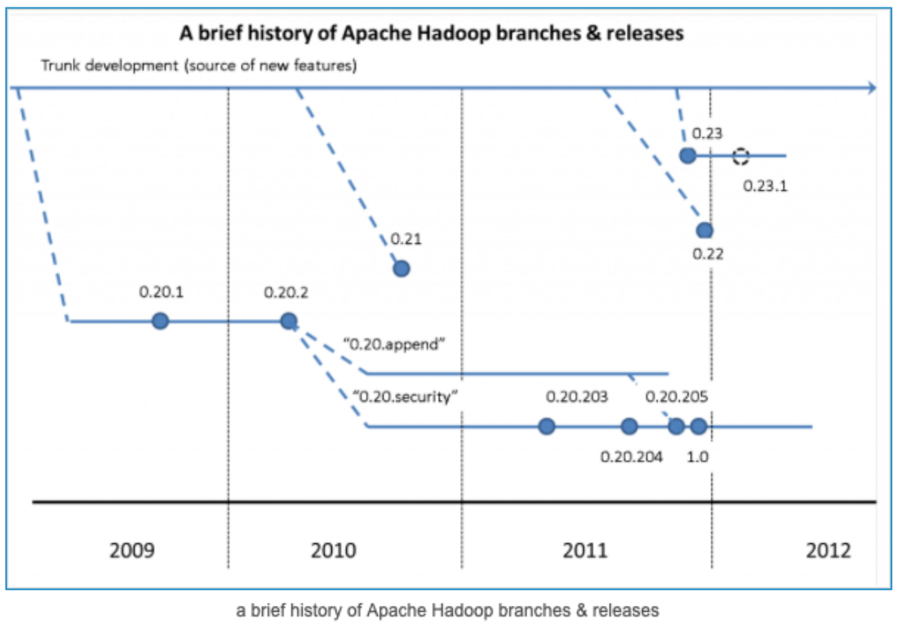

## 第六节 Hadoop的优缺点

- Hadoop的优点
  - Hadoop具有存储和处理数据能力的高可靠性。
  - Hadoop通过可用的计算机集群分配数据，完成存储和计算任务，这些集群可以方便地扩展到数以千计的节点中，具有高扩展性。
  - Hadoop能够在节点之间进行动态地移动数据，并保证各个节点的动态平衡，处理速度非常快，具有高效性。
  - Hadoop能够自动保存数据的多个副本，并且能够自动将失败的任务重新分配，具有高容错性。

- Hadoop的缺点
  - Hadoop不适用于低延迟数据访问。
  - Hadoop不能高效存储大量小文件。
  - Hadoop不支持多用户写入并任意修改文件。

# 第三部分 Apache Hadoop的重要组成

Hadoop=HDFS(分布式文件系统)+MapReduce(分布式计算框架)+Yarn(资源协调框架)+Common模块

1. #### Hadoop HDFS：（Hadoop Distribute File System ）一个高可靠、高吞吐量的分布式文件系统

   比如：100T数据存储，
   “分而治之”
   分：拆分 -> 数据切割，100T数据拆分为10G一个数据块由一个电脑节点存储这个数据块。

   数据切割、制作副本、分散储存

   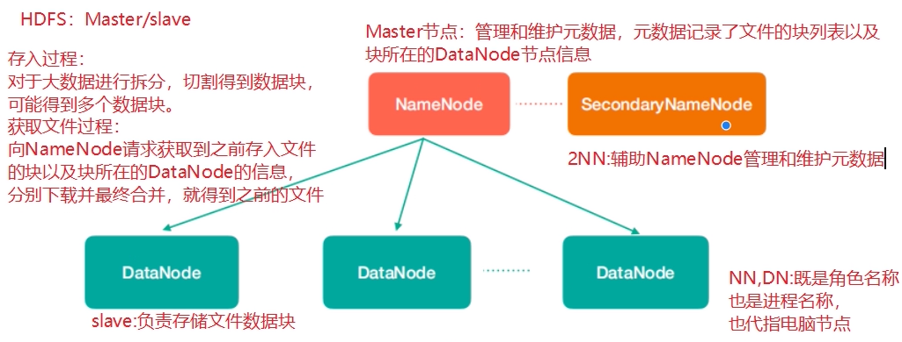

   图中涉及到几个角色

   **NameNode（nn）**： 存储文件的元数据，比如文件名、文件目录结构、文件属性（生成时间、副本数、文件权限），以及每个文件的块列表和块所在的DataNode等。

   **SecondaryNameNode（2nn）**： 辅助NameNode更好的工作，用来监控HDFS状态的辅助后台程序，每隔一段时间获取HDFS元数据快照。

   **DataNode（dn）**： 在本地文件系统存储文件块数据，以及块数据的校验

   注意：NN，2NN,DN这些既是角色名称，进程名称，代指电脑节点名称！！

2. #### Hadoop MapReduce：一个分布式的离线并行计算框架

   拆解任务、分散处理、汇整结果

   **MapReduce计算 = Map阶段 + Reduce阶段**

   Map阶段就是“分”的阶段，并行处理输入数据；

   Reduce阶段就是“合”的阶段，对Map阶段结果进行汇总；

   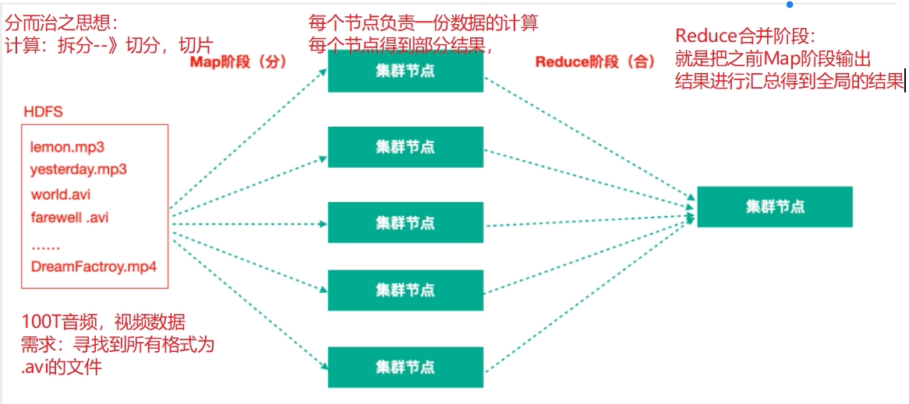

3. #### Hadoop YARN：作业调度与集群资源管理的框架

   计算资源协调

   Yarn中有如下几个主要角色，同样，既是角色名、也是进程名，也指代所在计算机节点名称。

   ResourceManager(rm)： 处理客户端请求、启动/监控ApplicationMaster、监控NodeManager、资源分配与调度；

   NodeManager(nm)： 单个节点上的资源管理、处理来自ResourceManager的命令、处理来自ApplicationMaster的命令；

   ApplicationMaster(am)： 数据切分、为应用程序申请资源，并分配给内部任务、任务监控与容错。

   Container： 对任务运行环境的抽象，封装了CPU、内存等多维资源以及环境变量、启动命令等任务运行相关的信息。

   ResourceManager是老大，NodeManager是小弟，ApplicationMaster是计算任务专员。

   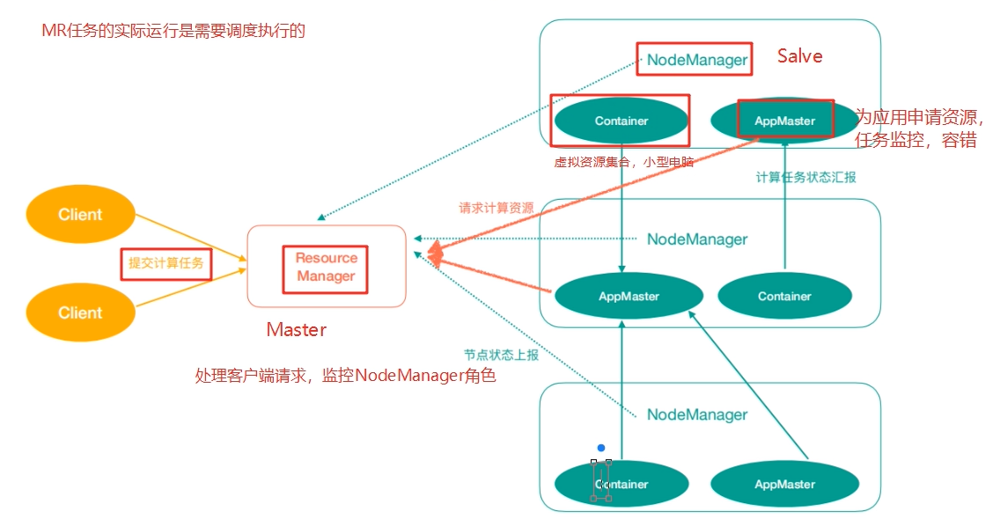

4. #### Hadoop Common：支持其他模块的工具模块（Configuration、RPC、序列化机制、日志操作）

# 第四部分 Apache Hadoop 完全分布式集群

- 软件和操作系统版本
  - Hadoop框架是采用Java语言编写，需要java环境（jvm）
  - JDK版本：JDK8版本
  - 集群：
  - 知识点学习：统一使用vmware虚拟机虚拟三台linux节点，linux操作系统：Centos
  - 项目阶段：统一使用云服务器， 5 台云服务器节点

- Hadoop搭建方式
  - 单机模式：单节点模式，非集群，生产不会使用这种方式
  - 单机伪分布式模式：单节点，多线程模拟集群的效果，生产不会使用这种方式
  - 完全分布式模式：多台节点，真正的分布式Hadoop集群的搭建（生产环境建议使用这种方式）

## 第一节 虚拟机环境准备

1. 三台虚拟机（静态IP，关闭防火墙，修改主机名，配置免密登录，集群时间同步）

2. 在/opt目录下创建文件夹

   ```
   mkdir -p /opt/lagou/software  --软件安装包存放目录
   mkdir -p /opt/lagou/servers --软件安装目录
   ```

3. Hadoop下载地址：

   ```
   https://archive.apache.org/dist/hadoop/common/hadoop-2.9.2/
   ```

   Hadoop官网地址：

   ```
   http://hadoop.apache.org/
   ```

4. 上传hadoop安装文件到/opt/lagou/software

## 第二节 集群规划

| 框架 | hadoop121          | hadoop122   | hadoop123                    |
| ---- | ------------------ | ----------- | ---------------------------- |
| HDFS | NameNode、DataNode | DataNode    | SecondaryNameNode、DataNode  |
| YARN | NodeManager        | NodeManager | NodeManager、ResourceManager |


## 第三节 安装Hadoop

- 登录hadoop121节点；进入/opt/lagou/software,解压安装文件到/opt/lagou/servers

  ```shell
  tar -zxvf hadoop-2.9.2.tar.gz -C /opt/lagou/servers
  ```

- 查看是否解压成功

  ```shell
  ll /opt/lagou/servers/hadoop-2.9.2
  ```

  


- 添加Hadoop到环境变量 vim /etc/profile

  ```shell
  ##HADOOP_HOME
  export HADOOP_HOME=/opt/lagou/servers/hadoop-2.9.2
  export PATH=$PATH:$HADOOP_HOME/bin
  export PATH=$PATH:$HADOOP_HOME/sbin
  ```

  

- 使环境变量生效

  ```shell
  source /etc/profile
  ```

  


- 验证hadoop

  ```shell
  hadoop version
  ```

  校验结果

  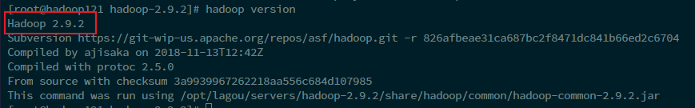

- hadoop目录

  ```
  drwxr-xr-x. 2 501 dialout    194 11月 13 2018 bin
  drwxr-xr-x. 3 501 dialout     20 11月 13 2018 etc
  drwxr-xr-x. 2 501 dialout    106 11月 13 2018 include
  drwxr-xr-x. 3 501 dialout     20 11月 13 2018 lib
  drwxr-xr-x. 2 501 dialout    239 11月 13 2018 libexec
  -rw-r--r--. 1 501 dialout 106210 11月 13 2018 LICENSE.txt
  -rw-r--r--. 1 501 dialout  15917 11月 13 2018 NOTICE.txt
  -rw-r--r--. 1 501 dialout   1366 11月 13 2018 README.txt
  drwxr-xr-x. 3 501 dialout   4096 11月 13 2018 sbin
  drwxr-xr-x. 4 501 dialout     31 11月 13 2018 share
  
  1. bin目录:对Hadoop进行操作的相关命令，如hadoop,hdfs等
  2. etc目录：Hadoop的配置文件目录，入hdfs-site.xml,core-site.xml等
  3. lib目录：Hadoop本地库（解压缩的依赖）
  4. sbin目录：存放的是Hadoop集群启动停止相关脚本，命令
  5. share目录：Hadoop的一些jar,官方案例jar，文档等
  ```

  

### 3.1 集群配置

Hadoop集群配置 = HDFS集群配置 + MapReduce集群配置 + Yarn集群配置

- HDFS集群配置
  1. 将JDK路径明确配置给HDFS（修改hadoop-env.sh）
  2. 指定NameNode节点以及数据存储目录（修改core-site.xml）
  3. 指定SecondaryNameNode节点（修改hdfs-site.xml）
  4. 指定DataNode从节点（修改etc/hadoop/slaves文件，每个节点配置信息占一行）

- MapReduce集群配置
  1. 将JDK路径明确配置给MapReduce（修改mapred-env.sh）
  2. 指定MapReduce计算框架运行Yarn资源调度框架（修改mapred-site.xml）

- Yarn集群配置
  1. 将JDK路径明确配置给Yarn（修改yarn-env.sh）
  2. 指定ResourceManager老大节点所在计算机节点（修改yarn-site.xml）
  3. 指定NodeManager节点（会通过slaves文件内容确定）


集群配置具体步骤：

##### HDFS集群配置

```
cd /opt/lagou/servers/hadoop-2.9.2/etc/hadoop
```

-  配置：hadoop-env.sh 

  将JDK路径明确配置给HDFS 

```shell
vim hadoop-env.sh


export JAVA_HOME=/opt/lagou/servers/jdk1.8.0_231
```

 指定NameNode节点以及数据存储目录（修改core-site.xml） 

```xml
vim core-site.xml

<!-- 指定HDFS中NameNode的地址 -->
<property>
    <name>fs.defaultFS</name>
    <value>hdfs://hadoop121:9000</value>
</property>
<!-- 指定Hadoop运行时产生文件的存储目录 -->
<property>
    <name>hadoop.tmp.dir</name>
    <value>/opt/lagou/servers/hadoop-2.9.2/data/tmp</value>
</property>

```

 core-site.xml的默认配置：  

```
https://hadoop.apache.org/docs/r2.9.2/hadoop-project-dist/hadoop-common/coredefault.xml
```

-  指定secondarynamenode节点(修改hdfs-site.xml)  

  ```xml
  vim hdfs-site.xml
  
  
  <!-- 指定Hadoop辅助名称节点主机配置 -->
  <property>
      <name>dfs.namenode.secondary.http-address</name>
      <value>hadoop123:50090</value>
  </property>
  <!--副本数量 -->
  <property>
      <name>dfs.replication</name>
      <value>3</value>
  </property>
  
  ```

   官方默认配置 

  ```
  https://hadoop.apache.org/docs/r2.9.2/hadoop-project-dist/hadoop-hdfs/hdfsdefault.xml
  ```

  

- 指定datanode从节点(修改slaves文件，每个节点配置信息占一行)  

  ```shell
  vim slaves
  
  
  hadoop121
  hadoop122
  hadoop123
  ```

   **注意：该文件中添加的内容结尾不允许有空格，文件中不允许有空行。** 


#####  MapReduce集群配置 

-  指定MapReduce使用的jdk路径（修改mapred-env.sh）  

  ```
  vim mapred-env.sh
  
  export JAVA_HOME=/opt/lagou/servers/jdk1.8.0_231
  
  ```

  

-  指定MapReduce计算框架运行Yarn资源调度框架(修改mapred-site.xml)  

  ```xml
  mv mapred-site.xml.template mapred-site.xml
  vim mapred-site.xml
  
  
  <!-- 指定MR运行在Yarn上 -->
  <property>
      <name>mapreduce.framework.name</name>
      <value>yarn</value>
  </property>
  ```


 mapred-site.xml默认配置  

```
https://hadoop.apache.org/docs/r2.9.2/hadoop-mapreduce-client/hadoop-mapreduceclient-core/mapred-default.xml

```


##### Yarn集群配置

- 指定JDK路径

  ```
  vim yarn-env.sh
  export JAVA_HOME=/opt/lagou/servers/jdk1.8.0_231  
  ```

  

- 指定ResourceMnager的master节点信息(修改yarn-site.xml)

  ```xml
  vim yarn-site.xml
  
  
  <!-- 指定YARN的ResourceManager的地址 -->
  <property>
      <name>yarn.resourcemanager.hostname</name>
      <value>hadoop123</value>
  </property>
  
  <!-- Reducer获取数据的方式 -->
  <property>
      <name>yarn.nodemanager.aux-services</name>
      <value>mapreduce_shuffle</value>
  </property>
  ```

   yarn-site.xml的默认配置  

  ```
  https://hadoop.apache.org/docs/r2.9.2/hadoop-yarn/hadoop-yarn-common/yarn-default.xml
  ```

-  指定NodeManager节点

  - 与datanode共用（slaves文件已修改） 


 注意： 

Hadoop安装目录所属用户和所属用户组信息，默认是501 dialout，而我们操作Hadoop集群的用户使 用的是虚拟机的root用户，

 所以为了避免出现信息混乱，修改Hadoop安装目录所属用户和用户组！！ 

```shell
chown -R root:root /opt/lagou/servers/hadoop-2.9.2
```


### 3.2 分发配置

#### 编写集群分发脚本rsync-script

- rsync 远程同步工具

  rsync主要用于备份和镜像。具有速度快、避免复制相同内容和支持符号链接的优点。

  rsync和scp区别：用rsync做文件的复制要比scp的速度快，rsync只对 差异文件做更新 。scp是把所有文
  件都复制过去。

1. 基本语法

   ```
   rsync 	 -rvl 		$pdir/$fname 		  $user@$host:$pdir/$fname
   命令		选项参数 	要拷贝的文件路径/名称 	目的用户@主机:目的路径/名称
   ```

   

2. 选项参数说明

   | 选项 | 功能         |
   | ---- | ------------ |
   | -r   | 递归         |
   | -v   | 显示复制过程 |
   | -l   | 拷贝符号连接 |

   

rsync案例

1. 三台虚拟机安装rsync (执行安装需要保证机器联网)

   ```
   [root@121 ~]# yum install -y rsync
   ```

   

2. 把hadoop121机器上的/opt/lagou/software目录同步到hadoop122服务器的root用户下的/opt/目录

   ```
   [root@hadoop121 opt]$ rsync -rvl /opt/lagou/software/ root@hadoop122:/opt/lagou/software
   ```

   

- 集群分发脚本编写


1. 需求：循环复制文件到集群所有节点的相同目录下

   rsync命令原始拷贝：

   ```
	rsync 	-rvl 	/opt/module 	root@hadoop123:/opt/
   ```

   
   
2. 期望脚本

脚本+要同步的文件名称

3. 说明：在/usr/local/bin这个目录下存放的脚本，root用户可以在系统任何地方直接执行。
4. 脚本实现

（ 1 ）在/usr/local/bin目录下创建文件rsync-script，文件内容如下：

```
[root@hadoop121 bin]# touch rsync-script

[root@hadoop121 bin]# vim rsync-script
```

在文件中编写shell代码

```shell
#!/bin/bash
#1 获取命令输入参数的个数，如果个数为0，直接退出命令
paramnum=$#
if((paramnum==0)); then
echo no params;
exit;
fi

#2 根据传入参数获取文件名称
p1=$1
file_name=`basename $p1`
echo fname=$file_name

#3 获取输入参数的绝对路径
pdir=`cd -P $(dirname $p1); pwd`
echo pdir=$pdir

#4 获取用户名称
user=`whoami`

#5 循环执行rsync
for((host=121; host<124; host++)); do
echo ------------------- linux$host --------------
rsync -rvl $pdir/$file_name $user@hadoop$host:$pdir

done
```

（ 2 ）修改脚本 rsync-script 具有执行权限

```
[root@linux121 bin]$ chmod 777 rsync-script
```

（ 3 ）调用脚本形式：rsync-script 文件名称

```
[root@linux121 bin]$ rsync-script /home/root/bin
```

(4) 调用脚本分发Hadoop安装目录到其它节点

```
[root@linux121 bin]$ rsync-script /opt/lagou/servers/hadoop-2.9.2
```

## 第四节 启动集群

**注意：如果集群是第一次启动，需要在Namenode所在节点格式化NameNode，非第一次不用执行格式化Namenode操作！！**

### 4.1 单节点启动

```
[root@linux121 hadoop-2.9.2]$ hadoop namenode -format
```

格式化命令执行效果：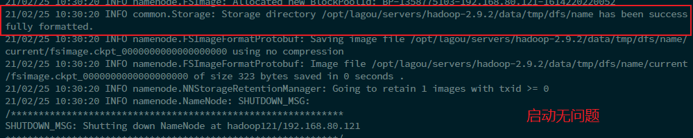

格式化后创建的文件：/opt/lagou/servers/hadoop-2.9.2/data/tmp/dfs/name/current

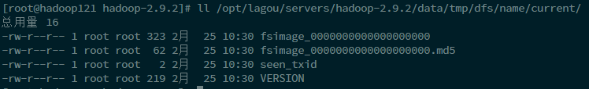

1. 在linux121上启动NameNode

   ```
   [root@hadoop121 hadoop-2.9.2]# hadoop-daemon.sh start namenode
   [root@hadoop121 hadoop-2.9.2]# jps
   2005 Jps
   1931 NameNode
   ```

   

2. 在linux121、linux122以及linux123上分别启动DataNode

   ```shell
   [root@hadoop121 hadoop-2.9.2]# hadoop-daemon.sh start datanode
   [root@hadoop121 hadoop-2.9.2]# jps
   2106 Jps
   1931 NameNode
   2028 DataNode
   
   [root@hadoop122 sbin]# hadoop-daemon.sh start datanode
   [root@hadoop122 sbin]# jps
   2034 Jps
   1967 DataNode
   
   [root@hadoop123 sbin]# hadoop-daemon.sh start datanode
   [root@hadoop123 sbin]# jps
   1971 DataNode
   2038 Jps
   ```

3. web端查看Hdfs界面

   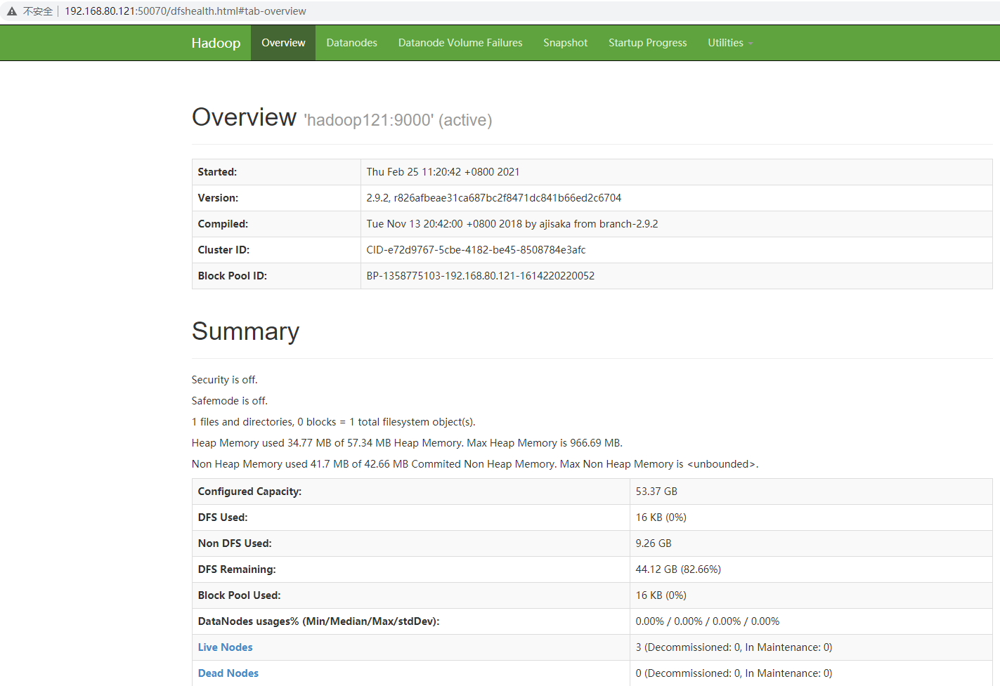

查看HDFS集群正常节点：

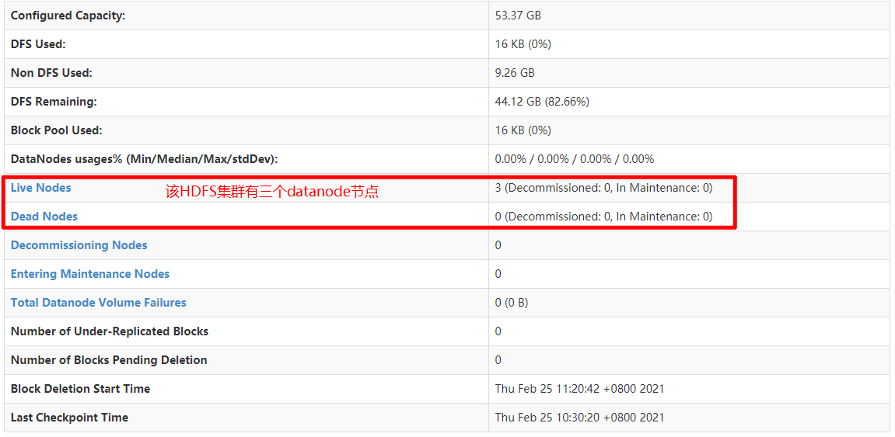

1. Yarn集群单节点启动

```shell
[root@hadoop123 hadoop]# yarn-daemon.sh start resourcemanager
[root@hadoop123 hadoop]# jps
2914 Jps
1971 DataNode
2697 ResourceManager

[root@hadoop122 hadoop]# yarn-daemon.sh start nodemanager
[root@hadoop122 hadoop]# jps
2608 Jps
2510 NodeManager
1967 DataNode

[root@hadoop121 servers]# yarn-daemon.sh start nodemanager
[root@hadoop121 servers]# jps
2665 Jps
1931 NameNode
2028 DataNode
2556 NodeManager
```


2. 思考：Hadoop集群每次需要一个一个节点的启动，如果节点数增加到成千上万个怎么办？

### 4.2 集群群起

1. **如果已经单节点方式启动了Hadoop,可以先停止之前的启动的Namenode与Datanode进程,如果之前Namenode没有执行格式化，这里需要执行格式化!!!!**

  ```
  hadoop namenode -format
  ```

  

2. 启动HDFS

   ```
   [root@hadoop121 hadoop-2.9.2]# ./sbin/start-dfs.sh 
   [root@hadoop121 hadoop-2.9.2]# jps
   3843 DataNode
   4051 Jps
   3709 NameNode
   
   [root@hadoop122 hadoop-2.9.2]$ jps
   3218 DataNode
   3288 Jps
   
   [root@hadoop123 hadoop-2.9.2]$ jps
   3221 DataNode
   3283 SecondaryNameNode
   3364 Jps
   ```

   

3. 启动YARN

   ```
   [root@hadoop123 hadoop-2.9.2]$ sbin/start-yarn.sh
   ```

   

**注意：NameNode和ResourceManger不是在同一台机器，不能在NameNode上启动 YARN，应该在ResouceManager所在的机器上启动YARN。**


### 4.3 Hadoop集群启动停止命令汇总

1. 各个服务组件逐一启动/停止

```
（ 1 ）分别启动/停止HDFS组件
hadoop-daemon.sh  start / stop namenode / datanode / secondarynamenode

（ 2 ）启动/停止YARN
yarn-daemon.sh  start / stop resourcemanager / nodemanager

```


2. 各个模块分开启动/停止（配置ssh是前提）常用

```
（ 1 ）整体启动/停止HDFS
start-dfs.sh / stop-dfs.sh

（ 2 ）整体启动/停止YARN
start-yarn.sh / stop-yarn.sh
```


## 第五节 集群测试

1. HDFS 分布式存储初体验

从linux本地文件系统上传下载文件验证HDFS集群工作正常

```shell
hdfs dfs -mkdir -p /test/input
#本地hoome目录创建一个文件
cd /root

vim test.txt

hello hdfs

#上传linxu文件到Hdfs
hdfs dfs -put /root/test.txt /test/input

#从Hdfs下载文件到linux本地
hdfs dfs -get /test/input/test.txt
```


2. MapReduce 分布式计算初体验

- 在HDFS文件系统根目录下面创建一个wcinput文件夹

  ```
  [root@hadoop121 hadoop-2.9.2]# hdfs dfs -mkdir /wcinput
  ```

  


- 在/root/目录下创建一个wc.txt文件(本地文件系统)

  ```
  [root@hadoop121 hadoop-2.9.2]# cd ~
  
  [root@hadoop121 ~]# touch wc.txt
  ```

  


- 编辑wc.txt文件

  ```
  [root@hadoop121 ~]# vim wc.txt 
  ```

  

- 在文件中输入如下内容

  ```
  hadoop mapreduce yarn
  hdfs hadoop mapreduce
  mapreduce yarn lagou
  lagou
  lagou
  
  ```

- 保存退出

  ```
  :wq
  ```

  


- 上传wc.txt到Hdfs目录/wcinput下

```
hdfs dfs -put wc.txt /wcinput
```


- 回到Hadoop目录/opt/lagou/servers/hadoop-2.9.2

- 执行程序

  ```
  [root@hadoop121 hadoop-2.9.2]# hadoop jar share/hadoop/mapreduce/hadoop-mapreduce-examples-2.9.2.jar wordcount /wcinput /wcoutput
  ```

  

- 查看结果

  ```
  [root@hadoop121 hadoop-2.9.2]#  hdfs dfs -cat /wcoutput/part-r-00000
  hadoop  2
  hdfs    1
  lago    1
  lagou   2
  mapreduce       3
  yarn    2
  ```

  


## 第六节 配置历史服务器

在Yarn中运行的任务产生的日志数据不能查看，为了查看程序的历史运行情况，需要配置一下历史日志
服务器。具体配置步骤如下：

1. 配置mapred-site.xml

   ```
   [root@hadoop121 hadoop]$ vi mapred-site.xml
   ```

   在该文件里面增加如下配置。

   ```xml
   <!-- 历史服务器端地址 -->
   <property>
       <name>mapreduce.jobhistory.address</name>
       <value>hadoop121:10020</value>
   </property>
   
   <!-- 历史服务器web端地址 -->
   <property>
       <name>mapreduce.jobhistory.webapp.address</name>
       <value>hadoop121:19888</value>
   </property>
   
   ```

   

2. 分发mapred-site.xml到其它节点

   ```
   rsync-script mapred-site.xml
   ```

   

3. 启动历史服务器

   ```
   [root@hadoop121 hadoop-2.9.2]$ sbin/mr-jobhistory-daemon.sh start historyserver
   ```

   

4. 查看历史服务器是否启动

   ```
   [root@hadoop121 hadoop-2.9.2]# jps
   7602 JobHistoryServer
   6902 DataNode
   7670 Jps
   6765 NameNode
   ```
   
   
   
5. 查看JobHistory

   ```
   http://hadoop121:19888/jobhistory
   ```

   

### 6.1 配置日志的聚集

日志聚集：应用(Job)运行完成以后，将应用运行日志信息从各个task汇总上传到HDFS系统上。

日志聚集功能好处：可以方便的查看到程序运行详情，方便开发调试。

**注意：开启日志聚集功能，需要重新启动NodeManager 、ResourceManager和HistoryManager。**

开启日志聚集功能具体步骤如下：

1. 配置yarn-site.xml

   ```
   [root@hadoop121 hadoop]$ vim yarn-site.xml
   ```

   

   在该文件里面增加如下配置。

   ```xml
   <!-- 日志聚集功能使能 -->
   <property>
       <name>yarn.log-aggregation-enable</name>
       <value>true</value>
   </property>
   
   <!-- 日志保留时间设置 7 天 -->
   <property>
       <name>yarn.log-aggregation.retain-seconds</name>
       <value>604800</value>
   </property>
   
   ```

   

2. 分发yarn-site.xml到集群其它节点

   ```
   rsync-script yarn-site.xml
   ```

   

3. 关闭NodeManager 、ResourceManager和HistoryManager

   ```
   [root@hadoop123 hadoop-2.9.2]# sbin/stop-yarn.sh 
   
   [root@hadoop121 hadoop-2.9.2]$ sbin/mr-jobhistory-daemon.sh stop historyserver
   ```

   

4. 启动NodeManager 、ResourceManager和HistoryManager

   ```
   [root@hadoop121 hadoop-2.9.2]$ sbin/mr-jobhistory-daemon.sh start historyserver
   
   [root@hadoop123 hadoop-2.9.2]# sbin/start-yarn.sh 
   ```

   

4. 删除HDFS上已经存在的输出文件

   ```
   [root@hadoop121 hadoop-2.9.2]$ bin/hdfs dfs -rm -R /wcoutput
   ```

   

5. 执行WordCount程序

   ```
   [root@hadoop121 hadoop-2.9.2]$ hadoop jar share/hadoop/mapreduce/hadoop-mapreduce-examples-2.9.2.jar wordcount /wcinput /wcoutput
   ```

   

6. 查看日志，如图所示

   ```
   http://linux121:19888/jobhistory
   ```

   

   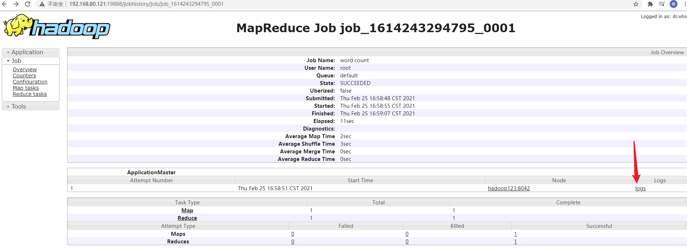

   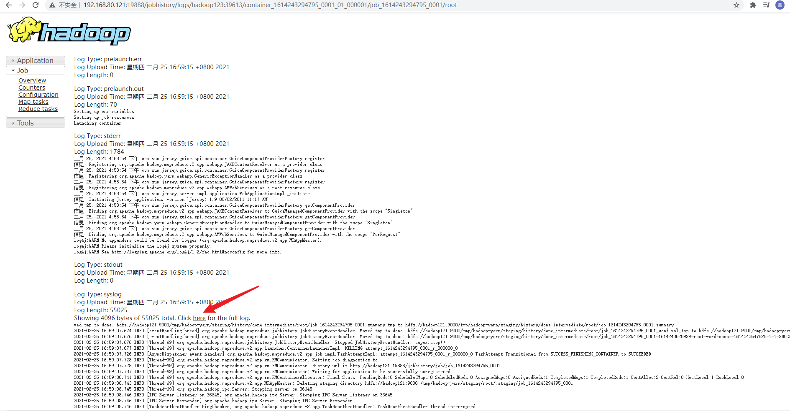


