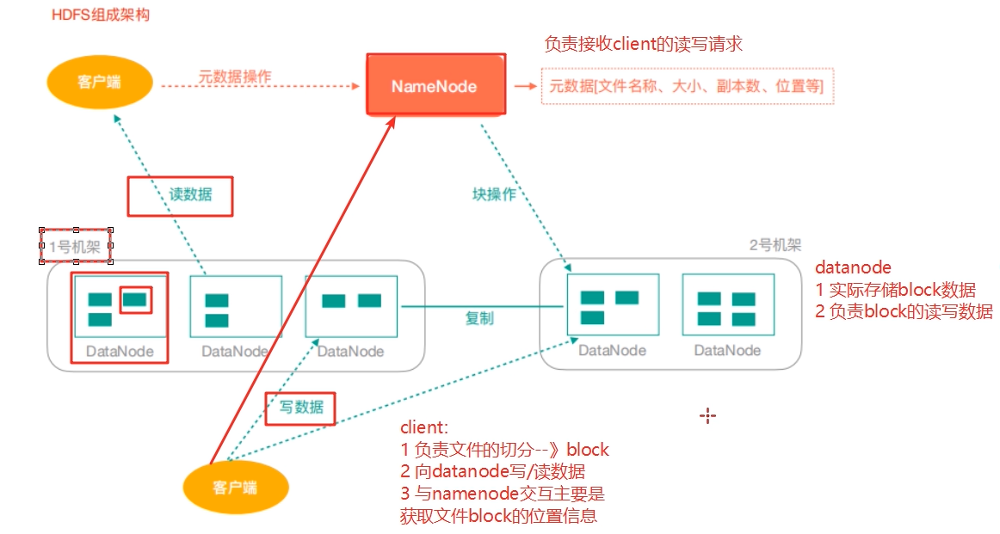
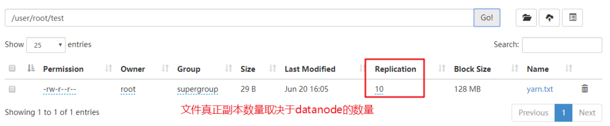
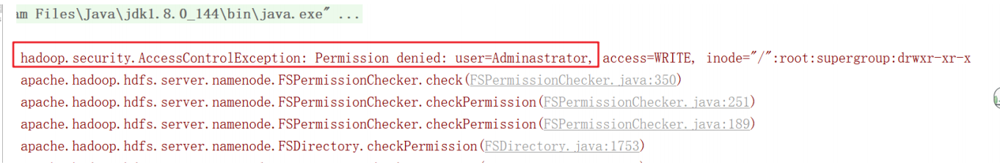
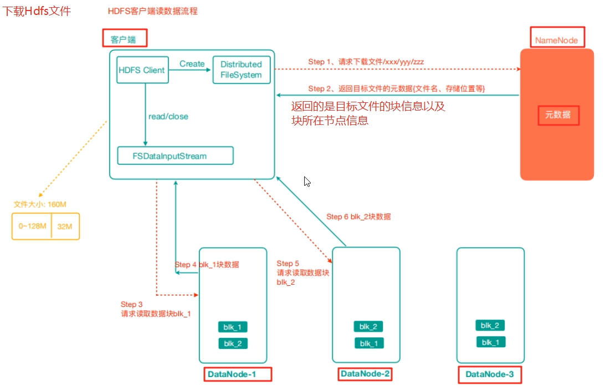
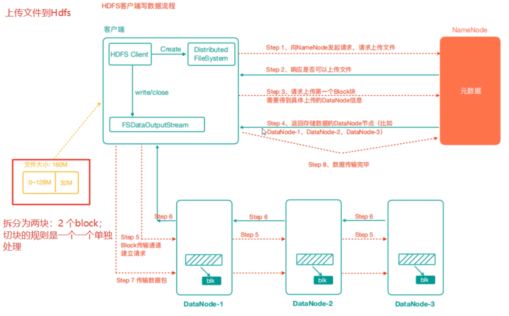
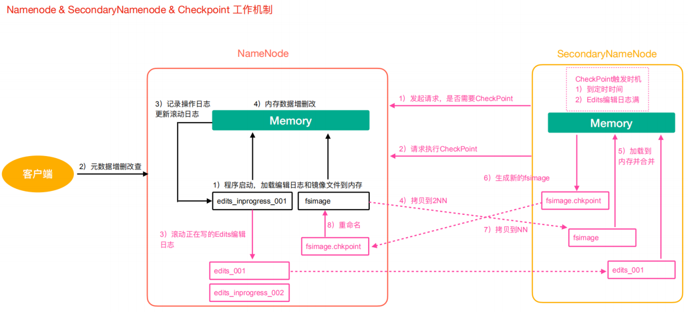
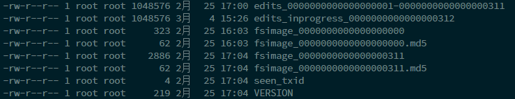
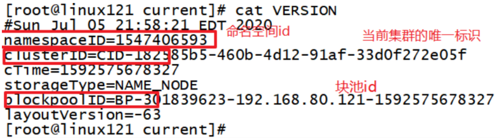
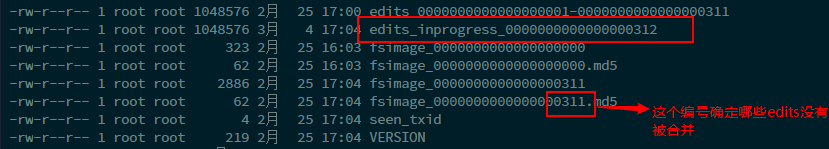
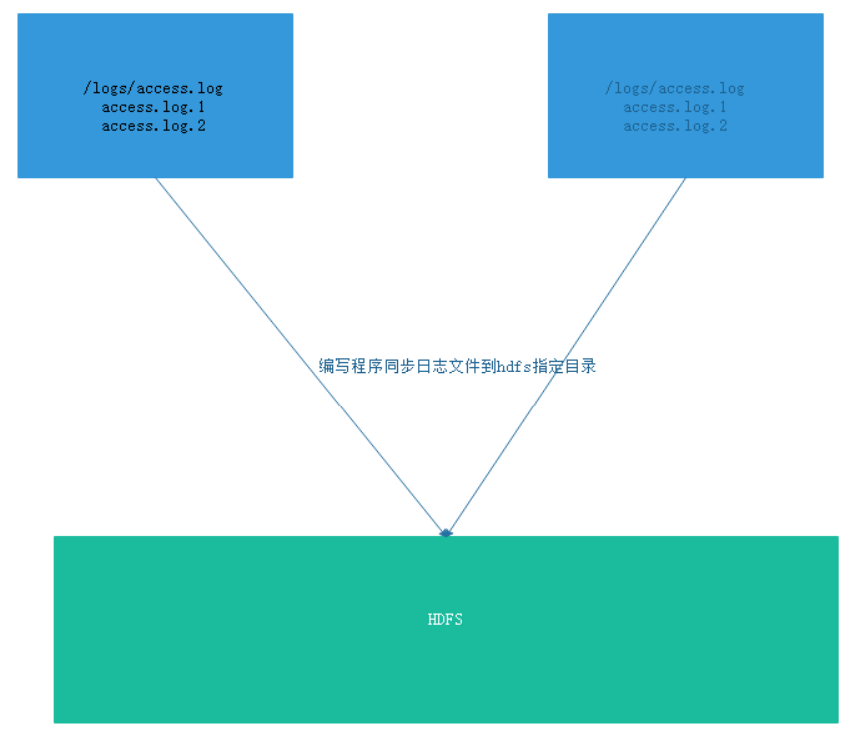

第五部分 HDFS分布式文件系统

## 第一节 HDFS 简介

HDFS （全称：Hadoop Distribute File System，Hadoop 分布式文件系统）是 Hadoop 核心组成，是分布式 存储 服务。

分布式文件系统横跨多台计算机，在大数据时代有着广泛的应用前景，它们为存储和处理超大规模数据提供所需的扩展能力。

HDFS是分布式文件系统中的一种。

## 第二节 HDFS的重要概念

HDFS 通过统一的命名空间目录树来定位文件； 另外，它是分布式的，由很多服务器联合起来实现其功能，集群中的服务器有各自的角色（分布式本质是拆分，各司其职）；

- ##### 典型的 Master/Slave 架构

  - HDFS 的架构是典型的 Master/Slave 结构。
  - HDFS集群往往是一个NameNode（HA架构会有两个NameNode,联邦机制）+多个DataNode组成；
  - NameNode是集群的主节点，DataNode是集群的从节点。

- ##### 分块存储（block机制）

  - HDFS 中的文件在物理上是分块存储（block）的，块的大小可以通过配置参数来规定；
  - Hadoop2.x版本中默认的block大小是128M；

- ##### 命名空间（NameSpace）

  - HDFS 支持传统的层次型文件组织结构。用户或者应用程序可以创建目录，然后将文件保存在这些目录里。文件系统名字空间的层次结构和大多数现有的文件系统类似：用户可以创建、删除、移动或重命名文件。
  - Namenode 负责维护文件系统的名字空间，任何对文件系统名字空间或属性的修改都将被Namenode 记录下来。
  - HDFS提供给客户单一个抽象目录树，访问形式：hdfs://namenode的hostname:port/test/input
  - hdfs://hadoop121:9000/test/input

- ##### NameNode元数据管理

  - 我们把目录结构及文件分块位置信息叫做元数据。
  - NameNode的元数据记录每一个文件所对应的block信息（block的id,以及所在的DataNode节点的信息）

- ##### DataNode数据存储

  - 文件的各个 block 的具体存储管理由 DataNode 节点承担。一个block会有多个DataNode来存储，DataNode会定时向NameNode来汇报自己持有的block信息。

- ##### 副本机制

  - 为了容错，文件的所有 block 都会有副本。每个文件的 block 大小和副本系数都是可配置的。应用程序可以指定某个文件的副本数目。副本系数可以在文件创建的时候指定，也可以在之后改变。副本数量默认是 3 个。

- ##### 一次写入，多次读出

  - HDFS 是设计成适应一次写入，多次读出的场景，且不支持文件的随机修改。 （支持追加写入，不只支持随机更新）
  - 正因为如此，HDFS 适合用来做大数据分析的底层存储服务，并不适合用来做网盘等应用（修改不方便，延迟大，网络开销大，成本太高）

## 第三节 HDFS 架构



- NameNode(nn):Hdfs集群的管理者，Master
  - 维护管理Hdfs的名称空间（NameSpace）
  - 维护副本策略
  - 记录文件块（Block）的映射信息
  - 负责处理客户端读写请求
- DataNode:NameNode下达命令，DataNode执行实际操作，Slave节点。
  - 保存实际的数据块
  - 负责数据块的读写
- Client:客户端
  - 上传文件到HDFS的时候，Client负责将文件切分成Block,然后进行上传
  - 请求NameNode交互，获取文件的位置信息
  - 读取或写入文件，与DataNode交互
  - Client可以使用一些命令来管理HDFS或者访问HDFS

## 第四节 HDFS 客户端操作

### 4.1 Shell 命令行操作HDFS

#### 基本语法

```
bin/hadoop fs 具体命令 OR bin/hdfs dfs 具体命令
```


#### 命令大全

```
[root@linux121 hadoop-2.9.2]# bin/hdfs dfs
Usage: hadoop fs [generic options]
    [-appendToFile <localsrc> ... <dst>]
    [-cat [-ignoreCrc] <src> ...]
    [-checksum <src> ...]
    [-chgrp [-R] GROUP PATH...]
    [-chmod [-R] <MODE[,MODE]... | OCTALMODE> PATH...]
    [-chown [-R] [OWNER][:[GROUP]] PATH...]
    [-copyFromLocal [-f] [-p] [-l] [-d] <localsrc> ... <dst>]
    [-copyToLocal [-f] [-p] [-ignoreCrc] [-crc] <src> ... <localdst>]
    [-count [-q] [-h] [-v] [-t [<storage type>]] [-u] [-x] <path> ...]
    [-cp [-f] [-p | -p[topax]] [-d] <src> ... <dst>]
    [-createSnapshot <snapshotDir> [<snapshotName>]]
    [-deleteSnapshot <snapshotDir> <snapshotName>]
    [-df [-h] [<path> ...]]
    [-du [-s] [-h] [-x] <path> ...]
    [-expunge]
    [-find <path> ... <expression> ...]
    [-get [-f] [-p] [-ignoreCrc] [-crc] <src> ... <localdst>]
    [-getfacl [-R] <path>]
    [-getfattr [-R] {-n name | -d} [-e en] <path>]
    [-getmerge [-nl] [-skip-empty-file] <src> <localdst>]
    [-help [cmd ...]]
    [-ls [-C] [-d] [-h] [-q] [-R] [-t] [-S] [-r] [-u] [<path> ...]]
    [-mkdir [-p] <path> ...]
    [-moveFromLocal <localsrc> ... <dst>]
    [-moveToLocal <src> <localdst>]
    [-mv <src> ... <dst>]
    [-put [-f] [-p] [-l] [-d] <localsrc> ... <dst>]
    [-renameSnapshot <snapshotDir> <oldName> <newName>]
    [-rm [-f] [-r|-R] [-skipTrash] [-safely] <src> ...]
    [-rmdir [--ignore-fail-on-non-empty] <dir> ...]
    [-setfacl [-R] [{-b|-k} {-m|-x <acl_spec>} <path>]|[--set <acl_spec><path>]]
    [-setfattr {-n name [-v value] | -x name} <path>]
    [-setrep [-R] [-w] <rep> <path> ...]
    [-stat [format] <path> ...]
    [-tail [-f] <file>]
    [-test -[defsz] <path>]
    [-text [-ignoreCrc] <src> ...]
    [-touchz <path> ...]
    [-truncate [-w] <length> <path> ...]
    [-usage [cmd ...]]

Generic options supported are:
-conf <configuration file> specify an application configuration file
-D <property=value> define a value for a given property
-fs <file:///|hdfs://namenode:port> specify default filesystem URL to use, overrides 'fs.defaultFS' property from configurations.
-jt <local|resourcemanager:port> specify a ResourceManager
-files <file1,...> specify a comma-separated list of files to be copied to the map reduce cluster
-libjars <jar1,...> specify a comma-separated list of jar files to be included in the classpath
-archives <archive1,...> specify a comma-separated list of archives to be unarchived on the compute machines
```


#### HDFS命令演示

1. 启动Hadoop集群（方便后续的测试）

   ```
   [root@hadoop121 hadoop-2.9.2]$ sbin/start-dfs.sh
   [root@hadoop123 hadoop-2.9.2]$ sbin/start-yarn.sh
   ```

   

2. -help：输出这个命令参数

   ```
   [root@hadoop121 hadoop-2.9.2]$ hadoop fs -help rm
   ```

   

3. -ls: 显示目录信息

   ```
   [root@hadoop121 hadoop-2.9.2]$ hadoop fs -ls /
   ```

   

4. -mkdir：在HDFS上创建目录

   ```
   [root@hadoop121 hadoop-2.9.2]$ hadoop fs -mkdir -p /lagou/bigdata
   ```

   

5. -moveFromLocal：从本地剪切粘贴到HDFS

   ```
   [root@hadoop121 hadoop-2.9.2]$ touch hadoop.txt
   
   [root@hadoop121 hadoop-2.9.2]$ hadoop fs  -moveFromLocal ./hadoop.txt /lagou/bigdata
   ```

   

6. -appendToFile：追加一个文件到已经存在的文件末尾

   ```
   [root@hadoop121 hadoop-2.9.2]$ touch hdfs.txt
   [root@hadoop121 hadoop-2.9.2]$ vi hdfs.txt
   ```

   输入

   ```
   namenode datanode block replication
   
   [root@hadoop121 hadoop-2.9.2]$ hadoop fs -appendToFile hdfs.txt
   /lagou/bigdata/hadoop.txt
   ```

   

7. -cat：显示文件内容

   ```
   [root@hadoop121 hadoop-2.9.2]$ hadoop fs -cat /lagou/bigdata/hadoop.txt
   ```

   

8. -chgrp 、-chmod、-chown：Linux文件系统中的用法一样，修改文件所属权限

   ```
   [root@hadoop121 hadoop-2.9.2]$ hadoop fs  -chmod  666 /lagou/bigdata/hadoop.txt
   
   [root@hadoop121 hadoop-2.9.2]$ hadoop fs  -chown root:root/lagou/bigdata/hadoop.txt
   ```

   

9. -copyFromLocal：从本地文件系统中拷贝文件到HDFS路径去

   ```
   [root@hadoop121 hadoop-2.9.2]$ hadoop fs -copyFromLocal README.txt /
   ```

   

10. -copyToLocal：从HDFS拷贝到本地

    ```
    [root@hadoop121 hadoop-2.9.2]$ hadoop fs -copyToLocal /lagou/bigdata/hadoop.txt ./
    ```

    

11. -cp ：从HDFS的一个路径拷贝到HDFS的另一个路径

    ```
    [root@hadoop121 hadoop-2.9.2]$ hadoop fs -cp /lagou/bigdata/hadoop.txt /hdfs.txt
    ```

    

12. -mv：在HDFS目录中移动文件

    ```
    [root@hadoop121 hadoop-2.9.2]$ hadoop fs -mv /hdfs.txt /lagou/bigdata/
    ```

    

13. -get：等同于copyToLocal，就是从HDFS下载文件到本地

    ```
    [root@hadoop121 hadoop-2.9.2]$ hadoop fs -get /lagou/bigdata/hadoop.txt ./
    ```

    

14. -put：等同于copyFromLocal

    ```
    [root@hadoop121 hadoop-2.9.2]$ hadoop fs -mkdir -p /user/root/test/
    #本地文件系统创建yarn.txt
    [root@hadoop121 hadoop-2.9.2]$ vim yarn.txt
    resourcemanager nodemanager
    
    [root@hadoop121 hadoop-2.9.2]$ hadoop fs -put ./yarn.txt /user/root/test/
    ```

    

15. -tail：显示一个文件的末尾

    ```
    [root@hadoop121 hadoop-2.9.2]$ hadoop fs -tail /user/root/test/yarn.txt
    ```

    

16. -rm：删除文件或文件夹

    ```
    [root@hadoop121 hadoop-2.9.2]$ hadoop fs -rm /user/root/test/yarn.txt
    ```

    

17. -rmdir：删除空目录

    ```
    [root@hadoop121 hadoop-2.9.2]$ hadoop fs -mkdir /test
    [root@hadoop121 hadoop-2.9.2]$ hadoop fs -rmdir /test
    ```

    

18. -du统计文件夹的大小信息

    ```
    [root@hadoop121 hadoop-2.9.2]$ hadoop fs -du -s -h /user/root/test
    
    
    [root@hadoop121 hadoop-2.9.2]$ hadoop fs -du -h /user/root/test
    ```

    

19. -setrep：设置HDFS中文件的副本数量

    ```
    [root@hadoop121 hadoop-2.9.2]$ hadoop fs -setrep 10 /lagou/bigdata/hadoop.txt
    ```

    

这里设置的副本数只是记录在NameNode的元数据中，是否真的会有这么多副本，还得看DataNode的数量。因为目前只有 3 台设备，最多也就 3 个副本，只有节点数的增加到 10 台时，副本数才能达到 10 。

### 4.2 JAVA客户端

#### 4.2.1 客户端环境准备

1. 将Hadoop-2.9.2安装包解压到非中文路径（例如：E:\hadoop-2.9.2）。


2. 配置HADOOP_HOME环境变量


   3. 配置Path环境变量。


   4. 创建一个Maven工程ClientDemo

   5. 导入相应的依赖坐标+日志配置文件

      

      ```xml
          <!--hadoop-common , hadoop-client, hadoop-hdfs-->
      
          <dependencies>
      
              <dependency>
                  <groupId>junit</groupId>
                  <artifactId>junit</artifactId>
                  <version>RELEASE</version>
              </dependency>
              <dependency>
                  <groupId>org.apache.logging.log4j</groupId>
                  <artifactId>log4j-core</artifactId>
                  <version>2.8.2</version>
              </dependency>
      
              <!-- https://mvnrepository.com/artifact/org.apache.hadoop/hadoop-common -->
              <dependency>
                  <groupId>org.apache.hadoop</groupId>
                  <artifactId>hadoop-common</artifactId>
                  <version>2.9.2</version>
              </dependency>
              <!-- https://mvnrepository.com/artifact/org.apache.hadoop/hadoop-client -->
              <dependency>
                  <groupId>org.apache.hadoop</groupId>
                  <artifactId>hadoop-client</artifactId>
                  <version>2.9.2</version>
              </dependency>
              <!-- https://mvnrepository.com/artifact/org.apache.hadoop/hadoop-hdfs -->
              <dependency>
                  <groupId>org.apache.hadoop</groupId>
                  <artifactId>hadoop-hdfs</artifactId>
                  <version>2.9.2</version>
              </dependency>
          </dependencies>
      ```

      

      为了便于控制程序运行打印的日志数量，需要在项目的src/main/resources目录下，新建一个文件，命 名为“log4j.properties”，文件内容： 

      ```
      log4j.rootLogger=INFO, stdout
      log4j.appender.stdout=org.apache.log4j.ConsoleAppender
      log4j.appender.stdout.layout=org.apache.log4j.PatternLayout
      log4j.appender.stdout.layout.ConversionPattern=%d %p [%c] - %m%n
      log4j.appender.logfile=org.apache.log4j.FileAppender
      log4j.appender.logfile.File=target/spring.log
      log4j.appender.logfile.layout=org.apache.log4j.PatternLayout
      log4j.appender.logfile.layout.ConversionPattern=%d %p [%c] - %m%n
      ```

      

   6. 创建包名：com.	lagou.hdfs 

   7.  创建HdfsClient类 

      ```java
      public class HdfsClientDemo {
      
          @Test
          public void testMkdirs() throws URISyntaxException, IOException, InterruptedException {
      
              //1.获取Hadoop集群的configureation对象
              Configuration configuration = new Configuration();
      
              //2.根据configuration获取FileSystem对象
              // 配置在集群上运行
              // configuration.set("fs.defaultFS", "hdfs://hdfs://192.168.80.121:9000");
              // FileSystem fs = FileSystem.get(configuration);
              final FileSystem fs = FileSystem.get(new URI("hdfs://192.168.80.121:9000"), configuration, "root");
      
              //3.使用FileSystem对象创建一个测试目录
              fs.mkdirs(new Path("/api_test"));
      
              //4.释放FileSystem对象
              fs.close();
      
          }
      }
      ```

      

      如果不指定操作HDFS集群的用户信息，默认是获取当前操作系统的用户信息，出现权限被拒绝的问题，报错如下：

#### 4.2.2 HDFS的API操作

改造代码

```java

public class HdfsClientDemo {

    FileSystem fs = null;

    @Before
    public void init() throws URISyntaxException, IOException, InterruptedException {
        //1.获取Hadoop集群的configureation对象
        Configuration configuration = new Configuration();

        //2.根据configuration获取FileSystem对象
        // 配置在集群上运行
        // configuration.set("fs.defaultFS", "hdfs://hdfs://192.168.80.121:9000");
        // FileSystem fs = FileSystem.get(configuration);
        fs = FileSystem.get(new URI("hdfs://192.168.80.121:9000"), configuration, "root");

    }

    @After
    public void destory() throws IOException {
        //4.释放FileSystem对象
        fs.close();
    }

    @Test
    public void testMkdirs() throws URISyntaxException, IOException, InterruptedException {

        //3.使用FileSystem对象创建一个测试目录
        fs.mkdirs(new Path("/api_test2"));

    }

}
```

##### 1 上传文件

1. 编写源代码

   ```java
       @Test
       public void testCopyFromLocalFile() throws IOException, InterruptedException, URISyntaxException {
   
           // 上传文件
           // src ： 源文件目录 本地路径
           // dst ：目标文件目录 hdfs路径
           fs.copyFromLocalFile(new Path("d:/lagou.txt"), new Path("/lagou.txt"));
           // 上传文件到hdfs默认是3个副本，如果需要改变 1. configuration对象中指定dfs.replication新的副本数量；2. 在resources中配置hdfs-site.xml
       }
   ```
   
   
   
2. 将hdfs-site.xml拷贝到项目的根目录下

   ```xml
   <?xml version="1.0" encoding="UTF-8"?>
   <?xml-stylesheet type="text/xsl" href="configuration.xsl"?>
   
   <configuration>
       <property>
           <name>dfs.replication</name>
           <value>1</value>
       </property>
   </configuration>
   ```

3. 参数优先级

   参数优先级排序：（ 1 ）代码中设置的值 >（ 2 ）用户自定义配置文件 >（ 3 ）服务器的默认配置

##### 2 下载文件

```java
    @Test
    public void testCopyToLocalFile() throws IOException, InterruptedException, URISyntaxException {

        // 2 执行下载操作
        // boolean delSrc 指是否将原文件删除
        // Path src 指要下载的文件路径
        // Path dst 指将文件下载到的路径
        // boolean useRawLocalFileSystem 是否开启文件校验
        fs.copyToLocalFile(false, new Path("/lagou.txt"), new Path("d:/lagou_copy.txt"), true);

    }
```

##### 3 删除文件/文件夹

```java
    @Test
    public void testDelete() throws IOException, InterruptedException, URISyntaxException{

        //  执行删除
        fs.delete(new Path("/api_test/"), true);

    }

```


##### 4 查看文件名称、权限、长度、块信息

```java
@Test
public void testListFiles() throws IOException, InterruptedException, URISyntaxException{

    // 2 获取文件详情
    RemoteIterator<LocatedFileStatus> listFiles = fs.listFiles(new Path("/"), true);
    while(listFiles.hasNext()){
        LocatedFileStatus status = listFiles.next();
        // 输出详情
        // 文件名称
        System.out.println(status.getPath().getName());
        // 长度
        System.out.println(status.getLen());
        // 权限
        System.out.println(status.getPermission());
        // 分组
        System.out.println(status.getGroup());
        // 获取存储的块信息
        BlockLocation[] blockLocations = status.getBlockLocations();
        for (BlockLocation blockLocation : blockLocations) {
            // 获取块存储的主机节点
            String[] hosts = blockLocation.getHosts();
            for (String host : hosts) {
                System.out.println(host);
                }
            }
        System.out.println("-----------华丽的分割线----------");
    }
}
```


##### 5 文件夹判断6 I/O流操作HDFS

```java
   @Test
    public void isFile() throws IOException {
        final FileStatus[] fileStatuses = fs.listStatus(new Path("/"));
        for (FileStatus fileStatus : fileStatuses) {
            final boolean flag = fileStatus.isFile();
            if (flag) {
                System.out.println("文件" + fileStatus.getPath().getName());
            } else {
                System.out.println("文件夹" + fileStatus.getPath().getName());
            }

        }
    }
```

#####  6 I/O流操作HDFS  

以上我们使用的API操作都是HDFS系统框架封装好的。我们自己也可以采用IO流的方式实现文件的上传和下载。


###### 6.1 文件上传下载

```java
 // 使用IO流操作HDFS
    // 上传文件：准备输入流读取本地文件，使用hdfs的输出流写数据到hdfs
    @Test
    public void uploadFileIO() throws IOException {
        // 1.读取本地文件的输入流
        FileInputStream inputStream = new FileInputStream(new File("d:/lagou.txt"));
        // 2.准备写数据到hdfs的输出流
        FSDataOutputStream outputStream = fs.create(new Path("/lagou.txt"));
        // 3.输入流数据拷贝到输出流: 数组的到校以及是否关闭流底层 有默认值
        IOUtils.copyBytes(inputStream, outputStream, configuration);
        // 4. 在次关闭流
        IOUtils.closeStream(outputStream);
        IOUtils.closeStream(inputStream);

    }

    // 下载文件
    @Test
    public void downloadFileIO() throws IOException {
        // 1.读取hdfs的输入流
        FSDataInputStream in = fs.open(new Path("/lagou.txt"));
        // 2.本地文件的输出流
        FileOutputStream out = new FileOutputStream(new File("d:/lagou_io.txt"));
        // 3.流的拷贝
        IOUtils.copyBytes(in,out,configuration);
        // 4.再次关闭流
        IOUtils.closeStream(out);
        IOUtils.closeStream(in);
    }
```

###### 6.2 seek 定位读取

```java
   // seek 定位读取hdfs指定文件：使用io流读取/lagou.txt 文件并把内容输出两次，本质就是读取文件内容两次并输出
    @Test
    public void seekReadFile() throws IOException {
        // 1 创建一个读取hdfs文件的输入流
        FSDataInputStream in = fs.open(new Path("/lagou.txt"));
        // 2 控制台数据：System.out
        // 3 实现流拷贝，输入流 --> 控制台输出
//        IOUtils.copyBytes(in, System.out,configuration);
        IOUtils.copyBytes(in, System.out, 4096, false);
        // 4 再次读取文件
        in.seek(0); // 定位从0偏移量（文件头部）再次读取
        IOUtils.copyBytes(in, System.out, 4096, false);

        // 5 关闭输入流
        IOUtils.closeStream(in);

    }
```

###### 注意

- windows解压安装Hadoop后，在调用相关API操作HDFS集群时可能会报错，这是由于Hadoop安
  装缺少windows操作系统相关文件所致，如下图：


解决方案：

从资料文件夹中找到winutils.exe拷贝放到windows系统Hadoop安装目录的bin目录下即可！！

- HDFS文件系统权限问题
  hdfs的文件权限机制与linux系统的文件权限机制类似！！
  r:read w:write x:execute 权限x对于文件表示忽略，对于文件夹表示是否有权限访问其内容
  如果linux系统用户zhangsan使用hadoop命令创建一个文件，那么这个文件在HDFS当中的owner
  就是zhangsan
  HDFS文件权限的目的，防止好人做错事，而不是阻止坏人做坏事。HDFS相信你告诉我你是谁，
  你就是谁！！

  解决方案

  - 指定用户信息获取FileSystem对象

  - 关闭HDFS集群权限校验

    ```xml
    vim hdfs-site.xml
    
    #添加如下属性
    <property>
        <name>dfs.permissions</name>
        <value>true</value>
    </property>
    ```

    


    修改完成之后要分发到其它节点，同时要重启HDFS集群

  - 基于HDFS权限本身比较鸡肋的特点，我们可以彻底放弃HDFS的权限校验，如果生产环境中我们可以考虑借助kerberos以及sentry等安全框架来管理大数据集群安全。所以我们直接修改HDFS的根目录权限为 777

    ```
    hadoop fs -chmod -R 777 /
    
    ```

    

参考代码

```java
package com.lagou.hdfs;

import org.apache.hadoop.conf.Configuration;
import org.apache.hadoop.fs.*;
import org.apache.hadoop.io.IOUtils;
import org.apache.hadoop.yarn.webapp.hamlet.Hamlet;
import org.junit.After;
import org.junit.Before;
import org.junit.Test;
import sun.nio.ch.IOUtil;

import java.io.*;
import java.net.URI;
import java.net.URISyntaxException;

public class HdfsClientDemo {

    FileSystem fs = null;
    Configuration configuration = null;

    @Before
    public void init() throws URISyntaxException, IOException, InterruptedException {
        //1.获取Hadoop集群的configureation对象
        configuration = new Configuration();
//        configuration.set("fs.defaultFS","hdfs://192.168.80.121:9000");
//        configuration.set("fs.defaultFS","hdfs://192.168.80.121:9000");
        //2.根据configuration获取FileSystem对象
        // 配置在集群上运行
        // configuration.set("fs.defaultFS", "hdfs://hdfs://192.168.80.121:9000");
        // FileSystem fs = FileSystem.get(configuration);
        fs = FileSystem.get(new URI("hdfs://192.168.80.121:9000"), configuration, "root");

    }

    @After
    public void destory() throws IOException {
        //4.释放FileSystem对象
        fs.close();
    }

    @Test
    public void testMkdirs() throws URISyntaxException, IOException, InterruptedException {

        //3.使用FileSystem对象创建一个测试目录
        fs.mkdirs(new Path("/api_test2"));

    }

    @Test
    public void testCopyFromLocalFile() throws IOException, InterruptedException, URISyntaxException {

        // 上传文件
        // src ： 源文件目录 本地路径
        // dst ：目标文件目录 hdfs路径
        fs.copyFromLocalFile(new Path("d:/lagou.txt"), new Path("/lagou.txt"));
        // 上传文件到hdfs默认是3个副本，如果需要改变 1. configuration对象中指定dfs.replication新的副本数量；2. 在resources中配置hdfs-site.xml
    }

    @Test
    public void testCopyToLocalFile() throws IOException, InterruptedException, URISyntaxException {

        // 2 执行下载操作
        // boolean delSrc 指是否将原文件删除
        // Path src 指要下载的文件路径
        // Path dst 指将文件下载到的路径
        // boolean useRawLocalFileSystem 是否开启文件校验
        fs.copyToLocalFile(false, new Path("/lagou.txt"), new Path("d:/lagou_copy.txt"), true);

    }

    @Test
    public void testDeleteFile() throws IOException {
        fs.delete(new Path("/api_test2"), true);
    }


    @Test
    public void testListFiles() throws IOException, InterruptedException, URISyntaxException {

        // 得到一个迭代器：装有指定目录下所有文件信息
        RemoteIterator<LocatedFileStatus> remoteIterator = fs.listFiles(new Path("/"), true);
        while (remoteIterator.hasNext()) {
            LocatedFileStatus status = remoteIterator.next();
            // 输出详情
            // 文件名称
            System.out.println(status.getPath().getName());
            // 长度
            System.out.println(status.getLen());
            // 权限
            System.out.println(status.getPermission());
            // 用户
            System.out.println(status.getOwner());
            // 分组
            System.out.println(status.getGroup());
            // 获取存储的块信息
            BlockLocation[] blockLocations = status.getBlockLocations();
            for (BlockLocation blockLocation : blockLocations) {
                // 获取块存储的主机节点
                String[] hosts = blockLocation.getHosts();
                for (String host : hosts) {
                    System.out.println(host);
                }

            }
            System.out.println("----------------------------------");
        }
    }


    @Test
    public void isFile() throws IOException {
        final FileStatus[] fileStatuses = fs.listStatus(new Path("/"));
        for (FileStatus fileStatus : fileStatuses) {
            final boolean flag = fileStatus.isFile();
            if (flag) {
                System.out.println("文件" + fileStatus.getPath().getName());
            } else {
                System.out.println("文件夹" + fileStatus.getPath().getName());
            }

        }
    }


    // 使用IO流操作HDFS
    // 上传文件：准备输入流读取本地文件，使用hdfs的输出流写数据到hdfs
    @Test
    public void uploadFileIO() throws IOException {
        // 1.读取本地文件的输入流
        FileInputStream inputStream = new FileInputStream(new File("d:/lagou.txt"));
        // 2.准备写数据到hdfs的输出流
        FSDataOutputStream outputStream = fs.create(new Path("/lagou.txt"));
        // 3.输入流数据拷贝到输出流: 数组的到校以及是否关闭流底层 有默认值
        IOUtils.copyBytes(inputStream, outputStream, configuration);
        // 4. 在次关闭流
        IOUtils.closeStream(outputStream);
        IOUtils.closeStream(inputStream);

    }

    // 下载文件
    @Test
    public void downloadFileIO() throws IOException {
        // 1.读取hdfs的输入流
        FSDataInputStream in = fs.open(new Path("/lagou.txt"));
        // 2.本地文件的输出流
        FileOutputStream out = new FileOutputStream(new File("d:/lagou_io.txt"));
        // 3.流的拷贝
        IOUtils.copyBytes(in, out, configuration);
        // 4.再次关闭流
        IOUtils.closeStream(out);
        IOUtils.closeStream(in);
    }


    // seek 定位读取hdfs指定文件：使用io流读取/lagou.txt 文件并把内容输出两次，本质就是读取文件内容两次并输出
    @Test
    public void seekReadFile() throws IOException {
        // 1 创建一个读取hdfs文件的输入流
        FSDataInputStream in = fs.open(new Path("/lagou.txt"));
        // 2 控制台数据：System.out
        // 3 实现流拷贝，输入流 --> 控制台输出
//        IOUtils.copyBytes(in, System.out,configuration);
        IOUtils.copyBytes(in, System.out, 4096, false);
        // 4 再次读取文件
        in.seek(0); // 定位从0偏移量（文件头部）再次读取
        IOUtils.copyBytes(in, System.out, 4096, false);

        // 5 关闭输入流
        IOUtils.closeStream(in);

    }
}

```

## 第五节 HDFS读写解析

### 5.1 HDFS读数据流程



1. 客户端通过Distributed FileSystem向NameNode请求下载文件，NameNode通过查询元数据，找到文件块所在的DataNode地址。
2. 挑选一台DataNode（就近原则，然后随机）服务器，请求读取数据。
3. DataNode开始传输数据给客户端（从磁盘里面读取数据输入流，以Packet为单位来做校验）。
4. 客户端以Packet为单位接收，先在本地缓存，然后写入目标文件。

### 5.2 HDFS写数据流程



2. 客户端通过Distributed FileSystem模块向NameNode请求上传文件，NameNode检查目标文件是否已存在，父目录是否存在。
2. NameNode返回是否可以上传。
3. 客户端请求第一个 Block上传到哪几个DataNode服务器上。
4. NameNode返回 3 个DataNode节点，分别为dn1、dn2、dn3。
5. 客户端通过FSDataOutputStream模块请求dn1上传数据，dn1收到请求会继续调用dn2，然后dn2调用dn3，将这个通信管道建立完成。
6. dn1、dn2、dn3逐级应答客户端。
7. 客户端开始往dn1上传第一个Block（先从磁盘读取数据放到一个本地内存缓存），以Packet为单位，dn1收到一个Packet就会传给dn2，dn2传给dn3；dn1每传一个packet会放入一个确认队列等待确认。
8. 当一个Block传输完成之后，客户端再次请求NameNode上传第二个Block的服务器。（重复执行3-7步）。

**验证Packet代码**

```java
    @Test
    public void testUploadPacket() throws IOException {
        //1 准备读取本地文件的输入流
        final FileInputStream in = new FileInputStream(new
                File("d:/lagou.txt"));
        //2 准备好写出数据到hdfs的输出流
        final FSDataOutputStream out = fs.create(new Path("/lagou.txt"), new Progressable() {
                    public void progress() { //这个progress方法就是每传输64KB（packet）就会执行一次，
                        System.out.println("&");
                    }
                });
        //3 实现流拷贝
        IOUtils.copyBytes(in, out, configuration); //默认关闭流选项是true，所以会自动关闭
        //4 关流 可以再次关闭也可以不关了
    }
}
```

## 第六节 NN与2NN

### 6.1 HDFS元数据管理机制

- 问题 1 ：NameNode如何管理和存储元数据？
  - 计算机中存储数据两种：内存或者是磁盘
    - 元数据存储磁盘：存储磁盘无法面对客户端对元数据信息的任意的快速低延迟的响应，但是安全性高
    - 元数据存储内存：元数据存放内存，可以高效的查询以及快速响应客户端的查询请求，数据保存在内存，如果断点，内存中的数据全部丢失。
  - 解决方案：内存+磁盘；NameNode内存+FsImage的文件（磁盘）

- 新问题：磁盘和内存中元数据如何划分？

- 两个数据一模一样，还是两个数据合并到一起才是一份完整的数据呢？
  - 一模一样：client如果对元数据进行增删改操作，需要保证两个数据的一致性。FsImage文件操作起来效率也不高。
  - 两个合并=完整数据：NameNode引入了一个edits文件（日志文件：只能追加写入）edits文件记录的是client的增删改操作，
- 不再选择让NameNode把数据dump出来形成FsImage文件（这种操作是比较消耗资源）。


元数据管理流程图 



- 第一阶段：NameNode启动
  - 第一次启动NameNode格式化后，创建Fsimage和Edits文件。如果不是第一次启动，直接加载编辑日志和镜像文件到内存。
  - 客户端对元数据进行增删改的请求。
  - NameNode记录操作日志，更新滚动日志。
  - NameNode在内存中对数据进行增删改。
  - 此阶段有一个问题edits文件，生成快但是恢复慢；Fsimage文件生成慢但是恢复快
- 第二阶段：Secondary NameNode工作（辅助NN管理维护元数据）
  1. Secondary NameNode询问NameNode是否需要CheckPoint（检查点）。直接带回NameNode是否执行检查点操作结果。
  2. Secondary NameNode请求执行CheckPoint。
  3. NameNode滚动正在写的Edits日志。
  4. 将滚动前的编辑日志和镜像文件拷贝到Secondary NameNode。
  5. Secondary NameNode加载编辑日志和镜像文件到内存，并合并。
  6. 生成新的镜像文件fsimage.chkpoint。
  7. 拷贝fsimage.chkpoint到NameNode。
  8. NameNode将fsimage.chkpoint重新命名成fsimage。

### 6.2 Fsimage与Edits文件解析

NameNode在执行格式化之后，会在/opt/lagou/servers/hadoop-2.9.2/data/tmp/dfs/name/current
目录下产生如下文件

- Fsimage文件：是namenode中关于元数据的镜像，一般称为检查点，这里包含了HDFS文件系统所有目录以及文件相关信息（Block数量，副本数量，权限等信息）
- Edits文件 ：存储了客户端对HDFS文件系统所有的更新操作记录，Client对HDFS文件系统所有的更新操作都会被记录到Edits文件中（不包括查询操作）
- seen_txid：该文件是保存了一个数字，数字对应着最后一个Edits文件名的数字
  - 记录当前nn中edits的最大编号，主要是nn管理edits文件
- VERSION：该文件记录namenode的一些版本号信息，比如：CusterId,namespaceID等 

#### 6.2.1 Fsimage文件内容

官方地址

```
https://hadoop.apache.org/docs/r2.9.2/hadoop-project-dist/hadoop-hdfs/HdfsImageViewer.html
```


1. 查看oiv和oev命令

   [root@hadoop121 current]$ hdfs

   **oiv** Offline Image Viewer View a Hadoop fsimage INPUTFILE using the specified PROCESSOR,saving the results in OUTPUTFILE.

   **oev** Offline edits viewer Parse a Hadoop edits log file INPUT_FILE and save results in OUTPUT_FILE

2. 基本语法


   hdfs oiv -p 文件类型(xml) -i 镜像文件 -o 转换后文件输出路径

3. 案例实操

```
[root@hadoop121 ~]# cd /opt/lagou/servers/hadoop-2.9.2/data/tmp/dfs/name/current/
[root@hadoop121 current]# hdfs oiv -p xml -i fsimage_0000000000000000311 -o /opt/lagou/servers/fsimage.xml
21/03/05 13:34:28 INFO offlineImageViewer.FSImageHandler: Loading 3 strings
[root@hadoop121 current]# cat /opt/lagou/servers/fsimage.xml 
```


```xml
<?xml version="1.0"?>
<fsimage>
    <version>
        <layoutVersion>-63</layoutVersion>
        <onDiskVersion>1</onDiskVersion>
        <oivRevision>826afbeae31ca687bc2f8471dc841b66ed2c6704</oivRevision>
    </version>
    <NameSection>
        <namespaceId>1784588969</namespaceId>
        <genstampV1>1000</genstampV1>
        <genstampV2>1036</genstampV2>
        <genstampV1Limit>0</genstampV1Limit>
        <lastAllocatedBlockId>1073741860</lastAllocatedBlockId>
        <txid>311</txid>
    </NameSection>
    <INodeSection>
        <lastInodeId>16465</lastInodeId>
        <numInodes>33</numInodes>
        <inode>
            <id>16385</id>
            <type>DIRECTORY</type>
            <name></name>
            <mtime>1614243535891</mtime>
            <permission>root:supergroup:0755</permission>
            <nsquota>9223372036854775807</nsquota>
            <dsquota>-1</dsquota>
        </inode>
        <inode>
            <id>16386</id>
            <type>DIRECTORY</type>
            <name>wcinput</name>
            <mtime>1614240335456</mtime>
            <permission>root:supergroup:0755</permission>
            <nsquota>-1</nsquota>
            <dsquota>-1</dsquota>
        </inode>
        <inode>
            <id>16387</id>
            <type>FILE</type>
            <name>wc.txt</name>
            <replication>3</replication>
            <mtime>1614240335451</mtime>
            <atime>1614240334776</atime>
            <preferredBlockSize>134217728</preferredBlockSize>
            <permission>root:supergroup:0644</permission>
            <blocks>
                <block>
                    <id>1073741827</id>
                    <genstamp>1003</genstamp>
                    <numBytes>76</numBytes>
                </block>
            </blocks>
            <storagePolicyId>0</storagePolicyId>
        </inode>
        <inode>
            <id>16388</id>
            <type>DIRECTORY</type>
            <name>tmp</name>
            <mtime>1614243009569</mtime>
            <permission>root:supergroup:0700</permission>
            <nsquota>-1</nsquota>
            <dsquota>-1</dsquota>
        </inode>
        <inode>
            <id>16389</id>
            <type>DIRECTORY</type>
            <name>hadoop-yarn</name>
            <mtime>1614240535078</mtime>
            <permission>root:supergroup:0700</permission>
            <nsquota>-1</nsquota>
            <dsquota>-1</dsquota>
        </inode>
        <inode>
            <id>16390</id>
            <type>DIRECTORY</type>
            <name>staging</name>
            <mtime>1614241066091</mtime>
            <permission>root:supergroup:0700</permission>
            <nsquota>-1</nsquota>
            <dsquota>-1</dsquota>
        </inode>
        <inode>
            <id>16391</id>
            <type>DIRECTORY</type>
            <name>root</name>
            <mtime>1614240535078</mtime>
            <permission>root:supergroup:0700</permission>
            <nsquota>-1</nsquota>
            <dsquota>-1</dsquota>
        </inode>
        <inode>
            <id>16392</id>
            <type>DIRECTORY</type>
            <name>.staging</name>
            <mtime>1614243549055</mtime>
            <permission>root:supergroup:0700</permission>
            <nsquota>-1</nsquota>
            <dsquota>-1</dsquota>
        </inode>
        <inode>
            <id>16398</id>
            <type>DIRECTORY</type>
            <name>history</name>
            <mtime>1614241647745</mtime>
            <permission>root:supergroup:0755</permission>
            <nsquota>-1</nsquota>
            <dsquota>-1</dsquota>
        </inode>
        <inode>
            <id>16399</id>
            <type>DIRECTORY</type>
            <name>done_intermediate</name>
            <mtime>1614241066128</mtime>
            <permission>root:supergroup:1777</permission>
            <nsquota>-1</nsquota>
            <dsquota>-1</dsquota>
        </inode>
        <inode>
            <id>16400</id>
            <type>DIRECTORY</type>
            <name>root</name>
            <mtime>1614243624878</mtime>
            <permission>root:supergroup:0770</permission>
            <nsquota>-1</nsquota>
            <dsquota>-1</dsquota>
        </inode>
        <inode>
            <id>16413</id>
            <type>FILE</type>
            <name>
                job_1614240226715_0001-1614241061753-root-word+count-1614241079956-1-1-SUCCEEDED-default-1614241068250.jhist
            </name>
            <replication>3</replication>
            <mtime>1614241080368</mtime>
            <atime>1614241080345</atime>
            <preferredBlockSize>134217728</preferredBlockSize>
            <permission>root:supergroup:0770</permission>
            <blocks>
                <block>
                    <id>1073741836</id>
                    <genstamp>1012</genstamp>
                    <numBytes>33544</numBytes>
                </block>
            </blocks>
            <storagePolicyId>0</storagePolicyId>
        </inode>
        <inode>
            <id>16414</id>
            <type>FILE</type>
            <name>job_1614240226715_0001_conf.xml</name>
            <replication>3</replication>
            <mtime>1614241080404</mtime>
            <atime>1614241080377</atime>
            <preferredBlockSize>134217728</preferredBlockSize>
            <permission>root:supergroup:0770</permission>
            <blocks>
                <block>
                    <id>1073741837</id>
                    <genstamp>1013</genstamp>
                    <numBytes>196034</numBytes>
                </block>
            </blocks>
            <storagePolicyId>0</storagePolicyId>
        </inode>
        <inode>
            <id>16415</id>
            <type>DIRECTORY</type>
            <name>done</name>
            <mtime>1614241828232</mtime>
            <permission>root:supergroup:0770</permission>
            <nsquota>-1</nsquota>
            <dsquota>-1</dsquota>
        </inode>
        <inode>
            <id>16416</id>
            <type>DIRECTORY</type>
            <name>2021</name>
            <mtime>1614241828232</mtime>
            <permission>root:supergroup:0770</permission>
            <nsquota>-1</nsquota>
            <dsquota>-1</dsquota>
        </inode>
        <inode>
            <id>16417</id>
            <type>DIRECTORY</type>
            <name>02</name>
            <mtime>1614241828232</mtime>
            <permission>root:supergroup:0770</permission>
            <nsquota>-1</nsquota>
            <dsquota>-1</dsquota>
        </inode>
        <inode>
            <id>16418</id>
            <type>DIRECTORY</type>
            <name>25</name>
            <mtime>1614241828232</mtime>
            <permission>root:supergroup:0770</permission>
            <nsquota>-1</nsquota>
            <dsquota>-1</dsquota>
        </inode>
        <inode>
            <id>16419</id>
            <type>DIRECTORY</type>
            <name>000000</name>
            <mtime>1614243624878</mtime>
            <permission>root:supergroup:0770</permission>
            <nsquota>-1</nsquota>
            <dsquota>-1</dsquota>
        </inode>
        <inode>
            <id>16430</id>
            <type>DIRECTORY</type>
            <name>logs</name>
            <mtime>1614243009660</mtime>
            <permission>root:root:1777</permission>
            <nsquota>-1</nsquota>
            <dsquota>-1</dsquota>
        </inode>
        <inode>
            <id>16431</id>
            <type>DIRECTORY</type>
            <name>root</name>
            <mtime>1614243009674</mtime>
            <permission>root:root:0770</permission>
            <nsquota>-1</nsquota>
            <dsquota>-1</dsquota>
        </inode>
        <inode>
            <id>16432</id>
            <type>DIRECTORY</type>
            <name>logs</name>
            <mtime>1614243530891</mtime>
            <permission>root:root:0770</permission>
            <nsquota>-1</nsquota>
            <dsquota>-1</dsquota>
        </inode>
        <inode>
            <id>16433</id>
            <type>DIRECTORY</type>
            <name>application_1614242977850_0001</name>
            <mtime>1614243026624</mtime>
            <permission>root:root:0770</permission>
            <nsquota>-1</nsquota>
            <dsquota>-1</dsquota>
        </inode>
        <inode>
            <id>16441</id>
            <type>FILE</type>
            <name>
                job_1614242977850_0001-1614243000682-root-word+count-1614243018906-1-1-SUCCEEDED-default-1614243006284.jhist
            </name>
            <replication>3</replication>
            <mtime>1614243019300</mtime>
            <atime>1614243019271</atime>
            <preferredBlockSize>134217728</preferredBlockSize>
            <permission>root:supergroup:0770</permission>
            <blocks>
                <block>
                    <id>1073741846</id>
                    <genstamp>1022</genstamp>
                    <numBytes>33569</numBytes>
                </block>
            </blocks>
            <storagePolicyId>0</storagePolicyId>
        </inode>
        <inode>
            <id>16442</id>
            <type>FILE</type>
            <name>job_1614242977850_0001_conf.xml</name>
            <replication>3</replication>
            <mtime>1614243019347</mtime>
            <atime>1614243019308</atime>
            <preferredBlockSize>134217728</preferredBlockSize>
            <permission>root:supergroup:0770</permission>
            <blocks>
                <block>
                    <id>1073741847</id>
                    <genstamp>1023</genstamp>
                    <numBytes>196029</numBytes>
                </block>
            </blocks>
            <storagePolicyId>0</storagePolicyId>
        </inode>
        <inode>
            <id>16443</id>
            <type>FILE</type>
            <name>hadoop121_35352</name>
            <replication>3</replication>
            <mtime>1614243026621</mtime>
            <atime>1614243026529</atime>
            <preferredBlockSize>134217728</preferredBlockSize>
            <permission>root:root:0640</permission>
            <blocks>
                <block>
                    <id>1073741848</id>
                    <genstamp>1024</genstamp>
                    <numBytes>24044</numBytes>
                </block>
            </blocks>
            <storagePolicyId>0</storagePolicyId>
        </inode>
        <inode>
            <id>16449</id>
            <type>DIRECTORY</type>
            <name>application_1614243294795_0001</name>
            <mtime>1614243555581</mtime>
            <permission>root:root:0770</permission>
            <nsquota>-1</nsquota>
            <dsquota>-1</dsquota>
        </inode>
        <inode>
            <id>16451</id>
            <type>DIRECTORY</type>
            <name>wcoutput</name>
            <mtime>1614243547834</mtime>
            <permission>root:supergroup:0755</permission>
            <nsquota>-1</nsquota>
            <dsquota>-1</dsquota>
        </inode>
        <inode>
            <id>16457</id>
            <type>FILE</type>
            <name>part-r-00000</name>
            <replication>3</replication>
            <mtime>1614243547745</mtime>
            <atime>1614243547643</atime>
            <preferredBlockSize>134217728</preferredBlockSize>
            <permission>root:supergroup:0644</permission>
            <blocks>
                <block>
                    <id>1073741855</id>
                    <genstamp>1031</genstamp>
                    <numBytes>50</numBytes>
                </block>
            </blocks>
            <storagePolicyId>0</storagePolicyId>
        </inode>
        <inode>
            <id>16459</id>
            <type>FILE</type>
            <name>_SUCCESS</name>
            <replication>3</replication>
            <mtime>1614243547836</mtime>
            <atime>1614243547834</atime>
            <preferredBlockSize>134217728</preferredBlockSize>
            <permission>root:supergroup:0644</permission>
            <storagePolicyId>0</storagePolicyId>
        </inode>
        <inode>
            <id>16462</id>
            <type>FILE</type>
            <name>
                job_1614243294795_0001-1614243528929-root-word+count-1614243547528-1-1-SUCCEEDED-default-1614243535560.jhist
            </name>
            <replication>3</replication>
            <mtime>1614243547942</mtime>
            <atime>1614243547922</atime>
            <preferredBlockSize>134217728</preferredBlockSize>
            <permission>root:supergroup:0770</permission>
            <blocks>
                <block>
                    <id>1073741857</id>
                    <genstamp>1033</genstamp>
                    <numBytes>33565</numBytes>
                </block>
            </blocks>
            <storagePolicyId>0</storagePolicyId>
        </inode>
        <inode>
            <id>16463</id>
            <type>FILE</type>
            <name>job_1614243294795_0001_conf.xml</name>
            <replication>3</replication>
            <mtime>1614243547979</mtime>
            <atime>1614243547950</atime>
            <preferredBlockSize>134217728</preferredBlockSize>
            <permission>root:supergroup:0770</permission>
            <blocks>
                <block>
                    <id>1073741858</id>
                    <genstamp>1034</genstamp>
                    <numBytes>196029</numBytes>
                </block>
            </blocks>
            <storagePolicyId>0</storagePolicyId>
        </inode>
        <inode>
            <id>16464</id>
            <type>FILE</type>
            <name>hadoop122_34069</name>
            <replication>3</replication>
            <mtime>1614243555266</mtime>
            <atime>1614243555190</atime>
            <preferredBlockSize>134217728</preferredBlockSize>
            <permission>root:root:0640</permission>
            <blocks>
                <block>
                    <id>1073741859</id>
                    <genstamp>1035</genstamp>
                    <numBytes>26080</numBytes>
                </block>
            </blocks>
            <storagePolicyId>0</storagePolicyId>
        </inode>
        <inode>
            <id>16465</id>
            <type>FILE</type>
            <name>hadoop123_39613</name>
            <replication>3</replication>
            <mtime>1614243555578</mtime>
            <atime>1614243555478</atime>
            <preferredBlockSize>134217728</preferredBlockSize>
            <permission>root:root:0640</permission>
            <blocks>
                <block>
                    <id>1073741860</id>
                    <genstamp>1036</genstamp>
                    <numBytes>81044</numBytes>
                </block>
            </blocks>
            <storagePolicyId>0</storagePolicyId>
        </inode>
    </INodeSection>
    <INodeReferenceSection></INodeReferenceSection>
    <SnapshotSection>
        <snapshotCounter>0</snapshotCounter>
        <numSnapshots>0</numSnapshots>
    </SnapshotSection>
    <INodeDirectorySection>
        <directory>
            <parent>16385</parent>
            <child>16388</child>
            <child>16386</child>
            <child>16451</child>
        </directory>
        <directory>
            <parent>16386</parent>
            <child>16387</child>
        </directory>
        <directory>
            <parent>16388</parent>
            <child>16389</child>
            <child>16430</child>
        </directory>
        <directory>
            <parent>16389</parent>
            <child>16390</child>
        </directory>
        <directory>
            <parent>16390</parent>
            <child>16398</child>
            <child>16391</child>
        </directory>
        <directory>
            <parent>16391</parent>
            <child>16392</child>
        </directory>
        <directory>
            <parent>16398</parent>
            <child>16415</child>
            <child>16399</child>
        </directory>
        <directory>
            <parent>16399</parent>
            <child>16400</child>
        </directory>
        <directory>
            <parent>16415</parent>
            <child>16416</child>
        </directory>
        <directory>
            <parent>16416</parent>
            <child>16417</child>
        </directory>
        <directory>
            <parent>16417</parent>
            <child>16418</child>
        </directory>
        <directory>
            <parent>16418</parent>
            <child>16419</child>
        </directory>
        <directory>
            <parent>16419</parent>
            <child>16413</child>
            <child>16414</child>
            <child>16441</child>
            <child>16442</child>
            <child>16462</child>
            <child>16463</child>
        </directory>
        <directory>
            <parent>16430</parent>
            <child>16431</child>
        </directory>
        <directory>
            <parent>16431</parent>
            <child>16432</child>
        </directory>
        <directory>
            <parent>16432</parent>
            <child>16433</child>
            <child>16449</child>
        </directory>
        <directory>
            <parent>16433</parent>
            <child>16443</child>
        </directory>
        <directory>
            <parent>16449</parent>
            <child>16464</child>
            <child>16465</child>
        </directory>
        <directory>
            <parent>16451</parent>
            <child>16459</child>
            <child>16457</child>
        </directory>
    </INodeDirectorySection>
    <FileUnderConstructionSection></FileUnderConstructionSection>
    <SecretManagerSection>
        <currentId>0</currentId>
        <tokenSequenceNumber>0</tokenSequenceNumber>
        <numDelegationKeys>0</numDelegationKeys>
        <numTokens>0</numTokens>
    </SecretManagerSection>
    <CacheManagerSection>
        <nextDirectiveId>1</nextDirectiveId>
        <numDirectives>0</numDirectives>
        <numPools>0</numPools>
    </CacheManagerSection>
</fsimage>
```

**问题：Fsimage中为什么没有记录块所对应DataNode？**

在内存元数据中是有记录块所对应的dn信息，但是fsimage中就剔除了这个信息；HDFS集群在启动的时候会加载image以及edits文件，block对应的dn信息都没有记录，集群启动时会有一个安全模式(safemode）,安全模式就是为了让dn汇报自己当前所持有的block信息给nn来补全元数据。后续每隔一段时间dn都要汇报自己持有的block信息。

#### 6.2.2 Edits文件内容

1. 基本语法

   hdfs oev -p 文件类型 -i编辑日志 -o 转换后文件输出路径

2. 案例实操

   ```xml
   <?xml version="1.0" encoding="UTF-8"?>
   <EDITS>
       <EDITS_VERSION>-63</EDITS_VERSION>
       <RECORD>
           <OPCODE>OP_START_LOG_SEGMENT</OPCODE>
           <DATA>
               <TXID>1</TXID>
           </DATA>
       </RECORD>
       <RECORD>
           <OPCODE>OP_MKDIR</OPCODE>
           <DATA>
               <TXID>2</TXID>
               <LENGTH>0</LENGTH>
               <INODEID>16386</INODEID>
               <PATH>/wcinput</PATH>
               <TIMESTAMP>1614240300926</TIMESTAMP>
               <PERMISSION_STATUS>
                   <USERNAME>root</USERNAME>
                   <GROUPNAME>supergroup</GROUPNAME>
                   <MODE>493</MODE>
               </PERMISSION_STATUS>
           </DATA>
       </RECORD>
       <RECORD>
           <OPCODE>OP_ADD</OPCODE>
           <DATA>
               <TXID>3</TXID>
               <LENGTH>0</LENGTH>
               <INODEID>16387</INODEID>
               <PATH>/wcinput/wc.txt._COPYING_</PATH>
               <REPLICATION>3</REPLICATION>
               <MTIME>1614240334776</MTIME>
               <ATIME>1614240334776</ATIME>
               <BLOCKSIZE>134217728</BLOCKSIZE>
               <CLIENT_NAME>DFSClient_NONMAPREDUCE_-1536340963_1</CLIENT_NAME>
               <CLIENT_MACHINE>192.168.80.121</CLIENT_MACHINE>
               <OVERWRITE>true</OVERWRITE>
               <PERMISSION_STATUS>
                   <USERNAME>root</USERNAME>
                   <GROUPNAME>supergroup</GROUPNAME>
                   <MODE>420</MODE>
               </PERMISSION_STATUS>
               <RPC_CLIENTID>3fec9718-adea-49b5-9364-cea041fabd73</RPC_CLIENTID>
               <RPC_CALLID>3</RPC_CALLID>
           </DATA>
       </RECORD>
   ```

   

备注：Edits中只记录了更新相关的操作，查询或者下载文件并不会记录在内！！

问题：NameNode启动时如何确定加载哪些Edits文件呢？

nn启动时需要加载fsimage文件以及那些没有被2nn进行合并的edits文件，nn如何判断哪些edits已经
被合并了呢？

可以通过fsimage文件自身的编号来确定哪些已经被合并。



需要借助fsimage文件最后数字编码，来确定那些edits之前是没有合并到fsimage中，启动时只需要加载那些为合并的edits文件即可

### 6.3 checkpoint周期

[hdfs-default.xml]

```xml
<!-- 定时一小时 -->
<property>
  <name>dfs.namenode.checkpoint.period</name>
  <value>3600</value>
  <description>The number of seconds between two periodic checkpoints.
  </description>
</property>

<!-- 一分钟检查一次操作次数，当操作次数达到1百万时，SecondaryNameNode执行一次 -->
<property>
  <name>dfs.namenode.checkpoint.txns</name>
  <value>1000000</value>
  <description>The Secondary NameNode or CheckpointNode will create a checkpoint
  of the namespace every 'dfs.namenode.checkpoint.txns' transactions, regardless
  of whether 'dfs.namenode.checkpoint.period' has expired.操作动作次数
  </description>
</property>

<property>
  <name>dfs.namenode.checkpoint.check.period</name>
  <value>60</value>
  <description>The SecondaryNameNode and CheckpointNode will poll the NameNode
  every 'dfs.namenode.checkpoint.check.period' seconds to query the number
  of uncheckpointed transactions.1分钟检查一次操作次数
  </description>
</property>
```


## 第七节 NN故障处理

NameNode故障后，HDFS集群就无法正常工作，因为HDFS文件系统的元数据需要由NameNode来管理维护并与Client交互，如果元数据出现损坏和丢失同样会导致NameNode无法正常工作进而HDFS文件系统无法正常对外提供服务。

如果元数据出现丢失损坏如何恢复呢？

1. 将2NN的元数据拷贝到NN的节点下


   此种方式会存在元数据的丢失。

2. 搭建HDFS的HA（高可用）集群，解决NN的单点故障问题！！（借助Zookeeper实现HA，一个Active的NameNode,一个是Standby的NameNode）

## 第八节 Hadoop的限额与归档以及集群安全模式

##### 高级命令

- HDFS文件限额配置

  HDFS文件的限额配置允许我们以文件大小或者文件个数来限制我们在某个目录下上传的文件数量或者文件内容总量，以便达到我们类似百度网盘网盘等限制每个用户允许上传的最大的文件的量

  1. 数量限额

     ```shell
     hdfs dfs -mkdir -p /user/root/lagou #创建hdfs文件夹
     
     hdfs dfsadmin -setQuota 2 /user/root/lagou # 给该文件夹下面设置最多上传两个文件，上传文件，发现只能上传一个文件
     
     hdfs dfsadmin -clrQuota /user/root/lagou # 清除文件数量限制
     
     ```

     

  2. 空间大小限额

     ```shell
     hdfs dfsadmin -setSpaceQuota 4k /user/root/lagou # 限制空间大小4KB
     #上传超过4Kb的文件大小上去提示文件超过限额
     hdfs dfs -put /export/softwares/xxx.tar.gz /user/root/lagou
     
     hdfs dfsadmin -clrSpaceQuota /user/root/lagou #清除空间限额
     
     #查看hdfs文件限额数量
     hdfs dfs -count -q -h /user/root/lagou
     
     ```

     

- HDFS的安全模式

  HDFS集群启动时需要加载Fsimage以及edits文件，而这两个文件都没有记录block对应的DataNode节点信息，如果此时client请求下载文件，集群是不能工作的

  **安全模式**是HDFS所处的一种特殊状态，在这种状态下，文件系统只接 **受读数据请求，而不接受删除、修改变更请求** 。在NameNode主节点启动时，HDFS首先进入安全模式，DataNode在启动的时候会向NameNode汇报可用的block等状态，当整个系统达到安全标准时，HDFS自动离开安全模式。如果HDFS出于安全模式下，则文件block不能进行任何的副本复制操作，因此达到最小的副本数量要求是基于DataNode启动时的状态来判定的，启动时不会再做任何复制（从而达到最小副本数量要求），HDFS集群刚启动的时候，默认30S钟的时间是出于安全期的，只有过了30S之后，集群脱离了安全期，然后才可以对集群进行操作。

  ```shell
  hdfs dfsadmin -safemode
  ```

  

- Hadoop归档技术

  主要解决HDFS集群存在大量小文件的问题！！

  由于大量小文件会占用NameNode的内存，因此对于HDFS来说存储大量小文件造成NameNode内存资源的浪费！

  Hadoop存档文件HAR文件，是一个更高效的文件存档工具，HAR文件是由一组文件通过archive工具创建而来，在减少了NameNode的内存使用的同时，可以对文件进行透明的访问，通俗来说就是HAR文件对NameNode来说是一个文件减少了内存的浪费，对于实际操作处理文件依然是一个一个独立的文件。

  

案例

1. 启动YARN集群

   ```
   [root@hadoop121 hadoop-2.9.2]$ start-yarn.sh
   ```

   

2. 归档文件

   把/user/lagou/input目录里面的所有文件归档成一个叫input.har的归档文件，并把归档后文件
   存储到/user/lagou/output路径下。

   ```
   [root@hadoop121 hadoop-2.9.2]$ bin/hadoop archive -archiveName input.har –p /user/root/input /user/root/output
   
   ```

   

3. 查看归档

   ```
   [root@hadoop121 hadoop-2.9.2]$ hadoop fs -lsr /user/root/output/input.har
   [root@hadoop121 hadoop-2.9.2]$ hadoop fs -lsr har:///user/root/output/input.har
   
   ```

   

4. 解归档文件

   ```
   [root@hadoop121 hadoop-2.9.2]$ hadoop fs -cp har:/// user/root/output/input.har/* /user/root
   ```

   

## 第九节 日志采集综合案例


### 9.1 需求分析



- 定时采集已滚动完毕日志文件
- 将待采集文件上传到临时目录
- 备份日志文件


### 9.2 代码实现

pom文件

```xml
    <!--hadoop-common , hadoop-client, hadoop-hdfs-->

    <dependencies>

        <dependency>
            <groupId>junit</groupId>
            <artifactId>junit</artifactId>
            <version>RELEASE</version>
        </dependency>
        <dependency>
            <groupId>org.apache.logging.log4j</groupId>
            <artifactId>log4j-core</artifactId>
            <version>2.8.2</version>
        </dependency>

        <!-- https://mvnrepository.com/artifact/org.apache.hadoop/hadoop-common -->
        <dependency>
            <groupId>org.apache.hadoop</groupId>
            <artifactId>hadoop-common</artifactId>
            <version>2.9.2</version>
        </dependency>
        <!-- https://mvnrepository.com/artifact/org.apache.hadoop/hadoop-client -->
        <dependency>
            <groupId>org.apache.hadoop</groupId>
            <artifactId>hadoop-client</artifactId>
            <version>2.9.2</version>
        </dependency>
        <!-- https://mvnrepository.com/artifact/org.apache.hadoop/hadoop-hdfs -->
        <dependency>
            <groupId>org.apache.hadoop</groupId>
            <artifactId>hadoop-hdfs</artifactId>
            <version>2.9.2</version>
        </dependency>
    </dependencies>
```

代码实现

LogCollector

LogCollectorTask

### 9.3 代码优化

单例模式

配置文件

PropTool

    file.renameTo(new File(bakFolder.getPath() + "/" +
    file.getName()));
    }
    } catch (IOException e) {
    e.printStackTrace();
    }


}

}

    package com.lagou.singlton;


    import com.lagou.collect.LogCollectorTask;


    import java.io.IOException;
    import java.util.Properties;


    public class PropTool2 {


    //volatile关键字是java中禁止指令重排序的关键字，保证有序性和可见性
    private static volatile Properties prop=null;


//出现线程安全问题

    public static Properties getProp() throws IOException {
    if(prop ==null){
    synchronized ("lock"){
    if(prop ==null){
    prop=new Properties();
    prop.load(LogCollectorTask.class.getClassLoader()
    .getResourceAsStream("collector.properties"));
    }
    }
    }


    return prop;
    }


    }

 


