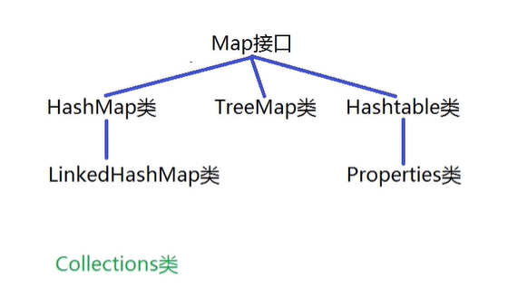

# 大数据学习-Java Day14

## 集合类库

###  1 泛型机制 

-  基本概念
  - 通常情况下集合中可以存放不同类型的对象，是因为将所有对象都看做Object类型放入的，因此 从集合中取出元素时也是Object类型，为了表达该元素真实的数据类型，则需要强制类型转换， 而强制类型转换可能会引发类型转换异常。
  
  - 为了避免上述错误的发生，从Java5开始增加泛型机制，也就是在集合名称的右侧使用<数据类型> 的方式来明确要求该集合中可以存放的元素类型，若放入其它类型的元素则编译报错。 

  - 泛型只在编译时期有效，在运行时期不区分是什么类型。 
  
  - ```java
    
    import java.util.LinkedList;
    import java.util.List;
    
    public class ListGenericTest {
    
        public static void main(String[] args) {
    
            // 1.准备一个支持泛型机制的List集合，明确要求集合中的元素是String类型
            List<String> lt1 = new LinkedList<String>();
            // 2.向集合中添加元素并打印
            lt1.add("one");
            System.out.println("lt1 = " + lt1); // [one]
            //lt1.add(2);  Error
            // 3.获取集合中的元素并打印
            String s = lt1.get(0);
            System.out.println("获取到的元素是：" + s); // one
    
            System.out.println("----------------------------------------------------");
            // 2.准备一个支持Integer类型的List集合
            List<Integer> lt2 = new LinkedList<Integer>();
            lt2.add(1);
            lt2.add(2);
            //lt2.add("3"); Error
            System.out.println("lt2 = " + lt2); // [1, 2]
            Integer integer = lt2.get(0);
            System.out.println("获取到的元素是：" + integer); // 1
    
            System.out.println("----------------------------------------------------");
            // Java7开始的新特性： 菱形特性   就是后面<>中的数据类型可以省略
            List<Double> lt3 = new LinkedList<>();
            // 笔试考点
            // 试图将lt1的数值赋值给lt3，也就是覆盖lt3中原来的数值，结果编译报错：集合中支持的类型不同
            //lt3 = lt1; Error
        }
    }
    
    ```
  
    
  
-  底层原理 
  
  - 泛型的本质就是参数化类型，也就是让数据类型作为参数传递，其中E相当于形式参数负责占位， 而使用集合时<>中的数据类型相当于实际参数，用于给形式参数E进行初始化，从而使得集合中所 有的E被实际参数替换，由于实际参数可以传递各种各样广泛的数据类型，因此得名为泛型。 

```java
//其中i叫做形式参数，负责占位 					其中E叫做形式参数，负责占位
 //int i = 10; 								E = String;
 //int i = 20; 								E = Integer;
 public static void show(int i) { 			public interface List<E> {
     ... 										...
 } 											}
//其中10叫做实际参数，负责给形式参数初始化 		//其中String叫做实际参数
 show(10); 									List<String> lt1 = ...;
 show(20); 									List<String> lt2 = ...;

```

-  自定义泛型接口 
  
- 泛型接口和普通接口的区别就是后面添加了类型参数列表，可以有多个类型参数，如： <E,T,...>等。  
  
- 自定义泛型类 

  - 泛型类和普通类的区别就是类名后面添加了类型参数列表，可以有多个类型参数，如：<E,T...> 等。 
  - 实例化泛型类时应该指定具体的数据类型，并且是引用数据类型而不是基本数据类型。 
  - 父类有泛型，子类可以选择保留泛型也可以选择指定泛型类型。 
  - 子类必须是“富二代”，子类除了指定或保留父类的泛型，还可以增加自己的泛型。 

-  自定义泛型方法 

  - 泛型方法就是我们输入参数的时候，输入的是泛型参数，而不是具体的参数。我们在调用这个泛型 方法的时需要对泛型参数进行实例化。 

  - 泛型方法的格式： 

    ```java
    [访问权限] <泛型> 返回值类型 方法名([泛型标识 参数名称]) { 方法体; } 
    ```

  - 在静态方法中使用泛型参数的时候，需要我们把静态方法定义为泛型方法。 

```java
/**
 * 自定义泛型类Person，其中T相当于形式参数负责占位，具体数值由实参决定
 * @param <T> 看做是一种名字为T的数据类型即可
 */
public class Person<T> {
    private String name;
    private int age;
    private T gender;

    public Person() {
    }

    public Person(String name, int age, T gender) {
        this.name = name;
        this.age = age;
        this.gender = gender;
    }

    public String getName() {
        return name;
    }

    public void setName(String name) {
        this.name = name;
    }

    public int getAge() {
        return age;
    }

    public void setAge(int age) {
        this.age = age;
    }

    // 不是泛型方法，该方法不能使用static关键字修饰，因为该方法中的T需要在new对象时才能明确类型
    public /*static*/ T getGender() {
        return gender;
    }

    public void setGender(T gender) {
        this.gender = gender;
    }

    // 自定义方法实现将参数指定数组中的所有元素打印出来
    public static <T1> void printArray(T1[] arr) {
        for (T1 tt: arr) {
            System.out.println("tt = " + tt);
        }
    }

    @Override
    public String toString() {
        return "Person{" +
                "name='" + name + '\'' +
                ", age=" + age +
                ", gender=" + gender +
                '}';
    }
}

```

```java
public class PersonTest {

    public static void main(String[] args) {

        // 1.声明Person类型的引用指向Person类型的对象
        Person p1 = new Person("zhangfei", 30, "男");
        // 2.打印对象的特征
        System.out.println(p1); // zhangfei 30 男

        System.out.println("-----------------------------------");
        // 3.在创建对象的同时指定数据类型，用于给T进行初始化
        Person<String> p2 = new Person<>();
        p2.setGender("女");
        System.out.println(p2); // null  0  女

        System.out.println("-----------------------------------");
        // 4.使用Boolean类型作为性别的类型
        Person<Boolean> p3 = new Person<>();
        p3.setGender(true);
        System.out.println(p3); // null 0  true

        System.out.println("-----------------------------------");
        // 5.调用泛型方法进行测试
        Integer[] arr = {11, 22, 33, 44, 55};
        Person.printArray(arr); // 11 22 33 44 55
    }
}

```


-  泛型在继承上的体现 
  
- 如果B是A的一个子类或子接口，而G是具有泛型声明的类或接口，则G并不是G的子类型！ 比如：String是Object的子类，但是List并不是List的子类。 
  
  ```java
  	
  //public class SubPerson extends Person { // 不保留泛型并且没有指定类型，此时Person类中的T默认为Object类型   擦除
  //public class SubPerson extends Person<String> {  // 不保留泛型但指定了泛型的类型，此时Person类中的T被指定为String类型
  //public class SubPerson<T> extends Person<T> { // 保留父类的泛型  可以在构造对象时来指定T的类型
  public class SubPerson<T, T1> extends Person<T> { // 保留父类的泛型，同时在子类中增加新的泛型
  }
  
  ```
  
  ```java
  public class SubPersonTest {
  
      public static void main(String[] args) {
  
          // 1.声明SubPerson类型的引用指向SubPerson类型的对象并调用set方法进行测试
          //SubPerson<String> sp1 = new SubPerson();  Error: SubPerson类中不支持泛型
          SubPerson sp1 = new SubPerson();
          sp1.setGender("女");
  
          System.out.println("----------------------------------------");
          //SubPerson<Boolean> sp2 = new SubPerson<>();
          SubPerson<Boolean, String> sp2 = new SubPerson<>();
          sp2.setGender(true);
      }
  }
  
  ```
  
  
  
-  通配符的使用 
  - 有时候我们希望传入的类型在一个指定的范围内，此时就可以使用泛型通配符了。 
  - 如：之前传入的类型要求为Integer类型，但是后来业务需要Integer的父类Number类也可以传 入。 
  - 泛型中有三种通配符形式： 
    - <?>无限制通配符：表示我们可以传入任意类型的参数。 
    - <? extends E>表示类型的上界是E，只能是E或者是E的子类。 
    - <? super E>表示类型的下界是E，只能是E或者是E的父类。 
  
  ```java
  
  public class Animal {
  }
  
  ```
  
  ```java
  
  public class Dog extends Animal {
  }
  
  ```
  
  ```java
  
  import java.util.LinkedList;
  import java.util.List;
  
  public class GenericTest {
  
      public static void main(String[] args) {
  
          // 1.声明两个List类型的集合进行测试
          List<Animal> lt1 = new LinkedList<>();
          List<Dog> lt2 = new LinkedList<>();
          // 试图将lt2的数值赋值给lt1，也就是发生List<Dog>类型向List<Animal>类型的转换
          //lt1 = lt2;  Error: 类型之间不具备父子类关系
  
          System.out.println("---------------------------------------------");
          // 2.使用通配符作为泛型类型的公共父类
          List<?> lt3 = new LinkedList<>();
          lt3 = lt1; // 可以发生List<Animal>类型到List<?>类型的转换
          lt3 = lt2; // 可以发生List<Dog>类型到List<?>类型的转换
  
          // 向公共父类中添加元素和获取元素
          //lt3.add(new Animal()); Error: 不能存放Animal类型的对象
          //lt3.add(new Dog());    Error: 不能存放Dog类型的对象， 不支持元素的添加操作
  
          Object o = lt3.get(0);  // ok，支持元素的获取操作，全部当做Object类型来处理
  
          System.out.println("---------------------------------------------");
          // 3.使用有限制的通配符进行使用
          List<? extends Animal> lt4 = new LinkedList<>();
          // 不支持元素的添加操作
          //lt4.add(new Animal());
          //lt4.add(new Dog());
          //lt4.add(new Object());
          // 获取元素
          Animal animal = lt4.get(0);
  
          System.out.println("---------------------------------------------");
          List<? super Animal> lt5 = new LinkedList<>();
          lt5.add(new Animal());
          lt5.add(new Dog());
          //lt5.add(new Object());  Error: 超过了Animal类型的范围
          Object object = lt5.get(0);
      }
  }
  
  ```
  
  

###  2 Set集合 

-  基本概念 
  - java.util.Set集合是Collection集合的子集合，与List集合平级。 
  - 该集合中元素没有先后放入次序，且不允许重复。 
  - 该集合的主要实现类是：HashSet类 和 TreeSet类以及LinkedHashSet类。 
  - 其中HashSet类的底层是采用哈希表进行数据管理的。 
  - 其中TreeSet类的底层是采用红黑树进行数据管理的。 
  - 其中LinkedHashSet类与HashSet类的不同之处在于内部维护了一个双向链表，链表中记录了元 素的迭代顺序，也就是元素插入集合中的先后顺序，因此便于迭代。 

-   常用的方法 
  - 参考Collection集合中的方法即可！ 

##### 案例   准备一个Set集合指向HashSet对象，向该集合中添加元素"two"并打印，再向集合中添加元 素"one"并打印，再向集合中添加元素"three"并打印，再向集合中添加"one"并打印。 

```java

import java.util.HashSet;
import java.util.LinkedHashSet;
import java.util.Set;

public class HashSetTest {

    public static void main(String[] args) {

        // 1.声明一个Set类型的引用指向HashSet类型的对象
        Set<String> s1 = new HashSet<>();
        //Set<String> s1 = new LinkedHashSet<>();  // 将放入的元素使用双链表连接起来
        System.out.println("s1 = " + s1); // [啥也没有]

        System.out.println("----------------------------------------------------");
        // 2.向集合中添加元素并打印
        boolean b1 = s1.add("two");
        System.out.println("b1 = " + b1); // true
        System.out.println("s1 = " + s1); // [two]
        // 从打印结果上可以看到元素没有先后放入次序(表面)
        b1 = s1.add("one");
        System.out.println("b1 = " + b1); // true
        System.out.println("s1 = " + s1); // [one, two]   [two, one]

        b1 = s1.add("three");
        System.out.println("b1 = " + b1); // true
        System.out.println("s1 = " + s1); // [one, two, three]  [two, one, three]
        // 验证元素不能重复
        b1 = s1.add("one");
        System.out.println("b1 = " + b1); // false
        System.out.println("s1 = " + s1); // [one, two, three] [two, one, three]
    }
}

```


-  元素放入HashSet集合的原理 
  - 使用元素调用hashCode方法获取对应的哈希码值，再由某种哈希算法计算出该元素在数组中的索 引位置。 
    - 若该位置没有元素，则将该元素直接放入即可。 
    - 若该位置有元素，则使用新元素与已有元素依次比较哈希值，
      - 若哈希值不相同，则将该元素直接放 入。 
      - 若新元素与已有元素的哈希值相同，则使用新元素调用equals方法与已有元素依次比较。 
        - 若相等则添加元素失败，否则将元素直接放入即可 
  
    
  
-  为什么要求重写equals方法后要重写hashCode方法呢？ 
  
  -  当两个元素调用equals方法相等时证明这两个元素相同，重写hashCode方法后保证这两个元 素得到的哈希码值相同，由同一个哈希算法生成的索引位置相同，此时只需要与该索引位置已有元 素比较即可，从而提高效率并避免重复元素的出现。  
  
-  TreeSet集合的概念 
  - 二叉树主要指每个节点最多只有两个子节点的树形结构。 
  - 满足以下3个特征的二叉树叫做有序二叉树。 
    - a.左子树中的任意节点元素都小于根节点元素值； 
    - b.右子树中的任意节点元素都大于根节点元素值； 
    - c.左子树和右子树的内部也遵守上述规则； 
  - 由于TreeSet集合的底层采用红黑树进行数据的管理，当有新元素插入到TreeSet集合时，需要使 用新元素与集合中已有的元素依次比较来确定新元素的合理位置。 
  - 比较元素大小的规则有两种方式： 
    - 使用元素的自然排序规则进行比较并排序，让元素类型实现java.lang.Comparable接口； 
    - 使用比较器规则进行比较并排序，构造TreeSet集合时传入java.util.Comparator接口； 
  - 自然排序的规则比较单一，而比较器的规则比较多元化，而且比较器优先于自然排序； 
  
  ```java
  
  public class Student implements Comparable<Student> {
      private String name;
      private int age;
  
      public Student() {
      }
  
      public Student(String name, int age) {
          this.name = name;
          this.age = age;
      }
  
      public String getName() {
          return name;
      }
  
      public void setName(String name) {
          this.name = name;
      }
  
      public int getAge() {
          return age;
      }
  
      public void setAge(int age) {
          this.age = age;
      }
  
      @Override
      public String toString() {
          return "Student{" +
                  "name='" + name + '\'' +
                  ", age=" + age +
                  '}';
      }
  
      @Override
      public int compareTo(Student o) {
          //return 0;   // 调用对象和参数对象相等，调用对象就是新增加的对象
          //return -1;  // 调用对象小于参数对象
          //return 1;     // 调用对象大于参数对象
          //return this.getName().compareTo(o.getName());  // 比较姓名
          //return this.getAge() - o.getAge(); // 比较年龄
          /*
          int ia = this.getName().compareTo(o.getName());
          if (0 == ia) {
              return this.getAge() - o.getAge();
          }
          return ia;
           */
          int ia = this.getName().compareTo(o.getName());
          return 0 != ia? ia : this.getAge() - o.getAge();
      }
  }
  
  ```
  
  ```java
  
  import java.util.Comparator;
  import java.util.Set;
  import java.util.TreeSet;
  
  public class TreeSetTest {
  
      public static void main(String[] args) {
  
          // 1.准备一个TreeSet集合并打印
          Set<String> s1 = new TreeSet<>();
          System.out.println("s1 = " + s1); // [啥也没有]
  
          // 2.向集合中添加String类型的对象并打印
          boolean b1 = s1.add("aa");
          System.out.println("b1 = " + b1); // true
          System.out.println("s1 = " + s1); // [aa]
  
          b1 = s1.add("cc");
          System.out.println("b1 = " + b1); // true
          System.out.println("s1 = " + s1); // [aa, cc]
  
          b1 = s1.add("bb");
          System.out.println("b1 = " + b1); // true
          // 由于TreeSet集合的底层是采用红黑树实现的，因此元素有大小次序，默认从小到大打印
          System.out.println("s1 = " + s1); // [aa, bb, cc]
  
          System.out.println("----------------------------------------------------------");
          // 4.准备一个比较器对象作为参数传递给构造方法
          // 匿名内部类： 接口/父类类型 引用变量名 = new 接口/父类类型() { 方法的重写 };
          /*
          Comparator<Student> comparator = new Comparator<Student>() {
              @Override
              public int compare(Student o1, Student o2) {  // o1表示新增加的对象  o2表示集合中已有的对象
                  return o1.getAge() - o2.getAge(); // 表示按照年龄比较
              }
          };
          */
          // 从Java8开始支持Lambda表达式: (参数列表) -> { 方法体 }
          Comparator<Student> comparator = (Student o1, Student o2) -> { return o1.getAge() - o2.getAge(); };
  
          // 3.准备一个TreeSet集合并放入Student类型的对象并打印
          //Set<Student> s2 = new TreeSet<>();
          Set<Student> s2 = new TreeSet<>(comparator);
          s2.add(new Student("zhangfei", 35));
          s2.add(new Student("zhangfei", 30));
          s2.add(new Student("guanyu", 35));
          s2.add(new Student("liubei", 40));
          System.out.println("s2 = " + s2);
      }
  }
  
  ```
  
  

###  3 Map集合（重点） 



-   基本概念 
  - java.util.Map集合中存取元素的基本单位是：单对元素，其中类型参数如下： 
    - K - 此映射所维护的键(Key)的类型，相当于目录。 
    - V - 映射值(Value)的类型，相当于内容。 
  - 该集合中key是不允许重复的，而且一个key只能对应一个value。 
  - 该集合的主要实现类有：HashMap类、TreeMap类、LinkedHashMap类、Hashtable类、 Properties类。 
    - 其中HashMap类的底层是采用哈希表进行数据管理的。 
    - 其中TreeMap类的底层是采用红黑树进行数据管理的。 
    - 其中LinkedHashMap类与HashMap类的不同之处在于内部维护了一个双向链表，链表中记录了 元素的迭代顺序，也就是元素插入集合中的先后顺序，因此便于迭代。 
    - 其中Hashtable类是古老的Map实现类，与HashMap类相比属于线程安全的类，且不允许null作 为key或者value的数值。 
    - 其中Properties类是Hashtable类的子类，该对象用于处理属性文件，key和value都是String类 型的。 
  - Map集合是面向查询优化的数据结构, 在大数据量情况下有着优良的查询性能。 
    - 经常用于根据key检索value的业务场景。 

- 常用方法

| 方法声明                               | 功能介绍                                                     |
| -------------------------------------- | ------------------------------------------------------------ |
| V put(K key,  V value)                 | 将Key-Value对存入Map，若集合中已经包含该Key，则替换该Key所对 应的Value，返回值为该Key原来所对应的Value，若没有则返回null |
| V get(Object  key)                     | 返回与参数Key所对应的Value对象，如果不存在则返回null         |
| boolean  containsKey(Object  key);     | 判断集合中是否包含指定的Key                                  |
| boolean  containsValue (Object value); | 判断集合中是否包含指定的Value                                |
| V remove(Object key)                   | 根据参数指定的key进行删除                                    |
| Set keySet()                           | 返回此映射中包含的键的Set视图                                |
| Collection values()                    | 返回此映射中包含的值的Set视图                                |
| Set<Map.Entry<K,V>> entrySet()         | 返回此映射中包含的映射的Set视图                              |

-  元素放入HashMap集合的原理 
  - 使用元素的key调用hashCode方法获取对应的哈希码值，再由某种哈希算法计算在数组中的索引 位置。 若该位置没有元素，则将该键值对直接放入即可。 
    - 若该位置有元素，则使用key与已有元素依次比较哈希值，
      - 若哈希值不相同，则将该元素直接放 入。 
      - 若key与已有元素的哈希值相同，则使用key调用equals方法与已有元素依次比较。 
      - 若相等则将对应的value修改，否则将键值对直接放入即可。  

-  相关的常量 
  - DEFAULT_INITIAL_CAPACITY : HashMap的默认容量是16。 
  - DEFAULT_LOAD_FACTOR：HashMap的默认加载因子是0.75。 
  - threshold：扩容的临界值，该数值为：容量*填充因子，也就是12。 T
  - REEIFY_THRESHOLD：若Bucket中链表长度大于该默认值则转化为红黑树存储，该数值是8。 
  - MIN_TREEIFY_CAPACITY：桶中的Node被树化时最小的hash表容量，该数值是64。 

```java

import java.util.Collection;
import java.util.HashMap;
import java.util.Map;
import java.util.Set;

public class MapTest {

    public static void main(String[] args) {

        // 1.准备一个Map集合并打印
        Map<String, String> m1 = new HashMap<>();
        // 自动调用toString方法，默认打印格式为：{key1=value1, key2=value2, ...}
        System.out.println("m1 = " + m1); // {啥也没有}

        // 2.向集合中添加元素并打印
        String str1 = m1.put("1", "one");
        System.out.println("原来的value数值为：" + str1); // null
        System.out.println("m1 = " + m1); // {1=one}

        str1 = m1.put("2", "two");
        System.out.println("原来的value数值为：" + str1); // null
        System.out.println("m1 = " + m1); // {1=one, 2=two}

        str1 = m1.put("3", "three");
        System.out.println("原来的value数值为：" + str1); // null
        System.out.println("m1 = " + m1); // {1=one, 2=two, 3=three}
        // 实现了修改的功能
        str1 = m1.put("1", "eleven");
        System.out.println("原来的value数值为：" + str1); // one
        System.out.println("m1 = " + m1); // {1=eleven, 2=two, 3=three}

        System.out.println("-------------------------------------------------------------");
        // 3.实现集合中元素的查找操作
        boolean b1 = m1.containsKey("11");
        System.out.println("b1 = " + b1); // false
        b1 = m1.containsKey("1");
        System.out.println("b1 = " + b1); // true

        b1 = m1.containsValue("one");
        System.out.println("b1 = " + b1); // false
        b1 = m1.containsValue("eleven");
        System.out.println("b1 = " + b1); // true

        String str2 = m1.get("5");
        System.out.println("str2 = " + str2); // null
        str2 = m1.get("3");
        System.out.println("str2 = " + str2); // three

        System.out.println("-------------------------------------------------------------");
        // 4.实现集合中元素的删除操作
        str2 = m1.remove("1");
        System.out.println("被删除的value是：" + str2); // eleven
        System.out.println("m1 = " + m1); // {2=two, 3=three}

        System.out.println("-------------------------------------------------------------");
        // 5.获取Map集合中所有的key并组成Set视图
        Set<String> s1 = m1.keySet();
        // 遍历所有的key
        for (String ts : s1) {
            System.out.println(ts + "=" + m1.get(ts));
        }

        System.out.println("-------------------------------------------------------------");
        // 6.获取Map集合中所有的Value并组成Collection视图
        Collection<String> co = m1.values();
        for (String ts : co) {
            System.out.println("ts = " + ts);
        }

        System.out.println("-------------------------------------------------------------");
        // 7.获取Map集合中所有的键值对并组成Set视图
        Set<Map.Entry<String, String>> entries = m1.entrySet();
        for (Map.Entry<String, String> me : entries) {
            System.out.println(me);
        }
    }
}

```


###  4 Collections类 

-  基本概念
  
-  java.util.Collections类主要提供了对集合操作或者返回集合的静态方法。 
  
- 常用方法

  | 方法声明                                                     | 功能介绍                                        |
  | ------------------------------------------------------------ | ----------------------------------------------- |
  | static <T  extends Object & Comparable<? super T>> T max(Collection<?  extends T> coll) | 根据元素的自然顺序返回给定集 合的最大元素       |
  | static T max(Collection<? extends T> coll, Comparator<？super T> comp) | 根据指定比较器引发的顺序返回 给定集合的最大元素 |
  | static <T  extends Object & Comparable<?super T>> T min(Collection<?  extends T> coll) | 根据元素的自然顺序返回给定集 合的最小元素       |
  | static T  min(Collection<? extends T> coll, Comparator<?  super T>  comp) | 根据指定比较器引发的顺序返回 给定集合的最小元素 |
  | static void  copy(List<? super T> dest, List<? extends T> src) | 将一个列表中的所有元素复制到 另一个列表中       |

  | 方法声明                                                     | 功能介绍                                    |
  | ------------------------------------------------------------ | ------------------------------------------- |
  | static void  reverse(List<?> list)                           | 反转指定列表中元素的顺序                    |
  | static void  shuffle(List<?> list)                           | 使用默认的随机源随机置换指定的列表          |
  | static <T  extends Comparable<? super T>> void sort(List list) | 根据其元素的自然顺序将指定列表按升 序排序   |
  | static void  sort(List list, Comparator<? super T> c)        | 根据指定比较器指定的顺序对指定列表 进行排序 |
  | static void  swap(List<?> list, int i, int j)                | 交换指定列表中指定位置的元素                |


```java


import java.util.*;

public class CollectionsTest {

    public static void main(String[] args) {

        // 1.准备一个集合并初始化
        List<Integer> lt1 = Arrays.asList(10, 30, 20, 50, 45);
        // 2.实现集合中元素的各种操作
        System.out.println("集合中的最大值是：" + Collections.max(lt1)); // 50
        System.out.println("集合中的最小值是：" + Collections.min(lt1)); // 10

        // 实现集合中元素的反转
        Collections.reverse(lt1);
        System.out.println("lt1 = " + lt1); // [45, 50, 20, 30, 10]
        // 实现两个元素的交换
        Collections.swap(lt1, 0, 4);
        System.out.println("交换后：lt1 = " + lt1); // [10, 50, 20, 30, 45]
        // 实现元素的排序
        Collections.sort(lt1);
        System.out.println("排序后：lt1 = " + lt1); // [10, 20, 30, 45, 50]
        // 随机置换
        Collections.shuffle(lt1);
        System.out.println("随机置换后：lt1 = " + lt1); // [30, 10, 45, 20, 50] 随机
        // 实现集合间元素的拷贝
        //List<Integer> lt2 = new ArrayList<>(20);
        List<Integer> lt2 = Arrays.asList(new Integer[10]);
        System.out.println("lt1的大小是：" + lt1.size());
        System.out.println("lt2的大小是：" + lt2.size());
        // 表示将lt1中的元素拷贝到lt2中
        Collections.copy(lt2, lt1);
        System.out.println("lt2 = " + lt2);
    }
}

```

