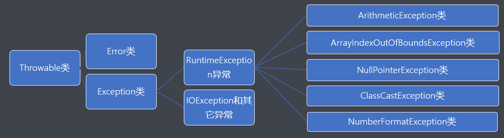

# 大数据学习-Java Day15

## 异常机制和File类

### 1 异常机制

- 基本概念
  - 异常就是"不正常"的含义，在Java语言中主要指程序执行中发生的不正常情况。 
  
  - java.lang.Throwable类是Java语言中错误(Error)和异常(Exception)的超类。 
  
- 其中Error类主要用于描述Java虚拟机无法解决的严重错误，通常无法编码解决，如：JVM挂掉了 等。 
  
  - 其中Exception类主要用于描述因编程错误或偶然外在因素导致的轻微错误，通常可以编码解决， 如：0作为除数等。 
  
    
  
- 异常的分类
  -  java.lang.Exception类是所有异常的超类，主要分为以下两种： 
    
  -  ```java
    
    public class ExceptionTest {
    
        public static void main(String[] args) {
    
            // 1.见识一下非检测性异常  运行时异常
            System.out.println(5 / 0); // 编译ok，运行阶段会发生算术异常  下面的代码不会执行
    
            // 2.检测性异常
            //Thread.sleep(1000); // 编译错误  不处理就无法到运行阶段
    
            System.out.println("程序正常结束了！");
        }
    }
    
    ```
    
    - RuntimeException - 运行时异常，也叫作非检测性异常
      - ArithmeticException类 - 算术异常 
      - ArrayIndexOutOfBoundsException类 - 数组下标越界异常 
      - NullPointerException - 空指针异常 
      - ClassCastException - 类型转换异常 
      - NumberFormatException - 数字格式异常
    -  IOException和其它异常 - 其它异常，也叫作检测性异常，所谓检测性异常就是指在编译阶段都能 被编译器检测出来的异常。 
    
  -   注意： 当程序执行过程中发生异常但又没有手动处理时，则由Java虚拟机采用默认方式处理异常，而默认 处理方式就是：打印异常的名称、异常发生的原因、异常发生的位置以及终止程序。   
  
- 异常的避免
  - 在以后的开发中尽量使用if条件判断来避免异常的发生。 
  
- 但是过多的if条件判断会导致程序的代码加长、臃肿，可读性差。
  
    ```java
    
    import com.lagou.task10.StaticOuter;
    
    import java.io.IOException;
    
    public class ExceptionPreventTest {
    
        public static void main(String[] args) {
    
            // 会发生算术异常
            int ia = 10;
            int ib = 0;
            if (0 != ib) {
                System.out.println(ia / ib);
            }
    
            // 数组下标越界异常
            int[] arr = new int[5];
            int pos = 5;
            if (pos >= 0 && pos < 5) {
                System.out.println(arr[pos]);
            }
    
            // 发生空指针异常
            String str = null;
            if (null != str) {
                System.out.println(str.length());
            }
    
            // 类型转换异常
            Exception ex = new Exception();
            if (ex instanceof IOException) {
                IOException ie = (IOException) ex;
            }
    
            // 数字格式异常
            String str2 = "123a";
            if (str2.matches("\\d+")) {
                System.out.println(Integer.parseInt(str2));
            }
    
            System.out.println("程序总算正常结束了！");
        }
    }
    
    ```
  
     
  
- 异常的捕获

  ```java
  // 语法格式
  try {
   编写可能发生异常的代码;
  }
  catch(异常类型 引用变量名) {
   编写针对该类异常的处理代码；
  }
  ...
  finally {
   编写无论是否发生异常都要执行的代码；
  }
  ```

  -  注意事项 

    - a.当需要编写多个catch分支时，切记小类型应该放在大类型的前面； 
    - b.懒人的写法： catch(Exception e) {} c.finally通常用于进行善后处理，如：关闭已经打开的文件等。

  -  执行流程 

    ```java
    try {
     a;
     b; - 可能发生异常的语句
     c;
    }catch(Exception ex) {
     d;
    }finally {
     e;
    }
     当没有发生异常时的执行流程：a b c e;
     当发生异常时的执行流程：a b d e;
    ```
    
    ```java
    
    import java.io.FileInputStream;
    import java.io.FileNotFoundException;
    import java.io.IOException;
    
    public class ExceptionCatchTest {
    
        public static void main(String[] args) {
    
            // 创建一个FileInputStream类型的对象与d:/a.txt文件关联，打开文件
            FileInputStream fis = null;
            try {
                System.out.println("1");
                // 当程序执行过程中发生了异常后直奔catch分支进行处理
                fis = new FileInputStream("d:/a.txt");
                System.out.println("2");
            } catch (FileNotFoundException e) {
                System.out.println("3");
                e.printStackTrace();
                System.out.println("4");
            }
            // 关闭文件
            try {
                System.out.println("5");
                fis.close();
                System.out.println("6");
            } /*catch (Exception e) {
                e.printStackTrace();
            }*/ catch (IOException e) {
                System.out.println("7");
                e.printStackTrace();
                System.out.println("8");
            } catch (NullPointerException e) {
                e.printStackTrace();
            } catch (Exception e) {
                e.printStackTrace();
            }
    
            System.out.println("世界上最真情的相依就是你在try我在catch，无论你发神马脾气我都默默承受并静静的处理，到那时再来期待我们的finally！");
            // 当程序执行过程中没有发生异常时的执行流程：1 2  5 6  世界上...
            // 当程序执行过程中发生异常又没有手动处理空指针异常时的执行流程：1 3 4  5  空指针异常导致程序终止
            // 当程序执行过程中发生异常并且手动处理空指针异常时的执行流程： 1 3 4 5 世界上...
    
            // 手动处理异常和没有处理的区别：代码是否可以继续向下执行
        }
    }
    
    ```
    
    ```java
    
    public class ExceptionFinallyTest {
    
        // 笔试考点
        public static int test() {
            try {
                int[] arr = new int[5];
                System.out.println(arr[5]);
                return 0;
            } catch (ArrayIndexOutOfBoundsException e) {
                e.printStackTrace();
                return 1;
            } finally {
                return 2; // 提交结束方法并返回数据
            }
        }
    
        public static void main(String[] args) {
    
            try {
                int ia = 10;
                int ib = 0;
                System.out.println(ia / ib);
            } catch (ArithmeticException e) {
                e.printStackTrace();
    
                String str1 = null;
                //str1.length(); // 会发生空指针异常
    
            } finally {
                System.out.println("无论是否发生异常都记得来执行我哦！");  // 依然是执行
            }
    
            System.out.println("Over！"); // 不执行了
    
            System.out.println("----------------------------------------");
            int test = test();
            System.out.println("test = " + test); // 2
        }
    }
    
    ```
    
    

- 异常的抛出

  - 概念

    -  在某些特殊情况下有些异常不能处理或者不便于处理时，就可以将该异常转移给该方法的调用者， 这种方法就叫异常的抛出。**当方法执行时出现异常，则底层生成一个异常类对象抛出，此时异常代 码后续的代码就不再执行。** 

  - 语法格式 

    - ```java
      访问权限 返回值类型 方法名称(形参列表) throws 异常类型1,异常类型2,...{ 方法体; }
      如：
       public void show() throws IOException{} 
      ```

    ```java
    
    import java.io.FileInputStream;
    import java.io.FileNotFoundException;
    import java.io.IOException;
    
    public class ExceptionThrowsTest {
    
        public static void show() throws IOException {
            FileInputStream fis = new FileInputStream("d:/a.txt");
            System.out.println("我想看看你抛出异常后是否继续向下执行？？？");
            fis.close();
        }
    
        public static void test1() throws IOException {
            show();
        }
    
        public static void test2() throws IOException {
            test1();
        }
    
        public static void test3() throws IOException {
            test2();
        }
    
        // 不建议在main方法中抛出异常   JVM负担很重
        public static void main(String[] args) /*throws IOException*/ {
            try {
                show();
            } catch (IOException e) {
                e.printStackTrace();
            }
    
            System.out.println("------------------------------------");
            try {
                test3();
            } catch (IOException e) {
                e.printStackTrace();
            }
        }
    }
    
    ```

    

  -  方法重写的原则
    
    -  a.要求方法名相同、参数列表相同以及返回值类型相同，从jdk1.5开始支持返回子类类型； 
    - b.要求方法的访问权限不能变小，可以相同或者变大； 
    - c.要求方法不能抛出更大的异常； 
    
  - 注意
    -  子类重写的方法不能抛出更大的异常、不能抛出平级不一样的异常，但可以抛出一样的异常、更小 的异常以及不抛出异常。 
    -  若父类中被重写的方法没有抛出异常时，则子类中重写的方法只能进行异常的捕获处理。 
    - 若一个方法内部又以递进方式分别调用了好几个其它方法，则建议这些方法内可以使用抛出 的方法处理到最后一层进行捕获方式处理。 
    
    ```java
    import java.io.IOException;
    
    public class ExceptionMethod {
    
        public void show() throws IOException {}
    }
    
    ```
    
    ```java
    
    import com.sun.jdi.ClassNotLoadedException;
    
    import java.io.FileNotFoundException;
    import java.io.IOException;
    
    public class SubExceptionMethod extends ExceptionMethod {
    
        @Override
        public void show() throws IOException {} // 子类重写的方法可以抛出和父类中方法一样的异常
        //public void show() throws FileNotFoundException {}  // 子类重写的方法可以抛出更小的异常
        //public void show() {} // 子类可以不抛出异常
        //public void show() throws ClassNotLoadedException {} // 不可以抛出平级不一样的异常
        //public void show() throws Exception {} // 不可以抛出更大的异常
    }
    
    ```
    
    

- 自定义异常

  - 概念

    -  当需要在程序中表达年龄不合理的情况时，而Java官方又没有提供这种针对性的异常，此时就需要 程序员自定义异常加以描述。 

  - 实现流程

    -  a.自定义xxxException异常类继承Exception类或者其子类。 
    - b.提供两个版本的构造方法，一个是无参构造方法，另外一个是字符串作为参数的构造方法。

    ```java
  public class AgeException extends Exception {
    
        static final long serialVersionUID = 7818375828146090155L; // 序列化的版本号  与序列化操作有关系
    
        public AgeException() {
        }
  
        public AgeException(String message) {
            super(message);
        }
    }
    
    ```
  
     
  
  - 异常的产生
  
    ```java
    throw new 异常类型(实参);
    如：
     throw new AgeException("年龄不合理！！！");
    ```
  
  ```java
  
  public class Person {
      private String name;
      private int age;
  
      public Person() {
      }
  
      public Person(String name, int age) /*throws AgeException */{
          setName(name);
          setAge(age);
      }
  
      public String getName() {
          return name;
      }
  
      public void setName(String name) {
          this.name = name;
      }
  
      public int getAge() {
          return age;
      }
  
      public void setAge(int age) /*throws AgeException */{
          if (age > 0 && age < 150) {
              this.age = age;
          } else {
              //System.out.println("年龄不合理哦！！！");
              try {
                  throw new AgeException("年龄不合理哦！！！");
              } catch (AgeException e) {
                  e.printStackTrace();
              }
          }
      }
  
      @Override
      public String toString() {
          return "Person{" +
                  "name='" + name + '\'' +
                  ", age=" + age +
                  '}';
      }
  }
  
  ```
  
  ```java
  
  public class PersonTest {
  
      public static void main(String[] args) {
  
          /*Person p1 = null;
          try {
              p1 = new Person("zhangfei", -30);
          } catch (AgeException e) {
              e.printStackTrace();
          }
          System.out.println("p1 = " + p1); // zhangfei 0*/
          Person p1 = new Person("zhangfei", -30);
          System.out.println("p1 = " + p1); // zhangfei 0  null
      }
  }
  
  ```
  
  
  
  -  Java采用的异常处理机制是将异常处理的程序代码集中在一起，与正常的程序代码分开，使得程序 简洁、优雅，并易于维护。  

### 2 File类

- 概念

  -  java.io.File类主要用于描述文件或目录路径的抽象表示信息，可以获取文件或目录的特征信息， 如：大小等。  

- 常用方法

  | 方法声明                            | 功能概述                                     |
  | ----------------------------------- | -------------------------------------------- |
  | File(String pathname)               | 根据参数指定的路径名来构造对象               |
  | File(String parent, String child)   | 根据参数指定的父路径和子路径信息构造对象     |
  | File(File parent, String child)     | 根据参数指定的父抽象路径和子路径信息构造对象 |
  | boolean exists()                    | 测试此抽象路径名表示的文件或目录是否存在     |
  | String getName()                    | 用于获取文件的名称                           |
  | long length()                       | 返回由此抽象路径名表示的文件的长度           |
  | long lastModified()                 | 用于获取文件的最后一次修改时间               |
  | String getAbsolutePath()            | 用于获取绝对路径信息                         |
  | boolean delete()                    | 用于删除文件，当删除目录时要求是空目录       |
  | boolean createNewFile()             | 用于创建新的空文件                           |
  | boolean mkdir()                     | 用于创建目录                                 |
  | boolean mkdirs()                    | 用于创建多级目录                             |
  | File[] listFiles()                  | 获取该目录下的所有内容                       |
  | boolean isFile()                    | 判断是否为文件                               |
  | boolean isDirectory()               | 判断是否为目录                               |
  | File[] listFiles(FileFilter filter) | 获取目录下满足筛选器的所有内容               |

##### 案例 遍历指定目录及子目录中所有内容并打印

```java

import java.io.File;
import java.io.FileFilter;
import java.io.IOException;
import java.text.SimpleDateFormat;
import java.time.LocalDateTime;
import java.util.Date;

public class FileTest {

    // 自定义成员方法实现指定目录以及子目录中所有内容的打印
    public static void show(File file) {
        // 获取目录f3下的所有内容并记录到一维数组中
        File[] filesArray = file.listFiles();
        // 遍历数组
        for (File tf: filesArray) {
            String name = tf.getName();
            // 判断是否为文件，若是则直接打印文件名称
            if (tf.isFile()) {
                System.out.println(name);
            }
            // 若是目录，则使用[]将目录名称括起来
            if (tf.isDirectory()) {
                System.out.println("[" + name + "]");
                show(tf);
            }
        }
    }

    public static void main(String[] args) throws IOException {

        // 1.构造File类型的对象与d:/a.txt文件关联
        File f1 = new File("d:/a.txt");
        // 2.若文件存在则获取文件的相关特征信息并打印后删除文件
        if (f1.exists()) {
            System.out.println("文件的名称是：" + f1.getName());
            System.out.println("文件的大小是：" + f1.length());
            Date d1 = new Date(f1.lastModified());
            SimpleDateFormat sdf = new SimpleDateFormat("yyyy-MM-dd HH:mm:ss");
            System.out.println("文件的最后一次修改时间：" + sdf.format(d1));
            // 绝对路径： 主要指以根目录开始的路径信息，如：c:/  d:/   /..
            // 相对路径： 主要指以当前目录所在位置开始的路径信息，如：./  ../   相对路径
            System.out.println("文件的绝对路径信息是：" + f1.getAbsolutePath());
            System.out.println(f1.delete()? "文件删除成功": "文件删除失败");
        } else {
            // 3.若文件不存在则创建新的空文件
            System.out.println(f1.createNewFile()? "文件创建成功": "文件创建失败！");
        }

        System.out.println("---------------------------------------------------------");
        // 4.实现目录的删除和创建
        File f2 = new File("d:/捣乱/猜猜我是谁/你猜我猜不猜/死鬼");
        if (f2.exists()) {
            System.out.println("目录名称是：" + f2.getName());
            System.out.println(f2.delete()? "目录删除成功": "目录删除失败");
        } else {
            //System.out.println(f2.mkdir()? "目录创建成功": "目录创建失败");   // 创建单层目录
            System.out.println(f2.mkdirs()? "目录创建成功": "目录创建失败");   // 创建多层目录
        }

        System.out.println("---------------------------------------------------------");
        // 5.实现将指定目录中的所有内容打印出来
        File f3 = new File("d:/捣乱");
        // 获取目录f3下的所有内容并记录到一维数组中
        File[] filesArray = f3.listFiles();
        // 遍历数组
        for (File tf: filesArray) {
            String name = tf.getName();
            // 判断是否为文件，若是则直接打印文件名称
            if (tf.isFile()) {
                System.out.println(name);
            }
            // 若是目录，则使用[]将目录名称括起来
            if (tf.isDirectory()) {
                System.out.println("[" + name + "]");
            }
        }

        System.out.println("---------------------------------------------------------");
        // 6.实现目录中所有内容获取的同时进行过滤
        // 匿名内部类的语法格式：接口/父类类型 引用变量名 = new 接口/父类类型() { 方法的重写 };
        /*FileFilter fileFilter = new FileFilter() {
            @Override
            public boolean accept(File pathname) {
                // 若文件名是以.avi为结尾，则返回true表示保留   否则返回false就是表示丢弃
                return pathname.getName().endsWith(".avi");
            }
        };*/
        // Lambda表达式的格式：(参数列表) -> {方法体}
        FileFilter fileFilter = (File pathname) -> {return pathname.getName().endsWith(".avi");};
        File[] filesArray2 = f3.listFiles(fileFilter);
        for (File tf : filesArray2) {
            System.out.println(tf);
        }

        System.out.println("---------------------------------------------------------");
        // 7.使用递归的思想获取目录以及子目录中的内容
        show(new File("d:/捣乱"));
    }
}

import java.io.File;
import java.io.FileFilter;
import java.io.IOException;
import java.text.SimpleDateFormat;
import java.time.LocalDateTime;
import java.util.Date;

public class FileTest {

    // 自定义成员方法实现指定目录以及子目录中所有内容的打印
    public static void show(File file) {
        // 获取目录f3下的所有内容并记录到一维数组中
        File[] filesArray = file.listFiles();
        // 遍历数组
        for (File tf: filesArray) {
            String name = tf.getName();
            // 判断是否为文件，若是则直接打印文件名称
            if (tf.isFile()) {
                System.out.println(name);
            }
            // 若是目录，则使用[]将目录名称括起来
            if (tf.isDirectory()) {
                System.out.println("[" + name + "]");
                show(tf);
            }
        }
    }

    public static void main(String[] args) throws IOException {

        // 1.构造File类型的对象与d:/a.txt文件关联
        File f1 = new File("d:/a.txt");
        // 2.若文件存在则获取文件的相关特征信息并打印后删除文件
        if (f1.exists()) {
            System.out.println("文件的名称是：" + f1.getName());
            System.out.println("文件的大小是：" + f1.length());
            Date d1 = new Date(f1.lastModified());
            SimpleDateFormat sdf = new SimpleDateFormat("yyyy-MM-dd HH:mm:ss");
            System.out.println("文件的最后一次修改时间：" + sdf.format(d1));
            // 绝对路径： 主要指以根目录开始的路径信息，如：c:/  d:/   /..
            // 相对路径： 主要指以当前目录所在位置开始的路径信息，如：./  ../   相对路径
            System.out.println("文件的绝对路径信息是：" + f1.getAbsolutePath());
            System.out.println(f1.delete()? "文件删除成功": "文件删除失败");
        } else {
            // 3.若文件不存在则创建新的空文件
            System.out.println(f1.createNewFile()? "文件创建成功": "文件创建失败！");
        }

        System.out.println("---------------------------------------------------------");
        // 4.实现目录的删除和创建
        File f2 = new File("d:/捣乱/猜猜我是谁/你猜我猜不猜/死鬼");
        if (f2.exists()) {
            System.out.println("目录名称是：" + f2.getName());
            System.out.println(f2.delete()? "目录删除成功": "目录删除失败");
        } else {
            //System.out.println(f2.mkdir()? "目录创建成功": "目录创建失败");   // 创建单层目录
            System.out.println(f2.mkdirs()? "目录创建成功": "目录创建失败");   // 创建多层目录
        }

        System.out.println("---------------------------------------------------------");
        // 5.实现将指定目录中的所有内容打印出来
        File f3 = new File("d:/捣乱");
        // 获取目录f3下的所有内容并记录到一维数组中
        File[] filesArray = f3.listFiles();
        // 遍历数组
        for (File tf: filesArray) {
            String name = tf.getName();
            // 判断是否为文件，若是则直接打印文件名称
            if (tf.isFile()) {
                System.out.println(name);
            }
            // 若是目录，则使用[]将目录名称括起来
            if (tf.isDirectory()) {
                System.out.println("[" + name + "]");
            }
        }

        System.out.println("---------------------------------------------------------");
        // 6.实现目录中所有内容获取的同时进行过滤
        // 匿名内部类的语法格式：接口/父类类型 引用变量名 = new 接口/父类类型() { 方法的重写 };
        /*FileFilter fileFilter = new FileFilter() {
            @Override
            public boolean accept(File pathname) {
                // 若文件名是以.avi为结尾，则返回true表示保留   否则返回false就是表示丢弃
                return pathname.getName().endsWith(".avi");
            }
        };*/
        // Lambda表达式的格式：(参数列表) -> {方法体}
        FileFilter fileFilter = (File pathname) -> {return pathname.getName().endsWith(".avi");};
        File[] filesArray2 = f3.listFiles(fileFilter);
        for (File tf : filesArray2) {
            System.out.println(tf);
        }

        System.out.println("---------------------------------------------------------");
        // 7.使用递归的思想获取目录以及子目录中的内容
        show(new File("d:/捣乱"));
    }
}

```

