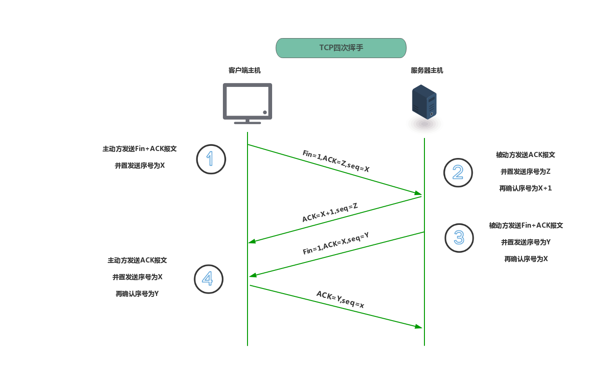

# 大数据学习-Java Day18

## 网络编程

### 1  网络编程的常识 

目前主流的网络通讯软件有：微信、QQ、飞信、阿里旺旺、陌陌、探探、... 

-   七层网络模型 
  -  七层网络模型 OSI（Open System Interconnect），即开放式系统互联，是ISO（国际标准化组织）组织在1985 年研究的网络互连模型。
  -  OSI七层模型和TCP/IP五层模型的划分如下： 

  

  -  当发送数据时，需要对发送的内容按照上述七层模型进行层层加包后发送出去。 当接收数据时，需要对接收的内容按照上述七层模型相反的次序层层拆包并显示出来。  

-  相关的协议 
  -  协议的概念 
    - 计算机在网络中实现通信就必须有一些约定或者规则，这种约定和规则就叫做通信协议，通信协议 可以对速率、传输代码、代码结构、传输控制步骤、出错控制等制定统一的标准。 
  -  TCP协议 
    - 传输控制协议(Transmission Control Protocol)，是一种面向连接的协议，类似于打电话。 
      - 建立连接 => 进行通信 => 断开连接 
      - 在传输前采用"三次握手"方式。 
      - 在通信的整个过程中全程保持连接，形成数据传输通道。 
      - 保证了数据传输的可靠性和有序性。 
      - 是一种全双工的字节流通信方式，可以进行大数据量的传输。 
      - 传输完毕后需要释放已建立的连接，发送数据的效率比较低。  
      - 
      - 
  -  UDP协议 
    - 用户数据报协议(User Datagram Protocol)，是一种非面向连接的协议，类似于写信。 
      - 在通信的整个过程中不需要保持连接，其实是不需要建立连接。 
      - 不保证数据传输的可靠性和有序性。 
    - 是一种全双工的数据报通信方式，每个数据报的大小限制在64K内。 
      - 发送数据完毕后无需释放资源，开销小，发送数据的效率比较高，速度快。 
  
-  IP地址 
  -  192.168.1.1 - 是绝大多数路由器的登录地址，主要配置用户名和密码以及Mac过滤。 
  - IP地址是互联网中的唯一地址标识，本质上是由32位二进制组成的整数，叫做IPv4，当然也有128 位二进制组成的整数，叫做IPv6，目前主流的还是IPv4。 
  - 日常生活中采用点分十进制表示法来进行IP地址的描述，将每个字节的二进制转化为一个十进制整 数，不同的整数之间采用小数点隔开。
    -  如： 0x01020304 => 1.2.3.4 
  - 查看IP地址的方式： 
    - Windows系统：在dos窗口中使用ipconfig或ipconfig/all命令即可 
    - Unix/linux系统：在终端窗口中使用ifconfig或/sbin/ifconfig命令即可 
  - 特殊的地址 
    - 本地回环地址(hostAddress)：127.0.0.1 主机名(hostName)：localhost 

-  端口号
  -  IP地址 - 可以定位到具体某一台设备。 
  - 端口号 - 可以定位到该设备中具体某一个进程。 端
  - 口号本质上是16位二进制组成的整数，表示范围是：0 ~ 65535，其中0 ~ 1024之间的端口号通 常被系统占用，建议编程从1025开始使用。 
  - 特殊的端口： HTTP:80 FTP:21 Oracle:1521 MySQL:3306 Tomcat:8080
  -  网络编程需要提供：IP地址 + 端口号，组合在一起叫做网络套接字：Socket。 

###  2 基于tcp协议的编程模型 

-  C/S架构的简介 
  - 在C/S模式下客户向服务器发出服务请求，服务器接收请求后提供服务。 
  - 例如：在一个酒店中，顾客找服务员点菜,服务员把点菜单通知厨师，厨师按点菜单做好菜后让服 务员端给客户，这就是一种C/S工作方式。如果把酒店看作一个系统，服务员就是客户端，厨师就 是服务器。这种系统分工和协同工作的方式就是C/S的工作方式。 
  - 客户端部分：为每个用户所专有的，负责执行前台功能。 
  - 服务器部分：由多个用户共享的信息与功能，招待后台服务。  

-  编程模型 
  - 服务器： 
    - （1）创建ServerSocket类型的对象并提供端口号； 
    - （2）等待客户端的连接请求，调用accept()方法； 
    - （3）使用输入输出流进行通信； 
    - （4）关闭Socket； 
  - 客户端： 
    - （1）创建Socket类型的对象并提供服务器的IP地址和端口号； 
    - （2）使用输入输出流进行通信； 
    - （3）关闭Socket； 

-  相关类和方法的解析 

  - ServerSocket类 

    - java.net.ServerSocket类主要用于描述服务器套接字信息（大插排）。  

    -  常用的方法如下： 

      | 方法声明               | 功能介绍                       |
      | ---------------------- | ------------------------------ |
      | ServerSocket(int port) | 根据参数指定的端口号来构造对象 |
      | Socket accept()        | 侦听并接收到此套接字的连接请求 |
      | void close()           | 用于关闭套接字                 |

  -  Socket类 

    - java.net.Socket类主要用于描述客户端套接字，是两台机器间通信的端点（小插排）。 

    - 常用方法

      | 方法声明                       | 功能介绍                       |
      | ------------------------------ | ------------------------------ |
      | Socket(String host, int port)  | 根据指定主机名和端口来构造对象 |
      | InputStream getInputStream()   | 用于获取当前套接字的输入流     |
      | OutputStream getOutputStream() | 用于获取当前套接字的输出流     |
      | void close()                   | 用于关闭套接字                 |

  -  注意事项 

    - 客户端 Socket 与服务器端 Socket 对应, 都包含输入和输出流。
    -  客户端的socket.getInputStream() 连接于服务器socket.getOutputStream()。 
    - 客户端的socket.getOutputStream()连接于服务器socket.getInputStream() 
    
    
  
  ```java
  
  import java.io.BufferedReader;
  import java.io.IOException;
  import java.io.InputStreamReader;
  import java.io.PrintStream;
  import java.net.ServerSocket;
  import java.net.Socket;
  
  public class ServerStringTest {
  
      public static void main(String[] args) {
          ServerSocket ss = null;
          Socket s = null;
  
          try {
              // 1.创建ServerSocket类型的对象并提供端口号
              ss = new ServerSocket(8888);
  
              // 2.等待客户端的连接请求，调用accept方法
              while(true) {
                  System.out.println("等待客户端的连接请求...");
                  // 当没有客户端连接时，则服务器阻塞在accept方法的调用这里
                  s = ss.accept();
                  System.out.println("客户端" + s.getInetAddress() + "连接成功！");
                  // 每当有一个客户端连接成功，则需要启动一个新的线程为之服务
                  new ServerThread(s).start();
              }
          } catch (IOException e) {
              e.printStackTrace();
          } finally {
              // 4.关闭Socket并释放有关的资源
              if (null != ss) {
                  try {
                      ss.close();
                  } catch (IOException e) {
                      e.printStackTrace();
                  }
              }
          }
      }
  }
  
  ```
  
  ```java
  
  import com.lagou.task10.StaticOuter;
  
  import java.io.BufferedReader;
  import java.io.IOException;
  import java.io.InputStreamReader;
  import java.io.PrintStream;
  import java.net.Socket;
  import java.util.Scanner;
  
  public class ClientStringTest {
  
      public static void main(String[] args) {
          Socket s = null;
          PrintStream ps = null;
          Scanner sc = null;
          BufferedReader br = null;
  
          try {
              // 1.创建Socket类型的对象并提供服务器的主机名和端口号
              s = new Socket("127.0.0.1", 8888);
              System.out.println("连接服务器成功！");
  
              // 2.使用输入输出流进行通信
              sc = new Scanner(System.in);
              ps = new PrintStream(s.getOutputStream());
              br = new BufferedReader(new InputStreamReader(s.getInputStream()));
  
              while(true) {
                  //Thread.sleep(10000);
                  // 实现客户端发送的内容由用户从键盘输入
                  System.out.println("请输入要发送的数据内容：");
                  String str1 = sc.next();
                  // 实现客户端向服务器发送字符串内容"hello"
                  //ps.println("hello");
                  ps.println(str1);
                  System.out.println("客户端发送数据内容成功！");
                  // 当发送的数据内容为"bye"时，则聊天结束
                  if ("bye".equalsIgnoreCase(str1)) {
                          System.out.println("聊天结束！");
                          break;
                  }
                  // 实现接收服务器发来的字符串内容并打印
                  String str2 = br.readLine();
                  System.out.println("服务器回发的消息是：" + str2);
              }
  
          } catch (IOException /*| InterruptedException*/ e) {
              e.printStackTrace();
          } finally {
              // 3.关闭Socket并释放有关的资源
              if (null != br) {
                  try {
                      br.close();
                  } catch (IOException e) {
                      e.printStackTrace();
                  }
              }
              if (null != ps) {
                  ps.close();
              }
              if (null != sc) {
                  sc.close();
              }
              if (null != s) {
                  try {
                      s.close();
                  } catch (IOException e) {
                      e.printStackTrace();
                  }
              }
          }
      }
  }
  
  ```
  
  ```java
  
  import java.io.BufferedReader;
  import java.io.IOException;
  import java.io.InputStreamReader;
  import java.io.PrintStream;
  import java.net.InetAddress;
  import java.net.Socket;
  
  public class ServerThread extends Thread {
      private Socket s;
  
      public ServerThread(Socket s) {
          this.s = s;
      }
  
      @Override
      public void run() {
          BufferedReader br = null;
          PrintStream ps = null;
  
          try {
              // 3.使用输入输出流进行通信
              br = new BufferedReader(new InputStreamReader(s.getInputStream()));
              ps = new PrintStream(s.getOutputStream());
  
              while(true) {
                  // 实现对客户端发来字符串内容的接收并打印
                  // 当没有数据发来时，下面的方法会形成阻塞
                  String s1 = br.readLine();
                  InetAddress inetAddress = s.getInetAddress();
                  System.out.println("客户端" + inetAddress + "发来的字符串内容是：" + s1);
                  // 当客户端发来的内容为"bye"时，则聊天结束
                  if ("bye".equalsIgnoreCase(s1)) {
                      System.out.println("客户端" + inetAddress + "已下线！");
                      break;
                  }
                  // 实现服务器向客户端回发字符串内容"I received!"
                  ps.println("I received!");
                  System.out.println("服务器发送数据成功！");
              }
          } catch (IOException e) {
              e.printStackTrace();
          } finally {
              if (null != ps) {
                  ps.close();
              }
              if (null != br) {
                  try {
                      br.close();
                  } catch (IOException e) {
                      e.printStackTrace();
                  }
              }
              if (null != s) {
                  try {
                      s.close();
                  } catch (IOException e) {
                      e.printStackTrace();
                  }
              }
          }
  
      }
  }
  
  ```
  
  

###  3 基于udp协议的编程模型 

-   编程模型 
  - 接收方： 
    - （1）创建DatagramSocket类型的对象并提供端口号； 
    - （2）创建DatagramPacket类型的对象并提供缓冲区； 
    - （3）通过Socket接收数据内容存放到Packet中，调用receive方法； 
    - （4）关闭Socket； 
  - 发送方： 
    - （1）创建DatagramSocket类型的对象； 
    - （2）创建DatagramPacket类型的对象并提供接收方的通信地址； 
    - （3）通过Socket将Packet中的数据内容发送出去，调用send方法； 
    - （4）关闭Socket； 

-   相关类和方法的解析 

  - DatagramSocket类 

    - java.net.DatagramSocket类主要用于描述发送和接收数据报的套接字(邮局)。 换句话说，该类就是包裹投递服务的发送或接收点。 

    - 常用的方法如下 

      | 方法声明                       | 功能介绍                           |
      | ------------------------------ | ---------------------------------- |
      | DatagramSocket()               | 使用无参的方式构造对象             |
      | DatagramSocket(int port)       | 根据参数指定的端口号来构造对象     |
      | void receive(DatagramPacket p) | 用于接收数据报存放到参数指定的位置 |
      | void send(DatagramPacket p)    | 用于将参数指定的数据报发送出去     |
      | void close()                   | 关闭Socket并释放相关资源           |

  -  DatagramPacket类 

    - java.net.DatagramPacket类主要用于描述数据报，数据报用来实现无连接包裹投递服务。  

    - 常用方法

      | 方法声明                                                     | 功能介绍                                                    |
      | ------------------------------------------------------------ | ----------------------------------------------------------- |
      | DatagramPacket(byte[] buf, int length)                       | 根据参数指定的数组来构造对象，用于接 收长度为length的数据报 |
      | DatagramPacket(byte[] buf, int length, InetAddress address, int port) | 根据参数指定数组来构造对象，将数据报 发送到指定地址和端口   |
      | InetAddress getAddress()                                     | 用于获取发送方或接收方的通信地址                            |
      | int getPort()                                                | 用于获取发送方或接收方的端口号                              |
      | int getLength()                                              | 用于获取发送数据或接收数据的长度                            |

  -  InetAddress类

    -  java.net.InetAddress类主要用于描述互联网通信地址信息。  

    - 常用方法

      | 方法声明                                  | 功能介绍                         |
      | ----------------------------------------- | -------------------------------- |
      | static InetAddress getLocalHost()         | 用于获取当前主机的通信地址       |
      | static InetAddress getByName(String host) | 根据参数指定的主机名获取通信地址 |


```java

import java.io.IOException;
import java.net.DatagramPacket;
import java.net.DatagramSocket;

public class ReceiveTest {

    public static void main(String[] args) {
        DatagramSocket ds = null;

        try {
            // 1.创建DatagramSocket类型的对象并提供端口号
            ds = new DatagramSocket(8888);

            // 2.创建DatagramPacket类型的对象并提供缓冲区
            byte[] bArr = new byte[20];
            DatagramPacket dp = new DatagramPacket(bArr, bArr.length);
            // 3.通过Socket接收数据内容存放到Packet里面，调用receive方法
            System.out.println("等待数据的到来...");
            ds.receive(dp);
            System.out.println("接收到的数据内容是：" + new String(bArr, 0, dp.getLength()) + "!");

            // 实现将字符串内容"I received!"回发过去
            byte[] bArr2 = "I received!".getBytes();
            DatagramPacket dp2 = new DatagramPacket(bArr2, bArr2.length, dp.getAddress(), dp.getPort());
            ds.send(dp2);
            System.out.println("回发数据成功！");

        } catch (IOException e) {
            e.printStackTrace();
        } finally {
            // 4.关闭Socket并释放有关的资源
            if (null != ds) {
                ds.close();
            }
        }
    }
}

```

```java

import java.io.IOException;
import java.net.DatagramPacket;
import java.net.DatagramSocket;
import java.net.InetAddress;

public class SendTest {

    public static void main(String[] args) {
        DatagramSocket ds = null;

        try {
            // 1.创建DatagramSocket类型的对象
            ds = new DatagramSocket();
            // 2.创建DatagramPacket类型的对象并提供接收方的通信地址和端口号
            byte[] bArr = "hello".getBytes();
            DatagramPacket dp = new DatagramPacket(bArr, bArr.length, InetAddress.getLocalHost(), 8888);
            // 3.通过Socket发送Packet，调用send方法
            ds.send(dp);
            System.out.println("发送数据成功！");

            // 接收回发的数据内容
            byte[] bArr2 = new byte[20];
            DatagramPacket dp2 = new DatagramPacket(bArr2, bArr2.length);
            ds.receive(dp2);
            System.out.println("接收到的回发消息是：" + new String(bArr2, 0, dp2.getLength()));

        } catch (IOException e) {
            e.printStackTrace();
        } finally {
            // 4.关闭Socket并释放有关的资源
            if (null != ds) {
                ds.close();
            }
        }
    }
}

```

 

### 4 URL类 

-  基本概念 
  - java.net.URL（Uniform Resource Identifier）类主要用于表示统一的资源定位器，也就是指向万 维网上“资源”的指针。这个资源可以是简单的文件或目录，也可以是对复杂对象的引用，例如对数 据库或搜索引擎的查询等。 
  - 通过URL可以访问万维网上的网络资源，最常见的就是www和ftp站点，浏览器通过解析给定的 URL可以在网络上查找相应的资源。 
  - URL的基本结构如下： <传输协议>://<主机名>:<端口号>/<资源地址> 

- 常用方法

  | 方法声明                       | 功能介绍                         |
  | ------------------------------ | -------------------------------- |
  | URL(String spec)               | 根据参数指定的字符串信息构造对象 |
  | String getProtocol()           | 获取协议名称                     |
  | String getHost()               | 获取主机名称                     |
  | int getPort()                  | 获取端口号                       |
  | String getPath()               | 获取路径信息                     |
  | String getFile()               | 获取文件名                       |
  | URLConnection openConnection() | 获取URLConnection类的实例        |

-  URLConnection类 

  - 基本概念 

    - java.net.URLConnection类是个抽象类，该类表示应用程序和URL之间的通信链接的所有类的超 类，主要实现类有支持HTTP特有功能的HttpURLConnection类。

  - HttpURLConnection类的常用方法 

    | 方法声明                     | 功能介绍   |
    | ---------------------------- | ---------- |
    | InputStream getInputStream() | 获取输入流 |
    | void disconnect()            | 断开连接   |

    

```java

import java.io.BufferedReader;
import java.io.IOException;
import java.io.InputStream;
import java.io.InputStreamReader;
import java.net.HttpURLConnection;
import java.net.MalformedURLException;
import java.net.URL;
import java.net.URLConnection;

public class URLTest {

    public static void main(String[] args) {

        try {
            // 1.使用参数指定的字符串来构造对象
            URL url = new URL("https://www.lagou.com/");
            // 2.获取相关信息并打印出来
            System.out.println("获取到的协议名称是：" + url.getProtocol());
            System.out.println("获取到的主机名称是：" + url.getHost());
            System.out.println("获取到的端口号是：" + url.getPort());

            // 3.建立连接并读取相关信息打印出来
            HttpURLConnection urlConnection = (HttpURLConnection) url.openConnection();
            InputStream inputStream = urlConnection.getInputStream();
            BufferedReader br = new BufferedReader(new InputStreamReader(inputStream));
            String str = null;
            while ((str = br.readLine()) != null) {
                System.out.println(str);
            }
            br.close();
            // 断开连接
            urlConnection.disconnect();

        } catch (MalformedURLException e) {
            e.printStackTrace();
        } catch (IOException e) {
            e.printStackTrace();
        }

    }
}

```

