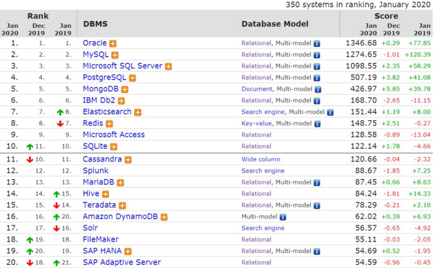
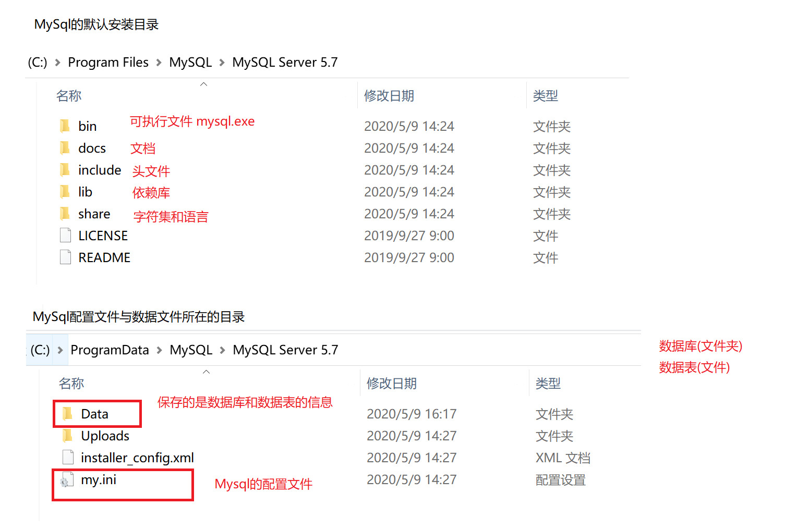
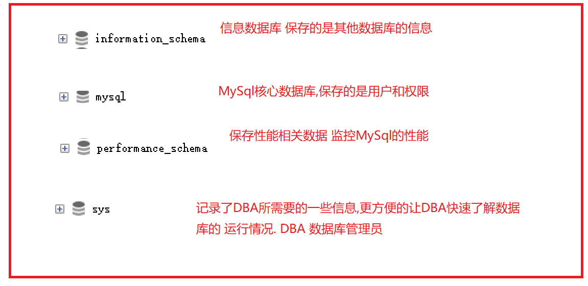
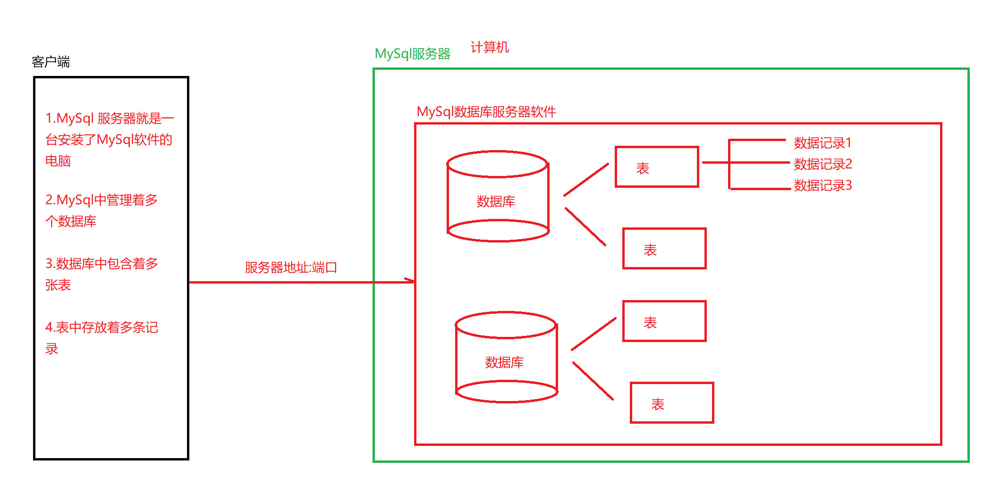
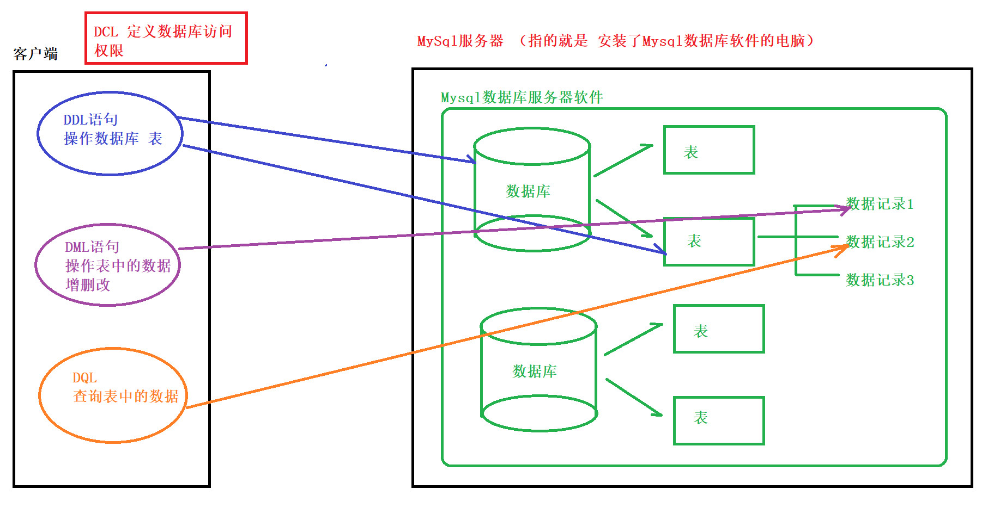
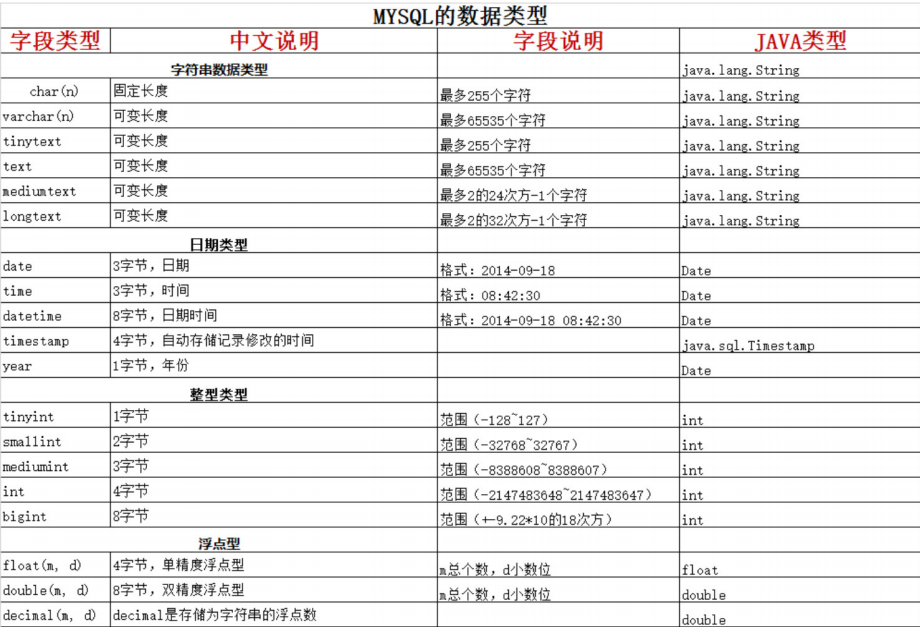
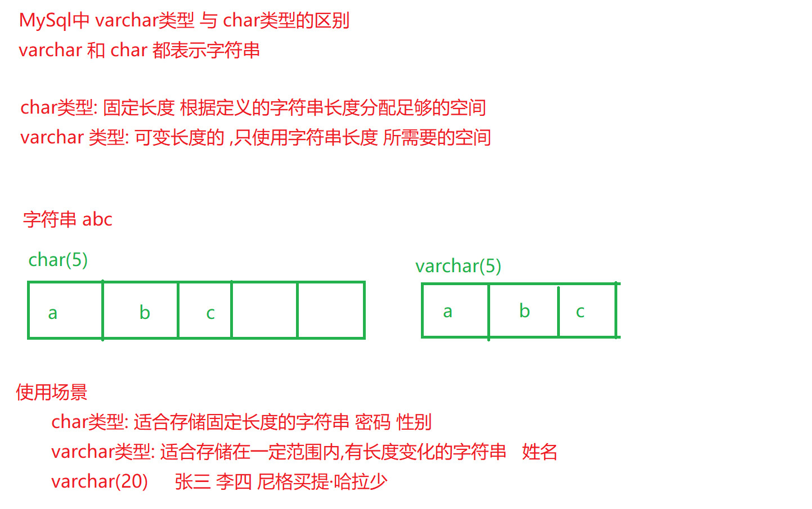
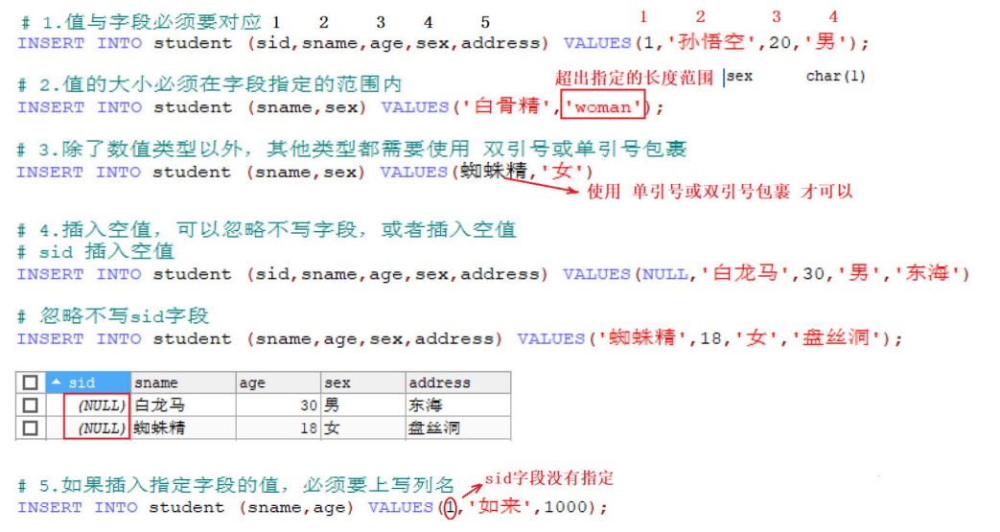

# 大数据学习-Java Day20

##  MySQL基础&SQL入门 

### 1 数据库概念

- 什么是数据库

  - 数据库(DataBase) 就是存储和管理数据的仓库 
  - 其本质是一个文件系统, 还是以文件的方式,将数据保存在电脑上 

- 为什么使用数据库

  - 数据存储方式的比较

    | 存储方 式 | 优点                                                         | 缺点                                           |
    | --------- | ------------------------------------------------------------ | ---------------------------------------------- |
    | 内存      | 速度快                                                       | 不能够永久保存,数据是临时状态的                |
    | 文件      | 数据是可以永久保存的                                         | 使用IO流操作文件, 不方便                       |
    | 数据库    | 1.数据可以永久保存<br />2.方便存储和管理数据 <br />3.使用统一的方式操作数据库 (SQL) | 占用资源,有些数据库需要付费(比如Oracle数据 库) |

     通过上面的比较,我们可以看出,使用数据库存储数据, 用户可以非常方便对数据库中的数据进行增加, 删 除, 修改及查询操作。 


-  常见的数据库软件排行榜 

  


### 2 Mysql的安装及配置

-  安装MySQL
  
  -  MySQL安装文档 
-  2.2 卸载MySQL 
  
  -  MySQL卸载文档 
- 2.3 MySQL环境变量配置 详见 MySQL环境变量配置文档 
  
-  MySQL环境变量配置文档 
  
-  MySql的目录结构 
  
- 
  
- 数据库管理系统
  -  什么是数据库管理系统 ? 
    - 数据库管理系统（DataBase Management System，DBMS）：指一种操作和管理维护数据库的大 型软件。 
    
    - MySQL就是一个 数据库管理系统软件, 安装了Mysql的电脑,我们叫它数据库服务器. 
    
      
  - 数据库管理系统的作用 
    
    - 用于建立、使用和维护数据库，对数据库进行统一的管理。
  - 数据库管理系统、数据库 和表之间的关系
    
    - MySQL中管理着很多数据库，在实际开发环境中 一个数据库一般对应了一个的应用，数据库当中保 存着多张表，每一张表对应着不同的业务，表中保存着对应业务的数据。 



- 数据库表
  -  数据库中以表为组织单位存储数据 
  - 表类似我们Java中的类,每个字段都有对应的数据类型 

### 3 Sql

-  什么是SQL ？ 
  
  - 结构化查询语言(Structured Query Language)简称SQL，是一种特殊目的的编程语言，是一种数据库 查询和程序设计语言，用于存取数据以及查询、更新和管理关系数据库系统。
  
- SQL 的作用 
  - 是所有关系型数据库的统一查询规范，不同的关系型数据库都支持SQL 
  - 所有的关系型数据库都可以使用SQL 
  - 不同数据库之间的SQL 有一些区别 方言 

-  SQL通用语法 

  -  SQL语句可以单行 或者 多行书写，以分号 结尾 ; （Sqlyog中可以不用写分号）

  - 可以使用空格和缩进来增加语句的可读性

  - MySql中使用SQL不区分大小写，一般关键字大写，数据库名 表名列名 小写

  -  注释方式  

    | 注释语法 | 说明                |
    | -------- | ------------------- |
    | -- 空格  | 单行注释            |
    | /* */    | 多行注释            |
    | \#       | MySql特有的单行注释 |

-  SQL的分类 

  - | 分类              | 说明                                                         |
    | ----------------- | ------------------------------------------------------------ |
    | 数据定义语 言     | 简称DDL(Data Definition Language)，用来定义数据库对象：数据库，表，列 等。 |
    | **数据操作语 言** | **简称DML(Data Manipulation Language)，用来对数据库中表的记录进行更新**。 |
    | **数据查询语 言** | **简称DQL(Data Query Language)，用来查询数据库中表的记录。** |
    | 数据控制语 言     | 简称DCL(Date Control Language)，用来定义数据库的访问权限和安全级别， 及创建用户。(了解) |

    

- DDL操作 数据库 

  - 创建数据库

    | 命令                                            | 说明                                                     |
    | ----------------------------------------------- | -------------------------------------------------------- |
    | create database 数据库名；                      | 创建指定名称的数据库。                                   |
    | create database 数据库名 character set 字符集； | 创建指定名称的数据库，并且指定字符集（一般都 指定utf-8） |

    ```sql
    /*
    方式1 直接指定数据库名进行创建
    默认数据库字符集为：latin1
    */
    CREATE DATABASE db1;
    /*
    方式2 指定数据库名称，指定数据库的字符集
    一般都指定为 utf8,与Java中的编码保持一致
    */
    CREATE DATABASE db1_1 CHARACTER SET utf8
    ```

  - 查看数据库

    - | 命令                            | **说明**                   |
      | ------------------------------- | -------------------------- |
      | use 数据库                      | 切换数据库                 |
      | select database();              | 查看当前正在使用的数据库   |
      | show databases;                 | 查看Mysql中 都有哪些数据库 |
      | show create database 数据库名； | 查看一个数据库的定义信息   |

  ```sql
  -- 切换数据库 从db1 切换到 db1_1
  USE db1_1;
  -- 查看当前正在使用的数据库
  SELECT DATABASE();
  -- 查看Mysql中有哪些数据库
  SHOW DATABASES;
  -- 查看一个数据库的定义信息
  SHOW CREATE DATABASE db1_1;
  ```

  -  修改数据库 

    | 命令                                           | 说明                   |
    | ---------------------------------------------- | ---------------------- |
    | alter database 数据库名 character set 字符集； | 数据库的字符集修改操作 |

    ```sql
    -- 将数据库db1 的字符集 修改为 utf8
    ALTER DATABASE db1 CHARACTER SET utf8;
    -- 查看当前数据库的基本信息，发现编码已更改
    SHOW CREATE DATABASE db1;
    ```

  - 删除数据库

    | 命令                   | 说明                          |
    | ---------------------- | ----------------------------- |
    | drop database 数据库名 | 从MySql中永久的删除某个数据库 |

    ```sql
    -- 删除某个数据库
    DROP DATABASE db1_1;
    ```

  #### **DDL 操作 数据表** 

  -  MySQL常见的数据类型 

    | 类型    | 描述                                                |
    | ------- | --------------------------------------------------- |
    | int     | 整型                                                |
    | double  | 浮点型                                              |
    | varchar | 字符串型                                            |
    | date    | 日期类型，给是为 yyyy-MM-dd ,只有年月日，没有时分秒 |

    

  **注**： MySQL中的 char类型与 varchar类型，都对应了 Java中的字符串类型，区别在于：

  ​		 char类型是固定长度的： 根据定义的字符串长度分配足够的空间。 

  ​		 varchar类型是可变长度的： 只使用字符串长度所需的空间 

  

  - 创建表

    ```sql
    CREATE TABLE 表名(
    字段名称1 字段类型（长度），
    字段名称2 字段类型 注意 最后一列不要加逗号
    )；
    
    ```

     需求1： 创建商品分类表 

    ```sql
    /*
    表名：category
    表中字段：
    分类ID ：cid ,为整型
    分类名称：cname，为字符串类型，指定长度20
    */
    -- 切换到数据库 db1
    USE db1;
    -- 创建表
    CREATE TABLE category(
    cid INT,
    cname VARCHAR(20)
    );
    
    ```

     需求2： 创建测试表

    ```sql
    /*
    表名： test1
    表中字段：
    测试ID ： tid ,为整型
    测试时间： tdate , 为年月日的日期类型
    */
    -- 创建测试表
    CREATE TABLE test1(
    tid INT,
    tdate DATE
    );
    
    ```

       需求3： 快速创建一个表结构相同的表（复制表结构） 

    ```sql
    /*
    create table 新表明 like 旧表名
    */
    -- 创建一个表结构与 test1 相同的 test2表
    CREATE TABLE test2 LIKE test1;
    -- 查看表结构
    DESC test2;
    ```

  - 查看表

    | 命令         | 说明                       |
    | ------------ | -------------------------- |
    | show tables; | 查看当前数据库中的所有表名 |
    | desc 表名；  | 查看数据表的结构           |

    ```sql
    -- 查看当前数据库中的所有表名
    SHOW TABLES;
    -- 显示当前数据表的结构
    DESC category;
    -- 查看创建表的SQL语句
    SHOW CREATE TABLE category;
    ```

  - 删除表

    | 命令                        | 说明                                               |
    | --------------------------- | -------------------------------------------------- |
    | drop table 表名；           | 删除表（从数据库中永久删除某一张表）               |
    | drop table if exists 表名； | 判断表是否存在， 存在的话就删除,不存在就不执行删除 |

    ```sql
    -- 直接删除 test1 表
    DROP TABLE test1;
    -- 先判断 再删除test2表
    DROP TABLE IF EXISTS test2;
    ```

  - 修改表

    ```sql
    --  修改表名 
    -- rename table 旧表名 to 新表名
    --需求： 将category表 改为 category1 
    RENAME TABLE category TO category1;
    
    ```

    ```sql
    -- 修改表的字符集
    --alter table 表名 character set 字符集
    -- 需求: 将category表的字符集 修改为gbk
    alter table category character set gbk;
    ```

    ```sql
    -- 向表中添加列， 关键字 ADD
    --alert table 表名 add 字段名称 字段类型
    -- 需求： 为分类表添加一个新的字段为 分类描述 cdesc varchar(20)
    ALTER TABLE category ADD cdesc VARCHAR(20);
    
    ```

    ```sql
    --修改表中列的 数据类型或长度 ， 关键字 MODIFY
    --alter table 表名 modify 字段名称 字段类型
    -- 需求：对分类表的描述字段进行修改，类型varchar(50
    ALTER TABLE category MODIFY cdesc VARCHAR(50);
    
    ```

    ```sql
    --修改列名称 , 关键字 CHANGE
    -- alter table 表名 change 旧列名 新列名 类型(长度);
    -- 需求: 对分类表中的 desc字段进行更换, 更换为 description varchar(30)
    ALTER TABLE category CHANGE cdesc description VARCHAR(30);
    
    ```
    
    ```sql
    /*
    删除列 ，关键字 DROP
    alter table 表名 drop 列名;
    需求： 删除分类表中description这列
    
    */
    ALTER TABLE category DROP description;
    ```
    

#### **DML 操作表中数据** 

 SQL中的DML 用于对表中的数据进行增删改操作  

-  插入数据 

  ```sql
  /*
  insert into 表名 （字段名1，字段名2...） values(字段值1，字段值2...);
  表名：student
  表中字段：
  学员ID, sid int
  姓名， sname varchar(20)
  年龄， age int
  性别， sex char(1)
  地址， address varchar(40)
  */
  # 创建学生表
  CREATE TABLE student(
  sid INT,
  sname VARCHAR(20),
  age INT,
  sex CHAR(1),
  address VARCHAR(40)
  );
  
  ```

  ```sql
  -- 向 学生表中添加数据，3种方式
  -- 方式1： 插入全部字段， 将所有字段名都写出来
  INSERT INTO student (sid,sname,age,sex,address) VALUES(1,'孙悟空',20,'男','花果
  山');
  --方式2： 插入全部字段，不写字段名
  INSERT INTO student VALUES(2,'孙悟饭',10,'男','地球');
  --方式3：插入指定字段的值
  INSERT INTO category (cname) VALUES('白骨精');
  ```

  **注意**

  1. 值与字段必须要对应，个数相同&数据类型相同
  2. 值的数据大小，必须在字段指定的长度范围内
  3.  varchar char date类型的值必须使用单引号，或者双引号 包裹。 
  4.  如果要插入空值，可以忽略不写，或者插入null 
  5.  如果插入指定字段的值，必须要上写列名 

  ​	 

-  更改数据 

  ```sql
  /*
  语法格式1：不带条件的修改
  update 表名 set 列名 = 值
  语法格式2：带条件的修改
  update 表名 set 列名 = 值 [where 条件表达式：字段名 = 值 ]
  */
  --不带条件修改，将所有的性别改为女（慎用！！）
  UPDATE student SET sex = '女';
  --带条件的修改，将sid 为3的学生，性别改为男
  UPDATE student SET sex = '男' WHERE sid = 3;
  --一次修改多个列， 将sid为 2 的学员，年龄改为 20，地址改为 北京
  UPDATE student SET age = 20,address = '北京' WHERE sid = 2;
  
  ```

-  删除数据 

  ```sql
  /*
  语法格式1：删除所有数据
  delete from 表名
  语法格式2： 指定条件 删除数据
  delete from 表名 [where 字段名 = 值]
  
  */
  --删除 sid 为 1 的数据
  DELETE FROM student WHERE sid = 1;
  -- 删除所有数据
  DELETE FROM student;
  -- 如果要删除表中的所有数据,有两种做法
  --	1. delete from 表名; 不推荐. 有多少条记录 就执行多少次删除操作. 效率低
  --	2. truncate table 表名: 推荐. 先删除整张表, 然后再重新创建一张一模一样的表. 效率高
  truncate table student;
  
  ```

####   DQL 查询表中数据 

- 准备数据

  ```mysql
  /*
  # 创建员工表
  表名 emp
  表中字段：
  eid 员工id，int
  ename 姓名，varchar
  sex 性别，char
  salary 薪资，double
  hire_date 入职时间，date
  dept_name 部门名称，varchar
  */
  # 创建员工表
  CREATE TABLE emp(
  eid INT,
  ename VARCHAR(20),
  sex CHAR(1),
  salary DOUBLE,
  hire_date DATE,
  dept_name VARCHAR(20)
  );
  # 添加数据
  
  INSERT INTO emp VALUES(1,'孙悟空','男',7200,'2013-02-04','教学部');
  INSERT INTO emp VALUES(2,'猪八戒','男',3600,'2010-12-02','教学部');
  INSERT INTO emp VALUES(3,'唐僧','男',9000,'2008-08-08','教学部');
  INSERT INTO emp VALUES(4,'白骨精','女',5000,'2015-10-07','市场部');
  INSERT INTO emp VALUES(5,'蜘蛛精','女',5000,'2011-03-14','市场部');
  INSERT INTO emp VALUES(6,'玉兔精','女',200,'2000-03-14','市场部');
  INSERT INTO emp VALUES(7,'林黛玉','女',10000,'2019-10-07','财务部');
  INSERT INTO emp VALUES(8,'黄蓉','女',3500,'2011-09-14','财务部');
  INSERT INTO emp VALUES(9,'吴承恩','男',20000,'2000-03-14',NULL);
  INSERT INTO emp VALUES(10,'孙悟饭','男', 10,'2020-03-14',财务部);
  INSERT INTO emp VALUES(11,'兔八哥','女', 300,'2010-03-14',财务部);
  
  ```

- 简单查询

   查询不会对数据库中的数据进行修改.只是一种显示数据的方式 SELECT 

  ```mysql
  -- 语法格式
  --select 列名 from 表名
  
  -- 需求1： 查询emp中的 所有数据
  SELECT * FROM emp; -- 使用 * 表示所有列
  
  -- 需求2： 查询emp表中的所有记录，仅显示id和name字段
  SELECT eid,ename FROM emp;
  
  -- 需求3： 将所有的员工信息查询出来，并将列名改为中文别名查询，使用关键字 as
  # 使用 AS关键字,为列起别名
  SELECT
  eid AS '编号',
  ename AS '姓名' ,
  sex AS '性别',
  salary AS '薪资',
  hire_date '入职时间', -- AS 可以省略
  dept_name '部门名称'
  FROM emp;
  
  -- 需求4：查询一共有几个部门
  -- 使用distinct 关键字,去掉重复部门信息
  SELECT DISTINCT dept_name FROM emp;
  
  -- 需求5: 将所有员工的工资 +1000 元进行显示
  -- 运算查询 (查询结果参与运算)
  SELECT ename , salary + 1000 FROM emp;
  ```

-  条件查询 

 **如果查询语句中没有设置条件,就会查询所有的行信息,在实际应用中,一定要指定查询条件,对记录进行过 滤**  

```mysql
select 列名 from 表名 where 条件表达式
# 先取出表中的每条数据,满足条件的数据就返回,不满足的就过滤掉

```

| 比较运算符         | 说明                                                         |
| ------------------ | ------------------------------------------------------------ |
| \> < <= >= = <> != | 大于、小于、大于(小于)等于、不等于                           |
| BETWEEN ...AND...  | 显示在某一区间的值 例如: 2000-10000之间： Between 2000 and 10000 |
| IN(集合)           | 集合表示多个值,使用逗号分隔,例如: name in (悟空，八戒) in中的每个数据都会作为一次条件,只要满足条件就会显示 |
| LIKE '%张%'        | 模糊查询                                                     |
| IS NULL            | 查询某一列为NULL的值, 注: 不能写 = NULL                      |

| 逻辑运算符 | 说明             |
| ---------- | ---------------- |
| And &&     | 多个条件同时成立 |
| Or\|\|     | 多个条件任一成立 |
| Not        | 不成立，取反。   |


```mysql
# 需求1
# 查询员工姓名为黄蓉的员工信息
# 查询薪水价格为5000的员工信息
# 查询薪水价格不是5000的所有员工信息
# 查询薪水价格大于6000元的所有员工信息
# 查询薪水价格在5000到10000之间所有员工信息
# 查询薪水价格是3600或7200或者20000的所有员工信息

# 查询员工姓名为黄蓉的员工信息
SELECT * FROM emp WHERE ename = '黄蓉';
# 查询薪水价格为5000的员工信息
SELECT * FROM emp WHERE salary = 5000;
# 查询薪水价格不是5000的所有员工信息
SELECT * FROM emp WHERE salary != 5000;
SELECT * FROM emp WHERE salary <> 5000;
# 查询薪水价格大于6000元的所有员工信息
SELECT * FROM emp WHERE salary > 6000;
# 查询薪水价格在5000到10000之间所有员工信息
SELECT * FROM emp WHERE salary BETWEEN 5000 AND 10000;
# 查询薪水价格是3600或7200或者20000的所有员工信息
-- 方式1: or
SELECT * FROM emp WHERE salary = 3600 OR salary = 7200 OR salary = 20000;
-- 方式2: in() 匹配括号中指定的参数
SELECT * FROM emp WHERE salary IN(3600,7200,20000);


# 需求2
# 查询含有'精'字的所有员工信息
# 查询以'孙'开头的所有员工信息
# 查询第二个字为'兔'的所有员工信息
# 查询没有部门的员工信息
# 查询有部门的员工信息
# 查询含有'精'字的所有员工信息
SELECT * FROM emp WHERE ename LIKE '%精%';
# 查询以'孙'开头的所有员工信息
SELECT * FROM emp WHERE ename LIKE '孙%';
# 查询第二个字为'兔'的所有员工信息
SELECT * FROM emp WHERE ename LIKE '_兔%';
# 查询没有部门的员工信息
SELECT * FROM emp WHERE dept_name IS NULL;
-- SELECT * FROM emp WHERE dept_name = NULL;
# 查询有部门的员工信息
SELECT * FROM emp WHERE dept_name IS NOT NULL;
```

| 通配符 | 说明                    |
| ------ | ----------------------- |
| %      | 表示匹配任意多个字符串, |
| _      | 表示匹配 一个字符       |

