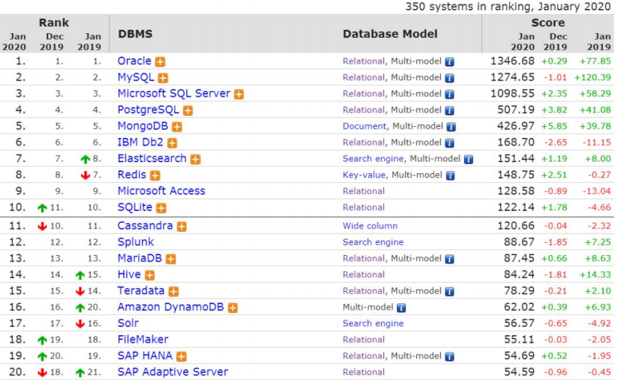

# 大数据学习-Java Day20

##  MySQL基础&SQL入门 

### 1 数据库概念

- 什么是数据库

  - 数据库(DataBase) 就是存储和管理数据的仓库 
  - 其本质是一个文件系统, 还是以文件的方式,将数据保存在电脑上 

- 为什么使用数据库

  - 数据存储方式的比较

    | 存储方 式 | 优点                                                         | 缺点                                           |
    | --------- | ------------------------------------------------------------ | ---------------------------------------------- |
    | 内存      | 速度快                                                       | 不能够永久保存,数据是临时状态的                |
    | 文件      | 数据是可以永久保存的                                         | 使用IO流操作文件, 不方便                       |
    | 数据库    | 1.数据可以永久保存 2.方便存储和管理数据  3.使用统一的方式操作数据库 (SQL) | 占用资源,有些数据库需要付费(比如Oracle数据 库) |

     通过上面的比较,我们可以看出,使用数据库存储数据, 用户可以非常方便对数据库中的数据进行增加, 删 除, 修改及查询操作。 

-  常见的数据库软件排行榜 

  

### 2 Mysql的安装及配置

-  安装MySQL
  -  MySQL安装文档 
-  2.2 卸载MySQL 
  -  MySQL卸载文档 
- 2.3 MySQL环境变量配置 详见 MySQL环境变量配置文档 
  -  MySQL环境变量配置文档 

-  MySql的目录结构 
  - 

- 数据库管理系统
  -  什么是数据库管理系统 ? 
    - 数据库管理系统（DataBase Management System，DBMS）：指一种操作和管理维护数据库的大 型软件。 
    - MySQL就是一个 数据库管理系统软件, 安装了Mysql的电脑,我们叫它数据库服务器. 
  - 数据库管理系统的作用 
    - 用于建立、使用和维护数据库，对数据库进行统一的管理。
  - 数据库管理系统、数据库 和表之间的关系
    - MySQL中管理着很多数据库，在实际开发环境中 一个数据库一般对应了一个的应用，数据库当中保 存着多张表，每一张表对应着不同的业务，表中保存着对应业务的数据。 

- 数据库表
  -  数据库中以表为组织单位存储数据 
  - 表类似我们Java中的类,每个字段都有对应的数据类型 

### 3 Sql

-  什么是SQL ？ 
  - 结构化查询语言(Structured Query Language)简称SQL，是一种特殊目的的编程语言，是一种数据库 查询和程序设计语言，用于存取数据以及查询、更新和管理关系数据库系统。
- SQL 的作用 
  - 是所有关系型数据库的统一查询规范，不同的关系型数据库都支持SQL 
  - 所有的关系型数据库都可以使用SQL 
  - 不同数据库之间的SQL 有一些区别 方言 

-  SQL通用语法 

  -  SQL语句可以单行 或者 多行书写，以分号 结尾 ; （Sqlyog中可以不用写分号）

  - 可以使用空格和缩进来增加语句的可读性

  - MySql中使用SQL不区分大小写，一般关键字大写，数据库名 表名列名 小写

  -  注释方式  

    | 注释语法 | 说明                |
    | -------- | ------------------- |
    | -- 空格  | 单行注释            |
    | /* */    | 多行注释            |
    | \#       | MySql特有的单行注释 |

-  SQL的分类 

  - | 分类              | 说明                                                         |
    | ----------------- | ------------------------------------------------------------ |
    | 数据定义语 言     | 简称DDL(Data Definition Language)，用来定义数据库对象：数据库，表，列 等。 |
    | **数据操作语 言** | **简称DML(Data Manipulation Language)，用来对数据库中表的记录进行更新**。 |
    | **数据查询语 言** | **简称DQL(Data Query Language)，用来查询数据库中表的记录。** |
    | 数据控制语 言     | 简称DCL(Date Control Language)，用来定义数据库的访问权限和安全级别， 及创建用户。(了解) |

    