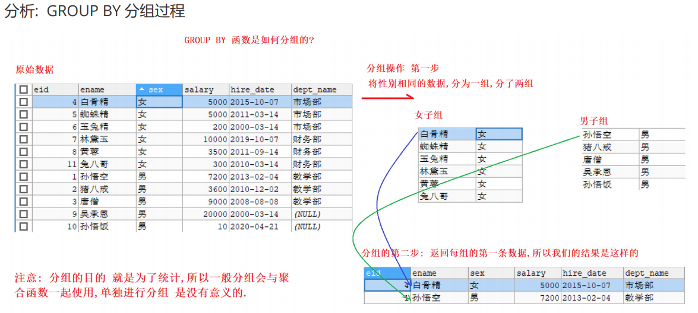
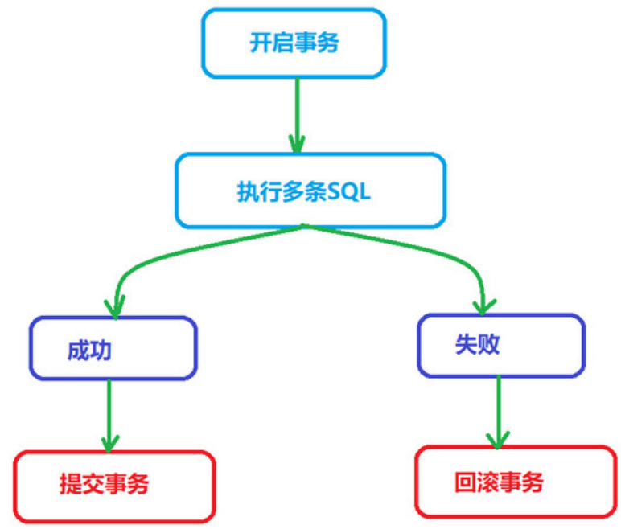
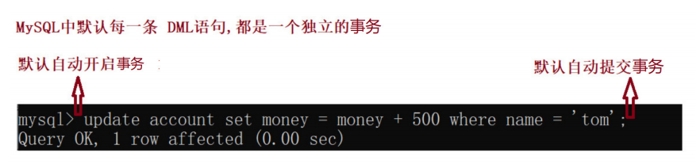

# 大数据学习-Java Day21

##   MySQL单表&约束&事务 

### 1  DQL操作单表 

-  创建数据库,复制表 

  ```mysql
  -- 创建一个新的数据库 db2
  CREATE DATABASE db2 CHARACTER SET utf8;
  # 创建员工表
  CREATE TABLE emp(
  eid INT,
  ename VARCHAR(20),
  sex CHAR(1),
  salary DOUBLE,
  hire_date DATE,
  dept_name VARCHAR(20)
  );
  # 添加数据
  
  INSERT INTO emp VALUES(1,'孙悟空','男',7200,'2013-02-04','教学部');
  INSERT INTO emp VALUES(2,'猪八戒','男',3600,'2010-12-02','教学部');
  INSERT INTO emp VALUES(3,'唐僧','男',9000,'2008-08-08','教学部');
  INSERT INTO emp VALUES(4,'白骨精','女',5000,'2015-10-07','市场部');
  INSERT INTO emp VALUES(5,'蜘蛛精','女',5000,'2011-03-14','市场部');
  INSERT INTO emp VALUES(6,'玉兔精','女',200,'2000-03-14','市场部');
  INSERT INTO emp VALUES(7,'林黛玉','女',10000,'2019-10-07','财务部');
  INSERT INTO emp VALUES(8,'黄蓉','女',3500,'2011-09-14','财务部');
  INSERT INTO emp VALUES(9,'吴承恩','男',20000,'2000-03-14',NULL);
  INSERT INTO emp VALUES(10,'孙悟饭','男', 10,'2020-03-14',财务部);
  INSERT INTO emp VALUES(11,'兔八哥','女', 300,'2010-03-14',财务部);
  ```

- 排序

   通过 ORDER BY 子句,可以将查询出的结果进行排序(排序只是显示效果,不会影响真实数据) 语法结构 

  ```sql
  SELECT 字段名 FROM 表名 [WHERE 字段 = 值] ORDER BY 字段名 [ASC / DESC]
  ASC 表示升序排序(默认)
  DESC 表示降序排序
  
  ```

  - 单列排序

    ```sql
    /*
    只按照某一个字段进行排序, 就是单列排序
    需求1:
    使用 salary 字段,对emp 表数据进行排序 (升序/降序
    */
    -- 默认升序排序 ASC
    SELECT * FROM emp ORDER BY salary;
    -- 降序排序
    SELECT * FROM emp ORDER BY salary DESC;
    
    ```

  - 组合排序

    ```sql
    /*
    同时对多个字段进行排序, 如果第一个字段相同 就按照第二个字段进行排序,以此类推
    需求2:
    在薪水排序的基础上,再使用id进行排序, 如果薪水相同就以id 做降序排序
    */
    -- 组合排序
    SELECT * FROM emp ORDER BY salary DESC, eid DESC;
    ```

- 聚合函数

   之前我们做的查询都是横向查询，它们都是根据条件一行一行的进行判断，而使用聚合函数查询是纵 向查询，它是对某一列的值进行计算，然后返回一个单一的值(另外聚合函数会忽略null空值。)； 

  ```
  SELECT 聚合函数(字段名) FROM 表名;
  ```

  | 聚合函数    | 作用                         |
  | ----------- | ---------------------------- |
  | count(字段) | 统计指定列不为NULL的记录行数 |
  | sum(字段)   | 计算指定列的数值和           |
  | max(字段)   | 计算指定列的最大值           |
  | min(字段)   | 计算指定列的最小值           |
  | avg(字段)   | 计算指定列的平均值           |

  ```mysql
  # 需求1
  #1 查询员工的总数
  #2 查看员工总薪水、最高薪水、最小薪水、薪水的平均值
  #3 查询薪水大于4000员工的个数
  #4 查询部门为'教学部'的所有员工的个数
  #5 查询部门为'市场部'所有员工的平均薪水
  
  #1 查询员工的总数
  -- 统计表中的记录条数 使用 count()
  SELECT COUNT(eid) FROM emp; -- 使用某一个字段
  SELECT COUNT(*) FROM emp; -- 使用 *
  SELECT COUNT(1) FROM emp; -- 使用 1,与 * 效果一样
  -- 下面这条SQL 得到的总条数不准确,因为count函数忽略了空值
  -- 所以使用时注意不要使用带有null的列进行统计
  SELECT COUNT(dept_name) FROM emp;
  
  #2 查看员工总薪水、最高薪水、最小薪水、薪水的平均值
  -- sum函数求和, max函数求最大, min函数求最小, avg函数求平均值
  SELECT
  SUM(salary) AS '总薪水',
  MAX(salary) AS '最高薪水',
  MIN(salary) AS '最低薪水',
  AVG(salary) AS '平均薪水'
  FROM emp;
  
  #3 查询薪水大于4000员工的个数
  SELECT COUNT(*) FROM emp WHERE salary > 4000;
  
  #4 查询部门为'教学部'的所有员工的个数
  SELECT COUNT(*) FROM emp WHERE dept_name = '教学部';
  
  #5 查询部门为'市场部'所有员工的平均薪水
  SELECT
  AVG(salary) AS '市场部平均薪资'
  FROM emp
  WHERE dept_name = '市场部';
  ```

- 分组

   分组查询指的是使用 GROUP BY 语句,对查询的信息进行分组,相同数据作为一组  

  

  

  ```mysql
  -- SELECT 分组字段/聚合函数 FROM 表名 GROUP BY 分组字段 [HAVING 条件];
  
  # 需求1: 通过性别字段 进行分组
  -- 按照性别进行分组操作
  SELECT * FROM emp GROUP BY sex; -- 注意 这样写没有意义
  
  # 需求: 通过性别字段 进行分组,求各组的平均薪资
  SELECT sex, AVG(salary) FROM emp GROUP BY sex;
  
  #1.查询所有部门信息
  #2.查询每个部门的平均薪资
  #3.查询每个部门的平均薪资, 部门名称不能为null
  #1. 查询有几个部门
  SELECT dept_name AS '部门名称' FROM emp GROUP BY dept_name;
  #2.查询每个部门的平均薪资
  SELECT
  dept_name AS '部门名称',
  AVG(salary) AS '平均薪资'
  FROM emp GROUP BY dept_name;
  #3.查询每个部门的平均薪资, 部门名称不能为null
  SELECT
  dept_name AS '部门名称',
  AVG(salary) AS '平均薪资'
  FROM emp WHERE dept_name IS NOT NULL GROUP BY dept_name;
  
  # 查询平均薪资大于6000的部门.
  -- 需要在分组后,对数据进行过滤,使用 关键字 hiving
  -- 分组操作中的having子语句，是用于在分组后对数据进行过滤的，作用类似于where条件。
  # 查询平均薪资大于6000的部门
  -- 需要在分组后再次进行过滤,使用 having
  SELECT
  dept_name ,
  AVG(salary)
  FROM emp WHERE dept_name IS NOT NULL GROUP BY dept_name HAVING AVG(salary) >
  6000 ;
  ```

  **注意**

  ​	 分组时可以查询要分组的字段, 或者使用聚合函数进行统计操作. * 查询其他字段没有意义  

  | 过滤方式 | 特点                                                   |
  | -------- | ------------------------------------------------------ |
  | where    | where 进行分组前的过滤<br /> where 后面不能写 聚合函数 |
  | having   | having 是分组后的过滤<br /> having 后面可以写 聚合函数 |

-  limit关键字 

  ```mysql
  /*
  limit是限制的意思,用于 限制返回的查询结果的行数 (可以通过limit指定查询多少行数据)
  limit 语法是 MySql的方言,用来完成分页
  
  SELECT 字段1,字段2... FROM 表名 LIMIT offset , length;
  limit offset , length; 关键字可以接受一个 或者两个 为0 或者正整数的参数
  offset 起始行数, 从0开始记数, 如果省略 则默认为 0.
  length 返回的行数
  */
  
  # 查询emp表中的前 5条数据
  # 查询emp表中 从第4条开始,查询6条
  # 查询emp表中的前 5条数据
  -- 参数1 起始值,默认是0 , 参数2 要查询的条数
  SELECT * FROM emp LIMIT 5;
  SELECT * FROM emp LIMIT 0 , 5;
  # 查询emp表中 从第4条开始,查询6条
  -- 起始值默认是从0开始的.
  SELECT * FROM emp LIMIT 3 , 6;
  
  -- 分页操作 每页显示3条数据
  SELECT * FROM emp LIMIT 0,3; -- 第1页
  SELECT * FROM emp LIMIT 3,3; -- 第2页 2-1=1 1*3=3
  SELECT * FROM emp LIMIT 6,3; -- 第三页
  -- 分页公式 起始索引 = (当前页 - 1) * 每页条数
  -- limit是MySql中的方言
  ```


### 2  SQL约束 

1.   约束的作用: 

   对表中的数据进行进一步的限制，从而保证数据的正确性、有效性、完整性. 违反约束的不正确数据,将无法插入到表中 

2.  常见的约束 

   | 约束名 | 约束关键字  |
   | ------ | ----------- |
   | 主键   | primary key |
   | 唯一   | unique      |
   | 非空   | not null    |
   | 外键   | foreign key |

-  主键约束 

  -   特点： 不可重复 唯一 非空  

  -  作用： 用来表示数据库中的每一条记录  

  - 添加主键约束

    ```mysql
    字段名 字段类型 primary key
    
    # 需求: 创建一个带主键的表
    
    # 方式1 创建一个带主键的表
    CREATE TABLE emp2(
    -- 设置主键 唯一 非空
    eid INT PRIMARY KEY,
    ename VARCHAR(20),
    sex CHAR(1)
    );
    -- 删除表
    DROP TABLE emp2;
    -- 方式2 创建一个带主键的表
    CREATE TABLE emp2(
    eid INT ,
    ename VARCHAR(20),
    sex CHAR(1),
    -- 指定主键为 eid字段
    PRIMARY KEY(eid)
    );
    -- 方式3 创建一个带主键的表
    CREATE TABLE emp2(
    eid INT ,
    ename VARCHAR(20),
    sex CHAR(1)
    )
    -- 创建的时候不指定主键,然后通过 DDL语句进行设置
    ALTER TABLE emp2 ADD PRIMARY KEY(eid);
    
    #DESC 查看表结构
    -- 查看表的详细信息
    DESC emp2;
    ```

    

    ```mysql
    # 测试主键的唯一性 非空性
    
    # 正常插入一条数据
    INSERT INTO emp2 VALUES(1,'宋江','男');
    # 插入一条数据,主键为空
    -- Column 'eid' cannot be null 主键不能为空
    INSERT INTO emp2 VALUES(NULL,'李逵','男');
    # 插入一条数据,主键为 1
    -- Duplicate entry '1' for key 'PRIMARY' 主键不能重复
    INSERT INTO emp2 VALUES(1,'孙二娘','女');
    
    ```

    - 哪些字段可以作为主键
      -  通常针对业务去设计主键,每张表都设计一个主键id
      -  主键是给数据库和程序使用的,跟最终的客户无关,所以主键没有意义没有关系,只要能够保证不重复 就好,比如 身份证就可以作为主键. 

  -  删除主键约束 

    - ```mysql
      -- 使用DDL语句 删除表中的主键
      ALTER TABLE emp2 DROP PRIMARY KEY;
      DESC emp2;
      
      ```

  -  主键的自增 

    -  **主键如果让我们自己添加很有可能重复,我们通常希望在每次插入新记录时,数据库自动生成主键字段 的值.** 

    ```mysql
    # 关键字:
    # AUTO_INCREMENT 表示自动增长(字段类型必须是整数类型)
    
    -- 创建主键自增的表
    CREATE TABLE emp2(
    -- 关键字 AUTO_INCREMENT,主键类型必须是整数类型
    eid INT PRIMARY KEY AUTO_INCREMENT,
    ename VARCHAR(20),
    sex CHAR(1)
    );
    
    --添加数据 观察主键的自增
    INSERT INTO emp2(ename,sex) VALUES('张三','男');
    INSERT INTO emp2(ename,sex) VALUES('李四','男');
    INSERT INTO emp2 VALUES(NULL,'翠花','女');
    INSERT INTO emp2 VALUES(NULL,'艳秋','女');
    ```

  -  修改主键自增的起始值 

     默认地 AUTO_INCREMENT 的开始值是 1，如果希望修改起始值,请使用下面的方式  

    ```mysql
    -- 创建主键自增的表,自定义自增其实值
    CREATE TABLE emp2(
    eid INT PRIMARY KEY AUTO_INCREMENT,
    ename VARCHAR(20),
    sex CHAR(1)
    )AUTO_INCREMENT=100;
    -- 插入数据,观察主键的起始值
    INSERT INTO emp2(ename,sex) VALUES('张百万','男');
    INSERT INTO emp2(ename,sex) VALUES('艳秋','女');
    ```

  -  DELETE和TRUNCATE对自增长的影响 

    | 清空表数据的方式  | 特点                                                        |
    | ----------------- | ----------------------------------------------------------- |
    | DELETE            | 只是删除表中所有数据,对自增没有影响                         |
    | TRUNCATE truncate | 是将整个表删除掉,然后创建一个新的表 自增的主键,重新从 1开始 |

    ```mysql
    # 测试1: delete 删除表中所有数据
    -- 目前最后的主键值是 101
    SELECT * FROM emp2;
    -- delete 删除表中数据,对自增没有影响
    DELETE FROM emp2;
    -- 插入数据 查看主键
    INSERT INTO emp2(ename,sex) VALUES('张百万','男');
    INSERT INTO emp2(ename,sex) VALUES('艳秋','女');
    
    # 测试2: truncate删除 表中数据
    -- 使用 truncate 删除表中所有数据,
    TRUNCATE TABLE emp2;
    -- 插入数据 查看主键
    INSERT INTO emp2(ename,sex) VALUES('张百万','男');
    INSERT INTO emp2(ename,sex) VALUES('艳秋','女');
    ```

-  唯一约束 

  -  **唯一约束的特点: 表中的某一列的值不能重复( 对null不做唯一的判断 )**  

  ```mysql
  字段名 字段值 unique
  
  # 添加唯一约束
  #创建emp3表 为ename 字段添加唯一约束
  CREATE TABLE emp3(
  eid INT PRIMARY KEY AUTO_INCREMENT,
  ename VARCHAR(20) UNIQUE,
  sex CHAR(1)
  );
  
  #  测试唯一约束
  -- 测试唯一约束 添加一条数据
  INSERT INTO emp3 (ename,sex) VALUES('张百万','男');
  -- 添加一条 ename重复的 数据
  -- Duplicate entry '张百万' for key 'ename' ename不能重复
  INSERT INTO emp3 (ename,sex) VALUES('张百万','女');
  ```

  -  主键约束与唯一约束的区别:  
    1.  主键约束 唯一且不能够为空 
    2.  唯一约束,唯一 但是可以为空 
    3.  一个表中只能有一个主键 , 但是可以有多个唯一约束 

-  外键约束 

  -  FOREIGN KEY 表示外键约束 ,与多表关联一起

-  默认值 

  -  默认值约束 用来指定某列的默认值 

  ```mysql
  字段名 字段类型 DEFAULT 默认值
  
  #  创建emp4表, 性别字段默认 女
  CREATE TABLE emp4(
  eid INT PRIMARY KEY AUTO_INCREMENT,
  -- 为ename 字段添加默认值
  ename VARCHAR(20) DEFAULT '奥利给',
  sex CHAR(1)
  );
  
  # 测试 添加数据使用默认值
  -- 添加数据 使用默认值
  INSERT INTO emp4(ename,sex) VALUES(DEFAULT,'男');
  INSERT INTO emp4(sex) VALUES('女');
  -- 不使用默认值
  INSERT INTO emp4(ename,sex) VALUES('艳秋','女');
  ```

  

###  数据库事务 

-  什么是事务 
  -  事务是一个整体,由一条或者多条SQL 语句组成,这些SQL语句要么都执行成功,要么都执行失败, 只要有 一条SQL出现异常,整个操作就会回滚,整个业务执行失败  
    -  比如: 银行的转账业务,张三给李四转账500元 , 至少要操作两次数据库, 张三 -500, 李四 + 500,这中 间任何一步出现问题,整个操作就必须全部回滚, 这样才能保证用户和银行都没有损失.  

-  回滚  
  -  即在事务运行的过程中发生了某种故障，事务不能继续执行，系统将事务中对数据库的所有已完成 的操作全部撤销，滚回到事务开始时的状态。（在提交之前执行） 

-  模拟转账操作 

  ```mysql
  -- 创建账户表
  CREATE TABLE account(
  -- 主键
  id INT PRIMARY KEY AUTO_INCREMENT,
  -- 姓名
  NAME VARCHAR(10),
  -- 余额
  money DOUBLE
  );
  -- 添加两个用户
  INSERT INTO account (NAME, money) VALUES ('tom', 1000), ('jack', 1000);
  
  -- tom账户 -500元
  UPDATE account SET money = money - 500 WHERE NAME = 'tom';
  -- jack账户 + 500元
  UPDATE account SET money = money + 500 WHERE NAME = 'jack';
  ```

  **注：**

   假设当tom 账号上 -500 元,服务器崩溃了。jack 的账号并没有+500 元，数据就出现问题了。 

  我们要保证整个事务执行的完整性,要么都成功, 要么都失败. 这个时候我们就要学习如何操作事 务.  

-  MySQL事务操作 

  -  MYSQL 中可以有两种方式进行事务的操作： 

    - 手动提交事务 
    - 自动提交事务 

  -  手动提交事务 

    | 功能     | 语句                           |
    | -------- | ------------------------------ |
    | 开启事务 | start transaction; 或者 BEGIN; |
    | 提交事务 | commit;                        |
    | 回滚事务 | rollback;                      |

    -  START TRANSACTION 
      - 这个语句显式地标记一个事务的起始点。 
    - COMMIT
      -  表示提交事务，即提交事务的所有操作，具体地说，就是将事务中所有对数据库的更新都写 到磁盘上的物理数据库中，事务正常结束。 
    - ROLLBACK 
      - 表示撤销事务，即在事务运行的过程中发生了某种故障，事务不能继续执行，系统将事务中 对数据库的所有已完成的操作全部撤销，回滚到事务开始时的状态 

  -  手动提交事务流程 

    -  执行成功的情况： 开启事务 -> 执行多条 SQL 语句 -> 成功提交事务 

    - 执行失败的情况： 开启事务 -> 执行多条 SQL 语句 -> 事务的回滚 

      

    ##### 案例  模拟张三给李四转 500 元钱 

    ```mysql
    #  使用db2数据库
    USE db2;
    
    # 开启事务
    start transaction;
    
    # tom账户 -500
    update account set money = money - 500 where name = 'tom'
    
    # jack账户 +500
    update account set money = money + 500 where name = 'jack';
    
    #  此时发现数据并没有改变
    
    #在控制台执行 commit 提交事务
    commit;
    
    #  再次查看, 发现数据在事务提交之后,发生改变
    ```

    ##### 事务回滚  如果事务中，上述语句中有某条sql语句执行时报错了，我们没有手动的commit，那整个事务会自动回滚 

    ```mysql
    # 命令行 开启事务
    start transaction;
    
    # 插入两条数据
    INSERT INTO account VALUES(NULL,'张百万',3000);
    INSERT INTO account VALUES(NULL,'有财',3500);
    
    # 不去提交事务 直接关闭窗口,发生回滚操作,数据没有改变
    ```

    **注： 如果事务中 SQL 语句没有问题，commit 提交事务，会对数据库数据的数据进行改变。 如果事务 中 SQL 语句有问题，rollback 回滚事务，会回退到开启事务时的状态。** 

  -  自动提交事务 

    -  MySQL 默认每一条 DML(增删改)语句都是一个单独的事务，每条语句都会自动开启一个事务，语句 执行完毕 自动提交事务，MySQL 默认开始自动提交事务 

      

    -  取消自动提交 

      -  MySQL默认是自动提交事务,设置为手动提交.

        ```mysql
        # 登录mysql，查看autocommit状态。
        SHOW VARIABLES LIKE 'autocommit';
        
        # on ：自动提交	off : 手动提交
        #  把 autocommit 改成 off;
        SET @@autocommit=off;
        
        -- 选择数据库
        use db2;
        -- 修改数据
        update account set money = money - 500 where name = 'jack';
        -- 手动提交
        commit;
        # 此时不提交数据不会改变
        ```

-    **事务的四大特性 ACID** 

  | 特 性  | 含义                                                         |
  | ------ | ------------------------------------------------------------ |
  | 原子性 | 每个事务都是一个整体，不可再拆分，事务中所有的 SQL 语句要么都执行成功， 要么都 失败。 |
  | 一致性 | 事务在执行前数据库的状态与执行后数据库的状态保持一致。如：转账前2个人的 总金额 是 2000，转账后 2 个人总金额也是 2000. |
  | 隔离性 | 事务与事务之间不应该相互影响，执行时保持隔离的状态.          |
  | 持久性 | 一旦事务执行成功，对数据库的修改是持久的。就算关机，数据也是要保存下来的. |

-  MySQL 事务隔离级别

  -  数据并发访问 

    -  一个数据库可能拥有多个访问客户端,这些客户端都可以并发方式访问数据库. 数据库的相同数据可能 被多个事务同时访问,如果不采取隔离措施,就会导致各种问题, 破坏数据的完整性  

  -  并发访问会产生的问题 

    -  事务在操作时的理想状态： 所有的事务之间保持隔离，互不影响。因为并发操作，多个用户同时访问 同一个 数据。可能引发并发访问的问题  

      | 并发访问的问题 | 说明                                                         |
      | -------------- | ------------------------------------------------------------ |
      | 脏读           | 一个事务读取到了另一个事务中尚未提交的数据                   |
      | 不可重复读     | 一个事务中两次读取的数据内容不一致, 要求的是在一个事务中多次读取时数据是一 致的. 这是进行 update 操作时引发的问题 |
      | 幻读           | 一个事务中,某一次的 select 操作得到的结果所表征的数据状态, 无法支撑后续的业务 操作. 查询得到的数据状态不准确,导致幻读. |

  -   四种隔离级别 

    -  通过设置隔离级别,可以防止上面的三种并发问题. 

    - MySQL数据库有四种隔离级别 上面的级别最低，下面的级别最高。  

       ✔ 会出现问题 ✘ 不会出现问题 

      | 级别 | 名字     | 隔离级别         | 脏读 | 不可重复读 | 幻读 | 数据库的默认隔离级别 |
      | ---- | -------- | ---------------- | ---- | ---------- | ---- | -------------------- |
      | 1    | 读未提交 | read uncommitted | ✔    | ✔          | ✔    |                      |
      | 2    | 读已提交 | read committed   | ✘    | ✔          | ✔    | Oracle和SQLServer    |
      | 3    | 可重复读 | repeatable read  | ✘    | ✘          | ✔    | MySql                |
      | 4    | 串行化   | serializable     | ✘    | ✘          | ✘    |                      |

    - 隔离级别相关命令

      ```mysql
      # 查看隔离级别
      select @@tx_isolation;
      
      # mysql的默认隔离级别，可重复读(repeatable read) 可以防止脏读与不可重复读，不能防止幻读
      
      # 设置事务隔离级别，需要退出 MySQL 再重新登录才能看到隔离级别的变化
      set global transaction isolation level 级别名称;
      read uncommitted 读未提交
      read committed 读已提交
      repeatable read 可重复读
      serializable 串行化
      
      # 例如: 修改隔离级别为 读未提交
      set global transaction isolation level read uncommitted;
      
      ```

-  隔离性问题演示 

  -  脏读演示 

    -  一个事务读取到了另一个事务中尚未提交的数据 

      ```mysql
      # 使用db2 数据库
      use db2;
      
      # 设置隔离级别为最低 读未提交
      set global transaction isolation level read uncommitted;
      
      # 开启新的 窗口A
      # 查询隔离级别
      select @@tx_isolation;
      
      # 再开启一个新的窗口 B
      # 选择数据库
      use db2;
      # 开启事务
      start transaction;
      #查询
      select * from account;
      # 用户数据余额预先设置为1k
      
      # A执行
      use db2;
      # 开启事务
      start transaction;
      # 执行修改操作
      -- tom账户 -500元
      UPDATE account SET money = money - 500 WHERE NAME = 'tom';
      -- jack账户 + 500元
      UPDATE account SET money = money + 500 WHERE NAME = 'jack';
      
      # B查询
      # select * from account;
      -- 此时A窗口开启事务，对数据进行修改，但是没有提交事务
      -- B窗口查询到A窗口未提交的数据，出现了脏读
      
      #  A窗口转账异常,进行回滚
      rollback;
      
      # B 窗口再次查询 账户
      select * from account;
      # 此时由于A窗口的执行出现异常发生回滚，B窗口再次查询时，钱又不见了
      ```

    - 脏读问题的解决

      -  脏读非常危险的，比如张三向李四购买商品，张三开启事务，向李四账号转入 500 块，然后打电 话给李四说钱 已经转了。李四一查询钱到账了，发货给张三。张三收到货后回滚事务，李四的再 查看钱没了。 

      - 解决方案

        -  将全局的隔离级别进行提升为: read committed 

        ```mysql
        # 在 A 窗口设置全局的隔离级别为 read committed
        set global transaction isolation level read committed;
        
        # 重新开启A窗口, 查看设置是否成功.
        select @@tx_isolation;
        
        # . 开启B 窗口, A 和 B 窗口选择数据库后, 都开启事务
        start transaction;
        
        # A 窗口 只是更新两个人的账户, 不提交事务
        -- tom账户 -500元
        UPDATE account SET money = money - 500 WHERE NAME = 'tom';
        -- jack账户 + 500元
        UPDATE account SET money = money + 500 WHERE NAME = 'jack';
        
        #B 窗口进行查询,没有查询到未提交的数据
        mysqlselect * from account;
        # 此时A窗口开启事务后，对数据进行修改，但是不提交，B窗口进行查询，数据没有改变
        
        # A窗口commit提交数据
        commit
        
        # B 窗口查看数据
        select * from account;
        # 在A提交数据后 B才开到修改后的数据
        ```

  - 不可重复读演示

    -  不可重复读: 同一个事务中,进行查询操作,但是每次读取的数据内容是不一样的 

    ```mysql
    # 数据恢复初始值1k，打开两个窗口A与B，开启事务
    use db2;
    start transaction;
    
    # B 窗口开启事务后, 先进行一次数据查询
    select * from account;
    
    #  在 A 窗口开启事务后，将用户tom的账户 + 500 ,然后提交事务
    -- 修改数据
    update account set money = money + 500 where name = 'tom';
    -- 提交事务
    commit;
    
    #  B 窗口再次查询数据
    select * from account;
    # 此时在同一个事务内，两次查询结果不一致，出现不可重复的问题，不知道以那次为准
    ```

    -  两次查询输出的结果不同，到底哪次是对的？ 

      -  比如银行程序需要将查询结果分别输出到电脑屏幕和发短信给客 户，结果在一个事务 中针对不同的输出目的地进行的两次查询不一致，导致文件和屏幕中的结果不一致，银 行工作 人员就不知道以哪个为准了 

    - 解决不可重复读问题

       将全局的隔离级别进行提升为： repeatable read 

      ```mysql
      # 打开A 窗口, 设置隔离级别为：repeatable read
      -- 查看事务隔离级别
      select @@tx_isolation;
      -- 设置事务隔离级别为 repeatable read
      set global transaction isolation level repeatable read;
      
      # 重新开启 A,B 窗口 选择数据库 ,同时开启事务
      
      # B 窗口事务 先进行第一次查询
      select * from account;
      
      # A 窗口更新数据, 然后提交事务
      -- 修改数据
      update account set money = money + 500 where name = 'tom';
      -- 提交事务
      commit;
      
      # B 窗口 再次查询
      select * from account;
      # 同一个事务中为了保证多次查询数据一致，必须使用 repeatable read 隔离级别
      # mysql的默认隔离级别也是repeatable read
      ```

  -  幻读演示 

    ​	幻读: select 某记录是否存在，不存在，准备插入此记录，但执行 insert 时发现此记录已存在， 无法插入，此时就发生了幻读。  

    ```mysql
    # 打开AB窗口，开启事务
    
    # A 窗口 先执行一次查询操作
    -- 假设要再添加一条id为3的 数据,在添加之前先判断是否存在
    select * from account where id = 3;
    # 查询结果 不存在，可以插入
    
    # B 窗口 插入一条数据 提交事务
    INSERT INTO account VALUES(3,'lucy',1000);
    commit;
    
    # A 窗口执行 插入操作, 发现报错. 出现幻读 报错主键重复
    ```

    - 解决幻读问题
      -  将事务隔离级别设置到最高 SERIALIZABLE ，以挡住幻读的发生 
      - 如果一个事务，使用了SERIALIZABLE——可串行化隔离级别时，在这个事务没有被提交之前 , 其 他的线程，只能等到当前操作完成之后，才能进行操作，这样会非常耗时，而且，影响数据库的 性能，数据库不会使用这种隔离级别 

  - **总结： serializable 串行化可以彻底解决幻读,但是 事务只能排队执行,严重影响效率, 数据库不会使用这种隔离级别** 

