# 大数据学习-Java Day22

##    MySQL多表&外键&数据库设计 

### 1 多表

- 单表的缺点

  - 数据准备

    ```mysql
     # 创建一个数据库 db3
     CREATE DATABASE db3 CHARACTER SET utf8;
    
    #  数据库中 创建一个员工表 emp ,
    # 包含如下列 eid, ename, age, dep_name, dep_location
    # eid 为主键并 自动增长, 添加 5 条数据
    CREATE TABLE emp(
    eid INT PRIMARY KEY AUTO_INCREMENT,
    ename VARCHAR(20),
    age INT ,
    dep_name VARCHAR(20),
    dep_location VARCHAR(20)
    );
    
    INSERT INTO emp (ename, age, dep_name, dep_location) VALUES ('张百万', 20, '研发
    部', '广州');
    INSERT INTO emp (ename, age, dep_name, dep_location) VALUES ('赵四', 21, '研发
    部', '广州');
    INSERT INTO emp (ename, age, dep_name, dep_location) VALUES ('广坤', 20, '研发
    部', '广州');
    INSERT INTO emp (ename, age, dep_name, dep_location) VALUES ('小斌', 20, '销售
    部', '深圳');
    INSERT INTO emp (ename, age, dep_name, dep_location) VALUES ('艳秋', 22, '销售
    部', '深圳');
    INSERT INTO emp (ename, age, dep_name, dep_location) VALUES ('大玲子', 18, '销售
    部', '深圳');
    ```

    **由查询结果可知，单表会造成冗余，同一个字段内出现大量重复的数据**

- 解决方案

  ```MYSQL
  # 多表设计
  
  # department 部门表 : id, dep_name, dep_location
  # employee 员工表: eid, ename, age, dep_id
  -- 创建部门表
  -- 一方,主表
  CREATE TABLE department(
  id INT PRIMARY KEY AUTO_INCREMENT,
  dep_name VARCHAR(30),
  dep_location VARCHAR(30)
  );
  -- 创建员工表
  -- 多方 ,从表
  CREATE TABLE employee(
  eid INT PRIMARY KEY AUTO_INCREMENT,
  ename VARCHAR(20),
  age INT,
  dept_id INT
  );
  
  # 添加部门表 数据
  INSERT INTO department VALUES(NULL, '研发部','广州'),(NULL, '销售部', '深圳');
  SELECT * FROM department;
  
  # 添加员工表 数据
  INSERT INTO employee (ename, age, dept_id) VALUES ('张百万', 20, 1);
  INSERT INTO employee (ename, age, dept_id) VALUES ('赵四', 21, 1);
  INSERT INTO employee (ename, age, dept_id) VALUES ('广坤', 20, 1);
  INSERT INTO employee (ename, age, dept_id) VALUES ('小斌', 20, 2);
  INSERT INTO employee (ename, age, dept_id) VALUES ('艳秋', 22, 2);
  INSERT INTO employee (ename, age, dept_id) VALUES ('大玲子', 18, 2);
  SELECT * FROM employee;
  
  ```

  **此时查看两张表结构，员工表中字段dept_id与部门表中的主键对应，该字段就是外键**

  **一般有外键的员工表，称为从表，与外键对应的主键，称为主表**

- 存在的问题

  - 如果在dept_id字段中存入不存在的部门id，也可成功，但是我们需要保证员工表中的dept_id必须在部门表中存在
  - 使用外键约束，约束dept_id字段必须是部门表中存在的id

- 外键约束（慎用）

  - 概念

    -  在 从表 中 与 主表 的主键对应的那个字段,比如员工表的 dept_id,就是外键 
    -  使用外键约束可以让两张表之间产生一个对应关系,从而保证主从表的引用的完整性 

  - 创建外键约束

    ```mysql
    #  语法格式:
    -- 新建
    [CONSTRAINT] [外键约束名称] FOREIGN KEY(外键字段名) REFERENCES 主表名(主键字段名)
    -- 已有表添加
    ALTER TABLE 从表 ADD [CONSTRAINT] [外键约束名称] FOREIGN KEY (外键字段名) REFERENCES
    主表(主 键字段名);
    
    # 重新创建employee表, 添加外键约束
    -- 先删除 employee表
    DROP TABLE employee;
    -- 重新创建 employee表,添加外键约束
    CREATE TABLE employee(
    eid INT PRIMARY KEY AUTO_INCREMENT,
    ename VARCHAR(20),
    age INT,
    dept_id INT,
    -- 添加外键约束
    CONSTRAINT emp_dept_fk FOREIGN KEY(dept_id) REFERENCES department(id)
    );
    -- 正常添加数据 (从表外键 对应主表主键)
    INSERT INTO employee (ename, age, dept_id) VALUES ('张百万', 20, 1);
    INSERT INTO employee (ename, age, dept_id) VALUES ('赵四', 21, 1);
    INSERT INTO employee (ename, age, dept_id) VALUES ('广坤', 20, 1);
    INSERT INTO employee (ename, age, dept_id) VALUES ('小斌', 20, 2);
    INSERT INTO employee (ename, age, dept_id) VALUES ('艳秋', 22, 2);
    INSERT INTO employee (ename, age, dept_id) VALUES ('大玲子', 18, 2);
    -- 插入一条有问题的数据 (部门id不存在)
    -- Cannot add or update a child row: a foreign key constraint fails
    INSERT INTO employee (ename, age, dept_id) VALUES ('错误', 18, 3);
    ```

    添加外键约束会产生强制性的外键数据检查，从而保证数据的完整和一致性

    

  -  删除外键约束 

    ```mysql
    # 语法格式
    alter table 从表 drop foreign key 外键约束名称
    
    -- 删除employee 表中的外键约束,外键约束名 emp_dept_fk
    ALTER TABLE employee DROP FOREIGN KEY emp_dept_fk;
    
    ```

  - 注意事项

    -  从表外键类型必须与主表主键类型一致 否则创建失败. 

    -  添加数据时, 应该先添加主表中的数据. 

    -  删除数据时,应该先删除从表中的数据.  

      ```mysql
      -- 添加一个新的部门
      INSERT INTO department(dep_name,dep_location) VALUES('市场部','北京');
      -- 添加一个属于市场部的员工
      INSERT INTO employee(ename,age,dept_id) VALUES('老胡',24,3);
      
      -- 删除数据时 应该先删除从表中的数据
      -- 报错 Cannot delete or update a parent row: a foreign key constraint fails
      -- 报错原因 不能删除主表的这条数据,因为在从表中有对这条数据的引用
      DELETE FROM department WHERE id = 3;
      
      -- 先删除从表的关联数据
      DELETE FROM employee WHERE dept_id = 3;
      -- 再删除主表的数据
      DELETE FROM department WHERE id = 3;
      ```

  - 级联删除

    -  如果想实现删除主表数据的同时,也删除掉从表数据,可以使用级联删除操作 

      ```mysql
      ON DELETE CASCADE  # 级联删除
      
      #  删除 employee表,重新创建,添加级联删除
      -- 重新创建添加级联操作
      CREATE TABLE employee(
      eid INT PRIMARY KEY AUTO_INCREMENT,
      ename VARCHAR(20),
      age INT,
      dept_id INT,
      CONSTRAINT emp_dept_fk FOREIGN KEY(dept_id) REFERENCES department(id)
      -- 添加级联删除
      ON DELETE CASCADE
      );
      -- 添加数据
      INSERT INTO employee (ename, age, dept_id) VALUES ('张百万', 20, 1);
      INSERT INTO employee (ename, age, dept_id) VALUES ('赵四', 21, 1);
      INSERT INTO employee (ename, age, dept_id) VALUES ('广坤', 20, 1);
      INSERT INTO employee (ename, age, dept_id) VALUES ('小斌', 20, 2);
      INSERT INTO employee (ename, age, dept_id) VALUES ('艳秋', 22, 2);
      INSERT INTO employee (ename, age, dept_id) VALUES ('大玲子', 18, 2);
      -- 删除部门编号为2 的记录
      DELETE FROM department WHERE id = 2;
      ```

      从查询结果可知，员工表中外兼职是2的记录也被删除了

### 2 多表关系设计

多表关系常有三种关系：一对多，多对多，一对一

- 一对多关系

  - 一对多建表原则

    - 从表创建一个字段，字段作为外键指向主表的主键

      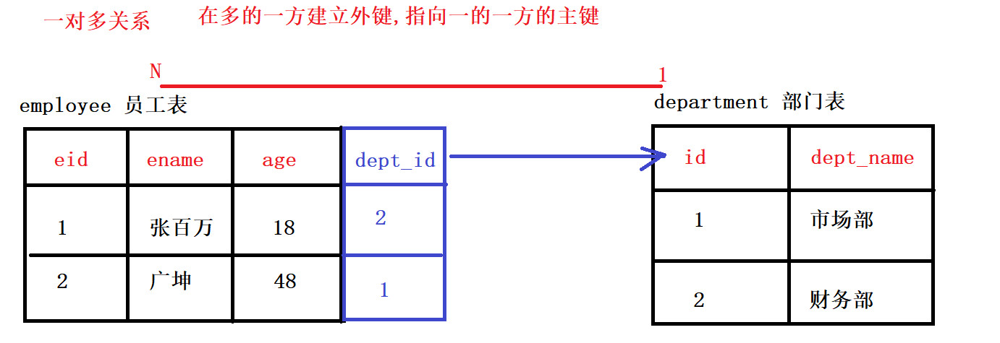

- 多对多关系

  - 多对多建表原则

    - 需要创建第三张表，中间表至少要有两个字段，这两个字段分别作为外键指向各自一方的主键

      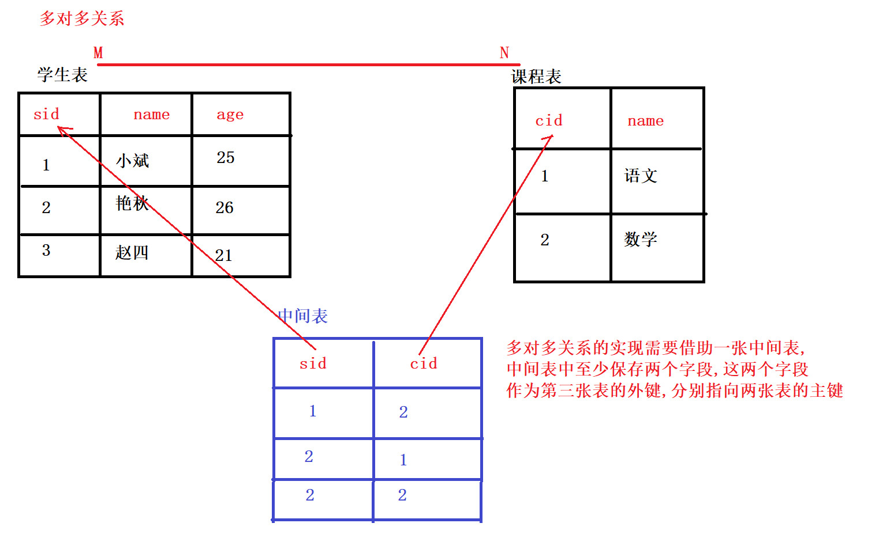

- 一对一关系

  - 一对一关系建表原则

    - 外键唯一，主表的主键和从表的外键（唯一），形成主外键关系，外键唯一

      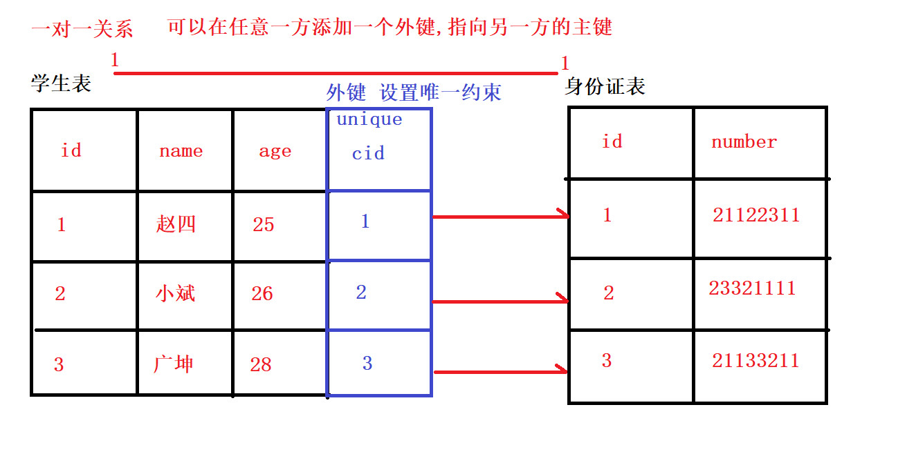

##### 案例 设计省市表

省和事之间的关系是一对多关系，一个省包含多个市

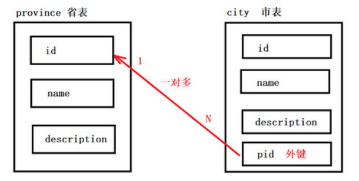

```mysql
#创建省表 (主表,注意: 一定要添加主键约束)
CREATE TABLE province(
id INT PRIMARY KEY AUTO_INCREMENT,
NAME VARCHAR(20),
description VARCHAR(20)
);
#创建市表 (从表,注意: 外键类型一定要与主表主键一致)
CREATE TABLE city(
id INT PRIMARY KEY AUTO_INCREMENT,
NAME VARCHAR(20),
description VARCHAR(20),
pid INT,
-- 添加外键约束
CONSTRAINT pro_city_fk FOREIGN KEY (pid) REFERENCES province(id)
);
```

##### 案例 设计演员与角色表

 演员与角色 是多对多关系, 一个演员可以饰演多个角色, 一个角色同样可以被不同的演员扮演 

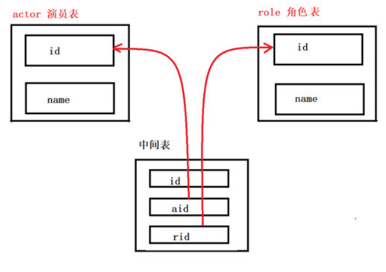

```mysql
#创建演员表
CREATE TABLE actor(
id INT PRIMARY KEY AUTO_INCREMENT,
NAME VARCHAR(20)
);
#创建角色表
CREATE TABLE role(
id INT PRIMARY KEY AUTO_INCREMENT,
NAME VARCHAR(20)
);
#创建中间表
CREATE TABLE actor_role(
-- 中间表自己的主键
id INT PRIMARY KEY AUTO_INCREMENT,
-- 指向actor 表的外键
aid INT,
-- 指向role 表的外键
rid INT
);

-- 为中间表的aid字段,添加外键约束 指向演员表的主键
ALTER TABLE actor_role ADD FOREIGN KEY(aid) REFERENCES actor(id);
-- 为中间表的rid字段, 添加外键约束 指向角色表的主键
ALTER TABLE actor_role ADD FOREIGN KEY(rid) REFERENCES role(id);
```

### 3 多表查询

- 数据准备

  ```mysql
  -- 创建 db3_2 数据库,指定编码
  CREATE DATABASE db3_2 CHARACTER SET utf8;
  
  # 创建分类表与商品表
  #分类表 (一方 主表)
  CREATE TABLE category (
  cid VARCHAR(32) PRIMARY KEY ,
  cname VARCHAR(50)
  );
  #商品表 (多方 从表)
  CREATE TABLE products(
  pid VARCHAR(32) PRIMARY KEY ,
  pname VARCHAR(50),
  price INT,
  flag VARCHAR(2), #是否上架标记为：1表示上架、0表示下架
  category_id VARCHAR(32),
  -- 添加外键约束
  FOREIGN KEY (category_id) REFERENCES category (cid)
  );
  
  # 插入数据
  #分类数据
  INSERT INTO category(cid,cname) VALUES('c001','家电');
  INSERT INTO category(cid,cname) VALUES('c002','鞋服');
  INSERT INTO category(cid,cname) VALUES('c003','化妆品');
  INSERT INTO category(cid,cname) VALUES('c004','汽车');
  #商品数据
  INSERT INTO products(pid, pname,price,flag,category_id) VALUES('p001','小米电视
  机',5000,'1','c001');
  INSERT INTO products(pid, pname,price,flag,category_id) VALUES('p002','格力空
  调',3000,'1','c001');
  INSERT INTO products(pid, pname,price,flag,category_id) VALUES('p003','美的冰
  箱',4500,'1','c001');
  INSERT INTO products (pid, pname,price,flag,category_id) VALUES('p004','篮球
  鞋',800,'1','c002');
  INSERT INTO products (pid, pname,price,flag,category_id) VALUES('p005','运动
  裤',200,'1','c002');
  INSERT INTO products (pid, pname,price,flag,category_id) VALUES('p006','T
  恤',300,'1','c002');
  INSERT INTO products (pid, pname,price,flag,category_id) VALUES('p007','冲锋
  衣',2000,'1','c002');
  INSERT INTO products (pid, pname,price,flag,category_id) VALUES('p008','神仙
  水',800,'1','c003');
  INSERT INTO products (pid, pname,price,flag,category_id) VALUES('p009','大
  宝',200,'1','c003');
  
  ```

- 笛卡尔积

  - 交叉连接查询会产生笛卡尔积，所以慎用

  ```mysql
  # 语法格式
  SELECT 字段名 FROM 表1, 表2;
  
  #  使用交叉连接查询 商品表与分类表
  SELECT * FROM category , products;
  
  ```

  从结果可知产生了笛卡尔积

  - 概念

    -  假设集合A={a, b}，集合B={0, 1, 2}，则两个集合的笛卡尔积为{(a, 0), (a, 1), (a, 2), (b, 0), (b, 1), (b, 2)}。  

      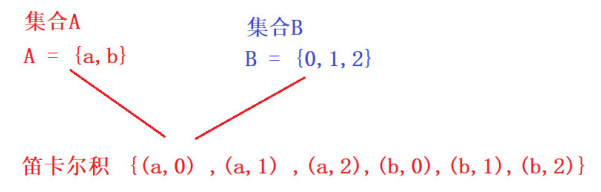

- 多表查询的分类

  - 内连接查询

    - 特点

      -  通过指定的条件去匹配两张表中的数据, 匹配上就显示,匹配不上就不显示 
        -  比如通过: 从表的外键 = 主表的主键 方式去匹配 

    - 隐式内连接

      -  from子句 后面直接写 多个表名 使用where指定连接条件的 这种连接方式是 隐式内连接. 使用where条件过滤无用的数据  

        ```mysql
        # 语法格式
        SELECT 字段名 FROM 左表, 右表 WHERE 连接条件;
        
        # 查询所有商品信息和对应的分类信息
        # 隐式内连接
        SELECT * FROM products,category WHERE category_id = cid;
        
        #  查询商品表的商品名称 和 价格,以及商品的分类信息
        # 可以通过给表起别名的方式, 方便我们的查询(有提示)
        SELECT
        p.`pname`,
        p.`price`,
        c.`cname`
        FROM products p , category c WHERE p.`category_id` = c.`cid`;
        
        #查询 格力空调是属于哪一分类下的商品
        SELECT p.`pname`,c.`cname` FROM products p , category c
        WHERE p.`category_id` = c.`cid` AND p.`pid` = 'p002';
        ```

    - 显示内连接

      -  使用 inner join ...on 这种方式, 就是显式内连接 

      ```mysql
      # 语法格式
      SELECT 字段名 FROM 左表 [INNER] JOIN 右表 ON 条件
      -- inner 可以省略
      
      #  查询所有商品信息和对应的分类信息
      # 显式内连接查询
      SELECT * FROM products p INNER JOIN category c ON p.category_id = c.cid;
      
      # 查询鞋服分类下,价格大于500的商品名称和价格
      # 查询鞋服分类下,价格大于500的商品名称和价格
      -- 我们需要确定的几件事
      -- 1.查询几张表 products & category
      -- 2.表的连接条件 从表.外键 = 主表的主键
      -- 3.查询的条件 cname = '鞋服' and price > 500
      -- 4.要查询的字段 pname price
      SELECT
      p.pname,
      p.price
      FROM products p INNER JOIN category c ON p.category_id = c.cid
      WHERE p.price > 500 AND cname = '鞋服';
      ```

    - 外连接查询

      - 左外连接

        -  左外连接 , 使用 LEFT OUTER JOIN , OUTER 可以省略 
        - 特点
          -  以左表为基准, 匹配右边表中的数据,如果匹配的上,就展示匹配到的数据 
          -  如果匹配不到, 左表中的数据正常展示, 右边的展示为null. 

        ```
        # 语法格式
        SELECT 字段名 FROM 左表 LEFT [OUTER] JOIN 右表 ON 条件
        
        -- 左外连接查询
        SELECT * FROM category c LEFT JOIN products p ON c.`cid`= p.`category_id`;
        
        # 左外连接, 查询每个分类下的商品个数
        # 查询每个分类下的商品个数
        /*
        1.连接条件: 主表.主键 = 从表.外键
        2.查询条件: 每个分类 需要分组
        3.要查询的字段: 分类名称, 分类下商品个数
        */
        SELECT
        c.`cname` AS '分类名称',
        COUNT(p.`pid`) AS '商品个数'
        FROM category c LEFT JOIN products p ON c.`cid` = p.`category_id`
        GROUP BY c.`cname`;
        ```

      - 右外连接

        -  右外连接 , 使用 RIGHT OUTER JOIN , OUTER 可以省略 

        - 特点

          -  以右表为基准，匹配左边表中的数据，如果能匹配到，展示匹配到的数据 
          -  如果匹配不到，右表中的数据正常展示, 左边展示为null 

          ```
          # 语法格式
          SELECT 字段名 FROM 左表 RIGHT [OUTER ]JOIN 右表 ON 条件
          
          -- 右外连接查询
          SELECT * FROM products p RIGHT JOIN category c ON p.`category_id` = c.`cid`;
          ```

    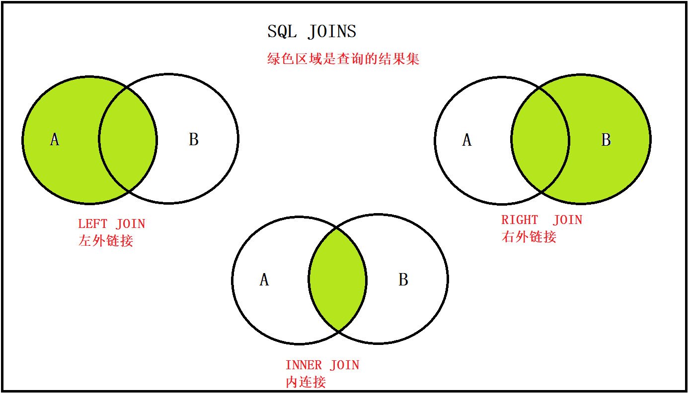

    -  内连接: inner join , 只获取两张表中 交集部分的数据. 
    -  左外连接: left join , 以左表为基准 ,查询左表的所有数据, 以及与右表有交集的部分  
    -  右外连接: right join , 以右表为基准,查询右表的所有的数据,以及与左表有交集的部分 

### 4 子查询

- 概念
  -  一条select 查询语句的结果, 作为另一条 select 语句的一部分 
- 特点
  -  子查询必须放在小括号中 
  - 子查询一般作为父查询的查询条件使用 
- 常见分类
  -  **where型 子查询**: 将子查询的结果, 作为父查询的比较条件 
  - **from型 子查询** : 将子查询的结果, 作为 一张表,提供给父层查询使用 
  - **exists型 子查询**: 子查询的结果是单列多行, 类似一个数组, 父层查询使用 IN 函数 ,包含子查 询的结果 

-  子查询的结果作为查询条件 

  ```mysql
  # 语法格式
  SELECT 查询字段 FROM 表 WHERE 字段=（子查询）;
  
  # 通过子查询的方式, 查询价格最高的商品信息
  -- 1.先查询出最高价格
  SELECT MAX(price) FROM products;
  -- 2.将最高价格作为条件,获取商品信息
  SELECT * FROM products WHERE price = (SELECT MAX(price) FROM products);
  
  #查询化妆品分类下的 商品名称 商品价格
  -- 先查出化妆品分类的 id
  SELECT cid FROM category WHERE cname = '化妆品';
  -- 根据分类id ,去商品表中查询对应的商品信息
  SELECT
  p.`pname`,
  p.`price`
  FROM products p
  WHERE p.`category_id` = (SELECT cid FROM category WHERE cname = '化妆品');
  
  # 查询小于平均价格的商品信息
  -- 1.查询平均价格
  SELECT AVG(price) FROM products; -- 1866
  -- 2.查询小于平均价格的商品
  SELECT * FROM products
  WHERE price < (SELECT AVG(price) FROM products);
  ```

-  子查询的结果作为一张表 

  ```mysql
  # 语法格式
  SELECT 查询字段 FROM （子查询）表别名 WHERE 条件;
  
  # 查询商品中,价格大于500的商品信息,包括 商品名称 商品价格 商品所属分类名称
  -- 1. 先查询分类表的数据
  SELECT * FROM category;
  -- 2.将上面的查询语句 作为一张表使用
  SELECT
  p.`pname`,
  p.`price`,
  c.cname
  FROM products p
  -- 子查询作为一张表使用时 要起别名 才能访问表中字段
  INNER JOIN (SELECT * FROM category) c
  ON p.`category_id` = c.cid WHERE p.`price` > 500;
  ```

  **注： 当子查询作为一张表的时候，需要起别名，否则无法访问表中的字段。** 

-  子查询结果是单列多行  

  -  子查询的结果类似一个数组, 父层查询使用 IN 函数 ,包含子查询的结果 

    ```mysql
    # 语法格式
    SELECT 查询字段 FROM 表 WHERE 字段 IN （子查询）;
    
    # 查询价格小于两千的商品,来自于哪些分类(名称)
    -- 先查询价格小于2000 的商品的,分类ID
    SELECT DISTINCT category_id FROM products WHERE price < 2000;
    -- 在根据分类的id信息,查询分类名称
    -- 报错: Subquery returns more than 1 row
    -- 子查询的结果 大于一行
    SELECT * FROM category
    WHERE cid = (SELECT DISTINCT category_id FROM products WHERE price < 2000);
    
    # 使用in函数, in( c002, c003 )
    -- 子查询获取的是单列多行数据
    SELECT * FROM category
    WHERE cid IN (SELECT DISTINCT category_id FROM products WHERE price < 2000);
    
    # 查询家电类 与 鞋服类下面的全部商品信息
    -- 先查询出家电与鞋服类的 分类ID
    SELECT cid FROM category WHERE cname IN ('家电','鞋服');
    -- 根据cid 查询分类下的商品信息
    SELECT * FROM products
    WHERE category_id IN (SELECT cid FROM category WHERE cname IN ('家电','鞋服'));
    ```

- 总结

  -  子查询如果查出的是一个字段(单列), 那就在where后面作为条件使用. 
  -  子查询如果查询出的是多个字段(多列), 就当做一张表使用(要起别名).  

### 5 数据库三范式

- 概念：三范式就是设计数据库的规则.
  -  为了建立冗余较小、结构合理的数据库，设计数据库时必须遵循一定的规则。在关系型数据 库中这种规则就称为范式。范式是符合某一种设计要求的总结。要想设计一个结构合理的关 系型数据库，必须满足一定的范式 
  - 满足最低要求的范式是第一范式（1NF）。在第一范式的基础上进一步满足更多规范要求的 称为第二范式（2NF） ， 其余范式以此类推。一般说来，数据库只需满足第三范式(3NF）就 行了  

- 第一范式

  - 概念

    -  原子性, 做到列不可拆分 
    -  第一范式是最基本的范式。数据库表里面字段都是单一属性的，不可再分, 如果数据表中每个 字段都是不可再分的最小数据单元，则满足第一范式。 

  - 示例

    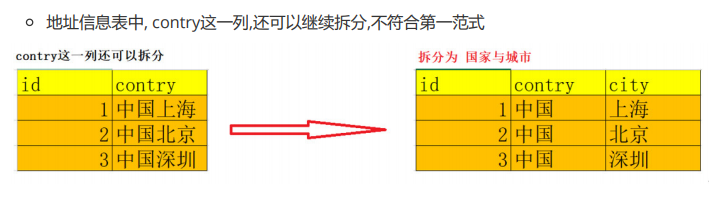

- 第二范式

  - 概念

    -  在第一范式的基础上更进一步，目标是确保表中的每列都和主键相关。 
    -  一张表只能描述一件事.

  - 示例

    -    学员信息表中其实在描述两个事物 , 一个是学员的信息,一个是课程信息  

    -  如果放在一张表中,会导致数据的冗余,如果删除学员信息, 成绩的信息也被删除了 

      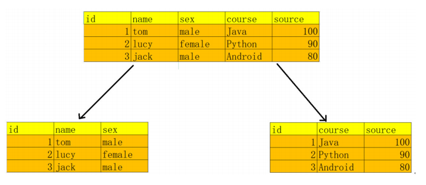

- 第三范式

  - 概念

    -  消除传递依赖 
    -  表的信息，如果能够被推导出来，就不应该单独的设计一个字段来存放 

  - 示例

    -  通过number 与 price字段就可以计算出总金额,不要在表中再做记录(空间最省)  

      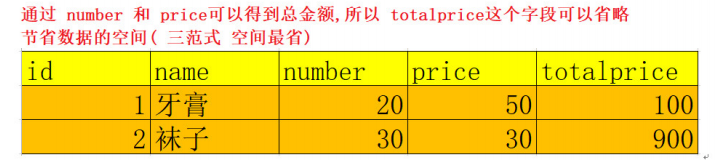

- 数据库反三范式

  - 概念

    -  反范式化指的是通过增加冗余或重复的数据来提高数据库的读性能 
    -  浪费存储空间,节省查询时间 (以空间换时间)  

  - 示例

    -  两张表，用户表、订单表，用户表中有字段name，而订单表中也存在字段name。 

      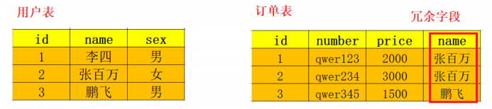

    - 使用场景

      -  当需要查询“订单表”所有数据并且只需要“用户表”的name字段时, 没有冗余字段 就需要去join 连接用户表,假设表中数据量非常的大, 那么会这次连接查询就会非常大的消耗系统的性能 
      -  这时候冗余的字段就可以派上用场了, 有冗余字段我们查一张表就可以了.  

- 总结
  -  创建一个关系型数据库设计，我们有两种选择 
    -  尽量遵循范式理论的规约，尽可能少的冗余字段，让数据库设计看起来精致、优雅、让人心 醉。 
    -  合理的加入冗余字段这个润滑剂，减少join，让数据库执行性能更高更快。 