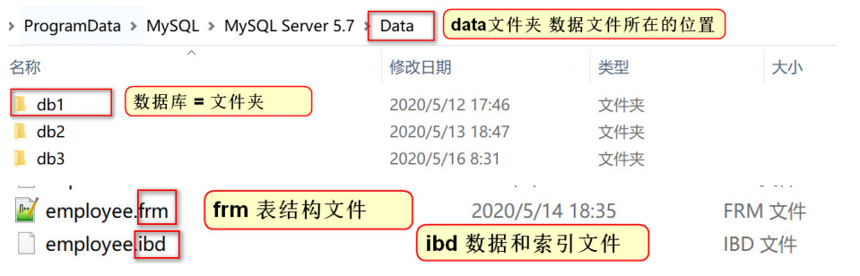

# 大数据学习-Java Day23

##  MySQL索引&视图&存储过程 

### 1 MySQL 索引

- 概念
  -  在数据库表中，对字段建立索引可以大大提高查询速度。通过善用这些索引，可以令MySQL的查询和 运行更加高效。  
  -  如果合理的设计且使用索引的MySQL是一辆兰博基尼的话，那么没有设计和使用索引的MySQL就是 一个人力三轮车。拿汉语字典的目录页（索引）打比方，我们可以按拼音、笔画、偏旁部首等排序的目 录（索引）快速查找到需要的字 

- 常见分类

  | 索引名称               | 说明                                                         |
  | ---------------------- | ------------------------------------------------------------ |
  | 主键索引 (primary key) | 主键是一种唯一性索引,每个表只能有一个主键, 用于标识数据表中的每一 条记录 |
  | 唯一索引 (unique)      | 唯一索引指的是 索引列的所有值都只能出现一次, 必须唯一.       |
  | 普通索引 (index)       | 最常见的索引,作用就是 加快对数据的访问速度                   |

   **MySql将一个表的索引都保存在同一个索引文件中, 如果对其中数据进行增删改操作,MySql都会自动的更新索引** 

  

  -  数据准备

    ```mysql
    # 创建db4数据库
    CREATE DATABASE db4 CHARACTER SET utf8;
    # 创建 demo01表
    CREATE TABLE demo01(
    did INT,
    dname VARCHAR(20),
    hobby VARCHAR(30)
    );
    ```

    

  - 主键索引 (PRIMARY KEY) 

    - 特点

      -  主键是一种唯一性索引,每个表只能有一个主键,用于标识数据表中的某一条记录。 
      -  一个表可以没有主键，但最多只能有一个主键，并且主键值不能包含NULL。  

      ```mysql
      # 语法格式
      --创建表的时候直接添加主键索引 (最常用)
      CREATE TABLE 表名(
      -- 添加主键 (主键是唯一性索引,不能为null,不能重复,)
      字段名 类型 PRIMARY KEY,
      );
      
      -- 修改表结构 添加主键索引
      ALTER TABLE 表名 ADD PRIMARY KEY ( 列名 )
      
      # 为demo1 表添加主键索引
      ALTER TABLE demo01 ADD PRIMARY KEY (did);
      
      ```

  -  唯一索引(UNIQUE) 

    - 特点
      -  索引列的所有值都只能出现一次, 必须唯一
      -   唯一索引可以保证数据记录的唯一性。事实上，在许多场合，人们创建唯一索引的目的往往不是为了 提高访问速度，而只是为了避免数据出现重复。 

    ```mysql
    # 语法格式
    -- 创建表的时候直接添加主键索引
    CREATE TABLE 表名(
    列名 类型(长度),
    -- 添加唯一索引
    UNIQUE [索引名称] (列名)
    );
    -- 使用create语句创建: 在已有的表上创建索引
    create unique index 索引名 on 表名(列名(长度))
    
    # 修改表结构添加索引
    ALTER TABLE 表名 ADD UNIQUE ( 列名 )
    --  为 hobby字段添加唯一索引
    create unique index ind_hobby on demo01(hobby)
    -- 向表中插入数据
    INSERT INTO demo01 VALUES(1,'张三','DBJ');
    # 报错Duplicate entry 'DBJ' for key 'hobby'
    # 唯一索引保证了数据的唯一性,索引的效率也提升了
    INSERT INTO demo01 VALUES(2,'李四','DBJ');
    # 此时插入报错，错误代码1062
    ```

  - 普通索引

    -   普通索引（由关键字KEY或INDEX定义的索引）的唯一任务是加快对数据的访问速度。因此，应该只 为那些最经常出现在查询条件（WHERE column=）或排序条件（ORDERBY column）中的数据列创建 索引。  

    ```mysql
    # 语法格式
    -- 使用create index 语句创建: 在已有的表上创建索引
    create index 索引名 on 表名(列名[长度])
    
    -- 修改表结构添加索引
    ALTER TABLE 表名 ADD INDEX 索引名 (列名)
    
    #  给 dname字段添加索引
    alter table demo01 add index dname_indx(dname);
    ```

  - 删除索引

    - 由于索引会占用一定的磁盘空间，因此，为了避免数据库性能，应该及时删除不再使用的索引

      ```mysql
      # 语法格式
      ALTER TABLE table_name DROP INDEX index_name;
      
      # 删除  demo01 表中名为  dname_indx 的普通索引。
      ALTER TABLE demo01 DROP INDEX dname_indx;
      ```

- 索引性能测试

  - 导入Note目录下的测试索引

  - 测试

    ```mysql
    #未添加索引,进行分组查询
    SELECT * FROM test_index GROUP BY dname; # 执行时间33s
    
    #添加索引
    ALTER TABLE test_index ADD INDEX dname_indx(dname);
    
    # 执行分组查询
    SELECT * FROM test_index GROUP BY dname;0.001s
    ```

- 优缺点总结
  -  添加索引首先应考虑在 where 及 order by 涉及的列上建立索引。  
  - 优点
    -  大大的提高查询速度 
    -  可以显著的减少查询中分组和排序的时间。 
  - 缺点
    -  创建索引和维护索引需要时间，而且数据量越大时间越长 
    - 当对表中的数据进行增加，修改，删除的时候，索引也要同时进行维护，降低了数据的维护 速度  

### 2 MySQL视图

- 概念
  -  视图是一种虚拟表。 
  -  视图建立在已有表的基础上, 视图赖以建立的这些表称为基表。 
  - 向视图提供数据内容的语句为 SELECT 语句, 可以将视图理解为存储起来的 SELECT 语句. 
  - 视图向用户提供基表数据的另一种表现形式 

- 作用
  -  权限控制时可以使用 
    - 比如,某几个列可以运行用户查询,其他列不允许,可以开通视图 查询特定的列, 起到权限控制的 作用 
  - 简化复杂的多表查询 
    - 视图 本身就是一条查询SQL,我们可以将一次复杂的查询 构建成一张视图, 用户只要查询视图 就可以获取想要得到的信息(不需要再编写复杂的SQL) 
    - 视图主要就是为了简化多表的查询 

- 使用

  - 创建视图

    ```mysql
    # 语法格式
    create view 视图名 [column_list] as select语句;
    view: 表示视图
    column_list: 可选参数，表示属性清单，指定视图中各个属性的名称，默认情况下，与SELECT语句中查询
    的属性相同
    as : 表示视图要执行的操作
    select语句: 向视图提供数据内容
    
    # 创建一张视图
    #1. 先编写查询语句
    #查询所有商品 和 商品的对应分类信息
    SELECT * FROM products p LEFT JOIN category c ON p.`category_id` = c.`cid`;
    #2.基于上面的查询语句,创建一张视图
    CREATE VIEW products_category_view
    AS SELECT * FROM products p LEFT JOIN category c ON p.`category_id` = c.`cid`;
    # 3查询视图 ,当做一张只读的表操作就可以
    SELECT * FROM products_category_view;
    ```

  - 通过视图进行查询

    -   需求: 查询各个分类下的商品平均价格 

      ```mysql
      #通过 多表查询
      SELECT
      cname AS '分类名称',
      AVG(p.`price`) AS '平均价格'
      FROM products p LEFT JOIN category c ON p.`category_id` = c.`cid`
      GROUP BY c.`cname`;
      # 通过视图查询 可以省略连表的操作
      SELECT
      cname AS '分类名称',
      AVG(price) AS '平均价格'
      FROM products_category_view GROUP BY cname;
      ```

    - 需求  查询鞋服分类下最贵的商品的全部信息 

      ```mysql
      #通过连表查询
      #1.先求出鞋服分类下的最高商品价格
      SELECT
      MAX(price) AS maxPrice
      FROM
      products p LEFT JOIN category c ON p.`category_id` = c.`cid`
      WHERE c.`cname` = '鞋服'
      #2.将上面的查询 作为条件使用
      SELECT * FROM products p LEFT JOIN category c ON p.`category_id` = c.`cid`
      WHERE c.`cname` = '鞋服' AND p.`price` =
      (SELECT
      MAX(price) AS maxPrice
      FROM
      products p LEFT JOIN category c ON p.`category_id` = c.`cid`
      WHERE c.`cname` = '鞋服');
      
      #通过视图查询
      SELECT * FROM products_category_view pcv
      WHERE pcv.`cname` = '鞋服'
      AND pcv.`price` = (SELECT MAX(price) FROM products_category_view WHERE cname =
      '鞋服')
      
      ```

- 视图与表的区别

  -  视图是建立在表的基础上，表存储数据库中的数据，而视图只是做一个数据的展示 
  -  通过视图不能改变表中数据（一般情况下视图中的数据都是表中的列 经过计算得到的结果,不允许 更新） 
  -  删除视图，表不受影响，而删除表，视图不再起作用 

### 3 MySQL存储过程

- 概念
  -  MySQL 5.0 版本开始支持存储过程。   
  - 存储过程（Stored Procedure）是一种在数据库中存储复杂程序，以便外部程序调用的一种数据 库对象。存储过程是为了完成特定功能的SQL语句集，经编译创建并保存在数据库中，用户可通过 指定存储过程的名字并给定参数(需要时)来调用执行。  
  -  **简单理解: 存储过程其实就是一堆 SQL 语句的合并。中间加入了一些逻辑控制。**  

- 优缺点
  - 优点
    -  存储过程一旦调试完成后，就可以稳定运行，（前提是，业务需求要相对稳定，没有变化） 
    -  存储过程减少业务系统与数据库的交互，降低耦合，数据库交互更加快捷（应用服务器，与数据库服务器不在同一个地区） 
  - 缺点
    -  在互联网行业中，大量使用MySQL，MySQL的存储过程与Oracle的相比较弱，所以较少使 用，并且互联网行业需求变化较快也是原因之一 
    -  尽量在简单的逻辑中使用，存储过程移植十分困难，数据库集群环境，保证各个库之间存储 过程变更一致也十分困难。 
    -  阿里的代码规范里也提出了禁止使用存储过程，存储过程维护起来的确麻烦； 

- 存储过程的创建方式

  - 准备数据

    ```mysql
    # 商品表
    CREATE TABLE goods(
    gid INT,
    NAME VARCHAR(20),
    num INT -- 库存
    );
    #订单表
    CREATE TABLE orders(
    oid INT,
    gid INT,
    price INT -- 订单价格
    );
    # 向商品表中添加3条数据
    INSERT INTO goods VALUES(1,'奶茶',20);
    INSERT INTO goods VALUES(2,'绿茶',100);
    INSERT INTO goods VALUES(3,'花茶',25);
    ```

  - 方式一

    ```mysql
    # 创建简单的存储过程 语法格式
    DELIMITER $$ -- 声明语句结束符，可以自定义 一般使用$$
    CREATE PROCEDURE 过程名称() -- 声明存储过程
    BEGIN -- 开始编写存储过程
    -- 要执行的操作
    END $$ -- 存储过程结束
    
    # 需求: 编写存储过程, 查询所有商品数据
    DELIMITER $$
    CREATE PROCEDURE goods_proc()
    BEGIN
    select * from goods;
    END $$
    
    # 调用存储过程 语法格式
    call 存储过程名
    
    -- 调用存储过程 查询goods表所有数据
    call goods_proc;
    
    ```

  - 方式二

    ```mysql
    # IN 输入参数：表示调用者向存储过程传入值
    CREATE PROCEDURE 存储过程名称(IN 参数名 参数类型)
    
    # 创建存储过程
    # 需求: 接收一个商品id, 根据id删除数据
    DELIMITER $$
    CREATE PROCEDURE goods_proc02(IN goods_id INT)
    BEGIN
    DELETE FROM goods WHERE gid = goods_id ;
    END $$
    
    # 调用存储过程 传递参数
    # 删除 id为2的商品
    CALL goods_proc02(2);
    ```

  - 方式三

    ```mysql
    # 变量赋值
    SET @变量名=值
    #  OUT 输出参数：表示存储过程向调用者传出值
    OUT 变量名 数据类型
    
    # 创建存储过程
    # 需求: 向订单表 插入一条数据, 返回1,表示插入成功
    # 创建存储过程 接收参数插入数据, 并返回受影响的行数
    DELIMITER $$
    CREATE PROCEDURE orders_proc(IN o_oid INT , IN o_gid INT ,IN o_price INT, OUT
    out_num INT)
    BEGIN
    -- 执行插入操作
    INSERT INTO orders VALUES(o_oid,o_gid,o_price);
    -- 设置 num的值为 1
    SET @out_num = 1;
    -- 返回 out_num的值
    SELECT @out_num;
    END $$
    
    # 调用存储过程
    # 调用存储过程插入数据,获取返回值
    CALL orders_proc(1,2,30,@out_num);
    ```

### 4 MySQL触发器

- 概念
  -  触发器（trigger）是MySQL提供给程序员和数据分析员来保证数据完整性的一种方法，它是与表事 件相关的特殊的存储过程，它的执行不是由程序调用，也不是手工启动，而是由事件来触发，比如当对 一个表进行操作（insert，delete， update）时就会激活它执行。 
  -  简单理解: 当我们执行一条sql语句的时候，这条sql语句的执行会自动去触发执行其他的sql语句。  

-  触发器创建的四个要素 
  -   监视地点（table） 
  - 监视事件（insert/update/delete） 
  - 触发时间（before/after） 
  - 触发事件（insert/update/delete） 

-  创建触发器 

  ```mysql
  # 语法格式
  delimiter $ -- 将Mysql的结束符号从 ; 改为 $,避免执行出现错误
  CREATE TRIGGER Trigger_Name -- 触发器名，在一个数据库中触发器名是唯一的
  before/after（insert/update/delete） -- 触发的时机 和 监视的事件
  on table_Name -- 触发器所在的表
  for each row -- 固定写法 叫做行触发器, 每一行受影响，触发事件都执行
  begin
  -- begin和end之间写触发事件
  end
  $ -- 结束标记
  
  # 向商品中添加一条数据
  INSERT INTO goods VALUES(1,'book',40);
  
  # 需求: 在下订单的时候，对应的商品的库存量要相应的减少，卖出商品之后减少库存量。
  编写触发器
  -- 1.修改结束标识
  DELIMITER $
  -- 2.创建触发器
  CREATE TRIGGER t1
  -- 3.指定触发的时机,和要监听的表
  AFTER INSERT ON orders
  -- 4.行触发器 固定写法
  FOR EACH ROW
  -- 4.触发后具体要执行的事件
  BEGIN
  -- 订单+1 库存-1
  UPDATE goods SET num = num -1 WHERE gid = 1;
  END$
  
  # 查询 goods表中的数据 库存为40 
  
  # 向订单表中添加一条数据
  INSERT INTO orders VALUES(1,1,25); # goods表中数据随之-1
  ```

### 5  DCL(数据控制语言) 

- 概念
  -  MySql默认使用的都是 root 用户，超级管理员，拥有全部的权限。除了root用户以外，我们还可以通 过DCL语言来定义一些权限较小的用户, 分配不同的权限来管理和维护数据库。 

- 创建用户

  ```mysql
  # 语法格式
  CREATE USER '用户名'@'主机名' IDENTIFIED BY '密码';
  # 用户名 	创建的新用户,登录名称
  # 主机名 	指定该用户在哪个主机上可以登陆，本地用户可用 localhost如果想让该用户可以 从任意远程主机登陆，可以使用通配符 %
  # 密码 	登录密码
  
  # 创建 admin1 用户，只能在 localhost 这个服务器登录 mysql 服务器，密码为 123456 创建成功后创建的用户在名字为 mysql的 数据库中的 user表中
  CREATE USER 'admin1'@'localhost' IDENTIFIED BY '123456';
  
  # 创建 admin2 用户可以在任何电脑上登录 mysql 服务器，密码为 123456 % 表示 用户可以在任意电脑登录 mysql服务器.
  CREATE USER 'admin2'@'%' IDENTIFIED BY '123456';
  ```

- 用户授权

  - 创建好的用户需要授权

  ```mysql
  # 语法格式
  GRANT 权限 1, 权限 2... ON 数据库名.表名 TO '用户名'@'主机名';
  # 权限 	授予用户的权限，如 CREATE、ALTER、SELECT、INSERT、UPDATE 等。如果要授 予所有的权限则使用 ALL
  # ON 	 用来指定权限针对哪些库和表。
  # TO 	 表示将权限赋予某个用户。
  
  # 给 admin1 用户分配对 db4 数据库中 products 表的 操作权限：查询
  GRANT SELECT ON db4.products TO 'admin1'@'localhost';
  
  #  给 admin2 用户分配所有权限，对所有数据库的所有表
  GRANT ALL ON *.* TO 'admin2'@'%';
  
  ```

- 查看权限

  ```mysql
  # 语法格式
  SHOW GRANTS FOR '用户名'@'主机名';
  
  # 查看root用户的权限
  SHOW GRANTS FOR 'root'@'localhost';
  
  # GRANT ALL PRIVILEGES 是表示所有权限
  ```

- 删除用户

  ```mysql
  # 语法格式
  DROP USER '用户名'@'主机名';
  
  # 删除 admin1 用户
  DROP USER 'admin1'@'localhost';
  
  ```

-  查询用户 

  ```mysql
  # 选择名为 mysql的数据库, 直接查询 user表即可
  SELECT * FROM USER;
  ```

### 6 数据库备份还原

 备份的应用场景 在服务器进行数据传输、数据存储和数据交换，就有可能产生数据故障。比如发生 意外停机或存储介质损坏。 这时，如果没有采取数据备份和数据恢复手段与措施，就会导致数据的丢 失，造成的损失是无法弥补与估量的。 

- 命令行备份

  ```mysql
  # 语法格式
  mysqldump -u 用户名 -p 密码 数据库 > 文件路径
  
  # 执行备份, 备份db2中的数据 到 H盘的 db2.sql 文件中
  mysqldump -uroot -p123456 db2 > H:/db2.sql
  ```

- 命令行恢复

  ```mysql
  source sql文件地址
  ```

  **注：还原的时候需要先创建一个数据库**

