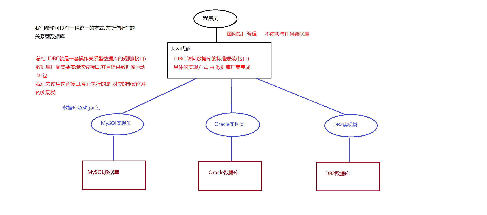
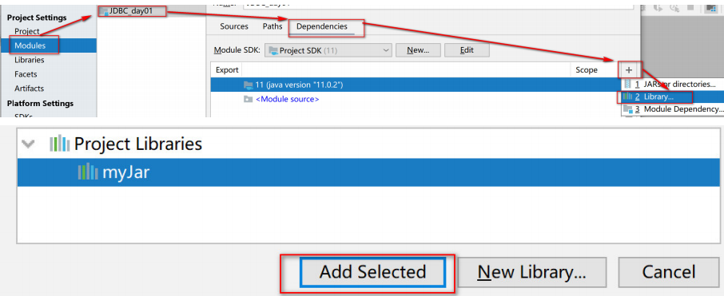
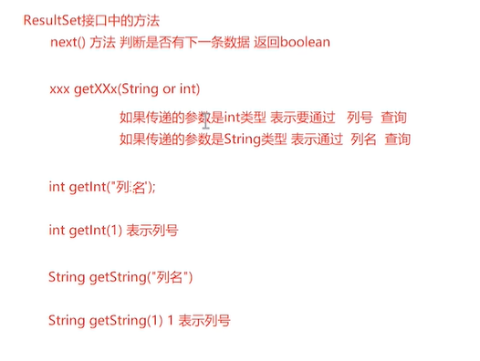
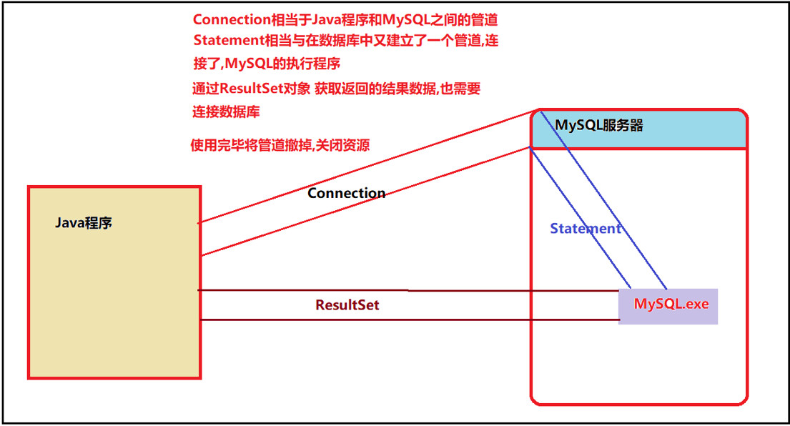
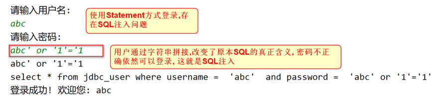
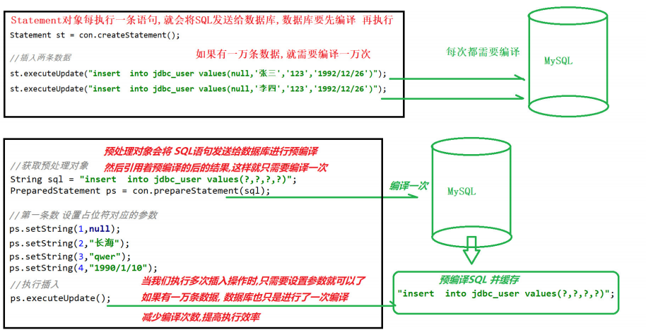

# 大数据学习-Java Day24

## JDBC

### 1 JDBC概述

- 概念
  
  -   JDBC(Java Data Base Connectivity) 是 Java 访问数据库的标准规范.是一种用于执行SQL语句的Java API，可以为 多种关系数据库提供统一访问，它由一组用Java语言编写的类和接口组成。是Java访问数据库的标准规范.  
- 原理
  
  -  JDBC是接口，驱动是接口的实现，没有驱动将无法完成数据库连接，从而不能操作数据库！每个数据库厂商都需 要提供自己的驱动，用来连接自己公司的数据库，也就是说驱动一般都由数据库生成厂商提供。 
  
  
  
  -  JDBC就是由sun公司定义的一套操作所有关系型数据库的规则(接口)，而数据库厂商需要实现这套接口,提供数据库 驱动jar包, 我们可以使用这套接口编程,真正执行的代码是对应驱动包中的实现类。 

### 2 JDBC开发

- 数据准备

  ```mysql
  -- 创建 jdbc_user表
  CREATE TABLE jdbc_user (
  id INT PRIMARY KEY AUTO_INCREMENT ,
  username VARCHAR(50),
  PASSWORD VARCHAR(50),
  birthday DATE
  );
  -- 添加数据
  INSERT INTO jdbc_user (username, PASSWORD,birthday)
  VALUES('admin1', '123','1991/12/24'),
  ('admin2','123','1995/12/24'),
  ('test1', '123','1998/12/24'),
  ('test2', '123','2000/12/24');
  ```

- MySQL驱动包

  - 将MySQL驱动包添加到jar包库文件夹中，Myjar文件夹,用于存放当前项目需要的所有jar包 

  - 在idea中配置jar包库的位置

    

  -  创建一个新的项目jdbc_task01, 配置jar包库 

    

- API使用1：注册驱动

  -  JDBC规范定义驱动接口： java.sql.Driver 

  -  MySql驱动包提供了实现类： com.mysql.jdbc.Driver 

    | 加载注册驱动的方式              | 描述                                                         |
    | ------------------------------- | ------------------------------------------------------------ |
    | Class.forName(数据库驱动实现类) | 加载和注册数据库驱动,数据库驱动由数据库厂商MySql提供 "com.mysql.jdbc.Driver" |

  - 示例

    ```java
        public static void main(String[] args) throws ClassNotFoundException {
            //1.注册驱动
            // forName 方法执行将类进行初始化
            Class.forName("com.mysql.jdbc.Driver");
        }
    
    ```

  - 为什么可以这样注册驱动

    Class类的forName方法可以将一个类初始化，所以由Driver类的源码可知

    ```java
    // Driver类是MySql提供的数据库驱动类, 实现了JDBC的Driver接口 java.sql.Driver
    public class Driver extends NonRegisteringDriver implements java.sql.Driver {
        // 空参构造
        public Driver() throws SQLException {
        }
        //静态代码块,Class类的 forName()方法将Driver类 加载到内存, static代码块会自动执行
        static {
            try {
                /*
                DriverManager 驱动管理类
                registerDriver(new Driver) 注册驱动的方法
                注册数据库驱动
                 */          
                DriverManager.registerDriver(new Driver());
            } catch (SQLException var1) {
                throw new RuntimeException("Can't register driver!");
            }
        }
    }
    ```

    注：从 JDBC3 开始，目前已经普遍使用的版本。可以不用注册驱动而直接使用。 Class.forName 这句话可以省略

API使用2：获得连接

-  Connection 接口，代表一个连接对象 ,具体的实现类由数据库的厂商实现 

-  使用 DriverManager类的静态方法,getConnection可以获取数据库的连接  

  | 获取连接的静态方法                                           | 说明                                             |
  | ------------------------------------------------------------ | ------------------------------------------------ |
  | Connection getConnection(String url, String user, String password) | 通过连接字符串和用户名,密码来获取数据 库连接对象 |

-  getConnection方法 3个 连接参数说明 

  | 连接参数 | 说明                                            |
  | -------- | ----------------------------------------------- |
  | user     | 登录用户名                                      |
  | password | 登录密码                                        |
  | url      | mySql URL的格式 jdbc:mysql://localhost:3306/db4 |

  URL详细说明

  ```java
  jdbc:mysql://localhost:3306/db4?characterEncoding=UTF-8
  ```

  -  JDBC规定url的格式由三部分组成，每个部分中间使用冒号分隔。 

    -  第一部分是协议 jdbc，这是固定的； 
    - 第二部分是子协议，就是数据库名称，连接mysql数据库，第二部分当然是mysql了； 
    - 第三部分是由数据库厂商规定的，我们需要了解每个数据库厂商的要求，mysql的第三部分分别由数据 库服务器的IP地址（localhost）、端口号（3306），以及要使用的 数据库名称 组成。 

    ```java
    
    public static void main(String[] args) throws Exception {
    
        //1.注册驱动
        Class.forName("com.mysql.jdbc.Driver");
    
        //2.获取连接 url,用户名, 密码
        String url = "jdbc:mysql://localhost:3306/db4";
        Connection con = DriverManager.getConnection(url, "root", "123456");
    
        //com.mysql.jdbc.JDBC4Connection@2e3fc542
        System.out.println(con);
    }
    
    ```

API使用3：获取语句执行平台

-  通过Connection 的 createStatement方法 获取sql语句执行对象 

  | Connection接口中的方法      | 说明                 |
  | --------------------------- | -------------------- |
  | Statement createStatement() | 创建 SQL语句执行对象 |

-  Statement ： 代表一条语句对象，用于发送 SQL 语句给服务器，用于执行静态 SQL 语句并返回它所生成结 果的对象。 

  | Statement类 常用方法                | 说明                                                       |
  | ----------------------------------- | ---------------------------------------------------------- |
  | int executeUpdate(String sql);      | 执行insert update delete语句.返回int类型,代表受影响的行 数 |
  | ResultSet executeQuery(String sql); | 执行select语句, 返回ResultSet结果集对象                    |

  ```java
      
  public static void main(String[] args) throws Exception {
      //1.注册驱动
      Class.forName("com.mysql.jdbc.Driver");
  
      //2.获取连接 url,用户名, 密码
      String url = "jdbc:mysql://localhost:3306/db4";
      Connection con = DriverManager.getConnection(url, "root", "123456");
  
      //3.获取 Statement对象
      Statement statement = con.createStatement();
  
      //4.执行创建表操作
      String sql = "create table test01(id int, name varchar(20),age int);";
  
      //5.增删改操作 使用executeUpdate,增加一张表
      int i = statement.executeUpdate(sql);
  
      //6.返回值是受影响的函数
      System.out.println(i);
  
      //7.关闭流
      statement.close();
      con.close();
  }
  
  ```

API使用4：处理结果集

-  只有在进行查询操作的时候, 才会处理结果集  

  ```java
  
  public static void main(String[] args) throws SQLException {
  
      //1.注册驱动 可以省略
      //2.获取连接
      String url = "jdbc:mysql://localhost:3306/db4";
      Connection con = DriverManager.getConnection(url, "root", "123456");
  
      //3.获取 Statement对象
      Statement statement = con.createStatement();
      String sql = "select * from jdbc_user";
  
      //执行查询操作,返回的是一个 ResultSet 结果对象
      ResultSet resultSet = statement.executeQuery(sql);
      //4.处理结果集 resultSet
  }
  ```

-  ResultSet接口 

  -  作用：封装数据库查询的结果集，对结果集进行遍历，取出每一条记录。 

    | ResultSet接口方法          | 说明                                                         |
    | -------------------------- | ------------------------------------------------------------ |
    | boolean next()             | 1) 游标向下一行 <br />2) 返回 boolean 类型，如果还有下一条记录，返回 true，否则返回 false |
    | xxx getXxx( String or int) | 1) 通过列名，参数是 String 类型。返回不同的类型<br /> 2) 通过列号，参数是整数，从 1 开始。返回不同的类型 |

    

    ```java
    public static void main(String[] args) throws SQLException {
        //1.注册驱动 可以省略
        //2.获取连接
        String url = "jdbc:mysql://localhost:3306/db4";
        Connection con = DriverManager.getConnection(url, "root", "123456");
        //3.获取 Statement对象
        Statement statement = con.createStatement();
        String sql = "select * from jdbc_user";
        //执行查询操作,返回的是一个 ResultSet 结果对象
        ResultSet resultSet = statement.executeQuery(sql);
        //4.处理结果集
        // //next 方法判断是否还有下一条数据
        // boolean next = resultSet.next();
        // System.out.println(next);
        //
        // //getXXX 方法获取数据 两种方式
        // int id = resultSet.getInt("id");//列名
        // System.out.println(id);
        //
        // int anInt = resultSet.getInt(1);//列号
        // System.out.println(anInt);
        //使用while循环
        while (resultSet.next()) {
            //获取id
            int id = resultSet.getInt("id");
            //获取姓名
            String username = resultSet.getString("username");
            //获取生日
            Date birthday = resultSet.getDate("birthday");
            System.out.println(id + " = " + username + " : " + birthday);
        }
        //关闭连接
        resultSet.close();
        statement.close();
        con.close();
    }
    ```

API使用5：释放资源

-  需要释放的对象：ResultSet 结果集，Statement 语句，Connection 连接 

-  释放原则：先开的后关，后开的先关。ResultSet ==> Statement ==> Connection 

-  放在哪个代码块中：finally 块 

  -  与IO流一样，使用后的东西都需要关闭！关闭的顺序是先开后关, 先得到的后关闭，后得到的先关闭  

  

  

  ​	

  ```java
  public static void main(String[] args) {
      Connection connection = null;
      Statement statement = null;
      ResultSet resultSet = null;
      try {
          //1.注册驱动（省略）
          //2.获取连接
          String url = "jdbc:mysql://localhost:3306/db4";
          connection = DriverManager.getConnection(url, "root", "123456");
          //3.获取 Statement对象
          statement = connection.createStatement();
          String sql = "select * from jdbc_user";
          resultSet = statement.executeQuery(sql);
      } catch (SQLException e) {
          e.printStackTrace();
      } finally {
          /**
               * 开启顺序: connection ==> statement => resultSet
               * 关闭顺序: resultSet ==> statement ==> connection
               */
          try {
              connection.close();
              resultSet.close();
              statement.close();
          } catch (SQLException e) {
              e.printStackTrace();
          }
      }
  }
  
  ```

  

-  步骤总结 
  1.  获取驱动(可以省略) 
  2. 获取连接 
  3. 获取Statement对象 
  4. 处理结果集(只在查询时处理)
  5. 释放资源  

### 3  JDBC实现增删改查 

- JDBC工具类

  - 使用时机
    - 如果一个功能经常要用到，我们建议把这个功能做成一个工具类，可以在不同的地方重用。 
    -  “获得数据库连接”操作，将在以后的增删改查所有功能中都存在，可以封装工具类JDBCUtils。提供获取 连接对象的方法，从而达到代码的重复利用。 
  - 工具类包含的内容
    -  可以把几个字符串定义成常量：用户名，密码，URL，驱动类 
    -  得到数据库的连接：getConnection()  
    -  关闭所有打开的资源： 

  ```java
  //1. 定义字符串常量, 记录获取连接所需要的信息
  public static final String DRIVERNAME = "com.mysql.jdbc.Driver";
  public static final String URL = "jdbc:mysql://localhost:3306/db4?characterEncoding=UTF-8";
  public static final String USER = "root";
  public static final String PASSWORD = "123456";
  
  //2. 静态代码块, 随着类的加载而加载
  static {
      try {
          //注册驱动
          Class.forName(DRIVERNAME);
      } catch (ClassNotFoundException e) {
          e.printStackTrace();
      }
  }
  
  //3.获取连接的静态方法
  public static Connection getConnection() {
      try {
          //获取连接对象
          Connection connection = DriverManager.getConnection(URL, USER, PASSWORD);
          //返回连接对象
          return connection;
      } catch (SQLException e) {
          e.printStackTrace();
          return null;
      }
  }
  
  //关闭资源的方法
  public static void close(Connection con, Statement st) {
      if (con != null && st != null) {
          try {
              st.close();
              con.close();
          } catch (SQLException e) {
              e.printStackTrace();
          }
      }
  }
  
  public static void close(Connection con, Statement st, ResultSet rs) {
      if (rs != null) {
          try {
              rs.close();
          } catch (SQLException e) {
              e.printStackTrace();
          }
      }
      close(con, st);
  }
  ```

  

- DML操作

  - 插入记录

    - 解决中文插入乱码的问题

      ```java
      jdbc:mysql://localhost:3306/db4?characterEncoding=UTF-8 characterEncoding=UTF-8 指定字符的编码、解码格式。  
      ```

    ```java
        /**
         * 插入数据
         * @throws SQLException
         */
        @Test   // @Test的使用 是该方法可以不用main方法调用就可以测试出运行结果，是一种测试方法，一般函数都需要有main方法调用才能执行，注意被测试的方法必须是public修饰的
        public void testInsert() throws SQLException {
            //1.通过工具类获取连接
            Connection connection = JDBCUtils.getConnection();
            //2.获取Statement
            Statement statement = connection.createStatement();
            //2.1 编写Sql
            String sql = "insert into jdbc_user values(null,'张百万','123','2020/1/1')";
            //2.2 执行Sql
            int i = statement.executeUpdate(sql);
            System.out.println(i);
            //3.关闭流
            JDBCUtils.close(connection,statement);
        }
    ```

  - 更新记录

    -  根据ID 需改用户名称 

      ```java
          /**
           * 修改 id 为1 的用户名为 广坤
           */
          @Test
          public void testUpdate() throws SQLException {
              Connection connection = JDBCUtils.getConnection();
              Statement statement = connection.createStatement();
              String sql = "update jdbc_user set username = '广坤' where id = 1";
              statement.executeUpdate(sql);
              JDBCUtils.close(connection,statement);
          }
      ```

  - 删除记录

    ```java
       	/**
         * 删除id 为 3 和 4的记录
         * @throws SQLException
         */
        @Test
        public void testDelete() throws SQLException {
            Connection connection = JDBCUtils.getConnection();
            Statement statement = connection.createStatement();
            statement.executeUpdate("delete from jdbc_user where id in(3,4)");
            JDBCUtils.close(connection,statement);
        }
    ```

-  DQL操作 

  -  查询姓名为张百万的一条记录 

    ```JAVA
        public static void main(String[] args) throws SQLException {
            //1.获取连接对象
            Connection connection = JDBCUtils.getConnection();
            //2.获取Statement对象
            Statement statement = connection.createStatement();
            String sql = "SELECT * FROM jdbc_user WHERE username = '张百万';";
            ResultSet resultSet = statement.executeQuery(sql);
            //3.处理结果集
            while (resultSet.next()) {
                //通过列名 获取字段信息
                int id = resultSet.getInt("id");
                String username = resultSet.getString("username");
                String password = resultSet.getString("password");
                String birthday = resultSet.getString("birthday");
                System.out.println(id + " " + username + " " + password + " " + birthday);
            }
    //4.释放资源
            JDBCUtils.close(connection, statement, resultSet);
        }
    ```

### 4 SQL注入问题

- sql注入延时

  -  向jdbc_user表中 插入两条数据 

    ```mysql
    # 插入2条数据
    INSERT INTO jdbc_user VALUES(NULL,'jack','123456','2020/2/24');
    INSERT INTO jdbc_user VALUES(NULL,'tom','123456','2020/2/24');
    ```

  ```mysql
  # SQL注入演示
  -- 填写一个错误的密码
  SELECT * FROM jdbc_user WHERE username = 'tom' AND PASSWORD = '123' OR '1' = '1';
  # 如果这是一个登录操作，那么用户就成功登录了，但显然这不是我们想要的结果
  ```

-   sql注入案例：用户登陆 

  -  需求 

    - 用户在控制台上输入用户名和密码, 然后使用 Statement 字符串拼接的方式 实现用户的登录。 

  - 步骤 

    - 得到用户从控制台上输入的用户名和密码来查询数据库
    -  写一个登录的方法 
      - 通过工具类得到连接 
      -  创建语句对象，使用拼接字符串的方式生成 SQL 语句 
      - 查询数据库，如果有记录则表示登录成功，否则登录失败 
      - 释放资源 

    ```java
        /**
         * 用户登录案例
         * 使用 Statement字符串拼接的方式完成查询
         * @param args
         */
        public static void main(String[] args) throws SQLException {
            //1.获取连接
            Connection connection = JDBCUtils.getConnection();
            //2.获取Statement
            Statement statement = connection.createStatement();
            //3.获取用户输入的用户名和密码
            Scanner sc = new Scanner(System.in);
            System.out.println("请输入用户名: ");
            String name = sc.nextLine();
            System.out.println("请输入密码: ");
            String pass = sc.nextLine();
            System.out.println(pass);
            //4.拼接Sql,执行查询
            String sql = "select * from jdbc_user " +  "where username = " + " '" + name +"' " +" and password = " +" '" + pass +"';";
            System.out.println(sql);
            ResultSet resultSet = statement.executeQuery(sql);
            //5.处理结果集,判断结果集是否为空
            if(resultSet.next()){
                System.out.println("登录成功! 欢迎您: " + name);
            }else {
                System.out.println("登录失败!");
            }
            //释放资源
            JDBCUtils.close(connection,statement,resultSet);
        }
    ```

-  问题分析 

  - sql注入概念

    -  让用户输入的密码和 SQL 语句进行字符串拼接。用户输入的内容作为了 SQL 语句语法的一部分，改变了 原有 SQL 真正的意义，以上问题称为 SQL 注入 . 

  - 实现方法

    -  根据用户输入的数据,拼接处的字符串  

      ```mysql
      select * from jdbc_user where username = 'abc' and password = 'abc' or '1'='1'
      # name='abc' and password='abc' 为假 '1'='1' 真
      # 相当于 select * from user where true=true; 查询了所有记录
      ```

      

  - 解决方法

    -  要解决 SQL 注入就不能让用户输入的密码和我们的 SQL 语句进 行简单的字符串拼接。  

### 5 预处理对象

-   PreparedStatement 接口介绍 

  -  PreparedStatement 是 Statement 接口的子接口，继承于父接口中所有的方法。它是一个预编译的 SQL 语 句对象. 
  -  预编译: 是指SQL 语句被预编译,并存储在 PreparedStatement 对象中。然后可以使用此对象多次高效地执行 该语句。 

- 特点

  -  因为有预先编译的功能，提高 SQL 的执行效率。 
  -  可以有效的防止 SQL 注入的问题，安全性更高  

- 获取 PreparedStatement对象 

  -  通过Connection创建PreparedStatement对象 

    | Connection 接口中的方法                        | 说明                                                         |
    | ---------------------------------------------- | ------------------------------------------------------------ |
    | PreparedStatement prepareStatement(String sql) | 指定预编译的 SQL 语句， SQL 语句中使用占位符 ? 创建一个语句对象 |

-  PreparedStatement接口常用方法 

  | 常用方法                  | 说明                                   |
  | ------------------------- | -------------------------------------- |
  | int executeUpdate();      | 执行insert update delete语句.          |
  | ResultSet executeQuery(); | 执行select语句. 返回结果集对象 Resulet |

-   使用PreparedStatement的步骤 

  1.  编写 SQL 语句，未知内容使用?占位： 

     ```sql
     "SELECT * FROM jdbc_user WHERE username=? AND password=?";
     ```

  2.   获得 PreparedStatement 对象 

  3.  设置实际参数：setXxx( 占位符的位置, 真实的值)

  4.  执行参数化 SQL 语句 

  5. 关闭资源 

     | setXxx重载方法                               | 说明                                  |
     | -------------------------------------------- | ------------------------------------- |
     | void setDouble(int parameterIndex, double x) | 将指定参数设置为给定 Java double 值。 |
     | void setInt(int parameterIndex, int x)       | 将指定参数设置为给定 Java int 值。    |
     | void setString(int parameterIndex, String x) | 将指定参数设置为给定 Java String 值。 |
     | void setObject(int parameterIndex, Object x) | 使用给定对象设置指定参数的值。        |

-  使用PreparedStatement完成登录案例 

  -  使用 PreparedStatement 预处理对象,可以有效的避免SQL注入  
  - 步骤
    1.  获取数据库连接对象 
    2. 编写SQL 使用? 占位符方式 3
    3. 获取预处理对象 (预编译对象会将Sql发送给数据库 进 行预编译) 
    4. 提示用户输入用户名 & 密码 
    5. 设置实际参数：setXxx(占位符的位置, 真实的值)
    6. 执行查询获取结 果集 
    7. 判断是否查询到数据 
    8. 关闭资源  

  ```java
      /**
       * 使用预编译对象 PrepareStatement 完成登录案例
       * @param args
       * @throws SQLException
       */
      public static void main(String[] args) throws SQLException {
          //1.获取连接
          Connection connection = JDBCUtils.getConnection();
          //2.获取Statement
          Statement statement = connection.createStatement();
          //3.获取用户输入的用户名和密码
          Scanner sc = new Scanner(System.in);
          System.out.println("请输入用户名: ");
          String name = sc.nextLine();
          System.out.println("请输入密码: ");
          String pass = sc.nextLine();
          System.out.println(pass);
          //4.获取 PrepareStatement 预编译对象
          //4.1 编写SQL 使用 ? 占位符方式
          String sql = "select * from jdbc_user where username = ? and password = ?";
          PreparedStatement ps = connection.prepareStatement(sql);
          //4.2 设置占位符参数
          ps.setString(1,name);  //设置第n个问号和要传入的值
          ps.setString(2,pass);
          //5. 执行查询 处理结果集
          ResultSet resultSet = ps.executeQuery();
          if(resultSet.next()){
              System.out.println("登录成功! 欢迎您: " + name);
          }else{
              System.out.println("登录失败!");
          }
          //6.释放资源
          JDBCUtils.close(connection,statement,resultSet);
      }
  
  ```

- 执行原理

  -  分别使用 Statement对象 和 PreparedStatement对象进行插入操作  

    ```java
        public static void main(String[] args) throws SQLException {
                Connection con = JDBCUtils.getConnection();
                //获取 Sql语句执行对象
                Statement st = con.createStatement();
                //插入两条数据
                st.executeUpdate("insert into jdbc_user values(null,'张三','123','1992/12/26')");
                st.executeUpdate("insert into jdbc_user values(null,'李四','123','1992/12/26')");
                //获取预处理对象
                PreparedStatement ps = con.prepareStatement("insert into jdbc_user values(?,?,?,?)");
                //第一条数 设置占位符对应的参数
                ps.setString(1, null);
                ps.setString(2, "长海");
                ps.setString(3, "qwer");
                ps.setString(4, "1990/1/10");
                //执行插入
                ps.executeUpdate();
                //第二条数据
                ps.setString(1, null);
                ps.setString(2, "小斌");
                ps.setString(3, "1122");
                ps.setString(4, "1990/1/10");
                //执行插入
                ps.executeUpdate();
                //释放资源
                st.close();
                ps.close();
                con.close();
        }
    ```

    

-  Statement 与 PreparedStatement的区别? 
  1.  Statement用于执行静态SQL语句，在执行时，必须指定一个事先准备好的SQL语句。 
  2.  PrepareStatement是预编译的SQL语句对象，语句中可以包含动态参数“?”，在执行时可以为“?”动态设置参数 值。 
  3. PrepareStatement可以减少编译次数提高数据库性能。 

### 6 JDBC控制事务

 之前我们是使用 MySQL 的命令来操作事务。接下来我们使用 JDBC 来操作银行转账的事务。 

- 数据准备

  - ```mysql
    -- 创建账户表
    CREATE TABLE account(
    -- 主键
    id INT PRIMARY KEY AUTO_INCREMENT,
    -- 姓名
    NAME VARCHAR(10),
    -- 转账金额
    money DOUBLE
    );
    -- 添加两个用户
    INSERT INTO account (NAME, money) VALUES ('tom', 1000), ('jack', 1000);
    ```

- 事务相关API

  | 方法                                   | 说明                                                         |
  | -------------------------------------- | ------------------------------------------------------------ |
  | void setAutoCommit(boolean autoCommit) | 参数是 true 或 false 如果设置为 false，表示关闭自动提交，相 当于开启事务 |
  | void commit()                          | 提交事务                                                     |
  | void rollback()                        | 回滚事务                                                     |

- 开发步骤

  1.  获取连接 
  2. 开启事务 
  3. 获取到 PreparedStatement , 执行两次更新操作 
  4. 正常情况下提交事务 
  5. 出现异常回滚事务 
  6. 最后关闭资源 

```java
 //JDBC 操作事务
    public static void main(String[] args) {
        Connection con = null;
        PreparedStatement ps = null;
        try {
            //1. 获取连接
            con = JDBCUtils.getConnection();
            //2. 开启事务
            con.setAutoCommit(false);
            //3. 获取到 PreparedStatement 执行两次更新操作
            //3.1 tom 账户 -500
            ps = con.prepareStatement("update account set money = money - ? where name = ? ");
            ps.setDouble(1,500.0);
            ps.setString(2,"tom");
            ps.executeUpdate();
            //模拟tom转账后 出现异常
            System.out.println(1 / 0);
            //3.2 jack 账户 +500
            ps = con.prepareStatement("update account set money = money + ? where name = ? ");
            ps.setDouble(1,500.0);
            ps.setString(2,"jack");
            ps.executeUpdate();
            //4. 正常情况下提交事务
            con.commit();
            System.out.println("转账成功!");
        } catch (SQLException e) {
            e.printStackTrace();
            try {
                //5. 出现异常回滚事务
                con.rollback();
            } catch (SQLException ex) {
                ex.printStackTrace();
            }
        } finally {
            //6. 最后关闭资源
            JDBCUtils.close(con,ps);
        }
    }
```

