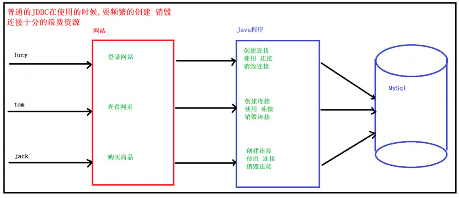
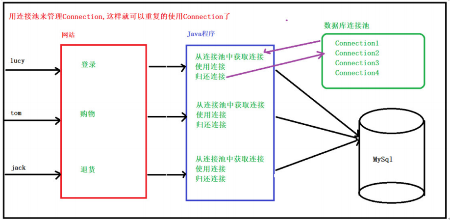
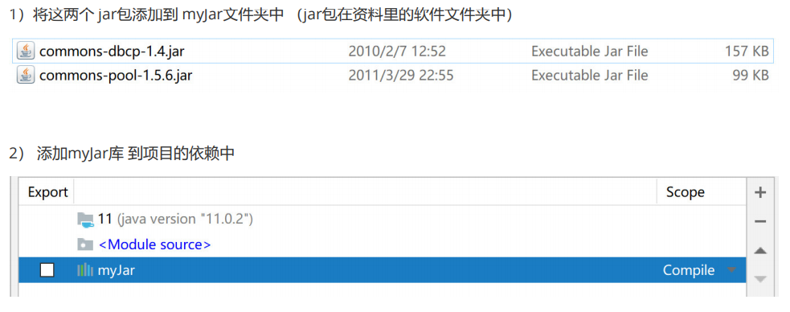
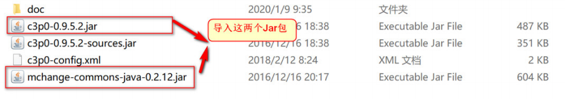
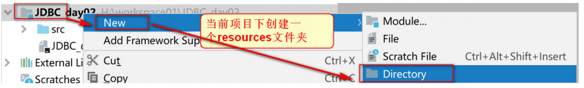
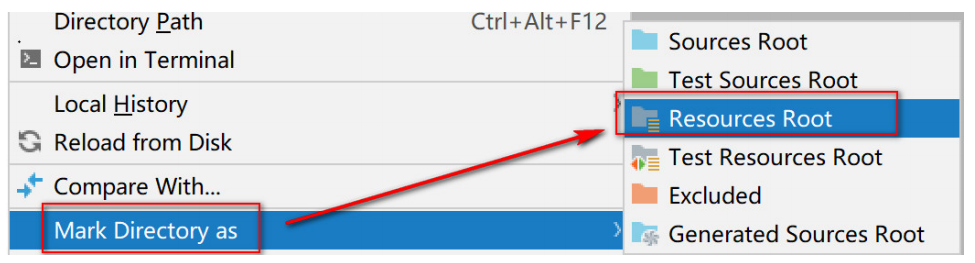
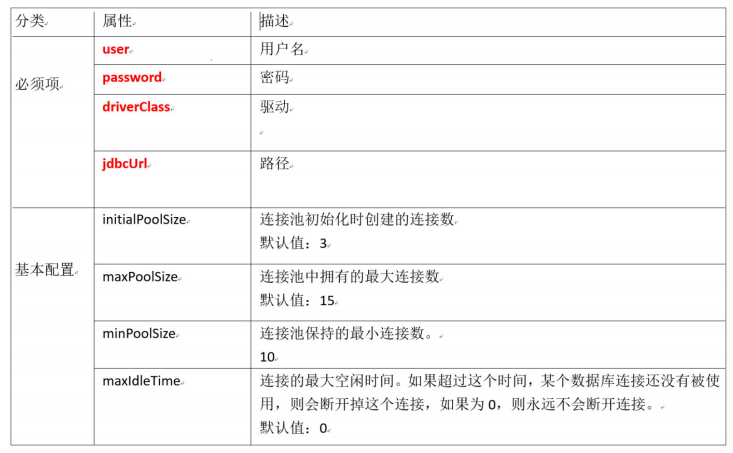
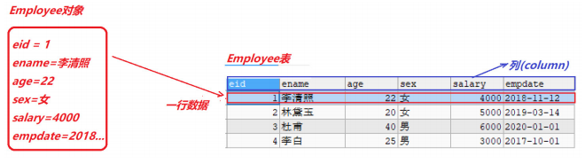

# 大数据学习-Java Day25

## 数据库连接池 &DBUtils 

### 1 数据库连接池

- 连接池概念

  -  实际开发中“获得连接”或“释放资源”是非常消耗系统资源的两个过程，为了解决此类性能问题，通常情况我们 采用连接池技术，来共享连接Connection。这样我们就不需要每次都创建连接、释放连接了，这些操作都交 给了连接池 
  - 优点
    -  用池来管理Connection，这样可以重复使用Connection。 当使用完Connection后，调用Connection的 close()方法也不会真的关闭Connection，而是把Connection“归还”给池。 

- JDBC方式与连接池方式

  - 普通JDBC方式

    

  - 连接池方式

    

- 使用方式
  -  Java为数据库连接池提供了公共的接口：javax.sql.DataSource，各个厂商需要让自己的连接池实现这个接口。 这样应用程序可以方便的切换不同厂商的连接池！  
  -  常见的连接池有 DBCP连接池, C3P0连接池, Druid连接池, 

- 数据准备

  ```mysql
  #创建数据库
  CREATE DATABASE db5 CHARACTER SET utf8;
  #使用数据库
  USE db5;
  #创建员工表
  CREATE TABLE employee (
  eid INT PRIMARY KEY AUTO_INCREMENT ,
  ename VARCHAR (20), -- 员工姓名
  age INT , -- 员工年龄
  sex VARCHAR (6), -- 员工性别
  salary DOUBLE , -- 薪水
  empdate DATE -- 入职日期
  );
  #插入数据
  INSERT INTO employee (eid, ename, age, sex, salary, empdate) VALUES(NULL,'李清照',22,'女',4000,'2018-11-12');
  INSERT INTO employee (eid, ename, age, sex, salary, empdate) VALUES(NULL,'林黛玉',20,'女',5000,'2019-03-14');
  INSERT INTO employee (eid, ename, age, sex, salary, empdate) VALUES(NULL,'杜甫',40,'男',6000,'2020-01-01');
  INSERT INTO employee (eid, ename, age, sex, salary, empdate) VALUES(NULL,'李白',25,'男',3000,'2017-10-01');
  
  ```

#### DBCP连接池 

-  DBCP也是一个开源的连接池，是Apache成员之一，在企业开发中也比较常见，tomcat内置的连接池。 

  

- 编写工具类

  -  连接数据库表的工具类, 采用DBCP连接池的方式来完成

    -  Java中提供了一个连接池的规则接口 ： DataSource , 它是java中提供的连接池 
    - 在DBCP包中提供了DataSource接口的实现类，我们要用的具体的连接池 BasicDataSource 类 

    ```java
        //1.定义常量 保存数据库连接的相关信息
        public static final String DRIVERNAME = "com.mysql.jdbc.Driver";
        public static final String URL = "jdbc:mysql://localhost:3306/db5?characterEncoding=UTF-8";
        public static final String USERNAME = "root";
        public static final String PASSWORD = "123456";
        //2.创建连接池对象 (有DBCP提供的实现类)
        public static BasicDataSource dataSource = new BasicDataSource();
    
        //3.使用静态代码块进行配置
        static {
            dataSource.setDriverClassName(DRIVERNAME);
            dataSource.setUrl(URL);
            dataSource.setUsername(USERNAME);
            dataSource.setPassword(PASSWORD);
        }
    
        //4.获取连接的方法
        public static Connection getConnection() throws SQLException {
    //从连接池中获取连接
            Connection connection = dataSource.getConnection();
            return connection;
        }
    
        //5.释放资源方法
        public static void close(Connection con, Statement statement) {
            if (con != null && statement != null) {
                try {
                    statement.close();
                    //归还连接
                    con.close();
                } catch (SQLException e) {
                    e.printStackTrace();
                }
            }
        }
    
        public static void close(Connection con, Statement statement, ResultSet resultSet) {
            if (con != null && statement != null && resultSet != null) {
                try {
                    resultSet.close();
                    statement.close();
                    //归还连接
                    con.close();
                } catch (SQLException e) {
                    e.printStackTrace();
                }
            }
        }
    ```

    

- 测试工具类

  -  需求: 查询所有员工的姓名 

    ```java
    	 /*
         * 测试DBCP连接池
         * */
        public static void main(String[] args) throws SQLException {
            //1.从DBCP连接池中拿到连接
            Connection con = DBCPUtils.getConnection();
            //2.获取Statement对象
            Statement statement = con.createStatement();
            //3.查询所有员工的姓名
            String sql = "select ename from employee";
            ResultSet resultSet = statement.executeQuery(sql);
            //4.处理结果集
            while(resultSet.next()){
                String ename = resultSet.getString("ename");
                System.out.println("员工姓名: " + ename);
            }
            //5.释放资源
            DBCPUtils.close(con,statement,resultSet);
        }
    ```

-  常见配置项 

  | 属性            | 描述           |
  | --------------- | -------------- |
  | driverClassName | 数据库驱动名称 |
  | url             | 数据库地址     |
  | username        | 用户名         |
  | password        | 密码           |
  | maxActive       | 最大连接数量   |
  | maxIdle         | 最大空闲连接   |
  | minIdle         | 最小空闲连接   |
  | initialSize     | 初始化连接     |

#### C3P0连接池 

- C3P0是一个开源的JDBC连接池,支持JDBC3规范和JDBC2的标准扩展。目前使用它的开源项目有Hibernate、 Spring等 

-  导入jar包及配置文件

  1. 将jar包 复制到myJar文件夹即可,IDEA导入 

     

  2.  导入配置文件 c3p0-config.xml  

     -  c3p0-config.xml 文件名不可更改

     -  直接放到src下,也可以放到到资源文件夹中 

       ```xml
       <c3p0-config>
         
         <!--默认配置-->
           <default-config>  
       		<!-- initialPoolSize：初始化时获取三个连接，
       			  取值应在minPoolSize与maxPoolSize之间。 --> 
               <property name="initialPoolSize">3</property>  
       		
       		<!-- maxIdleTime：最大空闲时间,60秒内未使用则连接被丢弃。若为0则永不丢弃。-->
               <property name="maxIdleTime">60</property>  
       		
       		<!-- maxPoolSize：连接池中保留的最大连接数 -->
               <property name="maxPoolSize">100</property>  
       		<!-- minPoolSize: 连接池中保留的最小连接数 -->
               <property name="minPoolSize">10</property>  
       		
           </default-config>  
         
          <!--配置连接池mysql-->
       
           <named-config name="mysql">
               <property name="driverClass">com.mysql.jdbc.Driver</property>
               <property name="jdbcUrl">jdbc:mysql://localhost:3306/db5?characterEncoding=UTF-8</property>
               <property name="user">root</property>
               <property name="password">123456</property>
               <property name="initialPoolSize">10</property>
               <property name="maxIdleTime">30</property>
               <property name="maxPoolSize">100</property>
               <property name="minPoolSize">10</property>
           </named-config>
           <!--配置连接池2,可以配置多个-->
       
       </c3p0-config>
       ```

  3.  在项目下创建一个resource文件夹(专门存放资源文件) 

     

  4. 选择文件夹,右键 将resource文件夹指定为资源文件夹  

     

  5.   将文件放在resource目录下即可,创建连接池对象的时候会去加载这个配置文件 

     ​	

-  编写C3P0工具类 

  -  C3P0提供的核心工具类, ComboPooledDataSource , 如果想使用连接池,就必须创建该类的对象  

    -  new ComboPooledDataSource(); 使用 默认配置 
    - new ComboPooledDataSource("mysql"); 使用命名配置  

    ```java
    public class C3P0Utils {z
    
    //1.创建连接池对象 C3P0对DataSource接口的实现类
        //使用的配置是 配置文件中的默认配置
        //public static ComboPooledDataSource dataSource = new ComboPooledDataSource();
        //使用指定的配置
        public static ComboPooledDataSource dataSource = new ComboPooledDataSource("mysql");
    
        //获取连接的方法
        public static Connection getConnection() throws SQLException {
            return dataSource.getConnection();
        }
    
        //释放资源
        public static void close(Connection con, Statement statement) {
            if (con != null && statement != null) {
                try {
                    statement.close();
    //归还连接
                    con.close();
                } catch (SQLException e) {
                    e.printStackTrace();
                }
            }
        }
    
        public static void close(Connection con, Statement statement, ResultSet resultSet) {
            if (con != null && statement != null && resultSet != null) {
                try {
                    resultSet.close();
                    statement.close();
    //归还连接
                    con.close();
                } catch (SQLException e) {
                    e.printStackTrace();
                }
            }
        }
    }
    ```

- 测试工具类

  ```java
   //需求 查询姓名为李白的 记录
      public static void main(String[] args) throws SQLException {
          //1.获取连接
          Connection con = C3P0Utils.getConnection();
          //2.获取预处理对象
          String sql = "select * from employee where ename = ?";
          PreparedStatement ps = con.prepareStatement(sql);
          //3.设置占位符的值
          ps.setString(1, "李白");
          ResultSet resultSet = ps.executeQuery();
          //4.处理结果集
          while (resultSet.next()) {
              int eid = resultSet.getInt("eid");
              String ename = resultSet.getString("ename");
              int age = resultSet.getInt("age");
              String sex = resultSet.getString("sex");
              double salary = resultSet.getDouble("salary");
              Date date = resultSet.getDate("empdate");
              System.out.println(eid + " " + ename + " " + age + " " + sex + " " + salary + " "
                      + date);
          }
          //5.释放资源
          C3P0Utils.close(con, ps, resultSet);
      }
  ```

- 常见配置

  

#### Druid连接池 

-  Druid（德鲁伊）是阿里巴巴开发的号称为监控而生的数据库连接池，Druid是目前最好的数据库连接池。在功 能、性能、扩展性方面，都超过其他数据库连接池，同时加入了日志监控，可以很好的监控DB池连接和SQL的执行 情况 

-  导入jar包及配置文件 

  -  导入 jar包 

  -  导入配置文件 

    -  是properties形式的 

    -  可以叫任意名称，可以放在任意目录下,我们统一放到 resources资源目录  

      ```properties
      driverClassName=com.mysql.jdbc.Driver
      url=jdbc:mysql://127.0.0.1:3306/db5?characterEncoding=UTF-8
      username=root
      password=123456
      initialSize=5
      maxActive=10
      maxWait=3000
      
      ```

- 编写工具类

  -  获取数据库连接池对象 

    -  通过工厂来来获取 DruidDataSourceFactory类的createDataSource方法  

    -  createDataSource(Properties p) 方法参数可以是一个属性集对象  

      ```java
      public class DruidUtils {
      
      	//1.定义成员变量
          public static DataSource dataSource;
      
          //2.静态代码块
          static {
              try {
                  //3.创建属性集对象
                  Properties p = new Properties();
                  //4.加载配置文件 Druid 连接池不能够主动加载配置文件 ,需要指定文件
                  InputStream inputStream =
                          DruidUtils.class.getClassLoader().getResourceAsStream("druid.properties");
                  //5. 使用Properties对象的 load方法 从字节流中读取配置信息
                  p.load(inputStream);
                  //6. 通过工厂类获取连接池对象
                  dataSource = DruidDataSourceFactory.createDataSource(p);
              } catch (Exception e) {
                  e.printStackTrace();
              }
          }
      
          //获取连接的方法
          public static Connection getConnection() {
              try {
                  return dataSource.getConnection();
              } catch (SQLException e) {
                  e.printStackTrace();
                  return null;
              }
          }
      
          //释放资源
          public static void close(Connection con, Statement statement) {
              if (con != null && statement != null) {
                  try {
                      statement.close();
                      //归还连接
                      con.close();
                  } catch (SQLException e) {
                      e.printStackTrace();
                  }
              }
          }
      
          public static void close(Connection con, Statement statement, ResultSet resultSet) {
              if (con != null && statement != null && resultSet != null) {
                  try {
                      resultSet.close();
                      statement.close();
                      //归还连接
                      con.close();
                  } catch (SQLException e) {
                      e.printStackTrace();
                  }
              }
          }
      }
      ```

-  测试工具类 

  -  需求: 查询薪资在3000 - 5000元之间的员工姓名  

    ```java
        // 需求 查询 薪资在3000 到 5000之间的员工的姓名
        public static void main(String[] args) throws SQLException {
            //1.获取连接
            Connection con = DruidUtils.getConnection();
            //2.获取Statement对象
            Statement statement = con.createStatement();
            //3.执行查询
            ResultSet resultSet = statement.executeQuery("select ename from employee where salary between 3000and 5000");
            //4.处理结果集
            while (resultSet.next()) {
                String ename = resultSet.getString("ename");
                System.out.println(ename);
            }
            //5.释放资源
            DruidUtils.close(con, statement, resultSet);
        }
    
    
    ```

### 2  DBUtils工具类 

- 概念

   使用JDBC我们发现冗余的代码太多了,为了简化开发 我们选择使用 DbUtils

  -  Commons DbUtils是Apache组织提供的一个对JDBC进行简单封装的开源工具类库，使用它能够简化JDBC应用程 序的开发，同时也不会影响程序的性能。 

- 使用方式

  -  DBUtils就是JDBC的简化开发工具包。需要项目导入commons-dbutils-1.6.jar。  
  - 核心功能
    - QueryRunner 中提供对sql语句操作的API.  
    -  ResultSetHandler接口，用于定义select操作后，怎样封装结果集 
    -  DbUtils类,他就是一个工具类,定义了关闭资源与事务处理相关方法.  

- 案例相关

  - 表和类之间的关系

    -  整个表可以看做是一个类 
    - 表中的一行记录,对应一个类的实例(对象) 
    - 表中的一列,对应类中的一个成员属性 

  - JavaBean组件

    -   JavaBean 就是一个类, 开发中通常用于封装数据,有一下特点 
      1. 需要实现 序列化接口, Serializable (暂时可以省略)
      2. 提供私有字段: private 类型 变量名; 
      3. 提供 getter 和 setter 
      4. 提供 空参构造 

    - 创建 Employee类和数据库的employee表对应 

      -  创建一个 entity包,专门用来存放 JavaBean类  

        ```java
        public class Employee implements Serializable {
            private int eid;
            private String ename;
            private int age;
            private String sex;
            private double salary;
            private Date empdate;
            //空参 getter setter省略
        }
        
        ```

-  DBUtils完成 CRUD 

   QueryRunner核心类 

  - 构造方法
    -  QueryRunner()  
    -  QueryRunner(DataSource ds) ,提供数据源（连接池），DBUtils底层自动维护连接connection 
  - 常用方法
    -  update(Connection conn, String sql, Object... params) ，用来完成表数据的增加、删除、更新操 作 
    -  query(Connection conn, String sql, ResultSetHandler rsh, Object... params) ，用来完成表 数据的查询操作 

   QueryRunner的创建 

  ```java
  //手动方式 创建QueryRunner对象
  QueryRunner qr = new QueryRunner();
  
  //自动创建 传入数据库连接池对象
  QueryRunner qr2 = new QueryRunner(DruidUtils.getDataSource());
  
  //获取连接池对象
  public static DataSource getDataSource(){
  return dataSource;
  }
  ```

   QueryRunner实现增、删、改操作 

  - 核心方法 ： update(Connection conn, String sql, Object... params)  

    | 参数            | 说明                                                         |
    | --------------- | ------------------------------------------------------------ |
    | Connection conn | 数据库连接对象, 自动模式创建QueryRun 可以不传 ,手动模式必须传递 |
    | String sql      | 占位符形式的SQL ,使用 ? 号占位符                             |
    | Object... param | Object类型的 可变参,用来设置占位符上的参数                   |

  - 步骤

    1.  创建QueryRunner(手动或自动) 
    2. 占位符方式 编写SQL 
    3. 设置占位符参数 
    4. 执行  

  ```java
   	// 添加操作 插入姓名为张百万的信息数据
      @Test
      public void testInsert() throws SQLException {
          //1.创建 QueryRunner 手动模式创建
          QueryRunner qr = new QueryRunner();
          //2.编写 占位符方式 SQL
          String sql = "insert into employee values(?,?,?,?,?,?)";
          //3.设置占位符的参数
          Object[] param = {null, "张百万", 20, "女", 10000, "1990-12-26"};
          //4.执行 update方法
          Connection con = DruidUtils.getConnection();
          int i = qr.update(con, sql, param);
          //5.释放资源
          DbUtils.closeQuietly(con);
      }
  
  
      //修改操作 修改姓名为张百万的员工工资
      @Test
      public void testUpdate() throws SQLException {
          //1.创建QueryRunner对象 自动模式,传入数据库连接池
          QueryRunner qr = new QueryRunner(DruidUtils.getDataSource());
          //2.编写SQL
          String sql = "update employee set salary = ? where ename = ?";
          //3.设置占位符参数
          Object[] param = {0,"张百万"};
          //4.执行update, 不需要传入连接对象
          qr.update(sql,param);
      }
  
  
      //删除操作 删除id为1 的数据
      @Test
      public void testDelete() throws SQLException {
          QueryRunner qr = new QueryRunner(DruidUtils.getDataSource());
          String sql = "delete from employee where eid = ?";
          //只有一个参数,不需要创建数组
          qr.update(sql,1);
      }
  ```

   QueryRunner实现查询操作 

   ResultSetHandler接口简介 

  -  ResultSetHandler可以对查询出来的ResultSet结果集进行处理，达到一些业务上的需求。 

   ResultSetHandler 结果集处理类 

  -  以下仅为ResultSetHandler接口的几个常见实现类实现数据库的增删改查，可以大大减少代码量，优化 程序。 每一种实现类都代表了对查询结果集的一种处理方式 

    | ResultSetHandler 实现类 | 说明                                                         |
    | ----------------------- | ------------------------------------------------------------ |
    | ArrayHandler            | 将结果集中的第一条记录封装到一个Object[]数组中，数组中的每一个元素就是这 条记录中的每一个字段的值 |
    | ArrayListHandler        | 将结果集中的每一条记录都封装到一个Object[]数组中，将这些数组在封装到List集 合中。 |
    | BeanHandler             | 将结果集中第一条记录封装到一个指定的javaBean中.              |
    | BeanListHandler         | 将结果集中每一条记录封装到指定的javaBean中，再将这些javaBean在封装到List 集合中 |
    | ColumnListHandler       | 将结果集中指定的列的字段值，封装到一个List集合中             |
    | KeyedHandler            | 将结果集中每一条记录封装到Map<String,Object>,在将这个map集合做为另一个 Map的value,另一个Map集合的key是指定的字段的值。 |
    | MapHandler              | 将结果集中第一条记录封装到了Map集合中，key就是字段名称， value就是字段值 |
    | MapListHandler          | 将结果集中每一条记录封装到了Map集合中，key就是字段名称， value就是字段值，在将这些Map封装到List集合中。 |
    | ScalarHandler           | 它是用于封装单个数据。例如 select count(*) from 表操作。     |

    ResultSetHandler 常用实现类测试 

  -  QueryRunner的查询方法 

  -  query方法的返回值都是泛型,具体的返回值类型,会根据结果集的处理方式,发生变化  

    | 方法                                                    | 说明                              |
    | ------------------------------------------------------- | --------------------------------- |
    | query(String sql, handler ,Object[] param)              | 自动模式创建QueryRunner, 执行查询 |
    | query(Connection con,String sql,handler,Object[] param) | 手动模式创建QueryRunner, 执行查询 |

  ##### 案例   创建一个测试类, 对ResultSetHandler接口的几个常见实现类进行测试   

  1. 查询id为5的记录,封装到数组中
  2. 查询所有数据,封装到List集合中 
  3. 查询id为5的记录,封装到指定JavaBean中 
  4. 查询薪资大于 3000 的所员工信息,封装到JavaBean中再封装到List集合中 
  5. 查询姓名是 张百万的员工信息,将结果封装到Map集合中 
  6. 查询所有员工的薪资总额 

  ```java
  
      /*
       * 查询id为5的记录,封装到数组中
       * ArrayHandler 将结果集的第一条数据封装到数组中
       * */
      @Test
      public void testFindById() throws SQLException {
          //1.创建QueryRunner
          QueryRunner qr = new QueryRunner(DruidUtils.getDataSource());
          //2.编写SQL
          String sql = "select * from employee where eid = ?";
          //3.执行查询
          Object[] query = qr.query(sql, new ArrayHandler(), 5);
          //4.获取数据
          System.out.println(Arrays.toString(query));
      }
  
  
      /**
       * 查询所有数据,封装到List集合中
       * ArrayListHandler可以将每条数据先封装到数组中, 再将数组封装到集合中
       */
      @Test
      public void testFindAll() throws SQLException {
          //1.创建QueryRunner
          QueryRunner qr = new QueryRunner(DruidUtils.getDataSource());
          //2.编写SQL
          String sql = "select * from employee";
          //3.执行查询
          List<Object[]> query = qr.query(sql, new ArrayListHandler());
          //4.遍历集合获取数据
          for (Object[] objects : query) {
              System.out.println(Arrays.toString(objects));
          }
      }
  
      /**
       * 查询id为3的记录,封装到指定JavaBean中
       * BeanHandler 将结果集的第一条数据封装到 javaBean中
       * <p>
       **/
      @Test
      public void testFindByIdJavaBean() throws SQLException {
          QueryRunner qr = new QueryRunner(DruidUtils.getDataSource());
          String sql = "select * from employee where eid = ?";
          Employee employee = qr.query(sql, new BeanHandler<Employee>(Employee.class), 3);
          System.out.println(employee);
      }
  
      /*
       * 查询薪资大于 3000 的所员工信息,封装到JavaBean中再封装到List集合中
       * BeanListHandler 将结果集的每一条和数据封装到 JavaBean中 再将JavaBean 放到list集合中
       * */
      @Test
      public void testFindBySalary() throws SQLException {
          QueryRunner qr = new QueryRunner(DruidUtils.getDataSource());
          String sql = "select * from employee where salary > ?";
          List<Employee> list = qr.query(sql, new BeanListHandler<Employee>(Employee.class), 3000);
          for (Employee employee : list) {
              System.out.println(employee);
          }
      }
  
  
      /*
       * 查询姓名是 张百万的员工信息,将结果封装到Map集合中
       * MapHandler 将结果集的第一条记录封装到 Map<String,Object>中
       * key对应的是 列名 value对应的是 列的值
       * */
      @Test
      public void testFindByName() throws SQLException {
          QueryRunner qr = new QueryRunner(DruidUtils.getDataSource());
          String sql = "select * from employee where ename = ?";
          Map<String, Object> map = qr.query(sql, new MapHandler(), "张百万");
          Set<Map.Entry<String, Object>> entries = map.entrySet();
          for (Map.Entry<String, Object> entry : entries) {
              //打印结果
              System.out.println(entry.getKey() + " = " + entry.getValue());
          }
      }
  
  
      /*
       * 查询所有员工的薪资总额
       * ScalarHandler 用于封装单个的数据
       * */
      @Test
      public void testGetSum() throws SQLException {
          QueryRunner qr = new QueryRunner(DruidUtils.getDataSource());
          String sql = "select sum(salary) from employee";
          Double sum = (Double) qr.query(sql, new ScalarHandler<>());
          System.out.println("员工薪资总额: " + sum);
      }
  ```

###  3 数据库批处理 

- 概念

  -  批处理(batch) 操作数据库 
    -  批处理指的是一次操作中执行多条SQL语句，批处理相比于一次一次执行效率会提高很多。 
    -  当向数据库中添加大量的数据时，需要用到批处理。 
  -  举例: 送货员的工作：  
    -  未使用批处理的时候，送货员每次只能运送 一件货物给商家；  
    -  使用批处理，则是送货员将所有要运送的货物, 都用车带到发放处派给客户。  

-  实现批处理 

  -  Statement和PreparedStatement都支持批处理操作，

  - PreparedStatement的批处理方式： 

    | 方法                 | 说明                                                         |
    | -------------------- | ------------------------------------------------------------ |
    | void addBatch()      | 将给定的 SQL 命令添加到此 Statement 对象的当前命令列表中。 通过调用方法 executeBatch 可以批量执行此列表中的命令。 |
    | int[] executeBatch() | 每次提交一批命令到数据库中执行，如果所有的命令都成功执行了， 那么返回一个数组，这个数组是说明每条命令所影响的行数 |

  -  mysql 批处理是默认关闭的，所以需要加一个参数才打开mysql 数据库批处理，在url中添加 

    ```java
    rewriteBatchedStatements=true
    例如: url=jdbc:mysql://127.0.0.1:3306/db5?characterEncoding=UTF-8&rewriteBatchedStatements=true
    ```

  -  创建一张表 

    ```mysql
    CREATE TABLE testBatch (
    id INT PRIMARY KEY AUTO_INCREMENT,
    uname VARCHAR(50)
    )
    
    ```

  -  测试向表中插入 1万条数据 

    ```java
        //使用批处理,向表中添加 1万条数据
        public static void main(String[] args) {
            try {
                //1.获取连接
                Connection con = DruidUtils.getConnection();
                //2.获取预处理对象
                String sql = "insert into testBatch(uname) values(?)";
                PreparedStatement ps = con.prepareStatement(sql);
                //3.创建 for循环 来设置占位符参数
                for (int i = 0; i < 10000; i++) {
                    ps.setString(1, "小强" + i);
                    //将SQL添加到批处理 列表
                    ps.addBatch();
                }
                //添加时间戳 测试执行效率
                long start = System.currentTimeMillis();
                //统一 批量执行
                ps.executeBatch();
                long end = System.currentTimeMillis();
                System.out.println("插入10000条数据使用: " + (end - start) + " 毫秒!");
            } catch (SQLException e) {
                e.printStackTrace();
            }
        }
    
    ```

### 4  MySql元数据 

- 概念
  -  除了表之外的数据都是元数据,可以分为三类 
    -  查询结果信息： UPDATE 或 DELETE语句 受影响的记录数。 
    - 数据库和数据表的信息： 包含了数据库及数据表的结构信息。 
    - MySQL服务器信息： 包含了数据库服务器的当前状态，版本号等。 

- 常用命令

  ```mysql
  -- 元数据相关的命令介绍
  
  -- 1.查看服务器当前状态
  select version(); 		-- 获取mysql服务器的版本信息
  
  -- 2.查看MySQl的版本信息
  show status; 			--查看服务器的状态信息
  
  -- 3.查询表中的详细信息
  show columns from table_name; 	--显示表的字段信息等，和desc table_name一样
  
  -- 4.显示数据表的详细索引信息
  show index from table_name;		--显示数据表的详细索引信息，包括PRIMARY KEY（主键）
  
  -- 5.列出所有数据库
  show databases;
  
  -- 6.显示当前数据库的所有表
  show tables;
  
  -- 7.获取当前的数据库名
  select database();	
  ```

-  使用JDBC 获取元数据 

  -  通过JDBC 也可以获取到元数据,比如数据库的相关信息,或者当我们使用程序查询一个不熟悉的表时, 我们可以通过 获取元素据信息,了解表中有多少个字段,字段的名称 和 字段的类型. 

  - 常用类介绍

    | 元数据类          | 作用                   |
    | ----------------- | ---------------------- |
    | DatabaseMetaData  | 描述数据库的元数据对象 |
    | ResultSetMetaData | 描述结果集的元数据对象 |

    -  获取元数据对象的方法 : getMetaData () 
      -  connection 连接对象, 调用 getMetaData () 方法,获取的是DatabaseMetaData 数据库元数据对象  
      -  PrepareStatement 预处理对象调用 getMetaData () , 获取的是ResultSetMetaData , 结果集元数据对象  

  -  DatabaseMetaData的常用方法 

    | 方法                        | 说明                                   |
    | --------------------------- | -------------------------------------- |
    | getURL()                    | 获取数据库的URL                        |
    | getUserName()               | 获取当前数据库的用户名                 |
    | getDatabaseProductName()    | 获取数据库的产品名称                   |
    | getDatabaseProductVersion() | 获取数据的版本号                       |
    | getDriverName()             | 返回驱动程序的名称                     |
    | isReadOnly()                | 判断数据库是否只允许只读 true 代表只读 |

  -  ResultSetMetaData的常用方法 

    | 方法                     | 说明                                     |
    | ------------------------ | ---------------------------------------- |
    | getColumnCount()         | 当前结果集共有多少列                     |
    | getColumnName(int i)     | 获取指定列号的列名, 参数是整数 从1开始   |
    | getColumnTypeName(int i) | 获取指定列号列的类型, 参数是整数 从1开始 |

    

```java
 //1.获取数据库相关的元数据信息 使用DatabaseMetaData
    @Test
    public void testDataBaseMetaData() throws SQLException {
        //1.获取数据库连接对象 connection
        Connection connection = DruidUtils.getConnection();
        //2.获取代表数据库的 元数据对象 DatabaseMetaData
        DatabaseMetaData metaData = connection.getMetaData();
        //3.获取数据库相关的元数据信息
        String url = metaData.getURL();
        System.out.println("数据库URL: " + url);
        String userName = metaData.getUserName();
        System.out.println("当前用户: " + userName);
        String productName = metaData.getDatabaseProductName();
        System.out.println("数据库产品名: " + productName);
        String version = metaData.getDatabaseProductVersion();
        System.out.println("数据库版本: " + version);
        String driverName = metaData.getDriverName();
        System.out.println("驱动名称: " + driverName);
//判断当前数据库是否只允许只读
        boolean b = metaData.isReadOnly(); //如果是 true 就表示 只读
        if (b) {
            System.out.println("当前数据库只允许读操作!");
        } else {
            System.out.println("不是只读数据库");
        }
        connection.close();
    }

    //获取结果集中的元数据信息
    @Test
    public void testResultSetMetaData() throws SQLException {
        //1.获取连接
        Connection con = DruidUtils.getConnection();
        //2.获取预处理对象
        PreparedStatement ps = con.prepareStatement("select * from employee");
        ResultSet resultSet = ps.executeQuery();
        //3.获取结果集元素据对象
        ResultSetMetaData metaData = ps.getMetaData();
        //1.获取当前结果集 共有多少列
        int count = metaData.getColumnCount();
        System.out.println("当前结果集中共有: " + count + " 列");
        //2.获结果集中 列的名称 和 类型
        for (int i = 1; i <= count; i++) {
            String columnName = metaData.getColumnName(i);
            System.out.println("列名: " + columnName);
            String columnTypeName = metaData.getColumnTypeName(i);
            System.out.println("类型: " + columnTypeName);
        }
        //释放资源
        DruidUtils.close(con, ps, resultSet);
    }
```

