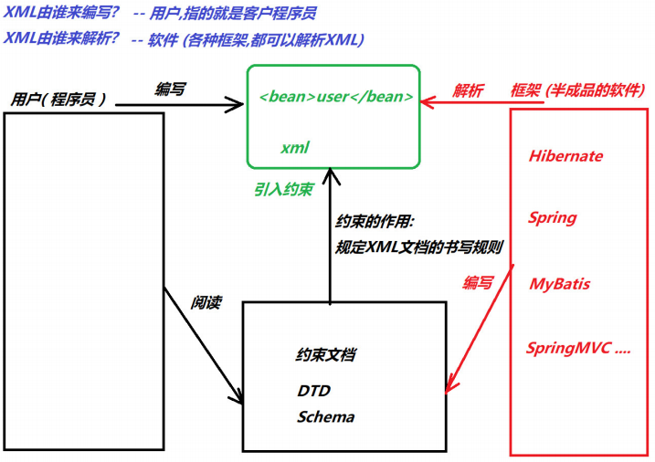
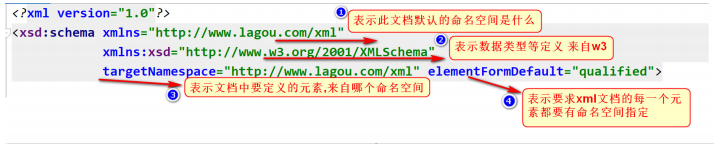
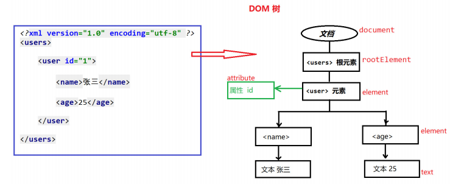

# 大数据学习-Java Day26

## XML

### 1 XML基本

#### 概述

-  XML即可扩展标记语言（Extensible Markup Language）  
  -  W3C在1998年2月发布1.0版本，2004年2月又发布1.1版本，但因为1.1版本不能向下兼容1.0版 本，所以1.1没有人用。同时，在2004年2月W3C又发布了1.0版本的第三版。
- 特点
  -  可扩展的, 标签都是自定义的  
  -  语法十分严格 

#### 作用

| 功能         | 说明                                                         |
| ------------ | ------------------------------------------------------------ |
| 存储数据     | 通常，我们在数据库中存储数据。不过，如果希望数据的可移植性更强，我们可以 把数据存储 XML 文件中 |
| 配置文件     | 作为各种技术框架的配置文件使用 (最多)                        |
| 在网络中传输 | 客户端可以使用XML格式向服务器端发送数据,服务器接收到xml格式数据,进行解析 |

### 2 语法

####  XML文档声明格式 

 文档声明必须为结束； 

 文档声明必写在第一行； 

- 语法格式

```xml
<?xml version="1.0" encoding="UTF-8"?>
```

- 属性说明
  -  versioin：指定XML文档版本。必须属性，因为我们不会选择1.1，只会选择1.0；  
  -  encoding：指定当前文档的编码。可选属性，默认值是utf-8；  

#### 元素

-  Element 元素: 是XML文档中最重要的组成部分  

-  元素的命名规则 

  1.  不能使用空格，不能使用冒号
  2.  xml 标签名称区分大小写 
  3. XML 必须有且只有一个根元素 

  ```xml
  <? 语法格式 ?>
  <users><users>
      
  <?  XML 必须有且只有一个根元素，它是所有其他元素的父元素，比如以下实例中 users 就是根元素 ?>
      
  <?xml version="1.0" encoding="utf-8" ?>
  <users>
  </users>
  
  <? 普通元素的结构开始标签、元素体、结束标签组成。 ?>
  <hello> 大家好 </hello>
  
  <?  元素体：元素体可以是元素，也可以是文本 ?>
  <hello>
  	<a>你好</a>
  </hello>
  
  <? 空元素：空元素只有开始标签，而没有结束标签，但元素必须自己闭合 ?>
  <close/>
  
  ```

#### 属性

```xml
<bean id="" class=""> </bean>

```

1.  属性是元素的一部分，它必须出现在元素的开始标签中
2. 属性的定义格式：属性名=属性值，其中属性值必须使用单引或双引 
3. 一个元素可以有0~N个属性，但一个元素中不能出现同名属性 
4.  属性名不能使用空格、冒号等特殊字符，且必须以字母开头 

#### 注释 

 XML的注释，以“  ”结束。注释内容会被XML解析器忽略！  

#### 使用XML描述数据表中的数据

```xml
<?xml version="1.0" encoding="UTF-8" ?>
    <employees>
        <employee eid="2">
            <ename>林黛玉</ename>
            <age>20</age>
            <sex>女</sex>
            <salary>5000</salary>
            <empdate>2019-03-14</empdate>
        </employee>
        <employee eid="3">
            <ename>杜甫</ename>
            <age>40</age>
            <sex>男</sex>
            <salary>15000</salary>
            <empdate>2010-01-01</empdate>
        </employee>
    </employees>
```

### 3 XML约束

-  在XML技术里，可以编写一个文档来约束一个XML文档的书写规范，这称之为XML约束。 
- 常见的xml约束
  -  DTD 
  -  Schema



####  DTD约束 

 DTD（Document Type Definition），文档类型定义，用来约束XML文档。规定XML文档中元素的名 称，子元素的名称及顺序，元素的属性等。 

-  编写DTD 
  -  开发中，我们不会自己编写DTD约束文档 
  -  常情况我们都是通过框架提供的DTD约束文档，编写对应的XML文档。常见框架使用DTD约束有： Struts2、hibernate等。 

 创建约束文件 student.dtd  

```dtd
<!ELEMENT students (student+) >
        <!ELEMENT student (name,age,sex)>
        <!ELEMENT name (#PCDATA)>
        <!ELEMENT age (#PCDATA)>
        <!ELEMENT sex (#PCDATA)>
        <!ATTLIST student number ID #REQUIRED>

<!--
    ELEMENT 定义元素
     students (student+):  students 代表根元素
     student+ : 根标签中 至少有一个 student子元素
     student (name,age,sex) : student标签中可以 包含的子元素  按顺序出现
     #PCDATA : 普通的文本内容
     ATTLIST : 用来定义属性
     student number ID : student标签中 有一个ID属性 叫做 number
     #REQUIRED : number的属性必须填写
     ID 唯一的值 不能重复 值只能是字母或者下划线开头
-->
```

-  引入DTD 

  -  引入dtd文档到xml文档中,两种方式 

    -  内部dtd：将约束规则定义在xml文档中 
    -  外部dtd：将约束的规则定义在外部的dtd文件中 

  -  student.xml  

    ```xml
    <?xml version="1.0" encoding="UTF-8" ?>
    <!DOCTYPE students SYSTEM "student.dtd">
    <students>
        <student number="S1">
            <name>长海</name>
            <age>20</age>
            <sex>男</sex>
        </student>
    
        <student number="S2">
            <name>大玲子</name>
            <age>18</age>
            <sex>女</sex>
        </student>
    
    </students>
    ```

####  Schema约束 

- 概念
  1.  Schema是新的XML文档约束, 比DTD强大很多，是DTD 替代者； 
  2. Schema本身也是XML文档，但Schema文档的扩展名为xsd，而不是xml。 
  3. Schema 功能更强大，内置多种简单和复杂的数据类型
  4. Schema 支持命名空间 (一个XML中可以引入多个约束文档) 

-  Schema约束示例 

   student.xsd  

  ```xml
  <?xml version="1.0" encoding="UTF-8" ?>
  <xsd:schema xmlns="http://www.lagou.com/xml"
              xmlns:xsd="http://www.w3.org/2001/XMLSchema"
              targetNamespace="http://www.lagou.com/xml" elementFormDefault="qualified">
  
      <xsd:element name="students" type="studentsType"/>
      <xsd:complexType name="studentsType">
          <xsd:sequence>
              <xsd:element name="student" type="studentType" minOccurs="0" maxOccurs="unbounded"/>
          </xsd:sequence>
      </xsd:complexType>
      <xsd:complexType name="studentType">
          <xsd:sequence>
              <xsd:element name="name" type="xsd:string"/>
              <xsd:element name="age" type="ageType" />
              <xsd:element name="sex" type="sexType" />
          </xsd:sequence>
          <xsd:attribute name="number" type="numberType" use="required"/>
      </xsd:complexType>
      <xsd:simpleType name="sexType">
          <xsd:restriction base="xsd:string">
              <xsd:enumeration value="male"/>
              <xsd:enumeration value="female"/>
          </xsd:restriction>
      </xsd:simpleType>
      <xsd:simpleType name="ageType">
          <xsd:restriction base="xsd:integer">
              <xsd:minInclusive value="0"/>
              <xsd:maxInclusive value="200"/>
          </xsd:restriction>
      </xsd:simpleType>
      <xsd:simpleType name="numberType">
          <xsd:restriction base="xsd:string">
              <xsd:pattern value="hehe_\d{4}"/>
          </xsd:restriction>
      </xsd:simpleType>
  </xsd:schema>
  ```

   Xml Schema的根元素：  

  

-  XML引入Schema约束 

  -  xml中引入schema约束的步骤： 

    1.  查看schema文档，找到根元素，在xml中写出来 

       ```xml
       <?xml version="1.0" encoding="UTF-8" ?>
       <students>
       
       </students>
       ```

    2.  根元素来自哪个命名空间。使用xmlns指令来声明 

       ```xml
       <?xml version="1.0" encoding="UTF-8" ?>
       <students
       	xmlns="http://www.lagou.com/xml"
       >
       
       </students>
       
       ```

    3.   引入 w3c的标准命名空间, 复制即可 

       ```xml
       <?xml version="1.0" encoding="UTF-8" ?>
       <students
           xmlns="http://www.lagou.com/xml"
           xmlns:xsi="http://www.w3.org/2001/XMLSchema-instance"
       >
       
       </students>
       ```

    4.  引入的命名空间跟哪个xsd文件对应？ 使用schemaLocation来指定：两个取值：第一个为命名空间 第二个为xsd文件的路径 

       ```xml
       <?xml version="1.0" encoding="UTF-8" ?>
       <students
           xmlns="http://www.lagou.com/xml"
           xmlns:xsi="http://www.w3.org/2001/XMLSchema-instance"
           xsi:schemaLocation="http://www.lagou.com/xml student.xsd"
       >
       
       </students>
       ```

    5.  命名空间 

        指的是一个环境,所用的标签来自于哪个环境定义的。  

    6.  student.xml 

       ```xml
       <?xml version="1.0" encoding="UTF-8" ?>
       <students
               xmlns="http://www.lagou.com/xml"   
               xmlns:xsi="http://www.w3.org/2001/XMLSchema-instance"
               xsi:schemaLocation="http://www.lagou.com/xml student.xsd"
       >
           <student number="hehe_1234">
               <name>张三</name>
               <age>200</age>
               <sex>male</sex>
           </student>
       
           <student number="hehe_4567">
               <name>张三</name>
               <age>200</age>
               <sex>male</sex>
           </student>
       
       </students>
       ```

### 4 XML解析

#### 解析概述

 当将数据存储在XML后，就希望通过程序获得XML的内容。使用Java的IO是可以完成的，不过需要非常繁琐的操作才可以完成，且开发中会遇到不同问题（只读、读写）。 为不同问题提供不同的解析方式，并提交对应的解析器，方便开发人员操作XML。 

#### 解析方式

-  常见的解析方式有两种 
  -  DOM：要求解析器把整个XML文档装载到内存，并解析成一个Document对象。 
    - 优点：元素与元素之间保留结构关系，故可以进行增删改查操作。 
    - 缺点：XML文档过大，可能出现内存溢出显现。 
  -  SAX：是一种速度更快，更有效的方法。它逐行扫描文档，一边扫描一边解析。并以事件驱动的方 式进行具体解析，每执行一行，都将触发对应的事件。（了解） 
    - 优点：占用内存少 处理速度快，可以处理大文件 
    - 缺点：只能读，逐行后将释放资源。 



####  XML常见的解析器 

-  解析器：就是根据不同的解析方式提供的具体实现。有的解析器操作过于繁琐，为了方便开发人员， 有提供易于操作的解析开发包 
  - JAXP：sun公司提供的解析器，支持DOM和SAX两种思想 
  - DOM4J：一款非常优秀的解析器 , Dom4j是一个易用的、开源的库，用于XML，XPath和XSLT。 它应用于Java平台，采用了Java集合框架并完全支持DOM，SAX和JAXP。
  -  Jsoup：jsoup 是一款Java 的HTML解析器 ,也可以解析XML 
  - PULL：Android内置的XML解析方式，类似SAX。 

#### dom4j 使用

-  导入JAR包	 dom4j-1.6.1.jar

- API介绍
  -  使用核心类SaxReader加载xml文档获得Document，通过Document 对象获得文档的根元素，然后就 可以操作 
  - 常用API如下
    -  SaxReader对象 
      - read(…) 加载执行xml文档 
    - Document对象 
      - getRootElement() 获得根元素 
    - Element对象 
      - elements(…) 获得指定名称的所有子元素。可以不指定名称
      -  element(…) 获得指定名称的第一个子元素。可以不指定名称
      -  getName() 获得当前元素的元素名 
      - attributeValue(…) 获得指定属性名的属性值 
      - elementText(…) 获得指定名称子元素的文本值 
      - getText() 获得当前元素的文本内容 

- 准备xml文件

  -  编写user.xsd schema约束 

    ```xml
    <?xml version="1.0" encoding="UTF-8" ?>
    <xsd:schema xmlns="http://www.lagou.com/xml"
                xmlns:xsd="http://www.w3.org/2001/XMLSchema"
                targetNamespace="http://www.lagou.com/xml" elementFormDefault="qualified">
    
        <xsd:element name="users" type="usersType"/>
        <xsd:complexType name="usersType">
            <xsd:sequence>
                <xsd:element name="user" type="userType" minOccurs="0" maxOccurs="unbounded"/>
            </xsd:sequence>
        </xsd:complexType>
    
        <xsd:complexType name="userType">
            <xsd:sequence>
                <xsd:element name="name" type="xsd:string"/>
                <xsd:element name="age" type="ageType" />
                <xsd:element name="hobby" type="hobbyType" />
            </xsd:sequence>
            <xsd:attribute name="id" type="numberType" use="required"/>
        </xsd:complexType>
    
        <xsd:simpleType name="ageType">
            <xsd:restriction base="xsd:integer">
                <xsd:minInclusive value="0"/>
                <xsd:maxInclusive value="100"/>
            </xsd:restriction>
        </xsd:simpleType>
    
        <xsd:simpleType name="hobbyType">
            <xsd:restriction base="xsd:string">
                <xsd:enumeration value="抽烟"/>
                <xsd:enumeration value="喝酒"/>
                <xsd:enumeration value="烫头"/>
            </xsd:restriction>
        </xsd:simpleType>
    
        <xsd:simpleType name="numberType">
            <xsd:restriction base="xsd:string">
                <xsd:pattern value="\d{3}"/>
            </xsd:restriction>
        </xsd:simpleType>
    
    </xsd:schema>
    ```

  -  编写user.xml 引入约束  

    ```xml
    <?xml version="1.0" encoding="UTF-8" ?>
    <users
            xmlns="http://www.lagou.com/xml"
            xmlns:xsi="http://www.w3.org/2001/XMLSchema-instance"
            xsi:schemaLocation="http://www.lagou.com/xml user.xsd"
    >
        <user id="001">
            <name>张百万</name>
            <age>25</age>
            <hobby>抽烟</hobby>
        </user>
    
        <user id="002">
            <name>于谦</name>
            <age>55</age>
            <hobby>烫头</hobby>
        </user>
    
        <user id="003">
            <name>小斌</name>
            <age>25</age>
            <hobby>喝酒</hobby>
        </user>
    
    
    </users>
    ```

- 读取XML

  ```java
  ublic class TestDOM4j {
  
      //获取XML文件中的 所有的元素名称(标签)
      @Test
      public void test1() throws DocumentException {
  
          //1.获取XML解析对象
          SAXReader reader = new SAXReader();
  
          //2.解析XML 获取 文档对象 document
          Document document = reader.read("H:\\jdbc_work\\xml_task03\\src\\com\\lagou\\xml03\\user.xml");
  
          //3.获取根元素
          Element rootElement = document.getRootElement();
  
          //获取根元素名称
          System.out.println(rootElement.getName());
  
          //获取 根元素下的标签
          List<Element> elements = rootElement.elements();
          for (Element element : elements) {
              System.out.println("根标签下的子节点: " + element.getName());
  
              List<Element> eList = element.elements();
              for (Element e : eList) {
                  System.out.println("user标签下的子节点" + e.getName());
              }
  
              break;
          }
  
      }
  
      //获取XML中标签的文本信息 和 属性信息
      @Test
      public void test2() throws DocumentException {
  
          //1.获取解析XML的 SAXReader
          SAXReader reader = new SAXReader();
  
          //2.获取文档对象
          Document document = reader.read("H:\\jdbc_work\\xml_task03\\src\\com\\lagou\\xml03\\user.xml");
  
          //3.获取根节点
          Element rootElement = document.getRootElement();
  
          //4.获取子节点 user
          List<Element> elements = rootElement.elements();
  
          //5.获取集合中的第一个 子节点
          Element user = elements.get(0);
  
          //6.获取节点中的文本信息
          String id = user.attributeValue("id");//获取属性 id的值
          String name = user.elementText("name");
          String age = user.elementText("age");
          String hobby = user.element("hobby").getText();
  
          //打印
          System.out.println(id + " " + name +" " + age + " " + hobby);
      }
  }
  
  ```

  

#### xpath方式读取xml

- 介绍
  -  XPath 是一门在 XML 文档中查找信息的语言。 可以是使用xpath查找xml中的内容。 
  - XPath 的好处 
    - 由于DOM4J在解析XML时只能一层一层解析，所以当XML文件层数过多时使用会很不方便，结合 XPATH就可以直接获取到某个元素  
  -  需要导入 jaxen-1.1-beta-6.jar  

- 基本语法

  使用dom4j支持xpath的操作的几种主要形式 

  | 语法                 | 说明                                                    |
  | -------------------- | ------------------------------------------------------- |
  | /AAA/DDD/BBB         | 表示一层一层的，AAA下面 DDD下面的BBB                    |
  | //BBB                | 表示和这个名称相同，表示只要名称是BBB，都得到           |
  | //*                  | 所有元素                                                |
  | BBB[1] , BBB[last()] | 第一种表示第一个BBB元素, 第二种表示最后一个BBB元素      |
  | //BBB[@id]           | 表示只要BBB元素上面有id属性，都得到                     |
  | //BBB[@id='b1']      | 表示元素名称是BBB,在BBB上面有id属性，并且id的属性值是b1 |

- API介绍

  - 常用方法
    -  selectSingleNode(query): 查找和 XPath 查询匹配的一个节点。 
      - 参数是Xpath 查询串。 
    - selectNodes(query): 得到的是xml根节点下的所有满足 xpath 的节点； 
      - 参数是Xpath 查询串。 
    - Node: 节点对象  

-  Xpath读取XML  

  - 数据准备

    book.xml

    ```xml
    <?xml version="1.0" encoding="UTF-8" ?>
    <bookstore>
        <book id="book1">
            <name>金瓶梅</name>
            <author>金圣叹</author>
            <price>99</price>
        </book>
        <book id="book2">
            <name>红楼梦</name>
            <author>曹雪芹</author>
            <price>69</price>
        </book>
        <book id="book3">
            <name>Java编程思想</name>
            <author>埃克尔</author>
            <price>59</price>
        </book>
    </bookstore>
    ```

  - 代码示例

    ```java
        /*
         * 1. 使用selectSingleNode方法 查询指定节点中的内容
         * */
        @Test
        public void test1() throws DocumentException {
            //1.创建解析器对象
            SAXReader sr = new SAXReader();
            //2.获取文档对象
            Document document = sr.read("book.xml");
            //3.调用 selectSingleNode() 方法,获取name节点对象
            Node node1 = document.selectSingleNode("/bookstore/book/name");
            System.out.println("节点: " + node1.getName());
            System.out.println("书名: " + node1.getText());
            //4.获取第二本书的名称
            Node node2 = document.selectSingleNode("/bookstore/book[2]/name");
            System.out.println("第二本书的书名为: " + node2.getText());
        }
    
    
        /*
         * 2.使用selectSingleNode方法 获取属性值,或者属性值对应的节点
         * */
        @Test
        public void test2() throws DocumentException {
            //1.创建解析器对象
            SAXReader sr = new SAXReader();
            //2.获取文档对象
            Document document = sr.read("book.xml");
            //3.获取第一个book节点的 id属性的值
            Node node1 = document.selectSingleNode("/bookstore/book/attribute::id");
            System.out.println("第一个book的id值为: " + node1.getText());
            //4.获取最后一个book节点的 id属性的值
            Node node2 =
                    document.selectSingleNode("/bookstore/book[last()]/attribute::id");
            System.out.println("最后一个book节点的id值为: " + node2.getText());
            //5.获取id属性值为 book2的 书名
            Node node3 = document.selectSingleNode("/bookstore/book[@id='book2']");
            String name = node3.selectSingleNode("name").getText();
            System.out.println("id为book2的书名是: " + name);
        }
    
    
        /*
         * 3.使用 selectNodes()方法 获取对应名称的所有节点
         *
         * */
        @Test
        public void test3() throws DocumentException {
            //1.创建解析器对象
            SAXReader sr = new SAXReader();
            //2.获取文档对象
            Document document = sr.read("book.xml");
            //3.获取所有节点,打印节点名
            List<Node> list = document.selectNodes("//*");
            for (Node node : list) {
                System.out.println("节点名: " + node.getName());
            }
            //4.获取所有的书名
            List<Node> names = document.selectNodes("//name");
            for (Node name : names) {
                System.out.println(name.getText());
            }
            //5.获取指定 id值为book1的节点的所有 内容
            List<Node> book1 =
                    document.selectNodes("/bookstore/book[@id='book1']//*");
            for (Node node : book1) {
                System.out.println(node.getName()+" = " + node.getText());
            }
        }
    ```

    

### 5  JDBC自定义XML 

####  定义配置文件 

-  创建自定义xml 文件, 保存 数据库连接信息 

   jdbc-config.xml  

  ```xml
  <?xml version="1.0" encoding="UTF-8" ?>
  <jdbc>
      <property name="driverClass">com.mysql.jdbc.Driver</property>
      <property name="jdbcUrl">jdbc:mysql://localhost:3306/db5?characterEncoding=UTF-8</property>
      <property name="user">root</property>
      <property name="password">123456</property>
  </jdbc>
  ```

#### 编写工具类(配置式) 

编写工具类 ,使用xpath 读取数据库信息

```java
public class JDBCUtils {

    //1.定义字符串变量 保存连接信息
    public static String DRIVERNAME;
    public static String URL;
    public static String USER;
    public static String PASSWORD;

    //2.静态代码块
    static{
        //使用 XPath语法 对xml中的数据进行读取
        SAXReader reader = new SAXReader();
        try {
            Document document = reader.read("jdbc-config.xml");

            //1.获取驱动名称
            Node driver = document.selectSingleNode("/jdbc/property[@name='driverClass']");
            DRIVERNAME = driver.getText();

            //2.获取URL
            Node url = document.selectSingleNode("/jdbc/property[@name='jdbcUrl']");
            URL = url.getText();

            //3.获取用户名
            Node user = document.selectSingleNode("/jdbc/property[@name='user']");
            USER = user.getText();

            //4.获取密码
            Node password = document.selectSingleNode("/jdbc/property[@name='password']");
            PASSWORD = password.getText();

            //注册驱动
            Class.forName(DRIVERNAME);

        } catch (Exception e) {
            e.printStackTrace();
        }

    }


    //获取连接的静态方法
    public static Connection getConnection(){

        try {
			//获取连接对象
            Connection connection = DriverManager.getConnection(URL, USER, PASSWORD);
			//返回连接对象
            return connection;
        } catch (SQLException e) {
            e.printStackTrace();
            return null;
        }

    }

}
```

 

####  测试工具类 

 测试 : 获取所有员工的姓名 

```java
    //获取所有员工的姓名
    public static void main(String[] args) {
        try {
            //1.获取连接
            Connection connection = JDBCUtils.getConnection();
            //2.获取 statement ,执行SQL
            Statement statement = connection.createStatement();
            String sql = "select * from employee";
            //3.处理结果集
            ResultSet resultSet = statement.executeQuery(sql);
            while (resultSet.next()) {
                String ename = resultSet.getString("ename");
                System.out.println(ename);
            }
        } catch (SQLException e) {
            e.printStackTrace();
        }

    }
```

