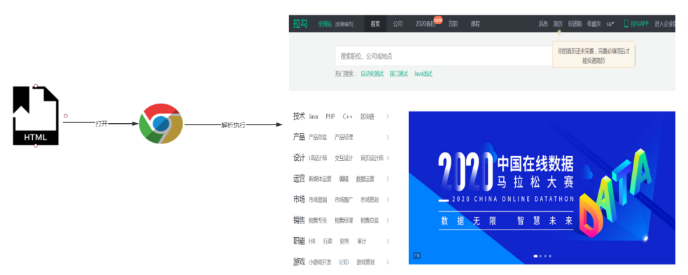
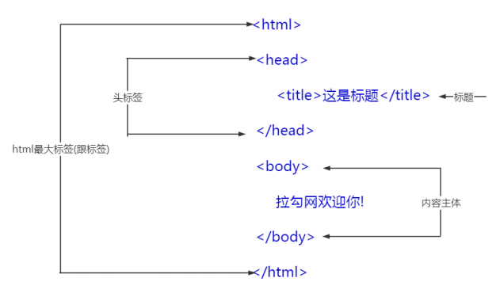
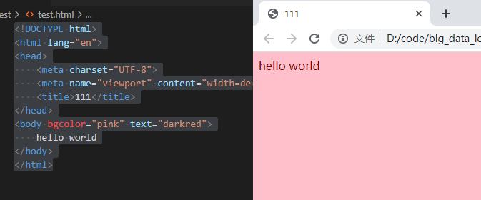
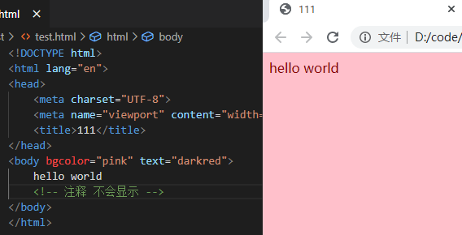
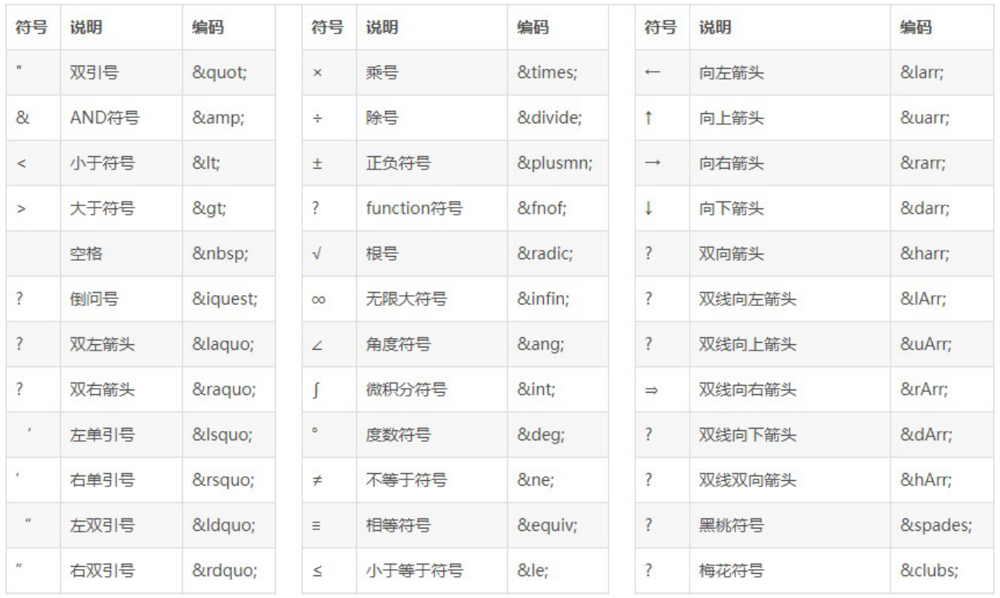
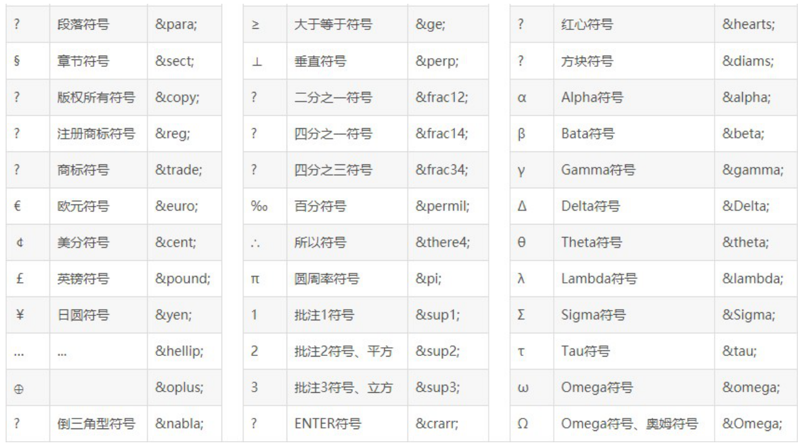

# 大数据学习-Java Day27

## HTML与CSS

### 1 HTML 简述

#### 网页

-  网站是指在因特网上根据一定的规则，使用 HTML 等制作的用于展示特定内容相关的网页集合。 网页是网站中的 一“页”，通常是 HTML 格式的文件，它要通过浏览器来阅读。  
-  网页是构成网站的基本元素，它通常由图片、链接、文字、声音、视频等元素组成。 通常我们看到的网页， 常见 以 .htm 或 .html 后缀结尾的文件，因此将其俗称为 HTML 文件。 

#### html

- 概念
  - 指超文本标记语言 (Hyper Text Markup Language) ，它是用来描述网页的一种语言。 
  -  标记语言是一套标记标签 (markup tag)  
  -  所谓超文本，有 2 层含义：
    1. 它可以加入图片、声音、动画、多媒体等内容（超越了文本限制 ）。
    2. 它还可以从一个文件跳转到另一个文件，与世界各地主机的文件连接（超级链接文本 ） 

#### 网页形成



#### html 入门代码

1.  创建“文本文档”，重命名“xxx.html”。文件名自定义，扩展名为html。  

2.  右键/打开方式/记事本，开发html文件，并编写如下内容 

   ```html
   <html>
   	<head>
   		<title>这是标题</title>
   	</head>
   	<body>
   		拉勾网欢迎你!
   	</body>
   </html>
   ```

   

#### html语法特点

-  HTML文件不需要编译，直接使用浏览器阅读即可 
-  HTML文件的扩展名是*.html 或 *.htm  
  -   ```<html> ```标签它代表当前页面是一个HTML 
  -  ``` <head>```标签中可以声明HTML页面的相关信息 
  -   ```<body>```标签中它主要是用于显示页面信息 
  -  标签要有开始，有结束，成双成对 
  -  开始标签与结束标签中的内容是标签的内容，如果没有标签内容，可以让标签自关闭```<br />```
  -  大多数标签它具有属性,属性值要使用引号引起来。 
  -  HTML它本身是不区分大小写的。  

- HTML结构包括两部分：头head和体body
- 注释：``` <!--  -->```
  - 特点
    -  浏览器查看时，不显示。右键查看源码可以看到。 
    -  注释标签不能嵌套。 
    -  注释特殊用法，为不同的浏览器提供不同的解决方案 （了解）  

#### 开发工具

-  VSCode(Visual Studio Code) 的使用  

  - 保存工作区

    -  打开文件夹后，选择“文件 -> 将工作区另存为...”，为工作区文件起一个名字，存储在刚才的文件夹下即可  

  - 常用快捷键

    | 快捷键         | 描述           |
    | -------------- | -------------- |
    | ctrl+shi+p     | 打开命令面板   |
    | ctrl + b       | 显示隐藏侧边栏 |
    | ctrl + p       | 浏览文件       |
    | ctrl + w       | 关闭文件       |
    | ctrl + /       | 注释           |
    | shi + alt + a  | 块注释         |
    | shi + Alt + f  | 格式化文档     |
    | ctrl + shi + k | 删除行         |

  - 常用插件

    | 插件名称              | 描述              |
    | --------------------- | ----------------- |
    | chinese Language      | 中文              |
    | HTML CSS Supprot html | 文档及css样式支持 |
    | HTMLHint html         | 代码检测          |
    | open in browser       | 浏览器中打开      |
    | live server           | 开启本地服务器    |
    | Auto Rename Tag       | 自动设置标签      |
    | vetur vue             | 辅助工具          |

### 2 HTML使用

#### 文件标签

-  ``` <html>```标签

  -  代表当前书写的是一个HTML文档  

- ```<head>``` 标签

  - 存储的本页面的一些重要的信息，它不会显示 
  - 有一个子标签

- ```<body>``` 标签

  - 书写的内容会显示出来 

  - 属性
    1.  text 用于设置文字颜色 
    2.  bgcolor 用于设置页面的背景色 
    3. background 用于设置页面的背景图片



#### 排版标签

- html注释



- 换行标签
  - ```<br/>``` 标签就是一个换行（回车）功能标签，标签中的 / 可有可无的。 
  -  有/是html语言的标准化，但是html语言是一门不那么严谨的语言  

```html

<body bgcolor="pink" text="darkred">
    hello <br />world
    <!-- 注释 不会显示 -->
</body>

```

- 段落标签
  - 在```<p>``` 标签中的内容,会在开始与结束之间产生一个空白行，并且它会自动换行.  
  - 常用属性align它的作用是设置段落中的对其方式，可取值有left、right、center

```html

<body bgcolor="pink" text="darkred">
    <p align="center">hello </p>
    <p align="right">world</p>
    <!-- 注释 不会显示 -->
</body>

```

- 水平线标签

  - ```<hr>``` 标签会在页面上产生一个水平线 

  - 常用属性

    -  align：可取值有left right center 代表水平线位置  

    -  size：代表水平线厚度（粗细） 

    -  width：代表水平线宽度 

    -  color：水平线的颜色 

      ```html
      <body>
          hello
          <hr>
          world
          <hr size="10" color="red" width="300">
      </body>
      ```

       单位：size="5"，5是默认的单位，为"像素"/"像素点"，像素就是构成计算机图片的最小单位！

       也可以使用百分比，size="50%"    

-  分区标签 

  -  div是一个块标签，用来进行布局的 

  -  普通的div并没有什么效果，肉眼也看不见，但div与CSS结合，就会更好对页面进行排版

  -  div与span都是“容器”的作用，具体区别:  

    -   div会自动换行，我们也叫这样的标签为块级元素 
    -  span标签它不会自动换行，我们也叫它为行内元素 
    -  div：整体划分区块 
    -  span：局部划分 

    ```html
    <body>
        <div>1</div>
        <div style="width: 100px;height: 100px; background: palevioletred;">2</div>
    </body>
    ```

#### 字体标签

- 字体标签

  - ```<font>``` 标签可以设置字体，字的大小及颜色，常用属性：  

    -  face:用于设置字体，例如 宋体 隶书 楷体  
    -  size:用于设置字的大小（大小默认设置1-7，7最大）  
    -  color:用于设置字的颜色  

  -  我们所看到的屏幕上所有的颜色都是由红、绿、蓝这三种基色调混合而成的。 

  -  每一种颜色的饱和度和透明度都是可以变化的，用0～255的数值来表示。如纯红色表示为（255，0， 0），十六进制表示为#FF0000。 

  -  按这种表达方式，理论上我们可以得到256 * 256 * 256 = 16777216种颜色。 

    -   使用十六进制方式，取值范围 #000000 ~ #FFFFFF （黑色到白色）。当颜色值为#cc3300 时，可 简化成 #c30 这种方式  

      ```html
      <body bgcolor="#666">
      ```

    -   RGB颜色表示法：RGB（x,y,z）。x、y、z是0 ～ 255之间的整数。rgb字母大小写无所谓 

      ```html
      <body bgcolor="rgb(11,11,11)">
      ```

       在线颜色选择器： http://www.86y.org/code/colorpicker/color.html   

- 标题标记

  - ```<h1>------<h6>```

    - h1最大h6最小，他们代表的是标题
    -  自动换行，字体加粗，标题与标题之间产生一定的距离 
    -  **在HTML中允许标签进行嵌套的，但是一般都包裹嵌套，而不可以进行交叉嵌套** 

    ```html
    <body>
        <h1>1</h1>
        <h2>2</h2>
        <h3>3</h3>    
        <h4>4</h4>
        <h5>5</h5>
        <h6>6</h6>
    </body>
    ```

-  格式化标签

  - ```<b>``` 字体加粗 

  - ```<i>``` 字体倾斜  

  - ```<del>``` 删除线 

  - ```<u>``` 下划线  

    ```html
    <body>
        <b>hello world</b><br>
        <i>hello world</i><br>
        <del>hello world</del><br>
        <u>hello world</u><br>
        <h3>hello <font color="red"> world</font></h3>
    </body>
    ```

#### 列表标记

- ol：有序列表

  -  type='A'：字母排序 
  - type='I'：罗马排序 
  - start=“3” 序列从几开始  

- ul：无需列表

  -  type="disc"：默认，实心圆
  -  type="square"：方块 
  - type="circle"：空心圆 

  ```html
  <body>
  <ol type="1" start="3">
      <li>hh</li>
      <li>hh</li>
      <li>hh</li>
  </ol>
  <ul type="disc">
      <li>hh</li>
      <li>hh</li>
      <li>hh</li>
  </ul>
  </body>
  ```

#### 图像标签

- `````` 它可以让我们在网页引入一张图片，常用属性： 
  1.   src 代表的图片的路径 
  2.  width 图片的宽度 
  3. height 图片的高度 
  4. border 用于设置图片的边框 
  5. alt 如果图片不可以显示时，默认显示的文本信息 
  6.  title鼠标悬停图片上，默认显示的文本信息 
  7.  align 图片附件文字的对齐方式，可取值有
     -   left：把图像对齐到左边 
     - right：把图像对齐到右边 
     - middle：把图像与中央对齐 
     - top：把图像与顶部对齐 
     - bottom：把图像与底部对齐（默认） 

#### 超链接标签

- ```<a>```标签可以实现跳转到其他页面操作
  - 超链接内容不仅可以使文本，也可以是图片等信息
  - 常用属性
    -  href 代表的我们要跳转的路径 
    -  target 这个属性规定在何处打开这个链接文档，可取值： 
      -  _ blank 在**新窗口**中打开页面 
      - _ self 默认。在**本窗口**打开页面 

#### 表格

- ```table``` ：定义一个表格 
  - border：边框，取值是像素为单位 
  - width 代表的表格的宽度 
  - align 代表表格的对齐方式；取值 
    - left 左对齐表格 
    - right 右对齐表格 
    - center 居中对齐表格 
  -  cellspacing：单元格间距（通常设置0表示单线表格） 
-  ```<tr>```：表格中的行 （Table Row） 
  - align 代表表格的对齐方式；
    - 取值 left 左对齐内容（默认值） 
    - right 右对齐内容 
    - center 居中对齐内容（th 元素的默认值） 
-  ```<td>```：表格中的数据单元格 （Table DataCell） 
  - colspan 指示列的合并 
  -  rowspan 指示行的合并  

```html
<body>
    <table border="1" width="400px" align="center" cellspacing="0">
        <tr align="center">
        <td colspan="3">计划统计表</td>
        </tr>
        <tr>
        <td rowspan="3">收入金额</td>
        <td>5</td>
        <td>6</td>
        </tr>
        <tr>
        <td>8</td>
        <td>9</td>
        </tr>
        <tr>
        <td>11</td>
        <td>12</td>
        </tr>
        </table>
</body>
```

#### 表单标签

- 概述
  -  表单可以让我们将录入信息携带到服务器端。 
  - 简单说，通过表单可以将要提交的数据提交到指定的位置。 但一个一个的提交，不方便。
  - 表单正好解决了这个问题，将所有的数据形成一个整体，一起提交给服务 器。 
  - 常见的 登录页面、注册页面 都离不开表单的应用 

- form属性
  -  action：整个表单提交的目的地  
  -  method：表单提交的方式 
    -  get：提交时，传输数据量少（传递普通文字信息，传递照片会失败），明文提交（在浏览器的url 后面会显示提交的数据，不适合用于登录）  
    -  post：提交时，传输数据量大（传递文字和图片都行），密文提交（浏览器的url后面看不到提交 的数据） 

- 表单中的元素（控件）
  - ```<input>``` 元素的type属性 
    - text：默认值，普通的文本输入框 
      - placeholder属性：提示文本 
      - maxlength属性：最多能输入字符数量 
    - password：密码输入框 
    - checkbox：多选框/复选框 
      - checked：被选中 
    - radio：单选按钮 
    - file：上传文件 
    - reset：重置按钮 
    - submit：提交按钮 
    - button：普通按钮 
  - ```<select>``` ：下拉列表/下拉框 
    - ```<option>```：列表中的项 
      - selected：被选中 
  - ```<textarea>``` ：文本域（多行文本框） 
    - 可以通过 cols 和 rows 属性来规定 textarea 的尺寸，不过更好的办法是使用 CSS 的height 和 width 属性。 
  - ```<button>``` ：按钮 
    - 在form表单中，作用和submit一样 
    - 不在form表单中，就是普通按钮（配合后期的javascript，可扩展性更高）  

```html
<body>
    <form action="baidu" method="GET">
        <p>帐号：<input name="a" type="text" placeholder="请输入帐号..."
        maxlength="5" ></p>
        <p>密码：<input name="b" type="password"></p>
        <p>爱好：
        <input name="hobby" type="checkbox"> 抽烟
        <input name="hobby" type="checkbox" checked="checked"> 喝酒
        <input name="hobby" type="checkbox"> 烫头
        <input name="hobby" type="checkbox"> 泡澡
        </p>
        <p>性别：
        <input type="radio" name="sex"> 男
        <input type="radio" name="sex" checked="checked"> 女
        </p>
        <p>身份：
        <input type="radio" name="role"> ceo
        <input type="radio" name="role"> cto
        <input type="radio" name="role"> cto
        <input type="radio" name="role"> coo
        <input type="radio" name="role" checked="checked"> ufo
        </p>
        <p>头像：
        <input type="file">
        </p>
        <p>血型：
        <select>
        <option>A型</option>
        <option>B型</option>
        <option>C型</option>
        <option selected="selected">O型</option>
        </select>
        </p>
        <p>个人简介：
        <textarea cols="10" rows="5"></textarea>
        </p>
        <p>
        <input type="reset" value="清空">
        <input type="submit" value="提交">
        <input type="button" value="取消">
        <button>保存</button>
        </p>
        </form>
        <button>测试</button>
</body>
```

**注意：**

1.  所有表单中的元素都要具有名称（否则提交到服务器之后，服务器无法区识别多个元素之间的不 同） 
2. 单选框要想可以一次只选择一个，要具有相同的name值 
3. 所有的复选框以组为单位，组内的每个复选框都应该具有相同的name值 

#### 框架标签

 通过```<frameset>和<frame>```框架标签可以定制HTML页面布局。可以理解为：用多个页面拼装成一个页 面 

**注意， 框架标签和body标签不共存。“有你没我，有我没你”**  

```html
<!DOCTYPE html>
<html lang="en">

<head>
  <meta charset="UTF-8" />
  <meta name="viewport" content="width=device-width, initial-scale=1.0" />
  <meta http-equiv="X-UA-Compatible" content="ie=edge" />
  <title>Document</title>
</head>
  <frameset rows="10%,*,13%">
      <frame src="top.html"></frame>
      <frameset cols="15%,*">
          <frame src="left.html"></frame>
          <frame src="right.html"></frame>
      </frameset>
      <frame src="foot.html"></frame>
  </frameset>

</html>
```

 top.html、left.html、right.html、foot.html 四个页面内容一样，稍微改下文字而已，以top.html为例  

```html
<!DOCTYPE html>
<html lang="en">

<head>
    <meta charset="UTF-8">
    <meta name="viewport" content="width=device-width, initial-scale=1.0">
    <meta http-equiv="X-UA-Compatible" content="ie=edge">
    <title></title>
</head>

<body>
    <h1>顶部导航区域</h1>
</body>

</html>
```

####  其它标签与特殊字符 

- ```<meta>``` 标签 

  - 标签必须写在标签之间 

    ```html
    <meta charset="UTF-8">
    <meta name="viewport" content="width=device-width, initial-scale=1.0">
    <meta http-equiv="X-UA-Compatible" content="ie=edge">
    
    ```

    1.  当前页面的字符编码 gbk：中文简体 
    2. 这里 的 名字 是 viewport （显示窗口） 数据 是 文本 内容 content="width=device-width, initial-scale=1.0" 也就是 显示窗口 宽度 是 客户端的 屏幕 宽度 （就是 满屏 ！），显示的文字和图形的初始比例 是 1.0 
    3. 每个电脑内置的IE版本是不一样的，为了兼容所有的版本以最高级模式渲染文档，也就是任何IE版 本都以当前版本所支持的最高级标准模式渲染 

  - 通过meta标签来设置页面加载后在指定的时间后跳转到指定的页面 

    ```html
    <meta http-equiv="refresh" content="5; url=http://www.baidu.com">
    ```

     **注意：在html中如果跳转的互联网上的网站资源，那么在写路径时，一定要带协议的路径。** 

- ```<link>``` 标签 
  - 用link标签来导入css 
  - 注意:link标签也必须写在标签中 

- 特殊字符

  

  

### 3  HTML5新特性 

####  HTML4与HTML5的区别 

H5包含H4 是H4的升级版本

-  大小写不敏感 

  - 标签
  -  属性
  - 属性的值  

  ```html
  <inPUT tYPe="pasSWord"/>
  ```

-  引号可省略 

  ```html
  <input type="password">
  <input type=password>
  ```

-  省略了结尾标签 

  ```html
  <p>哈哈哈哈哈哈哈
  <p>哈哈哈哈哈哈哈
  ```

  查看源代码可知，html自动补全

####  新增语义化标签 

 html4中，所有的容器标签95%都会使用div，div过多的话，很难区分彼此  

 新增许多语义化标签，让div“见名知意”  

-  section标签：表示页面中的内容区域，部分，页面的主体部分 
- article标签：文章 
- aside标签：文章内容之外的，标题 
- header标签：头部，页眉，页面的顶部 
- hgroup标签：内容与标题的组合 
- nav标签：导航 
- figure标签：图文并茂 
- foot：页脚，页面的底部 

#### 媒体标签

想在网页上播放视频，就要使用```<video>```，属性有：

-  src：媒体资源文件的位置 
- controls：控制面板 
-  autoplay：自动播放（谷歌失效，360浏览器可以） 
- loop：循环播放  

```html
<video src="img/html-css-js之间的关系.mp4" controls loop autoplay></video>
```

####  新增表单控件 

 表单的控件更加丰富了  

- ```<input>``` ，修改type属性： 
  -  color：调色板 
  - date：日历 
  - month：月历 
  - week：周历 
    - number：数值域 
    - min：最小值（默认值是1） 
    - max：最大值（默认值无上限） 
  - step：递增量 
  - range：滑块 
  - search：搜索框（带×号，可一键删除框中内容） 

-  进度条 ```<progress/>```

-  高亮 ```<mark>```

-  联想输入框```<datalist>``` （模糊查询） 
  - 选项```<option>``` 