# 大数据学习-Java Day28

## CSS

### 1 CSS简介

-  CSS是指层叠样式表 cascading style sheets 
- 通过CSS可以让我们定义HTML元素如何显示。 
- CSS可以让我们原本HTML不能描述的效果，通过CSS描述出来。 
- 通过CSS描述我们的html页面，可以让我们的页面更加漂亮，可以提高工作效率。  

### 2 CSS与HTML结合方式

#### 内联/行内样式

-  HTML标签上通过style属性来引用CSS代码。 
  -  优点:简单方便 ； 
  - 缺点:只能对一个标签进行修饰。  

```html
<body>
    <div style="color: palevioletred;">hello world</div>
</body>
```

#### 内部样式表

- 通过```<style>``` 标签来声明我们的CSS. 通常```<style>``` 标签推荐写在head和body之间，也就是“脖子” 的位置 
  -  优点:可以通过多个标签进行统一的样式设置 
  - 缺点: 它只能在本页面上进行修饰 

- 语法： 选择器 {属性:值;属性:值} 

  ```html
  </head>
  <style>
      div{
          color: peru;
      }
  </style>
  <body>
      <div >hello world</div>
  </body>
  ```

#### 外部样式表

-  需要单独定义一个CSS文件,注意CSS文件的后缀名就是.css 
- 在项目根目录下，创建css目录，在css目录中创建css文件 css01.css 
- 在```<head>>中使用``` ```<link>```标签引用外部的css文件 

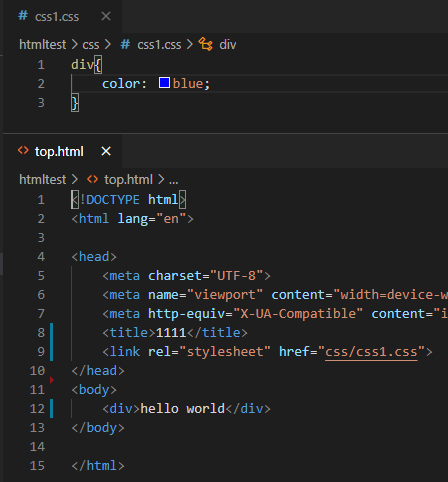

-  还可以使用另一种引入css文件的方式： 

  ```html
  <style>
  @import 'css/css01.css'
  </style>
  ```

  -  关于外部导入css使用与@import的区别? 
    - 加载顺序不同
      1.  @import方式导入会先加载html，然后才导入css样式，那么如果网络条件不好，就会先看到没有 修饰的页面，然后才看到修饰后的页面。 
      2. 如果使用link方式，它会先加载样式表，也就是说，我们看到的直接就是修饰的页面；
    -  @import方式导入css样式，它是不支持javascript的动态修改的。而link支持。 

#####  三种样式表的优先级：满足就近原则                   内联 > 内部 > 外部  

### 3 CSS的使用

#### CSS中的选择器

- 元素（标签选择器）
  -  它可以对页面上相同的标签进行统一的设置，它描述的就是标签的名称 

    ```html
    <style>
        h2{
            color: rebeccapurple;
        }
    </style>
    <body>
        <h2>hello world</h2>
        <h2>hello world</h2>
        <h2>hello world</h2>
    </body>
    ```

- 类选择器
  
  -  类选择器在使用时使用"."来描述，它描述的是元素上的class属性值 
-  id选择器 
  -  它只能选择一个元素，使用 "#" 引入，引用的是元素的id属性值。 
  - id选择器，比类选择器更具有唯一性 

```html
<style>
    #a{
        color: rebeccapurple;
    }
    .b{
        color: red;
    }
</style>
<body>
    <h2 id="a">hello world</h2>
    <h2 class="b">hello world</h2>
    <h2>hello world</h2>
</body>
```

- 选择器组

  -  逗号表示，谁和谁。 

    - 例如，我有手机，你有手机，他也有手机，一条一条写太麻烦，就可以合并编写 

      ```html
      <style>
          #a,.b{
              color: rebeccapurple;
          }
      
      </style>
      <body>
          <h2 id="a">hello world</h2>
          <h2 class="b">hello world</h2>
          <h2>hello world</h2>
      </body>
      ```

- 派生选择器

  -  子代：父子关系（隔代不管） 

    ```html
    <style>
        div>p{
            color: rosybrown;
        }
    
    </style>
    <body>
        <div>
            <p>1</p>
            <p>2</p>
            <span>
                <p>3</p>
                <p>4</p>
            </span>
        </div>
    </body>
    ```

  - 后代：父子孙，曾孙，从孙... 

    ```html
    <style>
        div p{
            color: rosybrown;
        }
    
    </style>
    <body>
        <div>
            <p>1</p>
            <p>2</p>
            <span>
                <p>3</p>
                <p>4</p>
            </span>
        </div>
    </body>
    ```

- CSS伪类

  -  CSS伪类可对css的选择器添加一些特殊效果 

  - 伪类属性列表： 

    - :active 向被激活的元素添加样式。 
    - :hover 当鼠标悬浮在元素上方时，向元素添加样式。 
    - :link 向未被访问(点击)的链接添加样式。 
    - :visited 向已被访问(点击)的链接添加样式。 
    - :first-child 向元素的第一个子元素添加样式。 

  - 超链接的伪类：要遵守使用顺序，爱恨原则 LoVeHAte，lvha 

    ```CSS
    a:link {color: #FF0000} /* 未点击的链接 */
    a:visited {color: #00FF00} /* 已访问的链接 */
    a:hover {color: #FF00FF} /* 鼠标移动(悬停)到链接上 */
    a:active {color: #0000FF} /* 选定的链接 */
    ```

    ```html
    <style>
        li:first-child{
            color: seagreen;
        }
    </style>
    <body>
        <ul>
            <li>1</li>
            <li>2</li>
            <li>3</li>
        </ul>
    </body>
    ```

#### CSS基本属性

- 文本属性

  -  指定字体：font-family : value; 
  - 字体大小：font-size : value; 
    - px：像素 
    - em：倍数 
  - 字体加粗：font-weight : normal/bold; 
  - 文本颜色：color : value; 
  - 文本排列：text-align : left/right/center; 
  - 文字修饰：text-decoration : none/underline; 
  - 行高：line-height : value; 
  - 首行文本缩进：text-indent : value （2em）; 

  ```html
  <style>
      .title{text-align: center;}
      .author{text-align: right;}
      .context{text-indent: 2em;}
  </style>
  <body>
      <p class="title">111111</p>
      <p class="author">2222222</p>
      <p class="context"> 33333333333333333333333333333</p>
  </body>
  ```

- 背景属性

  -  CSS 允许应用纯色作为背景，也允许使用背景图像创建相当复杂的效果。  

    -  background-color 设置元素的背景颜色。 

    - background-image 把图像设置为背景。 

      ```css
      background-image: url('img/1.jpg');
      ```

    -  background-repeat 设置背景图像的墙纸效果，是否及如何重复 

      - repeat：在垂直方向和水平方向重复，为重复值 
      - repeat-x：仅在水平方向重复 
      - repeat-y：仅在垂直方向重复 
      - no-repeat：仅显示一次  

    -  background-position 设置背景图像的起始位置 

      - 控制水平方向 x轴： 正值，向右移动； 负值，向左移动 
      - 控制垂直方向 y轴： 正值，向下移动； 负值，向上移动 

      ```css
      /* 图片向左移动50px，向下移动100px （可以为负值） */
      background-position:50px 100px;
      ```

    -  background-attachment 背景图像是否固定或者随着页面的其余部分滚动 

      - 默认值是 scroll：默认情况下，背景会随文档滚动 
      - 可取值为 fixed：背景图像固定，并不会随着页面的其余部分滚动，常用于实现称为水印的图 像

      ```css
      background-attachment: fixed;
      ```

- 列表属性

  -  CSS列表属性作用如下： 
    - 设置不同的列表项标记为有序列表 
    - 设置不同的列表项标记为无序列表 
    - 设置列表项标记为图像 

  -    有两种类型的列表： 
    - 无序列表 - 列表项标记用特殊图形（如小黑点、小方框等） 
    - 有序列表 - 列表项的标记有数字或字母 
  - 使用CSS，可以列出进一步的样式，并可用图像作列表项标记。 
    - none：无标记。（去除标记） 
    - disc：默认。标记是实心圆。 
    - circle：标记是空心圆。 
    - square：标记是实心方块。 
    - decimal：标记是数字。 
    - decimal-leading-zero：0开头的数字标记。(01, 02, 03, 等。) 
    - lower-roman：小写罗马数字(i, ii, iii, iv, v, 等。) 
    - upper-roman：大写罗马数字(I, II, III, IV, V, 等。) 
    - lower-alpha：小写英文字母The marker is lower-alpha (a, b, c, d, e,等。) 
    - upper-alpha：大写英文字母The marker is upper-alpha (A, B, C, D, E,等。) 

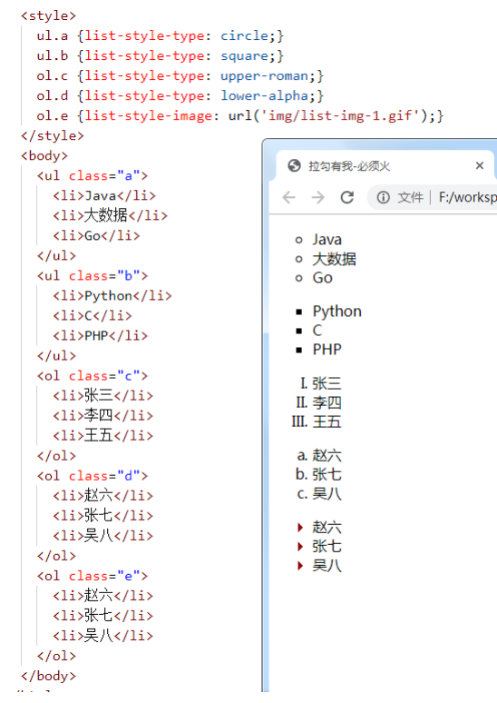

```html
<style>
    li{
        float: left;            /*纵向变水平*/
        width: 150px;           /*li的宽度*/
        list-style-type: none;  /*去除圆点*/
        background:black;   /*背景色*/
        color: white;       /*字体颜色*/
        text-align: center; /*文字居中对齐*/
        line-height: 40px;  /*行高*/
        font-size: 1.1em;   /*字体大小*/
        cursor: pointer;    /*鼠标央视*/
    }
</style>
<body>
    <ul>
        <li>11111</li>
        <li>222222</li>
        <li>333333</li>
    </ul>
</body>
```

- 边框属性
  -  CSS边框属性允许你指定一个元素边框的样式和颜色。  

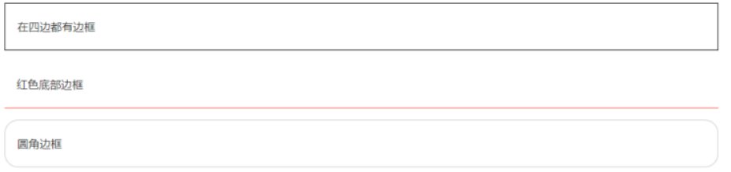

```html
<style>
    div {
       width: 400px;
       height: 40px;
    }
    .a{
        /*设置四个边*/
        border: width 2px; 
        border-color: blueviolet;
        border-style: solid;

        border-right-color: crimson;/* 设置右边框的颜色*/
        border-bottom-style: dashed;  /*设置下边框样式*/
    }

    .b{
        border: 1px solid red;/*此为a的简化版本*/
    }
</style>
<body>
    <div class="a">hello</div>
    <div class="b">hello</div>

</body>
```

 **border-style取值：**  

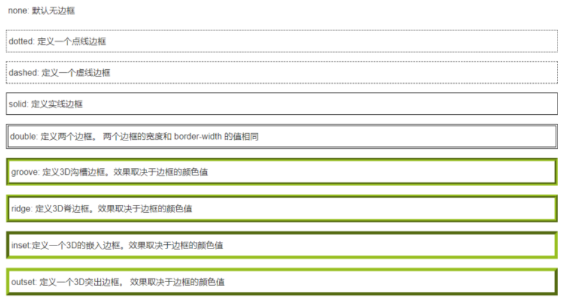

-  轮廓属性 

  -  轮廓（outline）是绘制于元素周围的一条线，位于边框边缘的外围，可起到突出元素的作用。 

  - 轮廓和边框的区别：

    -  边框 (border) 可以是围绕元素内容和内边距的一条或多条线； 
    - 轮廓（outline）是绘制于元素周围的一条线，位于边框边缘的外围，可起到突出元素的作用。 

  -  CSS outline 属性规定元素轮廓的样式、颜色和宽度。  

    ```html
    <style>
        div{
          border-width: 20px;
          border-color: yellow;
          border-style: solid;
          outline: Spx darkcyan dashed;
        }
      </style>
      <body>
        <div>hello</div>
      </body>
    ```

-  盒子模型 

  - 所有HTML元素可以看作盒子，在CSS中，"box model"这一术语是用来设计和布局时使用。

  -  CSS盒子模型本质上是一个盒子，封装周围的HTML元素，它包括：边距，边框，填充，和实际内容。 

  - 盒子模型允许我们在其它元素和周围元素边框之间的空间放置元素。 

  - 下面的图片说明了盒子模型(Box Model)： 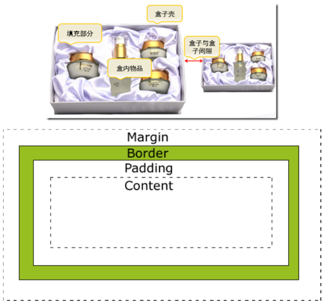

  -  margin(外边距) - 盒子与盒子之间的距离 

  - border(边框) - 盒子的保护壳 

  - padding(内边距/填充) - 内填充，盒子边与内容之间的距离 

  - content(内容) - 盒子的内容，显示的文本或图像  

    ```html
    <style>
        div{
            width: 300px;
            height: 50px;
            border: 2px solid greenyellow;
            margin-top: 50px;  /*上外边距*/
            margin-left: 30px;  /*上左边距*/
            padding-top: 20px;  /*上内边距*/
            padding-left: 50px; /*左外边距*/
        }
    </style>
    <body>
        <div>hellohellohellohellohellohello</div>
    </body>
    
    ```

#### CSS定位

- 默认定位
  - 块级元素：h1~h6，p, div 等，自上而下，垂直排列（自动换行）；可以改变宽高  
  
  - 行内元素：a,b,span,等，从左向右，水平排列（不会换行）；不能改变宽高  

  - 行内块元素：input,img等，从左向右，水平排列（自动换行）；可以改变宽高 
  
    ```html
    <style>
        div{
            width: 100px;
            height: 50px;
            border: 1px solid red;
        }
    
        span{
            width: 100px;
            height: 100px;
            border: 1px solid red;
        }
        a{
            width: 50px;
            height: 50px;
            border: 1px solid red;
            /*a标签事行内元素，无法改变宽高，但只要转换成行内块元素，就可以改变*/
            display: inline-block; /*将a元素显示成行内块*/
        }
        
    </style>
    <body>
        <div>hello</div>
        <div>hello</div>
        <div>hello</div>
    <hr>
        <span>world</span>
        <span>world</span>
        <span>world</span>
    <hr>
        <input>
        <input>
        <input>
    
        <h1>如何让span标签也可以改变宽高，</h1>
        <p>使用display属性进行转换</p>
    <hr>
        <a href="baidu.com"></a>
    </body>
    ```
  
    
  
- 浮动定位

  -  让元素“飞”起来。不仅可以靠着左边或右边。还可以消除“块级”的霸道特性（独自占一行）。 

  -  float取值：

    -  none ：不浮动 
    - left：贴着左边 浮动 
    - right：贴着右边 浮动 

    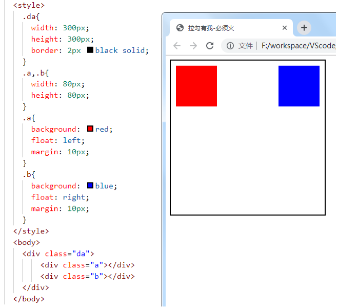

- 相对定位
  
-  相对于原来的位置比较，进行移动定位（偏移） 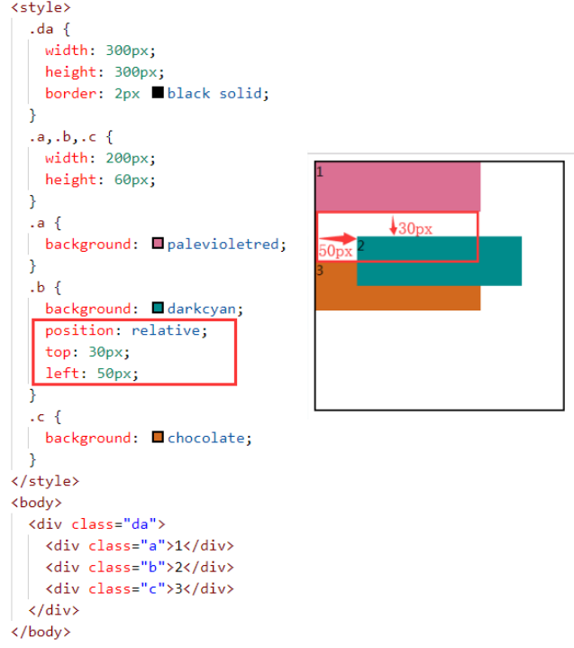
  
- 绝对定位

  -  本元素与已定位的祖先元素的距离

    -  如果父级元素定位了，就以父级为参照物； 

    - 如果父级没定位，找爷爷级，爷爷定位了，以爷爷为参照物。 

    - 如果爷爷没定位，继续向上找，都没定位的话，body是最终选择。  

      ```html
        <div class="yeye">
          <div class="father">
            <div class="a">1</div>
            <div class="b">2</div>
            <div class="c">3</div>
          </div>
        </div>
      ```

    - 以父节点为参照物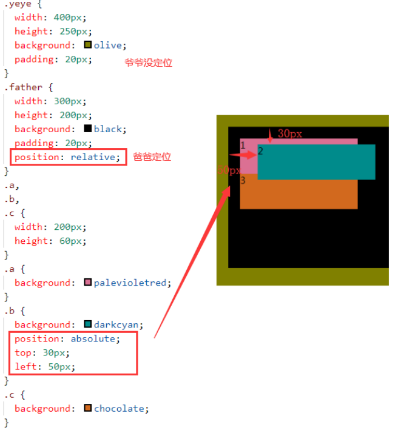

    - 以爷爷节点为参照物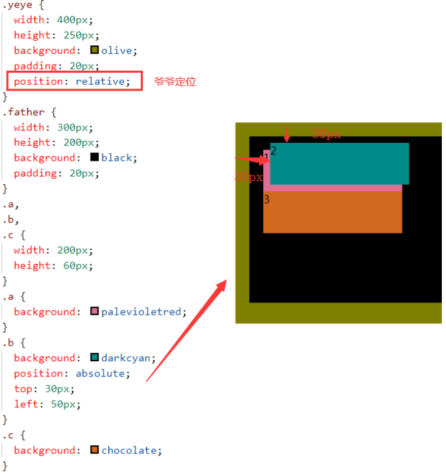

- 固定定位

  -  将元素的内容固定在页面的某个位置，当用户向下滚动页面时元素框并不随着移动 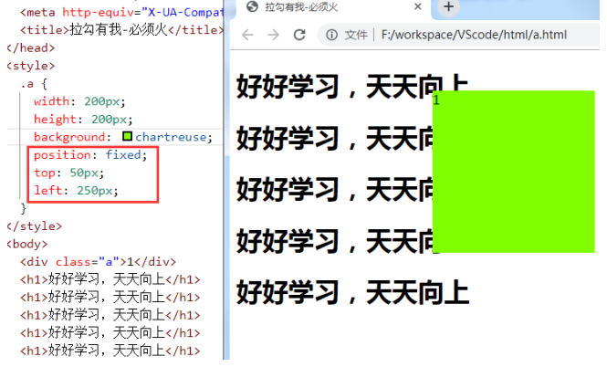

- z-index

  -  如果有重叠元素，使用z轴属性，定义上下层次。 

  - **注：**
    -  z轴属性，要配合相对或绝对定位来使用。 
    -  z值没有额定数值（整型就可以，具体用数字几，悉听尊便） 

### 4 CSS3

#### 圆角

-  border-radius：左上 右上 右下 左下; 
- border-radius：四个角; 
- border-radius：50%; 圆形 

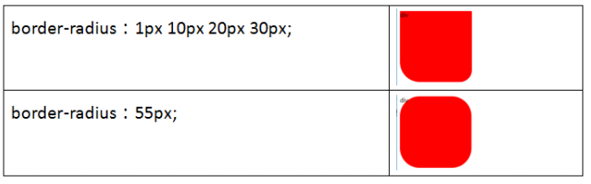

#### 盒子阴影

-  box-shadow：1 2 3 4 5;  
  1.  水平偏移 
  2. 垂直偏移 
  3. 模糊半径 
  4. 扩张半径 
  5. 颜色  

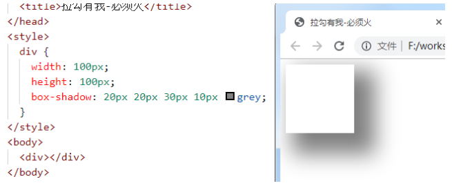

#### 渐变

- 线性渐变

  ```css
  background:linear-gradient([方向/角度]，颜色列表)；
  <!-- 默认颜色从上到下渐变，可指定 -->
  ```

  ```HTML
  <style>
    div {
      width: 200px;
      height: 60px;
      padding: 20px;
      margin: 10px;
    }
  
    .a1 {
      background: linear-gradient(red, black);
    }
  
    .a2 {
      background: linear-gradient(red, black, pink, green);
    }
  
    .a3 {
      background: linear-gradient(to left, red, black);
    }
  
    .a4 {
      background: linear-gradient(to top left, red, black);
    }
  
    .a5 {
      background: linear-gradient(30deg, red, black);
    }
  </style>
  <body>
    <div class="a1"></div>
    <div class="a2"></div>
    <div class="a3"></div>
    <div class="a4"></div>
    <div class="a5"></div>
  </body
  ```

-  径向渐变 

  -  以圆心向外发散 

    ```css
    background: radial-gradient(颜色列表);
    ```

    ```html
    <style>
      div {
        width: 200px;
        height: 200px;
        margin: 10px;
      }
    
      .a1 {
        background: radial-gradient(red, black);
      }
    
      .a2 {
        background: radial-gradient(red, black, pink, green);
      }
    
      .a3 {
        border-radius: 50%;
        background: radial-gradient(red, black);
      }
    </style>
    <body>
      <div class="a1"></div>
      <div class="a2"></div>
      <div class="a3"></div>
      <div class="a4"></div>
      <div class="a5"></div>
    </body>
    ```

#### 背景

- 背景位置 

  -  background-origin：指定了背景图像的位置区域 
    - border-box : 背景贴边框的边 
    - padding-box : 背景贴内边框的边 
    - content-box : 背景贴内容的边 

  ```css
  <style>
    div {
      background: url("img/1.jpg") no-repeat;
      width: 200px;
      height: 80px;
      margin: 20px;
      border: 10px dashed black;
      padding: 20px;
    }
  
    .a {
      background-origin: border-box;
    }
  
    .b {
      background-origin: padding-box;
    }
  
    .c {
      background-origin: content-box;
    }
  </style>
  
  <body>
    <div class="a"></div>
    <div class="b"></div>
    <div class="c"></div>
  </body>
  ```

-  背景裁切 

  - background-clip: 

    - border-box 边框开切 
    - padding-box 内边距开切 
    - content-box 内容开切 

    ```html
    <style>
      div {
        width: 200px;
        height: 80px;
        border: 10px dashed red;
        background-color: darkcyan;
        margin: 20px;
        padding: 20px;
      }
    
      .a {
        background-clip: border-box;
      }
    
      .b {
        background-clip: padding-box;
      }
    
      .c {
        background-clip: content-box;
      }
    </style>
    
    <body>
      <div class="a"></div>
      <div class="b"></div>
      <div class="c"></div>
    </body>
    ```

-  背景大小 
  -  background-size: 
    - cover 缩放成完全覆盖背景区域最小大小 
    - contain 缩放成完全适应背景区域最大大小 

#### 过渡动画

- 过渡

  -  从一个状态到另一个状态，中间的“缓慢”过程； 

  - 缺点是，控制不了中间某个时间点。 

  - transition｛1 2 3 4｝ 

    1. 过渡或动画模拟的css属性

    2. 完成过渡所使用的时间（2s内完成） 

    3. 过渡函数。。。 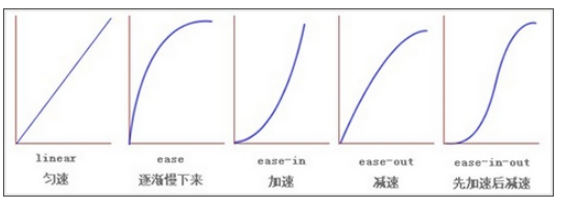

    4.  过渡开始出现的延迟时间  

       ```css
       transition: width 2s ease 1s;
       ```

   目前，css3只开发出部分的过渡属性，下图所示： 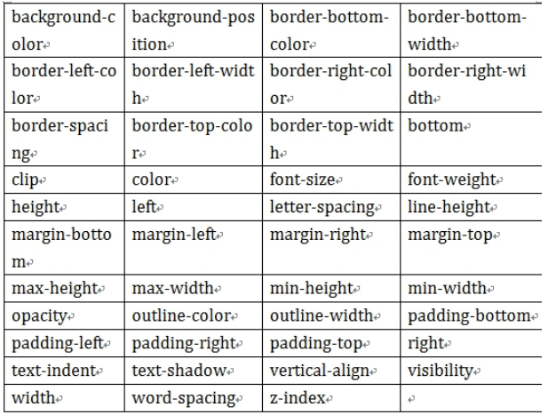

-  动画 从一个状态到另一个状态，过程中每个时间点都可以控制。 
  - 关键帧：@keyframes 动画帧 { from{} to{} } 或者{ 0%{} 20%{}... } 
  - 动画属性：animation{ 1 , 2 , 3 , 4 , 5 } 
    1. 动画帧 
    2. 执行时间
    3. 过渡函数
    4. 动画执行的延迟（可省略）
    5. 动画执行的次数  

##### 需求1  一个 元素从左向右移动，3秒内执行2次 

```html
<style>
  div {
    width: 700px;
    border: 1px solid red;
  }

  @keyframes x {
    from {
      margin-left: 0px;
    }

    to {
      margin-left: 550px;
    }
  }

  img {
    animation: x 3s linear 2;
  }
</style>
<body>
  <div>
    
  </div>
</body>
```

#####  需求2：一个 元素从左向右移动，3秒内执行完成。无限次交替执行 

#####  infinite：无限次 

#####  alternate：来回执行（交替，一去一回） 

```html
<style>
  .wai {
    width: 600px;
    height: 100px;
    border: 2px solid red;
  }

  .nei {
    width: 40px;
    height: 80px;
    margin: 5px;
    background: red;
  }

  .nei {
    animation: x 3s linear infinite alternate;
  }

  @keyframes x {
    0% {
      margin-left: 0px;
    }

    25% {
      background: yellowgreen;
    }

    50% {
      background: goldenrod;
    }

    75% {
      background: palevioletred;
    }

    100% {
      background: coral;
      margin-left: 550px;
    }
  }
</style>

<body>
  <div class="wai">
    <div class="nei"></div>
  </div>
</body>
```

