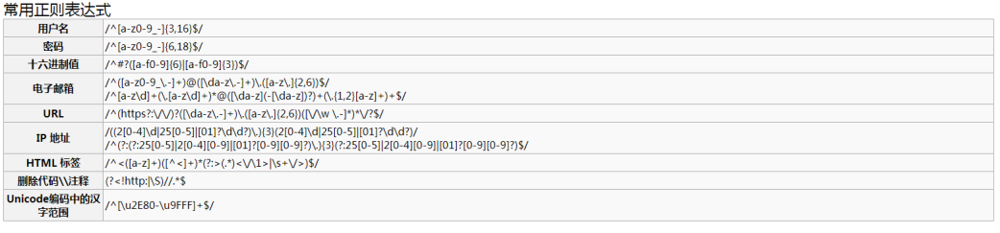

# 大数据学习-Java Day29

##  JavaScript 详解  

### 1  JavaScript介绍 

-  虽然是java作为前缀，但java和javascript的关系，就像老婆和老婆饼之间的关系，没有一毛钱关 系！ 
- 网景公司在Netscape2.0首先推出了JavaScript
-  JavaScript 的正式名称是 “ECMAScript”，此标准由 ECMA 组织发展和维护，简称“js” 
- JavaScript 是一种网页编程技术，用来向 HTML 页面添加交互行为 
- JavaScript 是一种基于对象和事件驱动的解释性脚本语言，直接嵌入 HTML 页面，由浏览器解释 执行代码，不进行预编译。 

#### js的特点

-  可以使用任何文本编辑工具编写，只需要浏览器就可以执行程序 
- 解释执行：事先不编译，逐行执行 
- 基于对象：内置大量现成对象 
-  适宜： 
  - 客户端数据计算 
  - 客户端表单合法性验证 
  - 浏览器事件的触发
  -  网页特殊显示效果制作 

#### js的组成

-  ECMAScript：定义核心语法，关键字，运算符，数据类型等系列标准 
- DOM：文档对象模型，将一个html页面的所有节点看成是一个一个的对象。更有层次感的管理每 一个节点。 
- BOM：浏览器对象模型，是对浏览器窗口进行访问和操作。使用 BOM，开发者可以移动窗口、改 变状态栏中的文本以及执行其他与页面内容不直接相关的动作。使 BOM 独树一帜且又常常令人怀 疑的地方在于，它只是 JavaScript 的一个部分，没有任何相关的准。 
  - 弹出新的浏览器窗口 
  -  移动、关闭浏览器窗口以及调整窗口大小 
  - 提供 Web 浏览器详细信息的定位对象 
  - 提供用户屏幕分辨率详细信息的屏幕对象 
  - 对 cookie 的支持 
  - IE 扩展了 BOM，加入了 ActiveXObject 类，可以通过 JavaScript 实例化 ActiveX对象，进而 实现ajax局部刷新技术  

### 2  HTML与javaScript结合方式 

使用js的三种方式

#### 行内脚本

-  点击按钮（触发）

- 弹框（具体的操作） 

  ```html
  <button onclick="alert('弹框测试')">点我一下</button>
  ```

#### 内部脚本

- 使用```<script></script>```

- 标准是写在head和body之间（脖子位置），但其实只要写在html文件内部就可以，无论什么位置 ```<html```>外，```<p></p>```内部，都可以。

  ```html
  <body>
      <script>
          alert("弹框");
      </script>
  </body>
  
  ```

#### 外部脚本

-  在项目根目录下创建一个目录js 

- 在js目录中创建一个文件，后缀名是.js

- 在html页面中，使用 

  ```html
  <script src="js/xx.js"></script>
  ```

 **以上使用脚本的三种方式的优先级，谁在上，谁先执行。因为是解释性语言。** 

### 3  JavaScript的使用 

#### 变量

- 数据类型
  -  是弱类型语言，所以，在定义变量的时候，所有的数据类型都是var 

  - 声明变量： var x ; var x,y;  

  -  数值类型：number 

    - 不区分整型数值和浮点型数值 
    - 所有数字都采用 64 位浮点格式存储，类似于double 格式 

  - 字符串：

    - string 首尾由单引号或双引号括起 

      ```js
      var aa="欢迎来到\"JavaScript世界";
      ```

  -  布尔类型： 

    - 仅有两个值：true和false也代表1和0 
    - 实际运算中true=1,false=0 

- 自动类型转换

  ```js
  数字 + 字符串：数字转换为字符串 		10+’a’ -> 10a
  数字 + 布尔值：true转换为1，false转换为0 		true+5->6
  字符串 + 布尔值：布尔值转换为字符串true或false 		true+’a’->truea
  布尔值 + 布尔值：布尔值转换为数值1或0 		true+true->2
  ```

-  数据类型转换函数 
  -  parseInt：强制转换成整数 
    - 如果不能转换，则返回 NaN （NaN 属性是代表非数字值的特殊值。该属性用于指示某个值 不是数字） 
    - 例如：parseInt("6.32")=6 
  -  parseFloat：强制转换成浮点数 
    - 如果不能转换，则返回 NaN 
    - 例如：parseFloat("6.32")=6.32 
  - typeof：查询数值当前类型，返回 string / number / boolean / object 
    - 例如：typeof("test"+3)=="string"  

-  null 与 undefined 
  - null 在程序中代表“无值”或者“无对象” 
    - 可以通过给一个变量赋值 null 来清除变量的内容 
  - undefined 
    - 声明了变量但从未赋值或者对象属性不存在 
-  算术运算 
  - 加(＋)、 减(－)、 乘( * ) 、除( / ) 、余数( % ) 
    - 可以表示减号，也可以表示负号，如：x = -y 
    - +可以表示加法，也可以用于字符串的连接 
  - 递增( ++ ) 、递减( -- ) 
    - i++ 相当于 i=i+1 
    - i-- 相当于 i=i-1 

- 关系运算

  - 严格相等：===，严格相等非运算！===

    - 类型相同
    - 数值相同

  - 相等：==，相等非运算！=

    - 数值相同

    ```js
    var a = "10";
    var b = 10;
    if (a == b)
        alert("equal");
    if (a === b)
        alert("same");
    
    ```

- 逻辑运算

  -  逻辑非（!）、逻辑与（&&）、逻辑或（||） 
  - 逻辑运算的操作数均为 boolean 表达式 

- 控制语句

  ```js
  if (表达式1) {
  	// 语句1;
  }else if (表达式2){
      // 语句2;
  }else if (表达式3){
  	// 语句3;
  } else{
  	// 语句4;
  }
  ```

  ```js
  switch (表达式) {
      case 值1:
      	// 语句1;
      	break;
      case 值2:
      	// 语句2;
      	break;
      default:
      	// 语句4;
  }
  
  ```

  ```js
  for (var i=1 ; i<=5 ; i++){
  	alert(i);
  }
  
  ```

  ```js
  while (条件){
      // 语句1;
      ...
  }
  
  ```

#### 常用字符串API

-  length:获取字符串的长度（字符串中字符的个数） 属性，没有小括号  

  ```js
  var str = "hello";
  console.log( str.length );
  ```

-  toUpperCase/toLowerCase :转大小写  

  ```js
  var name = "AngierSun";
  console.log( "大写："+name.toUpperCase() );
  console.log( "小写："+name.toLowerCase() );
  
  ```

-  charAt(下标) ： 返回某个下标上的字符  

  ```js
  var str1 = "javascript网页教程";
  var str2 = str1.charAt(12); // 下标12上的字符
  console.log(str2); //教
  
  var str3 = str1.charCodeAt(12);
  console.log(str3); //25945:（汉字“教”在unicode编码中的编号）
  ```

-  indexof(字符)：查找字符串中字符出现的首次下标  

-  lastIndexof(字符)：查找字符串中字符最后一次出现的下标  

  ```js
  var str1 = "javascript网页教程";
  var str2 = str1.indexOf("a");
  console.log(str2); // 1 , a字符在str1中第一次出现的下标
  
  var str3 = str1.lastIndexOf("a"); //3,a字符在str1中最后一次出现的下标
  console.log(str3);
  
  ```

-  substring(开始,结束)：截取字符串中一部分（结束是不包含的）  

  ```js
  var str1 = "abcdefgh";
  var str2 = str1.substring(2,4);
  console.log(str2); //cd，从2开始（包含），4结束（不包含）
  
  ```

-  replace(旧的,新的)：将字符串中的旧字符替换成新字符  

  ```js
  var str1 = "abcde";
  var str2 = str1.replace("cd","XXX");
  console.log(str2); // abXXXe，将str1中的cd替换成XXXs
  ```

-  split(分割的节点)：一个字符串切割成N个小字符串，所以返回的是数组类型  

  ```js
  var str1 = "一,二,三,四,五";
  var arr = str1.split(","); // 将str1 以逗号进行分割，分割成N份，所以返回的结果一定是数组结构
  console.log( "共分割成："+arr.length+"份" );
  console.log( "第三份是：" + arr[2] ); // 三
  ```

#### 数组

- 创建数组

  ```js
  var arr1 = new Array();
  ```

- 初始化数组的三种方式

  ```js
  // 第一种
  var arr1 = new Array();
  arr1[0] = 110;
  arr1[1] = 119;
  arr1[2] = 120;
  
  // 第二种
  var arr1 = new Array(10,"a",true);
  
  // 第三种
  var arr1 = [10,"a",true];
  for (var i = 0; i < arr1.length; i++) {
      console.log(arr1[i]);
  }
  ```

- 数组的常用方法

  -  tostring()：将数组转换成字符串  

    ```js
    var arr = [1,2,3,4];
    console.log("类型为：" + typeof( arr ) );
    
    var str = arr.toString(); // 将数组转换成字符串
    console.log( str +",类型为：" + typeof( str ) );
    
    ```

  -  join(连接符号)：将数组中的每个元素用连接符号连接成一个新的字符串。  

    ```js
    var arr = [1,2,3,4];
    var str = arr.join("-"); // 将数组中每个元素用-进行连接，并形成一个全新的字符串
    console.log( str +",类型为：" + typeof( str ) );
    ```

  -  concat(新元素)：将原来的数组连接新元素，原数组不变。  

    ```js
    var arr = [1,2,3,4];
    var arrnew = arr.concat(5,6); // 在arr数组的后面添加新的元素，形成一个新数组，但是原数组是不变的
    console.log( arrnew +",类型为：" + typeof( arrnew ) );
    console.log("原数组：" + arr);
    
    ```

  -  slice(开始，结束)：在数组中提取一部分，形成新的数组。 

    - 1,2,3,4,5 slice(2,4) 结果：3,4 

    ```js
    var arr = ['a','b','c','d','e','f','g','h'];
    var arrnew = arr.slice( 2,4 ); // 在arr数组中截取，从2开始（包含），4结束（不包含）
    console.log( arrnew ); // cd
    ```

  -  reverse()：数组的反转（倒序）  

    ```js
    var arr = [31,12,111,444];
    console.log( arr.toString() );
    arr.reverse(); // 将数组中的元素倒置
    console.log( arr.toString() );
    
    ```

  -  sort()：数组排序 

    - arr.sort() 字符排序 

      ```js
      var arr = [31,12,111,444];
      arr.sort(); // 字符排序（不会按照字面量的大小）
      console.log( arr );
      ```

    -  arr.sort(func) 数值排序 

      ```js
      var arr = [31,12,111,444];
      arr.sort( laosun ); // 数字排序（会按照字面量的大小）
      console.log( arr );
      
      // 定义排序函数
      function laosun(a,b){
          return a-b;
      }
      
      ```

#### Math数学对象

-  Math 对象用于执行数学任务 
- 没有构造函数 Math() 
- 无需创建，直接把 Math 作为对象使用就可以调用其所有属性和方法 


```js
// 返回0-9之间任意一个随机数字
var i = Math.random() * 10;
var j = Math.floor(i);
console.log(j);
```

####  Number对象 

 Number.fixed(2); 自带四舍五入技能  

```js
var n = new Number( 12.345 );
var n1 = n.toFixed(2); // 12.35，固定两位小数，第三位小数四舍五入
console.log( n1 );

var x = new Number( 12.3 );
var n2 = x.toFixed(2); // 12.30，固定两位小数，位数不够，0来补齐
console.log( n2 );

```

#### 正则表达式  

 对字符串执行模式匹配的强大工具 

```js
var reg1 = /^\d{3,6}$/; // 匹配纯数字3-6个
var reg2 = new RegExp(“^\\d{3,6}$");
```




```js
// 方式1
var age = "18"; // 判断：1-3位纯数字
var reg = /^\d{1,3}$/; // 以/^开始，中间写正则内容，以$/结束
var b = reg.test(age); // 验证age变量的是否符合reg的匹配
if (b == true) {
    console.log("验证通过！");
} else {
    console.log("格式错误");
}

// 方式2
var name = "abc123"; // 大小写字母和数字的组合（特殊字符不能出现）, 5~8位
var reg = new RegExp("^[a-zA-Z0-9]{5,8}$"); // 以^开始，中间写正则内容，以$结束
if (reg.test(name)) {
    console.log("验证通过！");
} else {
    console.log("格式错误");
}
```

####  日期对象 

```js
var time = new Date();
console.log( time ); // Tue Jul 14 2020 11:09:46 GMT+0800 (中国标准时间)

var year = time.getFullYear(); // 年份
var month = time.getMonth() + 1; //月份从0开始，11结束，所以国内习惯要+1
var day = time.getDate(); // 几号
var hour = time.getHours(); // 几点
var mm = time.getMinutes(); // 分钟
var s = time.getSeconds(); //秒
var ms = time.getMilliseconds(); // 毫秒， 1000毫秒 = 1秒

var timestr = year+"年"+month+"月"+day+"号 "+hour+"点"+mm+"分"+s+"秒"+ms+"毫秒";
console.log( timestr );

```

#### 函数

- 使用关键字function定义函数

  ```js
  function 函数名( 形参列表 ){
      // 函数体
      return 返回值;
  }
  
  ```
  - 函数声明后不会立即执行， 会在我们需要的时候调用到。 
  - **注意**： 
    - 形参：一定不要带数据类型 
    - 分号是用来分隔可执行JavaScript语句。 由于函数声明不是一个可执行语句，所以不以分号 结束 

- 无返回值

  ```js
  function qiuhe(a, b) {
      var he = a + b;
      console.log("两数之和：" + he);
  }
  qiuhe(3,4);
  ```

- 有返回值

  ```js
  function qiuhe(a, b) {
      var he = a + b;
      return "两数之和：" + he;
  }
  var s = qiuhe(3,4);
  console.log( s );
  ```

-  在函数内部，调用参数列表的属性 

  ```js
  function func(a,b,c){
      console.log( arguments.length ); // 获得参数的个数
      console.log( arguments[1] ); // 获得下标为1的参数
  }
  
  ```

- - 函数同样可以通过内置的 JavaScript 函数构造器（Function()）定义 

  ```js
  var myFunction = new Function("a", "b", "return a * b");
  var x = myFunction(4, 3);
  console.log(x);
  ```

   **注： 上述函数以分号结尾，因为它是一个执行语句。**  

- 匿名函数

  -  没有名称的函数 

  ```js
  var fn = function(a, b) {// 没有名字的函数，应该用一个变量来接收
      return a * 10 + b;
  };
  console.log( fn(3, 4) );
  ```

- 全局函数

  -  isNaN：检查其参数是否是非数字值 

    ```js
    console.log( isNaN( 123 ) ); // 数字，false
    console.log( isNaN( "hello" ) ); // 非数字，true
    console.log( isNaN( 4-1 ) ); // 数字，false
    console.log( isNaN( 123 ) ); // 数字，false
    console.log( isNaN( -10 ) ); // 数字，false
    console.log( isNaN( "123" ) ); // 数字，false
    console.log( isNaN( "1a23" ) ); // 非数字，true
    
    ```

  -  eval：用来转换字符串中的运算 

    ```js
    var str = "1+3";
    console.log( str ); // 1+3 , +会认定为一种字符符号而已，没有加法的作用
    console.log( eval( str ) ); // 让字符串中的运算符号生效
    ```

  -  encodeURI 与 decodeURI  

    ```js
    var name = "拉勾网";
    console.log( "转码前：" + name );
    name = encodeURI(name);
    console.log( "转码后：" + name );
    name = decodeURI(name);
    console.log( "解码后：" + name )
    ```

  - 闭包

    -  闭包的概念
      - 指有权访问另一个函数作用域中的变量的函数，一般情况就是在一个函数中包含另一 个函数。 
    - 闭包的作用
      - 访问函数内部变量、保持函数在环境中一直存在，不会被垃圾回收机制处理； 
    -  简单地说：就是在函数的局部范围内声明一个封闭的环境，此环境不会被垃圾回收探测到。保证了数据 的安全唯一性 
    - 想了解闭包，首先要了解什么是全局变量，什么是局部变量 

    ```js
    a = 10; // 全局变量，声明的时候可以不使用var
    function test1() {
        b = 20; // 不适用var声明的变量，就是全局变量
        var c = 30; // 用var声明，并且在函数的内部。这样的变量叫做局部变量，有效范围只能在其声明的函数内部
        console.log(c);
    }
    function test2() {
        console.log(c); //c is not defined (c变量没有定义)
    }
    test1();
    test2();
    ```

    -  需求：统计方法执行了多少次 

      ```js
      var count = 0; // 总次数
      function test1(){
          count++; // 自增+1
      }
      test1();
      test1();
      test1();
      console.log( count );
      ```

       谁都可以访问count，所以count变量并不安全，因为是全局变量。 如何才能安全呢？将count声明为局部变量 

      ```js
      function test1() {
          var count = 0; //局部变量
          return count++; //外部无法访问count，只能通过return才能将count变量返回，并输出
      }
      test1();
      test1();
      test1();
      console.log(test1()); // 每次调用方法，首先就是将变量还原为0
      
      ```

       结果一直是0，因为每次调用test1()，方法体的第一句代码就是还原，无论曾经的值是多少。 突发奇想，如果在test1()函数里面，再嵌套一个函数，js是支持函数嵌套的  

      ```js
      function test1() {
          var count = 0; //局部变量
          function jia() {
              return count++;
          }
          jia();
          return count;
      }
      test1();
      test1();
      test1();
      console.log(test1()); // 每次调用方法，首先就是将变量还原为0
      ```

       如果每次只调用test1()里面的jia()就好了。ok，闭包帮你解决此问题！  

      ```js
      function test1() {
          var count = 0; //局部变量
          function jia() {
              return count += 1;
          }
          return jia;
      }
      var fn = test1(); // fn => function jia(){return count+=1; }
      fn();
      fn();
      console.log(fn()); // 每次调用方法，首先就是将变量还原为0
      ```

    -  闭包是一种保护私有变量的机制，在函数执行时形成私有的作用域，保护里面的私有变量不 受外界干 扰。 

    - 直观的说就是形成一个不销毁的栈环境。 

      - 闭包的优点： 方便调用上下文中声明的局部变量 逻辑紧密，可以在一个函数中再创建个函数，避 免了传参的问题 
      - 闭包的缺点： 因为使用闭包，可以使函数在执行完后不被销毁，保留在内存中，如果大量使用闭 包就会造 成内存泄露，内存消耗很大 

#### 弹框输出

-  普通弹框 alert("hello，拉勾");  

-  控制台日志输出 console.log("谷歌浏览器按F12进入控制台");  

- 页面输出``` document.write("<h2>Hello World</h2>");```将```<h2>```元素输出到```<body>```中

-  确认框 confirm("确定删除吗？");  

  ```js
  var b = confirm("确定删除吗？");
  if(b){
      document.write( "<h1>删除成功！</h1>" );
  }else{
      document.write( "<h1>你取消了操作</h1>" );
  }
  ```

-  输入框 prompt("请输入姓名：");  

  ```js
  var name = prompt("请输入你的名字：");
  document.write( "<h1>大名："+name+"！</h1>" );
  ```

### 4 DOM操作

-  在一个html页面中，会使用很多标签来规划制作页面。 
-  每个标签都有它存在的意义，如果我们想要动态的修改某个标签的值。那我们就需要在页面中查找 到这个标签元素 
- 如何查找到这个元素是个难题，W3C组织的工程师们，突然看到了一棵大树。我要是想找到某一 片叶子，应该怎么做？
-  “顺藤摸瓜”，主树干有分支，每个分支还有许多小分支，只要把这个分支的结构整理清楚，任何一 片叶子都不是难事了 
- 叶子和大树的一些启发，工程师们开会讨论就定了这个理论“文档对象模型”， 
- 文档对象模型，就是将页面中所有的标签元素都看成是一个对象（一片叶子），主树干定义为根节 点（根元素），所有的标签都是从根元素延伸出去的，摸清结构，找到某个标签就不再困难了 
  - 在节点树中，顶端节点就是根节点（root） 
  - 每个节点都有父节点（除了根节点） 
  - 任何一个节点都可以拥有任意数量的子节点 
  - 同胞是拥有相同父节点的节点  

```html
<html>

<head>
    <meta charset="utf-8">
    <title>DOM 教程</title>
</head>

<body>
    <h1>第一节：HTML DOM</h1>
    <p>Hello world!</p>
</body>

</html>


<!--
从上面的 HTML 中：
<html> 节点没有父节点；它是根节点
<head> 和 <body> 的父节点是 <html> 节点
文本节点 "Hello world!" 的父节点是 <p> 节点
并且：
<html> 节点拥有两个子节点：<head> 和 <body>
<head> 节点拥有两个子节点：<meta> 与 <title> 节点
<title> 节点也拥有一个子节点：文本节点 "DOM 教程"<h1> 和 <p> 节点是同胞节点，同时也是
<body> 的子节点
并且：
<head> 元素是 <html> 元素的首个子节点
<body> 元素是 <html> 元素的最后一个子节点
<h1> 元素是 <body> 元素的首个子节点
<p> 元素是 <body> 元素的最后一个子节点
-->
```

 js为我们提供了很多种方法来实现在页面找查找某个元素节点 

####   DOM访问  

-  getElementById：通过id属性获得元素节点对象 

  - 案例：当帐号为空时，阻止表单提交 

    ```html
    <body>
        <form action="xxx" onsubmit="return login()">
            <p>帐号：<input id="username" /></p>
            <p>电话：<input id="phone" /></p>
            <p><button>登录</button></p>
        </form>
        <script>
            function login() {
                var name = document.getElementById("username").value;
                if (name == "") {
                    alert("帐号不能为空！");
                    return false; // 阻止表单的提交
                }
                return true; // 放行，让表单提交
            }
        </script>
    </body>
    ```

    

-  getElementsByName：通过name属性获得元素节点对象集 

  -  案例：购物车全选效果 

    ```html
    <body>
        <h2>我的购物车</h2>
        <table border="1" cellspacing="0">
            <tr>
                <td><input type="checkbox" onchange="quan(this)" /> 全选</td>
                <td>名称</td>
                <td>单价</td>
            </tr>
            <tr>
                <td><input type="checkbox" name="one" />1</td>
                <td>功能性饮料-尖叫</td>
                <td>4.0</td>
            </tr>
            <tr>
                <td><input type="checkbox" name="one" />2</td>
                <td>火腿肠</td>
                <td>2.0</td>
            </tr>
            <tr>
                <td><input type="checkbox" name="one" />3</td>
                <td>包子</td>
                <td>1.5</td>
            </tr>
        </table>
        <p>
            <button>提交订单</button>
        </p>
        <script>
            function quan(all) {
                var arr = document.getElementsByName("one");
                for (var i = 0; i < arr.length; i++) {
                    arr[i].checked = all.checked; // 将全选框的状态，赋值给每一个复选框
                }
            }
        </script>
    </body>
    ```

-  getElementsByTagName：通过标签名称获得元素节点对象集 

  -  案例：表格隔行变色 

    ```html
    
    <body>
        <table border="1" cellspacing="0">
            <tr>
                <td><input type="checkbox" onchange="quan(this)" /> 全选</td>
                <td>名称</td>
                <td>单价</td>
            </tr>
            <tr>
                <td><input type="checkbox" name="one" />1</td>
                <td>功能性饮料-尖叫</td>
                <td>4.0</td>
            </tr>
            <tr>
                <td><input type="checkbox" name="one" />2</td>
                <td>火腿肠</td>
                <td>2.0</td>
            </tr>
            <tr>
                <td><input type="checkbox" name="one" />3</td>
                <td>包子</td>
                <td>1.5</td>
        </table>
        <script>
            var rows = document.getElementsByTagName("tr"); //通过标签名获得元素对象集合
            for (var i = 0; i < rows.length; i++) {
                if (i % 2 == 1) { // 奇数
                    rows[i].style.backgroundColor = "pink";
                }
            }
        </script>
    </body>
    
    ```

####  DOM修改  

-  修改 HTML DOM 意味着许多不同的方面： 

  - 改变 HTML 内容
  -  改变 CSS 样式 
  - 改变 HTML 属性 
  - 创建新的 HTML 元素 
  - 删除已有的 HTML 元素 
  - 改变事件（处理程序） 

  ```html
  <body>
      <!-- 改变一个 <h2> 元素的 HTML 内容 : -->
  
      <button onclick="test()">点我试试</button>
      <script>
          function test() {
              document.getElementById("hello").innerHTML = "走哇，喝点去~！";
          }
      </script>
      <h2 id="hello">你好！</h2>
  </body>
  ```

  ```html
  <body>
      <!-- 改变一个<h2>的 HTML 样式 -->
      <button onclick="chou()">你瞅啥</button>
      <script>
          function chou() {
              document.getElementById("hello").style.color = "red";
              document.getElementById("hello").style.fontFamily = "华文彩云";
          }
      </script>
      <h2 id="hello">你好！</h2>
  </body>
  ```

- 添加节点

  -  点击按钮，在页面中创建一张图片 

    ```html
    <body>
        <button onclick="add()">添加</button>
        <div></div>
        <script>
            function add() {
                var img = document.createElement("img"); // 
                img.setAttribute("src", "../lagou-html/img/cat.gif"); // 
                    img.setAttribute("title", "小猫咪"); // 
                img.setAttribute("id", "cat"); // 
                var divs = document.getElementsByTagName("div");
                divs[0].appendChild(img);
            }
        </script>
    </body>
    
    ```

- 删除节点

  -  点击按钮，把上面刚创建的图片从页面上删除 

    ```html
    <body>
        <button onclick="add()">添加</button>
        <button onclick="del()">删除</button>
        <div></div>
        <script>
            function add() {
                var img = document.createElement("img"); // 
                img.setAttribute("src", "../lagou-html/img/cat.gif"); // 
                    img.setAttribute("title", "小猫咪"); // 
                img.setAttribute("id", "cat"); // 
                var divs = document.getElementsByTagName("div");
                divs[0].appendChild(img);
            }
            function del() {
                var img = document.getElementById("cat");
                img.parentNode.removeChild(img); // 必须通过父节点，才能删除子节点
            }
        </script>
    </body>
    ```

- 替换节点

  -  点击按钮，把上面刚创建的图片替换成另一张 

    ```html
    
    <body>
        <button onclick="add()">添加</button>
        <button onclick="del()">删除</button>
        <button onclick="rep()">替换</button>
        <div>
        </div>
        <script>
            function add() {
                var img = document.createElement("img"); // 
                img.setAttribute("src", "../lagou-html/img/cat.gif"); // 
                    img.setAttribute("title", "小猫咪"); // 
                img.setAttribute("id", "cat"); // 
                var divs = document.getElementsByTagName("div");
                divs[0].appendChild(img);
            }
            function del() {
                var img = document.getElementById("cat");
                img.parentNode.removeChild(img); // 必须通过父节点，才能删除子节点
            }
            function rep() {
                var imgold = document.getElementById("cat");
                // 通过修改元素的属性，做的替换
                // img.setAttribute("src","../lagou-html/img/2.jpg");
                var imgnew = document.createElement("img");
                imgnew.setAttribute("src", "../lagou-html/img/1.jpg");
                imgold.parentNode.replaceChild(imgnew, imgold);
            }
        </script>
    </body>
    
    ```

#### 事件

-  js捕获某个动作而做出的反馈 
  - HTML 事件的例子： 
    - 当用户点击鼠标时 
    - 当网页已加载时 
    - 当图片已加载时 
    - 当鼠标移动到元素上时 
    - 当输入字段被改变时 
    - 当 HTML 表单被提交时 
    - 当用户触发按键时 

-  窗口事件 (Window Events) 

  -  仅在 body 和 frameset 元素中有效。  

    -  onload 当文档被载入时执行脚本  

      ```html
      <body onload="test()">
          <script>
              function test() {
                  document.write("哈哈哈哈");
              }
          </script>
      </body>
      ```

-  表单元素事件 (Form Element Events) 

  -  仅在表单元素中有效。 

    - onblur 当元素失去焦点时执行脚本 
    - onfocus 当元素获得焦点时执行脚本 

    ```html
    <body>
        <script>
            function a() {
                console.log("获得焦点==被激活");
            }
            function b() {
                console.log("失去焦点");
            }
        </script>
        <form action="">
            <p>帐号：<input onfocus="a()" onblur="b()" /></p>
            <p>密码：<input /></p>
        </form>
    </body>
    ```

-  鼠标事件 (Mouse Events) 

  -  onclick 当鼠标被单击时执行脚本 

  - ondblclick 当鼠标被双击时执行脚本 

  - onmouseout 当鼠标指针移出某元素时执行脚本 

  - onmouseover 当鼠标指针悬停于某元素之上时执行脚本 

    ```html
    
    <style>
        img {
            width: 30%;
            border: 5px solid white;
        }
    </style>
    
    <body>
        
        
        
        <script>
            function dan() {
                alert("点了一下");
            }
            function shuang() {
                alert("连续快读点两下");
            }
            function shang(img) {
                img.style.border = "5px solid red";
            }
            function xia(img) {
                img.style.border = "5px solid white";
            }
        </script>
    </body>
    ```

-  键盘事件 

  - onkeydown 按下去 

  - onkeyup 弹上来 

    ```html
    <body>
    
        <script>
            window.onkeydown = function () {
                // event：事件源（按键）
                // console.log( "按键编码："+event.keyCode );
                if (event.keyCode == "13") { // 回车键
                    alert("登录成功！");
                }
            }
            window.onkeyup = function () {
                console.log(event.keyCode); // 按住按键不松手是不会触发的。当松手时，按键回弹则
                触发
            }
        </script>
    </body>
    ```

-  事件冒泡 

  -  创建两个div，一个大一些，一个小一些 

    ```html
    <style>
        #father {
            width: 200px;
            height: 200px;
            background: black;
            padding: 10px;
        }
    
        #child {
            width: 100px;
            height: 100px;
            background: greenyellow;
        }
    </style>
    
    <body>
        <div id="father">
            <div id="child"></div>
        </div>
        <script>
            // 代码不重要，重要是知道这个事件发生，是正常现象
            document.getElementById("father").addEventListener("click", function () {
                alert("父级元素的事件被触发：" + this.id);
            });
            document.getElementById("child").addEventListener("click", function (e) {
                e.stopPropagation() //取消事件的冒泡机制
                alert("子级元素的事件被触发：" + this.id);
            });
        </script>
    </body>
    ```

     先子，后父。事件的触发顺序*自内向外*，这就是事件冒泡；  

- 事件捕获

  -  还是刚才创建两个div，一个大一些，一个小一些 

    ```html
    <style>
        #father {
            width: 200px;
            height: 200px;
            background: black;
            padding: 10px;
        }
    
        #child {
            width: 100px;
            height: 100px;
            background: greenyellow;
        }
    </style>
    
    <body>
        <div id="father">
            <div id="child"></div>
        </div>
        <script>
            document.getElementById("father").addEventListener("click", function () {
                alert("父级：" + this.id);
            }, true);
            document.getElementById("child").addEventListener("click", function () {
                alert("子级：" + this.id);
            }, true);
        </script>
    
    </body>
    ```

     先父,后子。事件触发顺序变更为*自外向内*，这就是事件捕获；  

#### 面向对象

-  使用Object创建通用对象 

  ```html
  <script>
      var user = new Object();
      user.name = "吕布";
      user.age = 21;
      user.say = function () {
          console.log("大家好，我叫：" + this.name + "，我今年" + this.age + "岁了！");
      }
      user.say();
      var dog = new Object();
      dog.nickname = "屎尿多";
      dog.wang = function () {
          console.log("我饿了，我要拆家了！");
      }
      dog.wang();
  </script>
  ```

- 使用构造函数

  ```html
  <script>
      function userinfo(name, age) {
          this.name = name;
          this.age = age;
          this.say = function () {
              console.log("大家好，我叫：" + this.name + "，我今年" + this.age + "岁了！");
          }
      }
      var user = new userinfo("詹姆斯", 35);
      user.say();
  </script>
  
  ```

-  使用直接量 

  ```js
  <script>
      var user = {
          username: "孙悟空",
          age: 527,
          say: function () {
              console.log("大家好，F我叫：" + this.username + "，我今年" + this.age + "岁了！");
          }
      };
      user.say();
  
  </script>
  ```

#### JSON

- 在互联网上来回传递数据，如果没有一个统一的格式，解析起来的难度很大（每个人的编码喜 好不一样） 

- JSON(JavaScript Object Notation) 是一种轻量级的数据交换格式。 

- 易于人阅读和编写，同时也易于机器解析和生成 { 属性1：值1， 属性2：值2， 。。。。 } 

  ```html
     <script>
          var json1 = { username: "吕布", age: 31 };
          console.log("姓名：" + json1.username + "，年龄：" + json1.age + "岁");
          // json数组
          var josnarr = [{ name: "貂蝉", age: 18 }, { name: "小乔", age: 17 }];
          console.log("貂蝉" + josnarr[0].age + "岁了");
          console.log("小乔" + josnarr[1].age + "岁了");
          // 复杂的json对象
          var long = {
              name: "赵云",
              sex: "男",
              hobby: ["玉兰白龙驹", "龙胆亮银枪", "青釭剑"]
          };
          console.log(long.name + "的主攻武器：" + long.hobby[1]);
      </script>
  ```

### 5 BOM操作

 就是javascript对浏览器的一些常规操作的方法 

#### window对象


```html
<body>
    <button onclick="kai()">极速入职</button>
    <script>
        function kai() {
            window.open("http://lagou.com", "拉勾网",
                "width=500,height=300,left=400");
            // window.open("http://lagou.com" , "拉勾网" , "fullscreen=yes"); // IE才
            生效
        }
    </script>
</body>
```

-  screen屏幕对象 

  -  我想知道我的电脑屏幕多大？实际上，得到的就是分辨率 

    ```html
    <body>
        <button onclick="kai()">求大小</button>
    </body>
    <script>
        function kai() {
            alert(window.screen.width + "|" + window.screen.height);
        }
    </script>
    ```

-  location定位 

  -  包含有关当前 URL 的信息，通常用来做页面跳转  

    ```html
    
    <body>
        <button onclick="test()">测试</button>
        <script>
            function test() {
                console.log("当前页面的URL路径地址：" + location.href);
                location.reload(); // 重新加载当前页面（刷新）
                location.href = "http://lagou.com"; // 跳转页面
            }
        </script>
    </body>
    ```

-  history浏览器历史 

  -  history对象会记录浏览器的痕迹 

    -  a.html  

      ```html
      <a href="b.html">去b页面</a>
      
      ```

    -  b.html  

      ```html
      <body>
          <button onclick="hui()">返回</button>
          <script>
              function hui() {
                  //history.go(-1); //上一级页面
                  history.back(); // 与go(-1)是等价的
              }
          </script>
      
      </body>
      ```

-  navigator 导航 

  -  window.navigator 对象包含有关访问者浏览器的信息;  

    ```html
    <script>
        var str = "";
        str += "<p>浏览器的代号："+ navigator.appCodeName +"</p>";
        str += "<p>浏览器的名称："+ navigator.appName+"</p>";
        str += "<p>浏览器的版本："+ navigator.appVersion+"</p>";
        str += "<p>硬件平台："+ navigator.platform+"</p>";
        str += "<p>用户代理："+ navigator.userAgent +"</p>";
        str += "<p>启用Cookies："+navigator.cookieEnabled+"</p>";
        document.write(str);
    </script>
    ```

-  存储对象 

  - 用起来和我们在java中map很相似，都是键值对的方式存数据 

  -  本地存储  localStorage 

    - 在关闭窗口或标签页之后将会删除这些数据 

      - 保存数据

        ```js
        localStorage.setItem("name","curry");
        
        ```

      -  提取数据

        ```js
        localStorage.getItem("name");
        
        ```

         

      - 删除数据

        ```js
        localStorage.removeItem("name");
        
        ```

    - 多样化操作

      ```js
      // 三种方式保存数据
      localStorage["a"] = 1;
      localStorage.b = 2;
      localStorage.setItem("c",3);
      
      // 查看数据类型
      console.log( typeof localStorage["a"] )
      console.log( typeof localStorage["b"] )
      console.log( typeof localStorage["c"] )
      
      // 第一种方式读取
      var a = localStorage.a;
      console.log(a);
      
      // 第二种方式读取
      var b = localStorage["b"];
      console.log(b);
      
      // 第三种方式读取
      var c = localStorage.getItem("c");
      console.log(c);
      
      ```

  -  会话存储 sessionStorage 

    -  会话，就是保持浏览器别关闭。 

    - 关闭浏览就等于结束了一次会话。 

    - 开启浏览器就意味着创建了一次会话 

      - 保存数据

        ```js
        sessionStorage.setItem("name", "klay");
        
        ```

      - 提取数据

        ```js
        var lastname = sessionStorage.getItem("name");
        
        ```

      - 删除指定键数据

        ```js
        sessionStorage.removeItem("name");
        ```

      - 删除所有数据

        ```js
        sessionStorage.clear();
        ```

    -  案例：记录点击了几下按钮 

      ```html
      <body>
          <button onclick="dian()">点我</button>
          <h3 id="result"></h3>
          <script>
              function dian() {
                  if (sessionStorage.getItem("clickCount")) {
                      sessionStorage.setItem("clickCount",
                          Number(sessionStorage.getItem("clickCount")) + 1);
                  } else {
                      sessionStorage.setItem("clickCount", 1);
                  }
                  document.getElementById("result").innerHTML = "已经点击了" +
                      sessionStorage.getItem("clickCount") + "次！"
              }
          </script>
      </body>
      ```

#### 计时操作

-  周期性定时器 setInterval  

  -  setInterval(1,2)：周期性触发代码exp （常用） 

    - 执行语句 
    - 时间周期，单位为毫秒  

  -  案例：闪烁的字体 （1秒1变色）  

    ```html
    <body>
        <h1 id="title">拉勾网：极速入职</h1>
        <script>
            var colors = ["red", "blue", "yellow", "pink", "orange", "black"];
            var i = 0;
            function bian() {
                document.getElementById("title").style.color = colors[i++];
                if (i == colors.length) {
                    i = 0; // 颜色重新开始
                }
            }
            setInterval(bian, 100); // 每隔0.1秒，执行一次bian函数
        </script>
    </body>
    ```

  -  案例：在闪烁字体的基础上扩展，闪烁的电子时钟 

    ```html
    <body>
        <h1 id="title"></h1>
        <script>
            var colors = ["red", "blue", "yellow", "pink", "orange", "black"];
            var i = 0;
            function bian() {
                document.getElementById("title").style.color = colors[i++];
                if (i == colors.length) {
                    i = 0; // 颜色重新开始
                }
            }
            function time() {
                var d = new Date();
                var str = d.getFullYear() + "年" + (d.getMonth() + 1) + "月" + d.getDate() + "号" + d.getHours() + "点" + d.getMinutes() + "分" + d.getSeconds() + "秒";
                document.getElementById("title").innerHTML = str;
            }
            setInterval(bian, 100); // 每隔1秒，执行一次变色函数bian
            setInterval(time, 1000); // 每隔1秒，执行一次时间函数time
        </script>
    </body>
    
    ```

    

-  停止定时器 clearInterval  

  -  案例：模拟年会抽奖 

    ```html
    <body>
        
        <br />
        <button onclick="begin()">开始</button>
        <button onclick="stop()">停止</button>
        <script>
            var arr = ["1.jpg", "2.jpg", "3.jpg", "4.jpg", "5.jpg"];
            function begin() {
                timer = setInterval(bian, 100); // 没有使用var，所以timer是全局变量
            }
            function stop() {
                clearInterval(timer); // 停止定时器
            }
            function bian() {
                var i = Math.floor(Math.random() * arr.length); // 0-4
                document.getElementById("tu").src = "../lagou-html/img/" + arr[i];
            }
        </script>
    </body>
    
    ```

-  一次性定时器 setTimeout 

  -  相当于延迟的效果，只执行一次 

    ```html
    <body>
        <script>
            function bian() {
                document.body.style.backgroundColor = "red";
            }
            //3秒之后调用
            setTimeout(bian, 3000);
        </script>
    </body>
    ```

    

