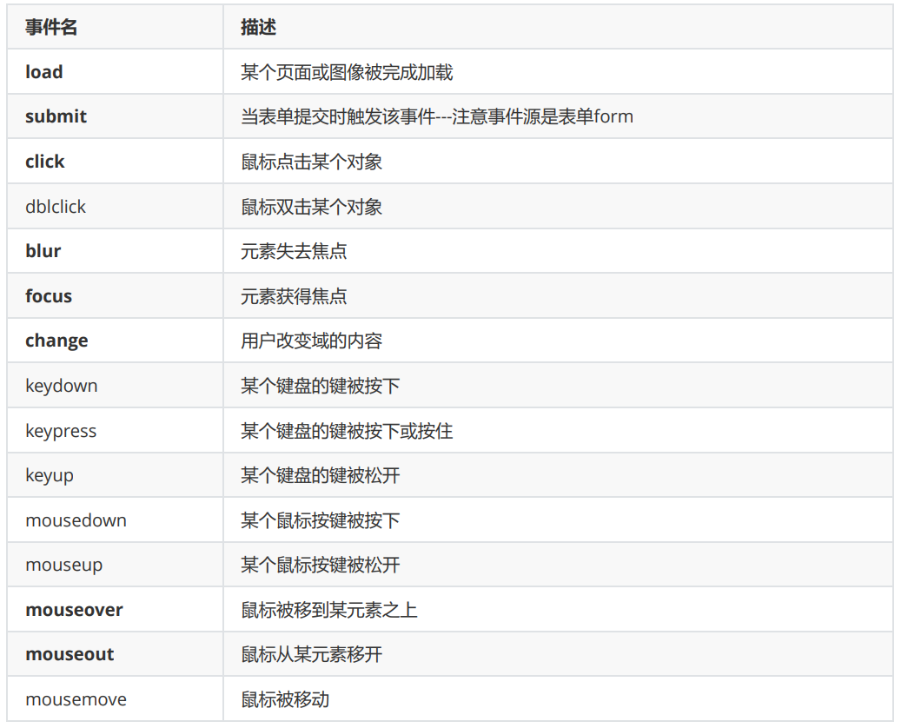

# 大数据学习-Java Day30

##  jQuery 

### 1 jQuery基本概念

#### 基本概念

 jQuery是一个javascript库，jQuery凭借着简洁的语法和跨平台的兼容性，极大的简化了js操作DOM、处理 事件、执行动画等操作。jQuery强调的理念是：'write less, do more'(写的少，做的多)。 

#### 基本特点

-   免费开源 
- 浏览器兼容性强 
- 轻量级 
- 链式编程 
- 插件扩展性强 (表单验证插件 日期插件 轮播图) 
- 写更少,做更多 

#### jQuery版本

 官网下载地址：[点击下载](https://jquery.com/download/)。jQuery的版本有很多，分为： 1.x 、 2.x 、 3.x 。 

- 版本分类

  | 版本    | 兼容范围                      |
  | ------- | ----------------------------- |
  | 1.x版本 | 能够兼容IE678浏览器           |
  | 2.x版本 | 不兼容IE678浏览器             |
  | 3.x版本 | 不兼容IE678浏览器，更加的简洁 |

   1.x和2.x版本jquery都不再更新版本了，现在只更新3.x版本。  

-  压缩版与未压缩版： 

  | 名称                  | 大小      | 说明                                         |
  | --------------------- | --------- | -------------------------------------------- |
  | jquery.js(开发版)     | 约280 KB  | 完整无压缩版本，主要用于测试、学习和开发     |
  | jquery.min.js(生产版) | 约87.3 KB | 经过压缩，主要用于产品和项目，基本无可阅读性 |

#### jQuery初体验

-  不需要安装jQuery, 我们通过引入jQuery类库 

  ```html
  <html lang="en">
  
  <head>
      <meta charset="UTF-8">
      <title>Title</title>
      <script src="../js/jquery-3.5.1.js"></script>
      <!--点击获取文本的value值-->
      <!--1.如果使用javaScritp-->
      <!-- <script>
          function getValue() {
              //获取input框 dom对象, 在获取value值
              var inputDom = document.getElementById("uid");
              alert(inputDom.value);
          }
      </script>-->
      <!--2.如果使用jQuery如何实现
          实现步骤:
          1)引入类库
          2)编写一个<script> 在里面定义函数
          3)获取input框的jQuery对象 -->
      <script>
          function getValue() {
              var $inputObj = $("#uid"); // 获取input框的jQuery对象类
              //获取value值
              var value = $inputObj.val(); // 获取的是input框中的value ; 类似与inputDom.value
              alert("jQuery获取:" + value)
          }
      </script>
  </head>
  
  <body>
      <input type="text" value="zhangsan2" id="uid" />
      <input type="button" value="点我" onclick="getValue()" />
  </body>
  
  </html>
  ```

####  jQuery对象 和 DOM对象 

##### DOM对象

-  DOM ( Document Object Model ，文档对象模型)，每一份 DOM 都可以表示成一棵树。

  ```js
  var domObj = document.getElementById('id'); 	// 获得DOM对象
  var objHTML = domObj.innerHTML; 				// 使用Javascript中的属性-innerHTML
  ```

  -    在 js 中，通过 getElementByTagName 或者 getElementById 来获取元素节点。像这样得到的 DOM 元素就 是 DOM 对象。而且 DOM 对象可以使用 js 中的方法，如： innerHTML。 

-  jQuery对象 

  -  jQuery 对象，是通过 jQuery 包装 DOM 对象后产生的对象， jQuery 对象是 jQuery 独有的，它可以使用 jQuery 里面的方法。  

    ```js
    // 获取id为test的元素内的html代码
    $('#test').html(); // .html()是jQ里面的方法
    
    //上面的代码等同于：
    document.getElementById('test').innerHTML;
    ```

- 注意事项

  -  在jQuery中，无法使用任何DOM对象的方法，例如：$('id').innerHTML，这是错误的写法。同样， 
  -  在js中也无法使用jQ对象里面的方法，例如：document.getElementById('id').html()，这样也是错误的。 

####  jQuery对象与DOM对象转换 

#####  jQ对象转成DOM对象：  

-  方法一(常用)： [index] 

  ```js
  var $test = $("#test"); // jQ获取到的对象
  var node = $test[0]; // 转成DOM对象
  node.innerHTML = "你好啊"; // 使用DOM对象的方法
  ```

-  方法二： get(index) 

  ```js
  var $test = $('#test'); // jQ获取到的对象
  var test = $test.get(0); // 转成DOM对象
  test.innerHTML = "我来了"; // 使用DOM对象的方法
  ```

#####  dom对象转成jQuery对象： 

-  用 $() 把 DOM 对象包裹起来就是一个 jQ 对象了  

  ```js
  var test = document.getElementById("test"); // 获取的DOM对象
  var $test = $(test); // 转成jQ对象
  ```

#####  jQuery与dom之间的转换练习 

```html
<!DOCTYPE html>
<html lang="en">

<head>
    <meta charset="UTF-8">
    <title>Title</title>
    <script src="../js/jquery-3.3.1.js"></script>
    <!--
        需求:
        1.获取dom对象,调用jQuery的方法, 看看行不行? 不行
        2.获取jQuery对象,调用dom对象的属性 , 看看行不行? 不行
        3.dom的对象如何转换成jQuery对象
        4.jQuery对象如何转换成dom对象
    -->
    <script>
        function fn() {
            //1.获取dom对象,调用jQuery的方法, 看看行不行? 不行
            //var domObj = document.getElementById("userid"); //获取到的是一个dom对象
            //var val = domObj.value;
            //alert(val);
            //var val = domObj.val(); //dom对象调用jQuery对象获取value属性的方法val()
            //alert(val); // domObj.val is not a function
            //2.获取jQuery对象,调用dom对象的属性 , 看看行不行? 不行
            //var $obj = $("#userid");
            //var val = $obj.val();
            //alert(val);
            //var val = $obj.value; //使用jQuery对象调用dom对象的value属性 , 看看行不行
            //alert(val); //undefined 未定义
            //3.dom的对象如何转换成jQuery对象
            //格式: $(dom对象) 就能转换成功
            //var domObj = document.getElementById("userid");
            //var $obj = $(domObj); //将dom对象转成jQuery对象
            //var val = $obj.val();
            //alert(val);
            // 4.jQuery对象如何转换成dom对象
            //格式1: jQuery对象[0]
            //格式2: jQuery对象.get(0)
            var $obj = $("#userid");
            //var domObj = $obj[0]; //方式一: jQuery转成dom
            var domObj = $obj.get(0); //方式二: jQuery转成dom
            var val = domObj.value;
            alert(val);
        }
    </script>
</head>

<body>
    <input type="text" value="李四" id="userid" />
    <input type="button" value="点我啊" onclick="fn()" />
</body>

</html>
```

### 2  jQuery的函数与事件 

####  页面加载 

-  Js页面加载方式1 

  ```js
  Window.onload = function(){
  }
  ```

-  Js页面加载方式2 

  ```js
  格式1:
  $(function(){
  
  })
  格式2:
  $(document).ready(function(){
  
  })
  ```

   结论: javaScript的页面加载只执行一次,最后一次加载的执行; jQuery的页面加载执行多次,每次都执行  

-  代码演示:

  ```html
  <!DOCTYPE html>
  <html lang="en">
  
  <head>
      <meta charset="UTF-8">
      <title>Title</title>
      <script src="../js/jquery-3.3.1.js"></script>
      <!--
          页面加载函数的特点:
          整合html页面全部加载完毕之后会自动执行的一个函数
      -->
      <script>
          /*
          * 1.javaScript中的页面加载函数及特点
          *
          * 需求1: 页面加载完毕之后获取 <input type="text" value="zhangsan1" id="uid1"/>
          value值
          *
          * 页面加载函数格式:
          * window.onload = function(){
          * 内容
          * }
          *
          * 需求2: 编写第二个页面加载函数 <input type="text" value="zhangsan2" id="uid2"/>
          *
          * javaScript页面加载只执行最后一个页面加载的函数..
          *
          */
          /* window.onload = function(){
          var val = document.getElementById("uid1").value;
          alert(val);
          }*/
          /* window.onload = function(){
          var val = document.getElementById("uid2").value;
          alert(val);
          }*/
          /*
          * 2.jQuery中的页面加载函数及特点
          *
          * 格式1:
          * $(function(){
          * 内容
          * })
          *
          * 格式2:
          * $(document).ready(function(){
          * 内容
          * })
          *
          * 特点: 可以写很多个页面加载函数,每一个都会依次执行.
          *
          */
          //需求1:格式1加载zhangsan2的值
          $(function () {
              var val = $("#uid2").val();
              alert(val);
          })
          //需求2:格式2加载zhangsan3的值
          $(document).ready(function () {
              var val = $("#uid3").val();
              alert(val);
          })
          $(function () {
              var val = $("#uid1").val();
              alert(val);
          })
      </script>
  </head>
  
  <body>
      <input type="text" value="zhangsan1" id="uid1" />
      <input type="text" value="zhangsan2" id="uid2" />
      <input type="text" value="zhangsan3" id="uid3" />
  </body>
  
  </html>
  ```

#### 事件绑定与事件派发 

#####  jQuery中常用事件 

 jQuery中的事件与javaScript中的事件用法一样,但是名称都去掉了on.  

#####  元素绑定事件 

```js
<input type="button" value="点我试试" id="btn1" onclick="fn()">
function fn(){
    alert("试试就试试!!");
}
```

#####  元素派发事件 

```html
<head>
    <script>
        $(function () {
            $("#btn2").click(function () {
                alert("jQuery想试试");
            })
        })
    </script>
</head>
<input type="button" value="点我试试" id="btn2">

```

#####  代码练习 

```html
<html lang="en">

<head>
    <meta charset="UTF-8">
    <title>Title</title>
    <script src="../js/jquery-3.3.1.js"></script>
    <script>
        //1.事件绑定的方式
        function fn() {
            alert("试试就试试");
        }
        //2.事件派发的方式
        //注意事项: 如果派发函数写在html之前,需要放到页面加载函数中; 如果派发函数写在html代码之
        后, 可以不用加页面加载函数.
            $(function () {
                $("#btn2").click(function () {
                    alert("我有来试试!!!");
                })
            })
    </script>
</head>

<body>
    <!--
		不用页面加载,直接写函数就行
	-->
    <input type="button" value="点我试试1" id="btn1" onclick="fn()">
    <!--
		如果写在上面,一定要页面加载
	-->
    <input type="button" value="点我试试2" id="btn2">
</body>

</html>
```

### 3  jQuery选择器 

####  基本选择器 

- 语法

| 选择器名称               | 语法                | 解释                              |
| ------------------------ | ------------------- | --------------------------------- |
| 标签选择器（元素选择器） | $("html标签名")     | 获得所有匹配标签名称的于元素      |
| id选择器                 | $("#id的属性值")    | 获得与指定id属性值匹配的元素      |
| 类选择器                 | $(".class的属性值") | 获得与指定的class属性值匹配的元素 |

- 实例 ： 使用基本选择器给页面元素设置颜色 

```html
<html xmlns="http://www.w3.org/1999/xhtml">

<head>
    <meta http-equiv="Content-Type" content="text/html; charset=utf-8" />
    <script src="../js/jquery-3.3.1.js"></script>
    <style>
        div {
            border: 1px solid black;
        }

        p {
            border: 1px solid gray;
            width: 250px;
        }

        #box1,
        #box2 {
            width: 400px;
            height: 250;
        }

        div {
            width: 300px;
            height: 120px;
        }
    </style>
    <title>无标题文档</title>
</head>

<body>
    <!-- html 部分 -->
    <div id="box1">
        id为box1的div
        <p>我是box1的子代 P标签</p>
        <p>我是box1的子代 P标签</p>
        <div class="dd">
            box1 子代div
            <p>我是box1的后代 孙子P标签</p>
            <p>我是box1的后代 孙子P标签</p>
        </div>
    </div>
    <br />
    <div id="box2">
        id为box2的div
        <p>我是box2的子代P标签</p>
        <p>我是box2的子代P标签</p>
        <div class="dd">
            box2 子代div
            <p>我是box2的后代 孙子P标签</p>
            <p>我是box2的后代 孙子P标签</p>
        </div>
    </div>
    <br />
    <input type="button" value="选取id为box1的div,背景色设置为 yellow" id="btn1" />
    <input type="button" value="class 为dd的元素,设置背景色为 lightblue" id="btn2" />
    <input type="button" value="选择所有p标签,设置背景颜色为orange" id="btn3" />
</body>
<script>
    //1.选取id为box1的div,背景色设置为 yellow
    //2.class 为dd的元素,设置背景色为 lightblue
    //3.选择所有p标签,设置背景颜色为orange
</script>

</html>
```

####  层级选择器 

- 语法 

| 选择器名称 | 语法     | 解释                       |
| ---------- | -------- | -------------------------- |
| 后代选择器 | $("A B") | 选择A元素内部的所有B元素   |
| 子选择器   | $("A>B") | 选择A元素内部的所有B子元素 |

- 代码

```html
<html xmlns="http://www.w3.org/1999/xhtml">

<head>
    <meta http-equiv="Content-Type" content="text/html; charset=utf-8" />
    <script src="../js/jquery-3.3.1.js"></script>
    <style>
        div {
            border: 1px solid black;
        }

        p {
            border: 1px solid gray;
            width: 250px;
        }

        #box1,
        #box2 {
            width: 400px;
            height: 250;
        }

        div {
            width: 300px;
            height: 120px;
        }
    </style>
    <title>无标题文档</title>
</head>

<body>
    <!-- html 部分 -->
    <div id="box1">
        id为box1的div
        <p>我是box1的子代 P标签</p>
        <p>我是box1的子代 P标签</p>
        <div class="dd">
            box1 子代div
            <p>我是box1的后代 孙子P标签</p>
            <p>我是box1的后代 孙子P标签</p>
        </div>
    </div>
    <br />
    <p>我是body内的P标签 1</p>
    <br />
    <div id="box2">
        id为box2的div
        <p>我是box2的子代P标签</p>
        <p>我是box2的子代P标签</p>
        <div class="dd">
            box2 子代div
            <p>我是box2的后代 孙子P标签</p>
            <p>我是box2的后代 孙子P标签</p>
        </div>
    </div>
    <p>我是body内的P标签 2</p>
    <br />
    <input type="button" value="选择 body内的所有p元素." id="btn1" />
    <input type="button" value="在body内,选择子元素是div的。" id="btn2" />
</body>
<script>
</script>

</html>
```

####  属性选择器 

- 语法

| 选择器名称 | 语法              | 解释                           |
| ---------- | ----------------- | ------------------------------ |
| 属性选择器 | $("A[属性名]")    | 包含指定属性的选择器           |
| 属性选择器 | $("A[属性名=值]") | 包含指定属性等于指定值的选择器 |

- 代码

```html
<html xmlns="http://www.w3.org/1999/xhtml">

<head>
    <meta http-equiv="Content-Type" content="text/html; charset=utf-8" />
    <script src="js/jquery-3.5.1.js"></script>
    <style>
        div {
            border: 1px solid black;
        }

        p {
            border: 1px solid gray;
            width: 250px;
        }

        #box1,
        #box2 {
            width: 400px;
            height: 250;
        }

        div {
            width: 300px;
            height: 120px;
        }
    </style>
    <script>
    </script>
    <title>无标题文档</title>
</head>

<body>
    <!-- html 部分 -->
    <div id="box1">
        id为box1的div
        <p>我是box1的子代 P标签</p>
        <p>我是box1的子代 P标签</p>
        <div class="dd" title="edu">
            box1 子代div
            <p>我是box1的后代 孙子P标签</p>
            <p>我是box1的后代 孙子P标签</p>
        </div>
    </div>
    <br />
    <p>我是body内的P标签 1</p>
    <br />
    <div id="box2">
        id为box2的div
        <p>我是box2的子代P标签</p>
        <p>我是box2的子代P标签</p>
        <div class="dd" title="lagou">
            box2 子代div
            <p>我是box2的后代 孙子P标签</p>
            <p>我是box2的后代 孙子P标签</p>
        </div>
    </div>
    <p>我是body内的P标签 2</p>
    <br />
    <input type="button" value="选取含有 属性title 的div元素." id="btn1" />
    <input type="button" value="选取 属性title值等于lagou的div元素" id="btn2" />
</body>

</html>
```

####  基本过滤选择器 

- 语法

| 选择器名称     | 语法       | 解释                           |
| -------------- | ---------- | ------------------------------ |
| 首元素选择器   | :first     | 获得选择的元素中的第一个元素   |
| 尾元素选择器   | :last      | 获得选择的元素中的最后一个元素 |
| 偶数选择器     | :even      | 索引为偶数，从 0 开始计数      |
| 奇数选择器     | :odd       | 索引奇数，从 0 开始计数        |
| 等于索引选择器 | :eq(index) | 指定索引元素                   |
| 大于索引选择器 | :gt(index) | 大于指定索引元素               |
| 小于索引选择器 | :lt(index) | 小于指定索引元素               |

- 代码

```html
<html xmlns="http://www.w3.org/1999/xhtml">

<head>
    <meta http-equiv="Content-Type" content="text/html; charset=utf-8" />
    <script src="js/jquery-3.5.1.js"></script>
    <style>
        div {
            border: 1px solid black;
        }

        p {
            border: 1px solid gray;
            width: 250px;
        }

        #box {
            width: 400px;
            height: 50;
        }

        #box1,
        #box2 {
            width: 400px;
            height: 250;
        }

        div {
            width: 300px;
            height: 120px;
        }
    </style>
    <title>无标题文档</title>
    <script>
    </script>
</head>

<body>
    <!-- html 部分 -->
    <div id="box">
        我是第一个div
    </div>
    <hr>
    <div id="box1">
        id为box1的div
        <p>我是box1的子代 P标签</p>
        <p>我是box1的子代 P标签</p>
        <div class="dd" title="edu">
            box1 子代div
            <p>我是box1的后代 孙子P标签</p>
            <p>我是box1的后代 孙子P标签</p>
        </div>
    </div>
    <hr>
    <p>我是body内的P标签 1</p>
    <hr>
    <div id="box2">
        id为box2的div
        <p>我是box2的子代P标签</p>
        <p>我是box2的子代P标签</p>
        <div class="dd" title="lagou">
            box2 子代div
            <p>我是box2的后代 孙子P标签</p>
            <p>我是box2的后代 孙子P标签</p>
        </div>
    </div>
    <p>我是body内的P标签 2</p>
    <hr>
    <input type="button" value="选择第一个div元素." id="btn1" />
    <input type="button" value="选择最后一个p元素." id="btn2" />
    <input type="button" value="选择索引值为偶数 的div元素." id="btn3" />
    <input type="button" value="选择索引值为奇数 的div元素." id="btn4" />
    <input type="button" value="选择索引值等于3的div元素." id="btn5" />
    <input type="button" value="选择索引值大于3的div元素." id="btn6" />
    <input type="button" value="选择索引值小于于3的div元素." id="btn7" />
</body>

</html>
```

####  表单选择器 

#####  表单选择器 

| 选择器名称       | 语法      | 解释                                            |
| ---------------- | --------- | ----------------------------------------------- |
| 表单选择器       | :input    | 匹配所有 input, textarea, select 和 button 元素 |
| 文本标签选择器   | :text     | 匹配所有的单行文本框                            |
| 密码标签选择器   | :password | 匹配所有密码框                                  |
| 单选标签框选择器 | :radio    | 匹配所有单选框                                  |
| 复选框选择器     | :checkbox | 匹配所有复选框                                  |
| 提交标签选择器   | :submit   | 匹配所有提交按钮                                |
| 图片标签选择器   | :image    | 匹配所有图片                                    |
| 重置标签选择器   | :reset    | 匹配所有重置按钮                                |
| 按钮标签选择器   | :button   | 匹配所有button按钮                              |
| 文件标签选择器   | :file     | 匹配所有文件框                                  |
| 隐藏域选择器     | :hidden   | 匹配所有隐藏域标签                              |

#####  表单对象属性选择器 

| 选择器名称 | 语法      | 解释                      |
| ---------- | --------- | ------------------------- |
| 选中选择器 | :checked  | 获得单选/复选框选中的元素 |
| 选中选择器 | :selected | 获得下拉框选中的元素      |

##### 代码

```html
<!DOCTYPE html
    PUBLIC "-//W3C//DTD XHTML 1.0 Transitional//EN" "http://www.w3.org/TR/xhtml1/DTD/xhtml1-transitional.dtd">
<html xmlns="http://www.w3.org/1999/xhtml">

<head>
    <meta http-equiv="Content-Type" content="text/html; charset=utf-8" />
    <title>表单选择器.html</title>
    <!-- 引入jQuery -->
    <script src="js/jquery-3.5.1.js"></script>
    <link rel="stylesheet" type="text/css" href="../css/style.css" />
    <script type="text/javascript">
    </script>
</head>

<body>
    <input type="button" value="1-选取所有的表单子元素个数" id="btn1" /><br />
    <input type="button" value="2-选择文本框,打印文本框内容" id="btn2" /><br />
    <input type="button" value="3-选择单选框,获取单选框的值" id="btn3" /><br />
    <input type="button" value="4-选择复选框,获取所有复选框,打印长度" id="btn4" /><br />
    <input type="button" value="5-选择复选框,获取所有复选框,获取用户勾选中的值" id="btn5" /><br />
    <input type="button" value="6-获取下拉选框选中的值" id="btn6" /><br />
    <br>
    <hr>
    <form id="form1" action="#">
        <input type="button" value="Button" /><br />
        <input type="checkbox" name="c" value="ck0" />1<input type="checkbox" name="c" value="ck1" />2<input
            type="checkbox" name="c" value="ck2" />3<br />
        <input type="file" /><br />
        <input type="hidden" /><br />
        <input type="image" src="img/3.jpg" /><br />
        <input type="password" /><br />
        <input type="radio" name="a" value="男" />1<input type="radio" name="a" value="女" />2<br />
        <input type="reset" /><br />
        <input type="submit" value="提交" /><br />
        <input type="text" /><br />
        <select>
            <option value="sel01">sel01</option>
            <option value="sel02">sel02</option>
            <option value="sel03">sel03</option>
        </select><br />
        <textarea rows="5" cols="20"></textarea><br />
        <button>Button</button><br />
    </form>
</body>

</html>
```

### 4  jQuery的DOM操作 

####  jQuery对DOM树中的文本和值进行操作 

- 语法

| API方法       | 解释                           |
| ------------- | ------------------------------ |
| val([value])  | 获得/设置元素value属性相应的值 |
| text([value]) | 获得/设置元素的文本内容        |
| html([value]) | 获得/设置元素的标签体内容      |

- 代码

```html
<!DOCTYPE html PUBLIC "-//W3C//DTD XHTML 1.0 Transitional//EN" "http://www.w3.org/TR/xhtml1/DTD/xhtml1-transitional.dtd">
<html>

<head>
    <meta http-equiv="Content-Type" content="text/html; charset=utf-8" />
    <title>3-10-1</title>
    <style type="text/css">
        .test {
            font-weight: bold;
            color: red;
        }

        .add {
            font-style: italic;
        }
    </style>
    <!-- 引入jQuery -->
    <script src="js/jquery-3.5.1.js"></script>
    <script type="text/javascript">
    </script>
</head>

<body>
    <input type="button" value="获取P元素的HTML代码" onclick="fn1()" />
    <input type="button" value="获取P元素的文本" onclick="fn2()" />
    <input type="button" value="设置P元素的HTML代码" onclick="fn3()" />
    <input type="button" value="设置P元素的文本" onclick="fn4()" />
    <input id="btn1" type="button" value="获取按钮的value值" onclick="fn5()" />
    <input id="btn2" type="button" value="设置按钮的value值" onclick="fn6()" />
    <input id="btn3" type="button" value="获取当前按钮对象" onclick="fn7(this)" />
    <hr />
    <p title="demo"><strong>你好啊,我来了,别跑啊</strong></p>
</body>

</html>
```

####  jQuery对DOM树中的属性进行操作 

- 语法

| API方法            | 解释                                 |
| ------------------ | ------------------------------------ |
| attr(name[,value]) | 获得/设置属性的值                    |
| prop(name[,value]) | 获得/设置属性的值(checked，selected) |
| removeAttr(name)   | 删除属性值                           |

- #####  attr与prop的注意问题 

  -  attr与prop是以1.6为界限 
  - checked 和 selected 使用prop获取 
  - 其他使用attr获取 获取不到换成prop 

- 代码 

```html
<html>

<head>
    <meta http-equiv="Content-Type" content="text/html; charset=utf-8" />
    <title>3-8</title>
    <!-- 引入jQuery -->
    <script src="js/jquery-3.5.1.js"></script>
    <script type="text/javascript">
    </script>
</head>

<body>
    <input type="button" value="设置h1元素的属性'title'" onclick="fn1()" />
    <input type="button" value="获取h1元素的属性'title'" onclick="fn2()" />
    <input type="button" value="删除h1元素的属性'title'" onclick="fn3()" />
    <h1 title="风一样的少年"><strong>我是风一样的少年</strong></h1>
</body>

</html>
```

####  jQuery对class进行操作 

- 语法

| API方法            | 解释                                                         |
| ------------------ | ------------------------------------------------------------ |
| css(name[,value])  | 获取/设置指定的CSS样式                                       |
| addClass(value)    | addClass(类样式名) 给指定的对象添加新的类样式，指定类样式名字即可 |
| removeClass(value) | removeClass(类样式名) 删除指定的类样式                       |
| toggleClass(value) | toggleClass(类样式名) 切换样式，如果没有类样式，则添加，如果有类样式，则删除 |

- 代码

```html
<!DOCTYPE html
    PUBLIC "-//W3C//DTD XHTML 1.0 Transitional//EN" "http://www.w3.org/TR/xhtml1/DTD/xhtml1-transitional.dtd">
<html>

<head>
    <meta http-equiv="Content-Type" content="text/html; charset=utf-8" />
    <title>3-9-1</title>
    <style type="text/css">
        .two {
            font-weight: bold;
            /* 粗体字 */
            background: red;
            font-family: "楷体";
        }

        .one {
            font-style: italic;
            color: green;
        }
    </style>
    <!-- 引入jQuery -->
    <script src="js/jquery-3.5.1.js"></script>
    <script type="text/javascript">
    </script>
</head>

<body>
    <input type="button" value="获取字体样式" onclick="fn1()" />
    <input type="button" value="设置字体样式" onclick="fn2()" />
    <input type="button" value="追加class类" onclick="fn3()" />
    <input type="button" value="删除全部class类" onclick="fn4()" />
    <input type="button" value="删除指定class类" onclick="fn5()" />
    <input type="button" value="重复切换class类" onclick="fn6()" />
    <h2 class="one" title="你最喜欢的英雄是?">你最喜欢的英雄是?</h2>
</body>

</html>
```

####  jQuery创建插入对象 

- 语法

| API方法                  | 解释                                     |
| ------------------------ | ---------------------------------------- |
| $("")                    | 创建A元素对象                            |
| 父元素.append(element)   | 添加成最后一个子元素，两者之间是父子关系 |
| 父元素.prepend(element)  | 添加成第一个子元素，两者之间是父子关系   |
| 兄弟元素.before(element) | 添加到当前元素的前面，两者之间是兄弟关系 |
| 兄弟元素.after(element)  | 添加到当前元素的后面，两者之间是兄弟关系 |

- 代码

```html
<!DOCTYPE html
    PUBLIC "-//W3C//DTD XHTML 1.0 Transitional//EN" "http://www.w3.org/TR/xhtml1/DTD/xhtml1-transitional.dtd">
<html>

<head>
    <meta http-equiv="Content-Type" content="text/html; charset=utf-8" />
    <!-- 引入jQuery -->
    <script src="js/jquery-3.5.1.js"></script>
    <script>
        /*
        * 1.创建2个带文本和title属性的li节点
        * 2.获取ul父节点
        * 3.获取第2个li节点
        * 4.将第1个li节点添加为ul父节点的最后一个子节点
        * 5.将第2个li节点追加为ul父节点的第一个子节点
        * 6 最后一个元素之后添加$li_3
        */
    </script>
</head>

<body>
    <p title="王者荣耀">你喜欢的英雄是?</p>
    <ul>
        <li title='zhaoyun'>赵云</li>
        <li title='xiaoqiao'>小乔</li>
        <li title='luban'>鲁班</li>
    </ul>
    <button onclick="fn()">操作</button>
</body>

</html>
```

####  jQuery删除对象 

- 语法

| API方法  | 解释                     |
| -------- | ------------------------ |
| remove() | 删除指定元素             |
| empty()  | 清空指定元素的所有子元素 |

- 代码

```html
<!DOCTYPE html
    PUBLIC "-//W3C//DTD XHTML 1.0 Transitional//EN" "http://www.w3.org/TR/xhtml1/DTD/xhtml1-transitional.dtd">
<html>

<head>
    <meta http-equiv="Content-Type" content="text/html; charset=utf-8" />
    <title>3-3-1</title>
    <!-- 引入jQuery -->
    <script src="js/jquery-3.5.1.js"></script>
    <script>
    </script>
</head>

<body>
    <p title="王者荣耀">你喜欢的英雄是?</p>
    <ul>
        <li title='zhaoyun'>吕布</li>
        <li title='xiaoqiao'>刘备</li>
        <li title='luban'>曹操</li>
    </ul>
    <button onclick="fn()">清空第一个节点,但不删除节点</button>
    <button onclick="fn1()">删除第二个元素</button>
    <button onclick="fn2()">使用父节点清空所有子节点</button>
</body>

</html>
```

###  5 jQuery的遍历 

####  原始方式遍历 

-  语法 

```js
for(var i=0;i<元素数组.length;i++){
    元素数组[i];
}
```

- 代码

```html
<!DOCTYPE html>
<html>

<head>
    <meta charset="UTF-8">
    <title></title>
    <script src="jquery-3.3.1.js" type="text/javascript" charset="utf-8"></script>
    <script type="text/javascript">
        $(function () {
            var $lis = $("#city li");
            //1、原始循环方式
            for (var i = 0; i < $lis.length; i++) {
                alert($($lis[i]).html());
            }
        });
    </script>
</head>

<body>
    <ul id="city">
        <li>北京</li>
        <li>上海</li>
        <li>天津</li>
        <li>重庆</li>
    </ul>
</body>

</html>
```

####  jquery对象方法遍历 

- 语法

```js
jquery对象.each(function(index,element){});
//其中，
//index:就是元素在集合中的索引
//element：就是集合中的每一个元素对象
```

-  代码

```html
<!DOCTYPE html>
<html>

<head>
    <meta charset="UTF-8">
    <title></title>
    <script src="jquery-3.3.1.js" type="text/javascript" charset="utf-8"></script>
    <script type="text/javascript">
        $(function () {
            var $lis = $("#city li");
            $lis.each(function (index, element) {
                alert(index + "--" + $(element).html());
            });
        });
    </script>
</head>

<body>
    <ul id="city">
        <li>北京</li>
        <li>上海</li>
        <li>天津</li>
        <li>重庆</li>
    </ul>
</body>

</html>
```

####  jquery的全局方法遍历 

- 语法

```js
$.each(jquery对象,function(index,element){});
//其中，
//index:就是元素在集合中的索引
//element：就是集合中的每一个元素对象
```

-  代码 

```html
<!DOCTYPE html>
<html>

<head>
    <meta charset="UTF-8">
    <title></title>
    <script src="jquery-3.3.1.js" type="text/javascript" charset="utf-8"></script>
    <script type="text/javascript">
        $(function () {
            var $lis = $("#city li");
            $.each($lis, function (index, element) {
                alert(index + "--" + $(element).html());
            });
        });
    </script>
</head>

<body>
    <ul id="city">
        <li>北京</li>
        <li>上海</li>
        <li>天津</li>
        <li>重庆</li>
    </ul>
</body>

</html>
```

####   jQuery3.0新特性for of语句遍历 

- 语法

```js
for(变量 of jquery对象){
    变量；
}

//其中，
//变量:定义变量依次接受jquery数组中的每一个元素
//jquery对象：要被遍历的jquery对象
```

- 代码

```html
<!DOCTYPE html>
<html>

<head>
    <meta charset="UTF-8">
    <title></title>
    <!-- 版本是3以上 -->
    <script src="jquery-3.3.1.js" type="text/javascript" charset="utf-8"></script>
    <script type="text/javascript">
        $(function () {
            var $lis = $("#city li");
            for (li of $lis) {
                alert($(li).html());
            }
        });
    </script>
</head>

<body>
    <ul id="city">
        <li>北京</li>
        <li>上海</li>
        <li>天津</li>
        <li>重庆</li>
    </ul>
</body>

</html>
```

### 6  jQuery动画 

-  jQuery可以通过方法对HTML元素进行效果设置： 
  -  隐藏，
  - 显示，
  - 切换，
  - 滑动，
  - 淡入淡出，
  - 动画等设置 

####  隐藏和显示 

- 方法

  | 方法名称                      | 解释                                         |
  | ----------------------------- | -------------------------------------------- |
  | show([speed,[easing],[fn]])   | 显示元素方法                                 |
  | hide([speed,[easing],[fn]])   | 隐藏元素方法                                 |
  | toggle([speed],[easing],[fn]) | 切换元素方法，显示的使之隐藏，隐藏的使之显示 |

- 参数

  | 参数名称 | 解释                                                         |
  | -------- | ------------------------------------------------------------ |
  | speed    | 三种预定速度之一的字符串("slow","normal", or "fast")或表示动画时长的毫秒数值(如：1000) |
  | easing   | 用来指定切换效果，默认是"swing"，可用参数"linear"            |
  | fn       | 在动画完成时执行的函数，每个元素执行一次                     |

- 示例

  ```html
  <!DOCTYPE html>
  <html lang="en">
  
  <head>
      <meta charset="UTF-8">
      <meta name="viewport" content="width=device-width, initial-scale=1.0">
      <title>jQuery的动画显示与隐藏</title>
      <script src="js/jquery-3.5.1.js"></script>
      <script>
  //1.需求1:点击显示,将div展示出来
  //2.需求2:点击隐藏,将div隐藏起来
  //3.需求3:点击切换,隐藏和显示效果切换
      </script>
  </head>
  
  <body>
      <input type="button" value="显示" onclick="fn1()">
      <input type="button" value="隐藏" onclick="fn2()">
      <input type="button" value="切换" onclick="fn3()">
      <hr>
      <div style="width: 200px;height: 200px; background-color: yellow; border: 1px solid
  red; display: none;"></div>
  </body>
  
  </html>
  ```

  

####  滑动效果 

- 方法

  | 方法名称                           | 解释                                         |
  | ---------------------------------- | -------------------------------------------- |
  | slideDown([speed,[easing],[fn]])   | 向下滑动方法                                 |
  | slideUp([speed,[easing],[fn]])     | 向上滑动方法                                 |
  | slideToggle([speed],[easing],[fn]) | 切换元素方法，显示的使之隐藏，隐藏的使之显示 |

- 参数

  | 参数名称 | 解释                                                         |
  | -------- | ------------------------------------------------------------ |
  | speed    | 三种预定速度之一的字符串("slow","normal", or "fast")或表示动画时长的毫秒数值(如：1000) |
  | easing   | 用来指定切换效果，默认是"swing"，可用参数"linear"            |
  | fn       | 在动画完成时执行的函数，每个元素执行一次                     |

- 示例

  ```html
  <!DOCTYPE html>
  <html lang="en">
  
  <head>
      <meta charset="UTF-8">
      <title>Title</title>
      <script src="js/jquery-3.5.1.js"></script>
  </head>
  <!--
  slideDown([speed,[easing],[fn]])向下滑动方法 (划入) 展现
  slideUp([speed,[easing],[fn]])向上滑动方法 (划出) 消失
  slideToggle([speed],[easing],[fn])切换元素方法，显示的使之隐藏，隐藏的使之显示
  -->
  <script>
  </script>
  
  <body>
      <input type="button" value="点击按钮隐藏div" onclick="hideFn()">
      <input type="button" value="点击按钮显示div" onclick="showFn()">
      <input type="button" value="点击按钮切换div显示和隐藏" onclick="toggleFn()">
      <div id="showDiv" style="width:150px;height:150px;background:gold">
      </div>
  </body>
  
  </html>
  ```

####  链式编程 

 链是允许我们在同一个元素上在一条语句中运行多个jQuery方法，可以把动作/方法链接在 一起 ；这样的话，浏览 器就不必多次查找相同的元素。如需链接一个动作， 只需简单地把该动作追加到之前的动作上。 下面的例子把 css()、slideUp() 和 slideDown() 链接在一起。"p1" 元素首先会变为红 色，然后向上滑动，再然后向下滑动：  

```html
<!DOCTYPE html>
<html>

<head>
    <meta charset="utf-8">
    <title>拉勾教育-jQuery</title>
    <script src="js/jquery-3.5.1.js">
    </script>
    <script>
//需求:使用链式编程,给p标签设置字体颜色为红色,向上滑动效果,向下滑动效果
    </script>
</head>

<body>
    <p id="p1">有道无术,术尚可求,有术无道,止于术</p>
    <button>点击我会触发多个方法</button>
</body>

</html>
```

####  animate自定义动画 

-  animate() 方法用于创建自定义动画。  

  - 语法

    ```js
    $(selector).animate({params},speed,callback);
    
    ```

  -  必需的 params 参数定义形成动画的 CSS 属性。 可选的 speed 参数规定效果的时长 。它可以取以下 值："slow"、"fast" 或毫秒。 可选的 callback 参数是动画完成后所执行的函数名称。 

  - 需求:使用animate实现div高度变为300px ,透明度opacity 0.4, 宽度变为400px,透明度opacity 0.6 , 向右移动 300px, 再向下移动300px,弹出框提示动画演示结束.  

    ```html
    <!DOCTYPE html>
    <html>
    
    <head>
        <meta charset="UTF-8">
        <title></title>
        <script type="text/javascript" src="js/jquery-3.5.1.js"></script>
        <script>
            /*
            需求:使用animate实现div高度变为300px ,透明度opacity 0.4, 宽度变为400px,透明度
            opacity 0.6 , 向右移动300px, 再向下移动300px,弹出框提示动画演示结束.
            */
        </script>
    </head>
    
    <body>
        <button>开始动画</button>
        <div style="background:#FF0000;height:100px;width:100px;position:absolute;">
        </div>
    </body>
    
    </html>
    ```

    

### 7 jQuery应用 

####  弹幕案例 

-  准备内容:  

  -  html框架内容 

    ```html
    <html>
    
    <head>
        <meta charset="utf-8">
        <title>弹幕案例</title>
    </head>
    
    <body>
        <div class="boxDom" id="boxDom">
            <div class="idDom" id="idDom">
                <div class="content">
                    <p class="title">弹幕:</p>
                    <input type="text" class="text" id="text" />
                    <button type="button" class="btn" id="btn">发射</button>
                </div>
            </div>
        </div>
    </body>
    
    </html>
    ```

  - css样式表

    ```css
    html,
    body {
        margin: 0px;
        padding: 0px;
        width: 100%;
        height: 100%;
        font-family: "微软雅黑";
        font-size: 62.5%;
    }
    
    .boxDom {
        width: 100%;
        height: 100%;
        position: relative;
        overflow: hidden;
    }
    
    .idDom {
        width: 100%;
        height: 50px;
        background: #666;
        position: fixed;
        bottom: 0px;
    }
    
    .content {
        display: inline-block;
        width: 430px;
        height: 40px;
        position: absolute;
        left: 0px;
        right: 0px;
        top: 0px;
        bottom: 0px;
        margin: auto;
    }
    
    .title {
        display: inline;
        font-size: 4em;
        vertical-align: bottom;
        color: #fff;
    }
    
    .text {
        border: none;
        width: 300px;
        height: 30px;
        border-radius: 5px;
        font-size: 2.4em;
    }
    
    .btn {
        width: 60px;
        height: 30px;
        background: #f90000;
        border: none;
        color: #fff;
        font-size: 2.4em;
    }
    
    span {
        width: 300px;
        height: 40px;
        position: absolute;
        overflow: hidden;
        color: #000;
        font-size: 4em;
        line-height: 1.5em;
        cursor: pointer;
        white-space: nowrap;
    }
    ```

    