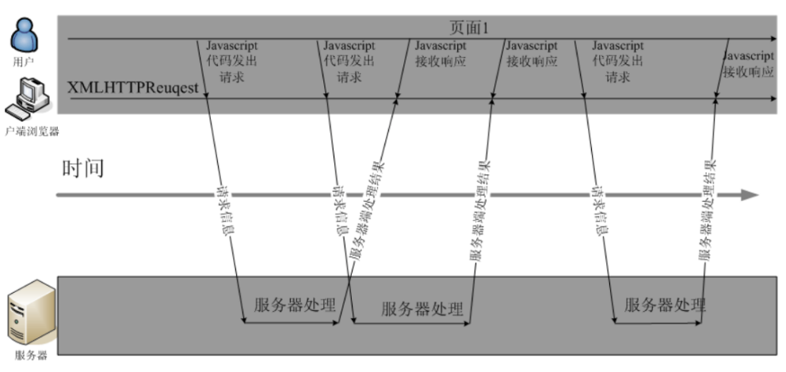

# 大数据学习-Java Day30

##   AJAX & JSON  

### 1 ajax概述

#### 概念

 Ajax 即"Asynchronous Javascript And XML"（异步 JavaScript 和 XML），是指一种创建交互式网页应用的网页开 发技术。 

#### 功能

 Ajax 是一种在无需重新加载整个网页的情况下，能够更新部分网页的技术。通过在后台与服务器进行少量数据交 换，Ajax 可以使网页实现异步更新。这意味着可以在不重新加载整个网页的情况下，对网页的某部分进行更新。传 统的网页（不使用 Ajax）如果需要更新内容，必须重载整个网页页面。提升用户的体验。 

#### 应用场景

-  数据校验 
- 按照需求获取数据 
- 自动更新页面内容  

#### 同步异步

-  两种方式的区别主要体现在客户端和服务器端相互通信的基础上。 

  -  同步方式：客户端必须等待服务器端的响应，在等待的期间客户端不能做其他操作。 
  -  异步方式：客户端不需要等待服务器端的响应，在服务器处理请求的过程中，客户端可以进行其他的操作。 

  

### 2  js原生的ajax 

####  原生的ajax的开发步骤 

1.  创建Ajax引擎对象
2. 为Ajax引擎对象绑定监听（监听服务器已将数据响应给引擎）
3. 绑定提交地址
4. 发送请求 
5. 接受响应数据 

####  js原生的ajax的代码实现 

- js代码

  ```html
  <html>
  
  <head>
      <meta http-equiv="Content-Type" content="text/html; charset=UTF-8">
      <title>Insert title here</title>
      <script type="text/javascript">
          function sendRequest() {
              //js的ajax访问
              //1）创建Ajax引擎对象
              var xmlhttp = new XMLHttpRequest();
              //2）为Ajax引擎对象绑定监听（监听服务器已将数据响应给引擎）
              xmlhttp.onreadystatechange = function() { //引擎状态一改变就触发该事件
                      if (xmlhttp.readyState == 4 && xmlhttp.status == 200) {
                          //5）接受响应数据
                          //获得服务器端返回给引擎对象的数据
                          alert(xmlhttp.responseText);
                      }
                  }
                  //3）绑定提交地址
                  /*
                  GET:请求方式
                  url地址
                  true是否异步 代表异步 false代表同步
                  */
              xmlhttp.open("GET", "/AjaxDemo/ajaxServlet", true);
              //4）发送请求
              xmlhttp.send();
          }
      </script>
  </head>
  
  <body>
      <input type="button" value="ajax异步访问服务器端" onclick="sendRequest()">
  </body>
  
  </html>
  ```

-  Servlet代码 

  ```java
      @WebServlet("/ajaxServlet")
      public class AjaxServlet extends HttpServlet {
          protected void doGet(HttpServletRequest request, HttpServletResponse response)
                  throws ServletException, IOException {
              response.getWriter().write("ajax response data ...");
          }
  
          protected void doPost(HttpServletRequest request, HttpServletResponse response)
                  throws ServletException, IOException {
              doGet(request, response);
          }
      }
  ```

### 3  jQuery方式的ajax 

####  jQuery方式ajax简介 

-  jquery是一个优秀的js类库，自然对js原生的ajax进行了封装，封装后的ajax的操 作方法更简洁，功能更强大，与 ajax操作相关的jquery方法有如下几种，但开发中 经常使用的有三种：  

  | 请求方式 | 语法                                    |
  | -------- | --------------------------------------- |
  | GET请求  | $.get(url, [data], [callback], [type])  |
  | POST请求 | $.post(url, [data], [callback], [type]) |
  | AJAX请求 | $.ajax([settings])                      |

####  GET请求方式 

- 概述

  -  通过远程 HTTP GET 请求载入信息。这是一个简单的 GET 请求功能，如需复杂的ajax参数设置请使用$.ajax。  

- 语法

  -  jQuery.get(url, [data], [callback], [type])  

  -  其中，参数说明如下： 

    | 参数名称 | 解释                                                         |
    | -------- | ------------------------------------------------------------ |
    | url      | 请求的服务器端url地址                                        |
    | data     | 发送给服务器端的请求参数，格式可以是key=value，也可以是js对象 |
    | callback | 当请求成功后的回掉函数，可以在函数体中编写我们的逻辑代码     |
    | type     | 预期的返回数据的类型，取值可以是 xml, html, script, json, text, _defaul等 |

- 代码

  - js代码

    ```html
    <html>
    
    <head>
        <meta http-equiv="Content-Type" content="text/html; charset=UTF-8">
        <title>Insert title here</title>
        <script type="text/javascript" src="jquery-3.3.1.js"></script>
        <script type="text/javascript">
            function sendRequest() {
                $.get(
                    "/AjaxDemo/ajaxServlet",
                    "name=haohao&age=33",
                    function(data) {
                        alert(data);
                    },
                    "text"
                );
            }
        </script>
    </head>
    
    <body>
        <input type="button" value="ajax异步访问服务器端" onclick="sendRequest()">
    </body>
    
    </html>
    ```

  -  Servlet代码 

    ```java
        @WebServlet("/ajaxServlet")
        public class AjaxServlet extends HttpServlet {
            protected void doGet(HttpServletRequest request, HttpServletResponse response)
                    throws ServletException, IOException {
    //获得请求参数
                String name = request.getParameter("name");
                String age = request.getParameter("age");
                response.getWriter().write("ajax response data ..." + name + "..." + age);
            }
    
            protected void doPost(HttpServletRequest request, HttpServletResponse response)
                    throws ServletException, IOException {
                doGet(request, response);
            }
        }
    ```

####  POST请求方式 

-  概述 

  -  通过远程 HTTP POST 请求载入信息。这是一个简单的 POST 请求功能，如需复杂的ajax参数设置请使用$.ajax。  

- 语法

  -  jQuery.post(url, [data], [callback], [type])  

  -  其中，参数说明如下： 

    | 参数名称 | 解释                                                         |
    | -------- | ------------------------------------------------------------ |
    | url      | 请求的服务器端url地址                                        |
    | data     | 发送给服务器端的请求参数，格式可以是key=value，也可以是js对象 |
    | callback | 当请求成功后的回掉函数，可以在函数体中编写我们的逻辑代码     |
    | type     | 预期的返回数据的类型，取值可以是 xml, html, script, json, text, _defaul等 |

- 代码

  - js代码

    ```html
    <html>
    
    <head>
        <meta http-equiv="Content-Type" content="text/html; charset=UTF-8">
        <title>Insert title here</title>
        <script type="text/javascript" src="jquery-3.3.1.js"></script>
        <script type="text/javascript">
            function sendRequest() {
                $.post(
                    "/AjaxDemo/ajaxServlet",
                    "name=haohao&age=33",
                    function(data) {
                        alert(data);
                    },
                    "text"
                );
            }
        </script>
    </head>
    
    <body>
        <input type="button" value="ajax异步访问服务器端" onclick="sendRequest()">
    </body>
    
    </html>
    ```

  -  Servlet代码 

    ```java
        @WebServlet("/ajaxServlet")
        public class AjaxServlet extends HttpServlet {
            protected void doGet(HttpServletRequest request, HttpServletResponse response)
                    throws ServletException, IOException {
                //获得请求参数
                String name = request.getParameter("name");
                String age = request.getParameter("age");
                response.getWriter().write("ajax response data ..." + name + "..." + age);
            }
    
            protected void doPost(HttpServletRequest request, HttpServletResponse response)
                    throws ServletException, IOException {
                doGet(request, response);
            }
        }
    ```

####  AJAX请求方式 

- 概述

  -  通过 HTTP 请求加载远程数据。jQuery 底层 AJAX 实现。简单易用的高层实现见get和post方法。$.ajax()方法可以 更加详细的设置底层的参数。 

- 语法

  -  $.ajax([settings])  

  -  其中，settings是一个js字面量形式的对象，格式是{name:value,name:value... ...}，常用的name属性名如下：  

    | 属性名称 | 解释                                                         |
    | -------- | ------------------------------------------------------------ |
    | url      | 请求的服务器端url地址                                        |
    | async    | (默认: true) 默认设置下，所有请求均为异步请求。如果需要发送同步请求，请将此选项设置为 false |
    | data     | 发送到服务器的数据，可以是键值对形式，也可以是js对象形式     |
    | type     | (默认: "GET") 请求方式 ("POST" 或 "GET")， 默认为 "GET"      |
    | dataType | 预期的返回数据的类型，取值可以是 xml, html, script, json, text, _defaul等 |
    | success  | 请求成功后的回调函数                                         |
    | error    | 请求失败时调用此函数                                         |

- 代码

  - js代码

    ```html
    <html>
    
    <head>
        <meta http-equiv="Content-Type" content="text/html; charset=UTF-8">
        <title>Insert title here</title>
        <script type="text/javascript" src="jquery-3.3.1.js"></script>
        <script type="text/javascript">
            function sendRequest() {
                $.ajax({
                    url: "/AjaxDemo/ajaxServlet",
                    async: true,
                    data: "name=haohao&age=33",
                    type: "GET",
                    dataType: "text",
                    success: function(data) {
                        alert(data);
                    },
                    error: function() {
                        alert("数据没有成功返回!")
                    }
                });
            }
        </script>
    </head>
    
    <body>
        <input type="button" value="ajax异步访问服务器端" onclick="sendRequest()">
    </body>
    
    </html>
    ```

  -  Servlet代码 

    ```java
       @WebServlet("/ajaxServlet")
        public class AjaxServlet extends HttpServlet {
            protected void doGet(HttpServletRequest request, HttpServletResponse response)
                    throws ServletException, IOException {
    //获得请求参数
                String name = request.getParameter("name");
                String age = request.getParameter("age");
                response.getWriter().write("ajax response data ..." + name + "..." + age);
            }
    
            protected void doPost(HttpServletRequest request, HttpServletResponse response)
                    throws ServletException, IOException {
                doGet(request, response);
            }
        }
    ```

### 4  json数据格式 

####  json的概念 

-  json的全称叫做：JavaScript object Notation，JavaScript对象表示法。 
- json现在主要的功能是：用于存储和交换文本信息的语法，进行数据的传输。 
- json的主要优点：JSON 比 XML 更小、更快、更易解析。  

####  json的语法格式 

-  定义json格式 

  | 类型          | 语法                               | 解释                                    |
  | ------------- | ---------------------------------- | --------------------------------------- |
  | 对象类型      | {name:value,name:value...}         | 其中name是字符串类型，而value是任意类型 |
  | 数组/集合类型 | [value,value,value...]             | 其中value是任意类型                     |
  | 混合类型      | [{},{}... ...] 或 {name:[]... ...} | 合理包裹嵌套对象类型和数组类型          |

- 基本规则

  -  数据是由键值对构成 
    -  键推荐使用双引号引起来,也可以不使用引号,或者使用单引号引起来  
    -  值的数据类型: 数字 、字符串、布尔值、数组或对象  
  -  数据之间又逗号分隔 
  -  花括号保存对象 
  -  方括号保存数组 

-  获取json数据格式 

  ```js
  var p = {"name":"zhangsan" , "age":18}
  var arr = ["one","two"];
  
  json对象.键名 ===> p.name
  json对象['键名'] ===> p['name']
  数组对象[索引] ===>arr[1]
  ```

####  json格式和json解析练习 

#####  案例一: 使用 {key:value,key:value} 格式定义json数据,并获取json数据. 

​	1.使用json格式来定义一个Person, firstname为张 , lastname为三丰 , age为100; 

​	2.获取并打印所有属性值. 

```html
<html>

<head>
    <title>json01</title>
    <meta http-equiv="keywords" content="keyword1,keyword2,keyword3">
    <meta http-equiv="description" content="this is my page">
    <meta http-equiv="content-type" content="text/html; charset=UTF-8">
</head>

<body>
</body>
<script language="JavaScript">
    /**
     * 案例一
     * var person={key:value,key:value}
     *
     * class Person{
     * String firstname = "张";
     * String lastname = "三丰";
     * Integer age = 100;
     * }
     *
     * Person p = new Person();
     * System.out.println(p.firstname);
     */
    //json的定义
    var person = {
        "firstname": "张",
        "lastname": "三丰",
        "age": 100
    };
    //json解析
    alert(person.firstname);
    alert(person.lastname);
    alert(person.age);
</script>

</html>
```

#####  案例二: 使用[{key:value,key:value},{key:value,key:value}] 来定义数3个person对象, 并遍历打印.  

```html
<html>

<head>
    <title>json02</title>
    <meta http-equiv="keywords" content="keyword1,keyword2,keyword3">
    <meta http-equiv="description" content="this is my page">
    <meta http-equiv="content-type" content="text/html; charset=UTF-8">
</head>

<body>
</body>
<script language="JavaScript">
    /**
     * 案例二
     * [{key:value,key:value},{key:value,key:value}]
     *
     */
    var json = [{
        "firstname": "张",
        "lastname": "三丰",
        "age": 100
    }, {
        "firstname": "张",
        "lastname": "翠山",
        "age": 58
    }, {
        "firstname": "张",
        "lastname": "无忌",
        "age": 23
    }];
    for (var i = 0; i < json.length; i++) {
        alert(json[i].lastname);
    }
</script>

</html>
```

#####  案例三:使用如下json格式定义json对象,并获取第二个元素内容,遍历打印. 

```json
{
"param1":[{key:value,key:value},{key:value,key:value}],
"param2":[{key:value,key:value},{key:value,key:value}],
"param3":[{key:value,key:value},{key:value,key:value}]
}
```

```html
<html>

<head>
    <title>insertBefore.html</title>
    <meta http-equiv="keywords" content="keyword1,keyword2,keyword3">
    <meta http-equiv="description" content="this is my page">
    <meta http-equiv="content-type" content="text/html; charset=UTF-8">
</head>

<body>
</body>
<script language="JavaScript">
    /**
     * 案例四
     * {
     * "param1":[{key:value,key:value},{key:value,key:value}],
     * "param2":[{key:value,key:value},{key:value,key:value}],
     * "param3":[{key:value,key:value},{key:value,key:value}]
     * }
     *
     *
     */
    var json = {
            "baobao": [{
                "name": "小双",
                "age": 18,
                "addr": "扬州"
            }, {
                "name": "建宁",
                "age": 18,
                "addr": "北京海淀"
            }, {
                "name": "龙儿",
                "age": 38,
                "addr": "香港"
            }, {
                "name": "阿珂",
                "age": 17,
                "addr": "台湾"
            }],
            "haohao": [{
                "name": "楠楠",
                "age": 23,
                "addr": "北京昌平修正"
            }, {
                "name": "倩倩",
                "age": 18,
                "addr": "上海"
            }]
        }
        //娶楠楠
    alert(json.haohao[0].name);
</script>

</html>
```

####  json的转换工具 

-  json转换工具的概述 

  -  json的转换工具是通过java封装好的一些jar工具包，直接将java对象或集合转换成json格式的字符串。 

-  常见的json转换工具 

  | 工具名称 | 介绍                                                 |
  | -------- | ---------------------------------------------------- |
  | Jsonlib  | Java 类库，需要导入的jar包较多                       |
  | Gson     | google提供的一个简单的json转换工具                   |
  | Fastjson | alibaba技术团队提供的一个高性能的json转换工具        |
  | Jackson  | 开源免费的json转换工具，springmvc转换默认使用jackson |

-  jackson工具使用 

  - 实现步骤

    ```java
    1）导入json相关jar包
    jackson-annotations-2.2.3.jar
    jackson-core-2.2.3.jar
    jackson-databind-2.2.3.jar
    2）创建java对象或集合
    3) 使用jackson的ObjectMapper对象的writeValueAsString方法进行转换
    
    ```

- 注解使用
  -  @JsonIgnore:排除属性。 
  - @JsonFormat:属性值的格式化,例如，针对日期格式：@JsonFormat(pattern = "yyyy-MM-dd") 

-  转换代码实现 

  ```java
  import com.fasterxml.jackson.core.JsonProcessingException;
  import com.fasterxml.jackson.databind.ObjectMapper;
  
  public class JacksonDemo {
      public static void main(String[] args) throws JsonProcessingException {
          //创建User对象
          User user = new User();
          user.setId("100");
          user.setUsername("haohao");
          user.setAge(33);
          //创建List集合
          List<String> arr = new ArrayList<>();
          arr.add("aaa");
          arr.add("bbbb");
          arr.add("ccccc");
          //创建Map集合
          Map<String, User> map = new HashMap<>();
          map.put("user", user);
          //转换
          ObjectMapper om = new ObjectMapper();
          String userJson = om.writeValueAsString(user);
          String arrJson = om.writeValueAsString(arr);
          String mapJson = om.writeValueAsString(map);
          System.out.println(userJson);
          System.out.println(arrJson);
          System.out.println(mapJson);
      }
  }
  ```

### 5  综合案例 

####  检测用户名是否已经被注册 

#####  需求 

 在用户注册页面，输入用户名，当用户名输入框失去焦点时，发送异步请求，将输入框的用户名传递给服务器端进 行是否存在的校验。 

#####  使用技术 

 前台: html jQuery ajax 

后台: Servlet JDBC C3p0连接池 DBUtils jackson 

数据库: mysql  

#####  代码实现 

-  数据库SQL 

  ```mysql
  #创建user表
  CREATE TABLE USER (
  id INT PRIMARY KEY AUTO_INCREMENT,
  username VARCHAR(32),
  PASSWORD VARCHAR(32)
  );
  INSERT INTO USER VALUES(NULL,'zhangsan','123');
  INSERT INTO USER VALUES(NULL,'lisi','123');
  INSERT INTO USER VALUES(NULL,'wangwu','123');
  
  ```

-  c3p0-config.xml配置文件 

  ```xml
  <?xml version="1.0" encoding="UTF-8"?>
  <c3p0-config>
      <default-config>
          <property name="driverClass">com.mysql.jdbc.Driver</property>
          <property name="jdbcUrl">jdbc:mysql://localhost:3306/ajax_project</property>
          <property name="user">root</property>
          <property name="password">123</property>
      </default-config>
  </c3p0-config>
  ```

-  JDBCUtils 

  ```java
  
  import javax.sql.DataSource;
  import java.sql.Connection;
  import java.sql.SQLException;
  
  public class JDBCUtils {
      private static DataSource dataSource = new ComboPooledDataSource();
  
      //1.获取连接池对象
      public static DataSource getDataSource() {
          return dataSource;
      }
  
      //2.获取连接对象
      public static Connection getConnection() throws SQLException {
          return dataSource.getConnection();
      }
  }
  
  ```

-  User实体类 

  ```java
  public class User {
      private int id;
      private String username;
      private String password;
  
      public User() {
      }
  
      public User(int id, String username, String password) {
          this.id = id;
          this.username = username;
          this.password = password;
      }
  
      public int getId() {
          return id;
      }
  
      public void setId(int id) {
          this.id = id;
      }
  
      public String getUsername() {
          return username;
      }
  
      public void setUsername(String username) {
          this.username = username;
      }
  
      public String getPassword() {
          return password;
      }
  
      public void setPassword(String password) {
          this.password = password;
      }
  
      @Override
      public String toString() {
          return "User{" +
                  "id=" + id +
                  ", username='" + username + '\'' +
                  ", password='" + password + '\'' +
                  '}';
      }
  }
  
  ```

-  UserMapper接口 

  ```java
  import java.sql.SQLException;
  
  public interface UserMapper {
      //根据用户名查找数据库中是否有该用户
  // int 0 没查到 1查到了
      public long queryUserByName(String username) throws SQLException;
  }
  
  ```

-  UserService接口和实现类 

  ```java
  接口
  
  public interface UserService {
      //根据name查询用户
      public long findUserByName(String username) throws SQLException, IOException;
  }
  实现类
          package com.itheima.service;
          import com.itheima.mapper.UserMapper;
          import org.apache.ibatis.io.Resources;
          import org.apache.ibatis.session.SqlSession;
          import org.apache.ibatis.session.SqlSessionFactory;
          import org.apache.ibatis.session.SqlSessionFactoryBuilder;
          import java.io.IOException;
          import java.io.InputStream;
          import java.sql.SQLException;
  
  public class UserServiceImpl implements UserService {
      private UserMapper userMapper;
  
      @Override
      public long findUserByName(String username) throws SQLException, IOException {
          SqlSessionFactoryBuilder builder = new SqlSessionFactoryBuilder();
          InputStream inputStream = Resources.getResourceAsStream("SqlMapConfig.xml");
          SqlSessionFactory build = builder.build(inputStream);
          SqlSession sqlSession = build.openSession();
          UserMapper mapper = sqlSession.getMapper(UserMapper.class);
          long count = mapper.queryUserByName(username);
          return count;
      }
  }
  ```

  

-  QueryAllServlet 

  ```java
  import com.itheima.service.UserService;
  import com.itheima.service.UserServiceImpl;
  
  import javax.servlet.ServletException;
  import javax.servlet.annotation.WebServlet;
  import javax.servlet.http.HttpServlet;
  import javax.servlet.http.HttpServletRequest;
  import javax.servlet.http.HttpServletResponse;
  import java.io.IOException;
  import java.sql.SQLException;
  
  @WebServlet("/QueryServlet")
  public class QueryServlet extends HttpServlet {
      protected void doPost(HttpServletRequest request, HttpServletResponse response)
              throws ServletException, IOException {
          /**
           * 1.编码设置
           * 2.接收参数用户名
           * 3.创建service,并代用service的查询方法 ==> int count (1/0)
           * 4.直接将返回的count写到回调函数的data中
           */
          try {
              //1.编码设置
              request.setCharacterEncoding("UTF-8");
              response.setContentType("text/html;charset=utf-8");
              //2.接收参数用户名
              String username = request.getParameter("username");
              //3.创建service,并代用service的查询方法 ==> int count (1/0)
              UserService service = new UserServiceImpl();
              long count = service.findUserByName(username);
              //4.直接将返回的count写到回调函数的data中
              response.getWriter().print(count);
          } catch (SQLException e) {
              e.printStackTrace();
          }
      }
  
      protected void doGet(HttpServletRequest request, HttpServletResponse response)
              throws ServletException, IOException {
          doPost(request, response);
      }
  }
  
  ```

-  register.html页面 

  ```html
  <!DOCTYPE html>
  <html lang="en">
  
  <head>
      <meta charset="UTF-8">
      <title>Title</title>
      <script src="js/jquery-3.3.1.js"></script>
      <script>
          /**
           * 前台的思路:
           * 1.页面加载
           * 2.获取用户名输入框的jQuery对象,派发一个失去关标的事件 blur,绑定一个函数
           * 3.blur函数中获取输入用户名
           * 4.发送ajax请求到后台
           * 5.未完待续: 回调函数中做判断...
           */
          //1.页面加载
          $(function() {
              //2.获取用户名输入框的jQuery对象,派发一个失去关标的事件 blur,绑定一个函数
              $("#name").blur(function() {
                  //3.blur函数中获取输入用户名
                  var username = $("#name").val();
                  //4.发送ajax请求到后台
                  //第一个参数: url 第二个参数: 发送给后台的username 第三个参数 回调函数 第四个
                  参数: 返回数据类型
                  $.post("/day17_project/QueryServlet", "username=" + username, function(data) {
                      //alert(data); //data 可能是0 代表用户名可以使用, 可能是1,已经被注册
                      if (data >= 1) { //用户已经存在,不能使用该用户名
                          $("#msg").html("<font color='red'>用户名已经存在,请更换</font>")
                      } else { //用户不存在,可以使用该用户名
                          $("#msg").html("<font color='green'>用户名可以使用</font>")
                      }
                  }, "text")
              })
          })
      </script>
  </head>
  
  <body>
      <h1>会员注册</h1>
      用户名<input type="text" name="username" id="name" /><span id="msg"></span><br /> 密码
      <input type="password" name="password" id="pwd" /><br />
      <input type="button" id="btn" value="注册" />
  </body>
  
  </html>
  ```

  