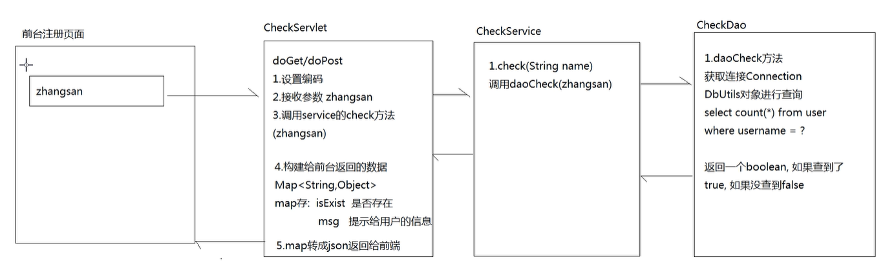

# 大数据学习-Java Day30

##   AJAX & JSON  

### 1 ajax概述

#### 概念

 Ajax 即"Asynchronous Javascript And XML"（异步 JavaScript 和 XML），是指一种创建交互式网页应用的网页开 发技术。 

#### 功能

 Ajax 是一种在无需重新加载整个网页的情况下，能够更新部分网页的技术。通过在后台与服务器进行少量数据交 换，Ajax 可以使网页实现异步更新。这意味着可以在不重新加载整个网页的情况下，对网页的某部分进行更新。传 统的网页（不使用 Ajax）如果需要更新内容，必须重载整个网页页面。提升用户的体验。 

#### 应用场景

-  数据校验 
- 按照需求获取数据 
- 自动更新页面内容  

#### 同步异步

-  两种方式的区别主要体现在客户端和服务器端相互通信的基础上。 

  -  同步方式：客户端必须等待服务器端的响应，在等待的期间客户端不能做其他操作。 
  -  异步方式：客户端不需要等待服务器端的响应，在服务器处理请求的过程中，客户端可以进行其他的操作。 

  

### 2  js原生的ajax 

####  原生的ajax的开发步骤 

1.  创建Ajax引擎对象
2. 为Ajax引擎对象绑定监听（监听服务器已将数据响应给引擎）
3. 绑定提交地址
4. 发送请求 
5. 接受响应数据 

####  js原生的ajax的代码实现 

- js代码

  ```html
  <html>
  
  <head>
      <meta http-equiv="Content-Type" content="text/html; charset=UTF-8">
      <title>Insert title here</title>
      <script type="text/javascript">
          function sendRequest() {
              //js的ajax访问
              //1）创建Ajax引擎对象
              var xmlhttp = new XMLHttpRequest();
              //2）为Ajax引擎对象绑定监听（监听服务器已将数据响应给引擎）
              // onreadystatechange 监听核心对象 XMLHttpRequest对象的时间
              xmlhttp.onreadystatechange = function () { //引擎状态一改变就触发该事件
                  // readyState 执行的状态 1 2 3 4 （响应结束）
                  if (xmlhttp.readyState == 4 && xmlhttp.status == 200) {
                      //5）接受响应数据
                      //获得服务器端返回给引擎对象的数据
                      alert(xmlhttp.responseText);
                  }
              }
              //3）绑定提交地址
              /*
              GET:请求方式
              url地址
              true是否异步 代表异步 false代表同步
              */
              xmlhttp.open("GET", "/J/Demo", true);
              //4）发送请求
              xmlhttp.send();
          }
      </script>
  </head>
  
  <body>
  <input type="button" value="ajax异步访问服务器端" onclick="sendRequest()">
  </body>
  
  </html>
  ```

-  Servlet代码 

  ```java
  /*
   * 是一个web服务器的动态资源，可以由客户端访问，还可以给客户端返回信息
   * 继承自httpservlet
   * 重写doget，dopost方法
   * 添加一个webservlet注解
   * 把项目部署到tomcat启动
   * */
  
  @WebServlet("/Demo")
  public class Demo extends HttpServlet {
      @Override
      protected void doGet(HttpServletRequest req, HttpServletResponse resp) throws ServletException, IOException {
          doPost(req,resp);
      }
  
  
      @Override
      protected void doPost(HttpServletRequest req, HttpServletResponse resp) throws ServletException, IOException {
          //设置请求编码
          req.setCharacterEncoding("UTF-8");
          //设置响应编码
          resp.setContentType("text/html;charset=utf-8");
          //打印一句话表明请求已经到达服务器资源
          System.out.println("jiiehsou");
          //通过打印留给客户端返回一个hello
          resp.getWriter().println("hello.......");
      }
  }
  
  ```

### 3  jQuery方式的ajax 

####  jQuery方式ajax简介 

-  jquery是一个优秀的js类库，自然对js原生的ajax进行了封装，封装后的ajax的操 作方法更简洁，功能更强大，与 ajax操作相关的jquery方法有如下几种，但开发中 经常使用的有三种：  

  | 请求方式 | 语法                                    |
  | -------- | --------------------------------------- |
  | GET请求  | $.get(url, [data], [callback], [type])  |
  | POST请求 | $.post(url, [data], [callback], [type]) |
  | AJAX请求 | $.ajax([settings])                      |

####  GET请求方式 

- 概述

  -  通过远程 HTTP GET 请求载入信息。这是一个简单的 GET 请求功能，如需复杂的ajax参数设置请使用$.ajax。  

- 语法

  -  jQuery.get(url, [data], [callback], [type])  

  -  其中，参数说明如下： 

    | 参数名称 | 解释                                                         |
    | -------- | ------------------------------------------------------------ |
    | url      | 请求的服务器端url地址                                        |
    | data     | 发送给服务器端的请求参数，格式可以是key=value，也可以是js对象 |
    | callback | 当请求成功后的回掉函数，可以在函数体中编写我们的逻辑代码     |
    | type     | 预期的返回数据的类型，取值可以是 xml, html, script, json, text, _defaul等 |

- 代码

  - js代码

    ```html
    <html>
    
    <head>
        <meta http-equiv="Content-Type" content="text/html; charset=UTF-8">
        <title>Insert title here</title>
        <script type="text/javascript" src="jquery-3.3.1.js"></script>
        <script type="text/javascript">
            function sendRequest() {
                $.get(
                    "/AjaxDemo/ajaxServlet",
                    "name=haohao&age=33",
                    function(data) {
                        alert(data);
                    },
                    "text"
                );
            }
        </script>
    </head>
    
    <body>
        <input type="button" value="ajax异步访问服务器端" onclick="sendRequest()">
    </body>
    
    </html>
    ```

  -  Servlet代码 

    ```java
        @WebServlet("/ajaxServlet")
        public class AjaxServlet extends HttpServlet {
            protected void doGet(HttpServletRequest request, HttpServletResponse response) throws ServletException, IOException {
    //获得请求参数
                String name = request.getParameter("name");
                String age = request.getParameter("age");
                response.getWriter().write("ajax response data ..." + name + "..." + age);
            }
    
            protected void doPost(HttpServletRequest req, HttpServletResponse resp) throws ServletException, IOException {
                doGet(request, response);
            }
        }
    ```

####  POST请求方式 

-  概述 

  -  通过远程 HTTP POST 请求载入信息。这是一个简单的 POST 请求功能，如需复杂的ajax参数设置请使用$.ajax。  

- 语法

  -  jQuery.post(url, [data], [callback], [type])  

  -  其中，参数说明如下： 

    | 参数名称 | 解释                                                         |
    | -------- | ------------------------------------------------------------ |
    | url      | 请求的服务器端url地址                                        |
    | data     | 发送给服务器端的请求参数，格式可以是key=value，也可以是js对象 |
    | callback | 当请求成功后的回掉函数，可以在函数体中编写我们的逻辑代码     |
    | type     | 预期的返回数据的类型，取值可以是 xml, html, script, json, text, _defaul等 |

- 代码

  - js代码

    ```html
    <html>
    
    <head>
        <meta http-equiv="Content-Type" content="text/html; charset=UTF-8">
        <title>Insert title here</title>
        <script type="text/javascript" src="jquery-3.3.1.js"></script>
        <script type="text/javascript">
            function sendRequest() {
                $.post(
                    "/AjaxDemo/ajaxServlet",
                    "name=haohao&age=33",
                    function(data) {
                        alert(data);
                    },
                    "text"
                );
            }
        </script>
    </head>
    
    <body>
        <input type="button" value="ajax异步访问服务器端" onclick="sendRequest()">
    </body>
    
    </html>
    ```

  -  Servlet代码 

    ```java
        @WebServlet("/ajaxServlet")
        public class AjaxServlet extends HttpServlet {
            protected void doGet(HttpServletRequest request, HttpServletResponse response) throws ServletException, IOException {
                //获得请求参数
                String name = request.getParameter("name");
                String age = request.getParameter("age");
                response.getWriter().write("ajax response data ..." + name + "..." + age);
            }
    
            protected void doPost(HttpServletRequest request, HttpServletResponse response) throws ServletException, IOException {
                doGet(request, response);
            }
        }
    ```

####  AJAX请求方式 

- 概述

  -  通过 HTTP 请求加载远程数据。jQuery 底层 AJAX 实现。简单易用的高层实现见get和post方法。$.ajax()方法可以 更加详细的设置底层的参数。 

- 语法

  -  $.ajax([settings])  

  -  其中，settings是一个js字面量形式的对象，格式是{name:value,name:value... ...}，常用的name属性名如下：  

    | 属性名称 | 解释                                                         |
    | -------- | ------------------------------------------------------------ |
    | url      | 请求的服务器端url地址                                        |
    | async    | (默认: true) 默认设置下，所有请求均为异步请求。如果需要发送同步请求，请将此选项设置为 false |
    | data     | 发送到服务器的数据，可以是键值对形式，也可以是js对象形式     |
    | type     | (默认: "GET") 请求方式 ("POST" 或 "GET")， 默认为 "GET"      |
    | dataType | 预期的返回数据的类型，取值可以是 xml, html, script, json, text, _defaul等 |
    | success  | 请求成功后的回调函数                                         |
    | error    | 请求失败时调用此函数                                         |

- 代码

  - js代码

    ```html
    <html>
    
    <head>
        <meta http-equiv="Content-Type" content="text/html; charset=UTF-8">
        <title>Insert title here</title>
        <script type="text/javascript" src="jquery-3.3.1.js"></script>
        <script type="text/javascript">
            function sendRequest() {
                $.ajax({
                    url: "/AjaxDemo/ajaxServlet",
                    async: true,
                    data: "name=haohao&age=33",
                    type: "GET",
                    dataType: "text",
                    success: function(data) {
                        alert(data);
                    },
                    error: function() {
                        alert("数据没有成功返回!")
                    }
                });
            }
        </script>
    </head>
    
    <body>
        <input type="button" value="ajax异步访问服务器端" onclick="sendRequest()">
    </body>
    
    </html>
    ```

  -  Servlet代码 

    ```java
       @WebServlet("/ajaxServlet")
        public class AjaxServlet extends HttpServlet {
            protected void doGet(HttpServletRequest request, HttpServletResponse response) throws ServletException, IOException {
    //获得请求参数
                String name = request.getParameter("name");
                String age = request.getParameter("age");
                response.getWriter().write("ajax response data ..." + name + "..." + age);
            }
    
            protected void doPost(HttpServletRequest request, HttpServletResponse response) throws ServletException, IOException {
                doGet(request, response);
            }
        }
    ```

### 4  json数据格式 

####  json的概念 

-  json的全称叫做：JavaScript object Notation，JavaScript对象表示法。 
- json现在主要的功能是：用于存储和交换文本信息的语法，进行数据的传输。 
- json的主要优点：JSON 比 XML 更小、更快、更易解析。  

####  json的语法格式 

-  定义json格式 

  | 类型          | 语法                               | 解释                                    |
  | ------------- | ---------------------------------- | --------------------------------------- |
  | 对象类型      | {name:value,name:value...}         | 其中name是字符串类型，而value是任意类型 |
  | 数组/集合类型 | [value,value,value...]             | 其中value是任意类型                     |
  | 混合类型      | [{},{}... ...] 或 {name:[]... ...} | 合理包裹嵌套对象类型和数组类型          |

- 基本规则

  -  数据是由键值对构成 
    -  键推荐使用双引号引起来,也可以不使用引号,或者使用单引号引起来  
    -  值的数据类型: 数字 、字符串、布尔值、数组或对象  
  -  数据之间又逗号分隔 
  -  花括号保存对象 
  -  方括号保存数组 

-  获取json数据格式 

  ```js
  var p = {"name":"zhangsan" , "age":18}
  var arr = ["one","two"];
  
  json对象.键名 ===> p.name
  json对象['键名'] ===> p['name']
  数组对象[索引] ===>arr[1]
  ```

####  json格式和json解析练习 

#####  案例一: 使用 {key:value,key:value} 格式定义json数据,并获取json数据. 

​	1.使用json格式来定义一个Person, firstname为张 , lastname为三丰 , age为100; 

​	2.获取并打印所有属性值. 

```html
<html>

<head>
    <title>json01</title>
    <meta http-equiv="keywords" content="keyword1,keyword2,keyword3">
    <meta http-equiv="description" content="this is my page">
    <meta http-equiv="content-type" content="text/html; charset=UTF-8">
</head>

<body>
</body>
<script language="JavaScript">
    /**
     * 案例一
     * var person={key:value,key:value}
     *
     * class Person{
     * String firstname = "张";
     * String lastname = "三丰";
     * Integer age = 100;
     * }
     *
     * Person p = new Person();
     * System.out.println(p.firstname);
     */
    //json的定义
    var person = {
        "firstname": "张",
        "lastname": "三丰",
        "age": 100
    };
    //json解析
    alert(person.firstname);
    alert(person.lastname);
    alert(person.age);
</script>

</html>
```

#####  案例二: 使用[{key:value,key:value},{key:value,key:value}] 来定义数3个person对象, 并遍历打印.  

```html
<html>

<head>
    <title>json02</title>
    <meta http-equiv="keywords" content="keyword1,keyword2,keyword3">
    <meta http-equiv="description" content="this is my page">
    <meta http-equiv="content-type" content="text/html; charset=UTF-8">
</head>

<body>
</body>
<script language="JavaScript">
    /**
     * 案例二
     * [{key:value,key:value},{key:value,key:value}]
     *
     */
    var json = [{
        "firstname": "张",
        "lastname": "三丰",
        "age": 100
    }, {
        "firstname": "张",
        "lastname": "翠山",
        "age": 58
    }, {
        "firstname": "张",
        "lastname": "无忌",
        "age": 23
    }];
    for (var i = 0; i < json.length; i++) {
        alert(json[i].lastname);
    }
</script>

</html>
```

#####  案例三:使用如下json格式定义json对象,并获取第二个元素内容,遍历打印. 

```json
{
"param1":[{key:value,key:value},{key:value,key:value}],
"param2":[{key:value,key:value},{key:value,key:value}],
"param3":[{key:value,key:value},{key:value,key:value}]
}
```

```html
<html>

<head>
    <title>insertBefore.html</title>
    <meta http-equiv="keywords" content="keyword1,keyword2,keyword3">
    <meta http-equiv="description" content="this is my page">
    <meta http-equiv="content-type" content="text/html; charset=UTF-8">
</head>

<body>
</body>
<script language="JavaScript">
    /**
     * 案例四
     * {
     * "param1":[{key:value,key:value},{key:value,key:value}],
     * "param2":[{key:value,key:value},{key:value,key:value}],
     * "param3":[{key:value,key:value},{key:value,key:value}]
     * }
     *
     *
     */
    var json = {
            "baobao": [{
                "name": "小双",
                "age": 18,
                "addr": "扬州"
            }, {
                "name": "建宁",
                "age": 18,
                "addr": "北京海淀"
            }, {
                "name": "龙儿",
                "age": 38,
                "addr": "香港"
            }, {
                "name": "阿珂",
                "age": 17,
                "addr": "台湾"
            }],
            "haohao": [{
                "name": "楠楠",
                "age": 23,
                "addr": "北京昌平修正"
            }, {
                "name": "倩倩",
                "age": 18,
                "addr": "上海"
            }]
        }
        //娶楠楠
    alert(json.haohao[0].name);
</script>

</html>
```

####  json的转换工具 

-  json转换工具的概述 

  -  json的转换工具是通过java封装好的一些jar工具包，直接将java对象或集合转换成json格式的字符串。 

-  常见的json转换工具 

  | 工具名称 | 介绍                                                 |
  | -------- | ---------------------------------------------------- |
  | Jsonlib  | Java 类库，需要导入的jar包较多                       |
  | Gson     | google提供的一个简单的json转换工具                   |
  | Fastjson | alibaba技术团队提供的一个高性能的json转换工具        |
  | Jackson  | 开源免费的json转换工具，springmvc转换默认使用jackson |

-  jackson工具使用 

  - 实现步骤

    ```java
    1）导入json相关jar包
    jackson-annotations-2.2.3.jar
    jackson-core-2.2.3.jar
    jackson-databind-2.2.3.jar
    2）创建java对象或集合
    3) 使用jackson的ObjectMapper对象的writeValueAsString方法进行转换
    
    ```

- 注解使用
  -  @JsonIgnore:排除属性。 
  - @JsonFormat:属性值的格式化,例如，针对日期格式：@JsonFormat(pattern = "yyyy-MM-dd") 

-  转换代码实现 

  ```java
  package com.bigdatalearn.web;
  
  
  import com.fasterxml.jackson.core.JsonProcessingException;
  import com.fasterxml.jackson.databind.ObjectMapper;
  
  import java.util.*;
  
  /**
   * jackson的常用方法：
   * ObjectMapper对象，可以将Java对象转成json
   * writeValueAsString（java对象） ===> 返回值是一个json
   *
   * @JsonIgnore 生成json时忽略指定属性
   * @JsonFormat(pattern = "YYYY-MM-dd")  日志类型转换为指定格式
   */
  
  public class JackSonDemo {
      public static void main(String[] args) throws JsonProcessingException {
          method();
          method1();
          // 将Map类型数据转换成json
          Map<String, User> map = new HashMap<>();
          map.put("n1", new User("a", 20, new Date(), "北京"));
          map.put("n2", new User("b", 20, new Date(), "北京"));
          map.put("n3", new User("c", 20, new Date(), "北京"));
          ObjectMapper om = new ObjectMapper();
          String mapJson = om.writeValueAsString(map);
          System.out.println(mapJson);
      }
  
      private static void method1() throws JsonProcessingException {
          // 将List类型数据转换成json
          List<User> list = new ArrayList<>();
          list.add(new User("a", 20, new Date(), "北京"));
          list.add(new User("b", 20, new Date(), "北京"));
          list.add(new User("c", 20, new Date(), "北京"));
          ObjectMapper om = new ObjectMapper();
          String listJson = om.writeValueAsString(list);
          System.out.println(listJson);
      }
  
      private static void method() throws JsonProcessingException {
          //需求：将user对象转成json串
          User user = new User("老王", 30, new Date(), "北京");
          // 创建jackson的核心对象
          ObjectMapper om = new ObjectMapper();
          // 调用writeValueAsString 将user对象转换成json
          String jsonObj = om.writeValueAsString(user);
          System.out.println(jsonObj);
      }
  
  }
  
  ```

### 5  综合案例 

####  检测用户名是否已经被注册 

#####  需求 

 在用户注册页面，输入用户名，当用户名输入框失去焦点时，发送异步请求，将输入框的用户名传递给服务器端进 行是否存在的校验。 

#####  使用技术 

 前台: html jQuery ajax 

后台: Servlet JDBC C3p0连接池 DBUtils jackson 

数据库: mysql  



#####  代码实现 

数据库SQL 

```mysql
#创建user表
CREATE TABLE USER (
id INT PRIMARY KEY AUTO_INCREMENT,
username VARCHAR(32),
PASSWORD VARCHAR(32)
);
INSERT INTO USER VALUES(NULL,'zhangsan','123');
INSERT INTO USER VALUES(NULL,'lisi','123');
INSERT INTO USER VALUES(NULL,'wangwu','123');

```

c3p0-config.xml配置文件 

```xml
<?xml version="1.0" encoding="UTF-8"?>
<c3p0-config>
    <default-config>
        <property name="driverClass">com.mysql.jdbc.Driver</property>
        <property name="jdbcUrl">jdbc:mysql://localhost:3306/test</property>
        <property name="user">root</property>
        <property name="password">mysql</property>
    </default-config>test
</c3p0-config>
```

JDBCUtils 

```java
package com.bigdatalearn.util;

import com.mchange.v2.c3p0.ComboPooledDataSource;

import javax.sql.DataSource;
import java.sql.Connection;
import java.sql.SQLException;

/**
 * 通过该工具可以获取连接对象和连接池对象
 */

public class JDBCUtils {

    //创建c3p0连接池
    private static DataSource dataSource = new ComboPooledDataSource();

    // 提供一个方法返回连接池
    public static DataSource getDataSource() {
        return dataSource;
    }

    // 提供一个Connection的连接对象
    public static Connection getConnection() throws SQLException {
        return dataSource.getConnection();
    }
}

```

检查用户是否存在

```java
import com.bigdatalearn.util.JDBCUtils;
import org.apache.commons.dbutils.QueryRunner;
import org.apache.commons.dbutils.handlers.ScalarHandler;

import javax.sql.DataSource;
import java.sql.SQLException;

public class CheckDao {

    // 检查用户名是否存在
    public boolean daoCheck(String name) throws SQLException {

        // 1.获取连接池DataSource对象
        DataSource dataSource = JDBCUtils.getDataSource();

        // 2.使用DBYtils
        QueryRunner queryRunner = new QueryRunner(dataSource);

        //3. 查询操作
        Long count = (Long) queryRunner.query("select count(*) from USER where username = ? ", new ScalarHandler(), name);

        // 4.如果查到了 count>=1
        return count >= 1;
    }

}
```


```java
import com.bigdatalearn.util.JDBCUtils;
import org.apache.commons.dbutils.QueryRunner;
import org.apache.commons.dbutils.handlers.ScalarHandler;

import javax.sql.DataSource;
import java.sql.SQLException;

public class CheckDao {

    // 检查用户名是否存在
    public boolean daoCheck(String name) throws SQLException {

        // 1.获取连接池DataSource对象
        DataSource dataSource = JDBCUtils.getDataSource();

        // 2.使用DBYtils
        QueryRunner queryRunner = new QueryRunner(dataSource);

        //3. 查询操作
        Long count = (Long) queryRunner.query("select count(*) from USER where username = ? ", new ScalarHandler(), name);

        // 4.如果查到了 count>=1
        return count >= 1;
    }

}
```


```java

import com.bigdatalearn.dao.CheckDao;

import java.sql.SQLException;

public class CheckService {
    //检查用户是否存在的check方法
    public boolean check(String name) throws SQLException {
        return new CheckDao().daoCheck(name);
    }
}

```


```java
package com.bigdatalearn.web;

import com.bigdatalearn.service.CheckService;
import com.fasterxml.jackson.databind.ObjectMapper;

import javax.servlet.ServletException;
import javax.servlet.annotation.WebServlet;
import javax.servlet.http.HttpServlet;
import javax.servlet.http.HttpServletRequest;
import javax.servlet.http.HttpServletResponse;
import java.io.IOException;
import java.sql.SQLException;
import java.util.HashMap;
import java.util.Map;

@WebServlet("/CheckServlet")
public class CheckServlet extends HttpServlet {

    @Override
    protected void doGet(HttpServletRequest req, HttpServletResponse resp) throws ServletException, IOException {
        doPost(req, resp);
    }

    @Override
    protected void doPost(HttpServletRequest req, HttpServletResponse resp) throws ServletException, IOException {

        try {
            //1.设置编码
            req.setCharacterEncoding("UTF-8");
            resp.setContentType("text/html;charset=utf-8");

            //2.获取前台参数 username
            String username = req.getParameter("username");

            //3.调用service的check方法得到一个boolean值
            boolean flag = new CheckService().check(username);

            //4.创建一个Map对象，给map中设置内容
            Map<String, Object> map = new HashMap<String, Object>();

            if (flag) {
                map.put("isExist", true);
                map.put("msg", "该用户已经存在");
            } else {
                map.put("isExist", true);
                map.put("msg", "该用户可以使用");
            }

            // 5.map转成json返回给前台
            ObjectMapper om = new ObjectMapper();
            String mapJson = om.writeValueAsString(map);

            //6.json数据返回给前台
            resp.getWriter().println(mapJson);
        } catch (SQLException e) {
            e.printStackTrace();
        }

    }
}

```


register.html页面 

```html
<!DOCTYPE html>
<html lang="en">
<head>
    <meta charset="UTF-8">
    <title>注册页面</title>
    <script src="js/jquery-3.5.1.js"></script>

    <script>
        /**
         * 需求 当用户名输入框失去光标，发送ajax请求查询后台，判断用户是否已经存在，最后提示
         * 前台的思路:
         * 1.页面加载
         * 2.获取用户名输入框的jQuery对象,派发一个失去关标的事件 blur,绑定一个函数
         * 3.blur函数中获取输入用户名
         * 4.发送ajax请求到后台
         * 5.未完待续: 回调函数中做判断...
         */
        $(function () {
            //1.获取用户名输入框的jQuery对象,派发一个失去关标的事件 blur,绑定一个函数
            $("#uid").blur(function () {
                //2.blur函数中获取输入用户名
                var username = $("#uid").val();
                //3.发送ajax，传递用户名参数
                //第一个参数: url 第二个参数: 发送给后台的username 第三个参数 回调函数 第四个参数: 返回数据类型
                $.post("/J/CheckServlet", {"username": username}, function (data) {
                    // 4.判断isExist 如果为true ，用户存在，msg设置为红色，放到span里面
                    if (data.isExist) {
                        //不能使用
                        $("#uid_msg").css("color", "red").html(data.msg);
                    } else {
                        //能使用
                        $("#uid_msg").css("color", "green").html(data.msg);
                    }

                }, "json");
            })
        })
    </script>
</head>
<body>
<input type="text" name="username" id="uid" placeholder="请输入用户名">
<span id="uid_msg"></span>
<br>
<input type="text" name="password" id="ipwd" placeholder="请输入密码">
<br>
<input type="submit" value="注册">
</body>
</html>
```

