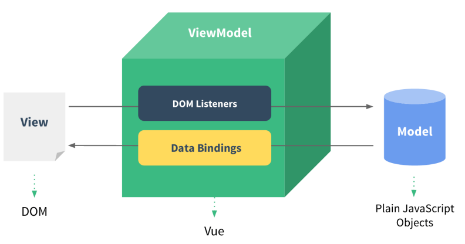
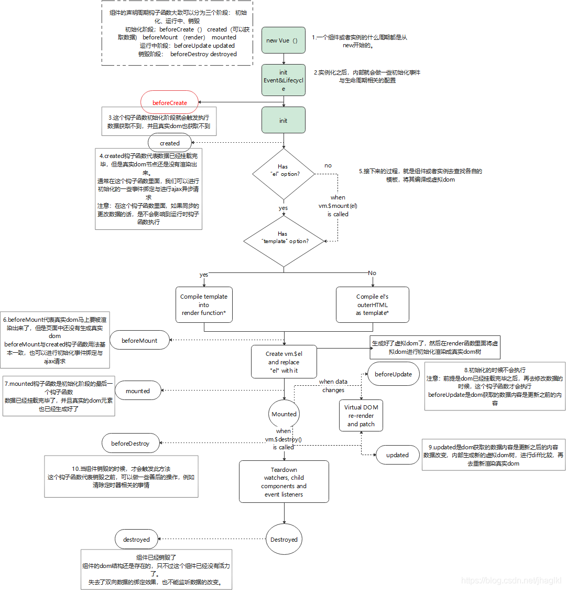
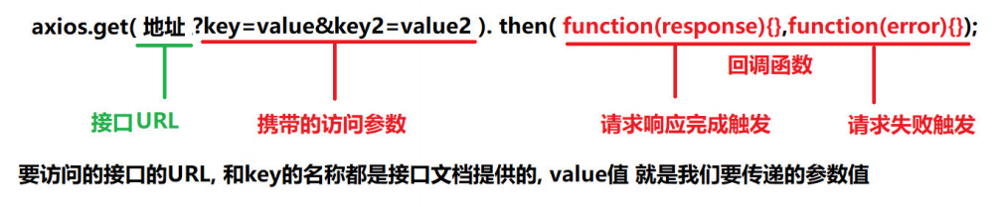

# 大数据学习-Java Day32

## Vue

### 1  vue简介 

#### 概述

-  Vue (读音 /vjuː/，类似于 view) 是一套用于构建用户界面的渐进式框架。 Vue 的核心库只关注视图层，不仅易于 上手，还便于与第三方库或既有项目整合。另一 方面，当与现代化的工具链以及各种支持类库结合使用时，Vue 也完全能够为复杂的单页应用提供驱动。 
  - 特点
    -  JavaScript框架 
    - 简化DOM操作 
    - 响应式数据驱动 
  -  官方网站: https://cn.vuejs.org/v2/guide/

##### MVVM模式

 MVVM是**Model-View-ViewMode**l的简写。它本质上就是MVC 的改进版。  

 MVVM 就是将其中的View 的状态和行为抽象化，让我们将视图 UI 和业务逻辑分开MVVM模式和MVC模式一样， 主要目的是分离视图（View）和模型（Model）Vue.js 是一个提供了 MVVM 风格的双向数据绑定的 Javascript 库，专注于View 层。它的核心是 MVVM 中的 VM，也就是 ViewModel。 ViewModel负责连接 View 和 Model， 保证视图和数据的一致性，这种轻量级的架构让前端开发更加高效、便捷。 

-  MVVM拆分解释为： 
  - Model: 负责数据存储
  -  View: 负责页面展示 
  - View Model: 负责业务逻辑处理（比如Ajax请求等），对数据进行加工后交给视图展示 

-  Vue中的 MVVM 

#### 快速入门

##### 入门案例

 使用vue浏览器中输入  hello vue

1.  引入vue.js库 
2. 创建Vue对象设置el属性和data属性 
3. 使用插值表达式将数据渲染到html页面 

```html
<!DOCTYPE html>
<html lang="en">

<head>
    <meta charset="UTF-8">
    <meta name="viewport" content="width=device-width, initial-scale=1.0">
    <title>Document</title>
    <!-- 1.引入vue.js -->
    <script src="https://cdn.jsdelivr.net/npm/vue/dist/vue.js"></script>
</head>

<body>
    <!-- 3.差值表达式渲染html -->
    <div id="app">
        {{message}}
    </div>
</body>
<script>
    // 2. 创建vue对象， 设置el属性和data属性
    var app = new Vue({
        el: '#app',
        data: {
            message: "hello Vue !!"
        }
    })
</script>

</html>
```

#####  插值表达式 

- 作用：
  - 使用vue中的数据来代替html中的内容
  - 除了能够编写data中的数据，还可以编写一些数学运算
  - 插值表达式中不能写语句，能够写三元运算符
- 作用范围
  - 一定是vue对象接管的范围内，超出范围不会生效，不会被解析

 数据绑定最常见的形式就是使用“Mustache”语法 (双大括号) 的文本插值，Mustache 标签将会被替代为对应数据对 象上属性的值。无论何时，绑定的数据对象上属性发生了改变，插值处的内容都会更新。 Vue.js 都提供了完全的 JavaScript 表达式支持。 

```
{{ dataNum + 1 }}
{{ true ? 'YES' : 'NO' }}
```

 这些表达式会在所属 Vue 实例的数据作用域下作为 JavaScript 被解析。有个限制就是，每个绑定都只能包含单个 表达式，所以下面的例子都不会生效。 

```
<!-- 这是语句，不是表达式 -->
{{ var a = 1 }}
<!-- 流控制也不会生效，请使用三元表达式 -->
{{ if (ok) { return message } }}
```


#####  el挂载 

```html
    <div id="app">
        {{message}}
        <div>{{ message}}</div>
    </div>
```

```js
   var app = new Vue({
        el: '#app',
        data: {
            message: "hello Vue !!"
        }
    })
```

 message中的内容会替代插值表达式{{message}}中的内容.  

- 注意事项：
  1.  Vue管理的el选项命中元素及其子元素都有作用。 比如: id为app的div外使用{{message}} 不能解析,但在内部使 用{{message}}可以解析。
  2. 除了id选择器其他的选择器也可以使用，一次选择多个元素的选择器，插值表达式只有第一个被解析
  3. html和body标签上不能挂使用el挂在。 

#####  data 数据对象  

 当一个 Vue 实例被创建时，它将 data 对象中的所有的 property 加入到 Vue 的响应式系统中。当这些 property 的值发生改变时，视图将会产生“响应”，即匹配更新为新的值 

### 2  Vue常用指令 

#### 指令 

 指令是指v-开头，作用于html标签，提供一些特殊的特性，当指令被绑定到html元素的时候，指令会为被绑 定的元素添加一些特殊的行为，可以将指令看成html的一种属性 

解释：指令 (Directives) 是带有 v- 前缀的特殊属性 

作用：当表达式的值改变时，将其产生的连带影响，响应式地作用于 DOM 

1.  Vue框架提供的语法 
2. 扩展了HTML的能力
3. 减少DOM操作 

##### v-text和v-html  

-  v-text:更新标签中的内容
  -  v-text和插值表达式的区别
    -  v-text 替换整个标签中的所有内容 ；插值表达式: 替换标签中局部的内容 
    - v-text 补充新的内容是 \' ' 连接，插值表达式 \" "+ 连接内容 
-  v-html:更新标签中的内容/标签 
  - 可以渲染内容中的HTML标签 
  - 注意:尽量避免使用，容易造成危险 (XSS跨站脚本攻击) 

```html
<div id="app">
    <!-- v-text指令的值会替换标签内容 -->
    <p>{{str}}</p>
    <p v-text="str"></p>
    <p v-text="str">我是p标签中的内容</p>
    <p v-text="strhtml">我是p标签中的内容</p>
    <p v-html="str"></p>
    <!-- v-html指令的值(包括标签字符串)会替换掉标签的内容 -->
    <p v-html="strhtml">我是p标签中的内容</p>
</div>
<script src="./vue.js"></script>
<script>
    new Vue({
        el: '#app',
        data: {
            str: 'abc',
            strhtml: '<span>content</span>'
        }
    });
</script>
```

- 区别
  - v-html：可以设置标签体之间的html元素
  - v-text：只可设置标签体之间的文本内容

##### v-if和v-show  

-  作用:根据表达式的bool值进行判断是否渲染该元素  
-  区别
   -  v-if，将值从dom中删除
   -  v-show：将值隐藏

```html
<div id="app">
    <!-- 如果isShow的值是true ,就显示p标签 -->
    <p v-if="isShow">我是p标签中的内容</p>
    <p v-show="isShow">我是p标签中的内容</p>
    <!-- 如果标签显示与隐藏切换频繁, 就使用v-show
    v-show本质是通过修改标签的display值
    -->
</div>
<script src="./vue.js"></script>
<script>
    new Vue({
        el: '#app',
        data: {
            isShow: false
        }
    });
</script>

```

>  v-if 有更高的切换开销，而 v-show 有更高的初始渲染开销。 
>
> 因此，如果需要非常频繁地切换，则使用 v-show 较好； 
>
> 如果在运行时条件很少改变，则使用 v-if 较好。 

##### v-on 

- 作用:使用 v-on 指令绑定 DOM 事件，并在事件被触发时执行一些 JavaScript 代码。 
- 语法: @事件名.修饰符 = "methods中的方法名" 
-  注意: $event 可以传形参 

```html
<!DOCTYPE html>
<html lang="en">

<head>
    <meta charset="UTF-8">
    <meta name="viewport" content="width=device-width, initial-scale=1.0">
    <!-- 1.引入vue.js -->
    <script src="https://cdn.jsdelivr.net/npm/vue/dist/vue.js"></script>
    <title>v-on的使用02</title>
</head>

<body>
    <!--
        1.获取元素,操作元素
        点击按钮一 count值增加
        点击按钮二 count值减少
        2.参数传递
        传递count
        传递$event : 如果有一个输入框,键盘按下,只能输入数字,不能输入其他内容.
        需求:有一个文本输入框,只可以输入数字0-9 ,其他内容不能输入.
        -->
    <div id="app">
        <button v-on:click="add">按钮一count增加</button>
        <button @click="sub">按钮二count减少</button>
        <hr>
        <button v-on:click="count += 1">按钮一count增加-方式2</button>
        <button @click="count -= 1">按钮二count减少-方式2</button>
        <hr>
        <button @click="fun(count)">获取元素count</button>
        <hr>
        <button @click="fun1($event)">传递事件对象</button>
        <hr>
        <input type="text" name="name" id="id" @keydown="fun2($event)">
        <h2>{{count}}</h2>
    </div>
</body>
<script>
    var app = new Vue({
        el: "#app",
        data: {
            count: 1
        },
        methods: {
            add: function() {
                this.count += 1
            },
            sub: function() {
                this.count -= 1
            },
            fun: function(c) {
                alert(c)
            },
            fun1: function(e) {
                alert(e);
            },
            fun2: function(e) {
                //获取到键盘事件,可以获取到具体的案件 keyCode
                //alert(e.keyCode)
                //如果按钮大于57 或者按钮小于48 ,阻止事件发生 preventDefault()
                if (e.keyCode > 57 || e.keyCode < 48) {
                    //阻止事件发生
                    e.preventDefault();
                }
            }
        }
    })
</script>

</html>
```

-  修饰符 
  -  语法: 
    - 格式1: v-on:事件名称.修饰符 = "函数名称" 
    - 简写: @事件名.修饰符 = "methods中的方法名"
  -   .once - 只触发一次回调。 
-  按键别名: 
  - .enter
  -  .tab 
  - .delete 
  - .esc 
  - .space 
  - .up 
  - .down 
  - .left .right
  -  .ctrl 
  - .alt 
  - .shift 

##### v-for 

-  根据一组数组或对象的选项列表进行渲染。 
- v-for 指令需要使用 item in items 形式的特殊语法，
-  items 是源数据数组 /对象 
- 当要渲染相似的标签结构时用v-for 

```html
<!DOCTYPE html>
<html lang="en">

<head>
    <meta charset="UTF-8">
    <meta name="viewport" content="width=device-width, initial-scale=1.0">
    <meta http-equiv="X-UA-Compatible" content="ie=edge">
    <title>Document</title>
</head>

<body>
    <div id="app">
        <!-- v-for作用:列表渲染,当遇到相似的标签结构时,就用v-for去渲染
                v-for="元素 in 容器(数组和对象)"
                v-for="数组中的元素 in data中的数组名"
                v-for="对象中的属性值 in data中的对象名"
        -->
        <!-- 数组 -->
        <p v-for="item in list">{{item}}</p>
        <hr>
        <p v-for="(item,index) in list">{{item}}----{{index}}</p>
        <!-- (v,i) in 数组
        v:数组中的每个元素
        i:数组中元素的下标
        -->
        <hr>
        <!-- 对象 -->
        <!-- (v,k,i)in 对象
            v:值
            k:键
            i:对象中每对key-value的索引 从0开始
             注意: v,k,i是参数名,见名知意即可! 
            -->
        <p v-for="value in per">{{value}}</p>
        <hr>
        <p v-for="(value,key) in per">{{value}}----{{key}}</p>
        <hr>
        <p v-for="(value,key,i) in per">{{value}}----{{key}}--{{i}}</p>
    </div>
    <script src="./vue.js"></script>
    <script>
        new Vue({
            el: '#app',
            data: {
                list: ['a', 'b', 'c'],
                per: {
                    name: '老王',
                    age: 38,
                    gender: '男'
                }
            },
            methods: {}
        })
    </script>
</body>

</html>
```

>  注意: 在使用v-for时,要把一个唯一值赋值给:key属性(通常是数组的index或者数据的id) 

```html
<div id="app">
    <!-- v-for
    key属性: 值通常是一个唯一的标识
    key是一个可选属性
    养成好习惯:建议在写v-for时 设置:key="唯一值"
    -->
    <ul>
        <li v-for="(item,index) in list" :key="index">{{item}}---{{index}}</li>
    </ul>
</div>
<script src="./vue.js"></script>
<script>
    new Vue({
        el: '#app',
        data: {
            list: ['a', 'b', 'c']
        },
        methods: {}
    });
</script>
```

##### v-bind 

- 作用: 可以绑定标签上的任何属性。 

- 语法：

   - v-bind:属性名= ”data中的值“
   - 简化格式：```:属性名=“data中的值”```

- 绑定src和alt属性 

  ```html
  <div id="app">
      
  </div>
  <script src="./vue.js"></script>
  <script>
      var vm = new Vue({
          el: '#app',
          data: {
              imgUrl: "img/3.jpg",
              alt: "拉勾图片",
          }
      });
  </script>
  ```

- 绑定class类名

   对象语法和数组语法 

  1. 对象语法

     - v-bind:属性名=“{属性名 : data中的值}”

     - 如果isActive为true，则返回的结果为 \<div class="activee">\</div>
  
       ```css
       .active {
               color: red;
     }
       ```
  
       ```html
       <div id="app">
           <div v-bind:class="{active: isActive}">
               hei
           </div>
           <button @click="changeClassName">点击切换类名</button>
       </div>
       <script src="./vue.js"></script>
       <script>
           var vm = new Vue({
               el: '#app',
               data: {
                   isActive: true
               },
               methods: {
                   changeClassName: function() {
                       this.isActive = !this.isActive;
                   }
               }
           });
     </script>
       ```

  2. 数组语法 

     - v-bind：属性名=“{data中的值1，data中的值2}” 
  
     -  渲染的结果 \<div class="active text-danger">\</div>
  
       ```html
       <div v-bind:class="[activeClass, dangerClass]">
           hei
       </div>
       <script src="./vue.js"></script>
       <script>
           var vm = new Vue({
               el: '#app',
               data: {
                   activeClass: 'active',
                   dangerClass: 'text-danger'
               }
           });
       </script>
       <!-- 简化语法 -->
       <div v-bind:class="{active: isActive}">
       </div>
       <!-- 可以简化为 :，简化语法更常用 -->
     <div :class="{active: isActive}">
       </div>
       
       ```
  
       

##### v-model  

-  作用: 获取和设置表单元素的值(双向数据绑定) 
- 特点: 
  - 双向数据绑定 数据发生变化可以更新到界面 
  - 通过界面可以更改数据 

```html

<!-- 案例:获取和设置表单元素的值(双向数据绑定) -->

<body>
    <div id="app">
        <input type="button" @click="update" value="修改message">
        <input type="text" v-model="message">
        <h2>{{message}}</h2>
    </div>
</body>
<script src="./vue.min.js"></script>
<script>
    var VM = new Vue({
        el: "#app",
        data: {
            message: "拉勾教育大数据训练营"
        },
        methods: {
            update: function() {
                this.message = "拉钩教育";
            }
        }
    })
</script>

```

 v-model指令总结 

1. ​	v-model 指令的作用是便捷的设置和获取表单元素的值 
2. 绑定的数据会和表单元素值相关联 
3. 双向数据绑定 

#### 案例-表格展示 

-  效果演示 

- 功能分析 

  1. 渲染表格 
  2. 删除商品 
  3. 添加商品 

##### 渲染表格 

- 目的:动态渲染表格 数据为Vue实例中data里面的属性items:[] 
  1. 在data中添加商品信息的数组
  2.  v-for渲染列表 
  3. 插值表达式渲染数据 

```html
<tr v-for="item in items">
    <td>{{item.id}}</td>
    <td>{{item.name}}</td>
    <td>{{item.date}}</td>
    <td><a href="#">删除</a></td>
</tr>

<script src="./vue.js"></script>
<script>
    // 1. 实例化Vue对象
    // 2. 设置Vue对象的选项
    new Vue({
        el: '#app',
        data: {
            items: [{
                name: 'LV',
                date: '2020-4-1'
            }, {
                name: 'Lenovo',
                date: '2020-5-1'
            }, {
                name: 'TCL',
                date: '2020-6-1'
            }]
        },
        methods: {}
    })
</script>

```

##### 处理无数据时的渲染 

-  效果: 如果表格中没有数据,展示页面中的"没有品牌数据"  

  ```html
  <tr v-if="items.length === 0">
      <td colspan="4">没有品牌数据</td>
  </tr>
  ```

##### 删除商品

-  效果:点击每个表格中的删除按钮, 当前数据从页面中移除 
  1.  . 绑定click事件
  2.  取消默认点击事件 
  3. 执行删除deleItem方法
  4. 将点击的a所在的tr的位置进行传递(目的是找到当前点击的tr) 
  5.  点击后, 删除当前tr 

```html
<td>
    <!-- 点击删除按钮
    1. 取消默认点击事件
    2. 执行删除deleItem方法
    3. 将所点击的a所在的tr的位置进行传递(目的是找到当前点击的tr)
    4. 点击后, 删除当前tr
    -->
    <a href="#" @click.prevent="deleItem(index)">删除</a>
</td>


 method: {
            deleteItem: function() {
                //确认删除提示
                if (confirm("是否删除")) {
                    //删除一行元素  splice（index，个数）
                    this.items.splice(index, 1);
                }
            }
}

```

##### 添加商品

-  效果:点击添加按钮,向商品列表中添加商品信息 

  1. 绑定click事件 

  2.  在data中添加要绑定的属性name 

  3. v-model绑定name属性 

  4. 点击按钮后,将商品信息添加到items数组中 

     ```html
        <div class="add">
         品牌名称:
         <input type="text" v-model="name">
         <input type="button" value="添加" @click="addItem">
     </div>
        
        
        
        data: {
                 name: ''
             },
             methods: {
                 addItem: function() {
                     console.log('添加按钮被点击');
                     const item = {
                         name: this.name,
                         date: new Date()
                     };
                     this.items.unshift(item)
                 }
             }
     ```

##### 细节处理

-  删除提示框 

  ```js
  deleItem: function(index) {
      // console.log(index);
      if (confirm('是否删除')) {
          this.items.splice(index, 1);
      }
      // console.log(this.items);
  }
  
  ```

-  添加的数据为空时的处理 

  - 如果文本框为空, 提示输入内容 
  - 如果文本框不为空,直接添加 

  ```js
  if (this.name.length === 0) {
      alert('请输入商品信息');
      return;
  }
  this.items.unshift(item);
  
  ```

  -  当商品信息为空时,禁用添加按钮  

  ```html
  <div class="add">
      品牌名称:
      <input type="text" v-model="name">
      <input :disabled="name.length === 0" type="button" value="添加" @click="addItem">
  </div>
  
  ```

  -  添加数据成功后,清空文本输入框  

  ```js
  addItem: function() {
      console.log('添加按钮被点击');
      const item = {
          name: this.name,
          date: new Date()
      };
      if (this.name.length === 0) {
          alert('请输入商品信息');
          return;
      }
      this.items.unshift(item);
      // 添加完毕 清空文本框
      this.name = '';
  }
  ```

##### 完整代码

```html
<!DOCTYPE html>
<html lang="en">

<head>
    <meta charset="UTF-8">
    <meta name="viewport" content="width=device-width, initial-scale=1.0">
    <title>Document</title>
    <script src="https://cdn.jsdelivr.net/npm/vue/dist/vue.js"></script>
</head>

<body>
    <div id="app">
        <table border="1px" width="50%" heigh="450px" align="center" cellspacing="0">
            <tr>
                <th>编号</th>
                <th>名称</th>
                <th>日期</th>
                <th>操作</th>
            </tr>
            <tr v-for="(item, index) in items" align="center">
                <td>{{ index + 1}}</td>
                <td>{{item.name}}</td>
                <td>{{item.date}}</td>
                <td>
                    <a href="#" @click.prevent="deleteItem(index)">删除</a>
                </td>
            </tr>
            <tr align="center">
                <td colspan="4">
                    <input type="text" name="name" v-model="name">
                    <input :disabled="name.length === 0" type="button" value="添加商品" @click="addItem()">
                </td>
            </tr>
        </table>
    </div>
</body>

<script>
    new Vue({
        el: "#app",
        data: {
            items: [{
                name: "华为p40",
                date: "2020/4/10"
            }, {
                name: "Lenovo",
                date: "2020/5/10"
            }, {
                name: "TCL",
                date: "2020/6/10"
            }],
            name: ''
        },
        methods: {
            deleteItem: function(index) {
                //确认删除提示
                if (confirm("是否删除")) {
                    //删除一行元素  splice（index，个数）
                    this.items.splice(index, 1);
                }
            },
            addItem: function() {
                //1.创建一个item元素，设置内容
                var item = {
                        name: this.name,
                        date: new Date().toLocaleDateString()
                    }
                    // 2. 将创建好的item对象添加到items
                this.items.unshift(item);
                // 添加完毕后， 文本框内容删除
                this.name = '';
            }
        }
    })
</script>

</html>
```


### 3 生命周期

#### vue声明周期概述

 vue的生命周期是指从Vue实例创建、运行到销毁期间伴随的这些事件，这些事件对应的函数记录着vue对象的整个 生命周期。 

####  Vue实例的产生过程 

1.  beforeCreate 在实例初始化之后，数据观测和事件配置之前被调用。
2.  created 在实例创建完成后被立即调用。 
3.  beforeMount 在挂载开始之前被调用。 
4. mounted el被新创建的vm.$el替换，并挂载到实例上去之后调用该钩子。
5. beforeUpdate 数据更新时调用，发生在虚拟DOM打补丁之前。 
6. updated 由于数据更改导致的虚拟DOM重新渲染和打补丁，在这之后会调用该钩子。
7.  beforeDestroy 实例销毁之前调用。 
8. destroyed 实例销毁后调用。 

 #### Vue 对象的生命周期流程图



 vue生命周期可以分为八个阶段，分别是：  

-  挂载（初始化相关属性） 
  1. beforeCreate （创建前） 该函数执行时data中的数据和methods中的函数尚未初始化，无法获取
  2.  created （创建后）
  3.  beforeMount (载入前)  可以获取到内存中的data，但是不能获取到页面渲染的数据
  4. mounted （载入后） 此时实现内存和页面同步
-  更新（元素或组件的变更操作） 
  1. beforeUpdate （更新前） 当data数据更改时，该函数触发，内存中已经改变，页面仍然是旧值
  2. updated （更新后）    内存中的数据更改，页面也已经渲染为最新的数据
-  销毁（销毁相关属性） 
  1. beforeDestroy（销毁前） 
  2. destroyed （销毁后）  

 我们如果想在页面加载完毕后就要执行一些操作的话，可以使用created和mounted钩子函数，如下： 

```html
<!DOCTYPE html>
<html lang="en">

<head>
    <meta charset="UTF-8">
    <meta name="viewport" content="width=device-width, initial-scale=1.0">
    <title>vue入门</title>
    <!-- 1.引入vue.js -->
    <script src="https://cdn.jsdelivr.net/npm/vue/dist/vue.js"></script>
</head>

<body>
    <div id="app">
        <span id="sp">{{message}}</span>
        <hr>
        <input type="button" value="更变message" @click="changeMessage">
    </div>
</body>
<script>
    new Vue({
        el: "#app",
        data: {
            message: "拉勾"
        },
        methods: {
            show() {
                console.log("show方法调用了")
            },
            changeMessage() {
                this.message = "拉勾教育!"
            }
        },
        beforeCreate: function() {
            //console.log("获取message = "+this.message)
            //this.show();
        },
        created() {
            // console.log("created获取message = "+this.message);
            // this.show();
        },
        beforeMount() {
            //该方法:可以获取到内存中的data,但是不能获取到页面渲染的数据
            // console.log("获取内存中的message = "+this.message);
            // console.log("页面上的内容="+document.getElementById("sp").innerText)
        },
        mounted() {
            //console.log("获取内存中的message = "+this.message);
            //console.log("页面上的内容="+document.getElementById("sp").innerText)
        },
        beforeUpdate() {
            //当data中的内容该改变是该函数触发
            //console.log("获取内存中的message = "+this.message);
            //console.log("页面上的内容="+document.getElementById("sp").innerText)
        },
        updated() {
            //内存中的数据和页面上的数据一致的.
            console.log("获取内存中的message = " + this.message);
            console.log("页面上的内容=" + document.getElementById("sp").innerText)
        }
    })
</script>

</html>
```

### 4  axios异步访问 

####  axios介绍 

 VUE中结合网络数据进行应用的开发 

- 目前十分流行网络请求库,专门用来发送请求,其内部还是ajax,进行封装之后使用更加方便 
- axios作用: 在浏览器中可以帮助我们完成 ajax异步请求的发送. 

####  axios入门 

使用步骤

1.  导包 

   ```html
   <!-- 官网提供的 axios 在线地址 -->
   <script src="https://unpkg.com/axios/dist/axios.min.js"></script>
   或者去github中下载源码
   https://github.com/axios/axios
   
   ```

2.  请求方式,以GET和POST举例 

   **GET**

   ```JS
   格式1: axios.get(地址?key=value&key2=value2).then(function(response){},function(error){});
   格式2: axios.get(地址,{params:{key1:value1...}}).then(function(response){},function(error){});
   ```

   

   **POST**

   ```JS
   axios.post(地址,{key:value,key2:value2}).then(function(response){},function(error){})
   ```

   根据接口文档，访问测试接口，进行测试

   测试接口

   ```
   https://autumnfish.cn/
   ```


**接口1：随机笑话**

```
请求地址:https://autumnfish.cn/api/joke/list
请求方法:get
请求参数:num(笑话条数,数字)
响应内容:随机笑话

```

```html
<!DOCTYPE html>
<html lang="en">

<head>
    <meta charset="UTF-8">
    <meta name="viewport" content="width=device-width, initial-scale=1.0">
    <title>vue入门</title>
    <!-- 1.引入vue.js -->
    <script src="https://cdn.jsdelivr.net/npm/vue/dist/vue.js"></script>
    <script src="https://unpkg.com/axios/dist/axios.min.js"></script>
</head>

<body>
    <div id="app">
        <input type="button" value="生成笑话" @click="createJoke"> <br>
        <p v-for="(element , index) in joke">
            {{index + 1}}.{{element}}
        </p>
    </div>
</body>
<script>
    /*
            get格式:
            1. axios.get(地址?key1=value1&key2=value).then(function(response {},function(error)
            {})
            2. axios.get(地址,{params:{key1:value1,key2:value2}}).then(function(response {},function(error){})
            请求地址:https://autumnfish.cn/api/joke/list
        请求方法:get
        请求参数:num(笑话条数,数字)
        响应内容:随机笑话
        */
    new Vue({
        el: "#app",
        data: {
            joke: ""
        },
        methods: {
            //函数的目的是获取生成的笑话在p标签中展示
            createJoke() {
                //发送ajax异步请求
                var t = this;
                axios.get("https://autumnfish.cn/api/joke/list", {
                    params: {
                        "num": 5
                    }
                }).then(function(response) {
                    console.log(response.data.jokes);
                    //response.data.jokes 是笑话的数组
                    t.joke = response.data.jokes;
                }, function(error) {})
            }
        }
    })
</script>

</html>
```

 **接口2:用户注册**  

```
请求地址:https://autumnfish.cn/api/user/reg
请求方法:post
请求参数:username(用户名,字符串)
响应内容:注册成功或失败
```


```html
<!DOCTYPE html>
<html lang="en">

<head>
    <meta charset="UTF-8">
    <meta name="viewport" content="width=device-width, initial-scale=1.0">
    <title>Document</title>
    <script src="https://cdn.jsdelivr.net/npm/vue/dist/vue.js"></script>
    <script src="https://unpkg.com/axios/dist/axios.min.js"></script>
</head>


<body>
    <div id="app">
        <input type="text" name="username" v-model="username">
        <input type="button" value="检查用户名是否可以注册" @click="checkUserName">
    </div>
</body>

<script>
    /*
    请求地址:https://autumnfish.cn/api/user/reg
    请求方法:post
    请求参数:username(用户名,字符串)
    响应内容:注册成功或失败
    */
    new Vue({
        el: "#app",
        data: {
            username: ""
        },
        methods: {
            checkUserName() {
                // 1. 获取用户输入的用户名
                var username = this.username;
                //2.发送post方式的ajax请求
                axios.post("https://autumnfish.cn/api/user/reg", {
                    "username": username
                }).then(function(response) {
                    alert(response.data)
                }, function(error) {})
            }
        }
    })
</script>

</html>
```

##### 总结 

1.   axios 必须导包才能使用 
2. 使用get或者post方法,就可以发送请求 
3. then方法中的回调函数,会在请求成功或者请求失败的时候触发 
4. 通过回调函数的形参可以获取响应的内容,或者错误信息 

#####  其他请求类型 

-  axios.request(config) 
- axios.get(url[, config]) 
- axios.delete(url[, config]) 
- axios.head(url[, config]) 
- axios.post(url[, data[, config]]) 
- axios.put(url[, data[, config]]) 
- axios.patch(url[, data[, config]]) 

### 5 vue综合练习

####  天气查询案例 

#####  需求分析 

 输入指定城市点击回车或点击查询,展示从今天开始的四天的天气情况  

#####  接口文档 

```
请求地址:http://wthrcdn.etouch.cn/weather_mini
请求方法:get
请求参数:city (要查询的城市名称)
响应内容:天气信息

```

##### 案例

```html
<!DOCTYPE html>
<html lang="en">

<head>
    <meta charset="UTF-8">
    <meta name="viewport" content="width=device-width, initial-scale=1.0">
    <title>vue入门</title>
    <link rel="stylesheet" href="css/index.css" />
    <!-- 1.引入vue.js -->
    <script src="https://cdn.jsdelivr.net/npm/vue/dist/vue.js"></script>
    <script src="https://unpkg.com/axios/dist/axios.min.js"></script>
</head>

<body>
    <div class="wrap" id="app">
        <div class="search_form">
            <div class="logo">天气查询</div>
            <div class="form_group">
                <!-- 3.绑定点击事件,回车触发,通过v-model绑定数据 -->
                <input v-model="city" @keyup.enter="searchWeather" type="text" class="input_txt" placeholder="请输入要查询的城市" />
                <button class="input_sub" @click="searchWeather">回车查询</button>
            </div>
        </div>
        <ul class="weather_list">
            <!-- 遍历天气信息 -->
            <li v-for="item in weatherList">
                <div class="info_type"><span class="iconfont">{{item.type}}</span></div>
                <div class="info_temp">
                    <b>{{item.low}}</b> ~
                    <b>{{item.high}}</b>
                </div>
                <div class="info_date"><span>{{item.date}}</span></div>
            </li>
        </ul>
    </div>
</body>
<!-- 2.创建vue对象,设置el属性和data属性 -->
<script>
    /*
    1.输入框和添加按钮，给定事件，输入框定义keyup事件，按钮给单机事件，关联同一个函数
    2.获取city名称
    3.发送get方式的ajax请求 ====》查询到5天的天气情况
    4.遍历天气，把天气放到li中
    */
    var VM = new Vue({
        el: "#app",
        data: {
            city: '',
            //定义空数组接收天气信息
            weatherList: []
        },
        //编写查询天气方法
        methods: {
            searchWeather: function() {
                console.log("天气查询");
                console.log(this.city);
                //保存this,方便在回调函数中使用
                var that = this;
                //调用接口
                axios.get("http://wthrcdn.etouch.cn/weather_mini?city=" + this.city)
                    .then(function(respose) {
                        //console.log(respose);
                        //只获取天气数组
                        console.log(respose.data.data.forecast);
                        that.weatherList = respose.data.data.forecast;
                    }, function(error) {});
            }
        }
    })
</script>

</html>
```

css

```css
        body {
            font-family: 'Microsoft YaHei';
        }
        
        .wrap {
            position: fixed;
            left: 0;
            top: 0;
            width: 100%;
            height: 100%;
            background: #fff;
        }
        
        .search_form {
            width: 640px;
            margin: 100px auto 0;
        }
        
        .logo {
            font-size: 40px;
            text-align: center;
        }
        
        .logo img {
            display: block;
            margin: 0 auto;
        }
        
        .form_group {
            width: 640px;
            height: 40px;
            margin-top: 45px;
        }
        
        .input_txt {
            width: 538px;
            height: 38px;
            padding: 0px;
            float: left;
            border: 1px solid #427903;
            outline: none;
            text-indent: 10px;
        }
        
        .input_sub {
            width: 100px;
            height: 40px;
            border: 0px;
            float: left;
            background-color: #427903;
            color: #fff;
            font-size: 16px;
            outline: none;
            cursor: pointer;
            position: relative;
        }
        
        .input_sub.loading::before {
            content: '';
            position: absolute;
            left: 0;
            top: 0;
            width: 100%;
            height: 100%;
            background: url('img/loading.gif');
        }
        
        .hotkey {
            margin: 3px 0 0 2px;
        }
        
        .hotkey a {
            font-size: 14px;
            color: #666;
            padding-right: 15px;
        }
        
        .weather_list {
            height: 200px;
            text-align: center;
            margin-top: 50px;
            font-size: 0px;
        }
        
        .weather_list li {
            display: inline-block;
            width: 140px;
            height: 200px;
            padding: 0 10px;
            overflow: hidden;
            position: relative;
            background: url("img/line.png") right center no-repeat;
            background-size: 1px 130px;
        }
        
        .weather_list li:last-child {
            background: none;
        }
        /* .weather_list .col02{
background-color: rgba(65, 165, 158, 0.8);
}
.weather_list .col03{
background-color: rgba(94, 194, 237, 0.8);
}
.weather_list .col04{
background-color: rgba(69, 137, 176, 0.8);
}
.weather_list .col05{
background-color: rgba(118, 113, 223, 0.8);
} */
        
        .info_date {
            width: 100%;
            height: 40px;
            line-height: 40px;
            color: #999;
            font-size: 14px;
            left: 0px;
            bottom: 0px;
            margin-top: 15px;
        }
        
        .info_date b {
            float: left;
            margin-left: 15px;
        }
        
        .info_type span {
            color: #5bb1eb;
            font-size: 30px;
            line-height: 80px;
        }
        
        .info_temp {
            font-size: 14px;
            color: #5bb1eb;
        }
        
        .info_temp b {
            font-size: 13px;
        }
        
        .tem .iconfont {
            font-size: 50px;
        }
```

##### 案例总结

1.  应用的逻辑代码,建议与页面进行分离,使用单独的JS编写 
2.  axios回调函数中的 this的指向改变,无法正常使用, 需要另外保存一份
3. 服务器返回的数据比较的复杂时,获取数据时要注意层级结构 