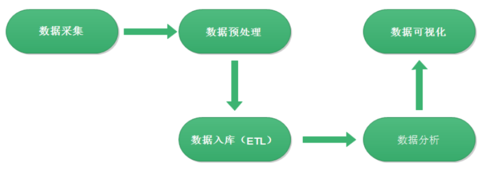
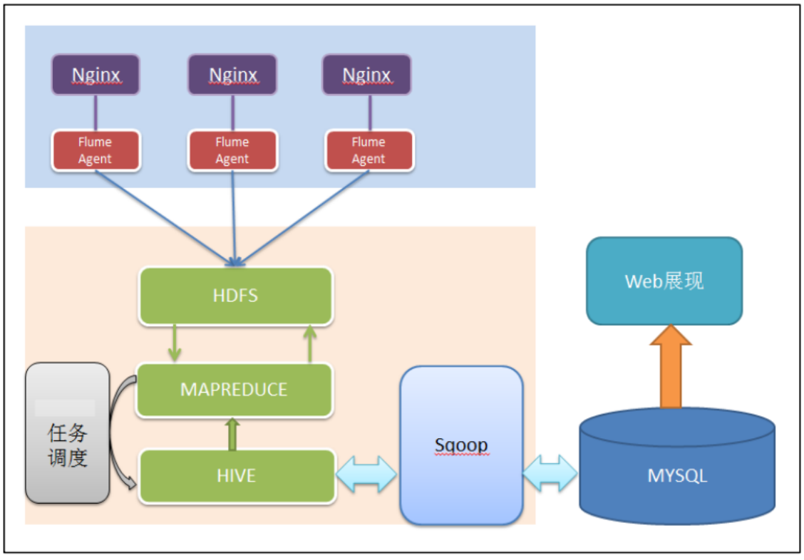
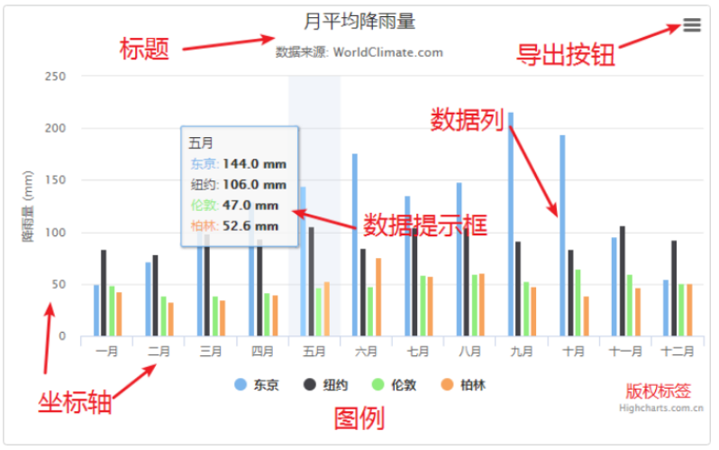
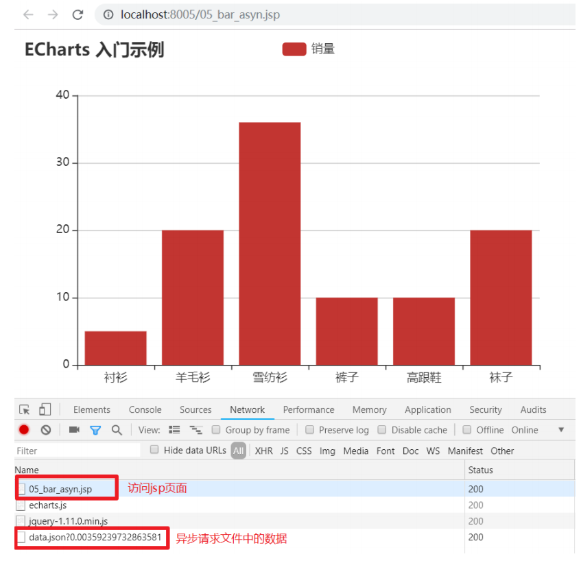

# 大数据学习-Java Day33

## 数据可视化

### 1 数据可视化概述

#### 定义

 数据可视化是把冰冷的数据转换成图形, 展示数据中蕴含的规律和逻辑. 借助图形化手段可以更清晰有效的传递信息。 

#### 作用

1.  可视化数据更直观，更容易理解 
2. 能够通过不同的维度，使用不同的方式展示数据。 
3. 与数据交互 
4. 建设性讨论结果 
5. 理解运营和结果之间的连接  

#### 可视化实现方式

| 可视化工具 | 描述                                                         | 适用人群              |
| ---------- | ------------------------------------------------------------ | --------------------- |
| D3.js      | D3.js是一个JavaScript库，用于根据数据处理文档 入门难度, 最小的 开销，D3非常快 | 开发工程师            |
| Echarts    | 百度提供,apache托管, 入手容易,效果丰富                       | 开发工程师            |
| AntV       | AntV 是蚂蚁金服全新一代数据可视化解决方案,特点 简单方便、专业 可靠 | 开发工程师            |
| HighCharts | 纯 JavaScript 编写的一个图表库,效果丰富,非商用免费           | 开发工程师            |
| Tableau    | (收费)商用企业级报表工具,用于数据分析帮助人们查看并理解数据  | BI工程师、数据 分析师 |
| 阿里DataV  | (收费)商用企业级报表工具 , 可视化大屏类                      | BI工程师、数据 分析师 |

#### 可视化的应用

 数据分析，其整体流程基本上就是 依据数据的处理流转流程进行。通俗可以概括为：数据从哪里来和数据到哪里 去， 最终的数据如何展示 , 可以分为以下几个大的步骤  



-  数据采集 
  - 一是数据从无到有产生的过程（服务器打印的 log、自定义采集的日志等） 叫做数据采集； 
  - 另一方面也有把通过使用 Flume 等工具把数据采集搬运到指定位置的这个 过程叫做数据采集 
-  数据预处理 
  - 现实世界中数据大体上都是不完整，不一致的脏数据，无法直接进行数据 分析，或者说不利于分析。 为了提高数 据分析的质量和便捷性产生了数据预处理 技术 . 
  - 数据预处理有多种方法：数据清理，数据集成，数据变换等。这些数据处理 技术在正式数据分析之前使用，大大提 高了后续数据分析的质量与便捷，降低实 际分析所需要的时间 ; 使用 MapReduce 实现. 
- 数据入库 
  - 预处理完的结构化数据通常会导入到 Hive 数据仓库中，建立相应的库和表 与之映射关联 。 
  - 入库过程有个更加专业的叫法—ETL。 ETL 是将业务系统的数据经 过抽取、清洗转换之后加载到数据仓库的过程， 目的是将企业中的分散、零乱、 标准不统一的数据整合到一起，为企业的决策提供分析依据。 
- 数据分析 
  - 根据需求使用 Hive SQL 分析语句，得出指标 各种统计结果 
- 数据可视化 
  - 将分析所得数据结果进行数据可视化，一般通过图表进行展示 
  - 数据可视化可以帮你更容易的解释趋势和统计数据 

#### 系统架构

1.  数据采集： 页面埋点 JavaScript 采集； 开源框架 Apache Flume 
2. 数据预处理： Hadoop MapReduce 程序 
3.  数据仓库技术：基于 hadoop 的数据仓库 Hive
4. 数据导出：基于 hadoop 的 sqoop 数据导入导出工具 
5. 数据可视化：定制开发 web 程序(echarts) 
6. 整个过程的流程调度： hadoop 生态圈中的 azkaban 工具 



 Flume是Cloudera提供的一个高可用的，高可靠的，分布式的海量日志采集、聚合和传输的系统 . 

HDFS 分布式文件系统 ,是一个高度容错性的系统，适合部署在廉价的机器上。HDFS能提供高吞吐量的数据 访问，非常适合大规模数据集上的应用 

MapReduce是一种编程模型，用于大规模数据集（大于1TB）的并行运算 

Hive是基于Hadoop的一个数据仓库工具，可以将结构化的数据文件映射为一张数据库表，并提供类SQL查询 功能。 

Sqoop是一款开源的工具，主要用于在Hadoop(Hive)与传统的数据库(mysql)间进行数据的传递，可以将一 个关系型数据库（例如 ： MySQL ,Oracle ,Postgres等）中的数据导进到Hadoop的HDFS中，也可以将HDFS 的数据导进到关系型数据库中  

### 2  HighCharts 

 #### HighCharts概述

 Highcharts 系列软件包含 Highcharts JS，Highstock JS，Highmaps JS 共三款软件，均为纯 JavaScript 编写的 HTML5 图表库，全部源码开放，个人及非商业用途可以任意使用及源代码编辑。  

#####  Highcharts 

 Highcharts 是一个用纯 JavaScript 编写的一个图表库， 能够很简单便捷的在 Web 网站或是 Web 应用程序添加有 交互性的图表，并且免费提供给个人学习、个人网站和非商业用途使用。 

Highcharts 支持的图表类型有直线图、曲线图、区域图、柱状图、饼状图、散状点图、仪表图、气泡图、瀑布流 图等多达 20 种图表，其中很多图表可以集成在同一个图形中形成混合图。 

#####  Highstock 

 Highstock 是用纯 JavaScript 编写的股票图表控件，可以开发股票走势或大数据量的时间轴图表。它包含多个高级 导航组件：预设置数据时间范围，日期选择器、滚动条、平移、缩放功能。  

#####  Highmaps 

 Highmaps 是一款基于 HTML5 的优秀地图组件。 

 Highmaps 继承了 Highcharts 简单易用的特性，利用它可以方便快捷的创建用于展现销售、选举结果等其他与地 理位置关系密切的交互性地图图表。 

Highmaps 可以单独使用，也可以作为 Highcharts 的一个组件来使用。 

#####  HighCharts的优势 

-  兼容性好 
- 源代码开源 
- 纯 Javascript 
- 图表类型丰富 
- 丰富的交互特性 
- 多轴支持 
- 动态提示框 
- 图表导出和打印功能 
- 图表缩放 
- 支持外部数据加载 
- 支持扩展及二次开发 

####  下载与使用 

#####  下载资源包 

下载地址[https://www.highcharts.com.cn/download ] 

```
|-- examples 					例子
|-- gfx 						例子用到的图片资源
|-- graphics 					例子用到的图片资源
|-- code 						所有 js 文件及源代码
    |-- css 					Highcharts css 文件（只用于 CSS 版本 Highcharts）
    |-- lib 					相关的库文件
    |-- modules 				功能模块文件目录
    |-- themes 					主题文件目录
    |-- highcharts.js 			highcharts 主文件
    |-- highcharts.src.js	 	highcharts 主文件源码
    |-- highcharts-3d.js 		highcharts 3d 功能文件
    |-- highcharts-3d.src.js 	highcharts 3d 功能文件源码
    |-- highcharts-more.js 		highcharts 增加功能文件
    |-- highcharts-more.src.js 	highcharts 增加功能文件源码
    |-- readme.txt 				源代码目录说明文件
|-- index.htm 					例子入口文件
|-- license.pdf 				使用协议文档
|-- readme.txt 					说明文件
```

 也可以直接使用我们的 CDN 文件而不用下载，速度快和稳定是 CDN 服务的优势  

```html
// Highcharts
<script src="http://cdn.highcharts.com.cn/highcharts/8.1.2/highcharts.js"></script>
// Highcharts Stock
<script src="http://cdn.highcharts.com.cn/highstock/8.1.2/highstock.js"></script>
// Highcharts Maps
<script src="http://cdn.highcharts.com.cn/highmaps/8.1.2/highmaps.js"></script>
// Highcharts Gantt
<script src="http://cdn.highcharts.com.cn/gantt/8.1.2/highcharts-gantt.js"></script>
```

##### 简单应用

-  基础使用 

  -  Highcharts 最基本的运行只需要一个 JS 文件，即 ```highcharts.js``` ，例如引入下面的文件即可创建基础的图表了。  

    ```html
    <script src="http://cdn.highcharts.com.cn/highcharts/highcharts.js"></script>
    ```

-  功能模块 

  - 功能模块是在 Highcharts 主要功能的基础做的扩展，是由官方发布的功能包，
  - 常用功能模块有： 
    - 更多图表类型扩展模块（ highcharts-more.js ） 
    - 3D 图表模块 （ highcharts-3d.js ） 
    - 导出功能模块（ modules/exporting.js ） 
    - 金字塔图表类型（ modules/funnel.js ） 
    - 钻取功能模块（ modules/drilldown.js ） 
    - 数据加载功能模块（ modules/data.js  

-  Highstock 和 Highmaps 

  -  Highstock 和 Highmaps 是另外两款针对不同使用场景的图表产品，三款产品之间相互独立又有密切关系，
  - 他们关 系和混合使用的说明如下 
    - Highcharts 基础图表 
    - Highstock 股票及大数据量时间轴图表 
    - Highmaps 地图  

   **Highstock 是完全包含 Highcharts 的，是在 Highcharts 的基础上增加了更多高级功能；Highmaps 则完全独立， 不过我们提供了地图功能模块 map.js （在 Highmaps 资源包的 modules 目录）供 Highcharts 或 Highstock 调 用。** 

-  **混合使用** 

  1.  Highcharts + Highstock 时只需要引入 highstock.js 

     ```html
     <script src="http://cdn.highcharts.com.cn/highstock/highstock.js"></script>
     ```

     

  2.  Highcharts + Highmaps 混合使用是需要 引入 highcharts.js + map.js 

     ```html
     <script src="http://cdn.highcharts.com.cn/highcharts/highcharts.js"></script>
     <script src="http://cdn.highcharts.com.cn/highmaps/modules/map.js"></script>
     ```

     

  3.  Highstock + Highmaps 或 Highcharts + Highstock + Highmaps 混合使用时需引入 highstock.js + map.js  

     ```html
     <script src="http://cdn.highcharts.com.cn/highstock/highstock.js"></script>
     <script src="http://cdn.highcharts.com.cn/highmaps/modules/map.js"></script>
     ```

#### 入门案例

 使用highcharts实现一个简单的柱状图表 三个步骤 

1.  引入 Highcharts 

   ```html
   <script src="http://cdn.highcharts.com.cn/highcharts/highcharts.js"></script>
   ```

   

2.  创建一个简单的图表  

   ```html
   <!-- 在绘图前我们需要为 Highcharts 准备一个 DOM 容器，并指定其大小 -->
   <div id="container" style="width: 600px;height:400px;"></div>
   ```

   

3.  Highcharts 的初始化函数 Highcharts.chart 来创建图表，该函数接受两个参数，第一个参数是 DOM 容器的 Id，第二个参数是图表配置 

   ```html
   <!DOCTYPE html>
   <html>
   
   <head>
       <meta charset="utf-8">
       <title>第一个 Highcharts 图表</title>
   </head>
   
   <body>
       <!-- 图表容器 DOM -->
       <div id="container" style="width: 600px;height:400px;"></div>
       <!-- 引入 highcharts.js -->
       <script src="http://cdn.highcharts.com.cn/highcharts/highcharts.js"></script>
       <script>
           // 图表配置
           var options = {
               chart: {
                   type: 'bar' //指定图表的类型，默认是折线图（line）
               },
               title: {
                   text: '我的第一个图表' // 标题
               },
               xAxis: {
                   categories: ['苹果', '香蕉', '橙子'] // x 轴分类
               },
               yAxis: {
                   title: {
                       text: '吃水果个数' // y 轴标题
                   }
               },
               series: [{ // 数据列
                   name: '小明', // 数据列名
                   data: [1, 0, 4] // 数据
               }, {
                   name: '小红',
                   data: [5, 7, 3]
               }]
           };
           // 图表初始化函数
           var chart = Highcharts.chart('container', options);
       </script>
   </body>
   
   </html>
   ```

####  基本使用 

 一般情况下，Highcharts 包含标题（Title）、坐标轴（Axis）、数据列（Series）、数据提示框（Tooltip）、图例 （Legend）、版权标签（Credits）等，另外还可以包括导出功能按钮（Exporting）、标示线（PlotLines）、标 示区域（PlotBands）等 



-  标题（Title） 
  - 图表标题，包含标题和副标题（subTitle），其中副标题是非必须的。 
-  坐标轴（Axis） 
  - 坐标轴包含x轴（xAxis）和y轴（yAxis）。通常情况下，x轴显示在图表的底部，y轴显示在图表的左侧。多个数据 列可以共同使用同一个坐标轴，为了对比或区分数据，Highcharts提供了多轴的支持。 
- 数据列（Series） 
  - 数据列即图表上一个或多个数据系列，比如曲线图中的一条曲线，柱状图中的一个柱形。 
- 数据提示框（Tooltip） 
  - 当鼠标悬停在某点上时，以框的形式提示该点的数据，比如该点的值、数据单位等。数据提示框内提示的信息完全 可以通过格式化函数动态指定。
-  图例（Legend） 
  - 图例是图表中用不同形状、颜色、文字等 标示不同数据列，通过点击标示可以显示或隐藏该数据列。
- 版权标签（Credits） 
  - 显示在图表右下方的包含链接的文字，默认是Highcharts官网地址。通过指定credits.enabled=false即可不显示该 信息。
- 导出功能（Exporting） 
  - 通过引入 exporting.js即可增加图表导出为常见文件功能。 
-  标示线（PlotLines） 
  - 可以在图表上增加一条标示线，比如平均值线，最高值线等。
- 标示区（PlotBands） 
  - 可以在图表添加不同颜色的区域带，标示出明显的范围区域。 

#### 图表介绍

##### 折线图

```html
<!DOCTYPE html>
<html>

<head>
    <meta charset="utf-8">
    <title>折线图</title>
</head>

<body>
    <!-- 图表容器 DOM -->
    <div id="container" style="min-width:400px;height:400px"></div>
</body>
<script src="js/highcharts.js"></script>
<script>
    var chart = Highcharts.chart('container', {
        chart: {
            type: 'line'
        },
        title: {
            text: '月平均气温'
        },
        subtitle: {
            text: '数据来源: WorldClimate.com'
        },
        xAxis: {
            categories: ['一月', '二月', '三月', '四月', '五月', '六月', '七月', '八月', '九月',
                '十月', '十一月', '十二月'
            ]
        },
        yAxis: {
            title: {
                text: '气温 (°C)'
            }
        },
        plotOptions: {
            line: {
                dataLabels: {
                    // 开启数据标签
                    enabled: true
                },
                // 关闭鼠标跟踪，对应的提示框、点击事件会失效
                enableMouseTracking: false
            }
        },
        series: [{
            name: '东京',
            data: [7.0, 6.9, 9.5, 14.5, 18.4, 21.5, 25.2, 26.5, 23.3, 18.3, 13.9, 9.6]
        }, {
            name: '伦敦',
            data: [3.9, 4.2, 5.7, 8.5, 11.9, 15.2, 17.0, 16.6, 14.2, 10.3, 6.6, 4.8]
        }]
    });
</script>

</html>
```

#####  柱状图 

```html
<!DOCTYPE html>
<html>

<head>
    <meta charset="utf-8">
    <title>第一个柱状图表</title>
    <script src="http://cdn.highcharts.com.cn/highcharts/highcharts.js"></script>
</head>

<body>
    <!-- 图表容器 DOM -->
    <div id="container" style="min-width:400px;height:400px"></div>
</body>
<script>
    var chart = Highcharts.chart('container', {
        chart: {
            type: 'column'
        },
        title: {
            text: '月平均降雨量'
        },
        subtitle: {
            text: '数据来源: WorldClimate.com'
        },
        xAxis: {
            categories: [
                '一月', '二月', '三月', '四月', '五月', '六月', '七月', '八月', '九月', '十月', '十一月', '十二月'
            ]
        },
        yAxis: {
            min: 0,
            title: {
                text: '降雨量 (mm)'
            },
        },
        tooltip: {
            // head + 每个 point + footer 拼接成完整的 table
            headerFormat: '<span style="font-size:10px">{point.key}</span><table>',
            pointFormat: '<tr><td style="color:{series.color};padding:0">{series.name}: </td>' +
                '<td style="padding:0"><b>{point.y:.1f} mm</b></td></tr>',
            footerFormat: '</table>',
            shared: true,
            useHTML: true
        },
        plotOptions: {
            column: {
                borderWidth: 0
            }
        },
        series: [{
            name: '东京',
            data: [49.9, 71.5, 106.4, 129.2, 144.0, 176.0, 135.6, 148.5, 216.4, 194.1, 95.6, 54.4]
        }, {
            name: '纽约',
            data: [83.6, 78.8, 98.5, 93.4, 106.0, 84.5, 105.0, 104.3, 91.2, 83.5, 106.6, 92.3]
        }, {
            name: '伦敦',
            data: [48.9, 38.8, 39.3, 41.4, 47.0, 48.3, 59.0, 59.6, 52.4, 65.2, 59.3, 51.2]
        }, {
            name: '柏林',
            data: [42.4, 33.2, 34.5, 39.7, 52.6, 75.5, 57.4, 60.4, 47.6, 39.1, 46.8, 51.1]
        }]
    });
</script>

</html>
```

#####  饼图 

```html
<!DOCTYPE html>
<html>

<head>
    <meta charset="utf-8">
    <title>第一个 Highcharts 图表</title>
    <script src="http://cdn.highcharts.com.cn/highcharts/highcharts.js"></script>
</head>

<body>
    <!-- 图表容器 DOM -->
    <div id="container" style="min-width:400px;height:400px"></div>
</body>
<script>
    Highcharts.chart('container', {
        chart: {
            plotBackgroundColor: null,
            plotBorderWidth: null,
            plotShadow: false,
            type: 'pie'
        },
        title: {
            text: '2018年1月浏览器市场份额'
        },
        tooltip: {
            pointFormat: '{series.name}: <b>{point.percentage:.1f}%</b>'
        },
        plotOptions: {
            pie: {
                allowPointSelect: true,
                cursor: 'pointer',
                dataLabels: {
                    enabled: true,
                    format: '<b>{point.name}</b>: {point.percentage:.1f} %',
                    style: {
                        color: (Highcharts.theme && Highcharts.theme.contrastTextColor) || 'black'
                    }
                }
            }
        },
        series: [{
            name: 'Brands',
            colorByPoint: true,
            data: [{
                name: 'Chrome',
                y: 61.41,
                sliced: true,
                selected: true
            }, {
                name: 'Internet Explorer',
                y: 11.84
            }, {
                name: 'Firefox',
                y: 10.85
            }, {
                name: 'Edge',
                y: 4.67
            }, {
                name: 'Safari',
                y: 4.18
            }, {
                name: 'Sogou Explorer',
                y: 1.64
            }, {
                name: 'Opera',
                y: 1.6
            }, {
                name: 'QQ',
                y: 1.2
            }, {
                name: 'Other',
                y: 2.61
            }]
        }]
    });
</script>

</html>
```

#####  面积图 

```html
<!DOCTYPE html>
<html>

<head>
    <meta charset="utf-8">
    <title>第一个 Highcharts 图表</title>
</head>

<body>
    <!-- 图表容器 DOM -->
    <div id="container" style="min-width:400px;height:400px"></div>
</body>
<script src="http://cdn.highcharts.com.cn/highcharts/highcharts.js"></script>
<script>
    var chart = Highcharts.chart('container', {
        chart: {
            type: 'area'
        },
        title: {
            text: '美苏核武器库存量'
        },
        subtitle: {
            text: '数据来源: <a
            href = "https://thebulletin.metapress.com/content/c4120650912x74k7/fulltext.pdf" > ' +
            'thebulletin.metapress.com</a>'
        },
        xAxis: {
            allowDecimals: false
        },
        yAxis: {
            title: {
                text: '核武库国家'
            },
            labels: {
                formatter: function() {
                    return this.value / 1000 + 'k';
                }
            }
        },
        tooltip: {
            pointFormat: '{series.name} 制造 <b>{point.y:,.0f}</b>枚弹头'
        },
        plotOptions: {
            area: {
                pointStart: 1940,
                marker: {
                    enabled: false,
                    symbol: 'circle',
                    radius: 2,
                    states: {
                        hover: {
                            enabled: true
                        }
                    }
                }
            }
        },
        series: [{
            name: '美国',
            data: [null, null, null, null, null, 6, 11, 32, 110, 235, 369, 640,
                1005, 1436, 2063, 3057, 4618, 6444, 9822, 15468, 20434, 24126,
                27387, 29459, 31056, 31982, 32040, 31233, 29224, 27342, 26662,
                26956, 27912, 28999, 28965, 27826, 25579, 25722, 24826, 24605,
                24304, 23464, 23708, 24099, 24357, 24237, 24401, 24344, 23586,
                22380, 21004, 17287, 14747, 13076, 12555, 12144, 11009, 10950,
                10871, 10824, 10577, 10527, 10475, 10421, 10358, 10295, 10104
            ]
        }, {
            name: '苏联/俄罗斯',
            data: [null, null, null, null, null, null, null, null, null, null,
                5, 25, 50, 120, 150, 200, 426, 660, 869, 1060, 1605, 2471, 3322,
                4238, 5221, 6129, 7089, 8339, 9399, 10538, 11643, 13092, 14478,
                15915, 17385, 19055, 21205, 23044, 25393, 27935, 30062, 32049,
                33952, 35804, 37431, 39197, 45000, 43000, 41000, 39000, 37000,
                35000, 33000, 31000, 29000, 27000, 25000, 24000, 23000, 22000,
                21000, 20000, 19000, 18000, 18000, 17000, 16000
            ]
        }]
    });
</script>

</html>
```

#####  地图highmap 

```html
<!DOCTYPE html>
<html lang="en">

<head>
    <meta charset="UTF-8">
    <title>中国地图</title>
</head>

<body>
    <div id="map" style="width:800px;height: 500px;"></div>
    <script src="https://img.hcharts.cn/highmaps/highmaps.js"></script>
    <script src="https://data.jianshukeji.com/geochina/china.js"></script>
    <script>
        // 随机数据
        var data = [{
            "name": "北京",
            "value": 69
        }, {
            "name": "天津",
            "value": 14
        }, {
            "name": "河北",
            "value": 55
        }, {
            "name": "山西",
            "value": 60
        }, {
            "name": "内蒙古",
            "value": 44
        }, {
            "name": "辽宁",
            "value": 89
        }, {
            "name": "吉林",
            "value": 98
        }, {
            "name": "黑龙江",
            "value": 8
        }, {
            "name": "上海",
            "value": 41
        }, {
            "name": "江苏",
            "value": 19
        }, {
            "name": "浙江",
            "value": 35
        }, {
            "name": "安徽",
            "value": 83
        }, {
            "name": "福建",
            "value": 24
        }, {
            "name": "江西",
            "value": 81
        }, {
            "name": "山东",
            "value": 28
        }, {
            "name": "河南",
            "value": 83
        }, {
            "name": "湖北",
            "value": 52
        }, {
            "name": "湖南",
            "value": 47
        }, {
            "name": "广东",
            "value": 91
        }, {
            "name": "广西",
            "value": 92
        }, {
            "name": "海南",
            "value": 84
        }, {
            "name": "重庆",
            "value": 10
        }, {
            "name": "四川",
            "value": 91
        }, {
            "name": "贵州",
            "value": 69
        }, {
            "name": "云南",
            "value": 30
        }, {
            "name": "西藏",
            "value": 12
        }, {
            "name": "陕西",
            "value": 19
        }, {
            "name": "甘肃",
            "value": 31
        }, {
            "name": "青海",
            "value": 10
        }, {
            "name": "宁夏",
            "value": 10
        }, {
            "name": "新疆",
            "value": 34
        }, {
            "name": "台湾",
            "value": 43
        }, {
            "name": "香港",
            "value": 98
        }, {
            "name": "澳门",
            "value": 15
        }, {
            "name": "南海诸岛",
            "value": 89
        }, {
            "name": "南海诸岛",
            "value": 77
        }];
        // 初始化图表
        var map = new Highcharts.Map('map', {
            title: {
                text: '中国地图'
            },
            colorAxis: {
                min: 0,
                minColor: 'rgb(255,255,255)',
                maxColor: '#006cee'
            },
            series: [{
                data: data,
                name: '随机数据',
                mapData: Highcharts.maps['cn/china'],
                joinBy: 'name' // 根据 name 属性进行关联
            }]
        });
    </script>
</body>

</html>
```

#####  异步加载数据  

```html
<!DOCTYPE html>
<html lang="en">

<head>
    <meta charset="utf-8">
    <title>AJAX异步请求数据</title>
    <script src="http://cdn.highcharts.com.cn/highcharts/highcharts.js"></script>
    <script src="http://cdn.highcharts.com.cn/highmaps/modules/map.js"></script>
    <script src="https://cdn.bootcdn.net/ajax/libs/jquery/3.5.1/jquery.min.js"></script>
</head>

<body>
    <div id="container" style="min-width:400px;height:400px"></div>
    <script type="text/javascript">
        $(function() {
            var options = {
                chart: {
                    renderTo: 'container',
                    type: 'line' //line column
                },
                title: {
                    text: '异步获取数据'
                },
                subtitle: {
                    text: '折线图',
                    x: -20
                },
                xAxis: {
                    categories: ['1月', '2月', '3月', '4月', '5月', '6月',
                        '7月', '8月', '9月', '10月', '11月', '12月'
                    ]
                },
                yAxis: {
                    title: {
                        text: '温度 (°C)'
                    },
                    plotLines: [{
                        value: 0,
                        width: 1,
                        color: '#808080'
                    }]
                },
                tooltip: {
                    valueSuffix: '°C'
                },
                legend: {
                    layout: 'vertical',
                    align: 'right',
                    verticalAlign: 'middle',
                    borderWidth: 0
                },
                Loading: {
                    hideDuration: 1000, //淡出效果的持续时间（以毫秒为单位）
                    showDuration: 1000, //淡入效果的持续时间（以毫秒为单位）
                    labelStyle: { //加载标签的span的CSS样式
                        fontStyle: 'italic',
                        color: 'red',
                        fontSize: "40px"
                    },
                    style: { //覆盖在绘图区的加载页面的样式
                        position: 'absolute',
                        backgroundColor: 'white',
                        opacity: 0.5,
                        textAlign: 'center',
                        color: 'red'
                    }
                },
                credits: {
                    enabled: false
                },
                series: []
            }
            var oChart = null;
            oChart = new Highcharts.Chart(options);
            Load_SeriesData();

            function Load_SeriesData() {
                oChart.showLoading("Loading....");
                $.ajax({
                    url: 'city.json',
                    type: 'GET',
                    dataType: 'json',
                    success: function(Data) {
                        alert(Data)
                        console.log(Data);
                        for (i = 0; i < Data.length; i++) {
                            var DataSeries = {
                                name: Data[i].name,
                                data: Data[i].arc
                            };
                            oChart.addSeries(DataSeries);
                        }
                        oChart.hideLoading("Loading....");
                    }
                });
            }
        });
    </script>
</body>

</html>
```

```js
[
    {
        "name":"江苏",
        "arc":[7.0, 6.9, 9.5, 14.5, 18.2, 21.5, 25.2, 26.5, 23.3, 18.3, 13.9, 9.6]
    },
    {
        "name":"北京",
        "arc":[-0.2, 0.8, 5.7, 11.3, 17.0, 22.0, 24.8, 24.1, 20.1, 14.1, 8.6, 2.5]
    },
    {
        "name":"上海",
        "arc":[-0.9, 0.6, 3.5, 8.4, 13.5, 17.0, 18.6, 17.9, 14.3, 9.0, 3.9, 1.0]
    },{
        "name":"江西",
        "arc":[3.9, 4.2, 5.7, 8.5, 11.9, 15.2, 17.0, 16.6, 14.2, 10.3, 6.6, 4.8]
    }
]
```

### 3  ECharts 

#### 概述

 ECharts缩写来自Enterprise Charts，商业级数据图表，是百度的一个开源的使用JavaScript实现的数据可视化工 具，可以流畅的运行在 PC 和移动设备上，兼容当前绝大部分浏览器（IE8/9/10/11，Chrome，Firefox，Safari 等），底层依赖轻量级的矢量图形库 ZRender，提供直观、交互丰富、可高度个性化定制的数据可视化图表。 

官网：https://echarts.baidu.com/ 

下载地址：https://echarts.baidu.com/download.html  

下载之后解压zip文件， 将dist目录下的echarts.js文件引入到页面上就可以了 

####  五分钟上手 ECharts 

 我们可以参考官方提供的5分钟上手ECharts文档感受一下ECharts的使用方式，

地址如下： https://www.echartsjs.com/tutorial.html#5%20%E5%88%86%E9%92%9F%E4%B8%8A%E6%89%8B%20EChar ts 

第一步：创建html页面并引入echarts.js文件 

```html
<!DOCTYPE html>
<html>

<head>
    <meta charset="utf-8">
    <!-- 引入 ECharts 文件 -->
    <script src="echarts.js"></script>
</head>

</html>
```

 第二步：在页面中准备一个具备宽高的DOM容器。 

```html
<body>
    <!-- 为 ECharts 准备一个具备大小（宽高）的 DOM -->
    <div id="main" style="width: 600px;height:400px;"></div>
</body>
```

 第

三步：通过echarts.init方法初始化一个 echarts 实例并通过setOption方法生成一个简单的柱状图  

```html
<script type="text/javascript">

    // 基于准备好的dom，初始化echarts实例
    var myChart = echarts.init(document.getElementById('main'));
    // 指定图表的配置项和数据
    var option = {
        title: {
            text: 'ECharts 入门示例'
        },
        tooltip: {},
        legend: {
            data: ['销量']
        },
        xAxis: {
            data: ["衬衫", "羊毛衫", "雪纺衫", "裤子", "高跟鞋", "袜子"]
        },
        yAxis: {},
        series: [{
            name: '销量',
            type: 'bar',
            data: [5, 20, 36, 10, 10, 20]
        }]
    };
    // 使用刚指定的配置项和数据显示图表。
    myChart.setOption(option);
</script>
```

 也可以直接进入 [ECharts Gallery](https://echarts.apache.org/examples/zh/editor.html?c=doc-example/getting-started) 中查看编辑示例 

#### 实例：折线图

```jsp
<%@ page contentType="text/html;charset=UTF-8" language="java" isELIgnored="false" %>
<html>
<head>
    <title>Title</title>
    <script src="${pageContext.request.contextPath}/js/echarts.js"></script>
</head>
<body>
<%--图表显示区域--%>
<div id="view01" style="width:600px; height: 300px;"></div>
<script>
    <%--1.获取目标对象引用--%>
    var view01 = document.getElementById("view01");
    <%--2.echarts初始化--%>
    var myChart = echarts.init(view01);
    <%--3.设置配置项和数据--%>
    option = {
        xAxis: {
            type: 'category',
            data: ['Mon', 'Tue', 'Wed', 'Thu', 'Fri', 'Sat', 'Sun']
        },
        yAxis: {
            type: 'value'
        },
        series: [{
            data: [820, 932, 901, 934, 1290, 1330, 1320],
            type: 'line'
        }]
    };
    <%--4.显示图表:建立echarts和配置项与数据的关系 --%>
    myChart.setOption(option);
</script>
</body>
</html>

```

####  实例: 饼图 

```jsp
<%@ page contentType="text/html;charset=UTF-8" language="java" isELIgnored="false" %>
<html>
<head>
    <title>Title</title>
    <script type="text/javascript" src="${pageContext.request.contextPath}/js/echarts.js">
    </script>
</head>
<body>
<div id="main" style="width:600px; height:400px;"></div>
</body>
<script type="text/javascript">
    // 1.初始化echarts实例
    var myEchart = echarts.init(document.getElementById("main"));
    // 2.指定图标的数据项和数据
    options = {
        title : {
            text: '某站点用户访问来源',
            subtext: '纯属虚构',
            x:'center'
        },
        tooltip : {
            trigger: 'item',
            formatter: "{a} <br/>{b} : {c} ({d}%)"
        },
        legend: {
            orient: 'vertical',
            left: 'left',
            data: ['直接访问','邮件营销','联盟广告','视频广告','搜索引擎']
        },
        series : [
            {
                name: '访问来源',
                type: 'pie',
                radius : '55%',
                center: ['50%', '60%'],
                data:[
                    {value:335, name:'直接访问'},
                    {value:310, name:'邮件营销'},
                    {value:234, name:'联盟广告'},
                    {value:135, name:'视频广告'},
                    {value:1548, name:'搜索引擎'}
                ],
                itemStyle: {
                    emphasis: {
                        shadowBlur: 10,
                        shadowOffsetX: 0,
                        shadowColor: 'rgba(0, 0, 0, 0.5)'
                    }
                }
            }
        ]
    };
    // 3.建立关系
    myEchart.setOption(options);
</script>
</html>
```

####  实例: 雷达图 

```jsp
<%@ page contentType="text/html;charset=UTF-8" language="java" isELIgnored="false" %>
<html>
<head>
    <title>Title</title>
    <script src="${pageContext.request.contextPath}/js/echarts.js"></script>
</head>
<body>
<%--图表显示区域--%>
<div id="view01" style="width:600px; height: 300px;"></div>
<script>
    <%--1.获取目标对象引用--%>
    var view01 = document.getElementById("view01");
    <%--2.echarts初始化--%>
    var myChart = echarts.init(view01);
    <%--3.设置配置项和数据--%>
    option = {
        title: {
            text: '基础雷达图'
        },
        tooltip: {},
        legend: {
            data: ['预算分配（Allocated Budget）', '实际开销（Actual Spending）']
        },
        radar: {
            // shape: 'circle',
            name: {
                textStyle: {
                    color: '#fff',
                    backgroundColor: '#999',
                    borderRadius: 3,
                    padding: [3, 5]
                }
            },
            //指标
            indicator: [
                { name: '销售（sales）', max: 6500},
                { name: '管理（Administration）', max: 16000},
                { name: '信息技术（Information Techology）', max: 30000},
                { name: '客服（Customer Support）', max: 38000},
                { name: '研发（Development）', max: 52000},
                { name: '市场（Marketing）', max: 25000}
            ]
        },
        series: [{
            name: '预算 vs 开销（Budget vs spending）',
            type: 'radar',
            // areaStyle: {normal: {}},
            data : [
                {
                    value : [4300, 10000, 28000, 35000, 50000, 19000],
                    name : '预算分配（Allocated Budget）'
                },
                {
                    value : [5000, 14000, 28000, 31000, 42000, 21000],
                    name : '实际开销（Actual Spending）'
                }
            ]
        }]
    };
    <%--4.显示图表:建立echarts和配置项与数据的关系 --%>
    myChart.setOption(option);
</script>
</body>
</html>

```

####  异步加载 

#####  异步加载文件中的数据 

```html
<!--引入js文件-->
<script src="https://cdn.jsdelivr.net/npm/vue/dist/vue.js"></script>
<script src="https://cdn.bootcdn.net/ajax/libs/echarts/4.8.0/echarts.min.js"></script>
<script src="https://unpkg.com/axios/dist/axios.min.js"></script>
```

#####  准备测试数据 

```js
{"xData":["衬衫","羊毛衫","雪纺衫","裤子","高跟鞋","袜子"],"seriesData":[5,20,36,10,10,20]}
```

#####  异步加载文件中的数据 

```html
<!DOCTYPE html>
<html lang="en">

<head>
    <meta charset="UTF-8">
    <meta name="viewport" content="width=device-width, initial-scale=1.0">
    <script src="https://cdn.jsdelivr.net/npm/vue/dist/vue.js"></script>
    <script src="https://cdn.bootcdn.net/ajax/libs/echarts/4.8.0/echarts.min.js"></script>
    <script src="https://unpkg.com/axios/dist/axios.min.js"></script>
    <title>Document</title>
</head>

<body>
    <div id="app">
        <div id="mychart" style="min-width: 400; height: 400px"></div>
    </div>
</body>
<script>
    var app = new Vue({
        el: "#app",
        methods: {
            initData() {
                var mychart = echarts.init(document.getElementById("mychart"));
                console.log("mycahrt ====" + mychart)
                axios.get("data.json").then(function(response) {
                    console.log(response.data)
                    mychart.setOption({
                        xAxis: {
                            type: 'category',
                            data: response.data.xData
                        },
                        yAxis: {
                            type: 'value'
                        },
                        series: [{
                            data: response.data.seriesData,
                            type: 'bar',
                            showBackground: true,
                            backgroundStyle: {
                                color: 'rgba(220, 220, 220, 0.8)'
                            }
                        }]
                    })
                })
            }
        },
        mounted() {
            this.initData();
        }
    })
</script>

</html>
```

#####  测试 



### 4  可视化案例 

####  疫情分布图 

 实现步骤 

1.  引入echarts.min.js china.js 
2.  创建containner容器 
3. 配置map图表,展示地图 
4. 设置组件 title backgroundColor visualMap tooltip series
5. 准备data.json 城市数据 
6. 测试 

```html
<!DOCTYPE html>
<html lang="en">

<head>
    <meta charset="UTF-8" />
    <meta name="viewport" content="width=device-width, initial-scale=1.0" />
    <title>nCov-全国分布图</title>
    <!-- 1. 引入echarts -->
    <script src="./js/echarts.min.js"></script>
    <script src="./js/china.js"></script>
</head>

<body>
    <!-- 2. 定义dom容器 -->
    <div id="container" style="width: 800px;height: 600px"></div>
    <!-- 3. 将图标配置应用到容器中 -->
    <script>
        // 将图标实例化和容器关联
        var myChart = echarts.init(document.querySelector('#container'))
            // fetch xmlhttprequest
        fetch(`data.json`)
            .then(res => res.json()) // 把可读数据流转为json格式
            .then(res => {
                var getListByCountryTypeService1 = res.getListByCountryTypeService1
                    // 将接口返回的数据进行处理 转为echarts认可的数据
                var filterData = []
                getListByCountryTypeService1.forEach(item => {
                        filterData.push({
                            name: item.provinceShortName,
                            value: item.confirmedCount,
                            deadCount: item.deadCount,
                            curedCount: item.curedCount
                        })
                    })
                    // 配置图标数据信息
                myChart.setOption({
                    title: {
                        // 标题
                        text: '中国疫情统计图表',
                        left: 'center',
                        top: 10
                    },
                    // 图表背景色
                    backgroundColor: '#f7f7f7',
                    visualMap: [{
                        type: 'piecewise', // continuous连续的 piecewise分段
                        pieces: [{
                                gt: 10000
                            }, // (10000, Infinity]
                            {
                                gt: 1000,
                                lte: 9999
                            }, // (1000, 9999]
                            {
                                gt: 100,
                                lte: 999
                            }, // (100, 999]
                            {
                                gt: 10,
                                lte: 99
                            }, // (10, 99]
                            {
                                gt: 0,
                                lte: 9
                            } // (0, 9]
                        ],
                        inRange: {
                            color: ['#fdebcf', '#f59e83', '#e55a4e', '#cb2a2f', '#811c24']
                        }
                    }],
                    tooltip: {
                        // triggerOn: 'click',
                        formatter: function(params) {
                            // 提示框浮层内容格式器，支持字符串模板和回调函数两种形式
                            // console.log(params, 'formatter')
                            return `地区：${params.name}<br/>确诊：${params.value || 0}人<br/>治愈：
    ${(params.data && params.data.curedCount) || 0}人<br/>死亡：${params.data?.deadCount || 0}人
    <br/>`
                        }
                    },
                    series: [{
                        type: 'map', // 当前图表的类型
                        map: 'china', // 当前地图是中国地图
                        label: {
                            // 覆盖物设置
                            show: true
                        },
                        data: filterData
                    }]
                })
            })
    </script>
</body>

</html>
```

