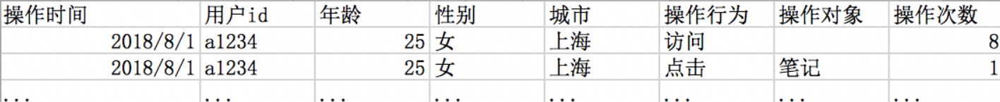
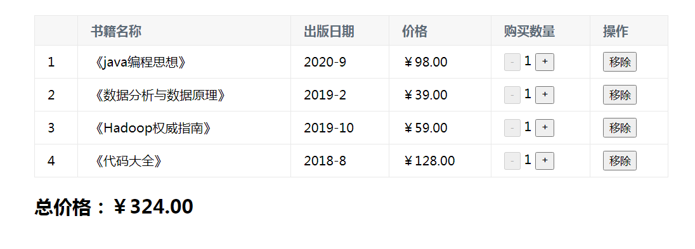

题目1:简答题

需求：当前希望分析产品上线两周后，页面的使用人群特点（年龄、性别、城市）和页面上不同入口点击率（页面上各种按钮、超链接等等的点击次数/页面访问次数）的关系。 拿到的数据格式为csv格式，每行数据包括：用户操作时间、用户id、用户对应的信息（好几列，年龄、性别、城市）、操作行为（访问、点击）、被操作模块名称（访问行为此列为空，点击行为此列为被点击入口的名称），示例如下



任务：对过去两周产品的使用人群特点和入口点击率进行描述和可视化作图，说明上两周的现状情况。要求：从整体角度描述提到两个指标的变动情况；将不同入口点击率按照人群特点进行划分，描述不同人群的入口点击偏好、对某个入口点击率的差异。

  问题1：简述一下拿到这个数据文件后你根据任务所规划的处理步骤（画图or文字描述皆可，文字描述需要写清步骤序号）。 

要求:题目属于开放题目,无固定答案, 根据自己的思考结果给出作答即可.

```
1.拿到数据后先对操作次数进行排序，操作行为作为第二特征进行排序
2.对排序好的操作行为，按照地区特点进行划分，之后按照性别来区分，
3.最后可以按照年龄来分组，0-18一组，18-35一组，35-60一组，60以上一组
```


## 模块综合题目

### 1.使用Vue完成简易购物车案例



题目要求: 

1.作出如图的展示效果

2.点击购买加号则数量增加,总价格随之更变 

3.如果书本数量为1则不能减少

4.点击移除,删除该行,总价格随之更变

5.使用VUE + HMLT 实现该案例

```html
<!DOCTYPE html>
<html lang="en">

<head>
    <meta charset="UTF-8">
    <meta name="viewport" content="width=device-width, initial-scale=1.0">
    <title>Document</title>
    <script src="https://cdn.jsdelivr.net/npm/vue/dist/vue.js"></script>
</head>

<body>

    <div id="app" v-cloak>
        <template v-if="list.length">
            <table border="1px" width="50%" heigh="450px" align="center" cellspacing="0">
                <thead>
                    <tr>
                        <th></th>
                        <th>书籍名称</th>
                        <th>出版日期</th>
                        <th>价格</th>
                        <th>购买数量</th>
                        <th>操作</th>
                    </tr>
                </thead>
                <tbody>
                    <tr v-for="(item,index) in list" align="center">
                        <td>{{index+1}}</td>
                        <td>{{item.name}}</td>
                        <td>{{item.time}}</td>
                        <td>{{item.price}}</td>
                        <td>
                            <!-- 此处count为1时，动态绑定disabled特性禁用 -->
                            <button @click="handleReduce(index)" :disabled="item.count===1">-</button>
                            {{item.count}}
                            <button @click="handleAdd(index)">+</button>
                        </td>
                        <td>
                            <button @click="handleRemove(index)">移除</button>
                        </td>
                    </tr>
                </tbody>
            </table>
            <br>
            <div align="center">总价：￥ {{totalPrice}}</div>
        </template>
        <div v-else>购物车为空!</div>
    </div>
</body>
<script>
    var app = new Vue({
        el: "#app",
        data: {
            list: [{
                id: 1,
                name: '《java编程思想》',
                time: '2020-9',
                price: 98.00,
                count: 1
            }, {
                id: 2,
                name: '《数据分析与数据原理》',
                time: '2019-2',
                price: 39.00,
                count: 1
            }, {
                id: 3,
                name: '《Hadoop权威指南》',
                time: '2019-10',
                price: 59.00,
                count: 1
            }, {
                id: 4,
                name: '《代码大全》',
                time: '2018-8',
                price: 128.00,
                count: 1
            }]
        },
        methods: {
            // 虽然在button上已经绑定了disabled，但是在handleReduce内又判断了一遍，这是因为在某些时候可能不用button元素，这时给它们增加disabled是没有任何作用的
            handleReduce: function(index) {
                if (this.list[index].count === 1) return;
                this.list[index].count--;
            },
            handleAdd: function(index) {
                this.list[index].count++;
            },
            handleRemove: function(index) {
                this.list.splice(index, 1);
            }
        },
        computed: {
            totalPrice: function() {
                var total = 0;
                for (var i = 0; i < this.list.length; i++) {
                    var item = this.list[i];
                    total += item.price * item.count;
                }
                // 此处设定一个千位分隔符， 总价每隔3位数加进一个逗号
                return total.toString().replace(/\B(?=(\d{3})+$)/g, ',')
            }
        }
    })
</script>

</html>
```

