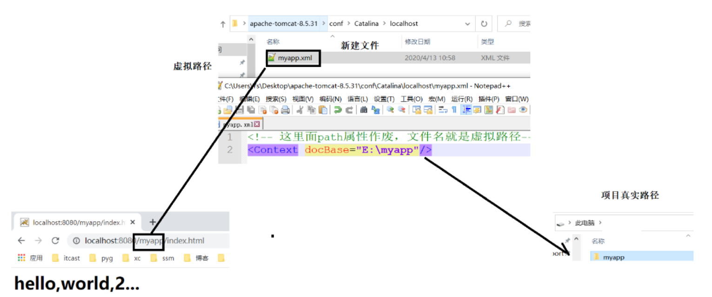

# 大数据学习-Java Day34

## Tomcat

### 1 web概述

 Web（互联网总称）

 Java Web:是用Java技术来解决相关web互联网领域的技术总和,通俗的说：将编写好的代码，发布到互 联网，可以让所有用户都访问到  

#### 软件架构

 网络中有很多的计算机，它们直接的信息交流，我们称之为：**交互** 

在互联网交互的过程的有两个非常典型的交互方式——**B/S 交互模型（架构）和 C/S 交互模型 （架构）**  

-  C/S架构 
  -  Client/Server 客户端/服务器 访问服务器资源必须安装客户端软件 
  - 特点
    - 优点：用户体验号
    - 缺点：开发、部署和维护繁琐
-  B/S架构 
  - Browser/Server 浏览器/服务器 访问服务器资源不需要专门安装客户端软件,而是直接通过浏览器访问服务器资源.  
  - 特点
    - 优点：开发、部署、更新简单
    - 缺点：用户体验差

####  Web服务器作用 

- 开发者通过web服务器可以把本地  ==>资源  ==>  发布到互联网 
- 用户就可以通过浏览器访问这些资源 

####  资源的分类 

 资源：计算机中数据文件 

- 静态资源 
  - 对于同一个页面,不同用户看到的内容是一样的。 
  - 例如：体育新闻、网站门户等，
  - 常见后缀： `*.html、*.js、*.css `
- 动态资源 
  - 用对于同一个页面,不同用户看到的内容可能不一样。 
  - 例如：购物车、我的订单等，
  - 常见后缀：` *.jsp、*.aspx、*.php  `

####  URL 请求路径 

URL （Uniform Resource Locator） ，统一资源定位符是对互联网上资源位置的一种表示，互联网上 的每个文件都有一个唯一的URL。  

```html
协议://域名:端口号/资源位置?参数=值

* 协议，http、https、ftp等
* 域名，域名或IP地址，都可以访问WEB资源
* 端口号，程序必须使用端口号，才可以让另一个计算机访问。http协议的默认端：80
* 资源位置，用于描述WEB资源在服务器上的位置。
* 参数=值，浏览器和服务器交互传递的数据

常见路径(访问 京东-笔记本电脑)
https://list.jd.com/list.html?cat=670,671,672
常见路径(访问 京东秒杀-电脑办公)
https://miaosha.jd.com/category.html?cate_id=29
常见路径(访问 拉勾-JavaEE)
http://www.lagou.com

```

#### 常见的web服务器


```
* Tomcat: Apache组织开源免费的web服务器,支持JavaEE规范（Servlet/Jsp）.

* Jetty:Apache组织开源免费的小型web服务器,支持JavaEE规范.

* JBoss: RedHat红帽公司的开源免费的web服务器,支持JavaEE规范.

* Glass Fish:Sun公司开源免费的web服务器,支持JavaEE规范.

---------------------------------------------------------------------

* WebLogic: Oracle公司收费的web服务器,支持JavaEE规范.

* WebSphere:IBM公司收费的web服务器,支持JavaEE规范
```

 **JavaEE规范** 

在Java中所有的服务器厂商都要实现一组Oracle公司规定的接口，这些接口是称为JavaEE规范。不同 厂商的JavaWeb服务器都实现了这些接口，在JavaEE中一共有13种规范。实现的规范越多，功能越强。 

### 2 Tomcat服务器

#### Tomcat使用

##### 下载

 Tomcat 官网下载地址：https://tomcat.apache.org/download-80.cgi  

##### 目录结构


##### 启动与关闭

bin目录下startup.bat,shutdown.bat启动与关闭脚本

##### 启动报错问题

8080端口被占用


 进入Tomcat安装目录/conf/server.xml 文件修改 ；如果是其他软件占用了8080，你可以直接修改这一个就行. 


 **注意：如果你想启动多个tomcat的话，需要修改二个端口号** 


#####  发布项目三种方式 

-  webapps 部署 

  - 直接放置在webapps目录下
  -  这种方案(支持热更新)，一般在开发完毕后，来使用 

  

-   server.xml部署 

  -  在tomcat/conf/server.xml中找到标签，添加标签 

  - 缺点

    1.  配置文件修改完毕后，需要重启后生效...
    2. server.xml是tomcat的核心配置文件，如果稍有不慎操作失误，整个tomcat启动失败 
    3. 这种方案作为了解即可 

    

-   独立xml部署(开发时使用)   

  -  在tomcat/conf/Catalina/localhost 目录下创建一个xml文件，添加标签 
  -  文件名就是虚拟路径 

  

####  Idea中使用Tomcat 

#####  配置Tomcat 


#####   创建Web项目 


##### 发布web项目


#####  页面资源热更新 


##### 注意事项


