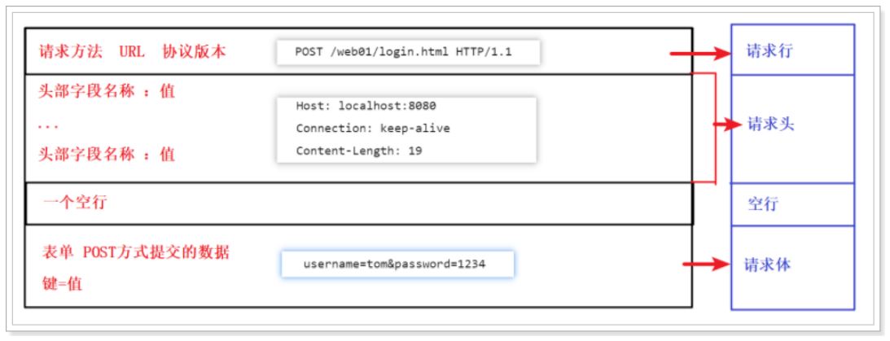
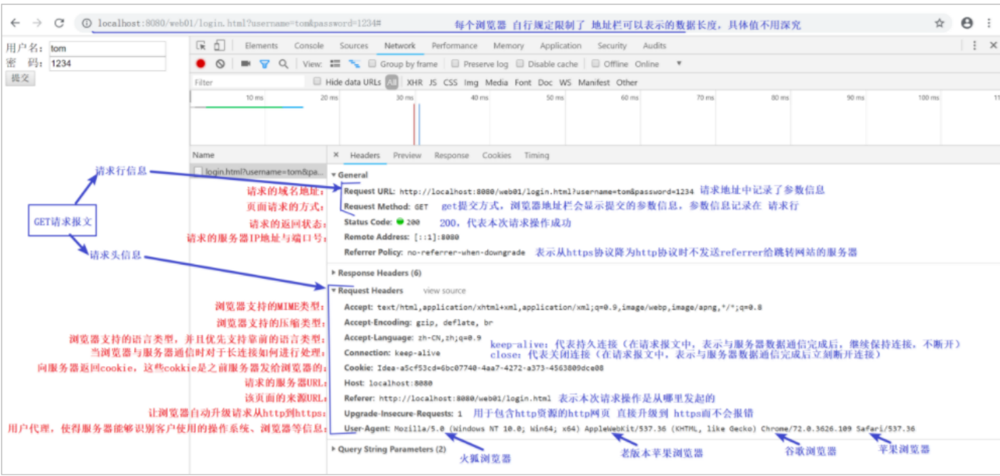
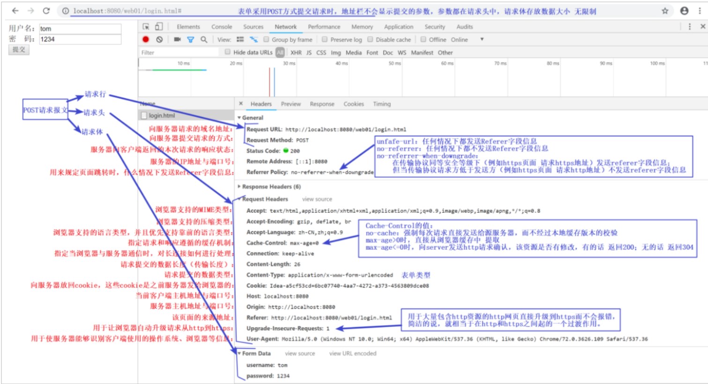
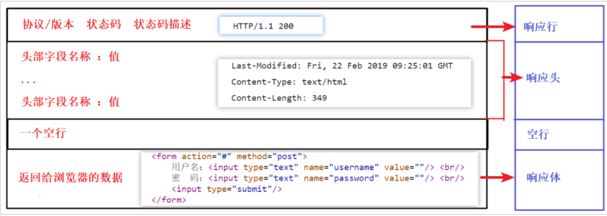
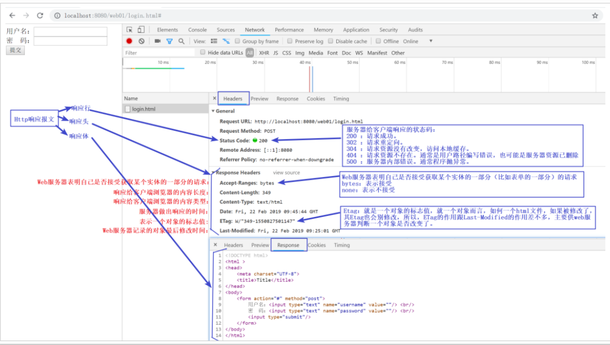

# 大数据学习-Java Day35

## HTTP协议

### 1 HTTP协议概述

 **HTTP协议：超文本传输协议（HTTP，HyperText Transfer Protocol)是互联网上应用最为广泛的一种网 络协议。用于定义WEB浏览器与WEB服务器之间交换数据的过程。** 

传输协议：在客户端和服务器端通信时，规范了传输数据的格式 


-  HTTP协议的作用 
  -  HTTP协议是学习JavaWEB开发的基石，不深入了解HTTP协议，就不能说掌握了WEB开发，更无 法管理和维护一些复杂的WEB站点。 
- HTTP协议的特点 
  - 基于请求/响应模型的协议。 
    - 请求和响应必须成对； 
    - 先有请求后有响应。 
  - 简单快捷 
    - 因为发送请求的时候只需要发送请求方式和请求路径即可 
  - HTTP协议默认的端口:80 
    - 例如： http://www.lagou.com:80 
  - 无状态协议 
    - 多次请求之间相互独立，不能交互数据 

####  Http协议的版本 

-  HTTP/1.0，发送请求，创建一次连接，获得一个web资源，连接断开。 
- HTTP/1.1，发送请求，创建一次连接，获得多个web资源，连接断开。  

####  HTTP协议有两种报文格式： 

-  请求报文：由客户端向服务器端发出的报文。 
- 响应报文：从服务端到客户端的报文。 

### 2  Http协议详解 

####  Http请求报文详解 

 HTTP请求报文：由客户端向服务器端发出的报文。 

HTTP请求报文格式：包含请求行、请求头、空行、请求体 四个部分 



##### 请求行

```
请求行格式：请求方式 资源路径 协议/版本
例如：POST /web01/login.html HTTP/1.1
请求行必须在HTTP请求格式的第一行。


请求方式：协议规定7种，常用两种：GET和POST
    GET请求：
        将请求参数追加在URL后面，不安全。例如：login.html?username=tom&password=1234
        URL长度限制GET请求方式的数据大小。
        没有请求体
    POST请求
        请求参数显示请求体处，较安全。
        请求数据大小没有限制。
    只有表单设置为method=”post”才是post请求.其他的都是get请求。
    常见GET请求：地址栏直接访问、<a href=””>、 等
```

##### 请求头

 请求头: 描述了客户端向服务器发送请求时使用的http协议类型，所使用的编码，以及发送内容的长 度，referer，等等。 

请求头也是用的键值对key:value  

| 常见请求 头 | 描述                                                         |
| ----------- | ------------------------------------------------------------ |
| Referer     | 浏览器通知服务器，当前请求来自何处。如果是直接访问，则不会有这个头。常用 于：防盗链 |
| Cookie      | 与会话有关技术，用于存放浏览器缓存的cookie信息。             |
| UserAgent   | 浏览器通知服务器，客户端浏览器与操作系统相关信息             |


##### 请求体

```
通常情况下，只有post请求方式才会使用到请求体，请求体中都是用户表单提交的数据，每一项数据都使用键
值对key=value，多组值使用&相连。
例如；username=tom&password=1234
```


#####  Http请求报文演示 

-  创建页面，编写“login.html”，并提供表单，分别设置表单的提交方式为：get和post。将表单提交 位置设置成#，表示提交到当前表单。  

  ```html
  <form action="#" method="post">
      用户名：<input type="text" name="username" value=""/> <br/>
      密 码：<input type="text" name="password" value=""/> <br/>
      <input type="submit" />
  </form>
  ```

-  GET请求抓包数据： 



-  POST请求抓包数据： 



####   Http响应报文详解 

 响应报文：从服务端到客户端的报文。 

HTTP响应报文格式：响应行、响应头、空行、响应体 四个部分 



##### 响应行

```
例如：HTTP/1.1 200 OK
    格式：协议/版本 状态码 状态码描述
        状态码：服务器与浏览器用于确定状态的固定数字号码
            200 ：请求成功。
            302 ：请求重定向。
            304 ：请求资源没有改变，访问本地缓存。
            404 ：请求资源不存在。通常是用户路径编写错误，也可能是服务器资源已删除。
            500 ：服务器内部错误。通常程序抛异常。

```

##### 响应头

 响应头: 用来描述服务器回给客户端浏览器的content的一些描述，例如: 我是什么服务器，我返回的是 啥编码，我返回的内容有多长等等 

响应头也是用的键值对 key:value 

| 常见响应头          | 描述                                                |
| ------------------- | --------------------------------------------------- |
| Location            | 指定响应的路径，需要与状态码302配合使用，完成跳转。 |
| Content-Disposition | 文件下载的时候使用。通过浏览器以下载方式解析正文    |
| Set-Cookie          | 与会话相关技术。服务器向浏览器写入cookie            |
| Refresh             | 定时刷新                                            |

#####  响应体 

 响应体，就是服务器发送给浏览器的正文。 

```html
<!DOCTYPE html>
<html >
<head>
    <meta charset="UTF-8">
    <title>Title</title>
</head>
<body>
    <form action="#" method="post">
        用户名：<input type="text" name="username" value=""/> <br/>
        密 码：<input type="text" name="password" value=""/> <br/>
        <input type="submit"/>
    </form>
</body>
</html>
```

#####  Http响应报文演示 



