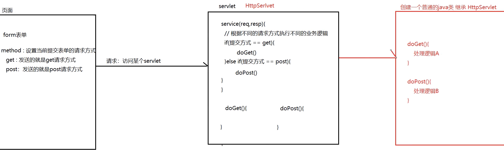

# 大数据学习-Java Day36

##  Servlet 

### 1  Servlet概述 

-  servlet= server+applet ：运行在服务器端的java程序。 
- Servlet是一个接口，一个类要想通过浏览器被访问到,那么这个类就必须直接或间接的实现Servlet 接口  

- 作用
  -  接收请求
  - 处理逻辑
  - 响应结果 

### 2   Servlet快速入门 

#### 代码编写

1. ##### 创建web项目

2. #####  编写普通java类，实现servlet接口 

    编写抽象方法（service方法） 

   ```java
   public class Demo implements Servlet {
       @Override
       public void init(ServletConfig servletConfig) throws ServletException {
       }
   
       @Override
       public ServletConfig getServletConfig() {
           return null;
       }
   
       // 对外提供服务
       /*
       request:代表请求
       response：代表响应
       */
       @Override
       public void service(ServletRequest servletRequest, ServletResponse
               servletResponse) throws ServletException, IOException {
       // 向浏览器响应一句话
           servletResponse.getWriter().write("QuickServlet");
       }
   
       @Override
       public String getServletInfo() {
           return null;
       }
   
       @Override
       public void destroy() {
       }
   }
   
   ```

   

3. #####  配置web.xml 

    配置servlet网络访问路径 

   ```xml
   <?xml version="1.0" encoding="UTF-8"?>
   <web-app xmlns="http://xmlns.jcp.org/xml/ns/javaee"
            xmlns:xsi="http://www.w3.org/2001/XMLSchema-instance"
            xsi:schemaLocation="http://xmlns.jcp.org/xml/ns/javaee http://xmlns.jcp.org/xml/ns/javaee/web-app_4_0.xsd"
            version="4.0">
   
       <!--
       把QuickServlet交给tomcat管理
       servlet-name：当前servlet的别名（使用类名即可）
       servlet-class：全限定类名
       -->
       <servlet>
           <servlet-name>Demo</servlet-name>
           <servlet-class>cn.itcast.a_quick.Demo</servlet-class>
       </servlet>
       <!--
       给servlet设置一个网络的访问地址（路径）
       servlet-name：给指定别名的servlet配置映射
       url-pattern：网络访问地址（注意：必须以/开头）
       -->
       <servlet-mapping>
           <servlet-name>Demo</servlet-name>
           <url-pattern>/Demo</url-pattern>
       </servlet-mapping>
   
   </web-app>
   ```

4. #####  部署web项目 

5. #####  启动测试 

####  servlet执行原理 


### 3  Servlet生命周期 

#### 生命周期相关

##### 思想介绍

 生命周期：指的是 一个对象从生（创建）到死（销毁）的一个过程  

```java
// 1. servlet对象创建时，调用此方法
public void init(ServletConfig servletConfig);

// 2. 用户访问servlet时，调用此方法
public void service(ServletRequest servletRequest, ServletResponse servletResponse);

// 3. servlet对象销毁时，调用此方法
public void destroy();
```

##### 代码

1.  LifeServlet 

   ```java
   
   public class Demo implements Servlet {
   
       @Override
       public void init(ServletConfig servletConfig) throws ServletException {
           System.out.println("LifeServlet创建了....");
       }
   
       @Override
       public ServletConfig getServletConfig() {
           return null;
       }
   
       @Override
       public void service(ServletRequest servletRequest, ServletResponse
               servletResponse) throws ServletException, IOException {
           System.out.println("LifeServlet的service方法执行了");
       }
   
       @Override
       public String getServletInfo() {
           return null;
       }
   
       @Override
       public void destroy() {
           System.out.println("LifeServlet销毁了...");
       }
   
   }
   
   ```

   

2.  配置web.xml 

   ```xml
   
   <!--servlet的生命周期-->
   <servlet>
       <servlet-name>Demo</servlet-name>
       <servlet-class>cn.itcast.b_api.Demo</servlet-class>
       <!--tomcat启动时，创建servlet对象，执行init方法 -->
       <load-on-startup>4</load-on-startup>
   </servlet>
   <servlet-mapping>
       <servlet-name>Demo</servlet-name>
       <url-pattern>/Demo</url-pattern>
   </servlet-mapping>
   
   ```

   

   ~~~markdown
   * 创建
       1）默认情况下
       	用户第一次访问时，创建servlet，执行init方法
       2）修改创建时机
           <load-on-startup></load-onstartup>
           正数：4-N 【服务器启动时，创建】
               补充：Tomcat的web.xml里有1,3 所以推荐4-n
           负数（默认值）：-1 【用户第一次访问时，创建】
   * 运行（提供服务）
       用户每次访问时，都执行service方法
   * 销毁
       服务器正常关闭时，销毁servlet，执行destroy方法
       ```
   笔试题：请描述下servlet的生命周期：
       答案：servlet是一个单实例多线程的，默认情况下，第一次请求来的时候，才会对该servlet进行实
       例化，并执行初始化init方法，随后再执行service方法完成业务处理，当每一次请求发送过来，都会从新
       开启一个线程，来执行servlet中的service方法，当服务器关闭或者servlet被移除的时候，会执行
       destory方法
   ~~~

### 4  Servlet体系结构 


####  GenericServlet 

1.  编写普通java类，继承GenericServlet抽象类 

   ```java
   public class Demo extends GenericServlet {
       @Override
       public void init() throws ServletException {
           System.out.println("ServletDemo1 创建了...");
       }
   
       @Override
       public void service(ServletRequest servletRequest, ServletResponse
               servletResponse) throws ServletException, IOException {
           servletResponse.getWriter().write("ServletDemo1 extends GenericServlet");
       }
   
       @Override
       public void destroy() {
           System.out.println("ServletDemo1 销毁了..");
       }
   }
   
   ```

2.  配置web.xml 

   ```xml
       <!--servlet继承genericServlet-->
       <servlet>
           <servlet-name>Demo</servlet-name>
           <servlet-class>cn.itcast.c_inherit.Demo</servlet-class>
       </servlet>
       <servlet-mapping>
           <servlet-name>Demo</servlet-name>
           <url-pattern>/Demo</url-pattern>
       </servlet-mapping>
   ```

####  HttpServlet 



1.  编写前端html 

   ```html
   <!DOCTYPE html>
   <html lang="zh-CN">
   <head>
       <meta charset="UTF-8">
       <title>login</title>
   </head>
   <body>
   <h3>用户登录</h3>
   <form action="http://localhost:8080/servlet_demo/servletDemo2" method="get">
       <input type="submit" value="提交表单..">
   </form>
   </body>
   </html>
   ```

2.  编写普通java类，继承HttpServlet抽象类 

   ```java
   public class Demo extends HttpServlet {
       @Override
       protected void doGet(HttpServletRequest req, HttpServletResponse resp) throws ServletException, IOException { 
           resp.getWriter().write("get....");
       }
   
       protected void doPost(HttpServletRequest req, HttpServletResponse resp) throws ServletException, IOException { 
           resp.getWriter().write("post...");
       }
   }
   ```

3.  配置web.xml 

   ```xml
       <!--servlet继承httpServlet-->
       <servlet>
           <servlet-name>Demo</servlet-name>
           <servlet-class>cn.itcast.c_inherit.Demo</servlet-class>
       </servlet>
       <servlet-mapping>
           <servlet-name>Demo</servlet-name>
           <url-pattern>/Demo</url-pattern>
       </servlet-mapping>
   ```

   

### 5 url-pattern的配置方式


####  Servlet映射多个url 


####  url映射模式 

 配置 url地址取值可以是：  

```
1. 精确匹配(掌握)
    /servletDemo3 localhost:8080/项目路径/servletDemo3
2. 目录匹配
    /aa/*
3. 后缀匹配
    *.xxx 例如：*.do

```

```xml
  <!--
    只要浏览器符合目录匹配规则,都可以访问到这个servlet：
    /aa/abc
    /aa/asadfasdf
    -->
    <servlet>
        <servlet-name>ServletDemo4</servlet-name>
        <servlet-class>com.demo.QuickServlet</servlet-class>
    </servlet>
    <servlet-mapping>
        <servlet-name>ServletDemo4</servlet-name>
        <url-pattern>/aa/*</url-pattern>
    </servlet-mapping>
    <!--
    只要浏览器符合后缀匹配规则，都可以访问到这个servlet
    aa.do
    bb.do
    xx.do
    -->
    <servlet>
        <servlet-name>ServletDemo5</servlet-name>
        <servlet-class>com.demo.QuickServlet</servlet-class>
    </servlet>
    <servlet-mapping>
        <servlet-name>ServletDemo5</servlet-name>
        <url-pattern>*.do</url-pattern>
    </servlet-mapping>
```

### 6  Request对象 

####  request对象概述 

-  用户通过浏览器访问服务器时，Tomcat将HTTP请求中所有的信息都封装在Request对象中 
- 作用：开发人员可以通过request对象方法，来获取浏览器发送的所有信息.  


####  获取请求行信息 

```markdown
* 例如：
        GET /servlet_demo/requestDemo1 HTTP/1.1
* 相关API：
    1. 获取请求方式 GET【掌握】
            String getMethod()
            
    2. 获取项目虚拟路径（项目名）/servlet_demo【掌握】
            String getContextPath()
            
    3. 获取URL http://localhost:8080/servlet_demo/requestDemo1
            统一资源定位符（确定某一个地址） 中华人民共和国
            StringBuffer getRequestURL()
            
    4. 获取协议和版本号 HTTP/1.1
            String getProtocol()
            
    5. 获取客户端ip
            String getRemoteAddr()

```

```java
public class Demo extends HttpServlet {

    @Override
    protected void doGet(HttpServletRequest req, HttpServletResponse resp) throws ServletException, IOException {
        // System.out.println(req);
        System.out.println("请求方式:" + req.getMethod());
        System.out.println("虚拟路径：" + req.getContextPath());
        System.out.println("URL:" + req.getRequestURL());
        System.out.println("协议和版本：" + req.getProtocol());
        System.out.println("客户端ip：" + req.getRemoteAddr());
    }

    @Override
    protected void doPost(HttpServletRequest req, HttpServletResponse resp) throws ServletException, IOException {
    }

}
```


####  获取请求头信息 

```markdown
* 例如：
        Host: 127.0.0.1:8080
* 相关API：
    1. 获取知道请求头名称对应的值，注：名称不区分大小写
            String getHeader(String name)
    2. 获取所有请求头的名称
            Enumeration<String> getHeaderNames()
			注：是Iterator前身

```

```java
public class Demo extends HttpServlet {
    @Override
    protected void doGet(HttpServletRequest req, HttpServletResponse resp) throws ServletException, IOException {
        // 获取所有的请求头名称
        Enumeration<String> enumeration = req.getHeaderNames();
        // 遍历
        while (enumeration.hasMoreElements()) {
            // 取出元素名（请求头名称）
            String name = enumeration.nextElement();
            // 根据名称获取值
            String value = req.getHeader(name);
            System.out.println(name + " : " + value);
        }
    }

    @Override
    protected void doPost(HttpServletRequest req, HttpServletResponse resp) throws ServletException, IOException {
    }
}
```


####   获取请求体信息（请求参数） 

```markdown
* 参数
        username=jack&password=123&hobby=drink&hobby=perm
        
* API
    1. 获取指定参数名的值 username=jack
            String getParameter(String name)
            
    2. 获取指定参数名的值数组 hobby=drink&hobby=perm
            String[] getParameterValues(String name)
            
    3. 获取所有参数名和对应值数组，参数名 name（key），值数组 value，封装map集合
            Map<String,String[]> getParameterMap()
            
* 中文乱码【重点】
    get：在tomcat8及以上版本，内部URL编码（UTF-8）
    post：编码解码不一致，造成乱码现象
        客户端（浏览器）编码：UTF-8
        服务器默认 解码：ISO-8859-1 拉丁文
        指定解码：void setCharacterEncoding(String env)
            注：这哥们必须在方法内，行首

```


```html
<!DOCTYPE html>
<html lang="zh-CN">
<head>
    <meta charset="UTF-8">
    <title>form</title>
</head>
<body>
<h3>get方式：</h3>
<form action="/day09_request/Demo" method="get">
    用户：<input type="text" name="username"> <br>
    密码：<input type="password" name="password"> <br>
    爱好：
        <input type="checkbox" name="hobby" value="smoking"/>抽烟
        <input type="checkbox" name="hobby" value="drink"/>喝酒
        <input type="checkbox" name="hobby" value="perm"/>烫头
    <input type="submit" value="get提交...">
</form>
<h3>post方式：</h3>
<form action="/day09_request/Demo" method="post">
    用户：<input type="text" name="username"> <br>
    密码：<input type="password" name="password"> <br>
    爱好：
    <input type="checkbox" name="hobby" value="smoking"/>抽烟
    <input type="checkbox" name="hobby" value="drink"/>喝酒
    <input type="checkbox" name="hobby" value="perm"/>烫头
    <input type="submit" value="post提交...">
</form>
</body>
</html>
```


```java
@WebServlet("/Demo")
public class Demo extends HttpServlet {
    @Override
    protected void doGet(HttpServletRequest req, HttpServletResponse resp) throws ServletException, IOException {
        System.out.println("手动获取---------");  // 获取表单提交的请求参数
        String username = req.getParameter("username");
        System.out.println("用户：" + username);
        String password = req.getParameter("password");
        System.out.println("密码：" + password);
        // 获取爱好多个value的数组类型
        String[] hobby = req.getParameterValues("hobby");
        System.out.println("爱好：" + Arrays.toString(hobby));
        System.out.println("自动获取---------");
        // 获取所有的请求参数的key和value String：表单中的name属性值  String[]:请求参数的value值
        Map<String, String[]> parameterMap = req.getParameterMap();
        parameterMap.forEach((k, v) -> {
            System.out.println(k + " = " + Arrays.toString(v));
        });
    }

    @Override
    protected void doPost(HttpServletRequest req, HttpServletResponse resp) throws ServletException, IOException {
        // 指定post的解码方式....
        req.setCharacterEncoding("UTF-8");
        System.out.println("post提交方法，再去调用get....");
        this.doGet(req, resp); // 让get小老弟干活...
    }
}
```

####  请求转发 

-  一种在服务器内部的资源跳转方式 


```markdown
* API
    1. 通过reqeust对象，获得转发器对象
            RequestDispatcher getRequestDispatcher(String path) //要跳转到的资源路径
            
   	2. 通过转发器对象，实现转发功能
            void forward(ServletRequest request, ServletResponse response)
            
* 请求转发特点
    浏览器：发了一次请求
    地址栏：没有发生改变  
    只能转发到服务器内部资源....
    
* 链式编程
        request.getRequestDispatcher("/bServlet").forward(reqeust,response)
```


```java

public class AServlet extends HttpServlet {


    @Override
    protected void doGet(HttpServletRequest request, HttpServletResponse resp) throws ServletException, IOException {

        System.out.println("AServlet中功能上执行了");

        // 请求转发到Bservelt String path: 写的就是要跳转的资源路径
    /*    // 1.获取到转发器对象
        RequestDispatcher requestDispatcher = request.getRequestDispatcher("https://www.baidu.com/");

        // 2.借助转发器对象进行真正的请求转发
        requestDispatcher.forward(request,resp);*/

        // 向request域中设置数据
        request.setAttribute("hanbao","香辣鸡腿堡");

        // 链式编程
        request.getRequestDispatcher("/bServlet").forward(request,resp);


    }

    @Override
    protected void doPost(HttpServletRequest req, HttpServletResponse resp) throws ServletException, IOException {
        doGet(req,resp);
    }
}

```


```java
public class BServlet extends HttpServlet {


    @Override
    protected void doGet(HttpServletRequest req, HttpServletResponse resp) throws ServletException, IOException {

        // 从request域中取出数据
        String hanbao = (String) req.getAttribute("hanbao");
        System.out.println(hanbao);

        System.out.println("BServlet中功能下执行了");


    }

    @Override
    protected void doPost(HttpServletRequest req, HttpServletResponse resp) throws ServletException, IOException {
        doGet(req,resp);
    }
}
```


####  域对象（共享数据） 

-  域对象：一个有作用范围的对象，可以在范围内共享数据 
- request域：代表一次请求的范围，一般用于一次请求中转发的多个资源中共享数据 


```markdown
* API
    1. 设置数据
    		void setAttribute(String name, Object o)
    2. 获取数据
    		Object getAttribute(String name)
    3. 删除数据
    		void removeAttribute(String name)
* 生命周期
    1. 何时创建？
    		用户发送请求时，创建request
    2. 何时销毁
    		服务器返回响应是，销毁request
    3. 作用范围？
    		一次请求，包含多次转发
```


```java

@WebServlet("/aServlet")
public class AServlet extends HttpServlet {
    protected void doGet(HttpServletRequest request, HttpServletResponse response) throws ServletException, IOException {
        this.doPost(request, response);
    }

    protected void doPost(HttpServletRequest request, HttpServletResponse response) throws ServletException, IOException {
        System.out.println("aServlet处理功能上....");
        // 转发到BServlet
        /* // 1.获得转发器对象 path = @WebServlet("/bServlet")
        RequestDispatcher requestDispatcher = request.getRequestDispatcher("/bServlet");
        // 2.实现转发功能
        requestDispatcher.forward(request, response);*/
        // 存一个数据
        request.setAttribute("hanbao", "香辣鸡腿堡");
        // 链式编程横
        request.getRequestDispatcher("bServlet").forward(request, response);
    }
}
```


```java
@WebServlet("/bServlet")
public class BServlet extends HttpServlet {
    protected void doGet(HttpServletRequest request, HttpServletResponse response) throws ServletException, IOException {
        this.doPost(request, response);
    }

    protected void doPost(HttpServletRequest request, HttpServletResponse response) throws ServletException, IOException {
        System.out.println("bServlet处理功能下....");
        // 获取数据
        String hanbao = (String) request.getAttribute("hanbao");
        System.out.println("hanbao:" + hanbao);
    }
}
```

### 7  Response对象 

#### 概述

-  response对象表示web服务器给浏览器返回的响应信息 
- 作用：开发人员可以使用response对象的方法，设置要返回给浏览器的响应信息 


#####  Response体系结构 

```markdown
    ServletResponse 接口
            |
    HttpServletResponse 接口
            |
    org.apache.catalina.connector.ResponseFacade 实现类（由tomcat提供的）
```

####  设置Http响应消息 

##### 响应行

```markdown
* 格式
        协议/版本号 状态码
* 例如
        HTTP/1.1 200
* API
    1. 设置状态码
        	void setStatus(int sc) 200 302 304 404 500
```

#####  响应头 

```markdown
* 格式
        响应头名称：响应头的值
* 例如
        Location:http://www.lagou.com
* API
    1. 设置指定头名称和对应的值
            void setHeader(String name, String value)
```

#####  响应体 

```markdown
* API（输出流对象）
    1. 字符输出流
            PrintWriter getWriter()
    2. 字节输出流
            ServletOutputStream getOutputStream()
            
    注意：在同一个servlet中，二种类型的输出流不能同时存在，互斥
```

####  响应重定向 


#####  需求：用户访问AServlet后，服务器告诉浏览器重定向到BServlet 

##### 步骤

```markdown
* 方式一
    // 1.设置状态码
        response.setStatus(302);
    // 2.设置响应头 Location
        response.setHeader("Location","重定向网络地址");
* 方式二  常用
    // 1.response这哥们封装专门处理重定向的方法
        response.sendRedirect("重定向网络地址");
```

#####  重定向特点 

```markdown
1. 地址栏会发生改变

2. 重定向是二次请求

3. 重定向是客户端（浏览器）行为，可以跳转到服务器外部资源...

4. 不能使用request域共享数据
```


```java

public class CServlet extends HttpServlet {


    @Override
    protected void doGet(HttpServletRequest req, HttpServletResponse resp) throws ServletException, IOException {

        System.out.println("访问到了CSerlvet,接下来重定向到DServlet");

        // 设置重定向
      /*  resp.setStatus(302);
        resp.setHeader("Location","dServlet");*/

        // 设置重定向 方式二：常用
        resp.sendRedirect("https://www.lagou.com/");


    }


    @Override
    protected void doPost(HttpServletRequest req, HttpServletResponse resp) throws ServletException, IOException {
        doGet(req, resp);
    }
}

```


```java
public class DServlet extends HttpServlet {

    @Override
    protected void doGet(HttpServletRequest req, HttpServletResponse resp) throws ServletException, IOException {

        System.out.println("DServlet执行了.....");


    }


    @Override
    protected void doPost(HttpServletRequest req, HttpServletResponse resp) throws ServletException, IOException {
        doGet(req, resp);
    }


}

```


#####  请求转发与重定向的区别 

```markdown
1. 哪个对象
    转发（request对象的方法）
        request.getRequestDispatcher("/bServlet").forward(request,response);
    重定向（response对象的方法）
        response.sendRedirect("/day10_response/bServlet");
2. 几次请求
    转发
        地址栏： 没有改变
        浏览器： 发了一次请求
        服务器： 只有一对请求和响应对象
        发生的位置： 服务器
    重定向
        地址栏： 发生了改变
        浏览器： 发了两次请求
        服务器： 有两对请求和响应对象
        发生的位置： 浏览器
3. 小结
    写法
        转发("/servlet资源路径") 服务器内部行为
        重定向 ("/虚拟路径（项目名）/servlet资源路径") 浏览器外部行为
    使用场景(重点掌握)
        如果需要传递数据（request域），使用转发
        如果不需要传递数据（request域），使用重定向
```


####  响应中文 

#####  需求 

向页面输出中文数据没有乱码 

#####  步骤 

```markdown
1. 通过response获取字符输出流
        PrintWriter pw = response.getWriter();
2. 通过字符输出输出文本
        pw.write("中文....");

```


#####  解决中文乱码 

```markdown
1. 指定服务器响应编码方式
        response.setCharacterEncoding("GBK");
2. 统一浏览器和服务器编码
        response.setContentType("text/html;charset=utf-8");

```


```java
@WebServlet("/EncodeServlet")
public class Demo extends HttpServlet {
    protected void doGet(HttpServletRequest request, HttpServletResponse response) throws ServletException, IOException {
        this.doPost(request, response);
    }

    protected void doPost(HttpServletRequest request, HttpServletResponse response) throws ServletException, IOException {
        // 指定服务器响应编码方式
        // response.setCharacterEncoding("UTF-8");
        // 统一浏览器和服务器编码
        response.setContentType("text/html;charset=utf-8");
        // 1. 通过response获取字符输出流
        PrintWriter pw = response.getWriter();
        // 2. 通过字符输出输出文本
        pw.write("中文....");
    }
}
```


### 8  ServletContext 

#### 概述

-  web容器（tomcat）在启动时，它会为每个web项目承建一个对应的ServletContext对象 
- 它代表：当前web项目 


-  主要作用 
  - 域对象（共享数据） 
  -  获取资源在服务器的真实地址
  -  获取全局的配置参数 
  - 获取文件MIME类型 

#####  获取ServletContext对象 

```markdown
1. 通过request对象获得
        ServletContext sc = request.getServletContext();
2. 继承HttpServlet后，可以直接调用
        ServletContext sc = this.getServletContext();
```


####  域对象（共享数据） 

-  在当前项目范围内，共享数据（多个servlet都可以获取） 


```markdown
1. 存储数据
        void setAttribute(String name,Object value)
2. 获取数据
        Object getAttribute(String name)
3. 删除数据
        void removeAttribute(String name)
```


```java
@WebServlet("/OneServlet")
public class OneServlet extends HttpServlet {
    protected void doGet(HttpServletRequest request, HttpServletResponse response) throws ServletException, IOException {
        this.doPost(request, response);
    }

    protected void doPost(HttpServletRequest request, HttpServletResponse response) throws ServletException, IOException {
        // 向servletContext域存数据....
        ServletContext sc1 = request.getServletContext();
        ServletContext sc2 = getServletContext();
        sc1.setAttribute("user", "jack");
        System.out.println("OneServlet存了数据。。。");
    }
}
```


```java
@WebServlet("/TwoServlet")
public class TwoServlet extends HttpServlet {
    protected void doGet(HttpServletRequest request, HttpServletResponse response) throws ServletException, IOException {
        this.doPost(request, response);
    }

    protected void doPost(HttpServletRequest request, HttpServletResponse response) throws ServletException, IOException {
        // 从servletContext域获取数据
        String user = (String) request.getServletContext().getAttribute("user");
        System.out.println("TwoServlet获取数据：" + user);
    }
}

```


#####  生命周期 

```markdown
1. 何时创建？
        项目加载时，创建
2. 何时销毁？
        项目卸载时，销毁
3. 作用范围？
        与项目共存亡（多个servlet都可以操作它）

```

####  获取资源在服务器的真实地址 

-  可以实现web项目的移植性...动态获取文件真实路径  


```markdown
* API
        String getRealPath(String path);

```

```java
@WebServlet("/RealpathServlet")
public class Demo extends HttpServlet {
    protected void doGet(HttpServletRequest request, HttpServletResponse response) throws ServletException, IOException {
        this.doPost(request, response);
    }

    protected void doPost(HttpServletRequest request, HttpServletResponse response) throws ServletException, IOException {
        // 获取car.jpg 文件真实路径
        String carPath = request.getServletContext().getRealPath("/img/car.jpg");
        System.out.println(carPath);
        // 获取web.xml 文件真实路径
        String webPath = request.getServletContext().getRealPath("/WEBINF/web.xml");
        System.out.println(webPath);
    }
}
```

####  获取全局的配置参数 

-  读取web.xml配置文件中标签信息，实现参数和代码的解耦（多个servlet都可以获取）  

```xml
<?xml version="1.0" encoding="UTF-8"?>
<web-app xmlns="http://xmlns.jcp.org/xml/ns/javaee"
         xmlns:xsi="http://www.w3.org/2001/XMLSchema-instance"
         xsi:schemaLocation="http://xmlns.jcp.org/xml/ns/javaee http://xmlns.jcp.org/xml/ns/javaee/web-app_4_0.xsd"
         version="4.0">
    
    <!--全局配置参数：所有的servlet都可以读取...-->
    <context-param>
        <param-name>encode</param-name>
        <param-value>UTF-8</param-value>
    </context-param>

</web-app>
```


```java
@WebServlet("/ContextPathServlet")
public class Demo extends HttpServlet {
    protected void doGet(HttpServletRequest request, HttpServletResponse response) throws ServletException, IOException {
        this.doPost(request, response);
    }
    protected void doPost(HttpServletRequest request, HttpServletResponse response) throws ServletException, IOException {
// 获取全局参数
        String value = request.getServletContext().getInitParameter("encode");
        System.out.println("全局配置参数："+value);
    }
}
```

####  获取文件MIME类型 

-  在互联网通信过程中定义的一种文件数据类型格式 
- 格式： 大类型/小类型 例如： text/html image/jpeg 


```html
<a href="/day10_servletContext/MimeServlet?filename=luola.avi">获取文件的mime类型</a><br>

```

```java
@WebServlet("/MimeServlet")
public class Demo extends HttpServlet {
    protected void doGet(HttpServletRequest request, HttpServletResponse response) throws ServletException, IOException {
        this.doPost(request, response);
    }
    protected void doPost(HttpServletRequest request, HttpServletResponse response) throws ServletException, IOException {
        // 获取指定文件的mime类型
        // 获取请求参数
        String filename = request.getParameter("filename");
        // 获取文件的mime类型
        String mimeType = request.getServletContext().getMimeType(filename);
        response.getWriter().write(filename + "---" + mimeType);
    }
}
```

####  案例：统计网站的访问次数 

#####  需求 

 一般个人博客的首页，都会显示你是第几位访问此网站...  


```java
@WebServlet(value = "/CountServlet", loadOnStartup = 4) // 服务器启动时，创建此servlet对象
public class CountServlet extends HttpServlet {


    @Override
    public void init() throws ServletException {
        // 向servletContext域中存入变量count,并且初始值为0
        this.getServletContext().setAttribute("count",0);
    }


    @Override
    protected void doGet(HttpServletRequest req, HttpServletResponse resp) throws ServletException, IOException {

       //1. 设置响应编码
        resp.setContentType("text/html;charset=utf-8");

       //2. 向页面响应信息
        resp.getWriter().write("<h1>拉勾博客</h1>");


        //3.进行servletContext域中的取值   取  加  存    0
        // 取
        Integer count = (Integer) this.getServletContext().getAttribute("count");

        // 加
        count++;

        resp.getWriter().write("<dev>你是，第"+ count + "位访问此网站的人....</dev>");

        // 存
        this.getServletContext().setAttribute("count",count);

    }


    @Override
    protected void doPost(HttpServletRequest req, HttpServletResponse resp) throws ServletException, IOException {
        doGet(req, resp);
    }
}

```

