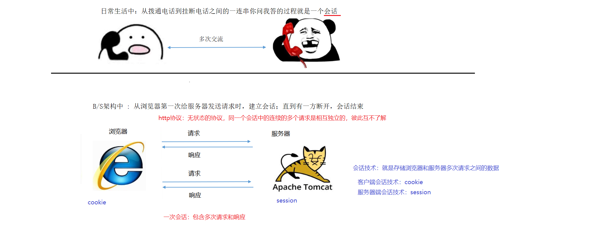
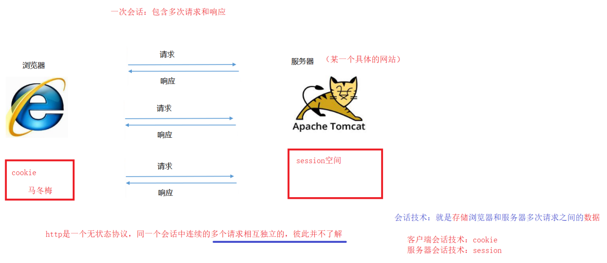
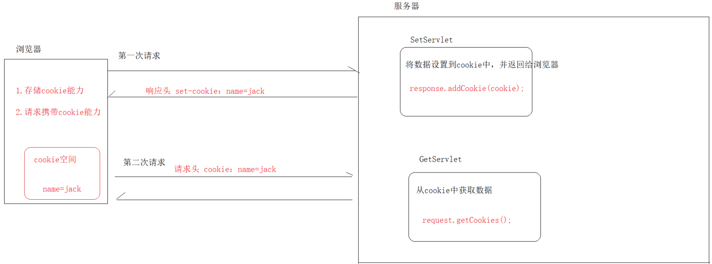
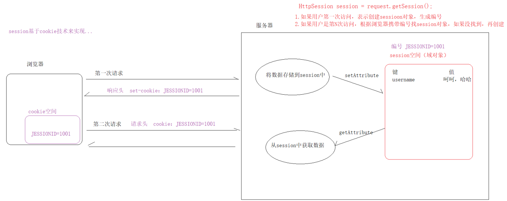

# 大数据学习-Java Day37

##  Cookie & Session  

### 1 会话概述

#### 会话简介

-  一次会话：包含多次请求响应。 



#### 会话技术

-  问题：Http是一个无状态协议，同一个会话的连续两个请求相互独立，彼此并不了解 
- 作用：用于**存储**浏览器与服务器在请求和响应过程中产生的**数据** 
  - 客户端会话技术：cookie 
  - 服务器端会话技术：session 



### 2  Cookie 

#### 概述

 Cookie作用：在一次会话的多次请求之间共享数据，将数据保存到客户端（浏览器） 

```markdown
1. 设置数据到cookie中
    // 1.创建cookie对象，设置数据 *value只能存字符串
        Cookie cookie = new Cookie(String name,String value);
    // 2.通过response，响应（返回）cookie
        response.addCookie(cookie);
2. 从cookie中获取数据
    // 1.通过request对象，接收cookie数组
        Cookie[] cookies = request.getCookies();
   	// 2.遍历数组
```


```java

@WebServlet("/SetServlet")
public class SetServlet extends HttpServlet {
    protected void doGet(HttpServletRequest request, HttpServletResponse response) throws ServletException, IOException {
        this.doPost(request, response);
    }

    protected void doPost(HttpServletRequest request, HttpServletResponse response) throws ServletException, IOException {
        // 1.创建cookie对象，设置数据
        Cookie cookie = new Cookie("name", "jack");
        // 2.通过response，响应（返回）cookie
        response.addCookie(cookie);
    }
}

```


```java

@WebServlet("/GetServlet")
public class GetServlet extends HttpServlet {
    protected void doGet(HttpServletRequest request, HttpServletResponse response) throws ServletException, IOException {
        this.doPost(request, response);
    }
    protected void doPost(HttpServletRequest request, HttpServletResponse response) throws ServletException, IOException {
        // 1.通过request对象，接收cookie数组
        Cookie[] cookies = request.getCookies();
        // 2.遍历数组
        if(cookies!=null){
            for (Cookie c : cookies) {
                String name = c.getName();
                String value = c.getValue();
                System.out.println(name + " : " + value);
            }
        }
    }
}
```


#### 工作原理

 基于HTTP协议：请求头cookie 和 响应头 set-cookie  



####  Cookie细节 

#####  服务器发送多个Cookie

```markdown
* 答案是可以的
    // 1. 创建多个cookie对象
        Cookie cookie1 = new Cookie("name","lucy");
        Cookie cookie2 = new Cookie("age","18");
    // 2. 通过response响应多个
        response.addCookie(cookie1);
        response.addCookie(cookie2);

```


```java
@WebServlet("/MultipleCookie")
public class Demo extends HttpServlet {
    protected void doGet(HttpServletRequest request, HttpServletResponse
            response) throws ServletException, IOException {
        this.doPost(request, response);
    }
    protected void doPost(HttpServletRequest request, HttpServletResponse
            response) throws ServletException, IOException {
        // 1. 创建多个cookie对象
        Cookie cookie1 = new Cookie("name","lucy");
        Cookie cookie2 = new Cookie("age","18");
        // 2. 通过response响应多个
        response.addCookie(cookie1);
        response.addCookie(cookie2);
    }
}
```


#####  Cookie在浏览器保存时间 

```markdown
* 默认情况下
        浏览器关闭（会话结束），cookie销毁（内存）
* 设置cookie的存活时间
        cookie.setMaxAge(int second); -- 单位是秒
                正数：指定存活时间，持久化浏览器的磁盘中，到期后自动销毁
                负数：默认浏览器关闭，cookie销毁
                零：立即销毁（自杀）
```

```java
@WebServlet("/MaxAgeCookie")
public class Demo extends HttpServlet {
    protected void doGet(HttpServletRequest request, HttpServletResponse response) throws ServletException, IOException {
        this.doPost(request, response);
    }
    protected void doPost(HttpServletRequest request, HttpServletResponse response) throws ServletException, IOException {
        // 1.创建cookie对象
        Cookie cookie = new Cookie("product", "xiaomi10");
        // 2.设置cookie存活时间
        // cookie.setMaxAge(-1); // 默认值，浏览器关闭自动销毁
        // cookie.setMaxAge(60);// 存活30秒，到期自动销毁
        cookie.setMaxAge(0); // 立即销毁...
        //3. response响应cookie
        response.addCookie(cookie);
    }
}
```


#####  Cookie是否可以存储中文 

```markdown
* tomcat8之前的版本，不支持中文
        URLEncoder 编码
        URLDecoder 解码
* tomcat8以后的版本，支持中文...
        Rfc6265Cookie规范，不允许使用 分号、空格等一些特殊符号...
```

```java
@WebServlet("/EncodeCookie")
public class EncodeCookie extends HttpServlet {
    protected void doGet(HttpServletRequest request, HttpServletResponse response) throws ServletException, IOException {
        this.doPost(request, response);
    }

    protected void doPost(HttpServletRequest request, HttpServletResponse response) throws ServletException, IOException {
        String product = "华为荣耀 30X,";
        product = URLEncoder.encode(product, "UTF-8");
        // 1.创建cookie对象
        Cookie cookie = new Cookie("product", product);
        // 2.response响应cookie
        response.addCookie(cookie);
    }
}
```

```ajva
@WebServlet("/GetServlet")
public class GetServlet extends HttpServlet {
    protected void doGet(HttpServletRequest request, HttpServletResponse response) throws ServletException, IOException {
        this.doPost(request, response);
    }

    protected void doPost(HttpServletRequest request, HttpServletResponse response) throws ServletException, IOException {
        // 1.通过request对象，接收cookie数组
        Cookie[] cookies = request.getCookies();
        // 2.遍历数组
        if (cookies != null) {
            for (Cookie c : cookies) {
                String name = c.getName();
                String value = c.getValue();
                // 解码
                value = URLDecoder.decode(value, "UTF-8");
                System.out.println(name + " : " + value);
            }
        }
    }
}
```

####  Cookie特点 

```markdown
1. cookie存储数据都在客户端（浏览器）
2. cookie的存储数据只能是字符串
3. cookie单个大小不能超过4KB
4. cookie存储的数据不太安全
```

###  3 Session

#### 概述

-  使用Cookie问题 
  - 最多存储4K字符串 
  -  存储数据不太安全 

 session作用：在一次会话的多次请求之间共享数据，将数据**保存到服务器端** 


 HttpSession也是一个域对象 

```markdown
* API
    1. 存储数据
            void setAttribute(String name,Object value)
    2. 获取数据
            Object getAttribute(String name)
    3. 删除数据
            void removeAttribute(String name)
```

##### 步骤

```markdown
1. 将数据存储到session中
    // 1.通过rquest对象，获取session对象
        HttpSession session = request.getSession();
    // 2.操作session的API，存储数据
        session.setAttribute("username","哈哈，呵呵");
2. 从session中获取数据
    // 1.通过rquest对象，获取session对象
        HttpSession session = request.getSession();
    // 2.操作session的API，获取数据
        session.getAttribute("username");

```


```java
@WebServlet("/SetSession")
public class SetSession extends HttpServlet {
    protected void doGet(HttpServletRequest request, HttpServletResponse response) throws ServletException, IOException {
        this.doPost(request, response);
    }

    protected void doPost(HttpServletRequest request, HttpServletResponse response) throws ServletException, IOException {
        // 1.通过rquest对象，获取session对象
        HttpSession session = request.getSession();
        // 2.操作session的API，存储数据
        session.setAttribute("username", "哈哈，呵呵");
    }
}
```

```java
@WebServlet("/GetSession")
public class GetSession extends HttpServlet {
    protected void doGet(HttpServletRequest request, HttpServletResponse response) throws ServletException, IOException {
        this.doPost(request, response);
    }

    protected void doPost(HttpServletRequest request, HttpServletResponse response) throws ServletException, IOException {
        // 1.通过rquest对象，获取session对象
        HttpSession session = request.getSession();
        // 2.操作session的API，获取数据
        String username = (String) session.getAttribute("username");
        System.out.println("GetSession获取：" + username);
    }
}
```

#### 工作原理

 Session基于Cookie技术实现 



#### 生命周期

```markdown
* 何时创建
    用户第一次调用request.getSession()方法时，创建
* 何时销毁
        服务器非正常关闭
        非活跃状态30分钟后
                tomcat进行配置 /tocmat安装目录/conf/web.xml
        session.invalidate(); 自杀
* 作用范围
        一次会话中，多次请求之间
        注意：每一个浏览器跟服务器都是独立的会话...
```

### 4 三大域对象总结

 request、session、ServletContext 

#### API

```markdown
1. 设置数据
        void setAttribute(String name, Object o)
2. 获取数据
        Object getAttribute(String name)
3. 删除数据
        void removeAttribute(String name)
```

#### 生命周期

#####  ServletContext域对象 

```markdown
* 何时创建
        服务器正常启动，项目加载时，创建
* 何时销毁
        服务器关闭或项目卸载时，销毁
* 作用范围
        整个web项目（共享数据）
```

#####  HttpSession域对象 

```markdown
* 何时创建
        用户第一次调用request.getSession()方法时，创建
* 何时销毁
        服务器非正常关闭
        未活跃状态30分钟
        自杀
* 作用范围
        一次会话中，多次请求间（共享数据）
```

#####  HttpServletRequest域对象 

```markdown
* 何时创建
        用户发送请求时，创建
* 何时销毁
        服务器做出响应后，销毁
* 作用范围
        一次请求中，多次转发间（共享数据）
```

#### 小结

-  能用小的不用大的：request \< session \< servletContext 
-  常用的场景: 
  - request：一次查询的结果（servlet转发jsp） 
  - session：存放当前会话的私有数据 
    - 用户登录状态 
    - 验证码 
    -  购物车 
-  servletContext:若需要所有的servlet都能访问到,才使用这个域对象. 

