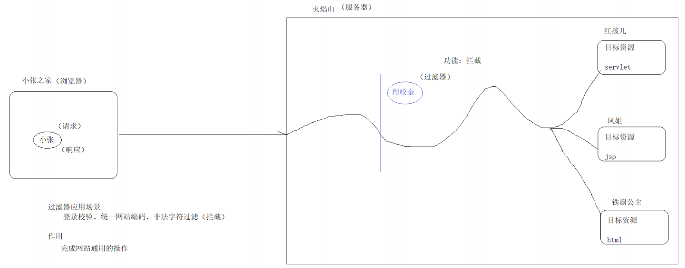
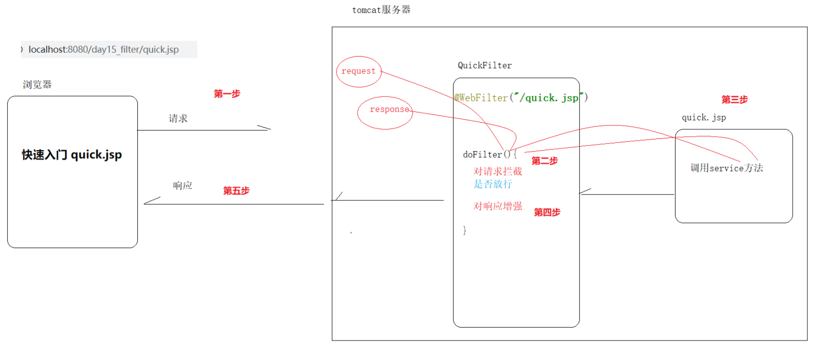
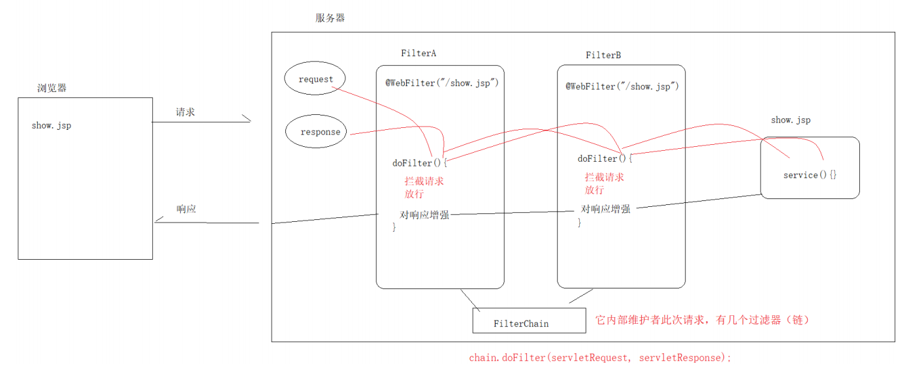
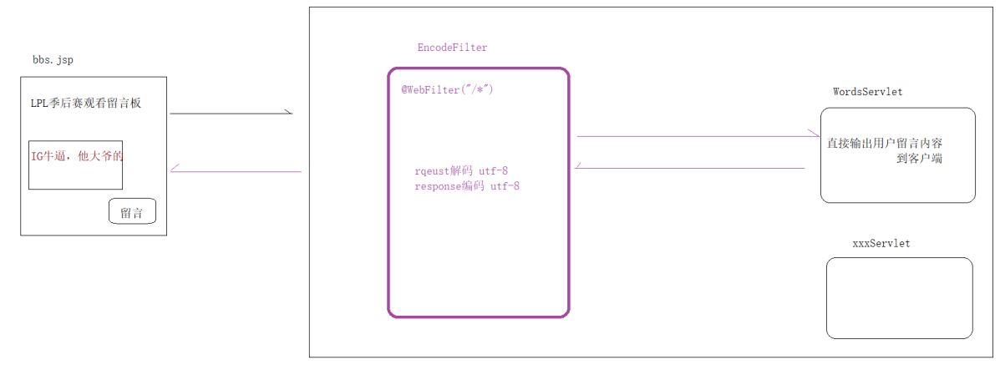

# 大数据学习-Java Day38

##   Filter & Listener 

###  1 Filter 

#### 概述

-  生活中的过滤器 
  - 净水器
  - 空气净化器
  - 地铁安检
  - 山大王 
- web中的过滤器 
  - 当用户访问服务器资源时，过滤器将请求拦截下来，完成一些通用的操作 
  - 应用场景 
    - 登录验证
    - 统一编码处理
    - 敏感字符过滤 



#####  需求：编写filter对目标资源servlet进行拦截 

1.  编写java类，实现filter接口 

   ```java
   public class Demo implements Filter {
       @Override
       public void init(FilterConfig filterConfig) throws ServletException {
       }
   
       /**
        * 此方法拦截用户请求
        *
        * @param servletRequest  ：请求对象
        * @param servletResponse ：响应对象
        * @param filterChain     ：过滤器链（是否放行）
        */
       @Override
       public void doFilter(ServletRequest servletRequest, ServletResponse servletResponse, FilterChain filterChain) throws IOException, ServletException {
           System.out.println("QuickFilter拦截了请求...");
           // 放行
           filterChain.doFilter(servletRequest, servletResponse);
       }
   
       @Override
       public void destroy() {
       }
   }
   
   ```

2.  配置web.xml  

   ```xml
   <?xml version="1.0" encoding="UTF-8"?>
   <web-app xmlns="http://xmlns.jcp.org/xml/ns/javaee"
            xmlns:xsi="http://www.w3.org/2001/XMLSchema-instance"
            xsi:schemaLocation="http://xmlns.jcp.org/xml/ns/javaee http://xmlns.jcp.org/xml/ns/javaee/web-app_4_0.xsd"
            version="4.0">
   
       <!--快速入门-->
       <!--注册filter-->
       <filter>
           <filter-name>QuickFilter</filter-name>
           <filter-class>com.bigdata.Demo</filter-class>
       </filter>
       <!--配置filter拦截路径-->
       <filter-mapping>
           <filter-name>QuickFilter</filter-name>
           <url-pattern>/*</url-pattern>
       </filter-mapping>
   </web-app>
   ```

#### 工作原理




#### 使用细节

##### 生命周期

 生命周期：指的是一个对象从生（创建）到死（销毁）的一个过程 

```java
// 初始化方法
public void init(FilterConfig config);

// 执行拦截方法
public void doFilter(ServletRequest request, ServletResponse response,FilterChain chain);

// 销毁方法
public void destroy();

```


```markdown
* 创建
        服务器启动项目加载，创建filter对象，执行init方法（只执行一次）
* 运行（过滤拦截）
        用户访问被拦截目标资源时，执行doFilter方法
* 销毁
        服务器关闭项目卸载时，销毁filter对象，执行destroy方法（只执行一次）
* 补充：
        过滤器一定是优先于servlet创建的
```

```java

// @WebFilter(value = "/show.jsp"})
public class Demo implements Filter {
    /*
    filterConfig 它是filter的配置对象
    注意作用：获取filter的初始化参数
    */private String encode;

    @Override
    public void init(FilterConfig filterConfig) throws ServletException {
        System.out.println("LifecycleFilter创建了...执行init方法");
    }

    @Override
    public void doFilter(ServletRequest servletRequest, ServletResponse
            servletResponse, FilterChain filterChain) throws IOException, ServletException {
        System.out.println("LifecycleFilter拦截了请求...执行deFilter方法");
        // 放行
        filterChain.doFilter(servletRequest, servletResponse);
    }

    @Override
    public void destroy() {
        System.out.println("LifecycleFilter销毁了...执行destroy方法");
    }
}
```

##### 拦截路径

 在开发时，我们可以指定过滤器的拦截路径来定义拦截目标资源的范围 


```java
/*
* 精准匹配
用户访问指定目标资源（/show.jsp）时，过滤器进行拦截
* 目录匹配
用户访问指定目录下（/user/*）所有资源时，过滤器进行拦截
* 后缀匹配
用户访问指定后缀名（*.html）的资源时，过滤器进行拦截
* 匹配所有
用户访问该网站所有资源（/*）时，过滤器进行拦截
*/
// @WebFilter("/show.jsp") 精准匹配
// @WebFilter("/user/*") // 目录匹配
// @WebFilter("*.html") // 后缀匹配
@WebFilter("/*") // 匹配所有
public class Demo implements Filter {
    public void init(FilterConfig config) throws ServletException {
    }

    public void doFilter(ServletRequest servletRequest, ServletResponse servletResponse, FilterChain chain) throws ServletException, IOException {
        System.out.println("UrlPatternFilter拦截了请求...");
        // 放行
        chain.doFilter(servletRequest, servletResponse);
    }

    public void destroy() {
    }
}
```

#####  过滤器链 

 在一次请求中,若我们请求匹配到了多个filter,通过请求就相当于把这些filter串起来了，形成了过滤器 链  

```markdown
* 需求
    用户访问目标资源 /targetServlet时，经过 FilterA FilterB
* 过滤器链执行顺序 （先进后出）
    1.用户发送请求
    2.FilterA拦截，放行
    3.FilterB拦截，放行
    4.执行目标资源 show.jsp
    5.FilterB增强响应
    6.FilterA增强响应
    7.封装响应消息格式，返回到浏览器
* 过滤器链中执行的先后问题....
    配置文件
        谁先声明，谁先执行
            <filter-mapping>
```



####  综合案例 

#####  用户评论留言 

需求： 用户访问某论坛网站，可以写评论的方式对比赛内容进行留言 

```html
<%@ page contentType="text/html;charset=UTF-8" language="java" %>
<html>
<head>
    <title>bbs</title>
</head>
<body>
<h3>LPL季后赛观看留言板</h3>
<hr>
<form action="${pageContext.request.contextPath}/WordsServlet" method="post">
    <textarea name="content" id="" cols="30" rows="10"></textarea>
    <input type="submit" value="请留言">
</form>
</body>
</html>

```

```java
@WebServlet("/WordsServlet")
public class Demo extends HttpServlet {
    protected void doGet(HttpServletRequest request, HttpServletResponse response) throws ServletException, IOException {
        this.doPost(request, response);
    }

    protected void doPost(HttpServletRequest request, HttpServletResponse response) throws ServletException, IOException {
        // 1.接收请求参数 content
        String content = request.getParameter("content");
        // 2.将结果响应到 浏览器
        response.getWriter().write(content);
    }
}
```

#####  统一网站编码 

 需求 ：tomcat8.5版本中已经将get请求的中文乱码解决了,但是post请求还存在中文乱码 浏览器发出的任何请求，通过过滤器统一处理中文乱码  



 **代码实现** 

 真实场景中，过滤器不会统一响应mime类型 

```java
// @WebFilter("/*")
public class Demo implements Filter {
    private String encode="UTF-8";
    public void doFilter(ServletRequest servletRequest, ServletResponse servletResponse, FilterChain chain) throws ServletException, IOException {
        // 类型向下转型
        HttpServletRequest request = (HttpServletRequest) servletRequest;
        HttpServletResponse response = (HttpServletResponse) servletResponse;
        // 判断用户是否为post请求，才设置编码
        if (request.getMethod().equalsIgnoreCase("post")) {
            request.setCharacterEncoding(encode);
        }
        response.setContentType("text/html;charset="+encode);
        // 放行
        chain.doFilter(servletRequest, servletResponse);
    }
    public void destroy() {
    }
}
```

```xml
    <!--统一网站编码-->
    <filter>
        <filter-name>EncodeFilter</filter-name>
        <filter-class>com.bigdata.Demo</filter-class>
        <init-param>
            <param-name>encode</param-name>
            <param-value>UTF-8</param-value>
        </init-param>
    </filter>
    <filter-mapping>
        <filter-name>EncodeFilter</filter-name>
        <url-pattern>/*</url-pattern>
    </filter-mapping>
```

###  Listener

#### 概述

 **生活中的监听器** 

我们很多商场有摄像头，监听着客户的一举一动。如果客户有违法行为，商场可以采取相应的措施。

 **javaweb中的监听器** 

在我们的java程序中，有时也需要监视某些事情，一旦被监听的对象发生相应的变化，我们应该采取相 应的操作。 

监听web三大域对象：HttpServletRequest、HttpSession、ServletContext 通过监听器监听三大域对 象它们的创建和销毁 

**场景** 

历史访问次数、统计在线人数、系统启动时初始化配置信息 


 监听器可以在项目启动和销毁的时候做一些事情,例如,在项目启动的时候加载配置文件。  

 使用ServletContextListenner  因为这个监听器是监听器中使用率最高的一个,且监听器的使用方式都差不多 


#####  ServletContextListener接口的API介绍 

```java
void contextDestroyed(ServletContextEvent sce) 监听servletcontext销毁
void contextInitialized(ServletContextEvent sce) 监听servletcontext创建
```

##### 使用步骤

1.  创建一个类实现ServletContextListenner接口 
2. 实现ServletContextListenner的contextInitialized和contextDestroyed方法。
3. 给这个类在xml中配置 

```java
import javax.servlet.ServletContext;
import javax.servlet.ServletContextEvent;
import javax.servlet.ServletContextListener;

public class Demo implements ServletContextListener {
    @Override
    public void contextInitialized(ServletContextEvent servletContextEvent) {
        System.out.println("服务器启动，servletContext被创建了");
    }

    @Override
    public void contextDestroyed(ServletContextEvent servletContextEvent) {
        System.out.println("服务器停止，servletContext被销毁了");
    }
}
```

```xml
    <listener>
        <listener-class>com.bigdata.Demo</listenerclass>
    </listener>
```

 同理：使用如下接口以相同的方式也可以监听到session对象和request对象的创建和销毁 

HttpSessionListener：监听Httpsession域的创建于销毁的监听器 

ServletRequestListener：监听ServletRequest域的创建于销毁的监听器 