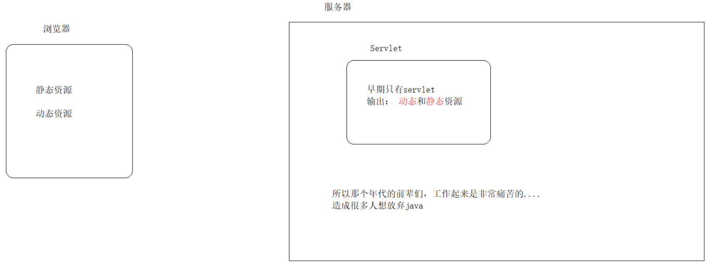
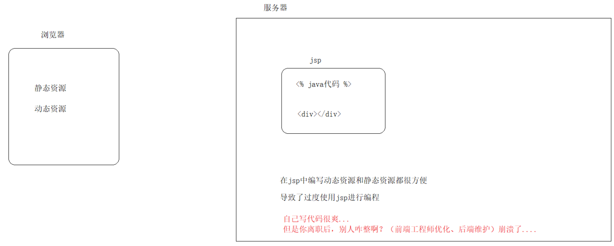
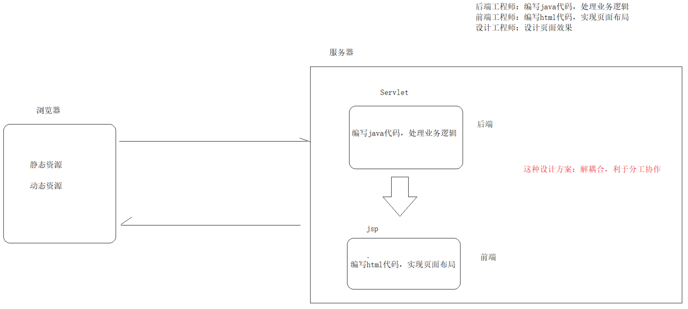
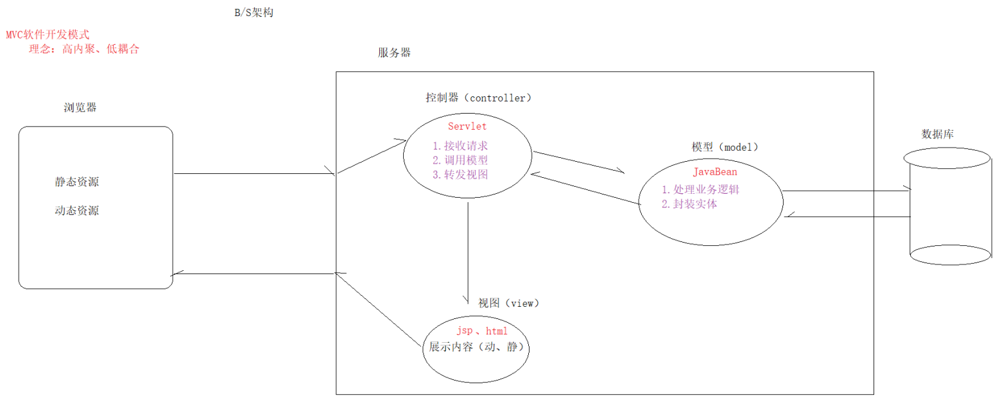
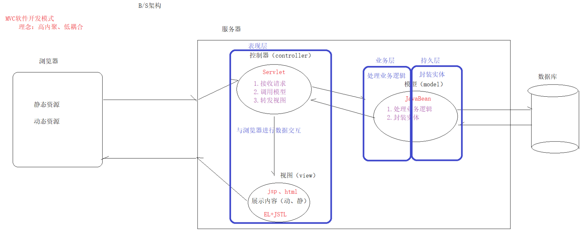
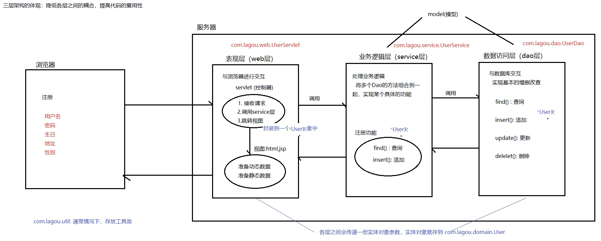

# 大数据学习-Java Day39

##    MVC模式&三层架构 

### 1 MVC模式

#### JSP发展史

-  早期只有servlet，只能使用response输出html标签，非常麻烦。 



-  后来有了JSP，简化了servlet开发；如果过度使用JSP，在JSP页面中写了大量的java代码和html标 签，造成难于维护，难于分工协作的场景。 



-  再后来为了弥补过度使用jsp的问题，我们使用servlet+jsp这套组合拳，利于分工协作。 



####  MVC介绍 

 MVC设计模式： Model-View-Controller简写。 

MVC是软件工程中的一种软件架构模式，它是一种分离业务逻辑与显示界面的设计方法。 

简单来说：前辈们总结的一套设计经验，适合在各种软件开发领域，

目的：高内聚，低耦合 

```markdown
* M：model（模型） JavaBean（1.处理业务逻辑、2.封装实体）

* V：view（视图） Jsp（展示数据）

* C：controller（控制器）Servlet（1.接收请求、2.调用模型、3.转发视图） MVC:笔试题

* 优缺点

    优点
        降低耦合性，方便维护和拓展，利于分工协作
        
    缺点
        使得项目架构变得复杂，对开发人员要求高
```



### 2 三层架构

 **改造了MVC以后的架构，就称为三层架构** 



#### 概念

-  通常意义上的三层架构就是将整个业务应用划分为：
  - 表示（现）层、业务逻辑层、数据访问层。 
- 区分层次的目的 为了高内聚低耦合的思想 
  - 表示（现）层：又称为web层，与浏览器进行数据交互（控制器和视图） 
  - 业务逻辑层：又称为service层，处理业务数据（if判断，for循环） 
  - 数据访问（持久）层：又称为dao层，与数据库进行交互的（每一条（行）记录与javaBean实体 对应）  

#####  包目录结构 

```markdown
* com.lagou 基本包（公司域名倒写）

* com.lagou.dao 持久层

* com.lagou.service 业务层

* com.lagou.web 表示层

* com.lagou.domain 实体（JavaBean）

* com.lagou.util 工具
```

