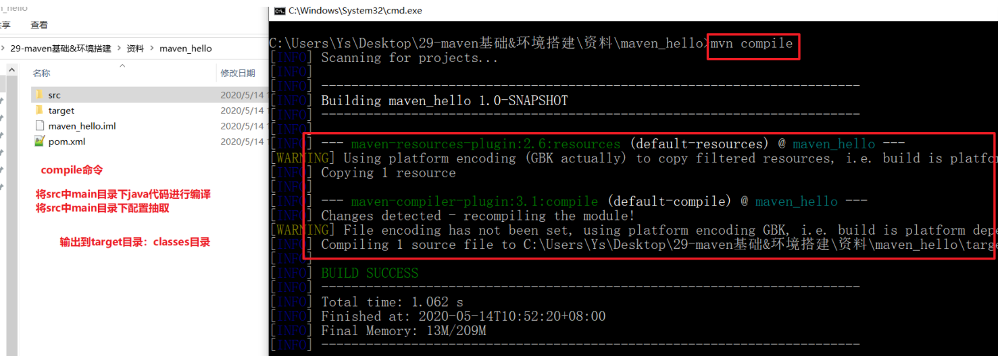
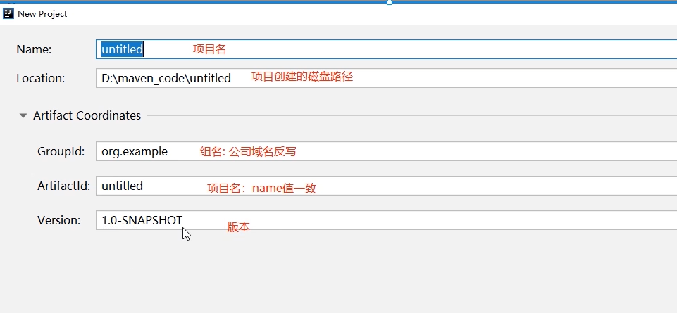
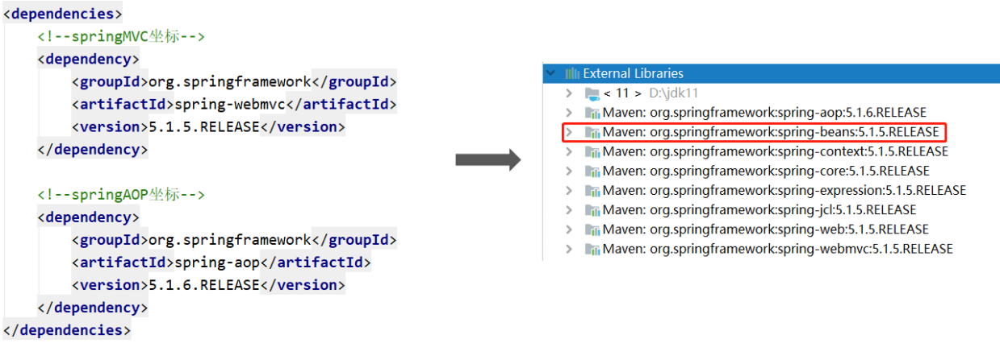

#  大数据学习-Java Day40

##     Maven 

### 1  Maven简介 

####  Maven概述

 Maven 翻译为"专家"、"内行"，是 Apache 下的一个纯 Java 开发的开源项目。 

**一个对 Maven 比较正式的定义是这么说的： Maven 是一个项目管理工具，它包含了一个项目对象模型，一组标准集合，一个项目生命周期，一 个依赖管理系统，和用来运行定义在生命周期阶段中插件目标的工具。** 

####  Maven的两个核心功能 

#####  依赖管理 

```markdown
* 传统的 WEB 工程中，我们必须将工程所依赖的 jar 包复制到工程中，导致了工程的变得很大。

* maven的 WEB 工程中不直接将jar包导入到工程中，而是通过在 pom.xml 文件中添加所需jar包的坐标。项目运行时，通过读取坐标 到一个专门用于“存放jar包仓库"（Maven仓库）找到相应的jar包
```


 **仓库如何存放jar包？** 


#####  项目构建 

```markdown
* 开发的项目，往往都要经历编译、测试、打包、安装，部署等一系列过程。

* 什么是构建项目
		指的是项目从编译、测试、打包、安装，部署整个过程都交给maven进行管理，这个过程称为构建。
		
* 一键构建
		指的是整个构建过程，使用 maven 一个命令可以轻松完成整个工作。

```

### 2  Maven安装和使用 

####  Maven下载和安装 

```markdown
* 下载
		Maven官网下载地址 ：http://maven.apache.org/download.cgi
* 安装
		Maven使用java语言开发的，解压即可运行
		注意：maven依赖 JAVA_HOME 且解压目录不能有中文
* 目录
        bin：存放了 maven 的命令
        boot：存放了一些 maven 本身的引导程序，如类加载器等
        conf：存放了 maven 的一些配置文件，如 setting.xml 文件
        lib：存放了 maven 本身运行所需的一些 jar 包
* 环境变量
        MAVEN_HOME: maven安装目录
        path: %MAVEN_HOME%\bin
* 配置完毕了
		mvn --version
```

####  Maven仓库 

#####  Maven仓库的分类 

```markdown
1. 本地仓库
		项目通过jar坐标，先从本地仓库找对应jar包，如果找不到会从远程仓库（互联网）去下载 jar包，保存在本地仓库（在程序员的电脑上），第二次不需要从远程仓库去下载。
2. 远程仓库
    2.1 中央仓库
        由专业团队（maven团队）统一维护。
        中央仓库的地址：http://repo1.maven.org/maven2/
    2.2 私服
        架设在公司局域网内，提供给内部的人员使用。
    2.3 第三方仓库
        中央仓库只有一个国内使用非常慢，我们可以更换为：阿里云镜像
        
        
* 笔试题：通过依赖坐标引入jar包，仓库的查找顺序
	本地仓库 -> 私服 -> 中央空调 

```


#####  Maven本地仓库的配置 

```markdown
1. 将资料中的 repository.zip 解压到非中文及特殊符号目录下

2. 修改 maven的安装目录/conf/settings.xml 文件的标签
		<localRepository>本地仓库地址</localRepository>
```


 **指定自定义本地仓库** 


#####  Maven仓库国内镜像配置 

 修改 maven 根目录下的 conf 文件夹中的 setting.xml 文件，在 mirrors 节点上，添加内容如下：  

```xml
<mirrors>
    <mirror>
        <id>alimaven</id>
        <name>aliyun maven</name>
        <url>http://maven.aliyun.com/nexus/content/groups/public/</url>
        <mirrorOf>central</mirrorOf>
    </mirror>
</mirrors>
```

####  Maven坐标和依赖 

 想要只用哪个jar包，通过坐标方式进行依赖引入 


####  Maven工程的结构 

 **传统的javaweb工程遇到的问题** 


```markdown
* java项目
    java工程名（项目名）
        |-- src目录
            |-- main目录（主干代码）
                |-- java目录（java代码）
                |-- resources目录（配置文件）
            |-- test目录（测试代码）
                |-- java目录（java代码）
                |-- resources目录（配置文件）
        |-- pom.xml（maven工程核心配置文件）
        |-- target目录（存放编译后的class文件.....）
* web项目【重点】
    web工程名（项目名）
        |-- src目录
            |-- main目录（主干代码）
                |-- java目录（java代码）
                |-- resources目录（配置文件）
                |-- webapp目录（页面资源）
                    |-- WEB-INF
                        |-- web.xml(web工程核心配置文件)
                    |-- index.jsp
                    |-- css、js、img..
            |-- test目录（测试代码）
                |-- java目录（java代码）
                |-- resources目录（配置文件）
        |-- pom.xml（maven工程核心配置文件）
        |-- target目录（存放编译后的class文件.....）
```

### 3  Maven生命周期和插件 

####  Maven常用命令和插件 

 我们可以在 cmd 中通过一系列的 maven 命令，来对我们的工程进行清理、编译、测试、打包、安装、 部署。  

1.  clean 

   -  maven工程的清理命令，执行clean会删除target目录及内容。

     

2.   compile 

   1.  maven工程的编译命令，作用是将 src/main/java 下的文件编译为class文件输出到target目录下。  

      

3.  test 

   -  maven工程的测试命令，作用是执行 src/test/java 下单元测试类，并编译为class文件。 

     

     

4. package

   -  maven工程的打包命令，对于java工程执行package打成jar包，对于web工程打成war包。 

     

     

5.  install 

   -  maven工程的安装命令，执行install将mave工程打成jar包或war包，并发布到本地仓库。 

     

6.  deploy 

   -  maven工程部署命令，将jar或war包部署（上传）到私服中。 

####  生命周期 

 maven 对项目构建过程分为“三套相互独立的”生命周期，这三套生命周期分别是：  

```markdown
1. Clean Lifecycle(清理生命周期)
        在进行真正的构建之前进行一些清理工作。
        命令:clean
        
2. Default Lifecycle(默认生命周期)
        构建的核心部分，编译，测试，打包，部署等等。
        命令: compile test package install deploy
        
3. Site Lifecycle(站点生命周期)
        生成项目报告，站点，发布站点。
        命令: site
        
* 在同一个生命周期中的命令,执行后面的命令,前面的命令自动执行
```


### 4 IDEA创建Maven工程 

####  IDEA配置本地Maven环境（全局...） 


 我们在IDEA创建maven工程默认从互联网在下载一个骨架（但是我们电脑没有联网，就会卡顿一段 时间，再使用本地骨架），我们可以直接指定IDEA查找本地骨架，效率提升 

```
-DarchetypeCatalog=internal -Dfile.encoding=GB2312
```


####   IDEA创建工程 

#####   java工程 




 **手动创建test测试配置文件目录** 


 **指定maven环境的jdk版本和字符集** 

```xml
<build>
    <plugins>
        <!-- 设置编译版本为1.8 -->
        <plugin>
            <groupId>org.apache.maven.plugins</groupId>
                <artifactId>maven-compiler-plugin</artifactId>
                <version>3.1</version>
                <configuration>
                    <source>1.8</source>
                    <target>1.8</target>
                    <encoding>UTF-8</encoding>
            </configuration>
        </plugin>
    </plugins>
</build>
```


 **maven工程命令操作** 


 **如何导入依赖** 

 maven的搜索仓库：< 


#####  web工程 


 **idea创建web工程，需要我们安装一个插件** 


 安装成功后，重启idea工具 


 **注意 ： 创建完maven之后，文件夹可能不会变颜色** 


####  发布web工程 

#####   idea使用外置tomcat运行  （跟之前的方式一样） 


#####   idea使用maven内置tomcat插件 

```xml
 <build>
        <plugins>
            <!-- 设置编译版本为1.8 -->
            <plugin>
                <groupId>org.apache.maven.plugins</groupId>
                <artifactId>maven-compiler-plugin</artifactId>
                <version>3.1</version>
                <configuration>
                    <source>1.8</source>
                    <target>1.8</target>
                    <encoding>UTF-8</encoding>
                </configuration>
            </plugin>
            <plugin>
                <groupId>org.apache.tomcat.maven</groupId>
                <artifactId>tomcat7-maven-plugin</artifactId>
                <version>2.2</version>
                <configuration>
                    <port>8080</port>
                    <path>/</path>
                    <uriEncoding>utf-8</uriEncoding>
                </configuration>
            </plugin>
        </plugins>
    </build>
```


 **双击启动** 


 **命令启动** 


####  依赖范围 

| 依赖范围         | 对于编译 classpath有效 | 对于测试 classpath有效 | 对于运行时 classpath有效 | 例子        |
| ---------------- | ---------------------- | ---------------------- | ------------------------ | ----------- |
| compile（默 认） | Y                      | Y                      | Y                        | mybatis     |
| test             | -                      | Y                      | -                        | junit       |
| provided         | Y                      | Y                      | -                        | servlet-api |
| runtime - Y Y    | -                      | Y                      | Y                        | JDBC驱 动   |


```markdown
* compile
		默认依赖范围，作用域在编译、测试、运行时都有效。
* test
		作用域在测试时有效。编译和运行时不需要，比如：Junit。
* provided
		作用域在编译、测试时有效。运行时不需要，比如： servlet api 被 tomcat 容器提供。
* runtime
		作用域在测试、运行时有效。编译时不需要，比如：jdbc的驱动包。
```

###  5 Maven的依赖传递 

#### 依赖传递概述 

 在maven中，依赖是可以传递的，假设存在三个项目，分别是项目A，项目B以及项目C。假设C依赖 B，B依赖A，那么我们可以根据maven项目依赖的特征不难推出项目C也依赖A。 


 通过上面的图可以看到，我们的web项目直接依赖了spring-webmvc，而spring-webmvc依赖了spingaop、spring-beans等。最终的结果就是在我们的web项目中间接依赖了spring-aop、spring-beans 等。 

######  依赖冲突 

 由于依赖传递现象的存在， spring-webmvc 依赖 spirng-beans-5.1.5，spring-aop 依赖 springbeans-5.1.6，但是发现 spirng-beans-5.1.5 加入到了工程中，而我们希望 spring-beans-5.1.6 加入工 程。这就造成了依赖冲突。 



####  如何解决依赖冲突 

1.  使用maven提供的依赖调解原则 
   - 第一声明者优先原则 
   - 路径近者优先原则 
2. 排除依赖
3. 锁定版本 

####  依赖调节原则——第一声明者优先原则 

 在 pom 文件中定义依赖，以先声明的依赖为准。其实就是根据坐标导入的顺序来确定最终使用哪个传 递过来的依赖。 


 结论：通过上图可以看到，spring-aop和spring-webmvc都传递过来了spring-beans，但是因为 spring-aop在前面，所以最终使用的spring-beans是由spring-aop传递过来的，而spring-webmvc传递 过来的spring-beans则被忽略了。 

####  依赖调节原则——路径近者优先原则 


 总结：直接依赖大于依赖传递 

####  排除依赖 

 可以使用exclusions标签将传递过来的依赖排除出去。 


####  版本锁定 

 采用直接锁定版本的方法确定依赖jar包的版本，版本锁定后则不考虑依赖的声明顺序或依赖的路径，以 锁定的版本为准添加到工程中，此方法在企业开发中经常使用。 

- 版本锁定的使用方式： 
  - 第一步：在dependencyManagement标签中锁定依赖的版本 
  - 第二步：在dependencies标签中声明需要导入的maven坐标 
    -  在dependencyManagement标签中锁定依赖的版本 
    -  在dependencies标签中声明需要导入的maven坐标 

####  properties标签的使用 

```xml

<properties>
    <spring.version>5.1.5.RELEASE</spring.version>
    <springmvc.version>5.1.5.RELEASE</springmvc.version>
    <mybatis.version>3.5.1</mybatis.version>
</properties>
        <!--锁定jar版本-->
<dependencyManagement>
    <dependencies>
        <!-- Mybatis -->
        <dependency>
            <groupId>org.mybatis</groupId>
            <artifactId>mybatis</artifactId>
            <version>${mybatis.version}</version>
        </dependency>
        <!-- springMVC -->
        <dependency>
            <groupId>org.springframework</groupId>
            <artifactId>spring-webmvc</artifactId>
            <version>${springmvc.version}</version>
        </dependency>
        <!-- spring -->
        <dependency>
            <groupId>org.springframework</groupId>
            <artifactId>spring-context</artifactId>
            <version>${spring.version}</version>
        </dependency>
        <dependency>
            <groupId>org.springframework</groupId>
            <artifactId>spring-core</artifactId>
            <version>${spring.version}</version>
        </dependency>
        <dependency>
            <groupId>org.springframework</groupId>
            <artifactId>spring-aop</artifactId>
            <version>${spring.version}</version>
        </dependency>
        <dependency>
            <groupId>org.springframework</groupId>
            <artifactId>spring-web</artifactId>
            <version>${spring.version}</version>
        </dependency>
        <dependency>
            <groupId>org.springframework</groupId>
            <artifactId>spring-expression</artifactId>
            <version>${spring.version}</version>
        </dependency>
        <dependency>
            <groupId>org.springframework</groupId>
            <artifactId>spring-beans</artifactId>
            <version>${spring.version}</version>
        </dependency>
        <dependency>
            <groupId>org.springframework</groupId>
            <artifactId>spring-aspects</artifactId>
            <version>${spring.version}</version>
        </dependency>
        <dependency>
            <groupId>org.springframework</groupId>
            <artifactId>spring-context-support</artifactId>
            <version>${spring.version}</version>
        </dependency>
        <dependency>
            <groupId>org.springframework</groupId>
            <artifactId>spring-test</artifactId>
            <version>${spring.version}</version>
        </dependency>
        <dependency>
            <groupId>org.springframework</groupId>
            <artifactId>spring-jdbc</artifactId>
            <version>${spring.version}</version>
        </dependency>
        <dependency>
            <groupId>org.springframework</groupId>
            <artifactId>spring-tx</artifactId>
            <version>${spring.version}</version>
        </dependency>
    </dependencies>
</dependencyManagement>
```

### 6 maven聚合工程 

####  概念 

 在现实生活中，汽车厂家进行汽车生产时，由于整个生产过程非常复杂和繁琐，工作量非常大，所以厂 家都会将整个汽车的部件分开生产，最终再将生产好的部件进行组装，形成一台完整的汽车。 

####  分模块构建maven工程分析  

 在企业项目开发中，由于项目规模大，业务复杂，参与的人员比较多，一般会通过合理的模块拆分将一 个大型的项目拆分为N多个小模块，分别进行开发。而且拆分出的模块可以非常容易的被其他模块复用 

常见的拆分方式有两种： 

​	第一种：按照业务模块进行拆分，每个模块拆分成一个maven工程，例如将一个项目分为用户模块，订 单模块，购物车模块等，每个模块对应就是一个maven工程 

​	第二种：按照层进行拆分，例如持久层、业务层、表现层等，每个层对应就是一个maven工程 

不管上面那种拆分方式，通常都会提供一个父工程，将一些公共的代码和配置提取到父工程中进行统一 管理和配置 


####  maven工程的继承 

 在Java语言中，类之间是可以继承的，通过继承，子类就可以引用父类中非private的属性和方法。同 样，在maven工程之间也可以继承，子工程继承父工程后，就可以使用在父工程中引入的依赖。继承的 目的是为了消除重复代码。  


####  maven工程的聚合 

 在maven工程的pom.xml文件中可以使用标签将其他maven工程聚合到一起，聚合的目的是为了进行 统一操作。 

例如拆分后的maven工程有多个，如果要进行打包，就需要针对每个工程分别执行打包命令，操作起来 非常繁琐。这时就可以使用标签将这些工程统一聚合到maven父工程中，需要打包的时候，只需要在此 工程中执行一次打包命令，其下被聚合的工程就都会被打包了。 


####  分模块构建maven工程具体演示 

 工程整体结构如下：

1. maven_parent为父工程，其余工程为子工程，都继承父工程maven_parent
2. maven_parent工程将其子工程都进行了聚合
3. 子工程之间存在依赖关系： 
   - maven_dao依赖maven_domain 
   - maven_service依赖maven_dao 
   - maven_web依赖maven_service 