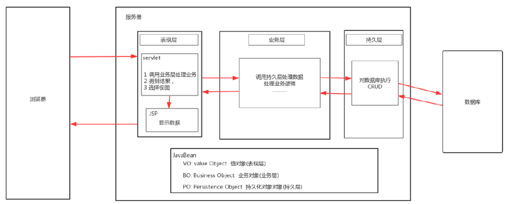
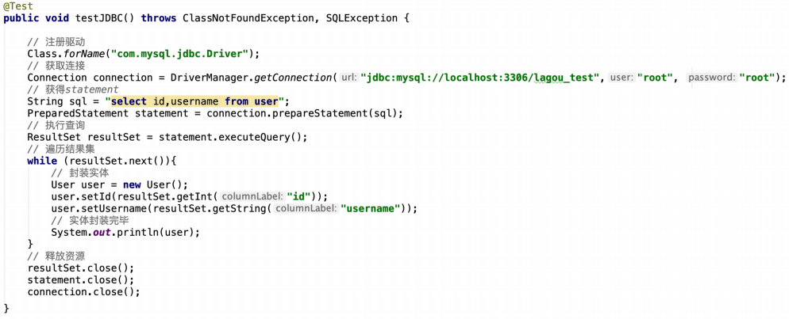
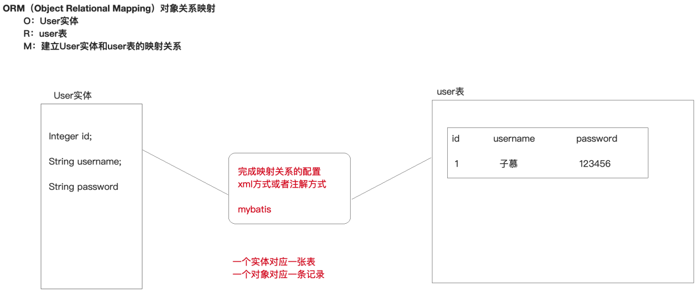
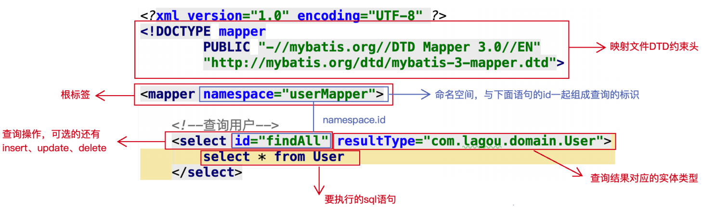

# 大数据学习-Java Day41

##  MyBatis之MyBatis基本应用 

### 1 框架简介

#### 三层架构

-  软件开发常用的架构是三层架构，之所以流行是因为有着清晰的任务划分。
- 一般包括以下三层：
  - 持久层：主要完成与数据库相关的操作，即对数据库的增删改查。 
    - 因为数据库访问的对象一般称为Data Access Object（简称DAO），所以有人把持久层叫做DAO 层。 
  - 业务层：主要根据功能需求完成业务逻辑的定义和实现。 
    - 因为它主要是为上层提供服务的，所以有人把业务层叫做Service层或Business层。 
  - 表现层：主要完成与最终软件使用用户的交互，需要有交互界面（UI）。  
    -  因此，有人把表现层称之为web层或View层。  

 三层架构之间调用关系为:表现层调用业务层，业务层调用持久层。 

各层之间必然要进行数据交互，我们一般使用java实体对象来传递数据。 



#### 框架

##### 框架概述

 框架就是一套规范，既然是规范，你使用这个框架就要遵守这个框架所规定的约束。 

框架可以理解为半成品软件，框架做好以后，接下来在它基础上进行开发 

#####  使用框架原因  

 框架为我们封装好了一些冗余，且重用率低的代码。并且使用反射与动态代理机制，将代码实现了通 用性，让 开发人员把精力专注在核心的业务代码实现上。 

比如在使用servlet进行开发时，需要在servlet获取表单的参数，每次都要获取很麻烦，而框架底层 就使用反射机制和拦截器机制帮助我们获取表单的值，使用jdbc每次做专一些简单的crud的时候都必须 写sql，但使用框架就不需要这么麻烦了，直接调用方法就可以。当然，既然是使用框架，那么还是要 遵循其一些规范进行配置  

#####  常见的框架 

 Java世界中的框架非常的多，每一个框架都是为了解决某一部分或某些问题而存在的。

- 下面列出在目 前企业中 流行的几种框架（一定要注意他们是用来解决哪一层问题的）： 
  - 持久层框架：专注于解决数据持久化的框架。常用的有mybatis、hibernate、spring jdbc等等。 
  - 表现层框架：专注于解决与用户交互的框架。常见的有struts2、spring mvc等等。 
  - 全栈框架: 能在各层都给出解决方案的框架。比较著名的就是spring。 

以企业中最常用的组合为准来学习Spring + Spring MVC + mybatis（SSM） 

### 2  Mybatis简介 

####  原始jdbc操作 



####  原始jdbc操作的分析 

 原始jdbc开发存在的问题如下：

1.  数据库连接创建、释放频繁造成系统资源浪费从而影响系统性能 
2. sql 语句在代码中硬编码，造成代码不易维护，实际应用 sql 变化的可能较大，sql 变动需要改变java 代码。 
3. 查询操作时，需要手动将结果集中的数据手动封装到实体中。 

 应对上述问题给出的解决方案 

1.  使用数据库连接池初始化连接资源 
2. 将sql语句抽取到xml配置文件中 
3. 使用反射、内省等底层技术，自动将实体与表进行属性与字段的自动映射 

####   Mybatis简介 

 MyBatis是一个优秀的基于**ORM的半自动轻量级持久层框架**，它对jdbc的操作数据库的过程进行封装， 使开发者只需要关注 SQL 本身，而不需要花费精力去处理例如注册驱动、创建connection、创建 statement、手动设置参数、结果集检索等jdbc繁杂的过程代码 

**mybatis 历史** 

MyBatis 本是apache的一个开源项目iBatis, 2010年6月这个项目由apache software foundation 迁移 到了google code，随着开发团队转投到Google Code旗下，iBatis正式改名为MyBatis ，代码于2013 年11月迁移到Github 

Github地址：https://github.com/mybatis/mybatis-3/ 

####  ORM思想 

-  ORM（Object Relational Mapping）对象关系映射 
  - O（对象模型）： 实体对象，即我们在程序中根据数据库表结构建立的一个个实体javaBean 
  - R（关系型数据库的数据结构）： 关系数据库领域的Relational（建立的数据库表） 
  - M（映射）： 从R（数据库）到O（对象模型）的映射，可通过XML文件映射 

**实现**

1.  让实体类和数据库表进行一一对应关系 
   - 先让实体类和数据库表对应 
   - 再让实体类属性和表里面字段对应 
2. 不需要直接操作数据库表，直接操作表对应的实体类对象 



 ORM作为是一种思想 

跟踪实体的变化,并将实体的变化翻译成sql脚本,执行到数据库中去,也就是将实体的变化映射到 了表的变化。

mybatis采用ORM思想解决了实体和数据库映射的问题，对jdbc 进行了封装，屏蔽了jdbc api 底层访问 细节，使我们不用与jdbc api 打交道，就可以完成对数据库的持久化操作 

### 3  Mybatis快速入门 

####  MyBatis开发步骤 

MyBatis官网地址：http://www.mybatis.org/mybatis-3/ 

 案例需求：通过mybatis查询数据库user表的所有记录，封装到User对象中，打印到控制台上 

```markdown
1. 创建数据库及user表

2. 创建maven工程，导入依赖（MySQL驱动、mybatis、junit）

3. 编写User实体类

4. 编写UserMapper.xml映射配置文件（ORM思想）

5. 编写SqlMapConfig.xml核心配置文件
    数据库环境配置
    映射关系配置的引入(引入映射配置文件的路径)
    
6. 编写测试代码
    // 1.加载核心配置文件
    // 2.获取sqlSessionFactory工厂对象
    // 3.获取sqlSession会话对象
    // 4.执行sql
    // 5.打印结果
    // 6.释放资源
```

####   代码实现 

#####  创建user数据表 

```mysql
CREATE DATABASE `mybatis_db`;
USE `mybatis_db`;

CREATE TABLE `user` (
    `id` int(11) NOT NULL auto_increment,
    `username` varchar(32) NOT NULL COMMENT '用户名称',
    `birthday` datetime default NULL COMMENT '生日',
    `sex` char(1) default NULL COMMENT '性别',
    `address` varchar(256) default NULL COMMENT '地址',
    PRIMARY KEY (`id`)
) ENGINE=InnoDB DEFAULT CHARSET=utf8;

-- insert....
insert into `user`(`id`,`username`,`birthday`,`sex`,`address`) values (1,'子
慕','2020-11-11 00:00:00','男','北京海淀'),(2,'应颠','2020-12-12 00:00:00','男','北
京海淀');

```

#####  导入MyBatis的坐标和其他相关坐标 

```xml
    <!--指定编码和版本-->
    <properties>
        <project.build.sourceEncoding>UTF-8</project.build.sourceEncoding>
        <maven.compiler.encoding>UTF-8</maven.compiler.encoding>
        <java.version>1.11</java.version>
        <maven.compiler.source>1.11</maven.compiler.source>
        <maven.compiler.target>1.11</maven.compiler.target>
    </properties>
    <!--mybatis坐标-->
    <dependency>
        <groupId>org.mybatis</groupId>
        <artifactId>mybatis</artifactId>
        <version>3.5.4</version>
    </dependency>
    <!--mysql驱动坐标-->
    <dependency>
        <groupId>mysql</groupId>
        <artifactId>mysql-connector-java</artifactId>
        <version>5.1.6</version>
        <scope>runtime</scope>
    </dependency>
    <!--单元测试坐标-->
    <dependency>
        <groupId>junit</groupId>
        <artifactId>junit</artifactId>
        <version>4.12</version>
        <scope>test</scope>
    </dependency>
```

#####  编写User实体  

```java
public class User {
    private Integer id;
    private String username;
    private Date birthday;
    private String sex;
    private String address;
    // getter/setter 略
}
```

#####  编写UserMapper映射文件 

```xml
<?xml version="1.0" encoding="UTF-8" ?>
<!DOCTYPE mapper
	PUBLIC "-//mybatis.org//DTD Mapper 3.0//EN"
    "http://mybatis.org/dtd/mybatis-3-mapper.dtd">
<mapper namespace="UserMapper">
    <!--查询所有-->
    <select id="findAll" resultType="com.lagou.domain.User">
        select * from user
    </select>
</mapper>
```

#####  编写MyBatis核心文件 

```xml
<?xml version="1.0" encoding="UTF-8" ?>
<!DOCTYPE configuration
    PUBLIC "-//mybatis.org//DTD Config 3.0//EN"
    "http://mybatis.org/dtd/mybatis-3-config.dtd">
<configuration>
    <!--环境配置-->
    <environments default="mysql">
        <!--使用MySQL环境-->
        <environment id="mysql">
            <!--使用JDBC类型事务管理器-->
            <transactionManager type="JDBC"></transactionManager>
            <!--使用连接池-->
            <dataSource type="POOLED">
                <property name="driver" value="com.mysql.jdbc.Driver">
                </property>
                <property name="url" value="jdbc:mysql:///mybatis_db">
                </property>
                <property name="username" value="root"></property>
                <property name="password" value="root"></property>
            </dataSource>
        </environment>
    </environments>
    <!--加载映射配置-->
    <mappers>
        <mapper resource="com/lagou/mapper/UserMapper.xml"></mapper>
    </mappers>
</configuration>
```

#####  编写测试类 

```JAVA
@Test
public void testFindAll()throws Exception{
    // 加载核心配置文件
    InputStream is=Resources.getResourceAsStream("SqlMapConfig.xml");
    // 获取SqlSessionFactory工厂对象
    SqlSessionFactory sqlSessionFactory=new SqlSessionFactoryBuilder().build(is);
    // 获取SqlSession会话对象
    SqlSession sqlSession=sqlSessionFactory.openSession();
    // 执行sql
    List<User> list=sqlSession.selectList("UserMapper.findAll");
    for(User user:list){
        System.out.println(user);
    }
    // 释放资源
    sqlSession.close();
}
```

### 4  Mybatis映射文件概述 



### 5 Mybatis增删改查 

####  新增 

编写映射文件UserMapper.xml 

```xml
<!--新增-->
<insert id="save" parameterType="com.lagou.domain.User">
    insert into user(username,birthday,sex,address)
        values(#{username},#{birthday},#{sex},#{address})
</insert>
```

编写测试类 

```java
@Test
public void testSave() throws Exception {
    // 加载核心配置文件
    InputStream is = Resources.getResourceAsStream("SqlMapConfig.xml");
    // 获取SqlSessionFactory工厂对象
    SqlSessionFactory sqlSessionFactory = new SqlSessionFactoryBuilder().build(is);
    // 获取SqlSession会话对象
    SqlSession sqlSession = sqlSessionFactory.openSession();
    // 执行sql
    User user = new User();
    user.setUsername("jack");
    user.setBirthday(new Date());
    user.setSex("男");
    user.setAddress("北京海淀");
    sqlSession.insert("UserMapper.save", user);
    // DML语句，手动提交事务
    sqlSession.commit();
    // 释放资源
    sqlSession.close();
}
```

新增注意事项 

```markdown
- 插入语句使用insert标签

- 在映射文件中使用parameterType属性指定要插入的数据类型

- Sql语句中使用#{实体属性名}方式引用实体中的属性值

- 插入操作使用的API是sqlSession.insert(“命名空间.id”,实体对象);

- 插入操作涉及数据库数据变化，所以要使用sqlSession对象显示的提交事务，即sqlSession.commit()

```

####  修改 

 编写映射文件UserMapper.xml 

```xml
<!--修改-->
<update id="update" parameterType="com.lagou.domain.User">
    update user set username = #{username},birthday = #{birthday},
        sex = #{sex},address = #{address} where id = #{id}
</update>
```

编写测试类 

```java
@Test
public void testUpdate() throws Exception {
    // 加载核心配置文件
    InputStream is = Resources.getResourceAsStream("SqlMapConfig.xml");
    // 获取SqlSessionFactory工厂对象
    SqlSessionFactory sqlSessionFactory = new SqlSessionFactoryBuilder().build(is);
    // 获取SqlSession会话对象
    SqlSession sqlSession = sqlSessionFactory.openSession();
    // 执行sql
    User user = new User();
    user.setId(4);
    user.setUsername("lucy");
    user.setBirthday(new Date());
    user.setSex("女");
    user.setAddress("北京朝阳");
    sqlSession.update("UserMapper.update", user);
    // DML语句，手动提交事务
    sqlSession.commit();
    // 释放资源
    sqlSession.close();
}
```

修改注意事项  

```markdown
- 修改语句使用update标签

- 修改操作使用的API是sqlSession.update(“命名空间.id”,实体对象);
```

####  删除  

编写映射文件UserMapper.xml 

```xml
<!--删除-->
<delete id="delete" parameterType="java.lang.Integer">
    delete from user where id = #{id}
</delete>
```

 编写测试类 

```java
@Test
public void testDelete() throws Exception {
    // 加载核心配置文件
    InputStream is = Resources.getResourceAsStream("SqlMapConfig.xml");
    // 获取SqlSessionFactory工厂对象
    SqlSessionFactory sqlSessionFactory = new SqlSessionFactoryBuilder().build(is);
    // 获取SqlSession会话对象
    SqlSession sqlSession = sqlSessionFactory.openSession();
    // 执行sql
    sqlSession.delete("UserMapper.delete", 50);
    // DML语句，手动提交事务
    sqlSession.commit();
    // 释放资源
    sqlSession.close();
}
```

 删除注意事项 

```markdown
- 删除语句使用delete标签

- Sql语句中使用#{任意字符串}方式引用传递的单个参数

- 删除操作使用的API是sqlSession.delete(“命名空间.id”,Object);
```

#### 总结

```markdown
* 查询
    代码：
    	List<User> list = sqlSession.selectList("UserMapper.findAll");
    映射文件：
    <select id="findAll" resultType="com.lagou.domain.User">
    	select * from user
    </select>
* 新增
    代码：
    	sqlSession.insert("UserMapper.save", user);
    映射文件：
    <insert id="save" parameterType="com.lagou.domain.User">
        insert into user(username,birthday,sex,address)
        	values(#{username},#{birthday},#{sex},#{address})
    </insert>
* 修改
    代码：
    	sqlSession.update("UserMapper.update", user);
    映射文件：
    <update id="update" parameterType="com.lagou.domain.User">
        update user set username = #{username},birthday = #{birthday},
            sex = #{sex},address = #{address} where id = #{id}
    </update>
* 删除
    代码：
    	sqlSession.delete("UserMapper.delete", 4);
    映射文件：
    <delete id="delete" parameterType="java.lang.Integer">
        delete from user where id = #{id}
    </delete>
```

