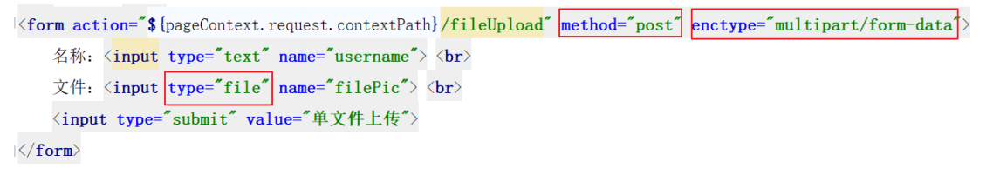
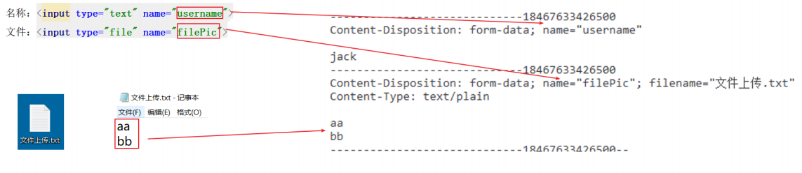
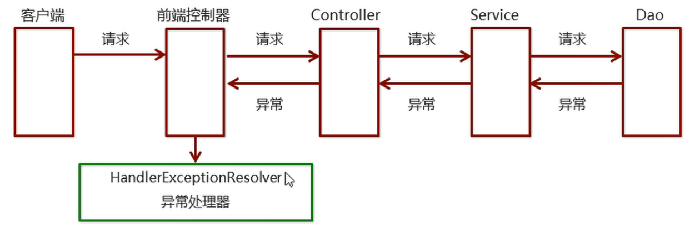

# 大数据学习-Java Day48

##  springmvc进阶 

### 1  ajax异步交互 

 Springmvc默认用MappingJackson2HttpMessageConverter对json数据进行转换，需要加入 jackson的包；同时使用   `<mvc:annotation-driven />`

```xml
<dependency>
    <groupId>com.fasterxml.jackson.core</groupId>
    <artifactId>jackson-databind</artifactId>
    <version>2.9.8</version>
</dependency>
<dependency>
    <groupId>com.fasterxml.jackson.core</groupId>
    <artifactId>jackson-core</artifactId>
    <version>2.9.8</version>
</dependency>
<dependency>
    <groupId>com.fasterxml.jackson.core</groupId>
    <artifactId>jackson-annotations</artifactId>
    <version>2.9.0</version>
</dependency>

```


####  @RequestBody 

 该注解用于Controller的方法的形参声明，当使用ajax提交并指定contentType为json形式时，通过 HttpMessageConverter接口转换为对应的POJO对象。 

```html
<button id="btn1">ajax异步提交</button>
<script>
    $("#btn1").click(function () {
        let url = '${pageContext.request.contextPath}/ajaxRequest';
        let data = '[{"id":1,"username":"张三"},{"id":2,"username":"李四"}]';
        $.ajax({
            type: 'POST',
            url: url,
            data: data,
            contentType: 'application/json;charset=utf-8',
            success: function (resp) {
                alert(JSON.stringify(resp))
            }
        })
    })
</script>

```

```java
@RequestMapping(value = "/ajaxRequest")
public void ajaxRequest(@RequestBody List<User>list) {

    System.out.println(list);
}

```


####   @ResponseBody 

 该注解用于将Controller的方法返回的对象，通过HttpMessageConverter接口转换为指定格式的数 据如：json,xml等，通过Response响应给客户端。 

```java
/*
    @RequestMapping
    produces = "application/json;charset=utf-8" 响应返回数据的mime类型和编码，默认为json
*/
@RequestMapping(value = "/ajaxRequest")
@ResponseBody
public List<User> ajaxRequest(@RequestBody List<User> list) {
    System.out.println(list);
    return list;
}
```


### 2  RESTful 

####  RESTful 简介

 Restful是一种软件架构风格、设计风格，而不是标准，只是提供了一组设计原则和约束条件。主要用 于客户端和服务器交互类的软件，基于这个风格设计的软件可以更简洁，更有层次，更易于实现缓存机 制等。  

 Restful风格的请求是使用“url+请求方式”表示一次请求目的的，HTTP 协议里面四个表示操作方式的动 词如下： 

- GET：读取（Read） 
- POST：新建（Create） 
- PUT：更新（Update） 
- DELETE：删除（Delete） 

| 客户端请求 | 原来风格URL地址     | RESTful风格URL地址 |
| ---------- | ------------------- | ------------------ |
| 查询所有   | /user/findAll       | GET /user          |
| 根据ID查询 | /user/findById?id=1 | GET /user/{1}      |
| 新增       | /user/save          | POST /user         |
| 修改       | /user/update        | PUT /user          |
| 删除       | /user/delete?id=1   | DELETE /user/{1}   |


####  代码实现 

#####  @PathVariable  

 用来接收RESTful风格请求地址中占位符的值 

#####  @RestController 

 RESTful风格多用于前后端分离项目开发，前端通过ajax与服务器进行异步交互，我们处理器通常返 回的是json数据所以使用@RestController来替代@Controller和@ResponseBody两个注解。  


```java
// @Controller
@RestController
public class RestFulController {
    @GetMapping(value = "/user/{id}")
    // 相当于 @RequestMapping(value = "/user/{id}",method = RequestMethod.GET)
    // @ResponseBody
    public String get(@PathVariable Integer id) {
        return "get：" + id;
    }

    @PostMapping(value = "/user")
    // @ResponseBody
    public String post() {
        return "post";
    }

    @PutMapping(value = "/user")
    // @ResponseBody
    public String put() {
        return "put";
    }

    @DeleteMapping(value = "/user/{id}")
    // @ResponseBody
    public String delete(@PathVariable Integer id) {
        return "delete：" + id;
    }
}
```


### 3  文件上传 

####  文件上传三要素 

-  表单项 type="file" 
- 表单的提交方式 method="POST" 
- 表单的enctype属性是多部分表单形式 enctype=“multipart/form-data"  



####  文件上传原理 

-  当form表单修改为多部分表单时，request.getParameter()将失效。 
- 当form表单的enctype取值为 application/x-www-form-urlencoded 时， 
  - form表单的正文内容格式是： name=value&name=value 
- 当form表单的enctype取值为 mutilpart/form-data 时，请求正文内容就变成多部分形式： 




####  单文件上传 

```markdown
* 步骤分析
1. 导入fileupload和io坐标
2. 配置文件上传解析器
3. 编写文件上传代码

```

1.  导入fileupload和io坐标 

   ```xml
   <dependency>
       <groupId>commons-fileupload</groupId>
       <artifactId>commons-fileupload</artifactId>
       <version>1.3.3</version>
   </dependency>
   <dependency>
       <groupId>commons-io</groupId>
       <artifactId>commons-io</artifactId>
       <version>2.6</version>
   </dependency>
   ```

   

2.  配置文件上传解析器 

   ```html
   <!--文件上传解析器-->
   <bean id="multipartResolver" class="org.springframework.web.multipart.commons.CommonsMultipartResolver">
       <!-- 设定文件上传的最大值为5MB，5*1024*1024 -->
       <property name="maxUploadSize" value="5242880"></property>
       <!-- 设定文件上传时写入内存的最大值，如果小于这个参数不会生成临时文件，默认为10240 -->
       <property name="maxInMemorySize" value="40960"></property>
   </bean>
   ```

3.  编写文件上传代码  

   ```html
   <form action="${pageContext.request.contextPath}/fileUpload" method="post"enctype="multipart/form-data">
       名称：<input type="text" name="username"> <br>
       文件：<input type="file" name="filePic"> <br>
       <input type="submit" value="单文件上传">
   </form>
   ```

   ```java
   @RequestMapping("/fileUpload")
   public String fileUpload(String username, MultipartFile filePic) throws IOException {
       System.out.println(username);
       // 获取文件名
       String originalFilename = filePic.getOriginalFilename();
       //保存文件
       filePic.transferTo(new File("d:/upload/"+originalFilename));
       return "success";
   }
   
   ```

   

####   多文件上传 

```html
<form action="${pageContext.request.contextPath}/filesUpload" method="post" enctype="multipart/form-data">
    名称：<input type="text" name="username"> <br>
    文件1：<input type="file" name="filePic"> <br>
    文件2：<input type="file" name="filePic"> <br>
    <input type="submit" value="多文件上传">
</form>
```

```java
@RequestMapping("/filesUpload")
public String filesUpload(String username, MultipartFile[] filePic) throws IOException {
    System.out.println(username);
    for (MultipartFile multipartFile : filePic) {
        // 获取文件名
        String originalFilename = multipartFile.getOriginalFilename();
        // 保存到服务器
        multipartFile.transferTo(new File("d:/upload/" + originalFilename));
    }
    return "success";
}
```


### 4 异常处理 

####  异常处理的思路 

 在Java中，对于异常的处理一般有两种方式: 

- 一种是当前方法捕获处理（try-catch），这种处理方式会造成业务代码和异常处理代码的耦合。 
- 另一种是自己不处理，而是抛给调用者处理（throws），调用者再抛给它的调用者，也就是一直 向上抛。  

 在这种方法的基础上，衍生出了SpringMVC的异常处理机制。 

 系统的dao、service、controller出现都通过throws Exception向上抛出，最后由springmvc前端控 制器交由异常处理器进行异常处理，如下图： 




####  自定义异常处理器 

```markdown
* 步骤分析
1. 创建异常处理器类实现HandlerExceptionResolver
2. 配置异常处理器
3. 编写异常页面
4. 测试异常跳转
```


1.  创建异常处理器类实现HandlerExceptionResolver 

   ```java
   public class GlobalExceptionResolver implements HandlerExceptionResolver {
       @Override
       public ModelAndView resolveException(HttpServletRequest request,
                                            HttpServletResponse response, Object handler, Exception ex) {
           ModelAndView modelAndView = new ModelAndView();
           modelAndView.addObject("error", ex.getMessage());
           modelAndView.setViewName("error");
           return modelAndView;
       }
   ```

   

2.  配置异常处理器 

   ```java
   @Component
   public class GlobalExecptionResovler implements HandlerExceptionResolver {}
   
   ```

   ```
   <bean id="globalExecptionResovler" class="com.lagou.exception.GlobalExecptionResovler"></bean>
   ```

   

3.  编写异常页面 

   ```html
   <%@ page contentType="text/html;charset=UTF-8" language="java" %>
   <html>
   <head>
       <title>error</title>
   </head>
   <body>
   <h3>这是一个最终异常的显示页面</h3>
   <p>${error}</p>
   </body>
   </html>
   
   ```

4.  测试异常跳转 

   ```java
   @RequestMapping("/testException")
   public String testException() {
       int i = 1 / 0;
       return "success";
   }
   ```

   


####  web的处理异常机制 

```xml
<!--处理500异常-->
<error-page>
    <error-code>500</error-code>
    <location>/500.jsp</location>
</error-page>
<!--处理404异常-->
<error-page>
    <error-code>404</error-code>
    <location>/404.jsp</location>
</error-page>

```


### 5  拦截器 

####  拦截器（interceptor）的作用 

Spring MVC 的**拦截器**类似于 Servlet 开发中的过滤器 Filter，用于对处理器进行**预处理和后处理**。

 将拦截器按一定的顺序联结成一条链，这条链称为**拦截器链（InterceptorChain）**。在访问被拦截 的方法或字段时，拦截器链中的拦截器就会按其之前定义的顺序被调用。拦截器也是AOP思想的具体实 现。 


####   拦截器和过滤器区别 

 关于interceptor和filter的区别，如图所示： 

| 区别     | 过滤器                                                  | 拦截器                                                       |
| -------- | ------------------------------------------------------- | ------------------------------------------------------------ |
| 使用范围 | 是servlet规范中的一部分，任何Java web工程都可以使用     | 是SpringMVC框架自己的，只有使用了SpringMVC框架的工程才能用   |
| 拦截范围 | 在url-pattern中配置了/*之后，可以对所有要访问的资源拦截 | 只会拦截访问的控制器方法，如果访问的是jsp，html，css，image或者js是不会拦截的 |


####  快速入门 

```markdown
* 步骤分析
1. 创建拦截器类实现HandlerInterceptor接口
2. 配置拦截器
3. 测试拦截器的拦截效果
```


1.  创建拦截器类实现HandlerInterceptor接口 

   ```java
   public class MyInterceptor1 implements HandlerInterceptor {
       // 在目标方法执行之前 拦截
       @Override
       public boolean preHandle(HttpServletRequest request, HttpServletResponse response, Object handler) {
           System.out.println("preHendle1");
           return true;
       }
   
       // 在目标方法执行之后,视图对象返回之前 执行
       @Override
       public void postHandle(HttpServletRequest request, HttpServletResponse response, Object handler, ModelAndView modelAndView) {
           System.out.println("postHandle1");
       }
   
       // 在流程都执行完毕后 执行
       @Override
       public void afterCompletion(HttpServletRequest request, HttpServletResponse response, Object handler, Exception ex) {
           System.out.println("afterCompletion1");
       }
   }
       
   ```

   

2.  配置拦截器  

   ```xml
   <!--配置拦截器-->
   <mvc:interceptors>
       <mvc:interceptor>
           <!--对哪些资源执行拦截操作-->
           <mvc:mapping path="/**"/>
           <bean class="com.lagou.interceptor.MyInterceptor1"/>
       </mvc:interceptor>
   </mvc:interceptors>
   
   ```

   

3.  测试拦截器的拦截效果 

   ```java
   //编写Controller,发请求到controller,跳转页面
   
   @Controller
   public class TargetController {
       @RequestMapping("/target")
       public String targetMethod() {
           System.out.println("目标方法执行了...");
           return "success";
       }
   }
   ```

    编写jsp页面 

   ```html
   <%@ page contentType="text/html;charset=UTF-8" language="java" %>
   <html>
   <head>
       <title>success</title>
   </head>
   <body>
   <h3>success...</h3>
   <% System.out.println("视图执行了....");%>
   </body>
   </html>
   
   ```

   

####  拦截器链 

 开发中拦截器可以单独使用，也可以同时使用多个拦截器形成一条拦截器链。开发步骤和单个拦截器 是一样的，只不过注册的时候注册多个，注意这里注册的顺序就代表拦截器执行的顺序。

 同上，再编写一个MyHandlerInterceptor2操作，测试执行顺序：  

```xml
<!--配置拦截器-->
<mvc:interceptors>
    <mvc:interceptor>
        <!--拦截器路径配置-->
        <mvc:mapping path="/**"/>
        <!--自定义拦截器类-->
        <bean class="com.lagou.interceptor.MyInterceptor1"></bean>
    </mvc:interceptor>
    <mvc:interceptor>
        <!--拦截器路径配置-->
        <mvc:mapping path="/**"/>
        <!--自定义拦截器类-->
        <bean class="com.lagou.interceptor.MyInterceptor2"></bean>
    </mvc:interceptor>
</mvc:interceptors>
```


####  知识小结 

 拦截器中的方法说明如下： 

| 方法名            | 说明                                                         |
| ----------------- | ------------------------------------------------------------ |
| preHandle()       | 方法将在请求处理之前进行调用，该放的返回值是布尔值Boolean类型的，当他返回为false时，表示请求结束，后续的Interceptor和Controller都不会在执行；当返回值为true时会继续调用下一个Interceptor和preHandle方法 |
| postHandle()      | 该法师在当前请求进行处理之后被调用，前提是preHandle方法的返回值为true时才能被调用，且他会在DispatcherServlet进行视图返回渲染之前被调用，所以我们可以在这个方法中对Controller处理之后的ModelAndView对象进行操作 |
| afterCompletion() | 该方法将在整个请求结束之后，也就是在DispatcherServlet渲染了对应的视图之后执行，前提是preHandle方法使的返回值为true时才能被调用 |

