#  大数据学习-Java Day50

##  Linux 及Shell编程 

### 1  Linux概述 

 Unix 是较早被广泛使用的计算机操作系统之一，它的第一版于1969年由 Ken Thompson 在 AT&T 贝尔 实验室是实现，1973年 Ken Thompson 与 Dennis Ritchie 用C语言重写了 Unix 的第三版内核 

- Unix是一个强大的多用户、多任务操作系统。
- UNIX的商标权由国际开放标准组织（The Open Group）所拥有。 
- UNIX操作系统是商业版，需要收费，价格比Microsoft Windows正版要贵一些。  


#### Linux发展历史 

 Linux是一套自由加开放源代码的类Unix操作系统，诞生于1991年10月5日（第一次正式向外公布）， 由芬兰学生Linus Torvalds和后来陆续加入的众多爱好者共同开发完成。

 Linux这个词本身只表示Linux内核，但实际上人们已经习惯了用Linux来形容整个基于Linux内核，并且 使用GNU 工程各种工具和数据库的操作系统。 

>  GPL协议: 
>
>  Richard M.Stallman 于1984年创立自由软件体系GNU，拟定普遍公用版权协议 （GeneralPublicLicense，简称GPL），今天Linux的成功就得益于GPL协议。 
>
> 所有GPL协议下的自由软件都遵循着Richard M. Stallman的"Copyleft"(非版权)原则：即自由软件 允许用户自由拷贝、修改和销售，但是对其源代码的任何修改都必须向所有用户公开。 
>
> GNU 计划 
>
> GNU计划和自由软件基金会FSF(the Free Software Foundation)是由Richard M. Stallman 于 1984 年一手创办的。旨在开发一个类似UNIX 并且是自由软件的完整操作系统 
>
> 到上世纪90 年代初，GNU 项目已经开发出许多高质量的免费软件，其中包括有名的emacs 编辑 系统、bash shell 程序、gcc 系列编译程序、gdb 调试程序等等。这些软件为Linux 操作系统的开 发创造了一个合适的环境。这是Linux 能够诞生的基础之一，以至于目前许多人都将Linux 操作系 统称为“GNU/Linux”操作系统。  


 **Linux 系统特点** 

开放性（开源）、多用户、多任务、良好的用户界面、优异的性能和稳定性以及多用户多任务的特点 

>  多用户：多个用户，在登陆计算机（操作系统），允许同时登陆多个用户进行操作 
>
> 多任务：多个任务，允许用户同时进行多个操作任务 
>
> **注意：Windows 属于单用户多任务，Linux 属于多用户多任务**  


####  Linux的应用领域 

-  服务器系统 
  - Web应用服务器、数据库服务器、游戏服务器、接口服务器、DNS、FTP等等； 
- 嵌入式系统 
  - 路由器、防火墙、手机、PDA、IP 分享器、交换器、家电用品的微电脑控制器等等 
- 高性能运算、计算密集型应用 
  -  Linux有强大的运算能力。IBM的Watson超级计算机就是使用了Linux系统 
- 桌面应用系统 
  - 很多桌面操作系统的底层也是Linux 
- 移动手持系统 
  - 安卓系统就是基于Linux 

####  Linux版本 

 Linux 的版本继承了 Unix 的版本定制规则，分为内核版本和发行版本 

- 内核版本
  - 分为稳定版和开发版，区分方式是根据次版本的奇偶判定，奇数为开发版，偶数为稳定版 
  - 内核就是一个核心，其他软件都基于这个核心，不能直接使用，内核版本统一在 http://www.linux.org 发布
-  发行版本：
  - 由各个 Linux 发行商发布，Linux 发行商有权选择 Linux 的内核版本。常见的 Linux 的发行 版本：RedHat、CentOS、Debian、Ubuntu 


-  Debian 
  - Debian运行起来极其稳定，这使得它非常适合用于服务器。 
- redhat： 
  - 这是第一款面向商业市场的Linux发行版。它有服务器版本，支持众多处理器架构。 全球最大的linux发行厂商，功能全面、稳定。 
- ubuntu：
  - Ubuntu是Debian的一款衍生版，侧重于它在这个市场的应用，在服务器、云计算、甚至一些运行 的移动设备上很常见。 
- centos：
  -  CentOS是一款企业级Linux发行版，它使用红帽企业级Linux中的免费源代码重新构建而成。这款重构版 完全 去掉了注册商标以及Binary程序包方面一个非常细微的变化。 
- Fedora 
  - Fedora同是一款非常好的发行版，有庞大的用户论坛，软件库中还有为数不少的软件包。Fedora同样使  用YUM来管理软件包。 


### 2  安装Linux 

####  安装虚拟机软件 

-  什么是虚拟 
  - 虚拟机（Virtual Machine）指通过软件模拟的具有完整硬件系统功能的、运行在一个完全隔离环 境中的完整计算机系统。 
- 常用的虚拟机 
  - 常用的虚拟机软件 主要包括：VMware Workstation、 VirtualBox、Virtua* PC 
  - VMware Workstation: 是VMware公司销售的商业软件产品之一。该工作站软件包含一个用于英 特尔x86相容电脑的虚拟机套装，其允许用户同时创建和运行多个x86虚拟机 
  - VirtualBox: VirtualBox 是一款开源虚拟机软件。VirtualBox 是由德国 Innotek 公司开发，由Sun Microsystems公司出品的软件，使用Qt编写，在 Sun 被 Oracle 收购后正式更名成 Oracle VM VirtualBox 
  - Virtua* PC：是Microsoft 最新的虚拟化技术。主要适合做微软自己产品的服务 


### 3  Linux的结构 

#### linux组成

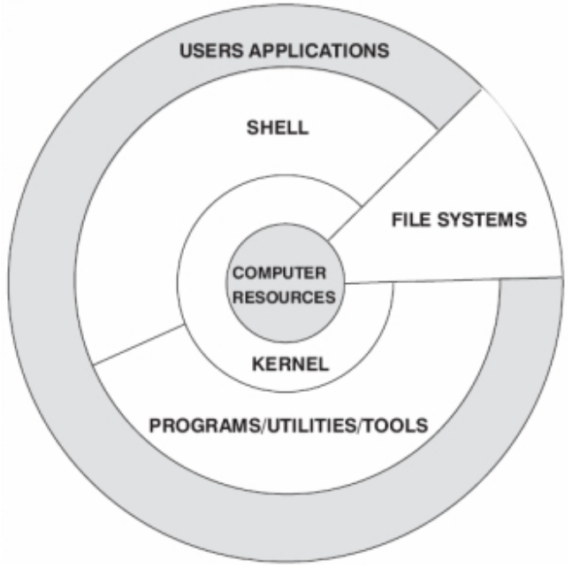

-  内核：是系统的心脏，是运行程序和管理像磁盘和打印机等硬件设备的核心程序。
-  Shell：是系统的用户界面，提供了用户和内核进行交互操作的一种接口。它接收用户输入的命令并把它 送入内核去执行，是一个命令解释器。但它不仅是命令解释器，而且还是高级编程语言，shell编程。 
- FILE SYSTEMS(文件系统)：文件系统是文件存放在磁盘等存储设备上的组织方法，Linux支持多种文件 系统，如ext3,ext2,NFS,SMB,iso9660等 
- 应用程序：标准的Linux操作系统都会有一套应用程序例如X-Window,Open Office等 

####  Linux目录结构 

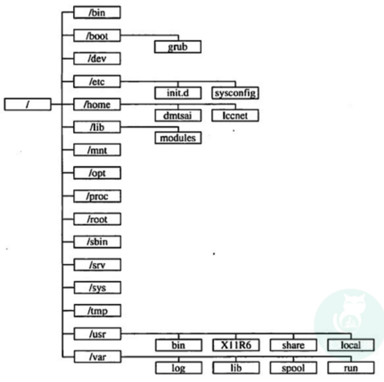

```
/boot：系统引导文件、内核
/bin：用户的基本命令
/dev：设备文件
/etc：配置文件
/home：用户目录
/root：root用户目录
/sbin：管理类的基本命令
/tmp：临时文件存放地
/usr：共享的只读数据
/mnt：临时文件系统挂载点
/media：移动设备挂载点
/opt：第三方应用程序的安装位置
/srv：系统运行的服务用到的数据
/var：变化的数据文件
/proc：用于输出内核与进程信息相关的虚拟文件系统
/sys：用于输出当前系统上硬件设备相关信息的虚拟文件系统
```


### 4  常用Linux命令的基本使用 

#### 常用快捷键 

```markdown
1) tab键：命令或者路径提示及补全;

2) ctrl+c：放弃当前输入，终止当前任务或程序；

3) ctrl+l：清屏；

4) ctrl + insert：复制；

5) 鼠标右键：粘贴；

6) alt+c ：断开连接 / ctrl + shfit + R 重新连接

7) alt+1/2/3/4/5… ：切换会话窗口

8) 上下键：查找执行行过的命令,或者是history命令

```


####  终端命令格式 

```
command [-options] [parameter]

说明:
command : 命令名, 相应功能的英文单词或单词的缩写
[-options] : 选项, 可用来对命令进行控制, 也可以省略
parameter : 传给命令的参数, 可以是 零个、一个 或者 多个

```


####  帮助命令 

 因为一个命令有很多可选项 ， 死记硬背肯定不行, 所以需要借助手册查阅.  

#####  help 帮助信息 

```markdown
command --help

说明:
显示 command 命令的帮助信息

缺点: 虽然可以查询命令的帮助信息, 但是没有提供 翻页、搜索功能.

```

##### mac手册

```
man command

说明:
查询 command 命令的使用手册
man 时 manual 的缩写, 是Linux提供的一个手册, 包含了绝大部分的命令、函数的详细使用说明.

```

 使用 man 时的操作键:  

| 操作键   | 功能                 |
| -------- | -------------------- |
| 空格键   | 显示手册的下一屏     |
| Enter键  | 一次滚动首页也得一行 |
| b        | 回滚一屏             |
| f        | 前滚一屏             |
| q (quit) | 退出                 |
| /word    | 搜索word字符串       |
| n(next)  | 搜索下一个           |
| N        | 搜索上一个           |

 提醒: 

- 现阶段只需要 知道 通过以下两种方式可以查询命令的帮助信息 
- 先学习 **常用命令** 及 **常用参数** 的使用即可, 工作中如果遇到问题可以借助 **网络搜索** 


####  其他常用命令 

| 命令           | 对应英文                | 作用                     |
| -------------- | ----------------------- | ------------------------ |
| ls             | list                    | 查看当前目录下的内容     |
| pwd            | print working derectory | 查看当前所在文件夹       |
| cd [目录名]    | change directory        | 切换文件夹               |
| touch [文件名] | touch                   | 如果文件不存在, 新建文件 |
| mkdir [目录名] | make directory          | 创建目录                 |
| rm [文件名]    | remove                  | 删除指定的文件名         |
| clear          | clear                   | 清屏                     |


####  目录操作命令 

 Linux中并没有文件夹的概念，应该叫目录。 

#####   切换目录 

```markdown
* cd(change directory) 功能: 切换目录
        cd ..  切换到上级目录
        cd -   后退到上一次所在目录
        cd /   去根目录
        相对路径：直接目录，从当前目录开始
        绝对路径：/开始的目录，从根目录开始
	
* pwd(print work directory) 功能: 显示当前工作目录
```


####  查看目录内容 

```markdown
* ls(list) 功能: 列出目录内容
    ls -a(all)     查看全部内容，包含隐藏文件
    ls -lh(human)  以人能看懂的方式显示文件大小
    ls -l          查看内容的详细信息，效果等同于ll命令
    ls -R          树结构显示某文件夹下的所有文件（包括子文件夹 ）
```


####  创建文件 

 通过 touch 命令 创建文件  

```
* 第一步: 创建一个空白文件
touch 不存在的文件

* 第二步: 修改文件的末次访问时间
touch 存在的文件

案例：
[root@lagou ~]# touch test.txt
```


####  创建目录命令 

 通过 mkdir 命令 创建目录 

基本语法  

```
mkdir [-p] 要创建的目录
```

| 选项 | 英文   | 含义             |
| ---- | ------ | ---------------- |
| -p   | parent | 可以递归创建目录 |

```markdown
[root@lagou ~]# mkdir test
[root@lagou ~]# mkdir -p test/test1

* 注意
        通过 mkdir -p 目录名 命令 创建目录
        新建目录的名称 不能与当前目录中 已有的目录或文件同名

```


####   rmdir 删除一个空的目录  

```markdown
* 基本语法：
    rmdir 要删除的空目录，remove 即移除

* 案例
[root@lagou ~]# mkdir test2
[root@lagou ~]# rmdir test2

* 注意
    如果该目录中存在文件或其他目录是该命令是不能删除的
```


####  touch创建文件和rm 删除文件 

```markdown
* 创建文件的命令
    touch 文件名称

	注意事项:
        touch 文件名1 文件2 .. 可以创建多个文件

* 删除命令
	rm [-参数] 文件/目录 （功能描述：递归删除目录中所有内容）慎用
	通过 rm -rf 文件/目录 命令实现删除 文件和目录的功能, rm 对应的英文是 remove 含义: 删除

* 案例 
    1）删除空目录
    [root@lagou test]# rmdir test1
    2）递归删除目录中所有内容
    [root@lagou test]# rm -rf test2

```


####   cp 复制拷贝命令 

 通过 cp 实现复制将指定的 文件 或 目录 复制到 两一个 文件 或 目录中  

```markdown
* 基本语法
    （1）cp source dest （功能描述：复制source文件到dest）
    （2）cp -r sourceFolder targetFolder （功能描述：递归复制整个文件夹）
    
* 案例
	（1）复制文件
    [root@lagou opt]# cp test.txt test1.txt
    （2）递归复制整个文件夹
    [root@lagou opt]# cp -r abc /tmp
```


####  mv (move) 

 通过 mv 命令可以用来 移动 文件 或 目录, 也可以给 文件或目录重命名  

```markdown
* 基本语法
	（1）mv oldNameFile newNameFile （功能描述：重命名）
    （2）mv /temp/movefile /targetFolder （功能描述：递归移动文件）
    
* 案例：
    1）重命名
    [root@lagou test]# mv file1 file11 （把file1文件夹改名为file11）
    2）移动文件
    [root@lagou test]# mv file11 test （把file11文件夹放到test文件夹内
```


####  cat 查看文件内容 

 查看文件内容，从第一行行开始显示。 

```markdown
* 基本语法
	cat [选项] 要查看的文件

* 选项
    -b ：列出行号，仅针对非空白行做行号显示，空白行不标行号！
    -E ：将结尾的断行行字节 $ 显示出来；
    -n ：列出行号，连同空白行也会有行号，与 -b 的选项不不同；
    -T ：将 [tab] 按键以 ^I 显示出来；
    -v ：列出一些看不出来的特殊字符
    -A ：相当于 -vET 的整合选项，可列列出一些特殊字符而不不是空白而已
    
* 案例
	查看内容
    [root@localhost usr]# cat abc.txt
    babbaba
    abababab
    ababbabaZZ
    查看添加-A
    [root@localhost usr]# cat -A abc.txt
    babbaba$
    abababab$
    ababbabaZZ$
    查看添加-b
    [root@localhost usr]# cat -b abc.txt
    1 babbaba
    2 abababab
    3 ababbabaZZ
    查看添加-E
    [root@localhost usr]# cat -E abc.txt
    babbaba$
    abababab$
    ababbabaZZ$
    查看内容添加-n
    [root@localhost usr]# cat -n abc.txt
    1 babbaba
    2 abababab
    3 ababbabaZZ
    查看内容添加-T
    [root@localhost usr]# cat -T abc.txt
    babbaba
    abababab
    ababbabaZZ
    查看内容添加-v
    [root@localhost usr]# cat -v abc.txt
    babbaba
    abababab
    ababbabaZZ

```


####  more 查看文件内容 

 查看文件内容，一页一页的显示文件内容。 

```markdown
* 基本语法：
    more 要查看的文件
    
* 功能使用说明
	空格键 (space)：代表向下翻一页；
    Enter:代表向下翻『一行』；
    q代表立刻离开 more ，不再显示该文件内容。
    Ctrl+F 向下滚动一屏
    Ctrl+B 返回上一屏
    = 输出当前行的行号

* 案例
	[root@lagou test1]# more test1.java

```


####  less 查看文件内容 

 less 的作用与 more 十分相似，都可以用来浏览文字档案的内容，不同的是 less 允许使用[pageup] [pagedown]往回滚动。 

```markdown
* 基本语法：
    less 要查看的文件
    
* 功能使用说明
    空格键 ：向下翻动一页；
    [pagedown]：向下翻动一页；
    [pageup] ：向上翻动一页；
    /字符串 ：向下搜寻『字符串』的功能；n：向下查找；N：向上查找；
    q ：离开 less 这个程序；
    
* 案例
	[root@lagou test1]# less test1.java
```


####  head查看文件内容 

 查看文件内容，只看头几行，优点：对于大文件不必都加载，只显示头几行行即可。 

```markdown
* 基本语法
    head 文件名 ：查看前10行
    head -n 3 文件名 ：查看文件的前3行
    head -c 3 文件名 ：查看文件的前3个字符

```


####  tail 查看文件内容 

 查看文件内容，只看尾巴几行行，优点：可以查看⽂文件实时追加的内容。 

```markdown
* 基本语法
    （1）tail -n 10 文件 （功能描述：查看文件头（从末尾开始数）10行行内容，10可以是任意行行数）
    （2）tail -f 文件 （功能描述：实时追踪该文档的所有更更新）

* 案例
    1 查看文件后10行内容
    2 动态追踪文件内容
    3 动态追踪 最后10行内容 且 退出
* 答案
    tail -10 文件名
    tail -f 文件名
    tail -10f 文件名 (ctrl + c 是退出)
```


####  组合命令 

Linux中的命令组合后，可以产生神奇的效果！

append追加

replace替换，覆盖

##### 重置输出>和>>

```markdown
>   重定向输出
>>  重定向输出，又追加功能

示例
 cat /etc/passwd > a.txt   将输出定向到a.txt中
 cat /etc/passwd >> a.txt  输出并且追加
```

echo控制台输出的内容（类似sout）

```markdown
1 删除 /usr/tmp/目录下的所有内容
[root@spark01 tmp]# rm -rf *

2 增加 1.txt文件, 内容: 文本 1
[root@spark01 tmp]# touch 1.txt && ls
1.txt
[root@spark01 tmp]# echo hello > 1.txt && cat 1.txt
hello

3 增加 2.txt文件, 内容: 文本 2
[root@spark01 tmp]# touch 2.txt && ls
1.txt 2.txt
[root@spark01 tmp]# echo world > 2.txt && cat 2.txt
world

4 将2.txt内容 复制粘贴到 3.txt
[root@spark01 tmp]# touch 3.txt && ls
1.txt 2.txt 3.txt
[root@spark01 tmp]# cat 2.txt > 3.txt && cat 3.txt
world

5 将1.txt内容 复制粘贴到 3.txt(缺点: 产生替换效果)
[root@spark01 tmp]# cat 1.txt > 3.txt && cat 3.txt
hello

6 将2.txt内容 复制追加粘贴到 3.txt中
[root@spark01 tmp]# cat 2.txt >> 3.txt && cat 3.txt
hello
world

7 将ifconfig内容 追加到 3.txt中
[root@spark01 tmp]# ifconfig >> 3.txt
[root@spark01 tmp]# cat 3.txt
hello
world
eth0 Link encap:Ethernet HWaddr 00:0C:29:0E:3F:05
inet addr:192.168.220.200 Bcast:192.168.220.255 Mask:255.255.255.0
inet6 addr: fe80::20c:29ff:fe0e:3f05/64 Scope:Link
UP BROADCAST RUNNING MULTICAST MTU:1500 Metric:1
RX packets:12903 errors:0 dropped:0 overruns:0 frame:0
TX packets:10765 errors:0 dropped:0 overruns:0 carrier:0
collisions:0 txqueuelen:1000
RX bytes:1189753 (1.1 MiB) TX bytes:3324044 (3.1 MiB)
Interrupt:19 Base address:0x2000
lo Link encap:Local Loopback
inet addr:127.0.0.1 Mask:255.0.0.0
inet6 addr: ::1/128 Scope:Host
UP LOOPBACK RUNNING MTU:16436 Metric:1
RX packets:0 errors:0 dropped:0 overruns:0 frame:0
TX packets:0 errors:0 dropped:0 overruns:0 carrier:0
collisions:0 txqueuelen:0
RX bytes:0 (0.0 b) TX bytes:0 (0.0 b)
```

#####  管道 “|” 

 管道符号| 的作用是: 将一个命令的输出作为另一个命令的输入.  

```markdown
ps(Process Status) 进程状态 ps -ef
grep(Global Regular Expression Print) 全局正则表达式版本(搜索)

1 分页查询 ls的帮助信息(回车键 下一行, 空格键 下一页, ctrl +c 退出)
ls --help | more

2 查询ls帮助信息中包含'递归'的指令
ls --help | grep '递归'

```

#####  逻辑控制&& 

- 命令之间使用&&连接，实现类似逻辑与的功能
- 只有在&&左边的命令运行成功时，&&右边的命令才会被执行
- 只要左边的命令运行失败，后面的命令就不会被执行

```markdown
* 因为 启动软件通常不会打印启动的日志信息, 所以需要再打开对应的日志信息查看.

* 分
    tail -100f catalina.out
    ./startup.sh

* 使用合并指令
    ./startup.sh && tail -100f catalina.out

* 缺点：比较麻烦. 解决: 使用&&指令就可以一步到位

这个经常把一些命令组合使用，比如我们在启动tomcat后，再用tail命令查看日志。如果启动失败，则不查看
./startup.sh && tail -50f ../logs/catalina.out

```

####  history查看所敲命令历史 

```markdown
* 基本语法：
	history

```


### 5 打包和解包命令

#### 打tar包

-  类似将 冬天的衣服 放到 袋 
- 打包之后的大文件 需要以 .tar 结尾.  

```
tar打包命令格式

# 将 一系列文件 打包成 一个大文件
tar -cvf 打包名.tar 被打包的目录
tar -cvf 打包名.tar 被打包的文件1 被打包的文件2 被打包的文件3

```

| 命令 | 英文              | 含义                                                        |
| ---- | ----------------- | ----------------------------------------------------------- |
| c    | create            | 生成档案文件, 创建打包文件                                  |
| v    | verbosely(啰嗦的) | 像 '唐僧' 一样报告进度                                      |
| f    | file              | 指定档案的文件名称, f后面一定是 .tar 文件, 所以必须放到左后 |


####  解tar包 

-  类似将 冬天的衣服 从 袋子里取出来 

```
# 将一个打包后的 分解成 一系列小文件, 分解位置为 当前目录
tar -xvf 打包名.tar
# 将一个打包后的 分解成 一系列小文件, 分解位置为 指定目录
tar -xvf 打包名.tar -C 解包路径位置

```

| 命令       | 英文              | 含义                                                         |
| ---------- | ----------------- | ------------------------------------------------------------ |
| x          | extract (提取)    | 解包                                                         |
| C (大写 C) | directory (目 录) | 默认保存到当前目录, 通过 -C 更改解压目录, 注意: 解压目录必须 存在 |


####   gzip格式 压缩 和 解压缩 

-  打包 和 压缩 是两件事 
- 类似与 先将冬天衣服放到压缩袋, 再抽取里面的空气 
- 在 Linux 中, 最常用的压缩文件格式是 xxx.tar.gz 
- 在 tar 命令中有一个选项 -z 可以调用 gzip , 从而可以方便的实现压缩和解压缩的功能 

```
# 压缩文件
tar -zcvf 打包压缩文件名.tar.gz 被压缩的文件/目录
# 解压缩文件
tar -zxvf 打包文件.tar.gz
# 解压缩到指定路径
tar -zxvf 打包文件.tar.gz -C 目录路径

```

| 命令 | 英文  | 含义                  |
| ---- | ----- | --------------------- |
| z    | gzip  | 使用gzip压缩和解压缩  |
| j    | bzip2 | 使用bzip2压缩和解压缩 |


####   bzip2 格式 压缩 和 解压缩 

-  bzip 是压缩的第二种方式 
- 类似与 先将冬天衣服放到压缩袋, 再抽取里面的空气 
- 在 Linux 中, bzip2 压缩文件格式是 xxx.tar.bz2 
- 在 tar 命令中有一个选项 -j 可以调用 bzip2 , 从而可以方便的实现压缩和解压缩的功能 

```
# 压缩文件
tar -jcvf 打包压缩文件名.tar.bz2 被压缩的文件/目录
# 解压缩文件 (绩效潍坊)
tar -jxvf 打包文件.tar.bz2
# 解压缩到指定路径
tar -jxvf 打包文件.tar.bz2 -C 目录路径

注意事项: 如果报错tar (child): bzip2：无法 exec: 没有那个文件或目录
要安装bzip2的包
yum install -y bzip2
```

| 命令 | 英文  | 含义                  |
| ---- | ----- | --------------------- |
| z    | gzip  | 使用gzip压缩和解压缩  |
| j    | bzip2 | 使用bzip2压缩和解压缩 |


### 6 时间日期	 

####  date 显示当前时间	 

基本语法：注意命令与参数之间有空格

```
（1）date （功能描述：显示当前时间）
（2）date +%Y （功能描述：显示当前年年份）
（3）date +%m （功能描述：显示当前月份）
（4）date +%d （功能描述：显示当前是哪一天）
（5）date +%Y%m%d … （功能描述：显示当前年年月日各种格式 ）
（6）date "+%Y-%m-%d %H:%M:%S" 或者单引号也可以 （功能描述：显示年年⽉月⽇日时分秒）

案例
[root@lagou /]# date
[root@lagou /]# date +"%Y-%m-%d"(注意date后面有个空格再加 )
[root@lagou /]# date "+%Y-%m-%d %H:%M:%S"(注意date后面有个空格再加 ；注意%d空格%H)
显示的是字符串串描述的时间，不是当前时间。
```


####  date显示非当前时间	 

显示的是字符串串描述的时间，不是当前时间。

```
基本语法：
（1）date -d '1 days ago' （功能描述：显示前一天日期）
（2）date -d yesterday +"%Y-%m-%d"（同上）
（3）date -d next-day +"%Y-%m-%d" （功能描述：显示明天日期）
（4）date -d 'next monday' （功能描述：显示下周一时间）

案例：
[root@lagou /]# date -d '1 days ago'
2020年年 04月 01日 星期三 21:07:22 CST
[root@lagou /]# date -d 'next monday'
2020年年 04月 01日 星期三 00:00:00 CST

```

#### 设置系统时间	 

```
1）	基本语法：
date -s 字符串时间

2）	案例
[root@hadoop106 /]# date -s "2020-06-20 20:52:18"

```

####  cal查看日历	 

```
1）	基本语法：
cal [选项] （功能描述：不加选项，显示本月日历）

选项：
-3 ，显示系统前一个月，当前月，下一个月的日历
具体某一年年，显示这一年年的日历。

2）	案例：
[root@lagou /]# cal
[root@lagou /]# cal -3
[root@lagou /]# cal 2020
```

 

### 7 搜索查找	 

#### find 查找文件或者目录	 

find命令是根据文件的属性进行查找，如文件名，文件大小，所有者，所属组，是否为空，访问时间，修改时间等。 
基本格式：`find  path [options]`

##### 按照文件名查找

```
(1)find /etc -name yum.conf #在/etc目录下文件yum.conf
(2)find /etc -name 'yum' #使用通配符*(0或者任意多个)。表示在/etc目录下查找文件名中含有字符串‘yum’的文件(3)find . -name 'yum*' #表示当前目录下查找文件名开头是字符串‘yum’的文件
```

##### 按照文件特征查找     

```
(1)find / -atime -2   # 查找在系统中 后48小时访问的文件 (Access Time，文件读取访问时间)
(2)find / -empty      # 查找在系统中为空的文件或者文件夹
(3)find / -group susan   # 查找在系统中属于group为susan的文件
(4)find / -mtime -1   #查找在系统中 后24小时里修改过的文件 (modify time)
(5)find / -user susan   #查找在系统中属于susan这个用户的文件
(6)find / -size +10000c  #查找出大于10000字节的文件(c:字节，w:双字，k:KB，M:MB，G:GB)
(7)find / -size -1000k   #查找出小于1000KB的文件
```

#####    使用混合查找方式查找文件

**参数有： ！，-and(-)，-or(-o)。**

```
(1)find /tmp -size +10c -and -mtime +2   #在/tmp目录下查找大于10字节并在2天前修改的文件
(2)find / -user root -or -user susan    #在/目录下查找用户是root或者susan的文件文件
(3)find /tmp ! -user susan              #在/tmp目录中查找所有不属于susan用户的文件
```

#### grep 过滤查找	 

grep是根据文件的内容进行查找，会对文件的每一行按照给定的模式(patter)进行匹配查找。 
基本格式：grep [options] 范围

##### 主要参数

```
[options]主要参数：
－c：只输出匹配行的计数。
－i：不区分大小写
－n：显示匹配行及行号。
-w:显示整个单词
```


### 8 vi编辑器	 

-  在Linux下一般使用vi编辑器来编辑文件。
-  vi既可以查看文件也可以编辑文件。 
- 而vim是vi的升级版本，具备更多的功能.
-  vi如果目标文件不存在，会创建新的文件。但是如果新文件没做编辑，退出后还会消失。 

#### vi的三种模式介绍	 

 


编辑模式(插入模式)：对文本进行输入和修改底行模式：退出vim或者查找、替换功能
命令模式(一般模式)：通过快捷命令操作数据，打开vi默认就是命令模式

> 如果vim命令不能使用需要安装:
> yum -y install vim-enhanced

####  编辑模式	 

命令模式按下：

- i、o、a进入编辑模式： 
  - i：光标不动 
  - o：另起一行
  - a：光标到下一个字符

按ESC退出编辑模式,进入命令模式

####  底行模式	 

命令模式下，按‘：’或者‘/’进入底行模式，可以输入命令

##### 退出vim:(重点重点重点)

- :q  	 	 未编辑时退出vim
- :q!  	 	 编辑后，退出并且不保存
- :wq   编辑后，退出且保存
- :x                       编译后保存

##### 撤销上次操作(扩展---一般模式下)

```
u 撤销上一次操作(ctrl + z windows操作)

ctrl + r 恢复上一次被撤销的操作 (ctrl + y windows操作)
```

##### 设置行号(了解)  底行模式

- :set nu  显示行号
- :set nonu  不显示行号

##### 替换文本(了解)

- :s/old/new/ 用new替换old，替换当前行的第一个匹配
- :s/old/new/g 用new替换old，替换当前行的所有匹配
- :%s/old/new/ 用new替换old，替换所有行的第一个匹配
- :%s/old/new/g 用new替换old，替换整个文件的所有匹配

##### 查找 (一般模式)

- /文本  	 搜索指定文本，高亮显示，按n显示下一个，按N显示前一个
- :整数  	 快捷跳转到指定行

##### 命令模式(一般模式)	 

- p(pause)  将之前dd或yy的数据粘贴到光标位置 yy 	 	 	 复制光标所在行
- 5yy    复制光标及下面共5行 dd    剪切当前行
- 5dd  	 剪切光标及下面共5行

### 9 用户及组管理	 

#### useradd 添加新用户	 

(注意:当前用户必须有添加用户的权限)

```
1）	基本语法：
useradd 用户名 （功能描述：添加新用户）

2）	案例：
[root@lagou ~]# useradd hadoop

```

#### passwd 设置用户密码	 

```
1）	基本语法：
passwd 用户名 （功能描述：设置用户密码）

2）	案例
[root@lagou ~]# passwd hadoop

```

####  id 判断用户是否存在	 

```
1）	基本语法：
id 用户名

2）	案例：
[root@lagou ~]#id hadoop
```

#### su 切换用户	 

```
1）	基本语法：
su 用户名称 （功能描述：切换用户，只能获得用户的执行行权限，不能获得环境变量）
su - 用户名称 （功能描述：切换到用户并获得该用户的环境变量及执行权限）

2）	案例
[root@lagou ~]#su hadoop
[root@lagou ~]#su - hadoop

```

#### userdel 删除用户	 

```
1）	基本语法：注意区别
（1）userdel 用户名 （功能描述：删除用户但保存用户主目录）
（2）userdel -r 用户名 （功能描述：用户和用户主目录，都删除）

2）	案例：
（1）删除用户但保存用户主目录
[root@lagou ~]#userdel hadoop
（2）删除用户和用户主目录，都删除
[root@lagou ~]#userdel -r hadoop

```

#### who 查看登录用户信息	 

```
1）	基本语法
（1）whoami （功能描述：显示自身用户名称）
（2）who am i （功能描述：显示登录用户的用户名）
（3）who （功能描述：看当前有哪些用户登录到了了本台机器器上）

2）	案例
[root@lagou ~]# whoami
[root@lagou ~]# who am i
[root@lagou ~]# who

```

#### 设置Linux普通用户具有root权限即sudo的使用 

1. sudo命令
   sudo是linux系统管理指令，是允许系统管理员让普通用户执行一些或者全部的root命令的一个工具，如halt，reboot，su等等。这样不仅减少了root用户的登录 和管理时间，同样也提高了安全性 。

2. 修改配置文件
   修改 /etc/sudoers 文件，找到下面一行，在root下面添加一行，

   如下所示： vim /etc/sudoers

   ```
   ## Allow root to run any commands anywhere
   root ALL=(ALL) ALL
   tom ALL=(ALL) ALL
   
   ```

   

3. 使用tom用户登录,操作管理员命令

   本质:使用临时管理员权限

   ```
   #不切换root用户,也可以完成添加用户的功能
   sudo useradd lisi
   sudo passwd lisi
   ```

   

#### cat /etc/passwd 查看创建了哪些用户	 

```
cat /etc/passwd
```

####  用户组管理命令	 

每个用户都有一个用户组，系统可以对一个用户组中的所有用户进行集中管理。不同Linux 系统对用户组的规定有所不同，如Linux下的用户属于与它同名的用户组，这个用户组在创建用户时同时创建。
用户组的管理涉及用户组的添加、删除和修改。组的增加、删除和修改实际上就是对/etc/group文件的更新

#####  groupadd 新增组	 

```
1）	基本语法
groupadd 组名

2）	案例：添加一个hadoop组
[root@lagou ~]#groupadd hadoop

```

##### groupdel删除组	 

```
1）	基本语法：
groupdel 组名

2）	案例
[root@lagou ~]# groupdel hadoop

```

##### groupmod修改组	 

```
1）	基本语法：
groupmod -n 新组名 老组名

2）	案例
修改hadoop组名称为hadoop1
[root@lagou hadoop]# groupmod -n hadoop1 hadoop

```

#####  cat /etc/group 查看创建了哪些组	 

```
cat /etc/group
```

#### usermod修改用户	 

```
1）	基本语法：
usermod -g 用户组 用户名

2）	案例：
将用户hadoop加入mygroup用户组
[root@lagou ~]#usermod -g mygroup hadoop
```


### 10 文件权限	 

Linux系统是一种典型的多用户系统，不同的用户处于不同的地位，拥有不同的权限。为了保护系统的安全性，Linux系统对不同的用户访问同一文件（包括目录文件）的权限做了不同的规定。在Linux中我们可以使用ll或者ls –l命令来显示一个文件的属性以及文件所属的用户和组。

#### 文件权限	 

 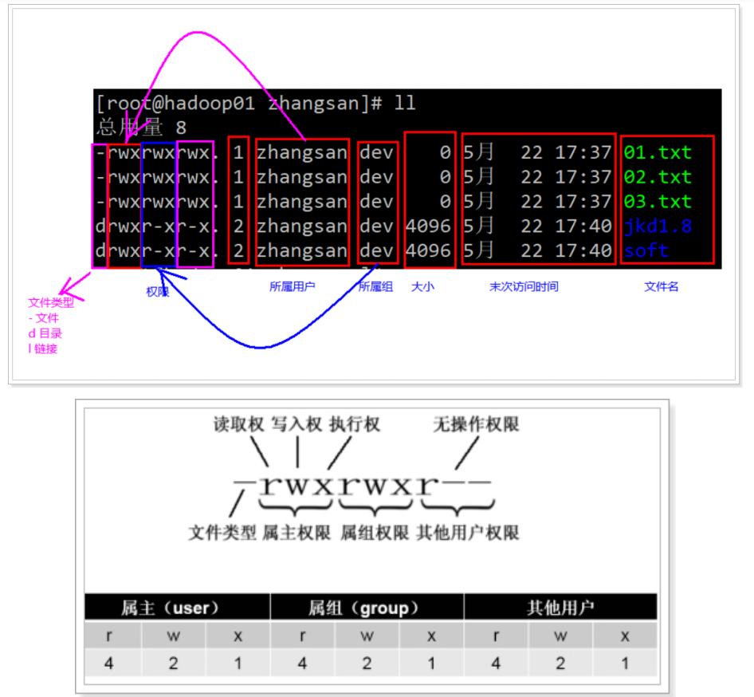

- 权限分段，每一段代表不同的用户：
  - 属主权限：当前文件所属用户的权限，在Linux中每一个文件都有所属的
  - 用户属组权限：当前文件的用户所在组的其它成员的权限
  - 其它用户权限：跟文件所属用户不在同组的其它用户的权限

```
每一段中的内容都是一样的，分别限定：读（r=4）、写（w=2）、执行（x=1）
rwx 7 具备所有权限(421)
rw- 6 具备读写权限(420)
r-x 5 具备读和执行权限(401)
r-- 4 具备只读权限(400)
-wx 3 具备写和执行权限(021)
-w- 2 具备写权限(020)
--x 1 具备执行权限(001)
--- 0 000
```


```
问题:
1 777 什么意思?
2 644 什么意思
3 755 什么意思?

答案
777 所属用户具有 读写执行权限, 所属同组用户具有 读写执行权限, 其他人具有 读写执行权限
644 所属用户具有 读写权限, 所属同组用户具有 读权限, 其他人具有 读权限
755 所属用户具有 读写执行权限, 所属同组用户具有 读执行权限, 其他人具有 读执行权限
```


#### 文件权限管理	 

```
修改文件权限
chmod 修改文件权限
	chmod 755 a.txt
	chmod u=rwx, g=rx, o=rx a.txt
	上面两种方式是等效的，讲a.txt这个文件修改为
		所属用户具备所有权限：rwx=7
		本组用户具备渡河执行权限：rx=5
		其他用户具备读和执行权限：rx=5

需求
1 新增 /usr/tmp/1.txt 文件 且 查看 权限
2 修改权限为 777(方式一)
3 修改权限为 755(方式二)

答案
[root@lagou tmp]# touch /usr/tmp/1.txt
[root@lagou tmp]# ll
总用量 0
-rw-r--r--. 1 root root 0 7月 24 05:15 1.txt
[root@lagou tmp]# chmod 777 1.txt
[root@lagou tmp]# ll
总用量 0
-rwxrwxrwx. 1 root root 0 7月 24 05:15 1.txt
[root@lagou tmp]# chmod u=rwx,g=rx,o=rx 1.txt
[root@lagou tmp]# ll
总用量 0
-rwxr-xr-x. 1 root root 0 7月 24 05:15 1.txt

```


#### chown改变所有者	 

```
1）	基本语法：
chown 最终用户 （功能描述：改变文件或者目录的所有者）

2）	案例
[root@lagou test]# chown hadoop test1.txt
[root@lagou test]# ls -al

```

10.4 chgrp改变所属组	 

```
1）	基本语法：
chgrp 最终用户组 （功能描述：改变文件或者目录的所属组）

2）	案例
[root@lagou test]# chgrp hadoop test1.test
[root@lagou test]# ls -al
-rwxr-xr-x. 1 root hadoop 551 4月 23 13:02 test1.java
```

### 11 系统管理与进程管理	

####   磁盘信息  

| 序号 | 命令             | 作用                            |
| ---- | ---------------- | ------------------------------- |
| 1    | df -h            | disk free 显示磁盘剩余空间      |
| 2    | du -h [目录名称] | disk usage 显示目录下的目录大小 |


  选项说明

| 参数 | 含义                       |
| ---- | -------------------------- |
| -h   | 以人性化的方式显示文件大小 |


####  ps查看系统中所有进程	 

进程是正在执行的一个程序或命令，每一个进程都是一个运行的实体，都有自己的地址空间，并占用一定的系统资源。 

```
1）基本语法：
ps -aux （功能描述：查看系统中所有进程）

选项		含义
 a		 显示终端上的所有进程, 包括其他用户的进程
 u		 显示进程的详细状态
 x		 显示没有控制终端的进程

注意:
ps aux 和ps -ef  两者的输出结果差别不大，但展示风格不同。aux是BSD风格，-ef是System V风格 

2）功能说明
USER：该进程是由哪个用户产生的
PID：进程的ID号
%CPU：该进程占用CPU资源的百分比，占用越高，进程越耗费资源；
%MEM：该进程占用物理理内存的百分比，占用越高，进程越耗费资源；
VSZ：该进程占用虚拟内存的大小，单位KB；
RSS：该进程占用实际物理理内存的大小，单位KB；
TTY：该进程是在哪个终端中运行行的。其中tty1-tty7代表本地控制台终端，tty1-tty6是本地的字符界面终端，tty7是图形终端。pts/0-255代表虚拟终端。
STAT：进程状态。常见的状态有：R：运行、S：睡眠、T：停止状态、s：包含子进程、+：位于后台
START：该进程的启动时间
TIME：该进程占用CPU的运算时间，注意不是系统时间
COMMAND：产生此进程的命令名

```

#### top查看系统健康状态	 

-  基本命令 ` top [选项]  `

  1.  选项

     ```
     -d 秒数：指定top命令每隔几秒更新。默认是3秒。
     -i：使top不显示任何闲置或者僵死进程。
     -p：通过指定监控进程ID来仅仅监控某个进程的状态。
     ```

     

  2.  操作选项，即在执行top命令之后，与top命令进行交互： 

     ```
     P： 以CPU使用率排序，默认就是此项
     M：以内存的使用率排序
     N： 以PID排序
     q： 退出top
     ```

     

  3.  查询结果字段解释 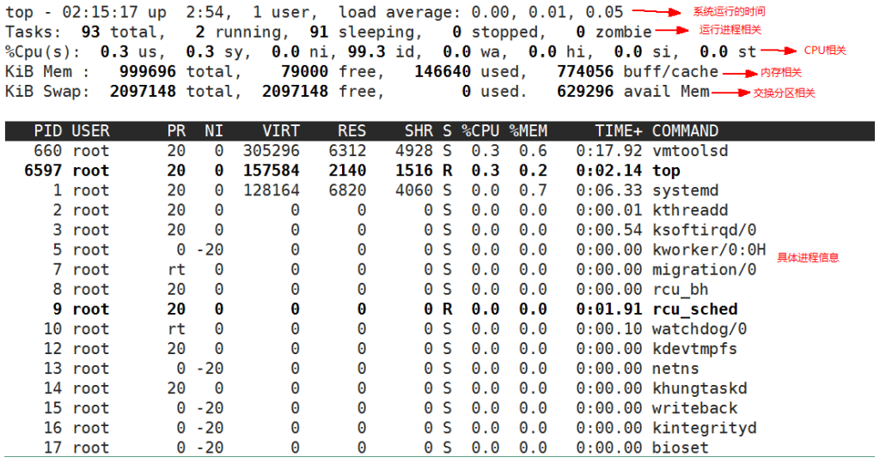

     1. 第一行信息为任务队列列信息

        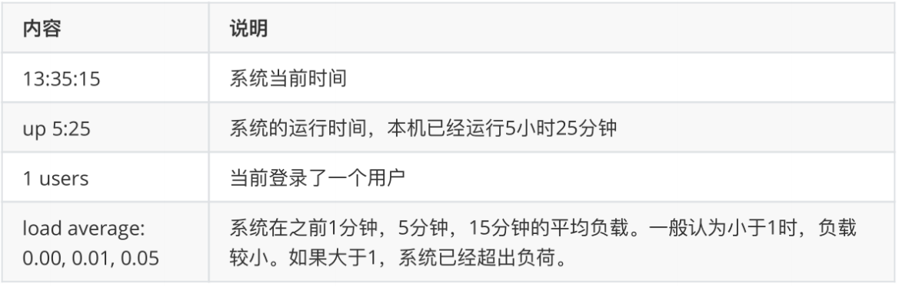

     2. 第二行为进程信息

        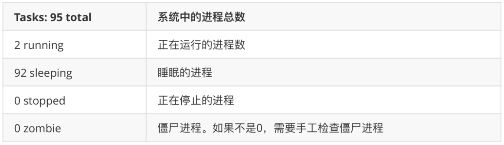

     3. 第三行为CPU信息

        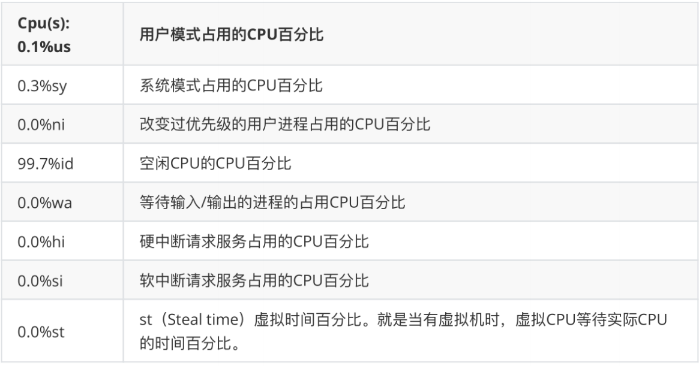

     4. 第四行为物理内存信息

        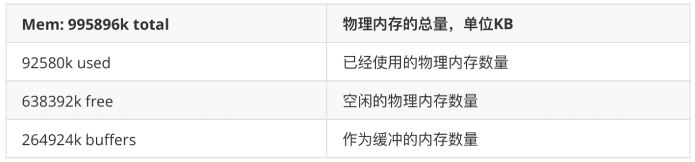

     5. 第五行为交换分区（swap）信息

        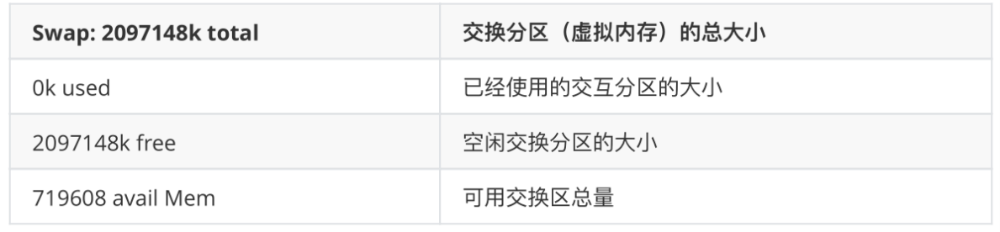

- 案例 

  ```
  [root@lagou hadoop]# top -d 1
  [root@lagou hadoop]# top -i
  [root@lagou hadoop]# top -p 2575
  
  - 执行上述命令后，可以按P、M、N对查询出的进程结果进行排序
  ```

#### kill终止进程	 

```
1）基本语法：
kill -9 pid进程号

选项
-9 表示强迫进程立即停止举例:
[root@lagou ~]# kill -9 5102

```

#### netstat显示网络统计信息	 

1. netstat作用
   netstat命令用于显示与IP、TCP、UDP和ICMP协议相关的统计数据，一般用于检验本机各端口的网络连接情况 

2. 安装命令

   ```
   yum install net-tools
   ```

   

3. 基本语法

   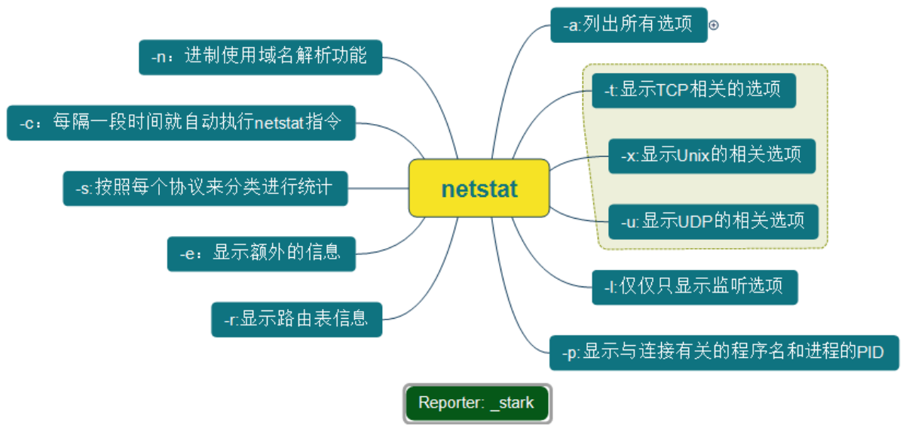

   

```
 选项： 
NETSTAT [-a] [-b] [-e] [-n] [-o] [-p proto] [-r] [-s] [-v] [interval]
-a 显示所有连接和监听端口。
-e 显示以太网统计信息。它列出的项目包括传送的数据报的总字节数、错误数、删除数、数据报的数量和广播的数量
-n 以数字形式显示地址和端口号。
-o 显示与每个连接相关的所属进程 ID 。
-p proto 显示 proto 指定的协议的连接；proto 可以是下列协议之一: TCP 、UDP 、TCPv6 或 UDPv6 。

常用选项
netstat -e 本选项用于显示关于以太网的统计数据。
netstat -r 本选项可以显示关于路由表的信息，类似于后面所讲使用route print 命令时看到的 信息。除了显示有效路由外，还显示当前有效的连接。
netstat -a 本选项显示一个所有的有效连接信息列表，包括已建立的连接（ESTABLISHED ），也包括监听连接请求（LISTENING ）的那些连接，断开连接（CLOSE_WAIT ）或者处于联机等待状态的（TIME_WAIT ）等
netstat -n 显示所有已建立的有效连接。

组合用法:
netstat -anp 查看这个系统目前网络状况.

查看端口22的使用情况
[root@lagou hadoop-2.7.2]# netstat -anp | grep 22
 
```

### 12 软件安装	 

#### rpm 软件包管理器	 

#####  目标	 

- 通过 rpm命令 实现对软件 的安装、查询、卸载 
- RPM  是Red-Hat Package Manager（RPM软件包管理器）的缩写虽然 打上了 red-hat 的标记, 但是理念开放, 
- 很多发行版都采用, 已经成为行业标准


##### 路径	 

1. 第一步: rpm包 的查询命令

   | 选项 | 英文  | 含义                      |
   | ---- | ----- | ------------------------- |
   | -q   | query | 查询                      |
   | -a   | all   | 所有                      |
   | -i   | info  | 信息                      |
   | -l   | list  | 显示所有相关文件          |
   | -f   | file  | 文件, 显示文件对应 rpm 包 |

   ```
   查询已安装的rpm列表
   rpm -qa | grep XXX
   rpm -qa | less
   
   查询软件包信息
   rpm -qi 软件全包名
   
   查看一个rpm包中的文件安装到那里去了？
   rpm -ql 软件全包名
   
   查看指定文件归属于那个软件包
   rpm -qf 文件的全路径
   ```

   

2. 第二步: rpm包 的 卸载

   | 命令                       | 英文                     | 含义                 |
   | -------------------------- | ------------------------ | -------------------- |
   | rpm -e 软件包名称          | erase                    | 清除 卸载rpm软件包   |
   | rpm -e --nodeps 软件包名称 | Don’t check dependencies | 卸载前 跳过 依赖检查 |

   

3. 第三步: rpm包 的 安装

   | 命令                   | 含义        |
   | ---------------------- | ----------- |
   | rpm -ivh rpm包的全路径 | 安装 rpm 包 |


   | 参数 | 英文    | 含义         |
   | ---- | ------- | ------------ |
   | -i   | install | 安装         |
   | -v   | verbose | 打印提示信息 |
   | -h   | hase    | 显示安装进度 |

4. 小结

   ```
   # 1 查询
   rpm -qa | grep rpm包
   # 2 卸载
   rpm -e rpm全包名
   rpm -e --nodeps rpm全包名
   # 3 安装
   rpm -ivh rpm包的全路径
   ```

   

#### yum	 

#####  yum介绍	 

Yum（全称为 Yellow dog Updater, Modified）**本质上 也是一个 软件包管理器**。

特点: 基于 RPM 包管理，能够从指定的服务器 **自动下载、 自动安装、 自动处理依赖性关系**

#####  yum原理	 

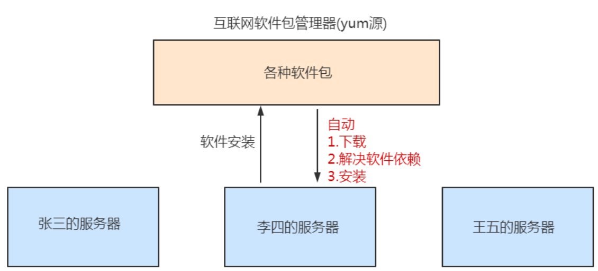

#####  常用命令	 

注意: 必须联网

| 命令                           | 含义                                       |
| ------------------------------ | ------------------------------------------ |
| yum list  \| grep 需要的软件名 | yum list显示所有已经安装和可以安装的程序包 |
| yum -y install 需要的软件包    | 下载安装                                   |
| yum -y remove 需要卸载的软件包 | 卸载                                       |
| yum repolist                   | 列出设定yum源信息                          |
| yum clean all                  | 清除yum缓存信息                            |


#### 安装httpd软件	 

	安装httpd:
	yum -y install httpd
	
	启动 httpd 服务
	service httpd start
	
	测试
	http://192.168.80.100:80
	
	问题: 发现无法访问?
	
		原因: 因为 linux 的防火墙 禁止他人 访问自己的80端口	 
		解决: 通知 防火墙放行
	 
	关闭防火墙
	systemctl stop firewalld 查看防火墙状态


#### 安装JDK	 

系统默认安装OpenJDK，首先需要删除OpenJDK 

1. 查看以前是不是安装了openjdk 

   如果不是root用户需要切换到root用户（su - root）

   命令：`rpm -qa | grep java`
   显示如下：（有则卸载，没有就不用），注意版本可能会有些不一样，以实际操作的为准。

   ```
   tzdata-java-2013g-1.el6.noarch
   java-1.7.0-openjdk-1.7.0.45-2.4.3.3.el6.x86_64
   java-1.6.0-openjdk-1.6.0.0-1.66.1.13.0.el6.x86_64
   ```

   

2. 卸载openjdk：

   （其中参数“tzdata-java-2013j-1.el6.noarch”为上面查看中显示的结果，粘进来就行，如果你显示的不一样，请复制你查询到的结果）
   rpm -e --nodeps java-1.6.0-openjdk-1.6.0.0-1.66.1.13.0.el6.i686 

   rpm -e --nodeps java-1.7.0-openjdk-1.7.0.45-2.4.3.3.el6.i686

    rpm -e --nodeps tzdata-java-2013g-1.el6.noarch

   ```
   -e          erase package(uninstall)            移除包(卸载)
   --nodeps    do not verify package dependencies  不要验证包依赖关系
   ```

   

3. 安装jdk
   1. 切换到root用户并进入usr目录： cd /usr

   2. 在usr目录下创建java文件夹： mkdir java

   3. 将jdk-7u71-linux-x64.tar.gz拷贝或上传到java目录下（也可以用工具）

   4. 进入/usr/java文件夹下：cd /usr/java/

   5. 修改权限，参数“jdk-7u71-linux-x64.tar.gz”为你自己上传的jdk安装文件
      chmod 755 jdk-7u71-linux-x64.tar.gz

   6. 解压：tar –zxvf jdk-7u71-linux-x64.tar.gz

   7. 配置环境变量

      ```
      vi /etc/profile
      
      添加内容：
      export 主要用来设置环境变量
      
      export JAVA_HOME=/usr/java/jdk1.8.0_141/
      export
      CLASSPATH=.:${JAVA_HOME}/jre/lib/rt.jar:${JAVA_HOME}/lib/dt.jar:${JAVA_HOME}/lib
      /tools.jar
      export PATH=$PATH:${JAVA_HOME}/bin
      
      ```

      

   8.  重新编译环境变量 

      ```
      source /etc/profile
      ```

      

   9. 测试

      ```
      java -version
      ```

      


#### 安装tomcat	 

安装Tomcat

1. 创建安装目录：mkdir /usr/tomcat

2. 给apache-tomcat-7.0.57.tar.gz 文件权限

3. 压tomcat压缩文件：tar -zxvf apache-tomcat-7.0.57.tar.gz -C /user/tomcat

   注意，这里也可以只打开tomcat所需端口：8080

4.  启动tomcat： 

   ```
   进入tomcat的bin目录： cd /usr/tomcat/apache-tomcat-7.0.57/bin/
   启动tomcat web服务器： ./startup.sh
   访问： 192.168.80.100:8080
   ```

5.  停止tomcat ：`./shutdown.sh`

6. 查看tomcat日志信息：

   ```
   tail -200f /usr/tomcat/apache-tomcat-7.0.57/logs/catalina.out
   
   200表示 后显示行数
   也可以用组合命令，启动并查看日志：
   进入tomcat的bin目录
   ./startup.sh && tail -200f ../logs/catalina.out
   
   ```

   

### 13 大数据linux操作	 

####  克隆2台机器	 

 VMware克隆


​                   

#####  配置克隆后机器	 

```
网络配置文件ifcfg-ens33的ip地址
vi /etc/sysconfig/network-scripts/ifcfg-ens33

重启网卡服务器
systemctl restart network

检查ip地址是否更变
ip addr
 	hostname主机名，不要跟源克隆机一致
查看主机名命令
hostnamectl

更改主机名
hostnamectl set-hostname xxx

重启机器 reboot
```

####  关闭三台虚拟机防火墙	 

```
1.查看防火墙状态
systemctl status firewalld

2.设置防火墙停用状态
systemctl stop firewalld

3.设置防火墙功能失效,开机自动关闭
systemctl disable firewalld
```

####  三台机器关闭selinux	 

安全增强型 Linux（Security-Enhanced Linux）简称 SELinux，它是一个 Linux 内核模块，也是 Linux 的一个安全子系统。 

关闭安全策略否则SELinux服务开启后导致SSH连接异常。

修改文件

```
vi /etc/selinux/config

SELINUX=enforcing   注释掉
SELINUX=disabled  添加
```

 

####   三台机器免密登录	 

##### ssh协议[安全外壳协议]	 

>  SSH 为 Secure Shell 的缩写，由 IETF 的网络小组（Network Working Group）所制定；SSH 为建立在应用层基础上的安全协议。SSH 是较可靠，专为远程登录会话和其他网络服务提供安全性的协议。利用 SSH 协议可以有效防止远程管理过程中的信息泄露问题。

SSH提供两种级别的安全验证：

第一种级别（基于口令的安全验证） 

只要你知道自己帐号和口令，就可以登录到远程主机。所有传输的数据都会被加密，但是不能保证你正在连接的服务器就是你想连接的服务器。可能会有别的服务器在冒充真正的服务器，也就是受到“中间人”这种方式的攻击。

第二种级别（基于密匙的安全验证） 

需要依靠密匙，也就是你必须为自己创建一对密匙，并把公用密匙放在需要访问的服务器上。如果你要连接到
SSH服务器上，客户端软件就会向服务器发出请求，请求用你的密匙进行安全验证。

##### ssh基于密码远程登录	 

```
ssh ip地址	登录到远程指定的机器上（需要输入用户名和密码）

可以通过主机名登录
需要配置主机名和ip地址的映射关系
分别的在centos7-1 centos7-2 centos7-3中配置
vi /etc/hosts

```

#####  ssh基于秘钥实现免密登录

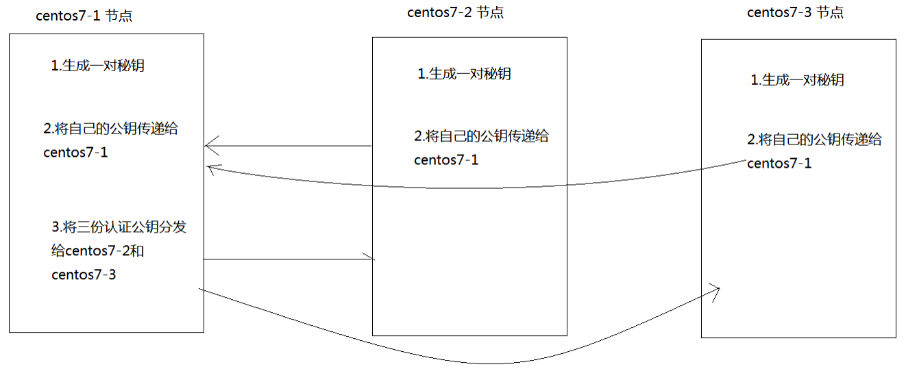

```
前提：配置hostname与IP映射
第一步：在三台机器器执行行以下命令，生成公钥与私钥
第二步：将centos7-2和centos7-3的公钥拷贝到centos7-1
第三步：再将centos7-1的公钥分发给centos7-2和centos7-3

第一步: ssh-keygen -t rsa 在centos7-1和centos7-2和centos7-3上面都要执行，产生公钥和私钥
第二步：在centos7-1 ,centos7-2和centos7-3上执行:
	ssh-copy-id centos7-1 将公钥拷贝到centos7-1上面去
第三步：
    scp authorized_keys centos7-2:$PWD
    scp authorized_keys centos7-3:$PWD

使用ssh完成免密登录即可 （ssh centos7-2）

```

#### 三台机器时钟同步	 

##### 原理	 

内网的所有服务器都和时钟服务器进行同步时间

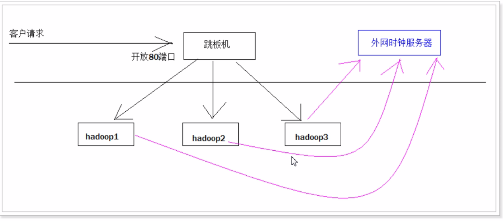

##### 如何同步	 

1. 查看本机当前时间

   ```
   date
   ```

   

2. 设置本机当前时间

   ```
   date -s "2018-08-17 20:08:09"
   ```

   

3. 通过命名和时钟服务器同步时间:

   ```
   网络计时协议（NTP） : net time protocal
   
   ntpdate us.pool.ntp.org
   ```

4.	编辑定时任务

   ```
   crontab -e
   
   1) 定时任务内容如下
   */1 * * * * /usr/sbin/ntpdate us.pool.ntp.org;    每隔1分钟执行指令一次
   
   ```

   

**Crontab使用**

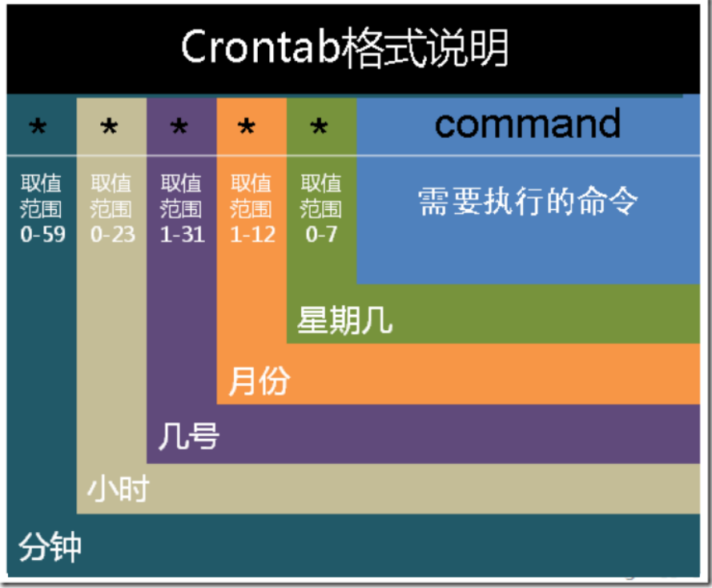


```
格式说明
# Example of job definition:
# .---------------- minute (0 - 59)
# | .------------- hour (0 - 23)
# | | .---------- day of month (1 - 31)
# | | | .------- month (1 - 12) OR jan,feb,mar,apr ...
# | | | | .---- day of week (0 - 6) (Sunday=0 or 7) OR
sun,mon,tue,wed,thu,fri,sat
# | | | | |
# * * * * * user-name command to be executed

使用实例
实例1：每1分钟执行一次command
命令：* * * * * command
实例2：每小时的第3和第15分钟执行
命令：3,15 * * * * command
实例3：在上午8点到11点的第3和第15分钟执行
命令：3,15 8-11 * * * command
实例4：每隔两天的上午8点到11点的第3和第15分钟执行
命令：3,15 8-11 */2 * * command
实例5：每个星期一的上午8点到11点的第3和第15分钟执行
命令：3,15 8-11 * * 1 command
```

>  Crantab在线生成 https://cron.qqe2.com/  


### 14 Shell编程	 

#### 简介	 

 Linux中的shell脚本是一个特殊的应用程序，它介于操作系统和系统内核之间，充当一个命令解释器的角色。负责接收用户输入的操作指令并进行解释，将需要执行的操作传递给内核执行，并输出执行结果。 同时它又是一种程序设计语言。作为命令语言，它交互式解释和执行用户输入的命令或者自动地解释和执行预先设定好的一连串的命令；作为程序设计语言，它定义了各种变量和参数，并提供了许多在高级语言中才具有的控制结构，包括循环和分支。 
Linux 的 Shell 解释器 种类众多，一个系统可以存在多个 shell，可以通过 cat /etc/shells 命令查看系统中安装的
shell解释器。
Bash 由于易用和免费，在日常工作中被广泛使用。同时，Bash 也是大多数Linux 系统默认的 Shell。

#### 14.2 shell 解释器	 

java 需要 虚拟机解释器, 同理 shell脚本也需要 解析器

```
[root@node04 shells]# cat /etc/shells
/bin/sh
/bin/bash
/sbin/nologin
/bin/dash
/bin/tcsh
/bin/csh
```

#### 快速入门	 

#####  编写脚本	 

新建 /usr/shell/hello.sh 文件

```shell
#!/bin/bash
echo 'hello lagou'
```

!是一个约定的标记，它告诉系统这个脚本需要什么解释器来执行，即使用哪一种 Shell。

echo 命令用于向窗口输出文本。

#####  执行shell脚本	 

- 执行方式1

```
[root@centos7-1 shell]# vim hello.sh
[root@centos7-1 shell]# /bin/sh hello.sh
hello lagou
[root@centos7-1 shell]# /bin/bash hello.sh
hello lagou


问题: bash 和 sh 是什么关系?
sh 是 bash 的 快捷方式
```

- 执行方式2


```
[root@node04 shells]# bash hello.sh
hello world
[root@node04 shells]# sh hello.sh
hello world

1.查看环境变量path:
echo $PATH
2.添加执行权限
chmod +x  文件名称
```

#### 变量	

在shell脚本中, 定义变量时，变量名不加美元符号（$），如：` username="tom`  

注意 : 变量名和等号之间不能有空格，这可能和你熟悉的所有编程语言都不一样。

同时，变量名的命名须遵循如下规则：

- 命名只能使用英文字母，数字和下划线，首个字符不能以数字开头。
- 中间不能有空格，可以使用下划线（_）。
- 不能使用标点符号。
- 不能使用bash里的关键字（可用help命令查看保留关键字）。

```
有效的 Shell 变量名示例如下：
JACK
LD_LIBRARY_PATH
_demo
var2

无效的变量命名：
?var=123
user*name=runoob
```


使用语句给变量赋值举例:

```
for file in`ls /etc`
或
for file in $(ls /etc)

以上语句是将/etc下目录的文件名循环出来
```


##### **使用变量**

使用一个定义过的变量，只要在变量名前面加美元符号即可，如：

```
your_name="tom"
echo $your_name
echo ${your_name}

变量名外面加花括号是可选的, 添加花括号是帮助解释器识别变量边界

habby="i like ${course}script"
habby="i like $coursescript"
```

##### **只读变量**

```
使用readyonly命令可以将变量定义为只读变量, 只读变量的值不能被改变
readonly 变量名

举例:
username=tom
readonly username
username=jack 报错 /bin/sh: NAME: This variable is read only.
```

 

##### **删除变量**

```
使用unset命令可以删除变量
unset variable_name

注意:unset命令不能删除只读变量
```

 

####  字符串	 

字符串是shell编程中 常用 有用的数据类型（除了数字和字符串，也没啥其它类型好用了），字符串可以用单引号，也可以用双引号，也可以不用引号。

##### 单引号

```shell
skill='java'
str='I am goot at $skill'
echo $str
```

输出结果为:

```
I am goot at $skill
```

- 单引号字符串的限制：
  - 单引号里的任何字符都会原样输出，单引号字符串中的变量是无效的；
  - 单引号字串中不能出现单独一个的单引号（对单引号使用转义符后也不行）

#####  双引号

```shell
skill='java'
str="I am goot at $skill"
echo $str
```

输出结果为：

```
I am goot at java
```

- 双引号的优点：
  - 双引号里可以有变量
  - 双引号里可以出现转义字符

##### 获取字符串长度

```shell
skill='java'
echo ${skill} # 输出结果: java
echo ${#skill} # 输出结果: 4
```

##### 提取子字符串

一下实例从字符串第2个字符开始截取4个字符

```shell
str="i like hadoop"
echo ${str:2} #substring(2)
echo ${str:2:2} #substring(2,2)
```

##### 查找子字符串

查找字符o在那个位置(先出现的字符)

```shell
str="hadoop is so easy"
echo `expr index "$str" o`
```

找的时候是从1开始查找

####  运算符	 

Shell 和其他编程一样，支持包括：算术、关系、布尔、字符串等运算符。原生 bash 不支持 简单的数学运算，但是可以通过其他命令来实现，例如expr。expr 是一款表达式计算工具，使用它能完成表达式的求值操作。

例如，两个数相加 

```
val=`expr 1 + 2`
echo $val

注意：
表达式和运算符之间要有空格，例如 1+2 是不对的，必须写成 1 + 2。
完整的表达式要被 ` 包含，注意不是单引号，在 Esc 键下边。
下表列出了常用的算术运算符，假定变量 a 为 10，变量 b 为 20：
```


##### 算数运算符	 

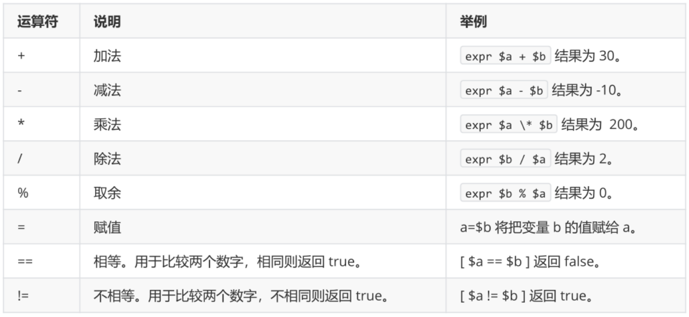

 注意：条件表达式要放在方括号之间，并且要有空格，例如: [$a==$b]是错误的，
必须写成[ $a == $b ]。

案例

```shell
#!/bin/bash
a=4
b=20
#加法运算
each expr $a + $b
#减法运算
echo expr $a - $b
#乘法运算，注意*号前面需要反斜杠
echo expr $a \* $b
#除法运算
echo $a / $b
此外，还可以通过(())、$(())、$[]进行算术运算。
((a++))
echo "a = $a"
c=$((a + b))
d=$[a + b]
echo "c = $c"
echo "d = $d"
```

#####  关系运算符	 

关系运算符只支持数字，不支持字符串，除非字符串的值是数字。

下表列出了常用的关系运算符，假定变量 a 为 10，变量 b 为 20：

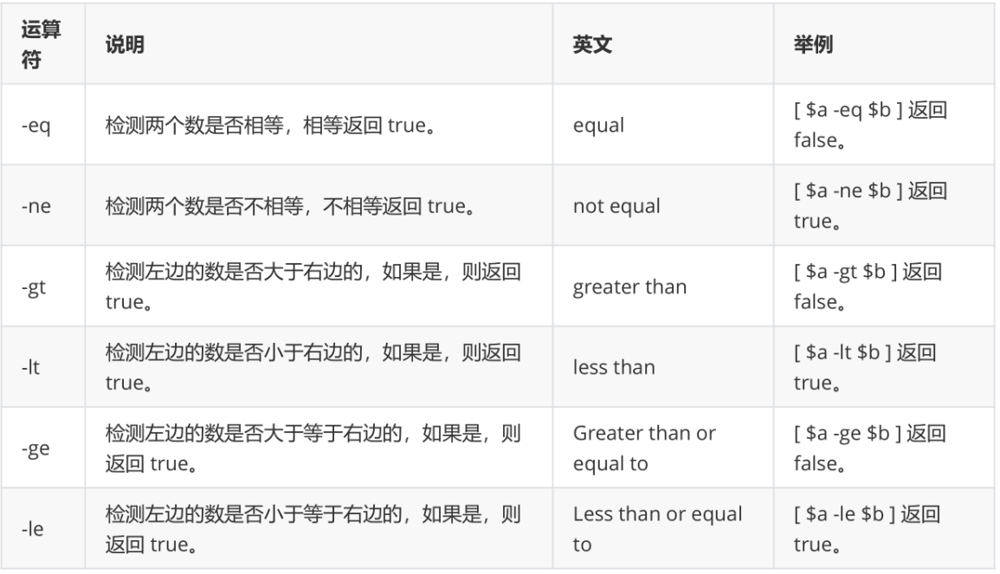

#### 流程控制	 

#####  if语句	 

-  if语句格式 

  ```shell
  if condition
  then
      command1
      command2
      ...
      commandN
  fi
  
  ```

-  if.else语句  

  ```shell
  if condition
  then
      command1
      command2
      ...
      commandN
  else
      command
  fi
  
  ```

-  if..elif..else  

  ```shell
  if condition1
  then
      command1
  elif condition2
  then
      command2
  else
      commandN
  fi
  
  ```

-  案例 

  ```shell
  [root@lagou export]# cat if_test.sh
  #!/bin/bash
  a=20
  b=10
  
  # 需求1: 判断 a 是否 100
  if [ $a > 100 ]; then
  echo "$a 大于 100"
  fi
  
  # 需求2: 判断 a 是否等于 b
  if [ $a -eq $b ]; then
  echo "$a 等于 $b"
  else
  echo "$a 不等于 $b"
  fi
  
  # 需求3: 判断 a 与 b 比较
  if [ $a -lt $b ]; then
  echo "$a 小于 $b"
  elif [ $a -eq $b ]; then
  echo "$a 等于 $b"
  else
  echo "$a 大于 $b"
  fi
  
  # 需求4: 判断 (a + 10) 和 (b * b) 比较大小
  if test $[ a + 10 ] -gt $[ b * b ]; then
  echo "(a+10) 大于 (b * b)"
  else
  echo "(a+10) 小于或等于 (b*b)"
  fi
  ```


  


#####  for 循环	 

格式

```shell
for variable in (list); do
command
command
...
done

```


练习

```
# 需求1: 遍历 1~5
# 需求2: 遍历 1~100
# 需求3: 遍历 1~100之间的奇数
# 需求4: 遍历 根目录 下的内容

```

```shell
[root@lagou export]# cat for_test.sh
#!/bin/bash

# 需求1: 遍历 1~5
for i in 1 2 3 4 5; do
echo $i;
done

# 需求2: 遍历 1~100
for i in {1..100}; do
echo $i
done

# 需求3: 遍历 1~100之间的奇数
for i in {1..100..2}; do
echo $i
done

# 需求4: 遍历 根目录 下的内容
for f in `ls /`; do
echo $f
done

```

##### while 语句	 

while循环用于不断执行一系列命令，也用于从输入文件中读取数据；命令通常为测试条件。其格式为

```
while condition; do
    command
done

```

需求: 计算 1~100 的和

```shell
#!/bin/bash

sum=0
i=1
while [ $i -le 100 ]; do
    sum=$[ sum + i]
    i=$[ i + 1 ]
done
echo $sum

#运行脚本，输出：5050
```


##### 无限循环	

```
for ((;;))
do
    command
done
while true
do
    command
done
```


 

#### case	 

Shell case语句为多选择语句。可以用case语句匹配一个值与一个模式，如果匹配成功，执行相匹配的命令。

case语句格式如下：

```shell
case 值 in
    模式1)
        command1
        command2
        ...
        commandN
        ;;
    模式2）
        command1
        command2
        ...
        commandN
        ;;
esac

```

case工作方式如上所示。取值后面必须为单词in，每一模式必须以右括号结束。取值可以为变量或常数。匹配发现取值符合某一模式后，其间所有命令开始执行直至 ;;。
取值将检测匹配的每一个模式。一旦模式匹配，则执行完匹配模式相应命令后不再继续其他模式。如果无一匹配模式，使用星号 * 捕获该值，再执行后面的命令。
下面的脚本提示输入1到4，与每一种模式进行匹配：

```shell
echo '输入 1 到 4 之间的数字:'
read aNum
case $aNum in
    1) echo '你选择了 1'
    ;;
    2) echo '你选择了 2'
    ;;
    3) echo '你选择了 3'
    ;;
    4) echo '你选择了 4'
    ;;
    *) echo '你没有输入 1 到 4 之间的数字'
    ;;
esac

```

输入不同的内容，会有不同的结果，例如：

```
输入 1 到 4 之间的数字:
你输入的数字为:
3
你选择了 3
```

#### 跳出循环	 

在循环过程中，有时候需要在未达到循环结束条件时强制跳出循环，Shell使用两个命令来实现该功能： 

break和 continue。

##### break命令	 

break命令允许跳出所有循环（终止执行后面的所有循环）。
需求: 执行死循环 每隔1秒打印当前时间, 执行10次停止

```shell
#!/bin/bash
# 需求: 执行死循环 每隔1秒打印当前时间, 执行10次停止
i=0;
while true; do
        sleep 1
        echo $i `date +"%Y-%m-%d %H:%M:%S"`
        i=$[ i + 1]
        if [ $i -eq 10 ]; then
            break
        fi
done

```

#####  continue	 

continue命令与break命令类似，只有一点差别，它不会跳出所有循环，仅仅跳出当前循环。
需求: 打印 1~30, 注意 跳过3的倍数

```shell
#!/bin/bash
# 需求: 打印 1~30, 注意 跳过3的倍数
for i in {1..30}; do
    if test $[ i % 3 ] -eq 0; then
        continue
    fi
    echo $i
done
```

####  函数使用	 

#####  函数的快速入门	 

```shell
[ function ] funname()
{
    action;
    [return int;]
}
```

-  可以带function fun() 定义，也可以直接fun() 定义,不带任何参数。  
-   参数返回，可以显示加：return 返回，如果不加，将以 后一条命令运行结果，作为返回值。 
  return后
  跟数值n(0-255) 

**快速入门**

```shell
#!/bin/bash
demoFun(){
    echo "这是我的第一个 shell 函数!"
}
echo "-----函数开始执行-----"
demoFun
echo "-----函数执行完毕-----"

```

14.10.2 传递参数给函数	 
在Shell中，调用函数时可以向其传递参数。在函数体内部，通过 $n 的形式来获取参数的值，例如，$1 表示第一个参数，$2表示第二个参数...
带参数的函数示例：

```shell
#!/bin/bash
funWithParam(){
    echo "第一个参数为 $1 !"
    echo "第二个参数为 $2 !"
    echo "第十个参数为 $10 !"
    echo "第十个参数为 ${10} !"
    echo "第十一个参数为 ${11} !"
    echo "参数总数有 $# 个!"
    echo "作为一个字符串输出所有参数 $* !"
}
funWithParam 1 2 3 4 5 6 7 8 9 34 73

```

输出结果：

```
第一个参数为 1 !
第二个参数为 2 !
第十个参数为 10 !
第十个参数为 34 !
第十一个参数为 73 !
参数总数有 11 个!
作为一个字符串输出所有参数 1 2 3 4 5 6 7 8 9 34 73 !
```

 